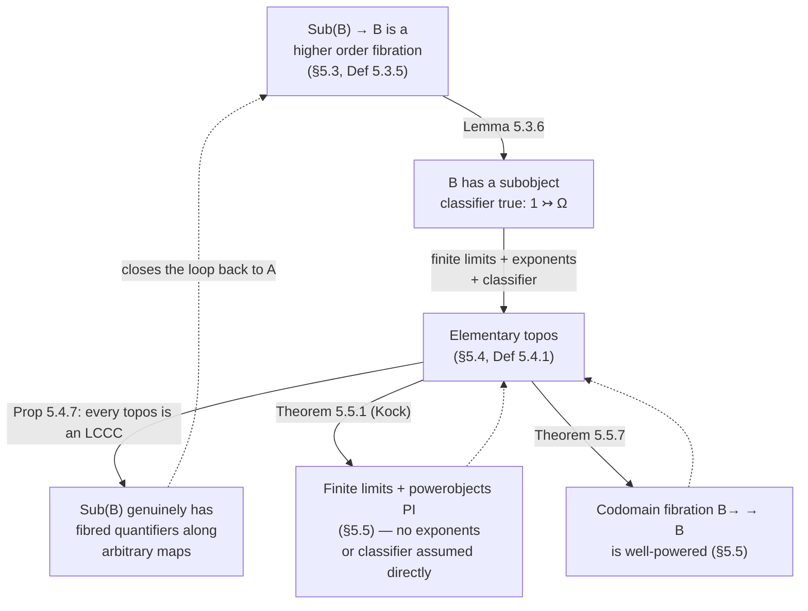

[[book-guidelines|↩ Back to guidelines]]

# Toposes

## Where this picks up

[[Higher-Order-Predicate-Logic]] covers §5.1 (turning `Prop` into a type) and the first half of §5.2 ([[Full-Higher-Order-Dependent-Type-Theory#The definition|the definition]] of a **generic object**, and [[Higher-Order-Predicate-Logic#The fibred Yoneda lemma|the fibred Yoneda lemma]] needed to make sense of it for non-split fibrations). That article ends with the single load-bearing fact this one builds on: a generic object $T \in \mathbb{E}$ over $\Omega = pT \in \mathbb{B}$ is a distinguished object such that

$$\forall X \in \mathbb{E}.\; \exists! u : pX \to pT.\; u^*(T) \cong X$$

— every object of the total category is, uniquely up to the chosen classifying map $u$, a reindexing of one universal object. Read semantically: $\Omega$ is a type such that maps into it correspond exactly to "predicates," and $T$ is the tautological predicate that every other predicate is a pullback of.

This article asks the question the book answers across §§5.2–5.5: **what happens when you demand that this generic-object story holds specifically for the subobject fibration of an ordinary category $\mathbb{B}$?** The answer is one of the most re-derivable ideas in category theory — a **topos** — and the book is unusually good at showing *why* it admits three genuinely different-looking but provably equivalent definitions, rather than just listing them. That triangulation (logical, elementary, and powerobject/well-poweredness-based) is the spine of this article.

---

## 1. Higher order fibrations and triposes (§5.3)

### From generic objects to a model of higher order logic

A **higher order fibration** (Definition 5.3.1) is deliberately minimal:

> a first order fibration, plus a generic object, plus a Cartesian closed base category.

Unpack why each ingredient is doing exactly what higher order logic needs and nothing more. "First order fibration" already gives you fibred $\top, \bot, \wedge, \vee, \supset$ and fibred quantification $\exists_\pi \dashv \pi^* \dashv \forall_\pi$ along projections — everything §4's [[First-Order-Predicate-Logic|first order predicate logic]] needs. What first order fibrations *cannot* express is quantification over predicates themselves (`Prop`-as-a-type), and exponent types (`Prop`-valued function types, i.e. higher order terms). The generic object supplies the first gap exactly as advertised in [[Higher-Order-Predicate-Logic]]: it's the fibred incarnation of `Prop`. Cartesian closedness of the base supplies the second: it's what makes $\sigma \to \mathrm{Prop}$ (a term-level exponent) interpretable at all, since exponents live in the *base* category once `Prop` has been reified as an object $\Omega \in \mathbb{B}$ rather than a fibre-level construct.

Nothing more is required — no extra axiom schema, no separate "higher order connective" apparatus. This is the same pattern you saw in §5.1: higher order logic is first order logic's proof theory, replayed inside a base category rich enough to host `Prop` as one of its own objects.

**Two worked examples (5.3.2).** For a frame (complete Heyting algebra) $X$, the family fibration $\mathrm{Fam}(X) \to \mathbf{Sets}$ is a *split* higher order fibration, with $X$ itself as the split generic object (this is Example 5.2.3(i)/(ii) from the predecessor article, now checked against the new definition). Similarly the realizability fibration $\mathrm{UFam}(P\mathbb{N}) \to \mathbf{Sets}$ is a split higher order fibration with generic object $P\mathbb{N} \in \mathbf{Sets}$ — but the book flags immediately that this one is *not* a model of higher order logic with **extensional entailment**: two realizability predicates $P, Q : J \to P\mathbb{N}^I$ can have realizers witnessing $P(j)(i) \supset Q(j)(i)$ and $Q(j)(i) \supset P(j)(i)$ for every $i,j$ *and still not be equal as predicates*, because a nonempty realizer set $\varphi \subseteq \mathbb{N}$ signifies "true," while $\varphi = \top = P\mathbb{N}$ signifies "trivially, unconditionally true" — and those are different sets. Concretely, $P = \lambda j.\lambda i.\{0\}$ and $Q = \lambda j.\lambda i.\{1\}$ are interderivable but distinct.

**What breaks without generic objects specifically.** Without a generic object, a first order fibration with a Cartesian closed base still lets you form exponent *objects* $J^I$ in $\mathbb{B}$, but there's no way to interpret a *term* $x{:}\sigma \vdash \varphi(x) : \mathrm{Prop}$ as living in an actual type, because there is no object of $\mathbb{B}$ that plays the role of $\mathrm{Prop}$. You'd be stuck being able to model $\lambda$-terms of ordinary types, but never a term whose type is "the type of propositions" — which is precisely the higher-order gap §5.1 diagnosed syntactically.

### Triposes: adding Beck–Chevalley

A **tripos** (Definition 5.3.3, following Hyland–Johnstone–Pitts and Pitts) is a higher order fibration over $\mathbf{Sets}$ satisfying **Beck–Chevalley** for the simple products/coproducts along *arbitrary* functions $u$ (not just projections). Two things are worth being precise about:

- Every higher order fibration already gets $\coprod_u, \prod_u$ along arbitrary $u$ for free, by the general first-order-fibration machinery (change of base along the graph of $u$, then simple quantification along a projection) — see §4.3. What's *not* automatic is that these derived adjoints satisfy Beck–Chevalley; a tripos is exactly the higher order fibration where they do.
- Beck–Chevalley isn't needed to model higher order **simple** predicate logic at all — it only becomes necessary once you want *dependent* predicate logic (quantifiers ranging over dependent types, not just simple types), which the book defers to §11.2.

**Example 5.3.4 (triposes from PCAs) — the mechanism, not just [[Realizability-Models-Omega-Sets-and-PERs#The definition|the definition]].** This is the section's richest worked example and worth walking through because it is literally an algorithm for building a model of higher order logic out of an untyped computation model. Start with a **partial combinatory algebra** $(A, \cdot)$: a set with a partial binary application and combinators $K, S$ satisfying $Kxy \simeq x$, $Sxyz \simeq xz(yz)$ (Kleene equality $\simeq$: either both sides are undefined, or both are defined and equal). This buys you **combinatory completeness**: every "polynomial" term built from variables, constants, and application is realized by some fixed $a \in A$ — i.e. $A$ has enough structure to interpret an untyped $\lambda$-calculus, via Schönfinkel's abstraction elimination ($\lambda x.x = SKK$, $\lambda x.M = KM$ when $x \notin \mathrm{FV}(M)$, $\lambda x.MN = S(\lambda x.M)(\lambda x.N)$).

Predicates on a set $I$ are then taken to be functions $\varphi : I \to \mathcal{P}A$ — for each $i \in I$, a *subset of realizers* rather than a single truth value. Entailment is uniform realizability:

$$\varphi \vdash \psi \iff \left(\bigcap_{i \in I} \varphi(i) \supset \psi(i)\right) \neq \emptyset$$

where $X \supset Y := \{f \in A \mid \forall a \in X.\ f{\cdot}a{\downarrow} \text{ and } f{\cdot}a \in Y\}$ — a *single* realizer $a$ must witness the implication uniformly across every $i \in I$. This uniformity requirement is exactly what makes the resulting entailment relation into a preorder rather than an arbitrary relation, and it is the reason a proof-relevant realizer, not just a truth value, is the unit of semantic content here — this is the Curry–Howard/BHK reading of intuitionistic logic taken as the *definition* of truth, not as a metatheorem about it. The connectives are literally programs manipulating realizers: $\varphi \wedge \psi$ pairs realizers, $\varphi \vee \psi$ tags them (a realizer for a disjunction is a realizer for one side plus a flag saying which), $\varphi \supset \psi$ is realizer-transformers. Beck–Chevalley for the resulting $\coprod_u, \prod_u$ holds by direct calculation with these realizer sets.

Instantiating $A = (\mathbb{N}, \cdot)$ with Kleene application recovers exactly the **realizability tripos** $\mathrm{UFam}(P\mathbb{N}) \to \mathbf{Sets}$ from Example 4.2.6/5.3.2. But the same construction runs over *any* PCA — including models of the untyped $\lambda$-calculus like $D_\infty$ or $P_\omega$ (Scott's models), producing triposes whose associated toposes (§6.1, next chapter) underlie synthetic domain theory, generic strong-normalization proofs for typed $\lambda$-calculi (via "right-absorptive C-PCAs" and modified realizability), and Lifschitz realizability. The book is explicit that triposes are mostly a *scaffolding* device — an intermediate structure used to build a topos in Chapter 6 — rather than an end in themselves, though [267] studies "tripos theory" on its own terms.

### The definition of topos, stated purely in fibred terms

Definition 5.3.5, the book's preferred definition, is austere on purpose:

> A **topos** is a category $\mathbb{B}$ with finite limits such that its subobject fibration $\mathrm{Sub}(\mathbb{B}) \to \mathbb{B}$ is a (split) higher order fibration.

Everything else — exponents, subobject classifier, powerobjects, colimits, well-poweredness — is going to turn out to be a *consequence* of this one requirement, not an independent axiom you separately have to check. That's the payoff of choosing this as the primary definition: it's the smallest statement from which the others are theorems.

**Lemma 5.3.6 — generic objects on $\mathrm{Sub}(\mathbb{B})$ are subobject classifiers.** This is the bridge lemma making the abstract definition concrete. $\mathrm{Sub}(\mathbb{B}) \to \mathbb{B}$ has a (split) generic object iff $\mathbb{B}$ has a **subobject classifier**: a monic $\mathrm{true} : 1 \rightarrowtail \Omega$ such that every mono $m : X \rightarrowtail I$ has a *unique* classifying map $\mathrm{char}(m) : I \to \Omega$ fitting a pullback square

$$
\begin{array}{ccc}
X & \longrightarrow & 1 \\
{\scriptstyle m}\downarrow & & \downarrow{\scriptstyle \mathrm{true}} \\
I & \xrightarrow[\mathrm{char}(m)]{} & \Omega
\end{array}
$$

The direction worth actually reading the proof of is "generic object $\Rightarrow \Omega_0$ (the domain of the classifying subobject) is terminal": you show it by using the identity mono $I \rightarrowtail I$ to get *some* map $I \to \Omega_0$, then uniqueness of classifying maps forces any two such maps to agree — the standard "terminal object via a universal-property squeeze" argument, run internally against the classifier's own defining property. This is the same proof shape you'd use to show any object satisfying a strict-uniqueness universal property is unique up to unique isomorphism; here it's applied reflexively to the classifier's own domain.

This lemma is doing real conceptual work: it says the historically-original Lawvere–Tierney notion ("subobject classifier," 1969, from an axiomatization of set theory and sheaf theory) *is* a generic object, just specialized to the one fibration ($\mathrm{Sub}$) that every category with finite limits automatically carries. Nothing new had to be invented for toposes specifically — the machinery is the same generic-object apparatus from §5.2, pointed at a canonical fibration.

**Lemma 5.3.7 — extensionality of entailment is free in a topos.** Recall from [[Higher-Order-Predicate-Logic]] that extensionality of entailment was an *extra rule* you had to choose to adopt for a general higher order fibration — it does not come for granted. In the subobject fibration of a topos, it's a theorem: if $f, g : J \rightrightarrows \Omega^I$ satisfy the rule's premises, then as subobjects of $J \times I$, $(\mathrm{ev} \circ f \times \mathrm{id})^*(\mathrm{true}) = (\mathrm{ev} \circ g \times \mathrm{id})^*(\mathrm{true})$, and uniqueness of classifying maps forces $\mathrm{ev} \circ f \times \mathrm{id} = \mathrm{ev} \circ g \times \mathrm{id}$, hence $f = g$. The subobject fibration's classifying maps are unique by *definition* (that's what "classifier" means), so the rule that had to be postulated axiomatically for an arbitrary fibration in §5.1 falls out automatically here.

### When the logic is classical and when it isn't: ω-Sets vs. PER

Two further examples close §5.3, and they matter because they show the generic-object machinery is *sensitive* — it correctly distinguishes categories that look superficially similar.

**ω-Sets: classical, and a higher order fibration (5.3.8–5.3.9).** Regular subobjects of $(I, E) \in \omega\text{-}\mathbf{Sets}$ correspond exactly to ordinary subsets $X \subseteq I$ (with the inherited existence predicate), and the resulting fibration $\mathrm{RegSub}(\omega\text{-}\mathbf{Sets}) \to \omega\text{-}\mathbf{Sets}$ has $\nabla 2$ (the "constant on $2 = \{\bot,\top\}$" object, via the left adjoint $\nabla : \mathbf{Sets} \to \omega\text{-}\mathbf{Sets}$ to the forgetful functor) as its split generic object — the chain of isomorphisms is: regular subobjects of $(I,E)$ $\cong$ subsets $X \subseteq I$ $\cong$ functions $I \to 2$ in $\mathbf{Sets}$ $\cong$ morphisms $(I,E) \to \nabla2$ in $\omega\text{-}\mathbf{Sets}$. The resulting logic (Proposition 5.3.9) is set-theoretically classical: negation is literal set complement, exponent is $X \Rightarrow Y = (I - X) \cup Y$, quantification along projections is the ordinary set-theoretic $\forall/\exists$. Nothing exotic survives the "regular" restriction here.

**PER: not a higher order fibration — Streicher's cardinality obstruction (5.3.10).** This is the sharpest negative result in the section, and the proof is a clean cardinality argument worth internalizing as a technique. Suppose, for contradiction, some $\Omega \in \mathbf{PER}$ were a generic object for $\mathrm{RegSub}(\mathbf{PER})$. Then for every PER $R$:

$$\mathbf{PER}(R, \Omega) \;\cong\; \mathrm{RegSub}(R) \;\cong\; \mathcal{P}(N/R)$$

(the middle isomorphism from the first-order structure of regular subobjects in PER, established earlier in §4.5; the right one is a re-statement of what a regular subobject of a quotient set is). But $\mathbf{PER}(R,\Omega)$ — like *every* homset in $\mathbf{PER}$ — is **countable**, because PER morphisms are represented by (equivalence classes of) recursive functions coded as natural numbers. Meanwhile $\mathcal{P}(N/R)$ can be **uncountable**: take $R = N = (\mathrm{Eq}(\mathbb{N}) \subseteq \mathbb{N}\times\mathbb{N})$, the natural-numbers-object PER, whose quotient $N/{\sim}N$ is just $\mathbb{N}$, so $\mathcal{P}(\mathbb{N})$ is uncountable. A countable set cannot be in bijection with an uncountable one. Contradiction — no generic object exists.

**What breaks without this distinction.** If you only checked "does $\mathrm{RegSub}(\mathbb{B})$ have finite-limit-style first order structure," both $\omega\text{-}\mathbf{Sets}$ and $\mathbf{PER}$ pass (Proposition 4.5.7 covers both uniformly). It's specifically the *generic object* requirement — a single object classifying *all* subobjects of *every* object simultaneously — that PER fails, because "all subobjects of $R$" can be too large (as a set) to be captured by *any* homset out of a fixed classifier, however you choose it, once your morphisms are constrained to be effectively computable. This is a recursion-theoretic ceiling on how much semantic content a computable representation can classify — a fact any implementer of a realizability-style model checker should have metabolized: uncountably many possible "subsets" of a computable structure cannot all be named by codes drawn from a countable index set. (The chapter later shows $\omega\text{-}\mathbf{Sets}$ *is* recoverable as the regular objects inside a genuine topos — [[The-Effective-Topos|the effective topos]] $\mathrm{Eff}$, §6.2 — so the "problem" isn't unsolvable, it's that $\mathbf{PER}$ itself, viewed with only regular subobjects, is the wrong-shaped category to host it directly.)

---

## 2. Elementary toposes (§5.4)

### The classical (Lawvere–Tierney) definition, and why it's equivalent

Definition 5.4.1 restates the topos concept without mentioning fibrations at all:

> An **(elementary) topos** is a category $\mathbb{B}$ with (i) finite limits, (ii) exponents (Cartesian closed), and (iii) a subobject classifier $\mathrm{true} : 1 \rightarrowtail \Omega$.

A **logical morphism** $F : \mathbb{B} \to \mathbb{B}'$ is a functor preserving finite limits, exponents, and the classifier (the last meaning the canonical comparison map $F\Omega \to \Omega'$ is an isomorphism).

By Lemma 5.3.6, "$\mathrm{Sub}(\mathbb{B})$ is a higher order fibration" already implies (i)+(iii) plus the base being Cartesian closed — so one direction of "these two definitions coincide" is immediate. The other direction — elementary $\Rightarrow$ the subobject fibration is genuinely a *higher order fibration*, meaning it has fibred quantifiers along arbitrary maps, not just the classifier — takes the rest of §5.4 to establish, and it goes via a detour through **local Cartesian closedness** that turns out to be independently important.

### Powerobjects, membership, and the singleton map — the vocabulary that follows for free

Once you have an elementary topos, Notation 5.4.3 sets up a vocabulary that recurs everywhere downstream:

- The **powerobject** $PI := \Omega^I$, with a **membership predicate** $\in_I \rightarrowtail PI \times I$ obtained as $\mathrm{ev}^*(\mathrm{true})$ — i.e. membership is *defined* as whatever subobject the classifier assigns to the evaluation map, exactly mirroring how §5.1's membership was defined as bare application ($x \in_\sigma a := a\,x$). For $x : J \to I$ and $a : J \to PI$, write $x \in_I a$ for "$(a,x)$ factors through $\in_I \rightarrowtail PI \times I$."
- The **singleton map** $\{-\} : I \to PI$: take the diagonal $\delta(I) : I \rightarrowtail I \times I$, classify it to get $\mathrm{char}(\delta(I)) : I \times I \to \Omega$, then exponentially transpose to get $\{-\} = \Lambda(\mathrm{char}(\delta(I))) : I \to \Omega^I = PI$. Informally: $\{-\}(x)$ is "the predicate that is true exactly at $x$" — this is the object-level residue of §5.1's syntactic singleton predicate $\{x\}_\sigma := \lambda z.\,(x=_\sigma z)$, now built from raw pullback machinery with no term calculus in sight.
- Lemma 5.4.4 proves $\{-\}$ is **monic** (two elements with the same singleton must be equal — the categorical form of "$\{x\}=\{y\} \Rightarrow x=y$" from §5.1's Lemma 5.1.6) via a slick pullback-uniqueness argument: if $\{-\} \circ u = \{-\} \circ v$, both $(u,\mathrm{id})$ and $(v,\mathrm{id})$ arise as pullbacks of $\mathrm{true}$ along the same map, hence are equal as subobjects, hence $u=v$.

### The lift object: a partial map classifier

This is [[First-Order-Predicate-Logic#The construction|the construction]] that earns toposes their reputation as the natural home for *partiality*, and it is worth pausing on because it is a direct categorical model of something every compiler engineer already reasons about informally: "this function might not be defined here."

Define $s : PI \to PI$ (informally $s(a) = \{x \mid \{x\} = a\}$ — "the possibly-empty set that is $\{x\}$ if $a$ was already a singleton, else empty") and take the **lift object** $\bot\!\!\bot I$ as the equalizer of $s$ and $\mathrm{id}_{PI}$:

$$\bot\!\!\bot I \rightarrowtail PI \underset{\mathrm{id}}{\overset{s}{\rightrightarrows}} PI$$

In $\mathbf{Sets}$, $PI$ is the ordinary powerset and $\bot\!\!\bot I$ is exactly the classical "lift" $I_\bot = \{*\} \cup \{\{i\} \mid i \in I\}$ — the pointed set obtained by adjoining one fresh basepoint (standing for "undefined") to $I$. A **partial map** $I \rightharpoonup J$, categorically, is a span $I \twoheadleftarrow X \rightarrowtail J$ where the left leg is monic ("defined on the subobject $X \subseteq I$"), taken up to the evident notion of equivalence of spans.

Proposition 5.4.5 is the punchline: $\{-\} : J \rightarrowtail \bot\!\!\bot J$ is a **partial map classifier** — every partial map $I \twoheadleftarrow X \to J$ corresponds to a *unique* total map $I \to \bot\!\!\bot J$ fitting a pullback square, exactly reproducing "totalize a partial function by having it emit a distinguished ⊥ value where it was undefined," except now this totalization is a theorem about pullbacks rather than a language feature you bolt on. Corollary 5.4.6 upgrades this to functoriality: $I \mapsto \bot\!\!\bot I$ extends to a functor, and the singleton maps assemble into a natural transformation $\mathrm{id} \Rightarrow \bot\!\!\bot$.

**What breaks without a partial map classifier.** Without this construction, "a function that might not terminate/be defined" has to be handled either by enlarging every codomain by hand (an `Option<T>`-style patch applied ad hoc, wherever partiality happens to show up) or by leaving the category of partial maps as a genuinely different category from the category of total maps, with its own separate [[Fibred-Category-Theory#Composition|composition]] law to verify associative and unital. The lift-object construction shows that *inside a topos*, you never need a separate category of partial maps: partial maps $I \rightharpoonup J$ are in natural bijection with total maps $I \to \bot\!\!\bot J$, so ordinary categorical composition of total maps already computes composition of partial maps correctly, once you're consistently working in the "lifted" codomains. This is exactly the discipline `Option<T>`/`Result<T,E>` impose in Rust, and exactly what a compiler's IR should do when a partial operation (division, array indexing, a possibly-diverging recursive call) needs a principled semantics rather than a special-cased "and here we panic" escape hatch.

**[[Regular-and-Coherent-Categories#Grounding|Grounding]] — Rust.** The categorical shape maps almost verbatim onto a lifted-value type and a smart constructor that turns a subobject-restricted computation into a total one:

```rust
enum Lift<T> {
    Bottom,          // the added basepoint — "undefined here"
    Defined(T),       // {-}: the singleton/classifying embedding
}

// A "partial map" I ⇀ J as a span becomes, concretely, a function
// that returns Lift<J> — total, but landing in the lifted codomain.
fn partial_to_total<I, J>(
    domain_check: impl Fn(&I) -> bool,   // characterises the subobject X ⊆ I
    f: impl Fn(&I) -> J,                 // defined only where domain_check holds
) -> impl Fn(&I) -> Lift<J> {
    move |i| if domain_check(i) { Lift::Defined(f(i)) } else { Lift::Bottom }
}
```

The pullback-uniqueness in Proposition 5.4.5 is exactly what guarantees this totalization is *the only sensible one* — there's no freedom in how you fill in the "undefined" case once you've fixed which inputs are in-domain, which is precisely the discipline you want from a refinement-type checker deciding what a precondition-violating call *means* semantically (it should classify to $\bot$, not silently produce a garbage value).

### Every topos is locally Cartesian closed

Proposition 5.4.7 is the technical heart of the section, and its statement is short: **a topos is an LCCC** (every slice category $\mathbb{B}/I$ is Cartesian closed), and logical morphisms preserve this structure. The construction of the exponent $(\varphi \Rightarrow \psi)$ of two families $\varphi : X \to I$, $\psi : Y \to I$ over $I$ goes via exactly the partial-map machinery just built: form the partial map $I \times X \rightharpoonup Y$ arising from $\varphi$'s and $\psi$'s pullback along each other, classify it into $\bot\!\!\bot Y$-valued total maps, and pull the resulting exponent structure back through the lift-object's own universal property. It's a genuinely intricate diagram chase (see the book for the full pullback square bookkeeping), but the moral is simple: **slice-wise function spaces are definable purely from finite limits + a subobject classifier**, no separate axiom needed.

Why this matters for the rest of the chapter: Corollary 5.4.8 lifts this fibrewise — for a topos $\mathbb{B}$, its codomain fibration is *fibrewise a topos* (each slice $\mathbb{B}/I$ is itself a topos, and reindexing functors are logical morphisms). Corollary 5.4.9 then closes the loop back to §5.3: because $\mathbb{B}$ is now known to be an LCCC, each pullback functor $u^* : \mathbb{B}/J \to \mathbb{B}/I$ has a right adjoint $\prod_u$, and these restrict to genuine fibred products on the subobject fibration — giving you the missing higher order fibred structure (quantification along *arbitrary* maps, not just projections) that Definition 5.3.5's austere statement required. **This is the theorem that certifies the elementary and logical definitions of topos actually coincide.**

**[[Simple-Type-Theory#Grounding|Grounding]] — Lean/dependent type theory (the load-bearing connection).** "Every slice category is Cartesian closed" is the categorical-semantics mirror of "a dependent type theory with $\Sigma$- and $\Pi$-types has, for every context $\Gamma$ and type $A$ over it, a well-behaved notion of dependent function type $\Pi_{x:A} B(x)$ *relative to the extended context* $\Gamma, x{:}A$." Concretely: the slice $\mathbb{B}/I$ models "the ambient context extended by one variable of type $I$," and exponentiation *within* that slice models forming a $\Pi$-type over that variable. This is precisely why locally Cartesian closed categories are the standard categorical semantics for extensional Martin-Löf type theory (Seely's theorem) — the LCCC structure on a topos is what lets you interpret dependent Pi-types soundly the moment your ambient logic needs to quantify over a family rather than a fixed type. If you're modeling your refinement-type compiler's semantics categorically at any point, "is my model of contexts-and-substitution an LCCC" is functionally the question "does my type theory's Pi-former have sound categorical semantics," and Jacobs's Proposition 5.4.7 is the proof, for the specific case of a topos, that the answer is automatically yes.

**Presheaf toposes, briefly (Example 5.4.2).** For any small category $\mathbb{C}$, the presheaf category $\widehat{\mathbb{C}} = \mathbf{Sets}^{\mathbb{C}^{\mathrm{op}}}$ is a topos: finite limits are pointwise (as in $\mathbf{Sets}$), and both the exponent and the subobject classifier are read off the Yoneda lemma — $(F \Rightarrow G)(X) := \widehat{\mathbb{C}}(\mathbb{C}(-,X) \times F,\, G)$, and $\Omega(X) := \{S \mid S \text{ a sieve on } X\}$ (a **sieve** on $X$ is a down-closed set of arrows into $X$), with $\mathrm{true}_X(*)$ the maximal sieve on $X$. This is the construction underlying every "sheaf semantics" and Kripke-style model you'll meet later in the book (§5.6 onward covers sheaves proper) — the topos structure is what makes presheaf categories such a robust setting for forcing-style and Kripke-style interpretations of intuitionistic logic.

---

## 3. Colimits, powerobjects, and well-poweredness (§5.5)

This section delivers the two remaining equivalent formulations of "topos," plus two structural payoffs (finite colimits come for free, and epis coincide with regular epis) that make toposes far more well-behaved than the bare Definition 5.4.1 might suggest.

### Kock's characterisation: the most economical definition

Theorem 5.5.1, attributed to Kock, strips the definition down further than even the elementary one:

> $\mathbb{B}$ is a topos iff it has (i) finite limits and (ii) **powerobjects**: for every $I$, an object $PI$ with a universal membership relation $\in_I \rightarrowtail PI \times I$, such that every relation $R \rightarrowtail J \times I$ has a *unique* classifying map $r : J \to PI$ (informally $r(j) = \{i \mid R(j,i)\}$) fitting a pullback square against $\in_I$.

That's it — no separately-postulated exponents, no separately-postulated subobject classifier. The forward direction is easy given what §5.4 already built ($PI := \Omega^I$, $\in_I := \mathrm{ev}^*(\mathrm{true})$, and a relation's classifying map is obtained by exponentially transposing its characteristic map — the same $\Lambda(\mathrm{char}(-))$ move used for the singleton map). The reverse direction is the genuinely economical part: given only powerobjects, $\in_1 \rightarrowtail P1 \times 1 \cong P1$ **is itself a subobject classifier** (a relation $R \rightarrowtail J \times 1 \cong J$ is just a subobject of $J$, so the general "classify a relation" universal property specializes exactly to "classify a subobject"), and exponentials $J^I$ can be built as the subobject of $P(I \times J)$ consisting of relations that are simultaneously single-valued and total (a "graph of a function" predicate, expressed purely in the internal logic that powerobjects already support). Two requirements — finite limits, powerobjects — silently reconstruct all of higher order logic's structure.

**Powerobject assignment is a monad (5.5.2).** $I \mapsto PI$ extends to a functor $P : \mathbb{B} \to \mathbb{B}$ (for $u : I \to J$, $P(u) : PI \to PJ$ is defined by classifying the image of $\in_I \rightarrowtail PI \times I \xrightarrow{\mathrm{id}\times u} PI \times J$), and the singleton maps $\{-\}_I : I \to PI$ are the components of a natural transformation $\mathrm{id} \Rightarrow P$ — the unit of a monad (Exercise 5.5.2 has you check the rest: it extends to a genuine monad on $\mathbb{B}$). This is worth flagging by name for anyone who has done abstract-interpretation work: **the powerobject monad is the topos-internal generalization of the powerset monad** $\mathcal{P} : \mathbf{Sets} \to \mathbf{Sets}$ that underlies every "collecting semantics" in abstract interpretation — the operation "gather all the values a program point could take" is a powerset-monad `bind`, and the algebraic theory of that monad (join-semilattices, i.e. complete lattices under the powerobject reading) is exactly the structure a Galois-connection-based abstract domain is approximating. Seeing it re-derived from two bare axioms (finite limits + powerobjects) is a reminder that "the collecting semantics lives in a powerset lattice" isn't a design choice specific to program analysis — it's the generic shape any topos-like universe of predicates is forced into.

### Finite colimits come for free

Proposition 5.5.4 is one of the more pleasant surprises in elementary topos theory: **a topos automatically has all finite colimits**, and they are preserved by pullback functors and by logical morphisms — despite Definition 5.4.1 only postulating *limits* and exponents. The proof leans entirely on the logical structure already built:

- **Coproducts** $I + J$: build the two "obviously disjoint" subobjects of $PI \times PJ$ — $(\{-\}_I, 0_J)$ ("a singleton on the left, empty on the right") and $(0_I, \{-\}_J)$ — show they're disjoint via a pullback-against-`false` argument (Lemma 5.5.3), and take their **join** in the subobject lattice; that join is $I + J$. Informally: the coproduct lives inside $PI \times PJ$ as literally "$(a,b)$ where $a$ is a singleton and $b$ empty, or vice versa" — a topos-internal tagged union, built without ever assuming coproducts existed.
- **Coequalizers**: for a relation $R \rightarrowtail I \times I$, take its reflexive-symmetric-transitive closure (an equivalence relation, constructible internally as in Lemma 5.1.8), classify it as $r : I \to PI$, and factor $r$ through its image $I \twoheadrightarrow I/R \rightarrowtail PI$. The quotient map $I \twoheadrightarrow I/R$ is exactly the coequalizer, and the proof that maps out of $I/R$ correspond to maps out of $I$ respecting $R$ runs through the fact that **covers are orthogonal to monos** (Lemma 4.4.6(vii)) — the same lifting-property argument that makes epi–mono factorization systems work in any regular/coherent category (see [[Regular-and-Coherent-Categories]]).

The book flags an alternative, more purely-categorical route via Paré's theorem (Beck monadicity applied to show $\mathbb{B}^{\mathrm{op}}$ is monadic over $\mathbb{B}$, hence $\mathbb{B}^{\mathrm{op}}$ inherits limits from $\mathbb{B}$, i.e. $\mathbb{B}$ inherits colimits) — with the practical advantage that it also handles *infinite* colimits whenever the corresponding limits exist, something the logical proof above doesn't directly reach.

**Corollary 5.5.5 — epis are exactly covers (regular epimorphisms).** Since a topos has colimits and every epi factors through its kernel-pair coequalizer, and since Example 5.1.9's "internally injective" argument forces the image inclusion to be an isomorphism whenever the original map was already epi, every epimorphism in a topos is automatically a regular epi. Combined with the earlier "every mono is regular" fact (Exercise 5.4.1, via the classifying-map construction) this makes a topos **balanced**: mono + epi $\Rightarrow$ isomorphism. This is a genuinely strong finiteness/rigidity property — it rules out the pathological categories where a map can be simultaneously injective and surjective (in the categorical sense) without being invertible.

### Well-poweredness: the third equivalent definition

The last reformulation replaces "there is a global object classifying subobjects" with a purely *fibred* smallness condition, and it's the one that generalizes best to settings without a subobject classifier in sight.

Ordinarily, "well-powered" means: for every object $X$, the collection of subobjects of $X$ is a *set* (not a proper class) — a smallness condition you'd otherwise have to state externally, referencing set theory. Definition 5.5.6 internalizes this. Call a morphism in the total category $\mathbb{E}$ of a fibration **vertically monic** if it's a mono within its fibre, and a **vertical subobject** one arising from such a mono; write $\mathrm{VSub}_I(X)$ for the vertical subobjects of $X$ over $I$. A fibration is **well-powered** if:

1. substitution functors preserve monos (automatic if reindexing preserves fibred pullbacks or has a left adjoint), and
2. for every $X \in \mathbb{E}_I$, the functor $(\mathbb{B}/I)^{\mathrm{op}} \to \mathbf{Sets}$, $(u : J \to I) \mapsto \mathrm{VSub}_J(u^*X)$, is **representable** — i.e. there's an object $\mathrm{S}X$ of $\mathbb{B}/I$ (concretely, a map $SX : \mathrm{Sub}(X) \to I$) such that vertical subobjects of $u^*X$ over $J$ correspond naturally to maps $J \to \mathrm{Sub}(X)$ over $I$.

The smallness statement "the subobjects of $X$ form a set" has been replaced by "the subobjects of $X$, *and of every reindexing of $X$ simultaneously*, are representable by an object of the base" — a statement with no reference to sets or proper classes at all, purely about the shape of the fibration.

**Theorem 5.5.7**: $\mathbb{B}$ (with finite limits) is a topos **iff** its **codomain fibration** $\mathbb{B}^\to \to \mathbb{B}$ is well-powered. The two directions read as mirror images of each other: if the codomain fibration is well-powered, treat any object $I$ as a family over the terminal object and representability of $\mathrm{VSub}(I)$ directly hands you $\mathbb{B}(J, PI) \cong \mathrm{Sub}(J \times I)$ — exactly the powerobject universal property from Theorem 5.5.1. Conversely, if $\mathbb{B}$ is a topos, every slice category is itself a topos (Corollary 5.4.8) with its own powerobject functor $P_{/I} : \mathbb{B}/I \to \mathbb{B}/I$, and this slicewise powerobject *is* the representing object well-poweredness demands.

**What breaks without this fibred reformulation.** The ordinary, non-fibred definition of well-poweredness ("subobjects of $X$ form a set") is a statement about *one* object $X$ in isolation — it says nothing about how subobjects of $X$ relate to subobjects of $u^*X$ for varying $u$. That relationship is exactly what a fibration's substitution-preserves-monos clause and the naturality of the representing isomorphism pin down, and it's precisely the extra content that makes "well-powered fibration" strong enough to *force* the existence of powerobjects globally, uniformly in $I$ — rather than merely asserting, object by object, that a set-sized collection of subobjects happens to exist.

---

## Three definitions, one structure



Each arrow above is a theorem in the book, not a definitional restatement — that's the real content of §§5.3–5.5. The reason Jacobs bothers proving all four equivalences, rather than picking one definition and moving on, is that different later chapters need different faces of the same structure: the **logical** definition (5.3.5) is what makes "a topos models higher order logic" a theorem instead of a slogan; the **elementary** definition (5.4.1) is the one every other topos-theory text uses, so it's the interface to the wider literature; the **Kock** definition (5.5.1) is the cheapest to *verify* when constructing a new topos from scratch (you only need to exhibit powerobjects, not separately check exponents and a classifier); and **well-poweredness** (5.5.6–5.5.7) is the one that generalizes to fibrations that don't have an ordinary subobject-classifier-style global object at all, which matters once the book moves to fibred and indexed variants of topos theory in later chapters.

## Synthesis and where this leads

Structurally, this article closes out the "what is higher order logic, categorically" arc that began in [[Higher-Order-Predicate-Logic]]: generic objects (§5.2) were the general fibred notion, and a topos (§§5.3–5.5) is exactly what you get when you demand the *specific* generic-object story for the *specific* fibration every finite-limit category already has for free — its own subobjects. Two threads pick this up immediately in the book's own next steps:

- **Chapter 6 — the effective topos.** The realizability tripos built from PCAs in §5.3.4 is explicitly staged as an intermediate structure: Chapter 6 shows how any tripos gives rise to a genuine topos via the "tripos-to-topos" construction, and the resulting **effective topos** $\mathrm{Eff}$ has $\omega\text{-}\mathbf{Sets}$ sitting inside it as its category of regular objects — resolving, in a sense, the PER obstruction found in Proposition 5.3.10: PER itself can't host a higher order fibration of regular subobjects, but a genuine topos built around it can.
- **The rest of Chapter 5 — sheaves.** The presheaf topos construction in Example 5.4.2 (subobject classifier = sieves) is the seed of the sheaf semantics that follows; a sheaf topos is a presheaf topos cut down by a Grothendieck topology, and every fact proved here about elementary toposes (LCCC-ness, powerobjects, well-poweredness) transfers unchanged, since sheaf categories are themselves toposes.

**[[Dependent-Predicate-Logic#Where this leads|Where this leads]], for the compiler/elaborator project.** Three connections here are genuinely load-bearing rather than decorative:

1. **LCCC ⇒ sound Π-types over slices.** Proposition 5.4.7's proof that every topos is locally Cartesian closed is, structurally, the categorical semantics argument (Seely) for why extensional dependent type theory has a sound interpretation of $\Pi$-types at all — context extension corresponds to slicing, and forming a dependent function type over an extended context corresponds to exponentiation *within* that slice. If you ever need to justify (rather than just implement) that your elaborator's treatment of dependent function types is semantically coherent, "build a locally Cartesian closed category of contexts and substitutions" is the standard move, and this section is a fully worked example of the mechanism in the one setting (a topos) where it's easiest to see all the moving parts.
2. **The powerobject monad as the shape of collecting semantics.** The powerobject monad $P$ (Proposition 5.5.2) is the topos-internal ancestor of the powerset monad that every abstract-interpretation "collecting semantics" is built on. If your abstract-interpretation pass for invariant generation is organized as a fixpoint over an abstract lattice reached via a Galois connection from a concrete powerset domain, you are working inside a concrete instance of exactly this monad — the topos-theoretic development here is the generic, coordinate-free account of why that monad structure (unit = singleton, multiplication = union-of-unions) is forced rather than a convenient design choice.
3. **The lift object as the canonical semantics of partiality.** Every refinement-type or Hoare-logic verifier eventually has to decide what a partial operation (division by a value that might be zero, an array index that might be out of bounds, a possibly-nonterminating recursive call) *means* denotationally before it can state a soundness theorem about its checks. The lift-object/partial-map-classifier construction (Proposition 5.4.5) is the categorically canonical answer — "totalize by adjoining one classified basepoint" — and it is exactly what an `Option`/lifted-domain semantics for your IR is doing, just usually without the pullback-uniqueness argument that tells you the totalization was the *only* sensible one.
