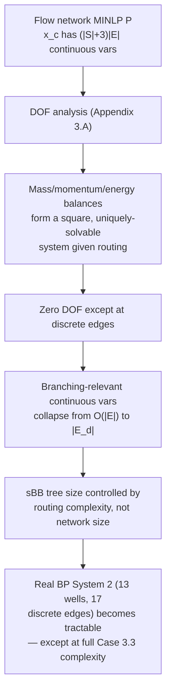

# Computational Validation and Case Studies

[[book-guidelines|↩ Back to guidelines]]

## Two separate validation efforts, one underlying question

Every previous topic built the theory — B-splines, their convex hull, the sBB algorithm, the flow network formulation. This article covers where the thesis puts that theory to the test, twice: first on clean, small, adversarially-chosen mathematical test problems (Chapter 2), then on messy, real, industrially-sourced production systems from BP (Chapter 3). The underlying question is the same both times: **does the B-spline/sBB machinery actually deliver on its promise of certified global optimality within a usable time budget, and does it agree with ground truth?**

## Chapter 2's benchmark: CENSO against the established global solvers

CENSO is compared against three mature, general-purpose global MINLP solvers — **BARON**, **COUENNE**, **LINDOGLOBAL** — plus the specialized polynomial solver **SparsePOP**, on 13 small nonconvex polynomially-constrained NLP problems (2–7 variables, drawn from standard test libraries like GLOBALLib). All solvers run to an absolute $\varepsilon$-convergence of $10^{-6}$.

**Headline result:** CENSO has the lowest CPU time on 8 of 13 problems, sometimes converging in a **single iteration** (problems P6, P10) — meaning the very first LP relaxation was already tight enough at the global solution to certify optimality with no branching at all. That happens precisely because, as noted back in [[Global-Optimization-with-Spline-Constraints]], the B-spline [[Global-Optimization-with-Spline-Constraints#Convex hull relaxation|convex hull relaxation]] *interpolates the function exactly* at the corners of the bounding box — when the global optimum happens to sit there, the relaxation is exact from the start.

But the study is candid about the limits: on the two largest problems (P12, P13), CENSO becomes *less* competitive. The stated reason is structural, not a flaw in the core algorithm: CENSO **lacks the sophisticated preprocessing and domain-reduction techniques** that BARON/COUENNE/LINDOGLOBAL have accumulated over two decades of development. This is an important, honest distinction to internalize — the comparison isolates the *reformulation-convexification core* fairly, but a production-grade solver is a core algorithm plus a large accretion of engineering (presolve, cutting planes, warm-starting heuristics) that this benchmark doesn't credit CENSO with lacking, nor penalize the others for having.

### The pump network synthesis problem (PNSP): a stress test on approximation quality itself

The **PNSP** — finding the cheapest configuration of pumps (in series/parallel, across levels) meeting a required pressure rise and total flow — is a genuine MINLP where integer variables ($z_i$: level exists; $N_i^p, N_i^s$: parallel/series pump counts) participate directly alongside nonlinear pump power/pressure characteristics ($f_{1,i}, f_{2,i}$, degree-(3,2) and degree-(2,2) polynomials respectively).

The interesting experimental variable here isn't just "does CENSO solve it," but **what happens when the pump characteristics themselves are only known approximately** (as they would be from a manufacturer's lookup table, not a closed-form equation) — CENSO is run with the pump curves represented at three spline degrees $(1,1)$, $(2,2)$, $(3,3)$ and four sample-grid densities:

| Solver | Degree | Grid | Time (s) | Gap (%) |
|---|---|---|---|---|
| COUENNE | exact | – | 7 | 0 |
| BARON | exact | – | 18 | 1.73 |
| LINDO | exact | – | 101 | 0 |
| CENSO | exact | – | 34 | 0 |
| CENSO | (1,1) | 5×5 | 21 | 1.73 |
| CENSO | (1,1) | 20×20 | 44 | 0 |
| CENSO | (3,3) | 5×5 | 53 | 0 |

The pattern worth noticing: **a coarse, low-degree approximation of the pump curve can fail to certify the true global optimum** (the $1.73\%$ gaps at degree $(1,1)$ with sparse sampling), while a finer grid or higher degree recovers exactness. This is a direct, load-bearing consequence of the approximation-accuracy property from [[Surrogate-Modelling-for-Optimization]]'s original five-property checklist — a surrogate that's *too coarse* doesn't just produce a worse point estimate, it can corrupt the *soundness* of the certificate the global solver reports, because the relaxation is built on the surrogate, not on the true function. This is the clearest illustration in the whole thesis that surrogate accuracy isn't a nice-to-have — it's part of the soundness chain, not separate from it.

Chapter 2's own stated conclusions, worth reading as a self-assessment: the reformulation-convexification approach is competitive on small problems despite CENSO's lack of preprocessing machinery; it scales exponentially in auxiliary variables with dimension (the fundamental limitation already flagged in [[Global-Optimization-with-Spline-Constraints]]); and three concrete extensions are proposed — Lipschitz-based optimality gaps for black-box functions (reusing the quadratic-convergence bound from [[The-B-Spline-Theory-and-Construction]]), further bounds tightening exploiting basis-function nonnegativity, and decomposition to fight the auxiliary-variable blowup.

## Chapter 3's benchmark: four solution methods on two real BP systems

This is the thesis's most consequential empirical claim, so it's worth tracing carefully how the comparison is set up before looking at results.

### The comparison design, and its honest caveats

Four solution methods are compared (Table 3.6):

| Solver | Type | Handles routing? | Global? | Model |
|---|---|---|---|---|
| Proprietary solver | NLP | No | No | GAP (direct black-box) |
| IPOPT | NLP | No | No | $P$ (B-spline surrogates) |
| BONMIN | MINLP | Yes | No | $P$ |
| CENSO | MINLP | Yes | **Yes** | $P$ |

The design is explicitly acknowledged as imperfect in two ways: (1) the proprietary solver and IPOPT can't handle discrete routing variables, so they're only compared once all routing decisions are fixed; (2) the proprietary solver optimizes a *different* model (GAP directly) than the other three (the B-spline surrogate reformulation $P$), so a fair comparison requires evaluating each method's optimal valve settings back through GAP as a common reference — this is the same "validate the surrogate's answer against the original black-box" discipline that [[Virtual-Flow-Metering-and-Data-Reconciliation]] applied when checking B-spline surrogate estimates against OLGA.

### Case 1 (BP System 1): linear vs. cubic splines, and where the difference comes from

10 wells, 4 daisy-chained manifolds, gas-lift injection, 340 mmscf/d gas capacity. Solved with **linear** (Case 1.1) versus **cubic** (Case 1.2) interpolating splines for the same pressure-drop correlations:

| Case | Solver | Iterations | Time (s) | $z^*$ (mSTB/d) |
|---|---|---|---|---|
| 1.1 (linear) | CENSO | 9 | 56 | 77.483 |
| 1.2 (cubic) | CENSO | 17 | 191 | 78.381 |

The roughly 1 mSTB/d gap between linear and cubic results isn't noise — it has a precise physical explanation. The true pressure-drop curves have **positive curvature** (they're convex-like), and a *linear* (piecewise-linear) spline systematically **over-estimates** that curvature at the interpolation nodes, while the cubic spline captures it accurately. A higher estimated pressure drop translates directly into lower predicted production at a fixed separator pressure — so the cheaper, lower-fidelity surrogate isn't just less accurate in some abstract sense, it's *biased in a specific, predictable direction*. Both cases converge to the *same* optimal valve settings, though — the bias affects the predicted objective value, not the decision the optimizer recommends.

Validating Case 1.2's solution against GAP directly (inserting the optimal valve settings and comparing GAP's own predictions) gives most variable errors under 1%, with the riser pressure loss error creeping up to nearly 4% — attributed to insufficiently dense sampling of the flowline correlation specifically, a concrete, fixable instance of the accuracy/sampling-density trade-off quantified back in [[The-B-Spline-Theory-and-Construction]] and [[Virtual-Flow-Metering-and-Data-Reconciliation]].

### Case 2/3 (BP System 2): the DOF analysis paying off, and where global solving stops being viable

13 wells, 2 risers, 17 discrete routing edges — a raw $2^{17} \approx 131{,}000$ binary combinations, reduced to $2^6 \cdot 3^4 = 5{,}184$ feasible combinations once the manifold routing constraint (Eq. 3.10, from [[Multiphase-Flow-Network-Modelling]]) is applied. Case 2 excludes energy balances (and hence riser velocity constraints, which need temperature); Case 3 includes them in full.

Solution times, condensed:

| Case | Solver | Time (s) | $z^*$ (mSTB/d) |
|---|---|---|---|
| 2.1 (fixed routing) | CENSO | 280 | 143.435 |
| 2.3 (full routing) | CENSO | 1870 | 143.875 |
| 3.1 (fixed routing) | CENSO | 2630 | 140.674 |
| 3.2 (full routing, no reroute) | CENSO | 3670 | 140.674 |
| 3.3 (largest, full complexity) | CENSO | **9000, terminated unconverged** (gap 25.16 mSTB/d) | — |

The **exponential blow-up is explicit and named**: Case 3.3 is the first case in the whole thesis where CENSO simply *fails to converge within a practical time budget* (9000 seconds, terminated with a large residual gap). This is the concrete, load-bearing evidence for the "not viable for the largest case" conclusion the chapter draws — it's not a hedge, it's a measured result.

Two more results deserve attention because they cut *against* naive expectations:

- **Local solvers (IPOPT, BONMIN) find the certified global optimum in every case except one.** This is presented not as luck but as *evidence about the structure of the relaxed problem itself* — the authors' interpretation is that the NLP relaxation of $P$ is "near convex" across large portions of the feasible region, attributable to the smoothness/derivative quality of cubic B-splines and to integer variables appearing only linearly (both properties established back in [[Multiphase-Flow-Network-Modelling]] and [[The-B-Spline-Theory-and-Construction]]). This is a genuinely interesting empirical claim: a well-designed *formulation* can make a nonconvex problem behave, in practice, almost as if it were convex for local-search purposes — good modelling substituting for algorithmic power.
- **In Case 3.3, BONMIN actually finds a worse solution than in the smaller Case 3.2/3.1** — it mistakenly prunes away the true optimum during its heuristic search. This is a sharp, concrete illustration of exactly why a *certified* global method still matters even when local solvers usually agree with it: "usually agrees" is not the same guarantee as "provably cannot miss the optimum," and this case is the one place in the whole benchmark where that distinction actually bites.
- **The economically significant number:** Case 3's newly-found optimum represents a **3.12% production increase (4,250 STB/d)** over the best previously-known solution from the proprietary solver — independently verified by running the recommended valve settings back through GAP. This is the thesis's single clearest "the method paid for itself" data point.

### The degree-of-freedom (DOF) analysis: turning a structural proof into a practical speedup

Appendix 3.A works out, algebraically, exactly how many *free* continuous variables the flow-network MINLP $(P)$ actually has, and the answer is strikingly small: **$D = 2|E_d|$** — twice the number of discrete (valve) edges, regardless of how large the rest of the network is.

The derivation proceeds by systematically checking, for every variable group (flow rates, pressures, temperatures/enthalpies), whether the count of equality constraints exactly matches the count of variables — and it does, for every group, as long as $E_d = \emptyset$ (no discrete edges): $|S|\cdot|E|$ flow variables against $|S|\cdot|E|$ mass-balance-plus-boundary constraints; $|N|+|E|$ pressure variables against the same count of pressure-drop-plus-boundary constraints; $4|E|$ temperature/enthalpy variables against $4|E|$ energy constraints. **Zero degrees of freedom everywhere except at discrete edges** — once a network's routing is fixed, its entire continuous state is *uniquely determined* by the conservation laws alone; there's nothing left to optimize continuously. Each discrete edge then contributes exactly one continuous DOF (the pressure drop across it, which is either genuinely free when the valve is open, or vacuous-but-technically-free when closed) plus its own binary state — hence $D_c = D_d = |E_d|$.

**Why this is the single highest-leverage optimization in the entire thesis.** Recall from [[The-Spatial-Branch-and-Bound-Algorithm-CENSO]] that branching-variable selection (Eq. 2.28) picks among *all* continuous variables participating in nonconvex constraints — and Section 3.6.2 states plainly that naively branching on the full set $x_c$ (size $(|S|+3)|E|$, i.e. growing linearly with total network size) is "detrimental to the efficiency of the algorithm, even for small network problems." Bounds tightening propagated through the zero-DOF equality constraints means it's provably sufficient to branch **only** on the $|E_d|$ variables actually associated with discrete edges — reducing the branching-variable count from a network-size-dependent quantity to a routing-complexity-dependent one. This is a structural fact about the *problem*, proven once by direct counting, exploited *every single node* of the sBB search — precisely the "proven once, reused everywhere" pattern flagged as the payoff of building sBB on B-splines in [[The-Spatial-Branch-and-Bound-Algorithm-CENSO]]'s convergence proof, now showing up again at the modelling layer instead of the relaxation layer.

Optimality-based bounds tightening (OBBT, Eq. 3.21 — solving $2|I_c|$ auxiliary LPs per node to minimize/maximize each complicating variable against the current relaxation) supplements the DOF reduction, run at shallow tree depths where its cost is worth the extra tightening, tapering off deeper in the tree where it yields diminishing returns.

## Framing this for a verification/analysis mindset

The DOF analysis here is a close cousin of a **static dependency/def-use analysis** in program verification: rather than treating every variable in a system as potentially free, you compute — once, structurally, before any search runs — exactly which variables are actually independent, given the equality constraints that pin the rest. Just as a good alias/dataflow analysis lets a verifier or optimizer ignore variables it can prove are functionally determined by others, DOF analysis lets the sBB search ignore variables it can prove are pinned by conservation laws. The PNSP result — where a too-coarse surrogate degree corrupts the reported optimality gap — is a sharp reminder that **soundness claims are only as strong as their weakest input approximation**: a "certified global optimum" of an approximate model is not automatically a certified statement about the real system, only about the model, and the gap between the two has to be independently checked (as Case 1.2/Case 3.2's GAP-validation steps do) rather than assumed away.

## Where this leads

- Chapter 2's benchmark methodology (comparison against BARON/COUENNE/LINDOGLOBAL, PNSP as a versatility stress test) is the template the thesis repeats, scaled up, in Chapter 3's real-system case studies.
- The DOF analysis's core technique — count constraints against variables per group, exploit whatever cancels to zero — is a reusable pattern any reader building similar large-scale structured MINLPs should recognize as worth doing *before* reaching for generic branching heuristics.
- The empirical finding that local solvers usually (but not always) match CENSO's certified global optimum is the direct justification for [[Virtual-Flow-Metering-and-Data-Reconciliation]]'s deliberate choice to rely on a fast local solver (IPOPT) for real-time reconciliation, reserving CENSO for periodic, off-critical-path certification.
- The Case 3.3 non-convergence, and the general "exponential scaling with problem size" finding, is exactly the concrete evidence base [[Organizational-and-Industry-Barriers-to-Model-Based-Production-Optimization]] draws on when discussing why certified global methods remain hard to deploy as a *daily*, production-grade decision-support tool despite their demonstrated value here.
