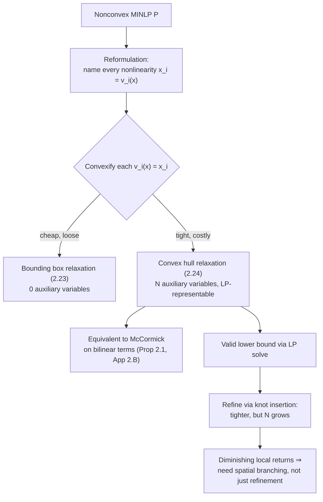

# Global Optimization with Spline Constraints

[[book-guidelines|↩ Back to guidelines]]

## From "it has a convex hull" to "an LP solver can use it"

[[The-B-Spline-Theory-and-Construction]] proved Lemma 2.1: the graph of a B-spline lies inside the convex hull of its control points. That's a mathematical fact about a function. This article covers the move that turns it into an *algorithm component* — a constraint set that a linear-programming solver can consume as part of a certified lower bound in a branch-and-bound search. The gap between "here is a sound abstraction" and "here is code a solver calls" is exactly what §2.3 closes.

## Reformulation: giving every nonlinear piece its own name

Start from the general nonconvex MINLP

$$
\min_x f(x) \quad \text{s.t.} \quad g(x) \le 0, \quad x \in X^d \cap (\mathbb{Z}^{n_d} \times \mathbb{R}^{n-n_d}). \tag{P}
$$

The **reformulation** step renames every constraint and the objective as its own auxiliary variable: $x_{n+i} = g_i(x)$ for each constraint, $x_{n+m+1} = f(x)$. The problem becomes

$$
\min_x x_{n+m+1} \quad \text{s.t.} \quad x_i = v_i(x),\ i = n{+}1,\dots,n{+}m{+}1, \quad x \in X^d
$$

where each $v_i$ is now required to be a B-spline in some spline space (ordinary polynomials get converted to B-spline form via §2.2.5's exact change of basis). This is a purely mechanical rewrite — it changes nothing about the problem's optima — but it isolates every nonlinearity behind a single equality constraint $x_i = v_i(x)$, which is the form the convexification step below knows how to handle uniformly.

**Why bother reformulating at all, rather than relaxing $f$ and $g$ directly?** Because after reformulation, *every* nonconvex constraint has the identical shape "$x_i = (\text{a B-spline})$" — so one relaxation recipe (below) handles the objective, every constraint, and every level of composition uniformly, rather than needing a bespoke convex under/over-estimator derived by hand for each distinct nonlinear expression in the problem. This is the same generality-through-normal-form move a compiler makes when it lowers a rich surface language to a small core IR before running optimization passes — you pay a translation cost once, in exchange for every later pass only needing to handle a handful of canonical node shapes.

## Convexification: two relaxations of one equality constraint

A nonconvex equality $v_i(x) = x_i$ is relaxed by sandwiching it between a convex underestimator and a concave overestimator, $v_i^l(x) \le x_i \le v_i^u(x)$, giving two convex inequality constraints. Grimstad gives two concrete instantiations of $v_i^l, v_i^u$ for a B-spline constraint, differing sharply in tightness versus cost.

### Bounding box relaxation

Directly from Corollary 2.1 (the control points' bounding box contains the spline's graph):

$$
c_{\min} = \min_i\{c_i\} \le x_i \le \max_i\{c_i\} = c_{\max}. \tag{2.23}
$$

This is a plain box constraint — **no auxiliary variables at all**. You read the minimum and maximum coefficient off the B-spline and you're done. It's the cheapest possible relaxation, and correspondingly the loosest: it throws away all the *shape* information in how the control points are arranged, keeping only their extreme values.

### Convex hull relaxation

Directly from Lemma 2.1 (the graph lies in $C = \mathrm{conv}(\{P_j\})$), a point $(x, x_i)$ can be written as a convex combination of the $N$ control points. Introduce $N$ new variables $\{\lambda_j\}$ (this is the "lifting" move — adding dimensions to get a tighter description) and the relaxation becomes:

$$
\sum_{j=0}^{N-1} P_j \lambda_j = \begin{bmatrix} x \\ x_i \end{bmatrix}, \quad \sum_{j=0}^{N-1} \lambda_j = 1, \quad \lambda_j \ge 0. \tag{2.24}
$$

This is the **tightest** relaxation obtainable from the control points alone — literally the definition of the convex hull, expressed as constraints — and, critically, it's **linear** (affine equalities plus nonnegativity), so a problem built entirely from constraints like (2.24) is an LP, solvable by any off-the-shelf LP solver (CENSO uses GUROBI). This is the payoff promised back in [[Surrogate-Modelling-for-Optimization]]: a nonconvex MINLP's lower-bounding subproblem, which would ordinarily require a general convex NLP solver, collapses to an LP.

**The cost:** (2.24) introduces $N$ new variables — and $N$ grows *exponentially* in the number of dimensions ($N = \prod_i n_i$, e.g. $10^d$ for $d$ dimensions with 10 basis functions each). Grimstad names three concrete mitigations: separate additively-separable constraints into multiple lower-dimensional B-splines (Remark 2.1); fall back to the bounding box relaxation when $N$ is prohibitive; or prune interior (non-vertex) control points from the convex-combination constraint using an actual convex-hull computation or the cheaper Akl–Toussaint heuristic. This tightness-versus-dimensionality trade-off is the concrete cost of the abstraction: a tighter abstract domain (the full convex hull) costs more variables than a coarser one (the bounding box), the same trade you make choosing between an interval domain and a polyhedral domain in abstract interpretation.

## The McCormick equivalence: this isn't a new trick, it's an old one generalized

Appendix 2.B (referenced here) proves that when a B-spline is constructed to represent a **bilinear term** $x_1 x_2$, the convex hull relaxation (2.24) is *exactly equivalent* to the classical **McCormick relaxation** of bilinear terms — the standard building block underlying essentially all general-purpose global solvers (BARON, COUENNE, LINDOGLOBAL), going back to McCormick's 1976 factorable-programming work.

This equivalence is worth sitting with, because it reframes what the whole B-spline approach actually is. The reformulation-linearization technique (RLT) used by other solvers expands a nonconvex expression into a **binary tree of elementary nonlinear operations** (each multiplication, each power, gets its own auxiliary variable and McCormick-style relaxation). The B-spline's recursive Cox–de Boor construction is *also* built from recursive convex combinations — it can likewise be read as a tree, with degree-0 piecewise-constant basis functions as leaves. So the B-spline relaxation isn't a competing paradigm to McCormick/RLT; **it's a single unified relaxation that specializes to McCormick exactly on bilinear terms, while generalizing uniformly to arbitrary piecewise-polynomial nonlinearity** — a single mechanism that subsumes what would otherwise be a whole library of per-operator relaxations. That's the generality argument Burer and Letchford's survey is cited as calling for: developing algorithms for a well-chosen special case (splines) as a route to techniques that generalize.

## Worked example: the tightness/dimensionality trade-off in numbers

The six-hump camelback function

$$
f(x) = \left(4 - 2.1x_1^2 + \tfrac{1}{3}x_1^4\right)x_1^2 + x_1 x_2 + \left(-4+4x_2^2\right)x_2^2
$$

on $[-3,3]^2$ has six local minima, two global ($f^* = -1.0316$). Represented as a bivariate B-spline of degree $(6,4)$, it has $(6{+}1)(4{+}1) = 35$ control points, giving an LP relaxation with $\tilde n = 38$ variables (2 original + 1 objective auxiliary + 35 control-point weights) and $\tilde m = 4$ constraints. Compare against the "standard form" relaxation (binary-tree expansion + McCormick + convex envelopes of univariate quadratics), which needs only $\tilde n = 8$ variables but $\tilde m = 16$ constraints.

The comparison as knots are refined (Table 2.1, condensed):

| $s$ (knots inserted) | $\tilde n$ | $N$ (control points) | optimality gap $f^*-\bar f$ |
|---|---|---|---|
| 0 | 38 | 35 | 607.2 |
| 1 | 51 | 48 | 55.29 |
| 5 | 123 | 120 | 21.87 |
| 20 | 675 | 675 | 0.73 |
| 50 | 3138 | 3135 | 0.08 |

Two things worth internalizing from this table. First, at $s=0$ the B-spline relaxation is *worse* than the plain standard-form relaxation, but it overtakes it once $\ge 4$ knots are inserted — the B-spline representation only pays off once you refine. Second, the gains show **diminishing returns** past a point (the gap stays essentially flat from $s=14$ to $s=20$ in the full data): knot insertion has local support, so knots placed far from the actual global optimum stop helping. This is the concrete instance of the general principle from [[The-B-Spline-Theory-and-Construction]]: refinement only tightens the abstraction *locally*, near where knots are inserted.

**What breaks without spatial branching, specifically.** In *unconstrained* problems, successive knot refinement alone is enough to close the optimality gap in the limit — the control structure converges quadratically to the function everywhere (Eq. 2.11), so refining globally eventually pins down the minimum. But Table 2.1 shows the variable count exploding as $s$ grows (38 → 3138), so pure global refinement is *correct but computationally hopeless* — and in *constrained* nonlinear programming, refinement alone is provably not sufficient at all: the relaxation of the feasible region can remain loose in ways that refinement of one B-spline can't fix on its own. This is exactly why the thesis doesn't stop at "insert enough knots" — it needs **spatial branching**, subdividing the search space so that refinement effort concentrates where it's needed, which is the subject of [[The-Spatial-Branch-and-Bound-Algorithm-CENSO]].

## Framing this for a verification/analysis mindset

The bounding-box-versus-convex-hull choice is a direct analogue of choosing between an **interval abstract domain** and a **polyhedral abstract domain** in abstract interpretation: the interval domain (here, the bounding box) is cheap, loses all correlation information between variables, and is fast to propagate; the polyhedral domain (here, the full convex hull) captures relationships between variables at the cost of a representation that grows with dimensionality. Grimstad's Remark 2.3 mitigations — separability, falling back to boxes, pruning interior points — are exactly the standard playbook for taming polyhedral-domain blowup (packing/octagon-style restricted polyhedra, widening, etc.). The proof obligation is the same in both settings too: a relaxation/abstraction is *valid* exactly when $G_P \subseteq G_R$ — the concrete feasible set is contained in the relaxed one (Eq. 2.21) — which is precisely the soundness condition $\llbracket P \rrbracket \subseteq \gamma(\alpha(\llbracket P \rrbracket))$ that any abstract-interpretation transfer function must satisfy. Here it's proven once, structurally, via the convex-combination construction of the B-spline, rather than needing a separate soundness argument per nonlinear operator — the same payoff a trusted kernel gets from having one small, verified core rule (e.g. `isDefEq`) that every derived tactic routes through, instead of every tactic re-proving its own soundness.

## Where this leads

- The convex hull relaxation (2.24) is the actual LP constraint set solved at every node of the [[The-Spatial-Branch-and-Bound-Algorithm-CENSO|spatial branch-and-bound algorithm]] — it *is* $R_k$ in that algorithm's notation.
- The tightness-versus-$N$ trade-off quantified here directly motivates the branching-variable and branching-point selection rules covered in that same article: branching exists precisely because refinement alone hits diminishing local returns.
- The McCormick equivalence is what lets CENSO be benchmarked apples-to-apples against BARON, COUENNE, and LINDOGLOBAL — all of which rely on McCormick-style relaxations internally — in the [[Computational-Validation-and-Case-Studies|computational validation]] chapter.
- The same reformulation-convexification recipe, applied to pressure/temperature/flow B-spline surrogates instead of test polynomials, is what makes the full production-optimization MINLP in [[Multiphase-Flow-Network-Modelling]] tractable for a global solver at all.
