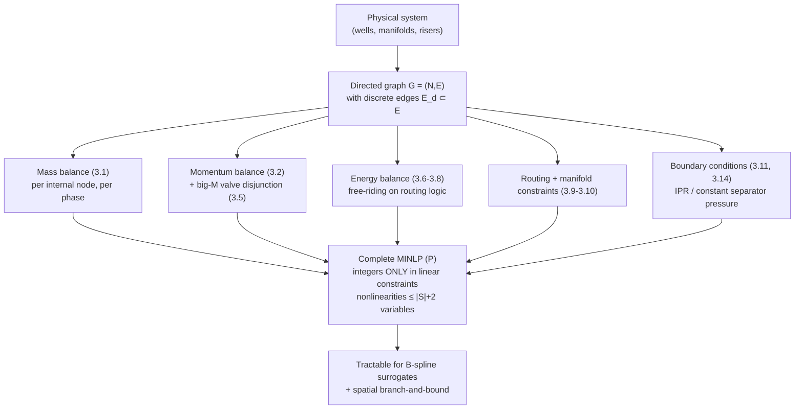

# Multiphase Flow Network Modelling

[[book-guidelines|↩ Back to guidelines]]

## From physical plumbing to a formal graph

[[Subsea-Production-Systems-and-Their-Operation]] introduced wells, manifolds, risers, and valves as physical objects. This chapter turns them into a **formal directed graph** $G = (N, E)$ and writes down the exact system of equations and inequalities a subsea production system must satisfy at steady state. This is the payoff of the "disaggregation" idea flagged back in [[Surrogate-Modelling-for-Optimization]]: rather than one monolithic black-box simulator, the production system becomes a network of small, individually-modeled units connected by explicit conservation laws — each unit's nonlinearity isolated and small enough (at most $|S|+2$ variables) to be approximated by a low-dimensional B-spline surrogate.

## The graph: nodes, edges, and one crucial distinction

- **Nodes** $N$ are junctions — points of interest in the network (a wellhead, a manifold inlet, a separator).
- **Edges** $E$ are pipe segments, valves, or equipment — anything connecting two nodes.
- A distinguished subset $E_d \subseteq E$ are **discrete edges**: valves, which are either fully open or fully closed, each carrying a binary state variable $y_e \in \{0,1\}$.

This split — continuous-flow pipes versus binary on/off valves — is the direct graph-level encoding of the $x \in \mathbb{R}^n, y \in \mathbb{Z}^q$ split first introduced back in [[Surrogate-Modelling-for-Optimization]]'s discussion of MINLP formulations. Every discrete edge routes flow; every non-discrete edge transports it subject to physics.

Three structural requirements keep the graph well-posed for this formulation (avoiding, in particular, having to model flow *splitting*, which the framework deliberately excludes):

- **R1 (source)**: zero entering edges, exactly one leaving edge.
- **R2 (sink)**: zero leaving edges.
- **R3 (internal node)**: one or more leaving edges, but if more than one, *all* must be discrete edges with at most one open at a time.

R3 is the formal statement of "no flow splitting" — an internal node either has one deterministic downstream path, or a set of mutually-exclusive routing choices. This is precisely the *manifold* structure from [[Subsea-Production-Systems-and-Their-Operation]], now made a graph-theoretic invariant rather than a physical description.

## Three conservation laws, one per control volume

The flow network is modeled by placing a **control volume** around every node and edge and enforcing mass, momentum, and energy conservation. Each law is worth understanding as answering a different question about the system.

### Mass balances: "what goes in must come out"

At steady state, no accumulation: at every *internal* node,

$$
\sum_{e \in E_i^{\text{in}}} q_{e,s} - \sum_{e \in E_i^{\text{out}}} q_{e,s} = 0, \quad \forall s \in S,\ i \in N_{\text{int}}. \tag{3.1}
$$

This is enforced per-phase ($S = \{\text{oil, gas, wat}\}$) — oil in equals oil out, independently of gas and water. Note it's only imposed at internal nodes: a source node's mass balance would trivially force zero net outflow, which is wrong by construction (a source is *supposed* to inject flow).

### Momentum balances: pressure drives flow, except across a closed valve

For an ordinary pipe/equipment edge $e = (i,j) \notin E_d$, the pressure drop is given by a (generally nonlinear) correlation:

$$
\Delta p_e = f_e(q_e, p_i, t_e), \qquad e \in E \setminus E_d. \tag{3.2}
$$

For a *valve* edge $e \in E_d$, the relationship between the adjacent node pressures depends on whether the valve is open or closed — and this is where the discrete/continuous coupling gets genuinely interesting. The natural statement is a **disjunction**:

$$
y_e = 0 \ \lor\ \begin{cases} y_e = 1 \\ \Delta p_e = p_i - p_j \end{cases} \tag{3.3}
$$

Read in words: if the valve is closed, the two adjacent node pressures are *unconstrained relative to each other* by this edge (they may still be linked through some other path in the network); if it's open, the ordinary pressure relation applies.

**Why this can't just be handed to a solver as written.** Disjunctive constraints like (3.3) aren't natively supported by most commercial NLP/MINLP solvers — they require either specialized disjunctive-programming solvers or a reformulation into ordinary algebraic constraints. The standard trick is a **big-M relaxation**. First write the disjunction as a single bilinear equation, $y_e(p_i - p_j - \Delta p_e) = 0$ (Eq. 3.4) — this is exact but introduces an unwanted product of a binary and a continuous term. Then, since the pressures are bounded ($p_i \in [p_i^L, p_i^U]$, etc.), derive a constant $M_e = (p_i^U - p_i^L) + (p_j^U - p_j^L)$ that bounds $|p_i - p_j - \Delta p_e|$, and relax the bilinear equation to:

$$
-M_e(1-y_e) \le p_i - p_j - \Delta p_e \le M_e(1-y_e). \tag{3.5}
$$

Check the two cases directly: when $y_e = 1$, both sides collapse to $0 \le p_i-p_j-\Delta p_e \le 0$, exactly recovering the "open" branch of the disjunction. When $y_e = 0$, the constraint becomes $-M_e \le p_i-p_j-\Delta p_e \le M_e$, which is *vacuous* given how $M_e$ was chosen — it can never bind, so it imposes no real restriction, exactly matching the "closed, unconstrained" branch. This is literally McCormick's relaxation of a bilinear term, footnoted explicitly in the text — the same relaxation technique whose B-spline equivalent was proven in [[Global-Optimization-with-Spline-Constraints]].

**The trade-off, made explicit by the book:** big-M constraints are well known to give *weak* relaxations when $M_e$ is chosen too loosely — in the theoretical limit $M_e \to \infty$ the relaxation is still technically valid but numerically useless (ill-conditioned, uninformative bounds). The saving grace here is domain knowledge: because $M_e$ is derived directly from the *physical* pressure bounds of the system, it stays reasonably tight without requiring any generic tightening procedure. This is a concrete illustration of a recurring theme: the quality of a sound relaxation is only as good as the tightness of the bounds feeding it, which is exactly why bounds tightening (RCBT/FBBT, from [[The-Spatial-Branch-and-Bound-Algorithm-CENSO]]) matters operationally, not just in principle.

### Energy balances: enthalpy tracking under simplifying assumptions

Modelling temperature requires an enthalpy balance, built on five simplifying assumptions: instant mixing at nodes (single temperature per point), no work performed by the system, heat transfer fully determined by internal states (allowing constant ambient properties), enthalpy equal to internal energy (no $pV$-work), and constant heat capacities $c_s$ per phase.

The temperature drop across an edge is another black-box-style correlation, $\Delta t_e = g_e(q_e, p_i, t_e)$ (3.6), and enthalpy is a simple product of heat capacity and flow:

$$
h_e = t_e \sum_{s\in S} c_s q_{e,s}, \qquad \Delta h_e = \Delta t_e \sum_{s \in S} c_s q_{e,s}. \tag{3.7}
$$

Conservation at internal nodes then mirrors the mass balance structure:

$$
\sum_{e \in E_i^{\text{in}}} (h_e - \Delta h_e) = \sum_{e \in E_i^{\text{out}}} h_e, \quad \forall i \in N_{\text{int}}. \tag{3.8}
$$

**A subtle but important design win, worth flagging explicitly:** the energy model requires *no binary routing variables at all*. When a discrete edge is closed, flow routing forces $q_e = 0$, which forces $h_e = 0$, which automatically removes that edge's contribution from (3.8) — the logic "closed edges don't participate in energy balance" falls out of the *existing* flow-routing constraints for free, rather than needing a second big-M treatment mirroring (3.5). This is a small but genuine example of designing a formulation so that one piece of encoded logic (routing) automatically discharges a downstream obligation (energy accounting) rather than needing its own separate mechanism — the kind of "let one invariant do double duty" move that shows up in well-designed type systems too, where a single well-formedness check subsumes several derived safety properties instead of each needing its own proof obligation.

## Flow routing and the manifold as a counting exercise

Routing logic is stated compactly: a discrete edge's flow is forced to zero when closed, and bounded normally when open —

$$
y_e q_{e,s}^L \le q_{e,s} \le y_e q_{e,s}^U, \quad \forall s \in S,\ e \in E_d. \tag{3.9}
$$

A **manifold** — the physical routing structure from Chapter 1 — is exactly a collection of discrete edges satisfying:

$$
\sum_{e \in E_i^{\text{out}}} y_e \le 1, \quad \forall i \in N_d. \tag{3.10}
$$

"At most one outlet open per inlet." This directly enforces requirement R3 at the graph level. It's worth doing the counting the book does explicitly, because it's a nice concrete illustration of how much combinatorial structure a constraint like (3.10) removes: a manifold with 9 discrete edges arranged as 3 inlets × 3 outlets has $2^9 = 512$ raw binary assignments, but constraint (3.10) — applied per node with $n$ leaving edges, giving $n+1$ feasible choices per node — cuts that to $4 \times 4 \times 4 = 64$ feasible routing combinations. That's a real reduction the *solver* gets to exploit directly (fewer feasible integer assignments to search), not just a modelling nicety.

## Boundary conditions: closing the system

A flow network needs source and sink behavior specified explicitly, or the system is underdetermined.

**Upstream (source nodes):** the **inflow performance relationship (IPR)** relates a well's flow to its bottom-hole pressure. The linear IPR is a simple productivity-index model:

$$
q_{e,\text{oil}} = c_{i,\text{PI}}(p_{i,\text{res}} - p_i), \quad q_{e,\text{gas}} = c_{i,\text{GOR}} \cdot q_{e,\text{oil}}, \quad q_{e,\text{wat}} = \frac{c_{i,\text{WCT}}}{100 - c_{i,\text{WCT}}} q_{e,\text{oil}}. \tag{3.12}
$$

Four constants characterize a well: reservoir pressure, productivity index, gas-oil ratio, water cut. This linear model breaks down for reservoirs with *gas coning* (a thin oil rim under a gas cap), where a nonlinear IPR is needed instead — flagged explicitly as a case where the framework's generality (any node relation $\zeta_{i,s}(q_e, p_i) = 0$, Eq. 3.11) matters, not just its default linear instance.

**Downstream (sink nodes):** simplest possible boundary — constant separator pressure, $p_i = \text{const.}$ for $i \in N_{\text{snk}}$ (3.14), justified by the same steady-state assumption (A1) that licenses the whole framework: on a daily-optimization timescale, downstream facility dynamics look effectively instantaneous.

**Operational constraints** layer two more real-world limits on top: **capacity constraints** cap total gas/water flowing into the separator, expressed cleanly as cut-set sums ($\sum_{e \in E^{\text{snk}}} q_{e,\text{gas}} \le C_{\text{gas}}$, Eq. 3.15); **draw-down constraints** are simply a lower bound on bottom-hole pressure, preventing reservoir damage from over-aggressive production, expressed as plain variable bounds.

## Assembling the full MINLP

With every piece above in place, the complete daily production optimization problem is:

$$
\begin{aligned}
\max_{y,q,p,\Delta p,t,\Delta t,h,\Delta h}\quad & z = \sum_{e \in E^{\text{snk}}} q_{e,\text{oil}} \\
\text{s.t.}\quad & \text{mass balances (3.1), momentum balances (3.2, 3.5), energy balances (3.6–3.8)} \\
& \text{routing (3.9, 3.10), variable bounds, boundary conditions (3.11, 3.13, 3.14)} \\
& y_e \in \{0,1\}, \ \forall e \in E_d
\end{aligned} \tag{P}
$$

The objective is simply "maximize total oil into the separator" (Eq. 3.16) — trivially extensible to include operating costs (gas lift, water processing) if desired.

Two structural facts about this formulation are worth calling out, because they're exactly what makes the rest of the thesis's machinery applicable:

1. **Integer variables participate only in linear constraints** — the big-M relaxation (3.5) and the routing constraints (3.9, 3.10) are the *only* places $y_e$ appears, and both are linear. This is the disaggregation property from [[Surrogate-Modelling-for-Optimization]] realized concretely: the discrete logic never needs to pass through a black-box nonlinear function, so a process simulator that can't handle integer inputs is never asked to.
2. **No nonlinear function has more than $|S|+2$ arguments** — every $f_e$, $g_e$, $\zeta_{i,s}$ takes at most (phase flow rates) + (pressure) + (temperature) as inputs, three phases giving 5 total. This low dimensionality is exactly what keeps B-spline surrogate models tractable (recall from [[The-B-Spline-Theory-and-Construction]] that the [[Global-Optimization-with-Spline-Constraints#Convex hull relaxation|convex hull relaxation]]'s auxiliary variable count $N$ grows exponentially in dimension) — the graph decomposition isn't just conceptually clean, it's what keeps every individual relaxation small enough to actually solve.

## Framing this for a systems/verification mindset

This graph formulation is a textbook instance of a broader pattern: **decompose a monolithic system into a small set of typed components (nodes, ordinary edges, discrete edges) plus a small set of local invariants (conservation laws) that must hold at every component**, rather than one global, opaque specification. It's the same move a type checker makes decomposing "is this program well-typed" into "does every subterm satisfy its local typing judgment," with a small number of composition rules (here: mass/momentum/energy conservation) gluing local facts into a global guarantee. The big-M relaxation of the disjunctive valve logic (3.3)→(3.5) is a particularly clean worked example of the general technique for eliminating a disjunction in favor of linear constraints parametrized by a bound derived from the domain — the same maneuver used to encode `if`-branches, exception control flow, or case-disjoint program states into SMT-friendly linear arithmetic when discharging verification conditions.

## Where this leads

- This exact MINLP $(P)$ is what [[The-Spatial-Branch-and-Bound-Algorithm-CENSO|CENSO's sBB algorithm]] is applied to in the case studies covered by [[Computational-Validation-and-Case-Studies]] — with a degree-of-freedom analysis (Appendix 3.A) reducing the number of continuous branching variables the algorithm actually has to consider.
- Every nonlinear function here ($f_e$, $g_e$, $\zeta_{i,s}$) becomes a B-spline surrogate, using the exact cubic-spline-interpolation machinery from [[The-B-Spline-Theory-and-Construction]] — this is the subject Section 3.5 takes up next, worked in detail against the Beggs and Brill pressure-drop correlation.
- The same low-dimensional-node/edge model, minus the routing and optimization machinery, reappears as the underlying structure of the weighted-least-squares estimation problem in [[Virtual-Flow-Metering-and-Data-Reconciliation]] — that chapter solves a *reconciliation* problem over the same physical graph rather than an *optimization* problem.
