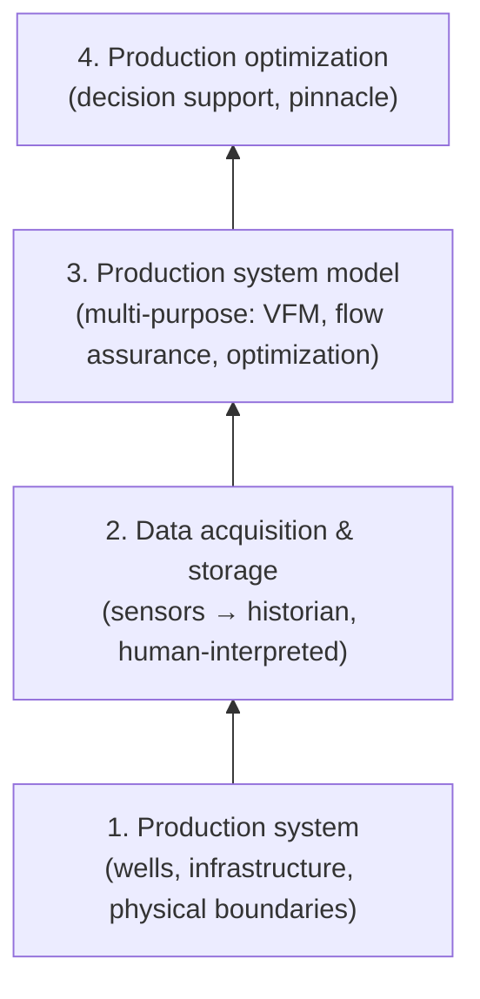

# Organizational and Industry Barriers to Model-Based Production Optimization

[[book-guidelines|↩ Back to guidelines]]

## Why a mathematical-programming thesis ends with an empirical, interview-based chapter

Every prior article in this vault has been about *making the technology work*: a provably sound convex relaxation ([[Global-Optimization-with-Spline-Constraints]]), a convergent global search ([[The-Spatial-Branch-and-Bound-Algorithm-CENSO]]), a validated 3.12% production gain on real BP systems ([[Computational-Validation-and-Case-Studies]]). This chapter — based on a separate IO Center report, drawing on interviews, secondments, and years of industry interaction rather than mathematics — asks the uncomfortable question that a purely technical thesis could otherwise dodge: **if the method works and the value is real, why does the upstream industry still not use it much?**

This matters for exactly the same reason the "trust firewall" was flagged back in [[Subsea-Production-Systems-and-Their-Operation]]: a technically sound tool that nobody deploys, or that gets deployed once and then abandoned, delivers zero value regardless of how tight its optimality certificate is. The chapter's core finding, stated directly: **the primary obstacles are not the optimization technology** — modern solvers are, in the authors' own assessment, "fast, reliable, and most certainly capable" — **but data, organizational, and human factors surrounding it.**

## The technology pyramid: why upstream and downstream diverge

The chapter frames everything through a four-layer "technology pyramid" (Fig. 5.2), each layer strictly dependent on the one below:

This is a strict dependency chain: without adequate instrumentation (layer 2), no model can be validated or calibrated (layer 3); without a trustworthy model, optimization advice (layer 4) is worthless regardless of how sophisticated the solver is. The **downstream** (refining/chemical) industry has a well-populated stack all the way up, cascading through a fully-automated Advanced Process Control (APC) layer before reaching Real-Time Optimization (RTO) — the layers from [[Subsea-Production-Systems-and-Their-Operation]]'s technology-stack table. The **upstream** industry, by contrast, is characterized as still dominated by heuristic, non-model-based decision making, with APC comparatively rare. The chapter's core comparative claim is that this gap is primarily a **layer-2/layer-3 problem** (data and model quality), not a layer-4 problem (optimization algorithms) — a claim the rest of the chapter substantiates observation by observation.

## Data: the load-bearing constraint everything else depends on

**Instrumentation and data availability (§5.4.1).** Modern greenfields are well-instrumented; mature fields — precisely where production optimization has the *highest* theoretical value, because they have complex, evolving bottlenecks — often run with minimal instrumentation and correspondingly minimal modelling effort. This creates a genuinely perverse mismatch: the fields that would benefit most from model-based optimization are often the least equipped to support it.

**Uncertainty and model calibration (§5.4.2)** — the chapter's most conceptually sharp observation, worth stating precisely: **the dominant obstacle for production optimization is *model* uncertainty, not *measurement* uncertainty.** Well rates are typically estimated from infrequent, disruptive well tests (recall from [[Subsea-Production-Systems-and-Their-Operation]] and [[Virtual-Flow-Metering-and-Data-Reconciliation]] that these are expensive and rare); between tests, simple inflow models (like the linear IPR from [[Multiphase-Flow-Network-Modelling]]) have low **temporal predictability** — you don't know if the well's behavior has drifted since the last test. There's a second, distinct failure mode: **spatial uncertainty**. When a production-optimization strategy recommends *moving* the operating point, the model's accuracy at that *new* point is less certain than at the current, well-characterized operating point, because the model may not capture un-modelled nonlinearities away from where it was last calibrated. This is a precise, technically-grounded articulation of exactly the risk that motivated building B-spline surrogates with formal convex-hull relaxations in the first place ([[Surrogate-Modelling-for-Optimization]]) — but note the distinction: the thesis's global-optimization machinery guarantees soundness *relative to the surrogate model*, not relative to the true physical system, and this section is precisely about the gap between those two.

Calibration itself is described as an **underdetermined inverse problem**: tens to hundreds of model parameters, tuned from sparse well-test data, admit *many* solutions — some producing physically unrealistic parameter values — so engineering judgment, not pure numerical fitting, is required to pick a realistic one. Automating this screening step is flagged as an open, hard problem, not because it's conceptually impossible but because encoding "engineering knowledge about what a plausible parameter looks like" into software is itself nontrivial.

**Disruptive operational events (§5.4.3)** compound this: slowly-varying reservoir conditions are easy for the model-recalibration workflow to keep up with (small changes, nearby optimal strategy, low urgency), but sudden events — equipment failure, scheduled maintenance, deposit cleanup ("pigging," reported by one interviewee as happening every two weeks to a month) — demand larger, more work-intensive recalibration under time pressure. This creates a real engineering trade-off explicitly acknowledged in the interviews: production engineers may prefer a **fast, "good enough" solution over a slow, provably-certified one**, precisely in the situations where the old operating strategy is most clearly wrong. This is a direct, practitioner-level echo of the local-versus-global solver trade-off quantified empirically in [[Computational-Validation-and-Case-Studies]] (Case 3.3's non-convergence) and deliberately chosen in [[Virtual-Flow-Metering-and-Data-Reconciliation]] (IPOPT over CENSO for real-time reconciliation) — the same tension, showing up independently from both the algorithmic-complexity side and the organizational-urgency side.

## Technology: the interface is the bottleneck, not the solver

**Software limitations (§5.4.4)** delivers the chapter's most pointed, and most directly falsifiable, claim. The authors report interviewing practitioners specifically about desired optimization-software features — the top answers were *speed* and *integer-handling for routing decisions* — and then state plainly: **they found no major limitation in optimization software on these fronts.** State-of-the-art solvers already handle both well. The actual bottleneck, repeatedly identified, is the **machine-machine interface between the process simulator and the optimization software**: proprietary, black-box simulators that don't expose gradients, don't expose network structure, and can't accept the kind of disaggregated, integer-friendly input a modern MINLP solver wants. This is exactly the diagnosis the *entire technical machinery of this thesis* is built to route around — [[Surrogate-Modelling-for-Optimization]]'s motivation for surrogate models in the first place was precisely this black-box, no-gradient, expensive-to-call interface problem. This chapter is, in effect, independent empirical confirmation — gathered from the people actually running these systems — that the technical diagnosis motivating the thesis's whole approach was the right one to make.

## People: trust, competence, and incentives

**Trust in models (§5.4.5)** is analyzed as a **self-reinforcing negative feedback loop**, illustrated by "the stereotypical cascade of events leading to loss of trust" (Fig. 5.4): a poorly-maintained model produces results that don't match expectations → users lose interest → effort invested in keeping the model current declines → the model degrades further → trust erodes further. This is a genuine vicious cycle, and the chapter is explicit that **breaking it requires management support, not a purely technical fix** — a poorly-maintained model can't be rescued by a better optimization algorithm, because the algorithm was never the point of failure. This directly parallels — and gives real-world grounding to — the calibration-quality concerns that motivated gross error detection in [[Virtual-Flow-Metering-and-Data-Reconciliation]]: knowing *which* model is miscalibrated is only half the battle if there's no organizational mechanism to act on that signal.

**Organization-wide deployment (§5.4.6)** surfaces a genuine tension, not a simple "standardize everything" answer: fields differ in instrumentation, geology, and topology; and — the subtler point — **tools and work practices co-evolve**, so replacing a tool isn't just a software swap, it can force a "radical change" to how engineers actually work. Standardization has real value (knowledge transfer, shared tooling) but genuine costs (loss of field-specific fit, disruption to established practice) — there's no clean resolution offered, just an honest account of the trade-off.

**Integrated competence (§5.4.7)** identifies a specific, concrete skills gap: production engineers understand the field; modelling/optimization specialists understand the mathematics; few people hold both. A sharply illustrative anecdote is quoted verbatim: an engineer takes a PVT (pressure-volume-temperature fluid) model's `<match>` status at face value, not realizing the "match" indicator only reflects that *someone pressed the match button*, not that the resulting model is actually a good fit to reality — a precise example of a user trusting a system's self-reported status without understanding what that status actually certifies. This is worth sitting with directly: it's a **soundness-versus-appearance-of-soundness gap**, exactly the failure mode any verification tool risks when its output is consumed by someone who doesn't understand what property it actually proves — a green checkmark is not evidence of correctness unless the person reading it understands precisely what was checked.

**Limited information sharing (§5.4.8)** and **KPIs/incentives (§5.4.9)** round out the people-side observations: sensor data requires local, field-specific human interpretation that doesn't transfer cleanly to an outside optimization expert (internal or external) without extensive communicated context (planned shutdowns, failing sensors, ongoing injection campaigns) — information that's easy to omit under time pressure and, across company boundaries, further complicated by confidentiality requirements. And because model-based PO's *value* is inherently hard to isolate and measure (a field can only be operated one way at a time), it's correspondingly hard to build clean KPIs around — which in turn undermines the incentive to invest in the maintenance work that trust (§5.4.5) actually depends on. Note the chain here: unmeasurable value → weak incentives → under-maintained models → eroded trust → the exact cascade from Fig. 5.4, closing the loop between an organizational-design problem and the earlier technical-trust problem.

## The three-axis synthesis, and a cautiously optimistic close

The discussion (§5.5) groups everything into **data, technology, people** — deliberately not into a single ranked list of "the top obstacle," because the observations are explicitly interconnected (weak incentives feed weak maintenance, which feeds weak trust, which feeds weak instrumentation investment, and so on). The chapter's stated short-term, achievable technology recommendation is telling in light of everything covered elsewhere in this vault: **improve the process-simulator/optimization-solver interface** — precisely the disaggregation-and-surrogate strategy this entire thesis pursues — described as "low-hanging fruit" reachable by "better fitting two existing technologies" rather than requiring fundamentally new algorithms. Automated model calibration is named as the other near-term opportunity, tempered by the acknowledged difficulty of encoding engineering judgment (which parameter values are physically plausible) into an automatic screening procedure.

The chapter closes on a genuinely qualified, not dismissive, note: production optimization in the upstream industry *is* difficult, for real and well-evidenced reasons — but the authors are explicitly optimistic that the upstream/downstream technology gap will narrow as instrumentation and modelling maturity both improve, converging toward higher operational awareness and safer, more optimal reservoir utilization.

## Framing this for a systems/verification mindset

This chapter is, in effect, an **empirical audit of a trusted computing base's actual weak points**, conducted by talking to the people who operate the system rather than by further hardening the formal core. The thesis's technical chapters build an increasingly strong, increasingly certified core (a sound relaxation, a provably convergent search, an empirically-validated formulation) — but this chapter's central finding is that the *weakest link in the whole chain sits entirely outside that core*: in the data feeding it, in the black-box interface surrounding it, and in the human trust required to act on its output. This is a useful, humbling generalization for any verification or automated-reasoning system: a provably sound checker embedded in a process nobody trusts, maintains, or correctly interprets delivers none of its theoretical value — the PVT `<match>`-button anecdote is exactly the failure mode of a correct tool whose *output semantics* aren't understood by its consumer, which is a sociotechnical problem no amount of additional formal rigor in the checker itself can fix.

## Where this leads

- This chapter closes the thesis's main technical arc; [[Computational-Validation-and-Case-Studies]]'s Case 3.3 non-convergence and the local-versus-global solver trade-off recur here as concrete, independently-corroborated instances of the same speed-versus-certainty tension production engineers report facing operationally.
- The black-box-interface diagnosis here is the empirical, practitioner-sourced confirmation of the exact technical motivation that opened [[Surrogate-Modelling-for-Optimization]] and [[Multiphase-Flow-Network-Modelling]] — this thesis's B-spline/disaggregation strategy is a direct, if partial, technical answer to one of this chapter's named obstacles.
- The trust-cascade (Fig. 5.4) and the calibration/gross-error discussion connect directly to [[Virtual-Flow-Metering-and-Data-Reconciliation]]'s gross error detection — that mechanism is a concrete, deployable technical tool addressing part of the *technology* axis of this chapter's three-axis (data/technology/people) diagnosis, though the chapter is clear that the *people* and *organizational* axes need separate, non-technical remedies.
