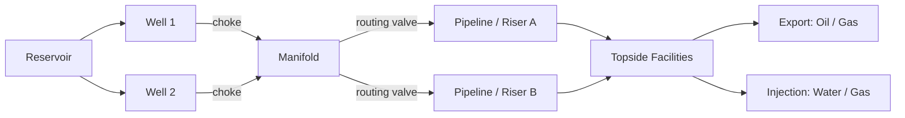
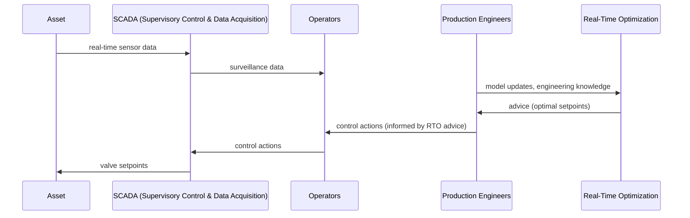

# Subsea Production Systems and Their Operation

[[book-guidelines|↩ Back to guidelines]]

## Why this chapter exists before any optimization math

Before Grimstad writes a single objective function, he spends fourteen pages on plumbing: wellheads, manifolds, risers, valves, and who gets to touch them. This isn't padding. Every later chapter's math — the MINLP formulations, the B-spline surrogates, the spatial branch-and-bound — is a *model* of this physical and organizational system, and a model is only as good as its grounding in what it's approximating. If you don't know what a choke valve physically does, "choke setting" as a decision variable $x_i \in [0, 100]$ is just an opaque symbol. Worse: if you don't understand *why* the plant is a black box (proprietary simulators, sparse sensing, humans-in-the-loop), you won't understand why the rest of the thesis bothers with surrogate models and global optimization at all, instead of just calling a commercial NLP solver on the "obvious" physics.

Think of this chapter as defining the **system boundary** and the **interface contract** for everything that follows: what variables exist, what can be measured, what can be controlled, and — crucially — on what timescale a human or a piece of software gets to intervene.

## The physical system: a graph of pipes and valves

A subsea production system's job is to move hydrocarbons (and sometimes injected water or gas) between a reservoir and topside processing facilities, safely and cost-efficiently. Structurally, it's a directed flow network — which is precisely the abstraction Chapter 3 formalizes as a graph $(N, E)$. Here's the physical vocabulary that graph will later encode:

- **Wells.** A borehole (possibly multi-branched) into the productive zone of the reservoir, completed with tubing to isolate the produced fluid, and instrumented with safety and control valves. The critical valve stack sits in the **Christmas tree** at the wellhead: a *master valve* (full emergency shut-in), a *wing valve* (temporary shut-in, e.g. maintenance), a *kill wing valve* (injecting corrosion inhibitors or methanol), a *swab valve* (well interventions), and downstream of all of these, the **choke** — a robust, continuously adjustable valve that is the main actuator for controlling flow rate from an individual well.
- **Manifolds.** Where it's economical to commingle multiple well streams into fewer pipelines (common in deep water or with long tie-backs), a manifold — a structure of pipes and on/off valves — does the routing. This is where **discrete decisions** enter the picture: a well's stream is routed to *this* outlet pipeline or *that* one, not some continuous blend.
- **Pipelines and risers.** Transport segments subject to hydrostatic and frictional pressure loss and temperature loss. Risers (pipelines running to the surface) are particularly prone to *slugging* — an unstable flow regime where gas exists as large bubbles separated by liquid slugs, which can damage downstream equipment if not accounted for.
- **Subsea processing.** Separation (gravitational tanks or inline hydrocyclone separators), boosting (subsea pumps/compressors), and auxiliary systems (sand handling, buffer tanks for slug damping) that increasingly let hydrocarbons be processed *before* reaching the surface — the "subsea factory" concept.
- **Topside facilities.** Final separation, gas scrubbing, water treatment, and export, located on a platform, FPSO, or onshore.

**What breaks without this vocabulary:** later, when Chapter 3 writes conservation laws over "nodes" and "edges," and imposes a big-M relaxation on "disjunctive on/off valve logic," you need to already know that this disjunction is a *manifold routing valve*, not an abstraction invented for the math — it's a real, physically binary device. Without that grounding, the big-M formulation reads as arbitrary machinery instead of the natural consequence of a valve that is either open or shut.

### A structural sketch

Every arrow here is either a *state* (pressure, temperature, flow composition) or a *control surface* (a valve position) — and this split is exactly the $x$ (continuous states/controls) versus $y$ (discrete routing) split that later becomes the MINLP decision-variable structure in $\min f(x,y)\ \text{s.t.}\ g_i(x,y) \le 0$.

## The control loop: who decides what, and how often

This is the part of the chapter that matters most for understanding *why* the thesis's algorithms need to be fast. Grimstad's Figure 1.4 describes a loop, not a one-shot optimization:

The loop is deliberately **not closed** the way a PID controller's loop is closed. RTO (Real-Time Optimization) sits as an *advisory* layer: it recommends setpoints, but a production engineer mediates, injecting "engineering knowledge" the model doesn't have — a planned well intervention, a known sensor fault, a maintenance window — before anything reaches the actual valves. This is the human-in-the-loop pattern, and it's structurally different from Advanced Process Control (APC) or regulatory (PID) control, both of which *are* closed loops with no human approval step.

**What breaks without this distinction:** if RTO were closed-loop like APC, the thesis's central computational demand — "solve the MINLP fast enough to be useful before the next engineer review cycle" — wouldn't carry the urgency it does. RTO's usefulness depends on producing trustworthy advice *within the cadence of engineer review* (daily, in this thesis's scope), which is precisely why later chapters treat "solve the sBB algorithm's node relaxations quickly" as a first-class design constraint, not just a nice-to-have.

### The three-tier technology stack

Grimstad organizes control/optimization technology by two axes: **temporal scope** (seconds to years) and **spatial scope** (a single well up to the whole reservoir). Three broad tiers emerge, and it's worth naming them precisely because the thesis will keep contrasting RTO against the other two:

| Technology | Loop type | Typical timescale | Models used |
|---|---|---|---|
| **Regulatory control** | Closed (PID, in a PLC) | Seconds | None — direct setpoint tracking |
| **Advanced Process Control (APC)** | Closed (MPC, adaptive control) | Minutes | Dynamic models of topside facilities |
| **Real-Time Optimization (RTO) / Production Optimization (PO)** | Advisory, human-mediated | Hours–days | Nonlinear multiphase flow models |
| *(Reservoir/asset management, for context)* | Advisory, batch | Months–years | High-fidelity reservoir models |

A subtlety worth internalizing: in the *downstream* (refining) industry, RTO typically sits neatly on top of a well-functioning APC layer, and can lean on APC's linearizing effect to simplify its own model. Upstream (subsea), APC is comparatively rare — transient shut-in/start-up behavior is hard to model, disturbances (slugs, well interventions) are frequent, and few advanced-control specialists are stationed offshore. The practical consequence: **RTO upstream has to shoulder more of the burden alone**, which is part of the motivation for building a genuinely capable, fast, global optimization method rather than relying on a simpler local solver bolted onto a well-behaved lower control layer.

## Why the model is the bottleneck: VFM and the calibrate-then-estimate pattern

A recurring theme worth flagging explicitly, because it resurfaces as the entire subject of Chapter 5: **most of the difficulty in RTO is not the optimization algorithm — it's the model.**

Virtual Flow Metering (VFM) systems estimate unmeasured states (e.g. per-well flow rates, when only commingled flow is metered) using a combination of real-time measurements and a simulation model — first-principles, empirical curve-fits, or both. Because well tests (routing an individual well through a test separator to get a ground-truth flow measurement) are expensive and disruptive, they happen rarely — so the "amount of useful information available for model calibration is very low," in Grimstad's own words. Production Optimization (PO) systems, which is what this thesis is really about, demand *more* from the model than VFM does: VFM only has to be accurate at the *current* operating point, while PO must predict accuracy across a whole neighborhood of *candidate* operating points it's searching over. This is why PO adoption has historically lagged VFM adoption, and it's the deep reason the thesis leans so heavily on **surrogate models with formal, checkable convexity/relaxation properties** (Chapter 2) rather than trusting a black-box simulator's output directly across an unvisited region of the search space.

**What breaks without this:** if you treat "the model" as a solved problem and focus only on "the algorithm," you'll misread why B-splines specifically (Chapter 2/3) are the thesis's centerpiece — they're chosen not because they're the most *accurate* surrogate family available (radial basis functions or neural nets can rival or beat them on raw fit quality) but because they come with a convex-hull structural guarantee that a *global* optimizer can exploit soundly, even when calibration data is scarce and the underlying simulator is untrustworthy outside the sampled region.

## Framing this as a systems/verification problem

If you're used to thinking about black-box systems, checkers, and trusted computation (rather than petroleum engineering), here's the translation that makes this chapter click:

- The **process simulator** (OLGA, PIPESIM, a proprietary in-house tool) is exactly a black-box oracle: you can query it at a point and get an output, but you have no access to its internals, no guaranteed derivatives, and no soundness argument about its behavior off the sampled region. This is structurally the same problem as trying to reason about a program via a black-box test harness instead of static analysis over its source.
- The engineers' insistence on "engineering knowledge" gating RTO's advice (Figure 1.4) is a **soundness firewall** — a human-verified filter standing in for a formal one, because no automatic check exists that could certify "this recommended setpoint respects every real-world constraint the model doesn't know about."
- Chapter 2's later move — replacing the black-box simulator with a B-spline surrogate that has a *provable* convex-hull relaxation — is the closest thing this thesis has to trading an untrusted oracle for a component with a checkable structural guarantee, which is the same motivating move behind replacing ad hoc heuristics with sound abstract-interpretation domains: you give up some fidelity to the "true" black-box behavior in exchange for a certificate that your search over the surrogate can't silently miss the truth. That trade — accuracy versus soundness of the search — is a thread worth watching all the way through the sBB algorithm in Chapter 2's continuation.

## Where this leads

This chapter sets the vocabulary and constraints that every later chapter assumes:

- The **well/manifold/pipeline/riser** vocabulary becomes the literal node/edge types of the graph-based flow network formulation in Chapter 3.
- The **choke-as-continuous-control, routing-valve-as-discrete-control** split becomes the $x \in \mathbb{R}^n$, $y \in \mathbb{Z}^q$ split of the MINLP in Section 1.3 (pp. 15–34, covered separately) and its full realization in Chapter 3's flow-network MINLP.
- The **black-box, hard-to-trust simulator** problem is exactly what motivates B-spline surrogate modelling (Chapter 2) and is the direct subject of Chapter 5's industry-barriers study.
- The **advisory, human-mediated RTO loop**, with its daily cadence, is the practical deadline that makes "fast enough to be useful" a real engineering constraint on the spatial branch-and-bound algorithm developed later, not just an academic nicety.
