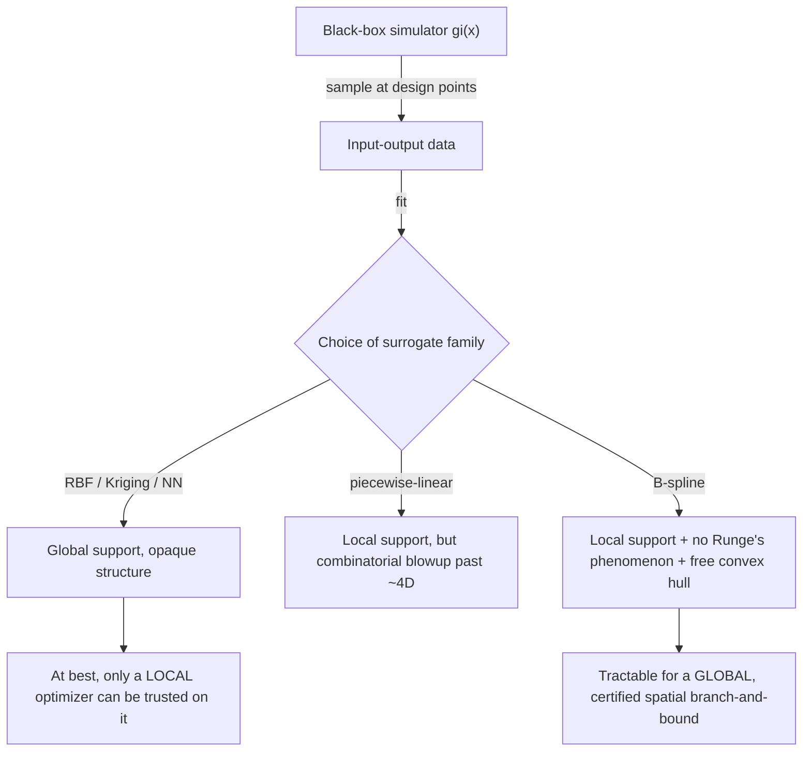

# Surrogate Modelling for Optimization

[[book-guidelines|↩ Back to guidelines]]

## The problem: two obstacles that block naive optimization of a simulator

Section 1.3 sets up an escalating series of obstacles to solving production optimization "as written," and surrogate modelling is the resolution to the last one. It's worth walking the chain in order, because each step motivates the next.

Start from the unconstrained problem $\min_x f(x)$, and add operating constraints to get

$$
\min_x f(x) \quad \text{s.t.} \quad g_i(x) \le 0,\ i = 1,\dots,m.
$$

Add discrete decisions (route this well to pipeline A or B — an *exclusive-or*, not expressible with a continuous constraint) and you get a mixed-integer problem

$$
\min_{x,y} f(x,y) \quad \text{s.t.} \quad g_i(x,y) \le 0,\quad x \in \mathbb{R}^n,\ y \in \mathbb{Z}^q.
$$

This is now, in general, a nonconvex MINLP — NP-hard from the integer side *and* NP-hard from the nonconvexity side. But there's a subtler problem than combinatorial blow-up: **the functions $f$ and $g_i$ are typically implemented as a black-box process simulator, and process simulators usually can't be evaluated with an integer variable as a free parameter.** You can't ask a simulator "what's the pressure if this well is half-routed to pipeline A and half to pipeline B" — physically that doesn't correspond to anything, and most simulator interfaces won't even accept it. So branch-and-bound's usual trick of relaxing integrality and evaluating the relaxed point breaks down before you even get to the nonconvexity issue.

**What breaks without disaggregation:** if you can't evaluate $g_i$ at a relaxed $y$, a spatial or integer branch-and-bound algorithm has no way to compute a bound at a node — the whole search procedure stalls. The fix is *disaggregation*: split the monolithic black-box simulator into smaller simulation units connected by explicit, *linear* connectivity constraints $Ax + By \le c$. Each unit's own nonlinear behavior $\bar{g}_i(x) \le 0$ now depends only on continuous variables; the integer variables $y$ participate exclusively in the linear routing/connectivity logic. This is a genuinely important structural move — it's the same idea as decomposing a monolithic black-box test harness into typed, individually-checkable components so that a solver (or a type checker) can reason about each piece's contract separately instead of treating the whole thing as one opaque oracle. Chapter 3's graph-based flow network model is exactly this disaggregation, industrialized.

But disaggregation only fixes the "can't evaluate at relaxed integer values" problem. It doesn't fix the deeper issue: **each simulation unit $\bar g_i$ is still a black box** — expensive to evaluate, possibly nonconvergent in parts of the search space, and with no derivatives you can trust without a finite-difference approximation. This is where surrogate modelling enters.

## Surrogate models: definition and the property checklist

A **surrogate model** (also: proxy model, metamodel, response surface, emulator) is an approximate model $\tilde g_i \approx \bar g_i$, fitted from input-output samples of the black-box unit, that *replaces* it inside the optimization problem:

$$
\min_x \tilde f(x) \quad \text{s.t.} \quad \tilde g_i(x) \le 0,\ i=1,\dots,\tilde m, \quad Ax + By \le 0.
$$

This is a strict trade: you give up exact fidelity to the true simulator in exchange for a model with properties the optimizer can actually exploit. Grimstad names five properties that determine whether a surrogate is *tractable* for (global) optimization, not just accurate:

1. **Approximation accuracy** — how close $\tilde g_i$ tracks $\bar g_i$ on the region of interest.
2. **Computational cost** of construction and evaluation.
3. **Smoothness.**
4. **Analytical derivatives** — available in closed form, not finite-differenced. This matters twice over: analytical derivatives are cheaper to compute than approximated ones, *and* they're more accurate, which means fewer optimizer iterations to converge (better search directions).
5. **Convexity, or the availability of a convex hull.**

Properties 2–5 are the ones that decide whether a *global* solver can use the surrogate soundly, not just a local one. This is the crux of the whole thesis: property 5 (convex hull availability) is what eventually lets Chapter 2 build a certified global relaxation instead of a heuristic local search.

**What breaks without analytical derivatives, concretely:** a black-box simulator's Jacobian must be finite-differenced, at $n_z \times (2n_x+1)$ simulator calls per Jacobian evaluation (central differences, $n_x$ inputs, $n_z$ outputs). A surrogate with analytical derivatives drops this to $n_z \times n_x$ calls — for a system with independent output structure (some $\partial z_i/\partial x_j = 0$ known a priori from structural information), even fewer. This isn't a minor constant-factor speedup; it's the difference between an optimizer that can afford thousands of iterations and one that can't.

## The family of surrogate models, and why most of them are disqualified

Grimstad surveys the standard toolbox (summarized from Table 1.3):

| Method | Evaluation cost | Construction cost | Key weakness for this problem |
|---|---|---|---|
| Ordinary least squares | $O(N)$ | $O(N^3)$ | Linear basis ⇒ limited accuracy; nonlinear basis reintroduces the problems below |
| Radial basis functions | $O(N)$ | $O(N^3)$, ill-conditioned | No compact support — every basis function touches every point |
| Kriging (Gaussian process regression) | $O(N)$ | expensive nonconvex fit | Construction itself is a hard optimization problem |
| Artificial neural networks | varies | very high | Needs large data; opaque, no exploitable convex structure |
| Piecewise linear interpolation | — | — | Combinatorially explodes past 3–4 dimensions (simplex count grows factorially) |
| **Spline interpolation** | $O(p^2)$ | $O(N^3)$ | — |
| Wavelets | $O(N)$ | $O(N \log N)$ | Naturally oscillating — bad for optimization landscapes |

Two properties recur as the real dividing line among these:

- **Global vs. local support.** Radial basis functions, Kriging, and neural networks build the approximation as a sum of basis functions that are each *globally* nonzero (or nearly so) — changing one coefficient perturbs the function everywhere. Splines and piecewise-linear models instead have **local support**: each basis function (or piece) is nonzero only on a small region, so a local change stays local. This isn't just a numerical-stability nicety — it's what will make a spatial branch-and-bound subdivision *tractable* later, because subdividing a B-spline only has to touch the pieces near the subdivision point.
- **Runge's phenomenon.** Naive high-degree polynomial interpolation is unstable: as you add sample points to force higher-degree fit, spurious oscillations appear *between* the sample points, especially near domain edges — the interpolant gets worse, not better, as you feed it more data at equally-spaced points. This is the textbook argument against "just use one big polynomial." Piecewise construction (splines, piecewise-linear) sidesteps this entirely by keeping each piece low-degree and joining pieces smoothly at *knots*, so adding data adds pieces rather than raising a single polynomial's degree.

**What breaks without local support + no-Runge's-phenomenon, concretely:** picture fitting a surrogate to a pressure-drop correlation with 50 samples using a single degree-49 polynomial. It would interpolate the data exactly at the sample points but oscillate wildly between them — an optimizer searching that surrogate's landscape could report a "solution" sitting on a spurious oscillation peak that has nothing to do with the true underlying physics. A local-support, low-degree-piecewise model can't do this: garbage in one region can't corrupt the surrogate's shape somewhere else.

## Why splines specifically, and a first glimpse of the B-spline

Grimstad's choice — piecewise polynomial basis functions, i.e. **splines**, and specifically the **B-spline** — is presented here only as a preview (full formal treatment is Chapter 2, covered separately as [[The-B-Spline-Theory-and-Construction|the B-spline topic]]). The chapter gives just enough to motivate the choice:

$$
f(x) = \sum_{j=0}^{N-1} c_j B_j(x)
$$

where $c_j$ are coefficients and $B_j$ are piecewise-polynomial basis functions of degree $p$, constructed so the pieces join with maximal smoothness at breakpoints called *knots*. Three properties are flagged as immediately relevant:

- **Local support** — at most $p+1$ basis functions are nonzero at any point, giving fast, numerically stable evaluation.
- **No Runge's phenomenon** — because the construction is piecewise, adding samples doesn't destabilize the fit the way raising a single polynomial's degree does.
- **A convex hull "for free"** — the B-spline's basis functions are a convex combination (this is what makes them well-behaved), so the coefficients $\{c_j\}$ are literally the vertices of a polytope that contains the spline's graph, with essentially zero extra computation. This is the property that will carry the entire global-optimization method in Chapter 2 — a convex relaxation you get as a side effect of the representation, rather than one you have to derive function-by-function.

### Worked example: the Rosenbrock function

The chapter's own worked example (Example 2) approximates the classic banana-shaped Rosenbrock function $f(x,y) = (1-x)^2 + 100(y-x^2)^2$ on $[-2,2]\times[-1,3]$, sampled at only 25 points on a $5\times5$ grid. A **bilinear** B-spline (degree 1) gives a relative error of 16.1%; a **bicubic** B-spline (degree 3) drops that to 2.5% — from the *same* 25 samples, just by raising the piecewise degree. The book notes that a biquartic spline would hit zero error here, because the Rosenbrock function is itself degree-4 polynomial, and — this is the deep point, developed formally in Chapter 2 — **any polynomial can be represented exactly in B-spline form**. This single fact is a large part of why the thesis's method, in the limit, subsumes ordinary polynomial-constrained global optimization rather than being a separate heuristic bolted alongside it.

## Framing this for a verification/analysis mindset

If you're used to thinking about abstract interpretation and sound over-approximation rather than curve-fitting, here's the translation: a surrogate model is exactly an **abstraction** of the true black-box simulator, and the five tractability properties above are a checklist for whether that abstraction supports *sound reasoning* downstream, not just *accurate prediction*. A neural-network surrogate might fit the data better in an $L^2$ sense than a B-spline does, but it gives you no structural handle for a global solver to exploit — you can only trust local gradient descent on it, the same way you can only trust testing (not proof) against an arbitrary black-box oracle. The B-spline's convex-hull property, by contrast, is a genuine **certificate-bearing abstraction**: every point on the true spline's graph is provably contained in the convex hull of its control points, so a solver reasoning over that hull can never unsoundly discard the true optimum. That's the exact shape of the trade abstract interpretation makes when it picks a lattice domain that's coarser than "the real program semantics" but sound by construction — accuracy is sacrificed deliberately, but only in ways that preserve a checkable soundness guarantee. It's worth watching for this pattern explicitly once the B-spline's convex hull property becomes the backbone of the spatial branch-and-bound relaxation in Chapter 2.

## Where this leads

- The five-property checklist (accuracy, cost, smoothness, derivatives, convexity/hull) becomes the standing evaluation criteria the thesis applies to every modelling choice from here on.
- The B-spline preview here — local support, no Runge's phenomenon, free convex hull — is formalized rigorously (basis function recurrence, knot vectors, the multivariate tensor-product construction, the actual convex hull *proof*) in [[The-B-Spline-Theory-and-Construction]].
- The convex hull property specifically is what [[Global-Optimization-with-Spline-Constraints]] turns into an actual polyhedral relaxation usable inside a solver.
- The disaggregation idea (splitting a monolithic simulator into linearly-connected units, keeping integer variables out of the nonlinear parts) reappears as the organizing principle of the entire flow-network formulation in the multiphase flow modelling topic.
