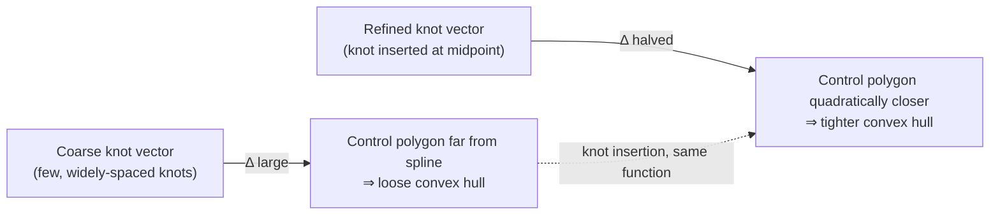

# The B-Spline: Theory and Construction

[[book-guidelines|↩ Back to guidelines]]

## Why a recurrence relation, not a closed-form polynomial

[[Surrogate-Modelling-for-Optimization]] motivated the B-spline as a surrogate model with local support and no Runge's phenomenon. This article does what that one deferred: builds the B-spline formally, from its recursive definition up to the property that will carry the rest of the thesis — the **convex hull property**.

The natural way to write a piecewise polynomial is "polynomial $p_1$ on $[t_0, t_1]$, polynomial $p_2$ on $[t_1, t_2]$, …," glued together with continuity/smoothness constraints at the joints. That representation is awkward to manipulate algebraically — every operation (evaluate, differentiate, refine) has to case-split on which piece you're in. The B-spline's insight is to instead represent the *same* piecewise-polynomial function as a **single linear combination of globally-defined basis functions**, each of which happens to vanish outside a small neighborhood. This buys back all the algebraic convenience of "it's just $\sum_j c_j B_j(x)$, treat it like a vector" while keeping the piecewise flexibility. Everything that follows — the convex hull property, knot insertion, the reformulation into an LP-solvable relaxation — depends on this single representational choice.

## The univariate B-spline: definition by recurrence

A degree-$p$ univariate B-spline is

$$
f(x; c, p, t) = \sum_{j=0}^{n-1} c_j B_{j,p,t}(x) = c^T B_{p,t}(x), \tag{2.1}
$$

built from $n$ coefficients $c = [c_j]_{j=0}^{n-1}$ and a **knot vector** $t = [t_j]_{j=0}^{n+p}$ — a nondecreasing sequence of real numbers. The basis functions themselves are defined by the **Cox–de Boor recurrence**:

$$
B_{j,p,t}(x) = \frac{x - t_j}{t_{j+p} - t_j} B_{j,p-1,t}(x) + \frac{t_{j+1+p} - x}{t_{j+1+p} - t_{j+1}} B_{j+1,p-1,t}(x), \tag{2.2}
$$

$$
B_{j,0,t}(x) = \begin{cases} 1, & t_j \le x < t_{j+1} \\ 0, & \text{otherwise} \end{cases}
$$

Read this bottom-up: degree-0 basis functions are just indicator functions of knot intervals. Degree-$p$ basis functions are a **weighted blend of two degree-$(p-1)$ basis functions**, where the weights are themselves linear (in $x$) ramps that go from 0 to 1 across a knot span. This is precisely a repeated *linear interpolation* — the same geometric idea as de Casteljau's algorithm for Bézier curves, generalized to piecewise knots instead of a single $[0,1]$ interval.

**What breaks without a regular knot vector:** Definition 2.1 requires $t_0 = t_p$, $t_n = t_{n+p}$ (the first and last knots repeat with multiplicity $p+1$ — "clamped" ends), and $t_i \le t_{i+1} < t_{i+p+1}$ otherwise. Without this, the recurrence can divide by zero (handled by a `0/0 = 0` convention) or produce basis functions that don't sum to one — silently breaking the convex-combination property below, which is the property the entire optimization method rests on.

### Three properties, and why each one matters downstream

- **Nonnegativity** (Property 2.1): $B_{j,p,t}(x) \ge 0$ everywhere.
- **Local support** (Property 2.2): $B_{j,p,t}(x) = 0$ outside $[t_j, t_{j+p+1})$ — at most $p+1$ basis functions are nonzero at any point. This is what makes evaluation, and later knot subdivision, touch only a bounded neighborhood instead of the whole spline.
- **Partition of unity** (Property 2.3): $\sum_{j=i-p}^{i} B_{j,p,t}(x) = 1$ for $x \in [t_i, t_{i+1})$.

Put nonnegativity and partition-of-unity together and $f(x) = \sum_j c_j B_j(x)$ is, at every $x$, a **convex combination** of the coefficients $c_j$ — a weighted average with nonnegative weights summing to 1. This single observation is the seed of the convex hull property (§2.2.3 below); everything else in this section is scaffolding around it.

**Smoothness:** at a knot of multiplicity $r$, $f$ is $p-r$ times continuously differentiable; with all-distinct (simple) knots, $f \in C^{p-1}$. The $k$-th derivative of a degree-$p$ B-spline is itself a B-spline, of degree $p-k$ — differentiation stays inside the same representational family, which is exactly the "analytical derivatives available in closed form" property flagged as essential back in the surrogate-modelling discussion.

**Bernstein polynomials as a limiting case** (Property 2.4): if the knot vector collapses to just two distinct values, each repeated $p+1$ times — $t = \{a,\dots,a,b,\dots,b\}$ — the B-spline basis functions reduce exactly to the classical Bernstein polynomials $\binom{p}{j}\left(\frac{x-a}{b-a}\right)^j\left(\frac{b-x}{b-a}\right)^{p-j}$, the basis underlying Bézier curves. So the B-spline is a strict generalization of the Bernstein/Bézier construction to multiple, non-degenerate knot spans — this is also *why* any polynomial can be represented exactly in B-spline form (§2.2.5): a polynomial is just a B-spline with no internal knots.

## From univariate to multivariate: the Kronecker product

For $x \in \mathbb{R}^d$, the multivariate ("tensor product") B-spline basis is the outer product of $d$ univariate bases:

$$
B_{\mathbf p, \mathbf T}(x) = B_{p_1,t_1}(x_1) \otimes \cdots \otimes B_{p_d,t_d}(x_d) = \bigotimes_{i=1}^d B_{p_i,t_i}(x_i), \tag{2.5}
$$

where $\otimes$ is the Kronecker product, giving $N = \prod_i n_i$ total basis functions and $f(x; c, \mathbf p, \mathbf T) = c^T B_{\mathbf p,\mathbf T}(x)$ with $c \in \mathbb{R}^N$. This is the practical, implementation-facing choice: rather than defining a genuinely new multi-dimensional recurrence, you reuse the univariate machinery unchanged in each coordinate and combine results via a vectorized outer product — every evaluation, derivative, and refinement algorithm for the univariate case ports over essentially unchanged. This is a good instance of the general engineering move of building a complex structure as a product of simple, already-verified components rather than defining a new primitive from scratch — the multivariate B-spline inherits nonnegativity, local support, and partition-of-unity for free, because each is preserved under a product of functions that individually have it.

**Rust grounding — the tensor-product structure as a type:**

```rust
struct BSpline1D {
    degree: usize,
    knots: Vec<f64>,       // t_0 ..= t_{n+p}
    coeffs: Vec<f64>,      // c_0 ..= c_{n-1}
}

impl BSpline1D {
    // Cox-de Boor recurrence, degree-0 base case then blend upward
    fn basis(&self, j: usize, p: usize, x: f64) -> f64 {
        if p == 0 {
            return if self.knots[j] <= x && x < self.knots[j + 1] { 1.0 } else { 0.0 };
        }
        let t = &self.knots;
        let left_denom = t[j + p] - t[j];
        let right_denom = t[j + 1 + p] - t[j + 1];
        let left = if left_denom != 0.0 {
            (x - t[j]) / left_denom * self.basis(j, p - 1, x)
        } else { 0.0 };
        let right = if right_denom != 0.0 {
            (t[j + 1 + p] - x) / right_denom * self.basis(j + 1, p - 1, x)
        } else { 0.0 };
        left + right
    }
}

// Tensor-product multivariate B-spline: literally a product over coordinates.
struct BSplineND {
    axes: Vec<BSpline1D>,   // one univariate spline "factor" per dimension
    coeffs: Vec<f64>,       // vectorized N = product(n_i) coefficients
}
```

The `Vec<BSpline1D>` in `axes` is the direct encoding of the tensor-product idea: the multivariate object is a *composition* of the univariate one, not a reimplementation.

**Affine invariance:** an affine transform of the spline's output can be pushed entirely onto the coefficients — $\hat c = \left(\bigotimes_i A_i\right) c$ — without touching the basis functions or knots at all (Eq. 2.8). This is used constantly in the algorithms that follow: reparametrizing, translating, or scaling a B-spline never requires recomputing the basis, only a linear map on the coefficient vector.

## Control points and the convex hull property

This is the section the entire thesis is built on top of, so it's worth deriving carefully rather than just stating the result.

Write the B-spline in **parametric form**: introduce a parameter $\eta$ and let both the domain coordinate $x(\eta)$ and the output $y(\eta)$ be expressed as B-splines over the *same* basis:

$$
x(\eta) = \mu^T B_{\mathbf p,\mathbf T}(\eta), \qquad y(\eta) = c^T B_{\mathbf p,\mathbf T}(\eta)
$$

where $\mu$ (the "knot averages") is chosen so that $x(\eta) = \eta$ — i.e. this is just a bookkeeping device to give each basis function coefficient $c_j$ a *location* $\mu_j$ in the domain, not a genuine reparametrization. In the univariate case, $\mu_j = (t_{j+1} + \cdots + t_{j+p})/p$ — literally the average of $p$ consecutive knots, which is where the name comes from.

Stacking $(x(\eta), y(\eta))$ gives the **control points** $\{P_j\}_{j=0}^{N-1}$, the columns of $P = [\mu, c]^T$ — each control point pairs a coefficient with "where in the domain it lives."

Now recall: nonnegativity + partition of unity mean any point $(x, f(x))$ on the spline's graph is a **convex combination of the control points**. A convex combination of a finite point set always lies inside that set's convex hull. Hence:

> **Lemma 2.1 (Convex hull property).** Let $C = \mathrm{conv}(\{P_j\})$ and $D = \{(x, f(x)) \mid x \in X\}$. Then $D \subseteq C$.

And since a convex hull is always contained in its axis-aligned minimum bounding box:

> **Corollary 2.1 (Minimum bounding box property).** $D \subseteq C \subseteq H$, where $H$ is the axis-aligned bounding box of $\{P_j\}$.

**Why this is the whole ballgame:** you get a *provably valid, sound over-approximation* of the spline's graph — for free, with essentially zero extra computation, just by reading off the coefficients. No sampling, no interval arithmetic, no case analysis on the function's shape. This is exactly the shape of a **certified abstract domain**: the convex hull $C$ (or the cruder box $H$) is an abstraction of the concrete graph $D$, and Lemma 2.1 is the soundness theorem — $D \subseteq C$ means the abstraction never misses a point the concrete function actually visits. [[Global-Optimization-with-Spline-Constraints]] turns this directly into the polyhedral relaxation that a global solver's lower-bounding step uses; without Lemma 2.1's soundness guarantee, that relaxation could silently cut away the true optimum.

### The control polygon, and quadratic convergence under refinement

The piecewise-linear interpolant of the control points is called the **control polygon** (in 1D) or **control structure** more generally — itself expressible as a degree-1 B-spline over the same knots. It's a coarser, easier-to-manipulate proxy for the true spline, and the approximation error between them is bounded:

$$
\|f(x) - h(x)\|_{X,\infty} \le \sum_{i=1}^d C_i \Delta_i^2 \|D_i^2 f\|_{X_i,\infty} \tag{2.11}
$$

where $\Delta_i$ is the largest knot span in dimension $i$. The $\Delta_i^2$ term is the key fact: **halving the largest knot span quarters the control-structure error** — quadratic convergence. This is why the thesis's later spatial branch-and-bound algorithm can *insert knots to tighten a relaxation* and expect the relaxation quality to improve rapidly, not just linearly, as branching proceeds.



## Knot insertion: refining without changing the function

**Knot insertion** augments the knot vector with new knots *without changing the spline geometrically or parametrically* — it's purely a change of basis (vector-space basis for the same underlying spline space). Formally, if $\tau$ is a **refinement** of $t$ (every real number occurs at least as often in $\tau$ as in $t$ — Definition 2.2), then $S_{p,t} \subseteq S_{p,\tau}$ (Lemma 2.2): the coarser spline space embeds into the finer one. There's a matrix $A$ (computed efficiently by the **Oslo algorithm**) such that $B_{p,t} = A^T N_{p,\tau}$, and the new coefficients under the refined basis are simply $d = Ac$ — a linear transformation, no re-fitting, no approximation, no loss of information.

In the multivariate case this becomes a Kronecker product of the per-dimension insertion matrices: $d = (A_1 \otimes \cdots \otimes A_d)\, c$.

**Knot refinement** (Algorithm 2) repeatedly inserts a knot at the midpoint of the currently-largest knot span, in each dimension independently, until a target knot count is reached. Because midpoint insertion always preserves the ordering/multiplicity conditions of Definition 2.1, this can never break knot vector regularity — a useful invariant: the refinement procedure is *safe by construction*, not safe-by-checking.

**What breaks without exact knot insertion:** if refining the knot vector required *re-approximating* the function (say, re-fitting from samples), every refinement step would introduce new approximation error, and a branch-and-bound algorithm that refines at every node would slowly drift away from the true function it's supposed to be bounding. Because knot insertion is an *exact* change of basis, the sBB algorithm can refine as aggressively as needed at each branching step with zero risk of drift — the relaxation gets *tighter*, never *wronger*.

## Representing polynomials exactly, and cubic spline interpolation

Two practical construction procedures close out this section:

**Polynomials → B-spline form (§2.2.5).** Since Bernstein polynomials are a special-case B-spline basis (Property 2.4), and any polynomial can be written in Bernstein form, any polynomial has an exact B-spline representation — a linear change of basis $c = (R_p M_p)^{-1}\lambda$ from the ordinary power-basis coefficients $\lambda$. This is precisely what lets the reformulation in [[Global-Optimization-with-Spline-Constraints]] handle *ordinary polynomial* MINLP constraints as a special case of spline constraints, with no separate machinery needed.

**Cubic spline interpolation (§2.2.6).** Given $M$ sample points $\{x^i, y^i\}$, fitting a B-spline that interpolates them exactly means solving the linear system

$$
\underbrace{\begin{bmatrix} B_{\mathbf p}(x^1)^T \\ \vdots \\ B_{\mathbf p}(x^M)^T \end{bmatrix}}_{B_c}\, c = y \tag{2.20}
$$

— the **collocation matrix** $B_c$. Choosing the knot vector so $B_c$ is square and invertible requires the **Schoenberg–Whitney nesting conditions**: $t_i < x_i < t_{i+p+1}$ for each $i$. A standard choice achieving this is the "free end conditions" knot vector, which repeats the first and last sample points $p+1$ times and drops the second/second-to-last interior knots to make the count match. Solved on a modern sparse solver, this scales to $M \lesssim 100{,}000$ — enough for accurate approximation of most functions of five or fewer variables, the practical dimensionality ceiling this thesis works within.

## Framing this as a soundness/completeness trade

If you're used to reasoning about abstract interpretation, the B-spline machinery in this section maps cleanly onto that vocabulary:

- **The convex hull $C = \mathrm{conv}(\{P_j\})$ is an abstract domain element**, and Lemma 2.1 ($D \subseteq C$) is its **soundness proof** — the abstraction never excludes a concrete behavior.
- **Knot insertion is a refinement operator on the abstract domain**, analogous to refining an abstract-interpretation lattice (e.g. widening/narrowing in reverse) — and critically, it's *exact* on the concrete function (no loss of precision in the underlying spline), only the *tightness of the abstraction* ($C$ versus the true graph $D$) improves. This decoupling — refine the abstraction without touching the concrete semantics — is precisely the property you want from a CEGAR-style refinement loop: each refinement step provably shrinks the gap between abstract and concrete without ever risking unsoundness.
- **The quadratic convergence bound (2.11)** is a *completeness* guarantee in the sense that matters for a branch-and-bound loop: refining enough eventually drives the relaxation gap to zero, guaranteeing the search terminates (or converges) rather than looping forever on a permanently-loose abstraction.

## Where this leads

- Lemma 2.1's convex hull property is turned into an actual **linear-programming-solvable relaxation** of a B-spline constraint in [[Global-Optimization-with-Spline-Constraints]] — the bounding-box and convex-hull relaxations described there are literally $H$ and $C$ from this article, used as constraint sets.
- Knot insertion (Algorithm 1) and knot refinement (Algorithm 2) become the mechanism by which the spatial branch-and-bound algorithm ([[The-Spatial-Branch-and-Bound-Algorithm-CENSO]]) subdivides a B-spline at a branching point — "B-spline subdivision under branching" is knot insertion at the chosen branch point, exploiting exactly the exactness and quadratic-convergence properties established here.
- The multivariate tensor-product construction, and its knot vectors per dimension, reappear directly as the surrogate models for pressure-drop and flow correlations in the [[Multiphase-Flow-Network-Modelling|flow network modelling]] and [[Virtual-Flow-Metering-and-Data-Reconciliation|virtual flow metering]] chapters.
- Cubic spline interpolation via the collocation matrix (2.20) is the concrete fitting procedure used throughout the thesis's case studies whenever a B-spline surrogate is built from simulator or field data.
