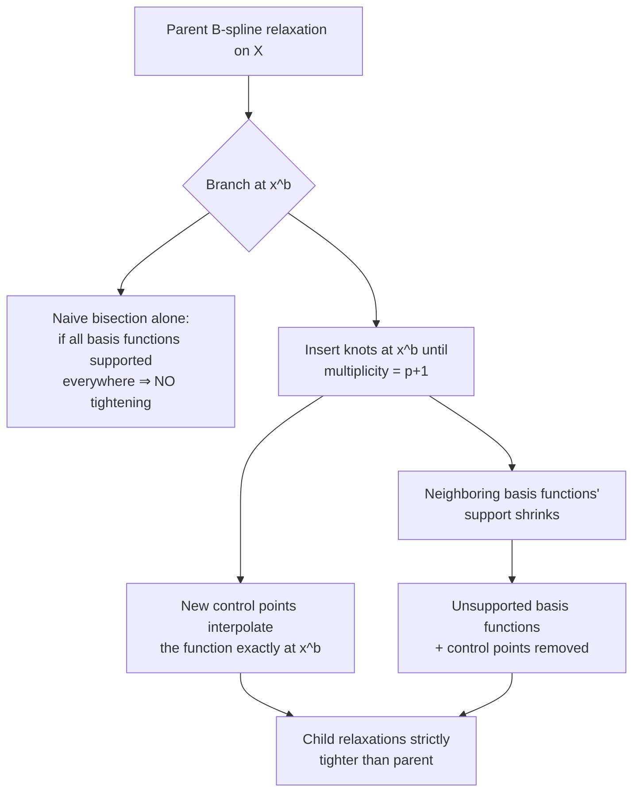

# The Spatial Branch-and-Bound Algorithm (CENSO)

[[book-guidelines|↩ Back to guidelines]]

## The shape of the algorithm: search plus a certified pruning oracle

[[Global-Optimization-with-Spline-Constraints]] built a sound, LP-solvable relaxation of a single B-spline constraint. This article is where that relaxation gets wired into an actual search procedure — a **spatial branch-and-bound (sBB)** algorithm — that provably finds the *global* optimum of a nonconvex MINLP, not just a local one, and certifies when it has done so.

The high-level shape will be familiar to anyone who has implemented CDCL-style search or CEGAR-based verification: maintain a worklist of subproblems (nodes), at each node compute a sound *bound* cheaply, use that bound to either **prune** the node (it can't contain anything better than what you already have) or **refine** it (split into smaller subproblems and push them back onto the worklist). The correctness argument in every such algorithm has the same three-part shape — soundness of the bound, monotonic improvement under refinement, and a fairness/termination condition on the search — and Grimstad's §2.4.6 states and discharges exactly these three obligations for sBB.

## Algorithm 3: the main loop

```
L ← {P}                          # worklist, root is the whole problem
z^u ← ∞                          # best known upper bound (incumbent)
while L ≠ ∅:
    select P_k from L            # best-bound-first (§2.4.1)
    (optional) tighten bounds on P_k             # §2.4.4
    if bounds tightening proves P_k infeasible: continue   # fathom
    R_k ← convex relaxation of P_k                # §2.3 (the article above)
    solve R_k; let x̄_k, z̄_k be the optimum and its value
    if x̄_k feasible for P_k: z^u ← min(z^u, z̄_k)
    if z̄_k ≥ z^u  or  z^u − z̄_k ≤ ε  or  R_k infeasible:
        continue                  # fathom: pruned, converged, or infeasible
    else:
        (optional) locally solve P_k for possible improved ẑ_k   # §2.4.5
        z^u ← min(z^u, ẑ_k)
        choose branching variable x_i and point x_i^b            # §2.4.2
        create P_k^- (x_i ≤ x_i^b), P_k^+ (x_i ≥ x_i^b)          # §2.4.3
        L ← L ∪ {P_k^-, P_k^+}
return z^u
```

Every node carries **two numbers**: $\bar z_k$ (the LP relaxation's optimal value — a certified *lower* bound on the node's true optimum, by soundness of the relaxation) and the running $z^u$ (the best *feasible* point found anywhere — an upper bound on the *global* optimum). A node is **fathomed** (deleted without further work) under exactly three conditions: its own lower bound already exceeds the incumbent ($\bar z_k \ge z^u$, it can't possibly contain anything better); it has converged to within tolerance ($z^u - \bar z_k \le \varepsilon$); or its relaxation is outright infeasible. Everything that survives fathoming gets split into two children and re-queued.

**Rust grounding — the node/worklist shape as types:**

```rust
struct Node {
    domain: Bounds,          // current [x_l, x_u] box for this subproblem
    lower_bound: f64,        // z̄_k from solving the LP relaxation
}

struct SBB {
    worklist: BinaryHeap<Node>,   // ordered by lower_bound (best-bound-first)
    incumbent: f64,               // z^u, best feasible objective found so far
}

impl SBB {
    fn solve(&mut self, eps: f64) -> f64 {
        while let Some(node) = self.worklist.pop() {
            if node.lower_bound >= self.incumbent - eps {
                continue; // fathomed: this whole subtree can't beat the incumbent
            }
            let relaxation = build_convex_hull_relaxation(&node.domain);
            let (x_bar, z_bar) = solve_lp(&relaxation);
            if is_feasible(&x_bar, &node.domain) {
                self.incumbent = self.incumbent.min(z_bar);
            }
            if z_bar >= self.incumbent || self.incumbent - z_bar <= eps {
                continue; // fathomed
            }
            let (var, point) = select_branching_variable_and_point(&node);
            let (left, right) = subdivide(&node, var, point); // Algorithm 4
            self.worklist.push(left);
            self.worklist.push(right);
        }
        self.incumbent
    }
}
```

The `BinaryHeap<Node>` ordered by `lower_bound` *is* the best-bound-first selection rule below, made concrete.

## Selection: best-bound-first (§2.4.1)

$$
\text{select } P_k \text{ with } k \in \arg\min_{j:\, P_j \in L} \{\bar z_j\}. \tag{2.27}
$$

Always process the node with the *smallest* lower bound first. The motivation is direct: that node is the one most likely to contain the true global optimum (nothing in the worklist can be ruled out yet, and this one has the least evidence against it), so processing it first maximizes the chance of tightening the incumbent — and by definition, this policy is "bound improving," which is exactly requirement 1 of the convergence proof below.

## Branching: which variable, and where to split it (§2.4.2)

**Variable selection.** Integer variables are branched first (fix them to concrete values before touching continuous ones). Once all integers are fixed, spatial branching picks, among continuous variables participating in nonconvex constraints, the one with the **largest current bound range**:

$$
\text{select } x_i \text{ with } i = \arg\max_{i \in I_c} \{x_i^u - x_i^l\}. \tag{2.28}
$$

This rule is a direct consequence of the quadratic-convergence bound from [[The-B-Spline-Theory-and-Construction]] (Eq. 2.11): the control-structure approximation error scales with $\Delta_i^2$, the largest knot span. Branching the variable with the widest range is, in effect, attacking the dimension where the relaxation is currently loosest — the same greedy "reduce the biggest source of imprecision first" heuristic that shows up in refinement loops across abstract interpretation and CEGAR-style solvers.

**Branching point selection.** Naively bisecting at the midpoint is simple but can be wasteful; naively branching exactly at the relaxed solution $\bar x_i^k$ can produce a badly unbalanced tree (one trivial child, one nearly-as-hard-as-the-parent child). Eq. (2.29) blends the two, guaranteeing a minimum distance from the variable bounds:

$$
x_i^b = \max\!\left(x_i^l + b,\ \min\!\left\{x_i^u - b,\ \alpha \bar x_i^k + (1-\alpha)x_i^m\right\}\right)
$$

where $x_i^m$ is the midpoint, $b = \beta(x_i^u - x_i^l)/2$, and CENSO's defaults are $\alpha = 0.25$, $\beta = 0.2$. Branching near $\bar x_i^k$ is deliberately chosen to make the current relaxed solution *infeasible* in both children — forcing genuine progress rather than repeating the same near-optimal relaxed point.

## B-spline subdivision: making branching *provably* tighten the relaxation (§2.4.3, Algorithm 4)

This is the step that connects branching back to the B-spline machinery specifically, and it's worth being precise about *why* it's needed rather than just bisecting the domain and re-solving.

Recall from [[The-B-Spline-Theory-and-Construction]] that a B-spline basis function $B_{j,p,t}$ has **local support** — it's zero outside $[t_j, t_{j+p+1})$. If a child subproblem's domain $X_k$ doesn't overlap a basis function's support interval at all, that basis function is *unsupported* in the child and can simply be dropped — along with its control point — from the child's relaxation, for free. But Grimstad shows this alone is **not sufficient**: a B-spline can have every basis function supported across its *entire* domain (this happens whenever the B-spline is representing an exact polynomial via the construction in §2.2.5), in which case naive bisection changes nothing about the relaxation's tightness — the union of the two children's convex hulls is literally identical to the parent's.

The fix is **knot insertion at the branching point** (Algorithm 4): repeatedly insert $x_i^b$ into the knot vector until its multiplicity equals the spline order $p_i + 1$, which is exactly the condition that makes the spline discontinuous enough at that point to legitimately split into two independent pieces. This does two things simultaneously:
1. It creates new control points exactly at the split, which — by construction of a clamped/regular knot vector — coincide with the function surface there, making the relaxation *tight* at the subspace boundary.
2. It shrinks the support of neighboring basis functions, which then become eligible for the "unsupported ⇒ removable" pruning above.

The worked example (a quadratic B-spline for $4x^2 - 4x + 1$, bisected at $x^b = 0.5$) makes this concrete: naive bisection alone leaves the child relaxations' union identical to the parent's; inserting knots at the bisection point visibly pulls the control points toward the curve and tightens both children; optionally refining further (inserting *additional* knots beyond the minimum) tightens them again, at the cost of more variables.

**Why this matters for correctness, not just performance:** a *consistent* bounding procedure — the property the convergence proof needs — requires that lower bounds are non-decreasing as the search descends the tree ($X_i^q \subset X_i$ and the relaxation gets tighter, never looser, as $q$ increases). If subdivision could produce a child relaxation *no tighter* than the parent's (which naive bisection alone can do, as the worked example shows), the algorithm might never converge — it would generate an infinite sequence of equally-loose bounds. Knot insertion at the branch point is what *guarantees* strict improvement, closing this gap.



## Bounds tightening: cheap pruning before the LP even runs (§2.4.4)

CENSO applies two lightweight domain-reduction techniques *before* generating the relaxation, to shrink variable ranges (and sometimes prove a subproblem infeasible outright) more cheaply than a full LP solve would:

- **Reduced-cost bounds tightening (RCBT):** exploits the LP relaxation's own reduced costs (sensitivity of the objective to a variable bound) to derive a tighter bound — Eq. (2.30): if a variable sits at its lower bound in the relaxed solution with a positive reduced cost $d_i$, the true optimum can be shown to live within $(\hat z - \bar z)/d_i$ of that bound.
- **Feasibility-based bounds tightening (FBBT):** ordinary interval propagation — push variable intervals through each constraint (linear and B-spline alike) to shrink ranges, in the same spirit as constraint propagation in a CSP solver.

Grimstad is candid about their limits (Remark 2.6): RCBT "seldom produces deep cuts," and FBBT — being local, one variable/one constraint at a time — doesn't generally find the *minimal* box. More powerful techniques (optimality-based BT) exist but cost more; CENSO trades tightness for speed here deliberately.

## Upper bounding: local search as a companion, not a competitor (§2.4.5)

At select nodes (every node down to depth 2, then periodically), CENSO runs a **local solver** on the original nonconvex subproblem to try to find a genuinely feasible point and improve the incumbent $z^u$ early. BONMIN handles nodes with free integer variables; once integers are fixed, IPOPT handles the pure NLP. The value of doing this is structural: a better incumbent tightens the fathoming test ($\bar z_k \ge z^u$) for *every other node in the worklist*, potentially pruning large swaths of the search tree without ever visiting them. This is the same "cheap heuristic finds a good bound early, prunes a huge amount of search later" pattern that makes a decent initial feasible assignment valuable in SAT/CSP solving even before the main search loop does its systematic work.

One sharp caveat: low-degree B-splines have **discontinuous higher derivatives at the knots** (a degree-$p \le 2$ spline has discontinuous second derivatives even with simple knots), which can mislead a gradient-based NLP solver like IPOPT into poor search directions — a reminder that "has analytical derivatives" (one of the five surrogate-model desiderata from [[Surrogate-Modelling-for-Optimization]]) is a matter of degree, not a binary property.

## Convergence: the three-part proof obligation (§2.4.6)

An sBB algorithm converges if $\lim_{k\to\infty} |z_k^u - z_k^l| = 0$. Following Horst and Tuy, this reduces to three checkable conditions:

1. **The selection operation is bound improving** — satisfied trivially by best-bound-first (§2.4.1): by definition it always processes the currently-most-promising node.
2. **The bounding operation is consistent** — lower bounds form a non-decreasing sequence under further partitioning of any unfathomed node. This decomposes into three sub-facts, each established elsewhere in the chapter: branching strictly shrinks the domain ($X_i^q \subset X_i$, from §2.4.2); the B-spline relaxation is *valid* (Lemma 2.1's $D \subseteq C$, from [[The-B-Spline-Theory-and-Construction]]); and — the piece specific to this section — the knot-insertion subdivision procedure guarantees $F_{R_i^q} \subseteq F_{R_i}$ as subdivision proceeds, with the relaxation becoming *exact* at a terminal node where a branching variable's bounds have collapsed to a point.
3. **Bounds tightening produces only valid inequalities** — RCBT and FBBT never eliminate a feasible, let alone optimal, solution; they only tighten around what's provably still reachable.

Notice the proof's modular structure: each condition is discharged by pointing back to a property proven *once*, earlier, about the representation itself (the convex hull's soundness, knot insertion's exactness) — rather than needing a fresh, ad hoc argument for this particular algorithm. That's the payoff of building the sBB algorithm on top of B-splines specifically rather than on a generic black-box relaxation scheme: the representation's own mathematical properties *are* the convergence proof's load-bearing lemmas.

## The CENSO architecture

CENSO (Convex ENvelopes for Spline Optimization) is the C++ implementation of Algorithm 3, composed from four external solver dependencies, each doing one job:

| Component | Role |
|---|---|
| **SPLINTER** | All spline computation: reformulation to B-spline form, evaluation, derivatives, knot insertion/refinement — the direct implementation of [[The-B-Spline-Theory-and-Construction]]'s theory, built on the linear-algebra library EIGEN |
| **GUROBI** | Solves the lower-bounding LP relaxations $R_k$ |
| **IPOPT** | Local NLP solver for upper bounding, once integer variables are fixed |
| **BONMIN** | Local MINLP heuristic solver for upper bounding, while integer variables are still free |

The default relaxation in CENSO is the *convex hull* relaxation of §2.3.1 (the tight one), not the bounding box — a deliberate choice to favor relaxation quality over LP size, tempered by the mitigations (separability, pruning) discussed in [[Global-Optimization-with-Spline-Constraints]].

## Framing this as CEGAR with a structurally-guaranteed refinement step

If you're used to CEGAR-style verification loops, sBB here maps almost one-to-one: the convex relaxation is the abstract model; solving it and checking feasibility against the concrete constraints is the "spurious counterexample" check ($\bar x_k$ feasible for $P_k$ or not); and branching + knot insertion is the **refinement** step that eliminates the spurious region and provably tightens the abstraction. The unusual and valuable thing about this particular instance is that the refinement step's soundness and progress are *guaranteed by the representation itself* (Lemma 2.1 plus the exactness of knot insertion), rather than requiring a separate interpolant-generation or predicate-discovery procedure the way generic CEGAR does. That's a genuinely different — and stronger — position to be in: the "which predicate refines the abstraction" question that's usually the hard, heuristic part of CEGAR is answered here by a closed-form, always-correct recipe (insert a knot at the branch point), because the abstract domain was chosen specifically to have that property.

## Where this leads

- This is the algorithm that Chapter 2's [[Computational-Validation-and-Case-Studies|computational results]] benchmark against BARON, COUENNE, and LINDOGLOBAL, and that solves the pump network synthesis problem.
- The exact same sBB loop — unmodified in its core logic — is what gets applied to the full production-optimization MINLP in [[Multiphase-Flow-Network-Modelling]], with degree-of-freedom analysis used there specifically to cut down the number of continuous branching variables the rule in Eq. (2.28) has to consider.
- [[Virtual-Flow-Metering-and-Data-Reconciliation]] reuses the B-spline surrogate + solver combination in a different problem shape (data reconciliation, solved primarily by IPOPT rather than the full sBB loop, since that application doesn't require certified global optimality on the same timescale).
- Appendix A's unpublished notes extend two pieces covered here directly: tighter bounds tightening exploiting basis-function properties, and a piecewise (rather than global) [[Global-Optimization-with-Spline-Constraints#Convex hull relaxation|convex hull relaxation]] proven strictly tighter than Lemma 2.1's — a refinement of exactly the relaxation this article's algorithm depends on.
