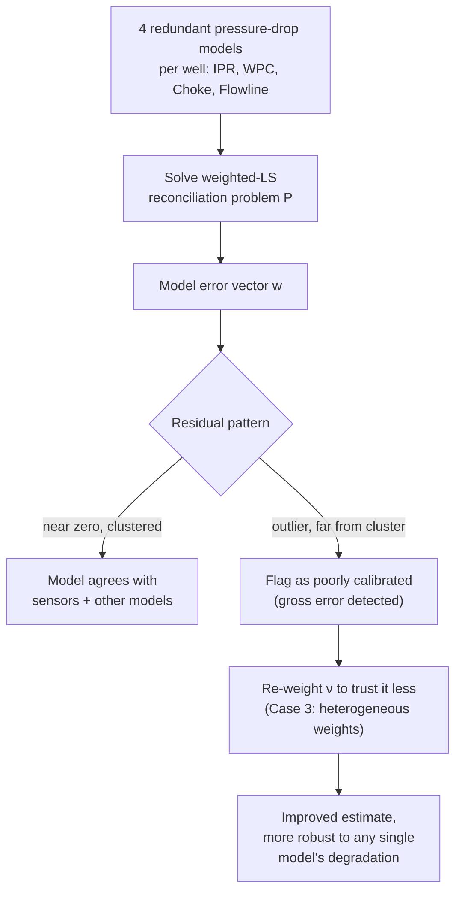

# Virtual Flow Metering and Data Reconciliation

[[book-guidelines|↩ Back to guidelines]]

## A different problem shape, the same surrogate technology

Every previous topic in this vault has been about *optimization* — finding the best operating point. This chapter poses a structurally different question: **given the sensors we actually have, what are the unmeasured flow rates most likely to be, right now?** That's an *estimation* problem, not a search-for-the-best problem, and it turns out to have exactly the same computational obstacle as production optimization (a black-box, non-smooth, gradient-free process model) and exactly the same solution (replace the black box with a B-spline surrogate). This article treats Virtual Flow Metering (VFM) as an application that reuses [[The-B-Spline-Theory-and-Construction|B-spline theory]] in a genuinely different problem shape, worth understanding on its own terms.

## Why flow rates specifically go unmeasured

Subsea production systems are heavily instrumented for pressure and temperature (cheap, reliable sensors) but sparsely instrumented for flow rate (expensive multiphase flow meters, often installed on only a handful of lines, if any). VFM is the software layer that closes this gap: infer the unmeasured flow rates from what *is* measured, using a process model to relate them. This is "flow estimation" or "data reconciliation," and — run repeatedly as new measurements arrive — it's what's meant by *virtual* flow metering: a continuously-updated software estimate standing in for a physical meter that isn't there.

## The estimation problem, formally

Let $y$ be the measured variables (with actual measurements $\bar y$) and $x$ the unmeasured variables to estimate. Reconciliation error $v = y - \bar y$ measures how far the *reconciled* (adjusted) measurement drifts from what the sensor actually read; model error $w$ measures how far the process model's prediction misses the reconciled values. The estimation problem is a weighted least-squares NLP:

$$
\begin{aligned}
\min_{x,y,v,w}\quad & \|v\|_M^2 + \|w\|_N^2 \\
\text{s.t.}\quad & g(x,y) = w \\
& y - \bar y = v \\
& x \in X
\end{aligned} \tag{P}
$$

where $\|v\|_M^2 = v^T M v$ and $\|w\|_N^2 = w^T N w$ are weighted (Mahalanobis-style) norms, with $M, N$ diagonal, positive-definite weight matrices — interpretable as *inverse covariances*: large weight means "trust this closely," small weight means "this is noisy or unreliable, don't force it to fit exactly." $X$ is a convex polytope encoding linear relations among the unmeasured variables (mass balance, GOR/WCT splits — the same kind of linear constraints seen in [[Multiphase-Flow-Network-Modelling]]).

**Why allow the measurements themselves to move ($v \ne 0$) rather than treating them as fixed?** Because sensor readings carry noise too. If you pinned $y = \bar y$ exactly and only let $x$ absorb all discrepancy, a single noisy pressure reading could force a wildly wrong flow-rate estimate. Letting both $v$ and $w$ absorb error, weighted by how much you trust each source, produces a genuinely *reconciled* estimate — a best compromise across every model and every sensor simultaneously, rather than treating one side of the system as ground truth.

## A concrete two-well instantiation

For a two-well subsea template (Fig. 4.1), $g$ is built from a chain of pressure-drop relations, each contributing its own model-error term:

- **IPR** (inflow performance): $w_i^{\text{ipr}} = p_i^{\text{bh}} - f_i^{\text{ipr}}(q_i^{\text{liq}})$ — reservoir-to-wellbore.
- **WPC** (well performance curve): $w_i^{\text{wpc}} = p_i^{\text{wh}} - f_i^{\text{wpc}}(q_i^{\text{liq}})$ — a combined bottomhole-to-wellhead relation, preferred over separately modelling IPR+VLP because the VLP curve alone can be *ambiguous* in flow rate at low rates under gas lift (multiple flow rates giving the same pressure drop) — the combined WPC is better-behaved.
- **Choke**: $w_i^{\text{chk}} = p^{\text{man}} - f_i^{\text{chk}}(q_i^{\text{liq}}, p_i^{\text{wh}}; \bar t_i^{\text{wh}}, \bar u_i)$ — a multiplier model built from the valve equation plus multiphase correction factors.
- **Flowline**: $w^{\text{fl}} = p^{\text{sep}} - f^{\text{fl}}(p^{\text{man}}, q_C^{\text{liq}}, r_C^{\text{gor}}, r_C^{\text{wct}}; \bar t^{\text{man}})$ — using the OLGAS 3P multiphase correlation.

Every one of these is exactly the shape of black-box function that [[Multiphase-Flow-Network-Modelling]] built its edge relations $f_e(\cdot)$ out of — this chapter is quite literally reusing that same modelling vocabulary, just wiring it into an estimation objective instead of an optimization objective.

**The key structural feature, worth naming explicitly: redundancy.** There are *four* independent pressure-drop relations for a single well's flow rate (IPR, WPC's own internal VLP, choke, flowline), and they all get folded into one reconciliation problem simultaneously rather than picking one "the" model per well. This redundancy is not incidental — it's the entire reason gross error detection (below) works at all.

## Surrogate models: same construction, decoupled application

Section 4.3 recaps the B-spline machinery already fully developed in [[The-B-Spline-Theory-and-Construction]] — the recurrence (4.5), local support, smoothness — and applies it to replace each $f_i$ (not $g_i$ directly — note the chapter's own careful phrasing: $g_i(\cdot) = y_i - f_i(\cdot) = w_i$, so it's $f_i$ that gets approximated by a surrogate $\phi_i$, giving $g_i \approx y_i - \phi_i$). Construction is the same **cubic spline interpolation via the collocation matrix** from Eq. (2.20)/(4.6), using the free-end-conditions knot vector, done **entirely offline**: sample the simulator once, solve one linear system, store the resulting B-spline, and never touch the original black-box simulator again during real-time operation.

A worked accuracy comparison for the well-performance curve, at three sampling densities:

| Samples $N$ | $\|e_N\|_\infty$ | $\|e_N\|_2$ |
|---|---|---|
| 5 | $1.1 \times 10^{-2}$ | $7.8 \times 10^{-2}$ |
| 10 | $6.1 \times 10^{-4}$ | $5.7 \times 10^{-3}$ |
| 50 | $6.5 \times 10^{-5}$ | $2.4 \times 10^{-4}$ |

Error drops by roughly an order of magnitude for each doubling-plus of sample count, and the paper is candid about the scale that matters: at 5 samples the surrogate already tracks the underlying correlation to $\sim 1\%$, an error the authors argue is dwarfed by the gap between the correlation itself and physical reality. This is the concrete evidence backing the surrogate-modelling claim from [[Surrogate-Modelling-for-Optimization]] that spline approximation error can be made essentially negligible relative to the model-reality gap that was always there.

**Why this decoupling matters operationally, not just theoretically.** The B-spline surrogate construction (sampling + solving one linear system) happens once, offline. From that point on, the *real-time* reconciliation loop never calls the process simulator at all — it only evaluates cheap, smooth, closed-form-derivative B-splines. This is the direct payoff of the I/O and convergence-cost arguments back in [[Subsea-Production-Systems-and-Their-Operation]] and [[Surrogate-Modelling-for-Optimization]]: a VFM system running every 10 seconds simply cannot afford to re-converge a full multiphase simulator on every cycle, and the surrogate is what makes the real-time budget achievable at all.

## Gross error detection: turning redundancy into a diagnostic

Because the reconciliation problem carries *multiple, independently-weighted* model-error terms for the same physical quantity, solving $P$ doesn't just produce a flow-rate estimate — it produces a **residual signature** across all the models simultaneously, and that signature is diagnostic.

Case 2 (uniform weights, $N = I$, heavy trust in pressure measurements via $M = 10^3 I$) reveals this directly: after solving the reconciliation problem across a 26-hour simulated trace, the flowline VLP's model-error variable sits systematically far from every other model's error, while the well-level IPR/WPC/choke errors cluster near each other. Two structural interpretation rules are stated explicitly:

1. **Small residuals (near zero)** mean a model agrees with the reconciled pressures — it's behaving well.
2. **Residuals that cluster together** across different models mean those models agree *with each other* on the implied flow rate, even before checking against ground truth.

A residual that's an outlier relative to the rest — as the flowline VLP's is here — flags **a poorly calibrated model**, without needing an independent ground-truth flow measurement to detect it. This is genuinely useful: recall from [[Subsea-Production-Systems-and-Their-Operation]] that well tests (the usual route to model calibration) are expensive and infrequent, so being able to flag a bad model *from redundancy alone*, using only the pressure/temperature sensors that are already cheap and plentiful, is a real diagnostic capability the naive single-model VFM approach doesn't have.

Case 3 exploits this: reweight $\nu$ using an independent estimate of each model's own uncertainty (a normalized sum of prediction errors against flow-test data), giving the flowline VLP a much smaller weight ($\nu^{\text{fl}} = 0.05$ versus $1.0$ in the uniform case). The result is a clear, measured reduction in mean/max absolute estimation error across both wells and the flowline compared to Case 2's uniform weighting — concrete evidence that letting the *reconciliation itself* down-weight a known-bad model beats treating all redundant models as equally trustworthy.

## Solution times, and a deliberate scope decision

The reconciliation NLP is solved by **IPOPT to local optimality**, not by CENSO's global sBB search — and this is a deliberate, stated trade-off, not an oversight. Reported solution times: mean 0.01–0.5s, max under 3.1s across all model configurations, comfortably inside the 10-second real-time sampling budget. The authors explicitly note that a *global* solve via CENSO would be considerably more expensive and would likely blow the real-time budget, but suggest running a global solve *in parallel*, off the critical path, purely as a check for whether the fast local solver has gotten stuck in a bad local optimum.

**Why local suffices here in a way it didn't for production optimization.** [[The-Spatial-Branch-and-Bound-Algorithm-CENSO]] exists because production *optimization* searches over an entire operating envelope, where a local solver can plausibly land on a materially suboptimal operating point far from the true best. Reconciliation is different in kind: the "search" is really tracking a slowly-drifting true state from a warm start (the previous cycle's estimate), across smooth, B-spline-surrogate constraints that (per the note on discontinuous higher derivatives from [[The-Spatial-Branch-and-Bound-Algorithm-CENSO]]) behave well for gradient-based local search. This is a genuinely important lesson in matching algorithmic machinery to the actual shape of the problem: the thesis doesn't reflexively reach for its own flagship global solver everywhere — it reasons about which problems actually need global guarantees and which don't, and reserves the expensive machinery for the former.

## Framing this for a verification/analysis mindset

The reconciliation problem here is structurally a **soft, weighted constraint-satisfaction problem**: rather than a hard SAT-style "find *any* assignment satisfying every constraint," it's "find the assignment that comes *closest* to satisfying every constraint, where closeness is weighted by how much you trust each constraint" — exactly the shape of a MAX-SAT or weighted-CSP relaxation, with the weight matrices $M, N$ playing the role of per-clause weights. Gross error detection is then a form of **model diagnosis from redundant, independently-checkable constraints** — if you have $k$ independent ways to derive the same fact and $k-1$ of them agree while one doesn't, the odd one out is the likely culprit, the same logic underlying fault localization from redundant assertions or diagnosing which axiom in an inconsistent theory is the actual source of unsatisfiability, without needing an external oracle to say which one is "true."

## Where this leads

- This is the last of Chapters 2–4's direct applications of the reformulation/B-spline machinery; the thesis's remaining chapter ([[Organizational-and-Industry-Barriers-to-Model-Based-Production-Optimization]]) turns to why, despite results like these, adoption remains hard in practice.
- The redundant-model, weighted-reconciliation pattern here is the same shape of problem [[Computational-Validation-and-Case-Studies]] validates against — both use the GAP simulator as an independent reference to check whether the optimization or estimation result is trustworthy.
- The explicit local-versus-global solver trade-off made here (IPOPT for speed, CENSO only as an optional parallel sanity check) is a concrete instance of the "when is a certified global search actually necessary" question that recurs across the whole thesis, from Chapter 1's derivative-free/derivative-based method survey onward.
