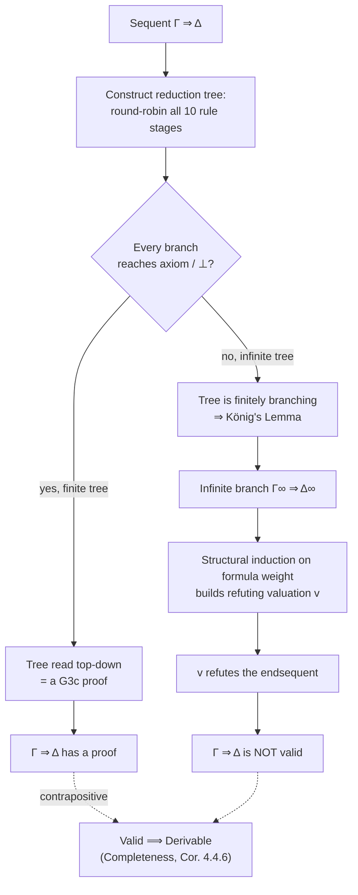
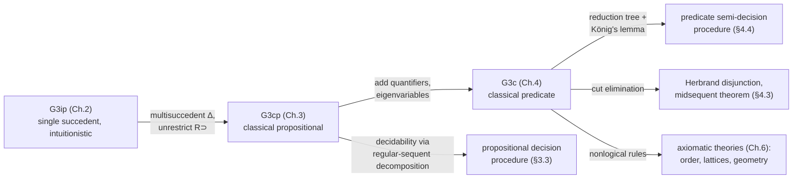

# Classical Propositional and Predicate Logic

[[book-guidelines|↩ Back to guidelines]]

## Why classical logic needs a *different* sequent calculus, not just a different axiom

Chapters 1–2 of the book build **G3ip**, a single-succedent, contraction-free sequent calculus for intuitionistic logic: sequents $\Gamma \Rightarrow C$, one formula on the right. The obvious move to "add" classical logic is to bolt excluded middle onto G3ip as an extra axiom schema or a rule like `Raa` (reductio). That works, but it's a patch — it doesn't tell you *why* classical reasoning has the shape it has, and worse, ad hoc patches like that tend to break cut elimination (the book flags this danger explicitly with Girard's example in Chapter 1).

Gentzen's actual solution, recovered here as **G3cp**, is structural rather than axiomatic: change what a sequent *means*. Instead of $\Gamma \Rightarrow C$ ("from assumptions $\Gamma$, derive $C$"), allow multiple formulas on the right: $\Gamma \Rightarrow \Delta$, where both $\Gamma$ and $\Delta$ are multisets.

What does a comma on the right *mean*? This is where the chapter earns its keep. Natural deduction's $\lor$-elimination rule is a proof by cases: from $A \lor B$, and a derivation of $C$ from $A$, and a derivation of $C$ from $B$, conclude $C$. Gentzen noticed you can generalize this into a genuine multiple-conclusion natural deduction rule:

$$\frac{A \lor B}{A \quad B}$$

read as: from $A \lor B$, you get two *open cases* — either work with $A$ or work with $B$, and if you close off both, you're done. A multisuccedent sequent $\Gamma \Rightarrow \Delta$ formalizes exactly this: $\Gamma$ is the multiset of open *assumptions*, $\Delta$ is the multiset of open *cases*. A rule like $L\&$ merges two open assumptions $A, B$ into one, $A \& B$; the dual rule $R\lor$ merges two open cases $A, B$ into one, $A \lor B$. If $\Delta$ has been narrowed to a single formula, you're back to an ordinary "derive $C$ from $\Gamma$" reading. If $\Delta$ becomes empty, that's the dual of an empty antecedent — impossibility, i.e., $\bot$.

**What breaks without multiple succedents:** restricting $\Delta$ to at most one formula is *exactly* what recovers intuitionistic logic (this is proved formally in Chapter 5, but the mechanism is visible immediately in the $R{\supset}$ rule). Classically,

$$\frac{A, \Gamma \Rightarrow \Delta, B}{\Gamma \Rightarrow \Delta, A \supset B}$$

lets you carry along other open cases $\Delta$ while proving $B$ from $A$. Restrict $\Delta$ to empty and you get the intuitionistic rule $\dfrac{A, \Gamma \Rightarrow B}{\Gamma \Rightarrow A \supset B}$. The difference shows up immediately: $A \Rightarrow A, \bot$ is a classical axiom instance (weaken), and one step of $R\lor$ turns the open cases $A, A\supset\bot$ into $A \lor (A \supset \bot)$ — a derivation of excluded middle that the single-succedent restriction blocks outright. So it isn't the multiset structure of $\Delta$ per se that produces classicality — it's specifically the unrestricted $R{\supset}$ rule allowed by an unrestricted succedent. (Chapter 5's G3im shows you can even build an *intuitionistically complete* multisuccedent calculus by restricting the quantifier/implication rules instead — the succedent comma there behaves like intuitionistic disjunction.)

If you've done any SAT/CDCL work, this "open cases" framing should feel immediately familiar: a multisuccedent sequent $\Gamma \Rightarrow \Delta$ is essentially a clause under negation-as-refutation — $\Gamma$ are the things assumed true, $\Delta$ the disjunction of things you still need to justify, and a derivation is a resolution-style proof that the clause is a tautological consequence. Keep this in mind; it becomes exact at the end of this article.

## The calculus G3cp

```
Logical axiom:      P, Γ ⇒ Δ, P

L&   A, B, Γ ⇒ Δ            R&   Γ ⇒ Δ, A     Γ ⇒ Δ, B
     A&B, Γ ⇒ Δ                  Γ ⇒ Δ, A&B

Lv   A, Γ ⇒ Δ     B, Γ ⇒ Δ   Rv   Γ ⇒ Δ, A, B
     A∨B, Γ ⇒ Δ                  Γ ⇒ Δ, A∨B

L⊃   A⊃B, Γ ⇒ Δ, A    B, Γ ⇒ Δ    R⊃   A, Γ ⇒ Δ, B
     A⊃B, Γ ⇒ Δ                       Γ ⇒ Δ, A⊃B

L⊥   ⊥, Γ ⇒ Δ
```

Two structural facts distinguish G3cp from G3ip beyond the multiset succedent:

1. **$L{\supset}$ does not repeat its principal formula** in the left premiss. In G3ip, $L{\supset}$ has to repeat $A \supset B$ in one premiss (Kleene's device) to stay contraction-free, because that premiss's succedent is pinned to a single $C$. In G3cp there's room in $\Delta$ to place $A$ back as an open case, so the rule is genuinely non-repeating: $\dfrac{A\supset B, \Gamma \Rightarrow \Delta, A \quad B, \Gamma \Rightarrow \Delta}{A \supset B, \Gamma \Rightarrow \Delta}$.
2. **Every rule is invertible**, height-preservingly (Theorem 3.1.1). Not just $L\&$ and $L\lor$ as in the intuitionistic case — now $R\&$, $R\lor$, $R{\supset}$, and crucially $L{\supset}$ too. In G3ip, the first premiss of $L{\supset}$ is *not* invertible (there's a counterexample using $\bot \supset \bot$); the multisuccedent freedom removes the obstruction.

**Grounding (Rust):** total invertibility is the single fact that makes root-first proof search a genuine decision procedure rather than a heuristic. In Rust terms, think of a sequent as a pair of multisets of an `enum Formula { Atom(String), Bot, And(Box<Formula>, Box<Formula>), Or(..), Imp(..) }`, and every rule as a *reversible* transformation:

```rust
enum Step {
    Axiom,                              // P, Γ ⇒ Δ, P
    Split(Sequent, Vec<Sequent>),       // one sequent → 1 or 2 premisses
}

fn decompose(seq: Sequent) -> Step {
    // Because every G3cp rule is invertible, this function never has to guess:
    // whichever connective you pick to decompose first, the eventual set of
    // leaves is *the same* (Lemma 3.1.2, decomposition is unique).
    ...
}
```

That last comment is the content of **Lemma 3.1.2**: successive applications of any two G3cp rules commute, so root-first decomposition of a sequent into topsequents is *confluent* — you get a unique set of leaves no matter which order you apply rules in. This is precisely the property PESCA (Appendix C) calls "top-down determinacy," and it's the same property that makes a DPLL-style decision procedure well-defined regardless of decision-variable order (modulo different runtimes).

## Regular sequents and trace formulas: classical propositional logic *is* CNF

Decompose $\Rightarrow C$ root-first until no connective is left. The leaves have the shape

$$P_1, \ldots, P_m \Rightarrow Q_1, \ldots, Q_n, \bot, \ldots, \bot$$

Discard the leaves that are axioms ($P_i = Q_j$ for some $i,j$) or contain $\bot$ on the left. What's left is called a **regular sequent** (Definition 3.1.3): $P_1,\ldots,P_m \Rightarrow Q_1,\ldots,Q_n$ with all $P_i$ distinct from all $Q_j$. Each regular sequent has a **trace formula**:

$$
C = \begin{cases}
P_1 \& \cdots \& P_m \supset Q_1 \lor \cdots \lor Q_n & m,n>0\\
Q_1 \lor \cdots \lor Q_n & m=0,\ n>0\\
\sim(P_1 \& \cdots \& P_m) & m>0,\ n=0\\
\bot & m=n=0
\end{cases}
$$

**Theorem 3.1.4** then says something genuinely striking: *a formula $C$ is (classically) equivalent to the conjunction of the trace formulas of its own regular-sequent decomposition*, and this decomposition is unique up to reordering. Since each trace formula is classically equivalent to $\sim P_1 \lor \cdots \lor \sim P_m \lor Q_1 \lor \cdots \lor Q_n$, the whole decomposition *is a variant of conjunctive normal form* — derived structurally, from invertibility of the sequent calculus, rather than stipulated as a semantic transformation on truth tables. If you've ever implemented a Tseitin-style CNF conversion, this is the same output produced by proof-theoretic means instead of algebraic ones: root-first decomposition through invertible rules *is* the clausification pass, and each surviving regular sequent is exactly one output clause.

## Validity as a negative notion — and why that's the right framing for a completeness proof

**Definition 3.3.1** gives ordinary Boolean valuations $v$: $v(P) \in \{0,1\}$ on atoms, extended by $\min$ for $\&$, $\max$ for $\lor$, $\max(1-v(A), v(B))$ for $A \supset B$, and extended to multisets $\Gamma$ by $v\bigwedge(\Gamma) = \min$ of the values of formulas in $\Gamma$ and $v\bigvee(\Gamma) = \max$, with the convention $\bigwedge(\varnothing) = 1$ and $\bigvee(\varnothing) = \top$'s value — i.e. an empty succedent behaves like $\bot$ (value $0$), consistent with $L\bot$ and with right-weakening deriving $\Gamma \Rightarrow \bot$ from $\Gamma \Rightarrow$.

The key move is **Definition 3.3.2**:

> A sequent $\Gamma \Rightarrow \Delta$ is **refutable** if some valuation $v$ has $v\bigwedge(\Gamma) > v\bigvee(\Delta)$. It is **valid** if it is *not refutable*.

Read that again: validity is defined as the *absence* of a counterexample, not as "all valuations satisfy it" stated positively. In a two-valued setting these coincide extensionally, but the negative framing is what makes the completeness *proof* tractable, because it turns "show $\Gamma\Rightarrow\Delta$ is derivable" into "show no refuting valuation exists," which is exactly what you get for free once you know every non-axiom leaf of the decomposition is a regular sequent with a trace formula falsified by a *specific, constructible* valuation.

**Soundness** (Theorem 3.3.5) is a routine induction on derivation height showing each rule preserves $v\bigwedge(\Gamma) \le v\bigvee(\Delta)$ — the one nontrivial step is a small valuation lemma (3.3.3): $\min(v(A),v(B)) \le v(C) \iff v(A) \le v(B\supset C)$, which is just currying stated semantically.

**Completeness** (Theorem 3.3.6) is where the whole apparatus pays off:

> If $\Gamma \Rightarrow \Delta$ is valid, decompose it root-first. Suppose the leaves that survive (non-axiom, non-$\bot$-containing) are regular sequents $\Gamma_1\Rightarrow\Delta_1,\ldots,\Gamma_k\Rightarrow\Delta_k$ with trace formulas $C_1,\ldots,C_k$. By Theorem 3.1.4, $C \equiv C_1 \& \cdots \& C_k$ where $C = \bigwedge\Gamma \supset \bigvee\Delta$. Since $\Gamma\Rightarrow\Delta$ is valid, $v(C)=1$ for *every* $v$, hence $v(C_i)=1$ for every $v$ and every $i$. But each surviving trace formula's *shape* ($\bot$; or $\sim(P_1\&\cdots\&P_m)$; or $P_1\&\cdots\&P_m \supset Q_1\lor\cdots\lor Q_n$ with all $P_i\neq Q_j$) has an explicit, syntactically-readable refuting valuation — set every $P_i$ true, every $Q_j$ false. So if any such leaf survived, that specific valuation would refute $C_i$, contradicting $v(C_i)=1$ for all $v$. Hence **no regular sequent survives** — every leaf was an axiom — hence $\Gamma\Rightarrow\Delta$ is derivable.

That's the whole proof, and it's constructive at every step except the final universal quantifier over valuations (which is fine — we only need *falsifiability* to be decidable per leaf, which it manifestly is). The upshot, stated at the end of §3.3:

> **Decomposition into regular sequents is a syntactic decision procedure for classical propositional validity**: $C$ is valid iff no topsequent of its decomposition is a regular sequent.

**What breaks without invertibility:** none of this works if any rule loses information going root-first — you'd need backtracking search over rule choices, and a "no proof found" result wouldn't distinguish "genuinely invalid" from "search order failed." Invertibility (plus confluence of decomposition, Lemma 3.1.2) is precisely what turns proof search into decision.

### This is DPLL, read backwards

Root-first decomposition of $\Rightarrow C$ into regular sequents, checked for an empty surviving set, *is* a satisfiability procedure for $\sim C$: a regular sequent $P_1,\ldots,P_m \Rightarrow Q_1,\ldots,Q_n$ that survives corresponds to the partial assignment $P_i \mapsto \top, Q_j \mapsto \bot$ *not yet closing off* — i.e., a candidate model. $L\&$, $R\lor$, and the invertible $L{\supset}$/$R{\supset}$ are unit-propagation-like decompositions on formula structure; there's no case-splitting *choice* to make because every rule is invertible (there's genuinely nothing corresponding to DPLL's decision-literal branching heuristic — the calculus decomposes deterministically by connective, and the "branching" you do see, e.g. in $R\&$'s two premisses, is not a disjunctive choice but a conjunctive requirement that *both* branches close). So G3cp's decision procedure is closer to a Tseitin-CNF-then-check-all-clauses-simultaneously-satisfiable sweep than to CDCL's clause-learning search — but the *semantic content* is the same: a formula is valid iff its negation is unsatisfiable, and "unsatisfiable" is witnessed structurally by every branch of the search closing under $\bot$. Where this genuinely differs from a SAT solver's architecture is exactly the place the closing synthesis below returns to: G3cp never needs to *learn* clauses, because the trace-formula decomposition already *is* the full clause set, generated once, statically, by the invertible rules — there's no incremental restart.

## Extending to predicate logic: valuations via inf/sup

Chapter 4 introduces first-order language and the calculus **G3c** (quantifier rules $L\forall, R\forall, L\exists, R\exists$ added to G3cp, with the standard eigenvariable restrictions on $R\forall$/$L\exists$). §4.4 then re-runs the propositional completeness argument, but propositional decomposition alone can't finish the job: a universally quantified antecedent formula might need instantiating at infinitely many terms before a contradiction surfaces, so root-first search need not terminate. The valuation definition and the completeness *architecture* both have to change accordingly.

**Definition 4.4.1** extends valuations to (pure, function/constant-free) predicate logic over a denumerable variable list $x_1, x_2,\ldots$:

$$v(\forall x A) = \inf_i\, v(A(x_i/x)), \qquad v(\exists x A) = \sup_i\, v(A(x_i/x))$$

— literally, "true at every instance" becomes an infimum over the (possibly infinite) family of instance-valuations, and dually for $\exists$/supremum. The book is explicit that these are *infinitary, noneffective* operations: nothing here is claiming you can compute $v(\forall xA)$ by enumeration. Soundness (Theorem 4.4.3) extends routinely — the $R\forall$ case is a small exercise in commuting $\inf$ past $\max$, using that the eigenvariable $y$ is fresh for $\Gamma,\Delta$.

## The reduction tree and König's lemma: completeness without a terminating decision procedure

Since propositional root-first decomposition alone won't terminate on quantified antecedents, Schütte's method (adopted here as the **reduction tree**) interleaves *all ten* kinds of root-first reduction — $L\&,R\&,L\lor,R\lor,L{\supset},R{\supset}$ as before, plus $L\forall,R\forall,L\exists,R\exists$ — in a fixed round-robin schedule (stages $n=1,\ldots,10$ repeating forever), rather than trying to decompose one connective type to exhaustion first:

- **$L\forall$** (stage 7) instantiates every universally-quantified antecedent formula at the *next unused variable* in the fixed enumeration $x_1,x_2,\ldots$ — critically, the formula $\forall xA$ stays in the antecedent (it isn't consumed), so it will be picked up again at stage 17, 27, … and eventually instantiated at *every* variable in the enumeration.
- **$R\exists$** (stage 9, symmetric to $L\forall$) behaves the same way in the succedent.
- **$R\forall$/$L\exists$** (stages 8/10) instantiate at a genuinely fresh eigenvariable, exactly as in ordinary G3c proof search — these formulas *are* consumed, since a single fresh witness suffices.

Two outcomes:

**Finite tree.** Every branch eventually hits an axiom or a $\bot$-conclusion. Read bottom-to-top-becomes-top-to-bottom, the tree *is* a G3c derivation of the root sequent. Done — this recovers the propositional case exactly (the propositional-only fragment of the schedule is precisely §3.3's decomposition).

**Infinite tree.** This is where the argument needs genuine nonconstructive machinery:

> **König's Lemma (4.4.4).** Every infinite, finitely branching tree has an infinite branch.

The reduction tree is finitely branching by construction (each stage produces at most finitely many premisses from finitely many topmost sequents), so if it's infinite, König's lemma hands you an infinite branch $\Gamma_0\Rightarrow\Delta_0, \Gamma_1\Rightarrow\Delta_1,\ldots$ Define $\Gamma_\infty = \bigcup_i \Gamma_i$, $\Delta_\infty = \bigcup_i \Delta_i$, and read off a valuation: $v(P)=1$ for atoms $P \in \Gamma_\infty$, $v(P)=0$ for atoms $P \in \Delta_\infty$ (well-defined because no atom can be in both — that would have closed the branch at some finite stage, contradicting infiniteness). A structural induction on formula weight (Theorem 4.4.5, case-by-case on the connective/quantifier) shows this $v$ makes every formula in $\Gamma_\infty$ true and every formula in $\Delta_\infty$ false — i.e., it's a genuine **refuting valuation** for the original endsequent. The quantifier cases are the pretty part: because $\forall xA \in \Gamma_\infty$ gets instantiated at *every* variable somewhere along the (infinite) branch, $v(A(y/x))=1$ for every $y$ by the inductive hypothesis, so $v(\forall xA) = \inf_i v(A(x_i/x)) = 1$ — the fairness of the round-robin schedule is exactly what the $\inf$/$\sup$ valuation needs to close.

$$
\textbf{Corollary 4.4.6: } \Gamma\Rightarrow\Delta \text{ valid} \implies \Gamma\Rightarrow\Delta \text{ derivable in G3c.}
$$



This is precisely the sense in which predicate-logic completeness is a genuinely *higher* result than propositional decidability: propositional G3cp gives you a terminating decision procedure (Church–Turing-computable), while G3c's completeness argument is nonconstructive at the one point where it has to be — deciding *which* disjunct of König's lemma applies for an arbitrary sequent is exactly as undecidable as first-order validity itself (this is the proof-theoretic face of Church's theorem: G3c's search *is* a semi-decision procedure — it terminates and finds a proof whenever one exists, but nontermination is not itself detectable in general).

## Synthesis

**Structurally**, this topic sits directly downstream of Chapter 2's intuitionistic G3ip (same proof-theoretic toolkit — height-preserving invertibility, weight/height induction for structural-rule admissibility — reused with a multisuccedent twist) and directly upstream of everything that needs classical predicate logic as a base case: Chapter 4's remaining sections (Herbrand disjunctions, [[Quantifiers-and-First-Order-Proof-Theory#The midsequent theorem|the midsequent theorem]] — cut elimination applied to G3c), and ultimately Chapter 6's extension of G3c by nonlogical (axiom) rules, where the same regular-sequent/trace-formula machinery reappears generalized to arbitrary mathematical theories.



**For the standing project** (a Rust dependent/refinement-type compiler with an embedded prover), this chapter is directly load-bearing in three places:

1. **Trusted-kernel design.** G3cp's completeness proof is entirely syntactic and constructive at the propositional level — regular-sequent decomposition is a *terminating, checkable* procedure, exactly the shape of thing you'd want as a small trusted core deciding quantifier-free verification-condition validity (e.g., discharging the Boolean-structured residue after an SMT theory solver has handled atoms). The trace-formula/CNF correspondence (Theorem 3.1.4) is the formal justification for treating "clausify, then check" as *sound and complete*, not just a convenient engineering hack — worth citing explicitly if the refinement-type checker ever needs to justify a Tseitin-style CNF pass to itself.
2. **Proof-producing architecture.** Both completeness proofs are constructive on the "yes" side: a finite reduction tree (or regular-sequent decomposition with an empty leftover set) *is* the proof object, read top-down. This is the proof-theoretic ancestor of proof certificates in an SMT/CHC-solving pipeline — a solver that returns "unsat" should, in this spirit, return the reduction tree/resolution refutation itself, not just a boolean, so the elaborator's trusted kernel can *replay* rather than *trust* the result.
3. **Decidability boundary for VC discharge.** The propositional case terminates; the first-order case only semi-decides (König's lemma tells you a proof or a countermodel exists, never which, without search). This is exactly the boundary your refinement-type checker's Horn-clause / CHC discharge will live on: quantifier-free VCs over decidable theories are the G3cp-shaped case (aim for genuine decision procedures there), while any first-order quantification pulled in by inductive invariants pushes you into the G3c-shaped case — semi-decidable at best, requiring either instantiation heuristics (E-matching, in SMT terms) standing in for the fair round-robin $L\forall$/$R\exists$ schedule, or acceptance that completeness is asymptotic rather than guaranteed. König's lemma is the theoretical reason "just keep instantiating quantifiers and hope" is *complete in principle* — it's also the reason it isn't guaranteed to *terminate* in practice, which is the entire motivation for CEGAR-style abstraction-refinement loops instead of naive full instantiation.
