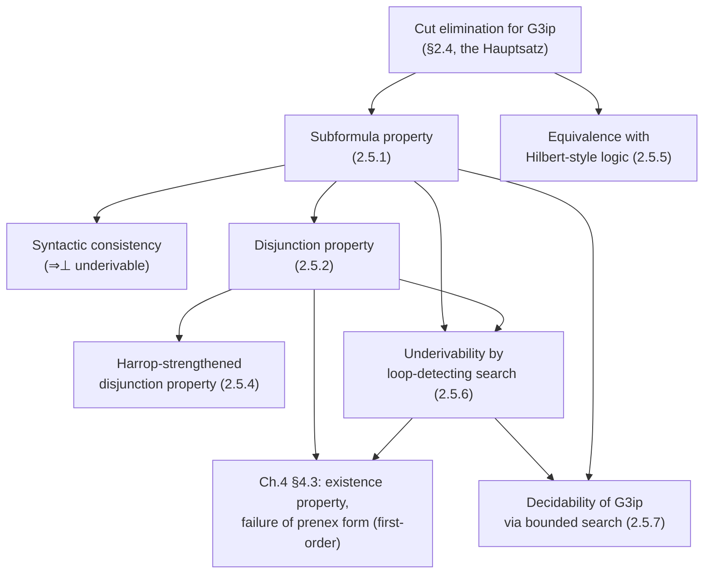

[[book-guidelines|↩ Back to guidelines]]

## Why cut elimination is the payoff, not the proof

Chapter 2 spends four sections doing something that looks purely technical: proving that a rule called **cut** can always be removed from a derivation in the calculus $\mathbf{G3ip}$ (intuitionistic propositional sequent calculus). If you only read that far, cut elimination looks like housekeeping — a structural lemma with a long induction (weight of the cut formula, sub-induction on cut-height) that a reader might reasonably skim.

§2.5 is where the book cashes that lemma in. And the payoff is genuinely surprising: from one purely syntactic fact — "every $\mathbf{G3ip}$-derivable sequent has a derivation with no cut rule in it" — you get, almost for free:

- a **structural bound** on what can appear in a proof (the subformula property),
- a **constructive reading** of disjunction and existence made rigorous (the disjunction property, strengthened via Harrop formulas),
- a **bridge** to the traditional Hilbert-style axiomatic presentation of intuitionistic logic,
- a whole family of **underivability proofs** — excluded middle, weak excluded middle, double negation, Dummett's law, Peirce's law — obtained not by building a countermodel, but by *running proof search and watching it fail*,
- and, capping it off, a **decision procedure**: derivability in $\mathbf{G3ip}$ is decidable, because cut-free proof search is guaranteed to terminate.

The throughline for all of these is one idea: **cut-free proof search is syntax-directed.** Every rule of $\mathbf{G3ip}$ either introduces a connective that's already sitting in the goal sequent, or (for $L{\supset}$) repeats a formula already there. Nothing is invented. Compare that to what proof search looks like *with* cut in the picture: to apply cut you need a formula $D$ that appears in neither premise's conclusion but bridges two derivations —

$$\dfrac{\Gamma \Rightarrow D \qquad D, \Gamma \Rightarrow C}{\Gamma \Rightarrow C}\ \mathrm{Cut}$$

— and nothing in the goal $\Gamma \Rightarrow C$ tells you what $D$ should be. Automating that means *guessing a lemma*, i.e. search over the entire space of formulas, which is exactly the kind of unbounded search a compiler or theorem-prover implementer wants to avoid. Cut elimination is the theorem that says: for this logic, you never actually need to guess. Root-first, cut-free proof search is total — it explores a *finite, computable* space determined entirely by the shape of the goal. That's the property every result in this article traces back to.

### The calculus, briefly

$\mathbf{G3ip}$ works on sequents $\Gamma \Rightarrow C$, $\Gamma$ a finite multiset of formulas, $C$ a single formula (or absent, for a "derives falsum" reading). The rules, all with the antecedent context $\Gamma$ *shared* between premises (this is what keeps the calculus contraction-free):

$$
P, \Gamma \Rightarrow P \ \text{(axiom, $P$ atomic)}
\qquad
\dfrac{A, B, \Gamma \Rightarrow C}{A\&B, \Gamma \Rightarrow C}\, L\& 
\qquad
\dfrac{\Gamma \Rightarrow A \quad \Gamma \Rightarrow B}{\Gamma \Rightarrow A\&B}\, R\&
$$

$$
\dfrac{A, \Gamma \Rightarrow C \quad B, \Gamma \Rightarrow C}{A\lor B, \Gamma \Rightarrow C}\, L{\lor}
\qquad
\dfrac{\Gamma \Rightarrow A}{\Gamma \Rightarrow A\lor B}\, R{\lor}_1
\qquad
\dfrac{\Gamma \Rightarrow B}{\Gamma \Rightarrow A\lor B}\, R{\lor}_2
$$

$$
\dfrac{A\supset B, \Gamma \Rightarrow A \quad B, \Gamma \Rightarrow C}{A\supset B, \Gamma \Rightarrow C}\, L{\supset}
\qquad
\dfrac{A, \Gamma \Rightarrow B}{\Gamma \Rightarrow A\supset B}\, R{\supset}
\qquad
\bot, \Gamma \Rightarrow C \ \ L\bot
$$

The one wrinkle worth naming explicitly (the book flags it too): $L{\supset}$ **repeats its principal formula** $A\supset B$ in its left premise. That's Kleene's device from 1952, and it's the reason $\mathbf{G3ip}$ can drop contraction as a primitive rule while still being complete — but it's also, as you'll see below, the *reason proof search can loop*. Everywhere else, every rule strictly shrinks the goal by formula weight; $L{\supset}$'s left premise is the single place where a proof-search step can reproduce a sequent no smaller than the one it came from. Every underivability and decidability argument in §2.5 is really an argument about controlling exactly that one rule.

## (a) The subformula property: proof search stays inside the goal

**Theorem 2.5.1.** If $\Gamma \Rightarrow C$ has a derivation in $\mathbf{G3ip}$, every formula occurring anywhere in that derivation is a subformula of $\Gamma, C$.

This falls out by inspection: because the calculus has no cut and no structural rules, no rule ever *deletes* a formula from a derivation, and no rule ever *introduces* a formula that wasn't already a piece of its conclusion. Trace any formula occurrence upward through a derivation and it only ever shrinks (by having a connective peeled off) — it never gets replaced by something unrelated. A cut rule is precisely the one place a totally new formula ($D$ above) could enter a derivation without being a subformula of the endsequent; remove cut and that door closes.

**What breaks without this.** Without the subformula property, a proof-search procedure has no principled way to bound its own search space — a derivation could in principle mention any formula in the language, so "try all derivations" isn't even well-founded as a search strategy. With it, every rule application in a bottom-up search is *syntax-directed*: you look at the shape of the goal, and the applicable rule (and its premises) are essentially determined by that shape alone. This is literally the property Appendix C of the book calls **top-down determinacy**, and it's what makes an interactive prover like PESCA — or any automated one — implementable as recursive descent over a fixed AST rather than open-ended search.

One immediate corollary: $\Rightarrow \bot$ is not derivable (no rule concludes an empty-antecedent sequent whose succedent is $\bot$, since $\bot$ can't be a subformula of nothing), so $\mathbf{G3ip}$ is **syntactically consistent** — a purely structural consistency proof, no models required.

**Rust grounding.** This is exactly the invariant you'd want a hand-rolled prover to exploit. If `Formula` is a Rust enum —

```rust
enum Formula {
    Atom(String),
    Bot,
    And(Box<Formula>, Box<Formula>),
    Or(Box<Formula>, Box<Formula>),
    Imp(Box<Formula>, Box<Formula>),
}
```

— then the subformula property says a `prove(goal: &Sequent) -> Option<Proof>` function never needs to *synthesize* a `Formula` value that isn't already reachable by walking the boxes inside `goal`. Concretely, you can precompute the (finite) subformula closure of the input sequent once, up front, and every recursive call's antecedent/succedent formulas are guaranteed to come from that finite set — no dynamic formula construction, no unbounded recursion on formula shape. That's a strong invariant to hand a memoization table (§(e) below is where this actually gets used for termination).

## (b) The disjunction property, and its Harrop-formula upgrade

**Theorem 2.5.2 (disjunction property).** If $\Rightarrow A \lor B$ is derivable in $\mathbf{G3ip}$, then $\Rightarrow A$ or $\Rightarrow B$ is derivable.

*Proof.* Only right rules can conclude a sequent with an *empty* antecedent, so the last rule in a cut-free derivation of $\Rightarrow A \lor B$ must be $R{\lor}_1$ or $R{\lor}_2$ — which directly gives $\Rightarrow A$ or $\Rightarrow B$ as the premise. $\blacksquare$

This is the formal payoff of the BHK (Brouwer–Heyting–Kolmogorov) reading of $\lor$ from §2.1: intuitionistically, "$A$ or $B$" is supposed to *mean* "I have a proof of $A$, or I have a proof of $B$, and I know which." Theorem 2.5.2 is that meaning explanation, verified as a theorem about a syntactic calculus rather than asserted as a philosophical stance. Classically this fails completely — $\Rightarrow P \lor \sim P$ is classically valid without telling you which disjunct holds — which is exactly why $\mathbf{G3cp}$ (Chapter 3) needs a *multisuccedent* calculus: multiple formulas on the right let you defer the choice.

**Theorem 2.5.4 strengthens this** to derivations that carry hypotheses, provided those hypotheses don't themselves smuggle in a disjunctive/existential choice. That's the point of restricting $\Gamma$ to **Harrop formulas**:

**Definition 2.5.3.** The Harrop formulas are generated by: (i) every atom and $\bot$ is Harrop; (ii) $A\&B$ is Harrop whenever $A, B$ are; (iii) $A \supset B$ is Harrop whenever $B$ is (with $A$ unrestricted).

Note what's *excluded*: a Harrop formula can never have $\lor$ or (in the predicate case) $\exists$ occurring positively/unguarded — disjunction is only allowed to the left of an unrestricted $\supset$, where it can't be "read off" as a choice. Given that,

**Theorem 2.5.4.** If $\Gamma \Rightarrow A \lor B$ is derivable in $\mathbf{G3ip}$ and $\Gamma$ consists of Harrop formulas, then $\Gamma \Rightarrow A$ or $\Gamma \Rightarrow B$ is derivable.

The proof is induction on derivation height, and it's worth walking because it shows exactly *why* the Harrop restriction is the right one: at each step you case on the last rule producing $\Gamma \Rightarrow A\lor B$. If it's $R\lor$, done immediately. If it's $L\&$ (splitting some $C\&D \in \Gamma$), the premise $C, D, \Gamma' \Rightarrow A\lor B$ still has an all-Harrop antecedent (clauses (i)–(ii) are closed under this), so the inductive hypothesis fires. If it's $L{\supset}$ on some $C \supset D \in \Gamma$, only the *right* premise $D, \Gamma' \Rightarrow A\lor B$ needs the inductive hypothesis — and $D$ is Harrop precisely because clause (iii) demanded it. The one rule that *can't* be last is $L{\lor}$ — because no formula in $\Gamma$ has $\lor$ as its main connective (Harrop formulas don't), so there's nothing to case-split on. The whole proof is really "the antecedent shape never gives proof search a reason to branch on a hypothesis's own disjunction," which is exactly the informal content of "Harrop formulas carry no computational ambiguity."

**Lean grounding.** This is the sharpest way to see what Harrop formulas *are*: a Harrop formula is a `Prop` whose canonical inhabitant carries no `Or.inl`/`Or.inr` (or, at first order, no `Exists.intro`) choice at the top. If you prove `theorem foo (h : Harrop_hyp) : A ∨ B` constructively and extract the proof term, Theorem 2.5.4 says that term must reduce to `Or.inl pa` or `Or.inr pb` for some concrete `pa : A` / `pb : B` — the disjunction can't survive as an opaque, unresolved choice once you look at the normal form. This is precisely the property that matters for **proof-term extraction and proof certificates**: if a specification (a precondition, an invariant hypothesis) is Harrop-shaped, a constructive proof of a disjunctive postcondition is guaranteed to *decide* which branch holds, not merely assert that one does — which is exactly what you want out of a verification condition whose "proof" is meant to double as a witness-producing certificate for a downstream checker.

## (c) Equivalence with the Hilbert-style system

Theorem 2.5.5 shows every Hilbert-style intuitionistic derivation (built from the nine familiar axiom schemes plus modus ponens) translates into a $\mathbf{G3ip}$ derivation of $\Rightarrow C$. The translation is mechanical — axiom schemes become cut-free-derivable sequents $\Rightarrow A$ (the book works out $\Rightarrow \bot \supset A$ and $\Rightarrow A \supset (B \supset A\&B)$ explicitly), and each modus-ponens step becomes a two-cut derivation:

$$
\dfrac{\Rightarrow A\supset B \quad A\supset B, \Rightarrow A \quad \dfrac{}{B, \Rightarrow B}}{\dfrac{\Rightarrow A \quad \Rightarrow B}{\Rightarrow B}\ \mathrm{Cut}}\ \mathrm{Cut}
$$

**This is where cut elimination earns its name as a theorem *about* something, not just a rewriting result on derivations.** The translation from Hilbert-style proofs *produces* cuts — that's unavoidable, modus ponens just *is* a cut in disguise. What Theorem 2.5.5 needs cut elimination *for* is the last line of its proof: "by cut elimination, a derivation of $\Rightarrow C$ in $\mathbf{G3ip}$ is obtained" — meaning the cuts introduced by translating modus ponens can always be removed again, so the target calculus stays cut-free-complete. Without the Hauptsatz, this translation would only establish derivability in cut-*inclusive* $\mathbf{G3ip}$, which is a much weaker (and, without further argument, useless for the rest of §2.5) statement — every underivability and decidability result downstream depends on the target calculus actually being cut-free.

The converse translation (sequent to Hilbert-style formula, encoding $A_1, \ldots, A_n \Rightarrow B$ as $A_1\& \cdots \& A_n \supset B$) is possible but "very laborious" — the book notes Hilbert-style systems are "next to impossible to use for actual derivation," illustrated by a genuinely painful three-line derivation of the *identity* $A \supset A$ from axioms 8 and 9. That contrast — trivial in sequent calculus, torturous in Hilbert-style — is itself evidence for the thesis of this whole article: a calculus whose rules are syntax-directed on the goal is what makes proof *automatable*, not just *possible*.

## (d) Underivability by loop-detecting proof search

This is the section's centerpiece, and the technique is genuinely elegant: instead of building a Kripke countermodel to show a classical tautology is intuitionistically *invalid* (the usual model-theoretic route), you exhaustively run cut-free root-first proof search and show every branch either dies at a non-axiom leaf or **loops** — reproduces a sequent already seen higher up the same branch.

> **Loop-detection principle.** In root-first proof search, if a premise sequent is syntactically identical to an ancestor sequent on the same branch, that branch can be abandoned: a continuation from the repeated sequent succeeds if and only if a continuation from its first occurrence does. So detecting the repeat is as good as having explored the whole (infinite) subtree below it.

This is only sound because the calculus is cut-free and structural-rule-free — a sequent's derivability depends on *nothing outside itself* (no ambient lemma context to consult), so "same sequent" really does mean "same problem." That's the subformula property from §(a) again, doing quiet work here: since a loop can only ever reproduce a sequent built from subformulas of the original goal, and that set is finite, loops are *guaranteed* to eventually occur on any non-terminating branch — proof search can't wander off into ever-larger, never-repeating territory.

**Theorem 2.5.6** applies this to four classically-valid, intuitionistically-underivable schemas (stated for atomic $P, Q, R$, which suffices — if $\Rightarrow P \lor{\sim}P$ is underivable, so is $\Rightarrow A\lor{\sim}A$ for any $A$, by substitution):

$$\Rightarrow P \lor {\sim}P \quad\text{(excluded middle)} \qquad \Rightarrow {\sim}P \lor {\sim}{\sim}P \quad\text{(weak excluded middle)}$$
$$\Rightarrow ((P\supset Q)\supset P)\supset P \quad\text{(Peirce's law)} \qquad \Rightarrow (P\supset Q\lor R)\supset (P\supset Q)\lor(P\supset R) \quad\text{(disjunction under hypothesis)}$$

**Worked example — excluded middle, the base case.** Suppose $\Rightarrow P \lor {\sim}P$ were derivable. By the disjunction property (§(b)), either $\Rightarrow P$ or $\Rightarrow {\sim}P$ is derivable. No rule concludes $\Rightarrow P$ for an atom $P$ (the axiom needs $P$ *in the antecedent*, and there's no antecedent here) — so it would have to be $\Rightarrow {\sim}P$, i.e. $\Rightarrow P \supset \bot$. By invertibility of $R{\supset}$, that holds iff $P \Rightarrow \bot$ is derivable — and again, no rule concludes that (its only possible last rule, $L\bot$, needs $\bot$ itself in the antecedent, not $P$). Dead end on every branch: excluded middle is underivable in $\mathbf{G3ip}$.

**Worked example — double negation, the actual loop.** Weak excluded middle needs $\Rightarrow {\sim}{\sim}P$, i.e. $\Rightarrow (P\supset\bot)\supset\bot$, to be underivable. Root-first, the derivation is forced at every step (no choice of rule — this is what "cut-free proof search is syntax-directed" looks like in practice):

<svg viewBox="0 0 720 470" xmlns="http://www.w3.org/2000/svg" font-family="ui-monospace, monospace" font-size="15">
  <rect x="0" y="0" width="720" height="470" fill="none"/>
  <!-- root -->
  <rect x="255" y="410" width="210" height="34" rx="6" fill="none" stroke="#8a8a8a" stroke-width="1.5"/>
  <text x="360" y="432" text-anchor="middle" fill="#5a5a5a">⇒ (P⊃⊥)⊃⊥</text>
  <!-- level 2 -->
  <rect x="245" y="330" width="230" height="34" rx="6" fill="none" stroke="#8a8a8a" stroke-width="1.5"/>
  <text x="360" y="352" text-anchor="middle" fill="#5a5a5a">P⊃⊥ ⇒ ⊥</text>
  <line x1="360" y1="330" x2="360" y2="410" stroke="#8a8a8a" stroke-width="1.2"/>
  <text x="500" y="378" fill="#7a7a7a" font-size="12">R⊃</text>
  <!-- level 3: two branches from L⊃ on P⊃⊥ ⇒ ⊥ -->
  <rect x="60" y="250" width="230" height="34" rx="6" fill="#3a6f9c" fill-opacity="0.10" stroke="#3a6f9c" stroke-width="1.5"/>
  <text x="175" y="272" text-anchor="middle" fill="#2f5c85">P⊃⊥ ⇒ P  (left prem.)</text>
  <rect x="440" y="250" width="230" height="34" rx="6" fill="#3f8f5c" fill-opacity="0.10" stroke="#3f8f5c" stroke-width="1.5"/>
  <text x="555" y="272" text-anchor="middle" fill="#2f6b45">⊥, P⊃⊥ ⇒ ⊥</text>
  <line x1="175" y1="250" x2="330" y2="330" stroke="#8a8a8a" stroke-width="1.2"/>
  <line x1="555" y1="250" x2="390" y2="330" stroke="#8a8a8a" stroke-width="1.2"/>
  <text x="20" y="300" fill="#7a7a7a" font-size="12">L⊃</text>
  <text x="600" y="300" fill="#7a7a7a" font-size="12">axiom (L⊥)</text>
  <!-- level 4: two branches from L⊃ on P⊃⊥ ⇒ P -->
  <rect x="10" y="150" width="210" height="34" rx="6" fill="#b5493f" fill-opacity="0.12" stroke="#b5493f" stroke-width="2"/>
  <text x="115" y="172" text-anchor="middle" fill="#9c3a30">P⊃⊥ ⇒ P  (loop!)</text>
  <rect x="240" y="150" width="230" height="34" rx="6" fill="#3f8f5c" fill-opacity="0.10" stroke="#3f8f5c" stroke-width="1.5"/>
  <text x="355" y="172" text-anchor="middle" fill="#2f6b45">⊥, P⊃⊥ ⇒ P</text>
  <line x1="115" y1="150" x2="150" y2="250" stroke="#8a8a8a" stroke-width="1.2"/>
  <line x1="355" y1="150" x2="200" y2="250" stroke="#8a8a8a" stroke-width="1.2"/>
  <text x="-40" y="200" fill="#7a7a7a" font-size="12">L⊃</text>
  <text x="245" y="200" fill="#7a7a7a" font-size="12">axiom (L⊥)</text>
  <!-- loop-back arrow -->
  <path d="M 115 150 C 115 90, 30 90, 30 150 C 30 200, 90 240, 175 258" fill="none" stroke="#b5493f" stroke-width="1.5" stroke-dasharray="5,4" marker-end="url(#arrow)"/>
  <text x="0" y="100" fill="#9c3a30" font-size="12">identical to</text>
  <text x="0" y="115" fill="#9c3a30" font-size="12">ancestor above →</text>
  <defs>
    <marker id="arrow" markerWidth="8" markerHeight="8" refX="6" refY="3" orient="auto">
      <path d="M0,0 L6,3 L0,6 Z" fill="#b5493f"/>
    </marker>
  </defs>
</svg>

The left premise of the *second* $L{\supset}$ instance, $P\supset\bot \Rightarrow P$, is syntactically identical to the sequent that spawned it. That's the loop; by the loop-detection principle, this branch is dead, and since it was root-first and *forced* (no rule choice existed at any step — $R{\supset}$ was the only right rule available, $L{\supset}$ the only left rule available on a compound antecedent), there is no other derivation to try. $\Rightarrow {\sim}{\sim}P$ is underivable, and hence so is $\Rightarrow {\sim}P \lor {\sim}{\sim}P$.

Peirce's law (iii) and disjunction-under-hypothesis (iv) go the same way but with an actual branch point: proof search tries both continuations at the choice point, and *each* branch independently dies (one at a non-axiom leaf, the other at a loop) — Theorem 2.5.6's proof for these cases is exhaustive case analysis over that finite branching, not a single forced path. Independence of the intuitionistic connectives — none of classical logic's usual interdefinabilities of $\lor,\ \&,\ \supset$ hold intuitionistically — is obtained by the identical method in part (d) of the section.

**What breaks without cut-freeness here.** If cut were in play, "underivable" would require ruling out *every* possible cut formula $D$ at *every* possible point in a hypothetical derivation — an unbounded search over the whole formula language, not a finite tree over subformulas of the goal. Cut elimination is precisely what turns "prove underivability" from a quantification over an infinite space of possible lemmas into a decidable, finite (subformula-bounded) tree exploration with a syntactic termination check. That's not a minor efficiency gain — without it, this style of underivability proof wouldn't exist as a *method* at all; you'd be back to constructing Kripke countermodels by hand for each schema individually.

**Rust grounding — this is a decision procedure, write it down.** Loop-detection root-first search over a calculus with the subformula property is exactly a depth-first search with a visited-set, the same shape as cycle detection in graph traversal or tabling in resolution-based logic programming:

```rust
use std::collections::HashSet;

fn provable(goal: &Sequent, seen: &mut HashSet<Sequent>) -> bool {
    if seen.contains(goal) {
        return false; // loop: this branch cannot contribute a proof
    }
    if is_axiom(goal) {
        return true;
    }
    seen.insert(goal.clone());
    let result = match applicable_rule(goal) {
        // rules other than L⊃ strictly shrink formula weight — no bookkeeping needed
        Rule::Unary(premise) => provable(&premise, seen),
        Rule::Binary(left, right) => provable(&left, seen) && provable(&right, seen),
        Rule::None => false, // stuck: not an axiom, no rule applies
    };
    seen.remove(goal); // pop on the way back out — `seen` tracks the current branch, not the whole search
    result
}
```

This is not a loose analogy — it is, structurally, the same algorithm as a **SAT solver's basic backtracking search with cycle/repeat detection**, and the same shape underlies tabled resolution in Prolog and model-checking's visited-state sets for reachability. The learning-goals thread on proof search, SAT, and CHC solving is directly this: a decidable propositional logic with the subformula property gives you a search space that is *provably finite and syntax-directed*, which is the minimum structural guarantee any SAT/SMT-style decision procedure needs before it can even talk about termination.

## (e) Decidability via bounded proof search

**Theorem 2.5.7.** Derivability of $\Gamma \Rightarrow C$ in $\mathbf{G3ip}$ is decidable.

*Proof sketch.* Generate all finite derivation trees rooted at $\Gamma \Rightarrow C$: every rule except $L{\supset}$ strictly reduces total sequent weight, so those branches terminate on weight alone. The one problematic rule, $L{\supset}$, can only ever produce premises drawn from the (finite, by the subformula property) set of formulas already present — so once two $L{\supset}$-applications on a branch conclude the *same* sequent, terminate that branch (the loop-detection device from §(d), now used constructively rather than just to prove underivability). A search tree all of whose leaves are axioms or $L\bot$-conclusions witnesses derivability; if every tree fails, the sequent is underivable. $\blacksquare$

This is worth stating plainly: **decidability of intuitionistic propositional logic is a direct corollary of cut elimination plus the subformula property, not a separate result requiring separate machinery.** The book is candid that the resulting algorithm is inefficient (try the disjunction property under negative hypothesis by hand) — Chapter 5's calculus $\mathbf{G4ip}$ (Hudelmaier/Dyckhoff) exists precisely to refine $L{\supset}$ into four rules keyed to antecedent shape, killing the loop-detection bookkeeping entirely by making every rule strictly weight-decreasing. But the *existence* of a decision procedure, and the *reason* it terminates, is exactly this section's machinery — every later, faster calculus is an efficiency refinement of the same underlying guarantee.

## Where the propositional story goes next: quantifiers (§4.3)

Chapter 4 extends this whole method — root-first cut-free search, loop detection, underivability-by-nontermination — to first-order intuitionistic logic ($\mathbf{G3i}$), where the interesting new phenomena are quantifier-shaped versions of the same failures:

- the **existence property** (Corollary 4.3.4): if $\Rightarrow \exists x\, A$ is derivable in $\mathbf{G3i}$, some *specific term* $t$ has $\Rightarrow A(t/x)$ derivable — the predicate-logic analogue of the disjunction property, and the reason intuitionistic existence proofs are inherently witness-producing;
- **underivability of $\Rightarrow {\sim}\forall x{\sim}A \supset \exists x A$** (Theorem 4.3.5), proved by an infinite root-first search whose loop is driven by the interaction of $L{\supset}$ with the quantifier variable-restriction — same mechanism as §2.5(d), one more moving part;
- **failure of prenex normal form** intuitionistically (Theorem 4.3.7) — classically every formula has an equivalent $Q_1x_1\cdots Q_nx_n.\, \varphi$ form; intuitionistically it doesn't, again shown by nonterminating proof search rather than a model.

The technique doesn't change; the alphabet it's applied to does. This article won't re-derive those proofs — they're the same loop-detection argument with quantifier rules added to the mix — but it's worth flagging the destination: the propositional-level "disjunction property via cut-free search" of §2.5(b) is the direct ancestor of the first-order "existence property," and *that* is the theorem that makes intuitionistic $\exists$ behave like a genuine $\Sigma$-type (a pair of witness plus proof) rather than a classical, witness-erasing "some $x$ such that."

## Structural summary



## Synthesis: why this matters for a proof-search-based verifier

Every result in §2.5 is downstream of one structural fact — cut-free derivations only ever manipulate subformulas of the goal — and every one of them is a preview of something the standing project (a Rust dependent/refinement-type compiler with an embedded theorem prover and a Lean-style elaborator) will need in earnest:

- **Proof search as a decision procedure.** §2.5(e)'s algorithm — generate the finite subformula-bounded search space, terminate branches by loop detection, succeed if some tree is all-axioms — is the propositional-logic ancestor of every SAT/SMT decision procedure the compiler's constraint solver will eventually run. The structural guarantee that makes it *decidable at all* (bounded search space, syntax-directed rule choice) is exactly what a CHC solver or an SMT-backed refinement-type checker needs before termination is even on the table.
- **Subformula property as a trusted-kernel discipline.** A checker that only ever needs to inspect subterms of the goal it was handed is a checker with a small, auditable trusted computing base — this is the same discipline an LCF-style or Lean-style kernel relies on: the kernel never invents terms, it only decomposes what elaboration handed it. Cut elimination is what guarantees that discipline is *available* in the first place, rather than merely convenient.
- **Harrop formulas and constructive extraction.** §2.5(b)'s strengthened disjunction property is directly about when a proof of a disjunctive (or, first-order, existential) goal is *guaranteed* to carry a decision, not just an assertion — which is exactly the shape of question that matters when a verification condition's "proof" needs to double as a witness certificate (e.g. deciding which branch of a refinement-type disjunction, or which Horn-clause disjunct, actually discharges an obligation) for a downstream, independently-checkable proof reconstruction step.
- **Loop detection as termination engineering.** The visited-set technique in the Rust sketch above — the one piece of bookkeeping standing between "syntax-directed rule application" and "guaranteed termination" — is the same technique any hand-rolled tableau, CEGAR loop, or reachability analysis needs to avoid re-exploring states it's already ruled out. Seeing it appear here, in its cleanest possible form (finite formulas, no widening, no abstraction), is worth remembering when the same problem resurfaces in a much messier guise inside an abstract-interpretation fixpoint computation.

**[[Intermediate-Logical-Systems#Where this leads|Where this leads]].** Chapter 3 needs a *multisuccedent* calculus precisely because the disjunction property (§2.5(b)) is a genuinely intuitionistic phenomenon that classical logic's completeness proof must route around differently. Chapter 4's §4.3 (above) is the direct first-order continuation of §2.5(d)'s loop-detection method. And Chapter 5's $\mathbf{G4ip}$ exists solely to make §2.5(e)'s decision procedure *efficient* by eliminating the one rule ($L{\supset}$) that needed loop-detection bookkeeping in the first place — so if you're chasing "how does this become a practical algorithm," that's the next stop.
