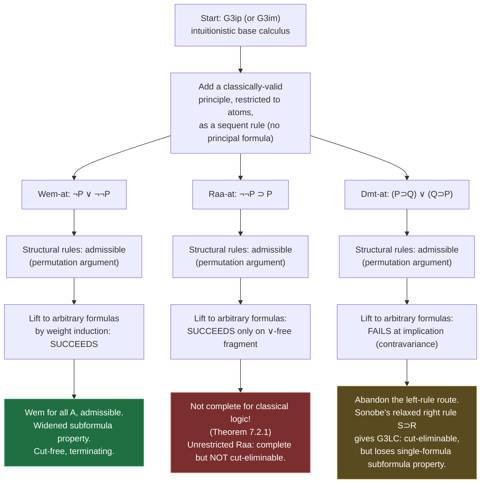

# Intermediate Logical Systems

[[book-guidelines|↩ Back to guidelines]]

## The problem this solves

Intuitionistic logic and classical logic are not the only two options. Between them sits an infinite lattice of **intermediate logics** — logics that prove everything intuitionistic logic proves, plus some but not all of what classical logic adds (Gödel 1932 already knew there are infinitely many, pairwise inequivalent). The book's own summary is blunt about why this matters here specifically: the *usual* way to build one — take intuitionistic logic and bolt on some classically-valid axiom, Hilbert-style — gives you a logic with essentially no proof theory. You can state $\neg A \vee \neg\neg A$ as an axiom, but an axiomatic system tells you nothing about *how proofs search*, whether they *terminate*, or what a *derivable formula's shape* has to look like. That's the whole point of this chapter: instead of adding intermediate axioms as axioms, add them as **sequent-calculus rules**, in exactly the style already used twice in the book — the atomic-restricted excluded-middle rule $\mathrm{Gem\text{-}at}$ of §5.4, and the nonlogical mathematical-axiom rules of Chapter 6.

That reframing turns "is this logic well-behaved?" into a question you can actually answer mechanically: does the rule admit height-preserving weakening/contraction? Does cut stay admissible? Does some (possibly weakened) subformula property survive? This chapter runs that question against three different classical principles, strictly weaker than full excluded middle, and gets **three different answers**. That contrast — not any one calculus in isolation — is the content of the chapter, and it's a genuinely useful case study for anyone who has to decide, in a checker or solver they're building, exactly how much of a "complete but unstructured" theory to keep versus how much "structured but possibly incomplete" fragment to carve out instead.

The three principles:

$$
\underbrace{\neg A \vee \neg\neg A}_{\text{weak excluded middle (Wem)}} \qquad
\underbrace{\neg\neg A \supset A}_{\text{stability}} \qquad
\underbrace{(A \supset B) \vee (B \supset A)}_{\text{Dummett's law}}
$$

All three are classically valid, all three are intuitionistically underivable (the book already showed this by loop-detecting proof search in Chapter 2), and all three sit strictly between intuitionistic and classical logic. The question for each: what happens when you add it to $\mathrm{G3ip}$ (or its multisuccedent cousin $\mathrm{G3im}$) as a *rule* rather than an axiom?

## §7.1 — Weak excluded middle: the clean case

### Why "weak"

Ordinary excluded middle says $A \vee \neg A$: for *every* proposition, either it holds or its negation does. Weak excluded middle only asks that either $A$ fails or its negation fails to fail: $\neg A \vee \neg\neg A$. This is strictly weaker — intuitionistically, $\neg\neg A$ does not give you $A$ back, so "$\neg A$ or $\neg\neg A$" is a much less committal claim than "$A$ or $\neg A$." It's the logic of, e.g., certain constructive settings where you can decide whether something is *definitely not the case*, without being able to decide the positive case outright.

### The rule, restricted to atoms

Following exactly the pattern of $\mathrm{Gem\text{-}at}$ from §5.4, the book adds to $\mathrm{G3ip}$ a rule restricted to *atomic* formulas $P$:

$$
\dfrac{\neg P, \Gamma \Rightarrow C \qquad \neg\neg P, \Gamma \Rightarrow C}{\Gamma \Rightarrow C}\ \textsf{Wem-at}
$$

Read root-first: to prove $C$ from $\Gamma$, it suffices to prove $C$ under the extra assumption $\neg P$, *and* to prove $C$ under the extra assumption $\neg\neg P$ — because one of those two assumptions is guaranteed to hold by the weak law itself. Note the shape: **there is no principal formula in the conclusion's antecedent.** The rule doesn't decompose anything already sitting in $\Gamma$; it just forks the proof into two cases and adds a fresh atomic hypothesis to each branch. This is exactly the same shape as $\mathrm{Gem\text{-}at}$, and it's what makes the whole admissibility argument almost free.

### Structural rules: free by permutation

Because $\mathsf{Wem\text{-}at}$ has no principal formula, weakening and contraction commute straight through it — if the rule is applied and then you'd weaken/contract, you can equally weaken/contract first and then apply the rule; the two orders reach the same place. Cut is only slightly more work. The interesting case is when the *left* premiss of a cut was produced by $\mathsf{Wem\text{-}at}$:

$$
\dfrac{\dfrac{\neg P, \Gamma \Rightarrow A \qquad \neg\neg P, \Gamma \Rightarrow A}{\Gamma \Rightarrow A}\ \textsf{Wem-at} \qquad A, \Gamma \Rightarrow C}{\Gamma \Rightarrow C}\ \textsf{Cut}
$$

This converts to a derivation with strictly lower cut-height by pushing the cut *up into both branches* first, then reapplying $\mathsf{Wem\text{-}at}$ at the bottom:

$$
\dfrac{\dfrac{\neg P, \Gamma \Rightarrow A \qquad A, \Gamma \Rightarrow C}{\neg P, \Gamma \Rightarrow C}\ \textsf{Cut} \qquad \dfrac{\neg\neg P, \Gamma \Rightarrow A \qquad A, \Gamma \Rightarrow C}{\neg\neg P, \Gamma \Rightarrow C}\ \textsf{Cut}}{\Gamma \Rightarrow C}\ \textsf{Wem-at}
$$

Same trick as always in this book: turn one cut on a *bigger* derivation into two cuts, each on a *smaller* one (lower height), then let the induction hypothesis finish each half. Nothing here is new machinery — it's the identical cut-permutation idea used for $\mathrm{Gem\text{-}at}$ two chapters earlier, which is exactly the book's point: once you see the *shape* (no principal formula, two premisses each adding one fresh hypothesis), the proof is templated.

### Lifting from atoms to arbitrary formulas

This is the part that makes $\mathsf{Wem\text{-}at}$ the success story of the chapter. The rule for an *arbitrary* formula $A$,

$$
\dfrac{\neg A, \Gamma \Rightarrow C \qquad \neg\neg A, \Gamma \Rightarrow C}{\Gamma \Rightarrow C}\ \textsf{Wem}
$$

is proved **admissible** (not primitive — derivable using only $\mathsf{Wem\text{-}at}$ plus the ordinary rules) by induction on the weight $w(A)$:

- $A = \bot$: derivable directly. $\bot \Rightarrow \bot$ is an axiom instance of $L\bot$, giving $\Rightarrow \neg\bot$ by $R{\supset}$; a single cut against the $\neg\bot, \Gamma \Rightarrow C$ premiss finishes it (the $\neg\neg\bot$ branch is never even needed, since $\neg\bot$ is already provable outright).
- $A = P$ atomic: this *is* $\mathsf{Wem\text{-}at}$ — the base case of the induction is the rule you already have.
- $A = B \& C'$, $A = B \vee C'$, $A = B \supset C'$: the book states — and leaves as a routine check — that if weak excluded middle holds for the (strictly lighter, by the weight function $w$) components $B$ and $C'$, it holds for the compound formula too. You case-split on $\mathsf{Wem}$ for $B$ and for $C'$ (each licensed by the induction hypothesis, since $w(B), w(C') < w(A)$), and in each of the resulting branches you have enough atomic-level information about $B$'s and $C'$'s negation-status to derive the compound's own $\neg A \vee \neg\neg A$ instance intuitionistically.

The payoff: $\mathrm{G3ip} + \mathsf{Wem\text{-}at}$ already proves weak excluded middle for *every* formula, atomic or not, without needing $\mathsf{Wem}$ as a separate primitive rule. And because the induction is on weight (not on some unbounded search), the whole thing terminates and stays fully mechanical.

### The adjusted subformula property

Pure $\mathrm{G3ip}$ has the strict subformula property: everything appearing in a derivation is a subformula of the end-sequent. $\mathsf{Wem\text{-}at}$ breaks that in one very controlled way — it can introduce $\neg P$ and $\neg\neg P$ for atoms $P$ that needn't already be present. The book's fix isn't to abandon the property, just to **widen it precisely**: every formula in a derivation is a subformula of the end-sequent, *or* a negation or double-negation of an atom. This is the general move the chapter keeps making — losing the strict property is fine as long as what replaces it is still a **bounded, statically checkable** superset. A proof-search procedure over $\mathrm{G3ip}+\mathsf{Wem\text{-}at}$ still only ever has to consider a finite, describable vocabulary of formulas, which is what actually matters for decidability and termination — the letter of the subformula property was never the goal, the boundedness was.

## §7.2 — Stable logic: same recipe, weaker outcome

### Stability and the rule of indirect proof

$\neg\neg A \supset A$ — "stability" — says double negation elimination holds for $A$. Restricted to atoms, its natural-deduction reading is the rule of *indirect proof*: to prove $P$, assume $\neg P$ and derive a contradiction. In sequent form:

$$
\dfrac{\neg P, \Gamma \Rightarrow \bot}{\Gamma \Rightarrow P}\ \textsf{Raa-at}
$$

("Raa" for *reductio ad absurdum*.) The book notes this has exactly the same strength as the more symmetric-looking rule built directly from stability, $\dfrac{\Gamma \Rightarrow \neg\neg P}{\Gamma \Rightarrow P}$ — they're interderivable, so $\mathsf{Raa\text{-}at}$ is the representative chosen for the proof theory.

### Half of the bridge to $\mathsf{Gem\text{-}at}$ works

$\mathsf{Raa\text{-}at}$ is *admissible* in $\mathrm{G3ip}+\mathsf{Gem\text{-}at}$ — unsurprising, since full excluded middle on atoms is strictly the stronger assumption:

$$
\dfrac{\dfrac{\neg P, \Gamma \Rightarrow P \qquad \bot, \Gamma \Rightarrow P}{\dfrac{\neg P, \Gamma \Rightarrow 1}{}}\quad}{\Gamma \Rightarrow P}
$$

— concretely: from $\neg P, \Gamma \Rightarrow \bot$ derive $\neg P, \Gamma \Rightarrow P$ by weakening $L\bot$'s conclusion, cut that against the axiom instance $P, \Gamma \Rightarrow P$ under $\mathsf{Gem\text{-}at}$'s two-branch shape, and land on $\Gamma \Rightarrow P$. Fine — stability follows from full excluded middle, as expected.

### The direction that fails, and why it's the interesting result

**Theorem 7.2.1**, the chapter's sharpest result: **$\mathrm{G3ip}+\mathsf{Raa\text{-}at}$ is *not* complete for classical propositional logic.** This is the crux of the whole chapter — it's the one place where the "restrict a classical principle to atoms, add it as a rule" recipe that worked *perfectly* for $\mathsf{Wem\text{-}at}$ **does not reproduce classical logic**, even though stability looks, on the surface, just as reasonable a starting point as weak excluded middle.

The proof is a direct root-first search argument, exactly the loop-detection style used throughout the book for underivability results. Suppose $\Rightarrow P \vee \neg P$ had a cut-free derivation. The last rule can't be $\mathsf{Raa\text{-}at}$ (its conclusion has the shape $\Gamma \Rightarrow P$ for atomic $P$, not a disjunction), so it must be $R\vee$, which forces either $\Rightarrow P$ or $\Rightarrow \neg P$ to be derivable on its own.
- If $\Rightarrow P$: it can only come from $\mathsf{Raa\text{-}at}$, forcing $\neg P \Rightarrow \bot$ to be derivable in plain $\mathrm{G3ip}$ — but it isn't (this is exactly the kind of underivability already established by loop-detection in Chapter 2).
- If $\Rightarrow \neg P$: it can only come from $R{\supset}$, forcing $P \Rightarrow \bot$ derivable in $\mathrm{G3ip}$ — also not the case.

Either branch dead-ends, so $\Rightarrow P \vee \neg P$ is underivable. **Excluded middle itself is not a consequence of stability**, even in a system built to extract every possible atomic instance of it. This is confirmed independently: $\neg(P \vee \neg P) \Rightarrow \bot$ is easily $\mathrm{G3ip}$-derivable, so *if* the unrestricted rule of indirect proof held for arbitrary formulas (applying $\mathsf{Raa}$ to the compound formula $P \vee \neg P$ itself), it would hand you $\Rightarrow P \vee \neg P$ directly — meaning $\mathsf{Raa}$ for compound formulas is *not* admissible in $\mathrm{G3ip}+\mathsf{Raa\text{-}at}$. The book traces this to a deeper fact: $A \vee B$ is not intuitionistically derivable from $\neg\neg(A \vee B)$, $\neg\neg A \supset A$, and $\neg\neg B \supset B$ together — stability doesn't distribute over disjunction the way excluded middle does.

**Why does the analogous restriction work for $\mathsf{Wem}$ but not for stability?** This is Key Question 1 from the guidelines, and the chapter's own answer is structural: $\mathsf{Wem\text{-}at}$'s induction step for $A \vee B$ goes through cleanly because weak excluded middle *for a disjunct* still gives you the right shape of information ($\neg A$ or $\neg\neg A$) to combine with the other disjunct's information and reconstruct $\neg(A\vee B) \vee \neg\neg(A \vee B)$. Stability's failure mode is specifically at disjunction — knowing $A$ or $B$ is "stable" (double-negation-eliminable) individually tells you nothing about whether $A \vee B$ is derivable from $\neg\neg(A \vee B)$. **Structural admissibility of the atomic rule is not by itself a proxy for classical completeness** — you have to check the induction step actually closes, connective by connective, and for stable logic it visibly doesn't at $\vee$.

### Structural rules still hold, and a partial rescue

$\mathsf{Raa\text{-}at}$ itself is structurally well-behaved — **Theorem 7.2.2** proves weakening, contraction, and cut all admissible, by the identical no-principal-formula permutation argument used for $\mathsf{Wem\text{-}at}$. And **Theorem 7.2.3** gives a partial rescue: $\mathsf{Raa}$ *for arbitrary formulas* **is** admissible on the disjunction-free fragment of propositional logic — adapting the $\&$/$\supset$ conversions already used for $\mathsf{Gem}$ in §5.4. So the gap is precisely disjunction: stability composes fine through $\&$ and $\supset$, and only breaks at $\vee$.

### What happens if you add unrestricted $\mathsf{Raa}$ anyway

If instead you add the rule for *arbitrary* $A$ (Gentzen's original classical natural-deduction rule),

$$
\dfrac{\neg A, \Gamma \Rightarrow \bot}{\Gamma \Rightarrow A}\ \textsf{Raa}
$$

you *do* get a complete classical calculus — applying it to the intuitionistically-derivable $\neg(P \vee \neg P) \Rightarrow \bot$ produces $\Rightarrow P \vee \neg P$ directly. But you pay for it: **this calculus is not cut-eliminable.** The failure is concrete. Consider a cut whose left premiss came from unrestricted $\mathsf{Raa}$:

$$
\dfrac{\dfrac{\neg A, \Gamma \Rightarrow \bot}{\Gamma \Rightarrow A}\ \textsf{Raa} \qquad A, \Delta \Rightarrow C}{\Gamma, \Delta \Rightarrow C}\ \textsf{Cut}
$$

If $A$ is *principal* in the right premiss (i.e. the right premiss's last rule actively decomposes $A$), cut simply does not permute upward — there's no way to push it into the $\mathsf{Raa}$ branch and recover a lower-height derivation, because $\mathsf{Raa}$'s premiss $\neg A, \Gamma \Rightarrow \bot$ doesn't hand you the pieces of $A$ that the right premiss needs. And crucially, when $A$ is restricted to be *atomic*, this exact failure mode **cannot arise** — an atom is never principal in a logical rule's premiss (only compound formulas are ever decomposed by logical rules), which is precisely *why* Prawitz originally restricted the natural-deduction rule of indirect proof to atomic formulas in the first place. The atomic restriction isn't an arbitrary simplification; it's load-bearing for cut elimination specifically.

The book also gives the structural fingerprint of what $\mathrm{G3ip}+\mathsf{Raa}$-derivations *look like*: take the first (innermost) application of $\mathsf{Raa}$, with premiss $\neg A, \Delta \Rightarrow \bot$; conclude instead, intuitionistically, $\Delta \Rightarrow \neg\neg A$ by $R{\supset}$. Repeating this outward-in for every $\mathsf{Raa}$ instance transforms a derivation of $\Gamma \Rightarrow C$ in $\mathrm{G3ip}+\mathsf{Raa}$ into a derivation of $\Gamma^* \Rightarrow C^*$ in plain $\mathrm{G3ip}$, where $\Gamma^*, C^*$ are **partial double-negation translations**: exactly the subformulas that were principal at some $\mathsf{Raa}$ step get replaced by their double negations.

### The double-negation translation

This is the chapter's payoff idea, and it's worth stating in its own right, independent of the sequent-calculus bookkeeping that produced it. **Kolmogorov (1925)** was the first to give a systematic translation from classical to intuitionistic logic: replace every subformula $B$ of $A$ by its double negation $\neg\neg B$, producing $A^*$, such that

$$
A^* \text{ is intuitionistically derivable} \iff A \text{ is classically derivable}, \qquad \vdash_{\text{classical}} A \supset A^*.
$$

**Gödel–Gentzen** (early 1930s) refined this so that only disjunction and existential quantification get the double-negation treatment (using $\neg(\neg B \& \neg C)$ in place of $B \vee C$, etc.), with the same soundness/faithfulness property. Restricted to *propositional* logic, the translation collapses to something almost embarrassingly simple: if $\Rightarrow C$ is classically derivable, then $\Rightarrow \neg\neg C$ is intuitionistically derivable (this was already Theorem 5.4.9's Glivenko-style result), and the intuitionistic derivation of $\Rightarrow \neg\neg C$ necessarily ends with $R{\supset}$ applied to $\neg C \Rightarrow \bot$ — which is *exactly* the premiss shape $\mathsf{Raa}$ needs. So classical propositional derivability, restricted to the top level, is genuinely just "intuitionistic derivability of the double negation, plus one application of indirect proof at the very end." This closes the loop: **stability and weak excluded middle together are equivalent to full classical excluded middle** — neither alone gets you there (§7.2 showed stability alone fails at disjunction), but combined they do, because between them they cover the case $\mathsf{Wem}$ handles ($\neg A$ vs $\neg\neg A$) and the case stability handles (turning $\neg\neg A$ into $A$).

## §7.3 — Dummett logic: when the atomic-restriction trick itself breaks

### The linearity axiom, and why it's counterintuitive

$(A \supset B) \vee (B \supset A)$ is Dummett's linearity law — first studied by Dummett (1959) as the defining axiom of logics with a *linearly ordered* set of truth values (e.g. the real interval $[0,1]$, rather than the two classical values). Semantically it's forced: for any valuation $v$, either $v(A) \le v(B)$ (making $v(A \supset B) = 1$) or $v(B) \le v(A)$ (making $v(B\supset A)=1$) — you can't have two truth values that are simply incomparable, the way you can with, say, a lattice of possible-worlds semantics. The book's own illustration of just how counterintuitive this is as a *logical* (not merely semantic) principle: Dummett's law instantiated at $A = $ "Goldbach's conjecture," $B = $ "Riemann's hypothesis" tells you one implies the other — not because of any actual mathematical connection, but purely because classical two-valued semantics forces every pair of propositions to be comparable. An equivalent, slightly more palatable phrasing is the *disjunction property under hypotheses*: $(A \supset B \vee C) \supset (A \supset B) \vee (A \supset C)$.

### Attempt (a): a left rule, atoms-only — and where it stalls

The first attempt follows the $\mathsf{Wem\text{-}at}$/$\mathsf{Gem\text{-}at}$ template exactly, added to the multisuccedent calculus $\mathrm{G3im}$:

$$
\dfrac{P \supset Q, \Gamma \Rightarrow C \qquad Q \supset P, \Gamma \Rightarrow C}{\Gamma \Rightarrow C}\ \textsf{Dmt-at}
$$

restricted to atomic $P, Q$. And, exactly as before: no principal formula in the conclusion, so inversion lemmas and admissibility of weakening/contraction/cut all go through by the same permutation argument. A weak subformula property survives too: everything in a derivation is a subformula of the end-sequent or an *atomic implication* ($P \supset Q$ for atoms $P, Q$).

Here is where the pattern that worked twice finally breaks. Lifting $\mathsf{Dmt\text{-}at}$ to arbitrary $A, B$ by weight induction — the *exact* move that succeeded for $\mathsf{Wem}$ — genuinely fails, and it fails at a specific, diagnosable place: **implication**. If $B = \bot$, it's fine ($A \supset \bot$ or $\bot \supset A$ — the latter always holds). If $A$ is a conjunction or disjunction, the induction step goes through. But if $A$ is itself an implication $C \supset D$, the instance you need is
$$
((C \supset D) \supset B) \vee (B \supset (C \supset D)),
$$
and applying Dummett's law to the *components* $C, D, B$ gives you six possible combination cases — two of which, ($C \supset B$, $D \supset B$, $D \supset C$) and (its mirror), simply **do not imply** the target disjunction. There is no way to intuitionistically stitch those component-level instances back into the compound-level claim. A left rule stated for *arbitrary* $A, B$ (dropping the atomic restriction outright, rather than trying to derive it) doesn't help either — it gives no subformula property at all, and the book states plainly: "there is no satisfactory proof theory under this approach." This is a genuinely different failure from stable logic's: stability's atomic rule was structurally fine but semantically too weak; Dummett's atomic rule is structurally fine on its own terms but simply **can't be extended** by the induction technique that worked for $\mathsf{Wem}$, because implication's contravariant argument position defeats the case analysis.

### Attempt (b): fix it by relaxing the *right* rule instead

The successful route — due to **Sonobe (1975)** — abandons trying to patch the *left* rule for implication and instead relaxes $\mathrm{G3im}$'s **right** implication rule. Ordinary $R{\supset}$ in a multisuccedent intuitionistic calculus is forced to introduce exactly one implication, with a *single*-formula succedent in its premiss (that single-succedent restriction is precisely what keeps the calculus intuitionistic rather than classical — see the earlier chapter on classical vs. intuitionistic multisuccedent calculi). Sonobe's rule, $S{\supset}R$, relaxes this to introduce **several** implications simultaneously:

$$
\dfrac{A_1, \Gamma \Rightarrow \Delta, B_1 \quad \cdots \quad A_n, \Gamma \Rightarrow \Delta, B_n}{\Gamma \Rightarrow \Delta, A_1 \supset B_1, \ldots, A_n \supset B_n}\ S{\supset}R
$$

with a subtlety in how contexts are built: in premiss $i$, the succedent context $\Delta_i$ is *all the other implicational formulas of the conclusion's succedent* except $A_i \supset B_i$ itself. The matching left rule is modified to let the conclusion's succedent $\Delta$ leak through as extra context in its own left premiss:

$$
\dfrac{A \supset B, \Gamma \Rightarrow \Delta, A \qquad B, \Gamma \Rightarrow \Delta}{A \supset B, \Gamma \Rightarrow \Delta}\ L{\supset}
$$

The resulting calculus is called $\mathrm{G3LC}$ ("LC" for Dummett's original name, "logic of the linearly ordered chain"). Structurally, it's a real departure: instead of a single-formula succedent forced by ordinary $R{\supset}$, the succedent can carry a *whole family* of mutually-related implications at once, which is exactly the extra room needed to encode "for any two of these, one implies the other" without going through a per-pair atomic decomposition. Admissibility of the structural rules for $\mathrm{G3LC}$ is proved by the same overall machinery (weight induction, height-preserving lemmas) but needs genuinely new supporting lemmas specific to the relaxed rule — e.g. Lemma 7.3.5, that $\Gamma \Rightarrow \Delta, B\supset C$ height-preserving-implies $B, \Gamma \Rightarrow \Delta, C$ (a kind of inversion for the *new* right rule), and a length-and-height double induction for both contraction directions. **Theorem 7.3.7** closes the loop: cut is admissible in $\mathrm{G3LC}$, with the one genuinely new case in the whole book's cut-admissibility toolkit being an implication principal in *both* premisses under the relaxed right rule — resolved, as always, by turning one cut of higher height into two cuts of lower height (one cut-height reduction plus two length reductions on the components $B$ and $C$).

### The trade-off, made explicit

Key Question 3 from the guidelines asks precisely this: what do you give up to get $\mathrm{G3LC}$'s cut elimination? The relaxed right rule can introduce *several* formulas in one step, and — unlike every other rule in the book — its premisses' succedents aren't simply "smaller pieces of the conclusion's succedent," they're reshuffled families of implications drawn from the whole conclusion. The clean, single-formula subformula property that every earlier calculus in the book enjoyed (even the "weakened" ones in §7.1–7.2, which only needed to widen the vocabulary, not restructure how formulas group) doesn't survive intact here — $\mathrm{G3LC}$'s proof-theoretic bookkeeping genuinely operates over *sets* of related implications rather than single formulas one at a time. You get a real Gentzen-style cut-elimination theorem for Dummett logic, but the calculus that achieves it looks structurally less like ordinary sequent calculus than $\mathsf{Wem\text{-}at}$'s or $\mathsf{Raa\text{-}at}$'s minimal, principal-formula-free extensions did.

## The three outcomes, side by side



Reading the diagram: all three start from the *same* recipe and the *same* structural-admissibility argument. They diverge only at "lift to arbitrary formulas," and each divergence has a distinct root cause — $\mathsf{Wem}$'s induction step closes at every connective; stability's fails specifically at $\vee$ because double-negation-eliminability doesn't distribute over disjunction; Dummett's fails specifically at $\supset$ because implication's argument position is contravariant, so component-level instances of the law don't recombine into the compound instance. Three different connectives, three different failure geometries, three different fixes (nothing needed / restrict to a fragment or accept incompleteness or pay for full strength with non-eliminable cut / redesign the right rule entirely).

## Grounding: what this looks like as code

**Rust — the atomic-restriction pattern as a checker architecture.** The move underlying $\mathsf{Wem\text{-}at}$, $\mathsf{Raa\text{-}at}$, and $\mathsf{Dmt\text{-}at}$ — decide something expensive (or semantically strong) only at the atomic/leaf level, then try to *compose* that decision structurally over the connectives — is precisely the architecture you want for a refinement-type checker that calls out to an SMT solver only on atomic predicate obligations:

```rust
enum Obligation {
    Atomic(Predicate),               // hand this straight to the SMT solver
    And(Box<Obligation>, Box<Obligation>),
    Or(Box<Obligation>, Box<Obligation>),
    Implies(Box<Obligation>, Box<Obligation>),
}

// Wem-at's structure, transplanted: "resolve atomic obligations first,
// then try to recombine that information over the connectives."
fn discharge(o: &Obligation, solver: &mut SmtSolver) -> DischargeResult {
    match o {
        Obligation::Atomic(p) => solver.check(p),          // the "Wem-at" leaf case
        Obligation::And(a, b) => discharge(a, solver).combine_and(discharge(b, solver)),
        Obligation::Or(a, b)  => discharge(a, solver).combine_or(discharge(b, solver)),
        // This is exactly where Dummett's law broke: an Implies case whose
        // sub-obligations don't recombine by simple recursion — the contravariant
        // hypothesis position means you cannot just "discharge each side and combine."
        // A sound checker has to detect this shape and either widen its rule set
        // (G3LC's move) or explicitly document the fragment it does NOT decide.
        Obligation::Implies(a, b) => discharge_implication(a, b, solver),
    }
}
```

The chapter's real lesson for a checker designer is Theorem 7.2.1 and the Dummett-implication failure, transplanted: **an atomic-level decision procedure that is structurally admissible (doesn't blow up your proof search, composes with weakening/contraction/cut) is not automatically *complete* for the property you actually wanted.** You have to check, connective by connective, whether the composition step is *semantically* faithful — exactly the discipline behind deciding whether a refinement-type system's "decidable core + structural lifting" strategy is sound-and-complete for its stated fragment, or merely sound-but-incomplete (which is a perfectly respectable, common outcome — most real refinement-type systems, like Liquid Types, are exactly this: a decidable atomic core (linear arithmetic, uninterpreted predicates via SMT) composed structurally over types, sound but not attempting full first-order completeness). Stable logic's Theorem 7.2.1 is the proof-theoretic ancestor of "your decidable fragment is real, but don't market it as deciding everything classical logic would."

**Lean — the double-negation translation as the shape of a trusted-kernel decision.** The Kolmogorov/Gödel–Gentzen translation is the direct ancestor of a question every dependently-typed kernel has to answer explicitly: *which classical axioms, if any, does the trusted core assume?* Lean's `Classical.em` and `Classical.byContradiction` are exactly $\mathsf{Raa}$ for arbitrary formulas — and the chapter's own finding (unrestricted $\mathsf{Raa}$ is complete but *not cut-eliminable*) is the proof-theoretic reason `Classical.em` is an *axiom*, not a derived theorem, in Lean's kernel: there is no general procedure that reduces proofs built from it to some normal form the way there is for the constructive core. When Lean elaborates a proof that invokes `Classical.byContradiction`, it is doing, at the term level, exactly what the book's translation does at the sequent level — converting a would-be direct classical claim about $A$ into a constructive claim about $\neg\neg A$ discharged by one final indirect step. And the chapter's sharper point — that stability *alone* is strictly weaker than excluded middle, only reaching full classical strength when *combined* with weak excluded middle — is a genuinely useful fact if you're deciding exactly how much classical reasoning to admit into a proof-producing kernel: assuming double-negation-elimination as an axiom (a common, more modest choice than full `em` in some constructive mathematics libraries) does **not** silently give you full classical logic back; §7.2 is the formal proof of that boundary.

**Python — a five-line sketch of the proof-search shape.** Just to make the "fork on two branches, no principal formula" pattern of $\mathsf{Wem\text{-}at}$/$\mathsf{Raa\text{-}at}$/$\mathsf{Dmt\text{-}at}$ concrete as search:

```python
def prove_with_wem_at(goal, ctx, atom):
    # Wem-at: to prove `goal` from `ctx`, suffices to prove it from
    # ctx + not(atom) AND from ctx + not(not(atom)) -- no formula in ctx is consumed.
    return prove(goal, ctx + [Not(atom)]) and prove(goal, ctx + [Not(Not(atom))])
```

This is deliberately not load-bearing code — it's here only to make vivid that these rules are, computationally, just "try both branches of a guaranteed disjunction," which is why they cost nothing extra structurally: they never remove information from `ctx`, they only ever add a hypothesis, so weakening/contraction/cut never have to reason about a "used-up" principal formula.

## Where this leads

This chapter is a case study in a method the book uses repeatedly and will use again: **take a classical (or otherwise stronger) principle, restrict it to atoms, add it as a rule with no principal formula, and ask whether it survives being lifted back to arbitrary formulas.** The method itself came from §5.4's $\mathsf{Gem\text{-}at}$ and Chapter 6's nonlogical-rule machinery for mathematical axioms; this chapter is the first place it's turned on *logical* principles that are strictly weaker than the one that started the pattern ($\mathrm{Gem}$/excluded middle), and the payoff is discovering that "weaker classically" does not mean "easier proof-theoretically" — stable logic and Dummett logic each broke the pattern in their own distinct way, while weak excluded middle didn't break it at all.

Downstream, Chapter 8's isomorphism between cut-free sequent calculus and normal natural deduction (§8.6, "Classical Natural Deduction for Propositional Logic") revisits exactly the atomic-restriction move one more time, for full excluded middle this time (rule $\mathrm{Gem0\text{-}at}$), and shows it also yields a full normal form on the natural-deduction side — so the pattern studied here in miniature, across three weaker principles, turns out to be the same pattern that makes classical natural deduction itself well-behaved. And the double-negation translation of §7.2 is not a local curiosity: it is the concrete, hands-on version of a fact used implicitly whenever a real system (a proof assistant's kernel, a classical-to-intuitionistic proof compiler) needs to bound exactly how much classical reasoning it is smuggling in, and where.

If you're building a checker or an elaborator, the transferable habit from this chapter is: whenever you're tempted to decide something only on an atomic/leaf fragment and then "obviously" recompose that decision structurally over the connectives or type-formers above it, don't assume the recomposition is free — check it connective by connective, the way §7.1–7.3 do, because the three ways it can go (clean success, quietly-incomplete, or structurally-forced-redesign) are all live outcomes, and which one you get depends on exactly where the contravariance or the failure-to-distribute sits.
