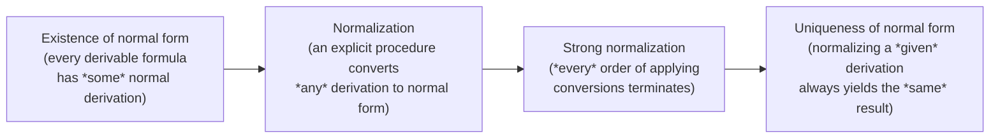

# Natural Deduction and the Inversion Principle

[[book-guidelines|↩ Back to guidelines]]

## Why natural deduction needs a *principle*, not just a list of rules

Suppose you're designing the typing rules for a small proof language — say, a `Proof` type with constructors for conjunction, disjunction, and implication. The introduction rules are the easy part: to build a proof of $A \& B$ you need a proof of $A$ and a proof of $B$; to build a proof of $A \vee B$ you need a proof of one side; to build a proof of $A \supset B$ you need a way to turn any proof of $A$ into a proof of $B$. This is just the **BHK-conditions** (Brouwer–Heyting–Kolmogorov), the constructive meaning explanation of the connectives, read off directly:

1. A direct proof of $A \& B$ consists of a proof of $A$ and a proof of $B$.
2. A direct proof of $A \vee B$ consists of a proof of $A$ *or* a proof of $B$.
3. A direct proof of $A \supset B$ consists of a proof of $B$ from the assumption that there is a proof of $A$.
4. A direct proof of $\bot$ is impossible.

These give you the four **introduction rules** essentially for free:

$$
\dfrac{A \quad B}{A \& B}\;\&I
\qquad
\dfrac{A}{A\vee B}\;\vee I_1
\qquad
\dfrac{B}{A\vee B}\;\vee I_2
\qquad
\dfrac{\begin{array}{c}[A]\\ \vdots\\ B\end{array}}{A\supset B}\;{\supset}I
$$

(There is no introduction rule for $\bot$ — you simply cannot construct a direct proof of falsity; that's the whole content of clause 4.)

But now: what are the corresponding **elimination rules**? If you've only seen a textbook presentation, you'd probably reach for the obvious ones — from $A\&B$ conclude $A$; from $A\&B$ conclude $B$; from $A\supset B$ and $A$ conclude $B$ (modus ponens). Those are correct, but they're not *derived* from anything — they're just guessed to be the inverse of the introduction rules, and it's not obvious *why* those particular rules are the right ones, or how many such rules there should be, or what the elimination rule for disjunction should even look like (there is no single formula you can "extract" from $A \vee B$ the way you extract $A$ from $A \& B$). Negri and von Plato's answer is Gentzen's **inversion principle**, generalized:

> **Inversion principle:** Whatever follows from the direct grounds for deriving a proposition must follow from that proposition.

This is the actual design principle, and it's worth sitting with because it's exactly the kind of "meaning-explanation-driven rule design" that shows up again when you write typing rules for a compiler: instead of writing down elimination forms by pattern-matching on what "looks right," you ask *what has to be true of anything that follows from the constituent proofs*, and that question mechanically produces the elimination rule — including telling you, for free, how strong the rule needs to be.

## Deriving the general elimination rules

Take conjunction. The direct grounds for $A\&B$ are a proof of $A$ *and* a proof of $B$. So by the inversion principle: if some conclusion $C$ follows from having both $A$ and $B$ (i.e. there's a derivation of $C$ from the two assumptions $A, B$), then $C$ already follows from $A \& B$ itself. That gives:

$$
\dfrac{A\&B \quad \begin{array}{c}[A,B]\\ \vdots\\ C\end{array}}{C}\;\&E
$$

Both auxiliary assumptions $A$ and $B$ are **discharged** at this inference (bracket notation, as in $\supset I$). Note this rule is not "extract $A$" or "extract $B$" — it's "you may use $A\&B$ to derive *anything* that would follow from having $A$ and $B$ separately." That $C$ is a completely arbitrary formula is the crux of *generality* here.

Disjunction is the case that makes the need for arbitrary $C$ obvious, because there's no way to statically pick out "the" component of $A\vee B$ — you don't know, syntactically, which disjunct actually holds. The direct grounds are: a proof of $A$, *or* a proof of $B$. So whatever follows from $A$ alone, and *also* follows from $B$ alone, follows from $A\vee B$:

$$
\dfrac{A\vee B \quad \begin{array}{c}[A]\\ \vdots\\ C\end{array} \quad \begin{array}{c}[B]\\ \vdots\\ C\end{array}}{C}\;\vee E
$$

Implication is the hardest case, and it's worth stating precisely because it's the rule most compiler/PL readers get wrong by analogy with function application. The direct ground for $A\supset B$ is the *existence of a hypothetical derivation* of $B$ from $A$ — not a value, a derivation. So: if $C$ follows from having such a derivation, i.e. if $C$ follows given that $B$ is derivable (using the derivation of $B$ from $A$, plus a proof of $A$ to instantiate it), then $C$ follows from $A \supset B$ alone:

$$
\dfrac{A\supset B \quad A \quad \begin{array}{c}[B]\\ \vdots\\ C\end{array}}{C}\;{\supset}E
$$

Here $A \supset B$ is the **major premiss**, $A$ is a genuine second premiss (you need an actual proof of $A$ to run the hypothetical derivation), and $B$ is discharged as the auxiliary assumption feeding the conclusion $C$.

Finally, $\bot$ has *empty* direct grounds — there is no way to directly prove it — so as a limiting case of the same principle, whatever follows from "having nothing" follows from $\bot$ unconditionally:

$$
\dfrac{\bot}{C}\;\bot E
$$

with no discharge and no restriction on $C$ at all — this is *ex falso quodlibet*.

**What the ordinary "special" rules actually are.** The rules usually taught in an intro logic course —

$$
\dfrac{A\&B}{A}\;\&E_1 \qquad \dfrac{A\&B}{B}\;\&E_2 \qquad \dfrac{A\supset B \quad A}{B}\;{\supset}E_{\text{mp}}
$$

— are just the *special case* of the general rules where you instantiate $C := A$, $C:=B$, or $C:=B$ respectively, and observe that in that case the discharged derivation of $C$ from the assumption is trivial (it's literally the assumption itself, immediately concluded). This specialization is possible for $\&$ and $\supset$ *because* their direct grounds already contain a formula ($A$, $B$, or $B$) that can double as the conclusion. It is **not possible for $\vee$**, because the direct ground of $A \vee B$ is "$A$ or $B$" — there is no privileged formula you can commit to as the answer without knowing which disjunct actually holds. This is exactly why ordinary textbooks present $\vee E$ in the fully general "prove $C$ both ways" form while quietly getting away with the narrow, subformula-only form for $\&E$ and $\supset E$: disjunction was never really an exception, it's conjunction and implication that happened to admit a shortcut. The generalized inversion principle just makes that shortcut explicit and, in doing so, restores a single uniform pattern across *all* the connectives — which is exactly what turns out to matter for normal form, below.

### Grounding: general elimination as continuation-passing destructuring

The general elimination rules read very naturally as **continuation-passing combinators** over proof terms — precisely the shape you'd want for a Rust proof/certificate representation:

```rust
// &I, ∨I, ⊃I as constructors of a proof-term language
enum Proof<A, B> {
    AndIntro(Box<A>, Box<B>),          // &I
}
enum Sum<A, B> { Left(A), Right(B) }   // A ∨ B as Either<A, B>

// The *general* elimination rules: destructure the major premiss,
// then hand the pieces to an arbitrary continuation producing C.
fn and_elim<A, B, C>(p: (A, B), k: impl FnOnce(A, B) -> C) -> C {
    let (a, b) = p;
    k(a, b)
}

fn or_elim<A, B, C>(p: Sum<A, B>, k1: impl FnOnce(A) -> C, k2: impl FnOnce(B) -> C) -> C {
    match p {
        Sum::Left(a)  => k1(a),
        Sum::Right(b) => k2(b),
    }
}

fn impl_elim<A, B, C>(f: impl FnOnce(A) -> B, a: A, k: impl FnOnce(B) -> C) -> C {
    k(f(a))          // f(a) : B is the discharged assumption, fed to k
}
```

The "special" rules are exactly the instances where the continuation `k` is the identity (`k = |a, _| a` for $\&E_1$, etc.) — which only typechecks for $\&$ and $\supset$ because only there does a component of the right type sit ready in the premisses. `or_elim` is precisely Lean's `Or.elim : a ∨ b → (a → c) → (b → c) → c` (and `impl_elim` is exactly `let`/`have`-style composition — the `Subst` rule of Chapter 8, discussed below). In Lean the proof term for a *general* elimination is literally a call into the `casesOn`/`rec` eliminator generated for the inductive type, with `k` (or the pair of `k1`,`k2`) playing the role of the **motive**'s branches — general elimination rules are, formally, what an inductive type's canonical eliminator looks like once you strip away dependent types and keep only the propositional skeleton.

## Discharge of assumptions and the sequent-style notation

Every schematic rule above (all but the one-step $\&I$, $\vee I$, and the special elimination rules) involves *discharging* one or more assumptions — closing off a temporary hypothesis so that the conclusion no longer depends on it. The bracket notation ("$[A]$" above the vertical dots) hides two important facts that the book makes explicit with **discharge functions**: discharge is *tagged* (each rule instance discharges assumptions carrying a specific numeral, written next to the inference line) and discharge is *optional* — you may, and sometimes must, leave an assumption open even when a rule instance would let you close it.

Rewriting natural deduction in **sequent-calculus style** — writing $\Gamma \vdash A$ for "$A$ is derivable from the multiset of open assumptions $\Gamma$" — makes the discharge bookkeeping precise and *local*, rather than something you have to infer by scanning up the derivation tree:

$$
\dfrac{\Gamma \vdash B}{\Gamma \setminus \{A\} \vdash A \supset B}\;{\supset}I
\qquad\qquad
\dfrac{\Gamma \vdash A \quad \Delta \vdash B}{\Gamma \cup \Delta \vdash A\&B}\;\&I
\qquad\qquad
\dfrac{\Gamma \vdash A\vee B \quad \Delta \cup \{A\} \vdash C \quad \Theta \cup \{B\} \vdash C}{\Gamma \cup \Delta \cup \Theta \vdash C}\;\vee E
$$

Three worked cases from the book illustrate why this matters, and each corresponds to a distinct discharge pattern:

- **Vacuous discharge.** $A \supset (B \supset A)$: the second premiss of the outer $\supset I$ is derived without ever using the freshly assumed $B$ — $B$ is discharged, but *vacuously* (0 occurrences used).
- **Multiple discharge.** $(A \supset (A\supset B)) \supset (A \supset B)$: to run the general $\supset E$ twice on the same major premiss $A\supset(A\supset B)$, the assumption $A$ has to be made *twice* and both occurrences discharged together at a single $\supset I$ instance.
- **Compulsory discharge and a subtle bug.** $A \supset A$, derived as "$[A] / A \supset A$" (one-line $\supset I$), looks trivial — but the book flags that its *sequent-style* justification, $A \vdash A \big/ {\vdash} A \supset A$, only works because discharge in $\supset I$ is compulsory: every occurrence of the discharge-labeled assumption in scope gets closed at once. This is precisely the kind of assumption-labeling subtlety that later needs a genuinely *formal* discharge mechanism (the **unique discharge principle** of Chapter 8) to avoid derivations that look syntactically fine but silently conflate two different assumption occurrences.

Discharge and the sequent-style relation $\Gamma \vdash A$ are not a cosmetic notational choice — they are the seed of sequent calculus itself (Chapter 1 §1.3 turns $\Gamma \vdash A$ directly into $\Gamma \Rightarrow A$), and Chapter 8 will prove that **weakening corresponds exactly to vacuous discharge and contraction corresponds exactly to multiple discharge** — the two "extra" structural rules of sequent calculus are nothing but natural deduction's discharge behavior made into first-class rules of their own.

## Normal form and the hierarchy of normalization properties

Once you have both introduction and (general) elimination rules, you can ask: is there redundancy? Concretely, if a derivation introduces $A\&B$ and then immediately eliminates it, the elimination is undoing work the introduction just did — the two steps should cancel. This cancellation is a **detour conversion**. For conjunction (the general rule, ignoring discharge for a moment):

$$
\dfrac{\dfrac{A \quad B}{A\&B}\;\&I \quad \dfrac{[A,B]\;\vdots\;C}{C}\;\&E}{C}
\quad\leadsto\quad
\dfrac{A \quad B \quad \vdots}{C}
$$

— the derivation of $C$ from $A,B$ has $A$ and $B$ substituted in directly, and the $\&I$/$\&E$ detour disappears. Analogous conversions exist for $\vee$ and $\supset$.

This gives the book's precise definition of **normal form**: a natural-deduction derivation *with general elimination rules* is normal iff every major premiss of an elimination rule is an assumption (never the conclusion of an introduction rule). Note that this single, uniform characterization only works *because* the elimination rules were generalized — with the traditional special rules, disjunction elimination already breaks the simple "eliminate then introduce" picture, since a disjunction-eliminated conclusion needn't be a subformula of anything above it. Using general rules throughout restores one uniform normal-form criterion for every connective.

Negri and von Plato are careful to separate four properties of increasing strength, and it's worth internalizing the distinction because conflating them is a common source of confusion (and because you will need exactly this hierarchy again when reasoning about the termination and confluence of a compiler's own reduction system):



The subtlety flagged explicitly in the source: uniqueness of normal form for *a given derivation* does **not** imply there is a unique normal derivation *of a formula* — two genuinely different non-normal derivations of the same formula can (and generally do) terminate at two different normal derivations. Uniqueness is about determinism of the reduction *strategy-independence for one starting term*, not about a canonical proof object for a proposition — precisely the same distinction as confluence (Church–Rosser) versus "there's only one normal form for the type," which anyone building a definitional-equality checker (Lean's `isDefEq`, or a Rust kernel's own reducer) has to keep straight: confluence guarantees *a* unique normal form per term, not one normal form shared across all terms of the same type.

## From Chapter 1's sketch to Chapter 8's real conversion theory

Chapter 1 states detour conversions only for the simplest case — no vacuous or multiple discharge. Chapter 8 §8.5 ("The Structure of Normal Derivations") is where the book actually pays for that IOU, and this is where the topic's real depth lives.

**(a) Detour conversions, generalized.** With multiple discharge in the picture, a detour conversion becomes a *simultaneous, multiset* substitution. For $\&$:

$$
\dfrac{\dfrac{A\quad B}{A\&B}\;\&I \quad \dfrac{[A^m,B^n]\;\vdots\;C}{C}\;\&E}{C}
\quad\leadsto\quad
\dfrac{A^m,\;B^n\;\vdots}{C}
$$

— the derivations of $A$ and $B$ each get substituted for *every* discharged occurrence ($m$ and $n$ of them respectively), exactly mirroring **multicut**/principal-cut elimination in the structural-rule-free sequent calculus GN of Chapter 5 (where weakening is $m{=}0$ and contraction is $m{>}1$ built into a formula's own multiplicity exponent). The book makes this correspondence completely explicit with a worked example: the natural-deduction detour $A\;B \xrightarrow{\&I} A\&B \xrightarrow{\&E,\,[A]} A$ (with $B$ vacuously discharged) translates to a sequent-calculus derivation whose cut-elimination step produces $A\Rightarrow A$ plus an unused weakening on $B$ — deleting that redundant weakening gives *exactly* the natural-deduction detour-conversion result. Detour conversion in ND and cut elimination in sequent calculus are, quite literally, the same operation viewed through two different syntaxes — this is the seed of the sequent-calculus/natural-deduction isomorphism that Chapter 8 builds toward and that later chapters (10, Conclusion) develop in full.

**(b) Permutation conversions.** General elimination rules introduce a *new* kind of non-normality that has no counterpart with the special rules: an elimination step whose major premiss is itself the conclusion of *another* elimination step (rather than an introduction). Since that inner elimination isn't a detour (no introduction/elimination pair), it needs a different move — permuting the outer elimination *up into* the inner one's discharge branches. The book's example with two nested $\vee E$'s:

$$
\dfrac{\dfrac{A\vee B \quad \dfrac{[A]\;\vdots\;C\vee D}{}\quad \dfrac{[B]\;\vdots\;C\vee D}{}}{C\vee D}\;\vee E \quad \dfrac{[C]\;\vdots\;E}{}\quad\dfrac{[D]\;\vdots\;E}{}}{E}\;\vee E
\;\leadsto\;
\dfrac{A\vee B \quad \dfrac{[A]\;\vdots\;C\vee D \quad [C]\vdots E \quad [D]\vdots E}{E}\;\vee E \quad \dfrac{[B]\;\vdots\;C\vee D \quad [C]\vdots E \quad [D]\vdots E}{E}\;\vee E}{E}\;\vee E
$$

pushes the outer $\vee E$ (on $E$) inside each branch of the inner one — reducing, but not eliminating, the "distance" between the major premiss $C\vee D$ and its own introduction. This is not cosmetic: **general elimination rules for every connective admit permutation conversions**, not just $\vee$ and $\exists$ — the book gives a striking example where even $(A\&B)\&C \xrightarrow{\&E} A\&B \xrightarrow{\&E} A$ (nested conjunction elimination) needs a permutation conversion to reach a form where *both* $\&E$ instances have an assumption, rather than another elimination, as major premiss. Under the sequent-calculus translation, a permutation conversion is *exactly* the step of permuting a cut upward past a left-rule instance ($L\vee$ in the disjunction case) — the standard, mundane housekeeping step of any cut-elimination proof, here surfacing as a genuinely new phenomenon on the natural-deduction side.

**(c) Simplification conversions.** A third, easy-to-miss redundancy: an elimination-rule instance with *no discharged assumptions at all* (or, for $\vee E$, a branch where a disjunct was never actually used). Such an instance is provably unnecessary — its conclusion $C$ is already derivable in one of the auxiliary sub-derivations without the elimination step. In sequent-calculus terms this is a **hereditarily vacuous cut**, a cut whose cut formula was introduced by a left rule that never actually needed the succedent context it was cutting against. The book gives a genuinely important warning here: a *simplification* convertibility can sit hidden inside a derivation and *block* a detour conversion from applying at all until the simplification is done first — normalization strategies have to account for this ordering dependency.

**(d) Threads replace branches.** With special elimination rules restricted to the $\vee$-, $\exists$-free fragment, a normal derivation has a simple picture: walking any branch top-to-bottom, formulas are subformulas of their neighbors the whole way. General elimination rules break this — a $\vee E$ or general $\&E$/$\supset E$ instance can have its major premiss come from *anywhere* higher up, discharging its auxiliary assumption far below. The book's fix is the notion of a **thread**: a sequence of formulas $A_1,\dots,A_n$ that *jumps* from a major premiss straight to its own auxiliary (discharged) assumption, skipping over the intervening elimination structure, rather than following the derivation tree edge-by-edge. Every formula in a derivation lies on at least one thread, and — this is the payoff — *within* a normal thread, consecutive formulas *are* related by the immediate-subformula relation, exactly recovering the simple picture, just along threads instead of tree branches. This directly delivers a **direct proof of the subformula property** for normal ND derivations (Chapter 1 only asserted it via the sequent-calculus translation of Chapter 8 §8.3; §8.5 proves it natively in ND terms).

**(e) The direct proof of (strong) normalization.** Chapter 8 §8.4 already gave one normalization proof by round-tripping through sequent calculus and its cut-elimination theorem. §8.5(e) gives a *direct* proof that never leaves natural deduction, and its termination measure is a genuinely elegant piece of proof engineering: each thread carries a **multiset of convertible-formula lengths** (ordered so shorter maximum length wins, then fewer formulas at that length, and so on — a well-founded multiset ordering), and each major premiss has a **height along its thread** (roughly, its distance from the topformula, counted only through elimination steps). Detour conversions strictly shrink the convertible-formula multiset; permutation conversions never grow it but strictly shrink some major premiss's height. Since neither kind of conversion can increase the measure and both strictly decrease *some* component of it, the process terminates in *any* order — this is what makes the argument a strong-normalization proof, not merely a normalization one, and it is the direct analogue (worked natively, rather than borrowed via translation) of the strong normalization theorem the book proves for the isomorphic sequent calculus in Chapter 10.

The chapter closes this arc with **Theorem 8.5.6** (following Mints 1993): every derivation can be converted to one where all major premisses of elimination rules are *proper assumptions* — underivable formulas, never themselves the conclusion of some other complete sub-derivation. Translated to sequent calculus, this says every derivable sequent has a derivation in which no formula principal in a left rule is *itself* derivable — a purely proof-theoretic form of "don't do redundant work" that generalizes far past this one theorem.

### Grounding: threads as elimination spines, conversions as reduction/defeq

This second layer of §8.5 maps onto compiler machinery even more directly than the informal Chapter 1 sketch:

- **Detour conversion is $\beta$/$\iota$-reduction**, and — via the GN correspondence shown above — it *is* what a kernel's `isDefEq`/normalizer performs when it unfolds a constructor applied to its own eliminator (`Nat.rec (Nat.succ n) ... = ...` in Lean; a `match` on a freshly-built enum in Rust). The multiset-substitution version (with vacuous/multiple discharge) is exactly why real kernels need *simultaneous*, capture-avoiding substitution rather than naive single-variable substitution.
- **Threads are elimination spines.** A chain of major premisses "jumping" from an elimination straight to its discharged assumption is precisely what Pfenning-style spine calculi (and any bidirectional elaborator processing an application chain `f a1 a2 .field a3`) track as the *inference-mode spine* of a term — the sequence of eliminators applied in order, each one's type driving the next. This is not a loose analogy: a bidirectional type checker's "infer the type of this elimination chain, then check the tail against it" loop *is* thread-following, and the book's proof that threads carry the subformula property is the proof-theoretic ancestor of why an elaborator's inference mode never has to guess a type out of nowhere along a spine.
- **Simplification conversions are dead-code/redundant-cut elimination** in exactly the sense a compiler's own peephole optimizer would recognize — an elimination whose result was already sitting in a branch, discharging nothing.
- **The strong-normalization measure is a termination certificate.** The lexicographic (multiset-of-lengths, then thread-height) ordering used in §8.5(e) is a textbook well-founded measure of the kind a Rust verifier would need to *justify*, not just assume, that its own definitional-equality reduction terminates — this is precisely the "proof-producing" obligation behind a trusted kernel's normalizer.

```python
# A five-line illustrative sketch (not from the book) of the general-&
# detour conversion as a substitution step, to make (a) concrete:
def detour_and(deriv_A, deriv_B, cont):   # cont : (A, B) -> C, i.e. the [A,B]...C branch
    return cont(deriv_A, deriv_B)          # substitute both premisses simultaneously
```

## Where this leads

Structurally, this topic is the load-bearing beam the rest of the book hangs from, not a self-contained aside:

- **Chapter 1 §1.3** turns the sequent-style relation $\Gamma \vdash A$ directly into sequent calculus's $\Gamma \Rightarrow C$, with introduction rules becoming *right* rules and (general) elimination rules becoming *left* rules — the entire sequent-calculus half of the book is, by construction, "natural deduction's derivability relation, formalized."
- **Chapter 8** (this article's second source) is where the promissory note from Chapter 1 — "general elimination rules give an isomorphism with cut-free sequent calculus; the ordinary special rules don't" — gets proved, via the detour-conversion/cut-elimination correspondence worked out above, and extended into a full theory of normal derivations (threads, subformula property, direct strong normalization).
- **Chapter 10** and the **Conclusion** push the correspondence into an actual isomorphism theorem and a single uniform calculus ($MG$) generalizing both natural deduction and sequent calculus — general elimination/introduction rules turn out to be the substitution instances from which ordinary sequent-calculus rules, their inverses, and natural-deduction rules are all recovered.
- **Appendix B** (constructive type theory) attaches proof-*objects* to exactly this rule system — the general elimination rules above are literally what license the "eliminator/selector" side of Martin-Löf type theory's constructors-vs-selectors distinction, and detour conversion becomes the type theory's *computation rule* (definitional equality).

For the standing project of this vault — a Rust dependent/refinement-type compiler with a Lean-style elaborator and an embedded prover — this topic is directly load-bearing in three places: (1) the general elimination rules are the formal ancestor of typed eliminators/recursors your kernel will need to check pattern matches against a motive; (2) threads and the subformula property are the proof-theoretic justification for why a bidirectional elaborator's inference-mode spine never needs to backtrack — it's structurally guaranteed to land on subformulas; and (3) the detour-conversion/cut-elimination correspondence, and the explicit well-founded measure behind §8.5's strong-normalization proof, are close working models for what a trusted kernel has to certify about its own reduction relation before `isDefEq` can be trusted at all.
