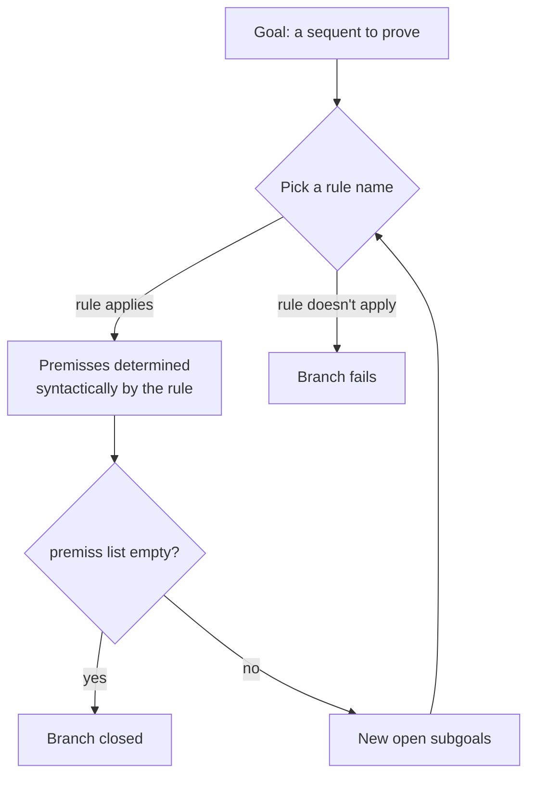

[[book-guidelines|↩ Back to guidelines]]

## Why a sequent calculus needs an editor at all

Gentzen himself already noticed the problem: sequent calculus is a terrible medium for a human to *write* proofs in. A natural-deduction proof reads like an argument — you assume things, combine them, discharge assumptions, and reach a conclusion. A sequent calculus proof carries the entire context explicitly at every node: every hypothesis, every side formula, copied and threaded through the whole tree, at every single step, because that's exactly what makes the structural metatheorems of the rest of this book (weakening, contraction, cut admissibility, the subformula property) provable by clean induction. The very design decisions that make sequent calculus *mathematically* tractable — multiset contexts, principal/active/context formula bookkeeping, contraction-free left rules — are what make it *mechanically* tedious and error-prone for a human to write out by hand.

That's an odd position to be in at the end of a book that spent eight chapters building exactly this machinery for its analytic properties. But it turns out the same property that makes cut elimination provable — every rule's premisses are syntactically determined by its conclusion — is *also* exactly what a computer needs to search for proofs automatically. Appendix C is not a digression; it's the payoff. PESCA (a Haskell program by Aarne Ranta, roughly 1400 lines across nine modules) is a working interactive proof editor and automatic theorem prover for exactly the calculi this book develops, and its entire architecture rests on a single structural fact proved (implicitly, over and over) in every earlier chapter: **top-down determinacy**.

## Top-down determinacy: the property that makes proof search mechanical

**What breaks without it.** Imagine trying to build a proof assistant for a calculus where, given a *conclusion*, a rule's *premisses* are not uniquely determined by the syntax of the conclusion — say a rule where you'd have to guess an auxiliary lemma, or where multiple genuinely different premiss-sets could produce the same conclusion by the same rule name. You could still *check* a proof someone else supplies (that only needs bottom-up, premiss → conclusion, verification). But you could not mechanically *search* for one, because "apply this rule" would not tell you what subgoals to prove next — you'd need external guidance at every step. Refinement-style interaction (start from the goal, work backward) would be unusable as an interface.

Sequent calculus, as this book builds it (G3-style: contraction-free, atoms-only axioms, shared multiset contexts, principal formula and its immediate subformulas appearing explicitly in the rule), does not have this problem. Every rule the book proves invertible or height-preserving admissible along the way is, from PESCA's point of view, evidence of the same underlying fact: pick a conclusion sequent and a rule name, and the premisses are syntactically forced. Ranta states it in one line (p. 236):

> Given a conclusion and a rule, the premisses are determined.

This is called **top-down** determinacy rather than "bottom-up" because proof trees are conventionally drawn with premisses above the conclusion — but proof *search* proceeds the other way, from the root (the goal) down toward the leaves (the axioms), so proof theorists more often call the same idea "root-first" search to avoid exactly this typographic confusion. Ranta explicitly borrows the technique from ALF (Magnusson 1994), a proof editor for Martin-Löf's constructive type theory — the same lineage this book's Appendix B just finished covering. PESCA is that same refinement-editor idea, transplanted from type theory's judgment forms onto sequent calculus's rule forms.

The refinement loop is then almost embarrassingly simple:



A branch closes successfully when a rule returns an *empty* premiss list (this happens exactly at logical axioms $P,\Gamma\Rightarrow\Delta,P$ — no further sequent needs proving). A branch fails when no rule name the user or the automatic search tries actually applies to the current goal. There is no backtracking magic here, no unification-driven search over an open space of possible premisses — the space of possible next states is *fixed by the syntax of the goal and the chosen rule*, which is exactly why brute-force search over it (PESCA's `t`, "try", command) can be complete and terminating for propositional calculi.

**What this restricts PESCA to.** Because top-down determinacy is doing all the work, PESCA cannot support just any sequent calculus — only the family with:

- **Shared multiset contexts** (the G3-style calculi of Chapters 2–4, not the GOi/GOc independent-context calculi of Chapter 5, where the *same* context formula splits across multiple premisses and rules carry explicit weakening/contraction alongside the logical step),
- **No structural rules** (contraction-free, à la G3ip's repeated-principal-formula device for $L{\supset}$ — a calculus like GN/GM with multiplicity exponents doesn't fit this interface cleanly either),
- either **single- or multi-formula succedents** (both G3i-style intuitionistic and G3c-style classical multisuccedent calculi are fine — the succedent shape doesn't affect determinacy, only how many formulas a rule can act on).

This is a nice concrete payoff of the book's earlier design choices: the reason Negri and von Plato spend so much effort making the *rules themselves* contraction-free and shared-context in Chapters 2–4, rather than adopting Gentzen's original LJ/LK with separate structural rules, is precisely what later makes an implementation like PESCA possible without an ad hoc special case for every combination of weakening/contraction bookkeeping.

## Two example sessions: what "interacting with PESCA" actually looks like

### (a) Disjunction commutativity, $A\vee B\Rightarrow B\vee A$

The PESCA prompt is `|-`. A session opens a goal with `n` (new):

```
|- n A v B => B v A
```

This produces a proof tree with one open subgoal, subgoal `1` — the whole endsequent, unproven. Subgoals are addressed by **digit sequences from the root**: subgoal `1` is the root; refining it by a two-premiss rule produces subgoals `11` and `12`; refining `11` further gives `111` and `112`; and so on. This is exactly a preorder path address into the (still-growing) proof tree, and it is what lets `refine` target *any* open leaf without re-navigating the whole structure each time.

The command `a` ("applicable rules") lists every rule that can fire on the current goal:

```
r 1 A1 S1 Lv -- A v B => B v A
r 1 A1 S1 Rv1 -- A v B => B v A
r 1 A1 S1 Rv2 -- A v B => B v A
```

each line is a ready-to-paste `refine` command. `A1 S1` names the **active formula** in the antecedent/succedent (by default, the first antecedent formula and the last succedent formula, so this can usually be omitted). Choosing $L\vee$ splits on the left disjunction — exactly the sequent calculus rule

$$
\frac{A\Rightarrow B\vee A \qquad B\Rightarrow B\vee A}{A\vee B\Rightarrow B\vee A}\ L\vee
$$

and PESCA replaces subgoal `1` with the two new subgoals `11: A\Rightarrow B\vee A` and `12: B\Rightarrow B\vee A`. Refining `11` by $R\vee_2$ (pick the *second* disjunct) reduces it to `111: A\Rightarrow A`, which the axiom rule `ax` closes with **zero** new subgoals — the empty-premiss-list termination case from the flowchart above. The symmetric path closes `12`. When every branch is closed, `s` ("show subgoals") reports nothing, which *is* the signal that the proof is complete.

Two output commands then convert the finished tree into the forms the rest of the book actually typesets. `l` produces the sequent calculus derivation as $\LaTeX$:

$$
\dfrac{\dfrac{}{A\Rightarrow A}\ ax \qquad \dfrac{}{B\Rightarrow B}\ ax}{\dfrac{A\Rightarrow B\vee A}{}\qquad \dfrac{B\Rightarrow B\vee A}{}}\Big|\ A\vee B\Rightarrow B\vee A
$$

and `nd` produces the corresponding **natural deduction** derivation — a direct, executable instance of the sequent-calculus/natural-deduction translation Chapter 8 proves as an isomorphism in general. PESCA is not merely *using* that translation as background theory; it *implements* it as a printing function.

### (b) The quantifier-switch law, $(\exists y)(\forall x)C(x,y)\Rightarrow(\forall x)(\exists y)C(x,y)$

Predicate calculus adds exactly one new kind of interaction step. The rule $R\exists$

$$
\frac{\Gamma\Rightarrow A(t/x)}{\Gamma\Rightarrow \exists x\,A}\ R\exists
$$

introduces a **parameter** $t$ that is not yet fixed by the rule alone — refining by $R\exists$ leaves a *hole*, a still-unspecified term, in exactly the same sense that an open subgoal is a still-unproven sequent. PESCA treats parameters as a second, distinct flavor of "premiss": `AbsRule` (below) returns a list where each entry is *either* a new sequent to prove *or* a parameter identifier to instantiate — Ranta's own framing, echoing Martin-Löf's $\Sigma$-introduction rule from Appendix B, where a witness term is exactly as much "part of the proof" as any other premiss. Once the goal reaches a point where the witness for $y$ needs fixing, the command

```
|- i t y
```

replaces every occurrence of parameter `t` in the *entire current proof* by the term `y` — an in-place, global instantiation, not a local substitution confined to one subgoal. After that and a couple more ordinary refinements ($L\forall$ then `ax`), the finished tree is

$$
\dfrac{\dfrac{}{C(x,y),(\forall x)C(x,y)\Rightarrow C(x,y)}\ ax}{\dfrac{(\forall x)C(x,y)\Rightarrow C(x,y)}{}}L\forall\Big/\dfrac{(\forall x)C(x,y)\Rightarrow\exists y\,C(x,y)}{}R\exists[t{:=}y]\Big/\cdots
$$
$$
\Rightarrow\ (\exists y)(\forall x)C(x,y)\Rightarrow(\forall x)(\exists y)C(x,y)
$$

with the two instantiations annotated next to the rule names that introduced the corresponding parameters. **A proof with an uninstantiated parameter is, in exactly the same sense as a proof with an open subgoal, incomplete** — both are "holes" the `s` command will keep reporting until filled.

## The command set

The commands exercised above are the small, orthogonal core of the whole system (p. 239–240):

| Command | Effect |
|---|---|
| `n sequent` | open a **new** goal (proof state resets to that sequent as subgoal `1`) |
| `r goal [A int][S int] rule` | **refine** a goal by a named rule, resetting the active antecedent/succedent formula if given |
| `i parameter term` | **instantiate** a parameter globally across the current proof |
| `t goal int` | **try**: automatic search, brute-force but terminating, up to `int` recursive rule applications |
| `u subtree` | **undo**: collapse a subtree back to an open goal at its root |
| `s` | **show** all currently open subgoals (empty output = proof complete) |
| `a goal` | list **applicable** refinement commands for a goal |
| `c calculus` | **change** the current calculus (calculi compose with `+`, e.g. `c G3c + Geq`) |
| `x file` | read a **nonlogical axiom** file, parse it into rules, extend the current calculus |
| `l [file]` | print the current proof as $\LaTeX$ **sequent calculus** |
| `d [file]` | print the current proof as $\LaTeX$ **natural deduction** (G3i/G3ip only) |

Two of these deserve a second look because of what they reveal about the architecture. `t` (try) is stated candidly as "based on brute force but always terminating" — for calculi like G4ip, whose whole design point (Chapter 5.5) is a weight function guaranteeing that active formulas are strictly lighter than principal ones, brute-force search over a *finite*, strictly-decreasing search space is not a hack, it's the intended payoff of that termination proof. For plain predicate calculus rules needing instantiation, automatic search "usually fails" — there is no unification-based guessing of witness terms here, which is exactly the gap a Miller-pattern-style metavariable mechanism would need to close (see the closing [[Classical-Propositional-and-Predicate-Logic#Synthesis|synthesis]]).

`c` treating a calculus as a *set of rules* closed under union (`+`) is a small but telling design choice: it means "classical predicate logic with equality" is not a bespoke calculus PESCA special-cases, but literally `G3c + Geq`, the union of two independently-defined rule sets — a direct software analogue of how Chapter 6 builds theories by adding nonlogical rules on top of a fixed logical core.

## Axiom files: why the restriction to Horn-shaped formulas is load-bearing, not incidental

Command `x` lets a user extend the current calculus with **nonlogical axioms** read from a file — but not arbitrary formulas. The restriction (p. 241) is exact:

> implications with conjunctions of atoms on their left-hand sides and disjunctions of atoms on their right-hand sides. Either side can be empty.

i.e. axiom formulas of the shape

$$
P_1\wedge\cdots\wedge P_m \;\supset\; Q_1\vee\cdots\vee Q_n
$$

with an empty antecedent written by omitting the implication sign, and an empty succedent written as $\bot$ (or, dually, a negated antecedent read as implying $\bot$). Variables occurring only on the right are treated as parameters (existentially flavored witnesses, in the same sense as `i` above).

This is not an arbitrary restriction for implementation convenience — it is *exactly* the shape of formula Chapter 6 proves you're allowed to turn into a nonlogical **rule of inference** while keeping cut admissible. Chapter 6's rule scheme

$$
\frac{Q_1,\Gamma\Rightarrow\Delta \quad \cdots \quad Q_n,\Gamma\Rightarrow\Delta}{P_1,\ldots,P_m,\Gamma\Rightarrow\Delta}
$$

only has a well-defined *height-preserving* admissibility proof for weakening, contraction, and cut when the active/principal formulas on the rule's antecedent side are restricted to atoms — arbitrary compound antecedent formulas would break the induction on cut-height the same way an unrestricted axiom (recall Chapter 2's key question about why $G3ip$'s logical axiom must be restricted to atoms) breaks it for the *logical* axiom. PESCA's axiom-file syntax is the book's Horn-clause-shaped nonlogical rule scheme, verbatim, exposed as a file format. `x` is not a separate feature bolted onto the proof editor; it is the R-system of Chapter 6 §6.3 (axioms-as-rules) made loadable at runtime.

The worked example is lattice theory. A user-supplied axiom file (`\wedge`/`\vee`/`\leq` written in $\LaTeX$-ish ASCII, since text above a `--` header line is passed through to $\LaTeX$ verbatim) —

```
Mtl  (a \wedge b) \leq a
Mtr  (a \wedge b) \leq b
Jnl  a \leq (a \vee b)
Jnr  b \leq (a \vee b)
Unimt  c \leq a & c \leq b -> c \leq (a \wedge b)
Unijn  a \leq c & b \leq c -> (a \vee b) \leq c
Ref  a \leq a
Trans  a \leq b & b \leq c -> a \leq c
```

is parsed by `x` into rules such as

$$
\text{Mtl:}\ \dfrac{a\wedge b\le a,\ \Gamma\Rightarrow\Delta}{\Gamma\Rightarrow\Delta}\qquad
\text{Unimt:}\ \dfrac{c\le a,\ c\le b,\ \Gamma\Rightarrow\Delta}{c\le a\wedge b,\ \Gamma\Rightarrow\Delta}\qquad
\text{Trans:}\ \dfrac{a\le c,\ a\le b,\ b\le c,\ \Gamma\Rightarrow\Delta}{a\le b,\ b\le c,\ \Gamma\Rightarrow\Delta}
$$

— one rule per axiom clause, each shaped exactly like the nonlogical rules in Chapter 6.6's cut-free lattice theory, generated mechanically rather than derived by hand.

## Implementation: the abstract syntax and the primitives it hangs off of

**Abstract syntax.** PESCA's central module defines the data types every other module pattern-matches on: `Sequent`, `Formula`, `Term`, `Proof`, `AbsRule`. The entire system, apart from the terminal I/O layer, works purely over these syntax trees — no string manipulation once you're past the parser. Sequents are represented as pairs of *lists* of formulas rather than a dedicated multiset type; the multiset semantics (order-independence, and the ability to designate *any* formula as "the" active one for a rule) is implemented implicitly, by functions that consider permutations of the list rather than by a canonical multiset data structure. This is a pragmatic simplification, not a semantic shortcut — Ranta notes it's "not necessary to consider all permutations" in most cases, since the active-formula selectors (`A1`, `S1` above) pick out a specific position rather than searching the whole multiset.

**The type that *is* top-down determinacy.** The single most important line in the appendix is a type signature:

```haskell
type AbsRule = Sequent -> Maybe [Either Sequent Ident]
```

A rule is literally a function from a conclusion to either failure (`Nothing`) or a list of premisses, where each premiss is *either* a new sequent to prove *or* a parameter identifier to instantiate (`Either Sequent Ident`). This type signature is not just an implementation detail — it *is* the formal statement of top-down determinacy. "Given a conclusion and a rule, the premisses are determined" is precisely the claim that `AbsRule` is a well-defined total function on the syntax of `Sequent` (partial only in the sense that it may correctly report non-applicability via `Nothing`), rather than, say, a *relation* between conclusions and possible premiss-sets that would need search or backtracking to resolve.

The two proof-search primitives built on top of `AbsRule` are almost embarrassingly small:

```haskell
replace :: Proof -> [Int] -> Proof -> Proof

applicableRules :: AbsCalculus -> Sequent ->
                    [((Ident, AbsRule), [Either Sequent Ident])]
```

`replace` takes a whole proof, a subtree address (the same digit-sequence addressing scheme from the example sessions, here as `[Int]`), and a replacement subtree, and substitutes it in — this one function underlies `refine`, `undo`, and `instantiate` alike; they differ only in *what* replacement tree they compute. `applicableRules` runs every rule in a calculus against a sequent and returns the ones that succeed, paired with their resulting premisses — this is what backs command `a`, and, iterated, is the entire mechanism of automatic search (`t`): recursively call `applicableRules`, pick a result (brute-force, all branches, up to a bound), `replace`. Ranta notes this reuses the same top-down combinator parsing technique (Wadler 1985) for *both* parsing formulas from text *and* searching for proofs — two syntactically different problems solved by the same combinator idiom, because both are "given a goal, try alternatives, backtrack on failure" search over a tree-shaped space.

**Grounded in Rust.** This is precisely the "checker/verifier-shaped" territory this project's own compiler work lives in — a tactic/rule-dispatch engine over a fixed AST, exactly the shape a Rust-based prover's proof-search core would take. `AbsRule` translates directly to a trait object or, more idiomatically in Rust, a closure with a `Result` return type standing in for `Maybe`:

```rust
/// A conclusion-to-premisses step: the direct analogue of Haskell's AbsRule.
/// `Ok(vec![])` = proof complete on this branch (an axiom fired).
/// `Err(NotApplicable)` = the rule doesn't match this sequent's shape.
enum Premiss {
    Goal(Sequent),
    Param(Ident),
}

trait AbsRule {
    fn apply(&self, conclusion: &Sequent) -> Result<Vec<Premiss>, NotApplicable>;
}

// Individual rules as zero-sized types implementing the trait,
// or as a dispatch enum if you want exhaustiveness-checked rule sets:
enum RuleName { LOr, ROr1, ROr2, LImp, RImp, Ax, /* ... */ }

fn applicable_rules(calculus: &[Box<dyn AbsRule>], goal: &Sequent)
    -> Vec<(RuleName, Vec<Premiss>)>
{
    calculus.iter()
        .filter_map(|rule| rule.apply(goal).ok().map(|prem| (rule.name(), prem)))
        .collect()
}
```

The key design point worth carrying forward is exactly what the Haskell type signature *forces on you for free*: because `AbsRule::apply` is a pure function of the conclusion — no ambient proof-search state, no unification variables to solve, no backtracking bookkeeping inside the rule itself — a Rust tactic engine built this way can implement `replace`-style subtree substitution as ordinary structural editing of an immutable (or `Rc`-shared, copy-on-write) proof tree, without needing a trail/undo log beyond "keep the old tree around." That is a much simpler trusted core than a Prolog-style resolution engine with explicit backtracking state, and it is simpler precisely *because* the underlying calculus was designed (by the whole rest of this book) to have this determinacy property in the first place. A prover for a calculus that lacked it — say, one with an unrestricted cut rule as a primitive step, rather than one proved *admissible and eliminable* — would not admit this architecture at all; you'd need genuine search over premiss *sets*, not just over rule choices.

**Parsing, predefined calculi, natural deduction output, and the dialogue layer** round out the remaining four of PESCA's nine modules and are comparatively unsurprising: parsing/printing reuses the Wadler top-down combinator method already mentioned; predefined logical calculi (unlike nonlogical axioms) are compiled directly into the program rather than loaded from files, because — in Ranta's own words — "there is... so much variation and irregularity in the rules" that a general file syntax for arbitrary sequent calculus rules was judged not worth building; the natural-deduction translator (command `d`) implements Chapter 8's translation but only for G3i/G3ip, with extension to G4i/G4ip and beyond explicitly left as "an exercise"; and the dialogue layer is a monadic input/output loop threading the (current calculus, current proof) pair as state through each command.

## Where this leads

PESCA is the book's proof that everything in Chapters 1–8 was never purely descriptive metatheory — it's an implementable specification. Top-down determinacy, the property whose absence would make a rule-refinement interface impossible, is quietly what every height-preserving admissibility proof, every invertibility lemma, and every contraction-free rule design choice in this book was *for*, in addition to being for cut elimination. The two payoffs (a Hauptsatz, and a mechanizable proof search) turn out to be the same design constraint viewed from two directions.

For the standing project of building a Rust-based dependent/refinement-type compiler with an embedded prover, PESCA is a genuinely small-scale precedent worth taking literally, not just as inspiration:

- **`AbsRule : Sequent -> Maybe [Either Sequent Ident]`** is a template for a tactic-dispatch layer: a proof/typing step as a pure function from a goal (a judgment, not just a sequent) to either failure or a list of subgoals-or-metavariable-obligations. The `Either Sequent Ident` split — "this premiss is a proof obligation" vs. "this premiss is a term to be filled in" — is precisely the distinction a bidirectional elaborator needs between recursive type/proof-checking obligations and **metavariable** obligations for implicit arguments.
- **`i parameter term` (global instantiation)** is a primitive, unification-free stand-in for what a real elaborator does with Miller-pattern unification: resolve a metavariable and propagate the substitution through the whole in-progress derivation. PESCA punts on search for the *right* instantiation (automatic proof search "usually fails" once instantiation is needed) — that's exactly the gap that constraint generation plus pattern-unification-based constraint solving is meant to close, turning "the user must supply `t`" into "the elaborator infers `t` from the surrounding bidirectional typing constraints."
- **Axiom files as Horn-shaped nonlogical rules** are a working, minimal instance of exactly the CHC (constrained Horn clause) shape this project's Hoare-triple/refinement-type verification conditions are meant to take — PESCA already demonstrates, in ~1400 lines, that restricting nonlogical axioms to a Horn fragment is not just a convenient CHC-solver input format but a *soundness-preserving* restriction (cut elimination survives it) tracked all the way back to Chapter 6's closure condition.
- **`replace` and `applicableRules` as the entire trusted core** are a case study in keeping a proof-search engine's kernel small: the correctness of the whole system reduces to the correctness of a handful of pattern-matching rule functions plus one tree-substitution primitive, which is the right shape to aim for in a trusted kernel that a larger, more heuristic tactic layer sits on top of without needing to be trusted itself.

The appendix ends, fittingly, by inviting exactly this kind of extension: Ranta calls PESCA "a simple and small program" whose extension with new calculi and algorithms "can provide instructive student projects" beyond mere use of the editor. Read against this project's own goals, that's less a throwaway remark than a direct challenge.
