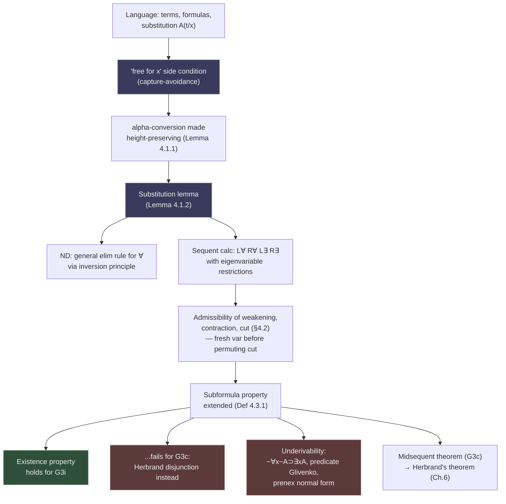

# Quantifiers and First-Order Proof Theory

[[book-guidelines|↩ Back to guidelines]]

## Why quantifiers are a different kind of problem

Everything in Chapters 1–3 of *Structural Proof Theory* — natural deduction, the move to sequent calculus, cut elimination for propositional G3ip and G3cp — is built on a closed universe of formulas: finitely many connectives, finitely many subformulas, rules that only ever rearrange symbols already sitting in front of you. A quantifier breaks that closure. $\forall x A$ doesn't range over a fixed finite set of subformulas; it stands for *every* instance $A(t/x)$, for every term $t$ you could ever construct, including terms nobody has written down yet. If you naively tried to make $\forall x A$ into a "big conjunction" $A(t_1/x) \& A(t_2/x) \& \cdots$, you'd need infinitely many premisses to introduce it and infinitely many subformulas to track — the whole proof-theoretic apparatus (finite derivations, decidable proof search, a subformula property you can actually enumerate) would collapse.

Gentzen's insight, and the one this chapter formalizes with full rigor, is that you don't need infinitely many instances. You need exactly *one* instance, but built from a variable that is constrained to stand for an **arbitrary** individual rather than any particular one. That constraint — a *side condition* on which variables are allowed to appear where — is the single new proof-theoretic mechanism the quantifiers introduce. Get the side condition right and a two-premiss propositional calculus extends smoothly to first-order logic with all the same finiteness and cut-elimination guarantees. Get it wrong (as the classic soundness-breaking substitution examples show) and you can prove garbage. This is also, not coincidentally, exactly the same problem a type checker's context management and an elaborator's capture-avoiding substitution have to solve — which is where this article's closing [[Classical-Propositional-and-Predicate-Logic#Synthesis|synthesis]] is headed.

## §4.1 — The language, and the substitution trap

### The formal setup

Negri and von Plato build the first-order language from three inductively defined layers (p. 61–62):

- **Terms**: constants, variables, and $n$-ary function applications $f^n(t_1,\ldots,t_n)$.
- **Formulas**: $\bot$; atomic formulas $P^n(t_1,\ldots,t_n)$; the propositional connectives $\&, \vee, \supset$; and quantified formulas $\forall xA$, $\exists xA$.
- **Free variables** $FV(t)$, $FV(A)$, defined by structural recursion, with the one binding clause: $FV(\forall xA) = FV(\exists xA) = FV(A) - \{x\}$.

This is unsurprising machinery if you've built an AST for any language with binders. What matters is what comes next: **substitution**, $A(t/x)$, defined by recursion with two clauses doing all the work:

$$(\forall yA)(t/x) = \begin{cases} \forall y\,A(t/x) & y \neq x \\ \forall yA & y = x\end{cases} \qquad (\exists yA)(t/x) = \begin{cases} \exists y\,A(t/x) & y \neq x \\ \exists yA & y = x\end{cases}$$

Substitution simply refuses to descend under a quantifier that rebinds the variable being replaced. That's correct as far as it goes, but it doesn't protect you from the classic failure mode: **variable capture**. The book's own example (p. 63) is the cleanest one in the literature. Take a linear order without a greatest element, and the true formula

$$\forall y\,\exists x\,(y < x)$$

Naively drop the outer quantifier and substitute $x$ for $y$ — you get $\exists x(x < x)$, which is unsatisfiable in the very same domain. The term $x$ had a free occurrence, and dropping it straight into the scope of $\exists x$ let the quantifier "catch" it. Rename the bound variable first — $\exists z(x < z)$ — and the substitution is sound again.

This is why the book defines: **$t$ is free for $x$ in $A$** if no variable of $t$ becomes bound as an effect of substituting $t$ for $x$ in $A$. Rather than checking this condition case by case, Negri and von Plato observe that it can *always* be satisfied by renaming bound variables in $A$ first — which is exactly what $\alpha$-conversion is for, and it's why the book bothers to prove $\alpha$-conversion as a theorem (Lemma 4.1.1, below) rather than just postulating it as an extra axiom the way most textbooks do.

> **What breaks without the side condition.** Every quantifier rule in this chapter — natural deduction's $\forall I$, sequent calculus's $R\forall$/$L\exists$ — carries some version of "$t$ free for $x$" or "$y$ not free in [context]." Drop any of these and you can derive $\exists x(x < x)$ from a true premiss, i.e. the calculus becomes *unsound*. This isn't a technical nicety to skim past; it's the load-bearing wall of the whole chapter.

### Natural deduction: the general elimination rule for $\forall$

The book's meaning explanation (BHK-style, p. 64) for the quantifiers:

1. A direct proof of $\forall xA$ is a proof of $A(y/x)$ for an *arbitrary* $y$.
2. A direct proof of $\exists xA$ is a proof of $A(a/x)$ for *some* individual $a$.

This gives the introduction rules directly:

$$\dfrac{A(y/x)}{\forall xA}\,\forall I \qquad \dfrac{A(t/x)}{\exists xA}\,\exists I$$

with the variable restriction on $\forall I$: **$y$ must not occur free in any assumption $A(y/x)$ depends on, nor in $\forall xA$ itself.** This $y$ is the book's *eigenvariable* in all but name (the term shows up later; the concept is right here). It's the formal way of saying "arbitrary" — $y$ carries no information beyond its type/sort, because nothing about it has been assumed.

Crucially, the book builds $\alpha$-conversion **into** this rule by using a fresh $y$ directly, rather than the more common textbook convention $\dfrac{A}{\forall xA}$ with a side condition that "$x$ is not free in any open assumption." The latter needs $\alpha$-conversion bolted on as a separate postulate; the former doesn't, because the bound variable in the conclusion is always freshly chosen at the moment of the rule application.

Then comes the chapter's cleanest illustration of the **inversion principle** that structures the entire book (introduced in Chapter 1 for the propositional connectives, and here extended to $\forall$). The naive elimination rule for $\forall$ is $\dfrac{\forall xA}{A(t/x)}$ — instantiate at any term. But the book instead *derives* the more general rule by asking: what is the strongest thing you're entitled to conclude from $\forall xA$? Since a direct proof of $\forall xA$ gives you $A(y/x)$ for arbitrary $y$, and *any* consequence $C$ that follows from $A(y/x)$-for-arbitrary-$y$ is licensed, the general elimination rule is

$$\dfrac{\forall xA \qquad \begin{array}{c}[A(t/x)]\\ \vdots\\ C\end{array}}{C}\,\forall E$$

— discharge the assumption $A(t/x)$ after deriving $C$ from it, for *any* term $t$. This satisfies the inversion principle by construction: a derivation of $\forall xA$ by $\forall I$ immediately followed by $\forall E$ reduces (the "detour conversion") to a direct substitution — the derivation of $A(y/x)$, with $y$ replaced everywhere by $t$, is a derivation of $A(t/x)$, and you can staple it onto the discharged sub-derivation of $C$ without ever mentioning $\forall xA$. The ordinary textbook rule $\dfrac{\forall xA}{A(t/x)}$ falls out as the special case $C = A(t/x)$.

The existential's introduction/elimination pair is symmetric: $\exists I$ already looks like a general rule (arbitrary term $t$, not "some individual"), and its general elimination rule

$$\dfrac{\exists xA \qquad \begin{array}{c}[A(y/x)]\\ \vdots\\ C\end{array}}{C}\,\exists E$$

carries the variable restriction that $y$ must not occur free in $\exists xA$, in $C$, or in any assumption $C$ depends on other than $A(y/x)$ — again, the same "arbitrary individual" idea, now on the elimination side.

One remark worth sitting with because it directly foreshadows the intuitionistic/classical split in §4.3: *the existential quantifier is not definable from $\forall$ and negation in intuitionistic logic* — $\exists xA \equiv {\sim}\forall x{\sim}A$ fails constructively — so all four rules ($\forall I,\forall E,\exists I,\exists E$) are independently needed. Classically they collapse into each other; intuitionistically they don't, because $\exists I$ carries genuine *computational content* (a witness $t$) that ${\sim}\forall x{\sim}A$ does not.

### Sequent calculus: $L\forall$, $R\forall$, $L\exists$, $R\exists$

Moving to sequent calculus, the rules for G3i (p. 66) are:

$$\dfrac{A(t/x),\forall xA,\Gamma \Rightarrow C}{\forall xA,\Gamma\Rightarrow C}\,L\forall \qquad \dfrac{\Gamma\Rightarrow A(y/x)}{\Gamma\Rightarrow\forall xA}\,R\forall$$

$$\dfrac{A(y/x),\Gamma\Rightarrow C}{\exists xA,\Gamma\Rightarrow C}\,L\exists \qquad \dfrac{\Gamma\Rightarrow A(t/x)}{\Gamma\Rightarrow\exists xA}\,R\exists$$

Two things to notice immediately, both familiar patterns from the propositional chapters recombined in a new way:

1. **$L\forall$ repeats its principal formula** in the premiss ($\forall xA$ stays in the antecedent alongside the instantiated $A(t/x)$) — the same device used for $L\supset$ in G3ip, needed here for the same reason: without repetition, contraction on $\forall xA$ would not be admissible, because you might need to instantiate the same universal at *different* terms later in the same branch of the proof. $R\exists$ repeats symmetrically in G3c for the dual reason (see below).
2. **$R\forall$ and $L\exists$ carry variable (eigenvariable) restrictions**, exactly mirroring $\forall I$/$\exists E$ in natural deduction: in $R\forall$, $y$ must not occur free in $\Gamma, \forall xA$; in $L\exists$, $y$ must not occur free in $\exists xA, \Gamma, C$. These are the two rules where the "arbitrary individual" idea lives in sequent-calculus form, and they are the only two rules in the whole quantifier calculus that are *not* purely local symbol manipulation — you have to look outside the rule instance itself (at the rest of the sequent) to check the side condition.

For G3c (p. 67), the rules are structurally the same but multisuccedent, with $R\exists$ now also repeating its principal formula (dual to $L\forall$'s repetition), and both restricted rules — $R\forall$, $L\exists$ — requiring the eigenvariable to be free in neither $\Gamma$ nor $\Delta$ (i.e., free in no formula of the *entire* conclusion sequent, antecedent or succedent).

Formula weight extends uniformly: $w(\forall xA) = w(A) + 1$ and $w(\exists xA) = w(A) + 1$ — the quantifier costs exactly one unit, same accounting as a propositional connective, which is what lets the propositional cut-elimination induction (on formula weight, subinducted on cut-height) go through unchanged in spirit for the first-order case.

### Height-preserving $\alpha$-conversion and the substitution lemma

This is the technical heart of §4.1, and it's what makes everything downstream (admissibility of structural rules in §4.2, cut elimination, the consequences in §4.3) actually work.

**Lemma 4.1.1 (height-preserving $\alpha$-conversion).** Any derivation of $\Gamma\Rightarrow C$ can be transformed into a derivation of $\Gamma'\Rightarrow C'$ that differs only by fresh renaming of bound variables — at the *same derivation height*. Proved by induction on height: propositional rules just inherit the renaming from premiss to conclusion; the interesting cases are the quantifier rules, where a bound variable is renamed by picking a fresh one and re-running the rule with the renamed instance.

**Lemma 4.1.2 (substitution lemma).** If $\Gamma\Rightarrow C$ is derivable and $t$ is free for $x$ in $\Gamma, C$, then $\Gamma(t/x)\Rightarrow C(t/x)$ is derivable *with the same derivation height*. Proved by induction on derivation height, using Lemma 4.1.1 first to guarantee free and bound variables are disjoint (so the awkward capture cases simply can't arise), then case-splitting on the last rule. The genuinely delicate case is $R\forall$/$L\exists$: if the eigenvariable $y$ of the rule happens to already occur in the term $t$ being substituted, you cannot substitute directly — you first rename $y$ to a *fresh* variable $v$ not occurring in $\Gamma$ (via the inductive hypothesis on the $\alpha$-conversion, effectively), and only then push the substitution through.

Both lemmas are proved **height-preserving**, which is the property that matters most for everything else in the book: admissibility proofs for weakening, contraction, and cut all proceed by induction on derivation height, and if substitution or $\alpha$-conversion increased height, those inductions would need a different (weaker, or nonexistent) measure. Height-preservation is what lets a completely mechanical, terminating rewriting process stand in for "renaming bound variables," with a hard bound on how much bigger the rewritten proof can get (namely: no bigger at all).

### The "fresh variable before permuting cut" move (§4.2, briefly)

The admissibility proofs for weakening, contraction, and cut in G3i/G3c (§4.2) are, chapter-structurally, extensions of the propositional proofs from Chapters 2–3 — this article won't re-derive them (see the sibling article on [[Structural-Rules-and-Cut-Elimination|structural rules and cut elimination]] for the general machinery). The one genuinely new device §4.2 introduces, and the one flagged by this chapter's own first Key Question, is worth stating precisely because it is the direct cousin of the elaborator/type-checker concern this article closes on.

When permuting a cut upward past a quantifier rule that has a variable restriction — say $R\forall$ or $L\exists$ — the naive permutation can fail, because the eigenvariable of the quantifier rule might already occur free in the *other* premiss of the cut (the one being pushed past it). The fix, used repeatedly in the book's Theorem 4.2.5 case analysis (e.g. cases 4.7–4.10, pp. 73–74): **substitute a fresh variable for the eigenvariable before permuting**, using Lemma 4.1.2 to guarantee that this substitution doesn't increase the height of the derivation being manipulated. Concretely, in case 4.9 (cut with $R\forall$ on the right, $C = \forall xA$):

$$\dfrac{\Gamma\Rightarrow D \quad \dfrac{D,\Delta\Rightarrow A(y/x)}{D,\Delta\Rightarrow\forall xA}R\forall}{\Gamma,\Delta\Rightarrow\forall xA}\,\mathrm{Cut} \quad\rightsquigarrow\quad \dfrac{\Gamma\Rightarrow D \quad D,\Delta\Rightarrow A(z/x)}{\dfrac{\Gamma,\Delta\Rightarrow A(z/x)}{\Gamma,\Delta\Rightarrow \forall xA}R\forall}\,\mathrm{Cut}$$

where $z$ is a *fresh* variable substituted in for $y$ (by Lemma 4.1.2) before the cut is pushed above the quantifier rule, precisely so that $z$ is guaranteed not to clash with anything in $\Gamma$. Without this, the permuted derivation could end up with the quantifier rule's variable restriction violated — an eigenvariable "leaking" free into a context it's supposed to be independent of. This is structurally *identical* to what a type-checker does when it needs to instantiate a bound variable in a context that already has other bindings in scope: rename first, to guarantee no collision, then proceed.

## §4.3 — What cut elimination buys you at first order

With cut admissible for G3i and G3c, the subformula property extends immediately — but the notion of "subformula" itself needs to be generalized first, because a cut-free proof of $\forall xA$ or $\exists xA$ can legitimately contain *any* instance $A(t/x)$, for a $t$ that need not appear anywhere in the original formula:

> **Definition 4.3.1.** $A(t/x)$ is a subformula of $\forall xA$ and $\exists xA$, for *all* terms $t$.

This single definitional move is what makes **Corollary 4.3.2** (subformula property: every formula in a cut-free derivation of $\Gamma\Rightarrow C$ is a subformula of $\Gamma, C$ in this extended sense) hold at first order, and it immediately yields **Corollary 4.3.3**: consistency of G3i and G3c, via the same argument as the propositional case — $\Rightarrow\bot$ has no subformulas to end a cut-free derivation on, so it's underivable.

### The existence property, and its failure classically

Here is where intuitionistic and classical first-order logic visibly diverge, and it's the chapter's clearest payoff.

**Corollary 4.3.4 (existence property for G3i).** If $\Rightarrow\exists xA$ is derivable in G3i, then $\Rightarrow A(t/x)$ is derivable for *some actual term $t$*.

The proof is one sentence once you have the subformula property: in a cut-free G3i derivation of $\Rightarrow\exists xA$ (single-formula succedent!), the last rule *must* be $R\exists$, and $R\exists$'s premiss is exactly $\Rightarrow A(t/x)$ for the witnessing term $t$ used in the rule. No case-splitting, no search — the proof of existence *contains* the witness, syntactically, because the calculus can't hide it anywhere else.

In G3c, this collapses. The succedent is a multiset, so $\Rightarrow\exists xA$ can be concluded from $\Rightarrow\exists xA, A(t/x)$ — $\exists xA$ can survive in the succedent alongside its own instance without $R\exists$ being the *only* possible last rule, and in fact multiple instances of $R\exists$ (Kleene's repetition device again) can accumulate several different terms $t_1,\ldots,t_n$ before the succedent is finally collapsed down to the single formula $\exists xA$ by other rules. What you get instead, when $A$ is quantifier-free, is the **Herbrand disjunction**: if $\Rightarrow\exists xA$ is derivable in G3c, there exist terms $t_1,\ldots,t_n$ such that

$$\Rightarrow A(t_1/x)\vee\cdots\vee A(t_n/x)$$

is derivable using propositional logic alone (by the subformula property). This is a strictly weaker guarantee than the intuitionistic existence property: classical logic promises a *finite disjunction of candidate witnesses*, not a single verified one — you know the truth is among a finite, computable list, but the proof itself doesn't tell you which disjunct holds. This is the proof-theoretic face of "classical existence proofs can be nonconstructive": the syntax of cut-free G3c derivations literally shows you where the nonconstructivity lives (in the multisuccedent bookkeeping that G3i's single succedent forbids).

### Underivability by infinite root-first proof search

The chapter proves three underivability results for G3i, and all three use the same method the book established in Chapter 2 for propositional logic: run proof search **root-first** (bottom-up, from the sequent you want to prove toward axioms) and show it produces an infinite, non-looping-but-never-terminating tree. Since G3i's cut-free rules are (mostly) invertible and the calculus is cut-free-complete, an infinite root-first search is a *proof* of underivability, not just evidence for it.

**Theorem 4.3.5.** $\Rightarrow{\sim}\forall x{\sim}A \supset \exists xA$ is not derivable in G3i — confirming syntactically what the meaning-explanation discussion in §4.1 already told you semantically: $\exists$ is not intuitionistically definable from $\forall$ and negation. Root-first search on this sequent forces repeated application of $R\forall$ each time it avoids looping via $L\supset$, and each $R\forall$ application must introduce a *fresh* eigenvariable (by the variable restriction!) — so the antecedent grows without bound: $\Gamma, A(y/x), A(z/x), A(v/x),\ldots \Rightarrow \bot$, ever longer, never an axiom. The eigenvariable restriction is doing double duty here: it's not just what makes the calculus sound, it's the very mechanism that makes the failed search infinite rather than looping (which would instead prove decidability, the way it does for some propositional underivability results).

**Theorem 4.3.6.** $\Rightarrow{\sim}{\sim}\forall x(A\vee{\sim}A)$ is not derivable in G3i — the predicate-logic analogue of Glivenko's theorem (Chapter 5: every classically-derivable *negated propositional* formula is intuitionistically derivable) simply does not extend to first-order logic. Same method: root-first search, forced choice of $R\forall$ over the looping $L\supset$ branch, and each pass through the search pattern adds one more fresh instance $P(y), P(z), P(v),\ldots$ to the antecedent, with no end.

**Theorem 4.3.7 (failure of prenex normal form).** Three schematic sequents — e.g. $\Rightarrow \forall x(A\vee B) \supset A \vee \forall xB$ (with $x$ not free in $A$) — are underivable in G3i, even though their classical validity is elementary. Classically, *every* formula has a logically equivalent prenex normal form (quantifiers all pulled to the front); intuitionistically, this fails outright, and these three sequents are exactly the equivalences that would be needed to justify pulling $\forall/\exists$ out from under $\vee$ and $\supset$. The proof method here is slightly different and worth noting: rather than an infinite search tree, the book exhibits an explicit infinite (or rather, arbitrarily deep but well-defined) *branch* through the cut-free search space consisting entirely of **nonaxiom sequents** — sequents where the relevant atom or predicate instance never simultaneously appears in both antecedent and succedent — using a careful case analysis on which premiss to descend into at each branching. This is a genuinely different proof-theoretic argument from 4.3.5/4.3.6 (an *invariant preserved along a chosen branch*, rather than *unboundedly growing context*), and it's worth remembering as a second general technique for underivability, alongside root-first looping/nontermination.

Together, these three results are the sharpest illustration in the whole book of *how much structure the succedent restriction to a single formula buys and costs*: G3i's single-succedent sequents are exactly what makes the existence property (Corollary 4.3.4) hold, and exactly what makes prenex normal form (Theorem 4.3.7) fail. It's the same design choice cutting both ways.

### The midsequent theorem

**Theorem 4.3.8.** If $\Gamma\Rightarrow\Delta$ is derivable in G3c and every formula in $\Gamma,\Delta$ is in prenex normal form, then the derivation can be transformed so that there is a **midsequent** $\Gamma'\Rightarrow\Delta'$ below which every inference is quantificational and above which every inference is purely propositional.

The proof is a permutation argument: define $n$ as the total count, over all quantifier-rule instances in the derivation, of how many propositional-rule instances sit *below* each of them; induct on $n$, and each step swaps a quantifier rule immediately below a propositional rule for the reverse order, using the fact that (by the subformula property, since everything is prenex) the quantified formula being introduced or eliminated can never be *active* in the propositional rule sitting right below it — so the two rule instances commute. Repeat until $n = 0$.

This is the proof-theoretic seed of **Herbrand's theorem** proper (developed fully in Chapter 6 for universal theories): once you have a midsequent, the propositional part above it is a purely propositional derivation from finitely many ground/quantifier-free instances of the original quantified premisses — exactly the Herbrand-disjunction phenomenon from Corollary 4.3.4's classical corollary, now stated as a general structural fact about *any* prenex classical derivation, not just single existentials. (Completeness of classical predicate logic itself, via Schütte's reduction-tree method and König's lemma, is covered by §4.4 and belongs to the sibling article on classical predicate logic — it is not re-derived here.)

## The shape of the chapter, as a diagram



## Grounding: eigenvariables and capture-avoidance in code

The eigenvariable restriction and the "free for $x$" substitution condition are, mechanically, the *same problem* a compiler or elaborator faces every time it introduces a fresh binder or substitutes a term into a context that already has other names in scope. This section makes that correspondence concrete.

### Rust: eigenvariable freshness as scope-checked context management

Model a proof context as something a Rust type checker would recognize immediately — a scope stack with a freshness counter, exactly mirroring what §4.1/§4.2 demand: an eigenvariable must be fresh with respect to every formula currently "in play" (the whole conclusion sequent, not just the premiss you're building).

```rust
use std::collections::HashSet;

#[derive(Clone, Copy, PartialEq, Eq, Hash, Debug)]
struct Var(u32);

struct FreshGen(u32);
impl FreshGen {
    fn fresh(&mut self) -> Var {
        self.0 += 1;
        Var(self.0)
    }
}

/// A sequent, abstractly: antecedent + succedent formulas, each of which
/// knows its own free variables (as a real implementation would compute
/// via a `free_vars(&self) -> HashSet<Var>` on the formula AST).
struct Sequent {
    antecedent: Vec<Formula>,
    succedent: Vec<Formula>,
}

impl Sequent {
    fn free_vars(&self) -> HashSet<Var> {
        self.antecedent.iter().chain(&self.succedent)
            .flat_map(|f| f.free_vars())
            .collect()
    }
}

/// R∀: Γ ⇒ A(y/x)  ⊢  Γ ⇒ ∀x.A     — only if y ∉ FV(Γ, ∀x.A)
///
/// This is the eigenvariable check, made a hard compile-time-adjacent
/// runtime invariant: the rule simply cannot fire without a witness
/// that the freshness condition holds — same shape as a borrow checker
/// refusing a use-after-move.
fn apply_r_forall(premiss_context: &Sequent, y: Var, conclusion: &Sequent) -> Result<(), &'static str> {
    if premiss_context.free_vars().contains(&y) && !bound_by_this_rule(y) {
        return Err("eigenvariable y occurs free outside its own instantiation — \
                     R∀ side condition violated");
    }
    if conclusion.free_vars().contains(&y) {
        return Err("eigenvariable y leaks into the conclusion — not fresh");
    }
    Ok(())
}
# fn bound_by_this_rule(_: Var) -> bool { false }
# struct Formula;
# impl Formula { fn free_vars(&self) -> HashSet<Var> { HashSet::new() } }
```

The permutation move from §4.2 — "substitute a fresh variable before permuting cut past a quantifier rule" — is exactly the pattern a Rust compiler pass uses when it needs to hoist or reorder code containing a locally-bound name across a boundary where that name might collide: **rename to a guaranteed-fresh name first, propagate the rename through the subtree, then perform the reordering.** A context/scope type with a monotonic freshness counter (as above) is the standard Rust idiom for guaranteeing this — it's the same discipline your dependent/refinement-type compiler's context (`Ctx` or `TyCtxt`-equivalent) will need every time it introduces a new local hypothesis while type-checking under a $\Pi$-binder.

### Lean: de Bruijn indices sidestep the whole freshness problem

Lean's kernel (and most production dependent type checkers) doesn't represent bound variables by name at all — it uses **de Bruijn indices**, where a bound occurrence is just a number counting binders outward to its introducing $\lambda$/$\Pi$/$\forall$. This is worth naming explicitly because it is a *different, arguably better* solution to exactly the problem Negri and von Plato solve syntactically with fresh-variable side conditions.

```lean
-- Conceptually, Lean's core Expr (simplified) represents bound variables
-- by de Bruijn index, not by name:
inductive Expr where
  | bvar   : Nat → Expr             -- de Bruijn index: counts binders outward
  | fvar   : FVarId → Expr          -- a genuinely free variable (a local hypothesis)
  | forallE : Name → Expr → Expr → Expr   -- binder name is just a display hint
  | app    : Expr → Expr → Expr
  -- ...
```

With de Bruijn indices, "substitution is free for $x$" is not a side condition you check — it's **structurally unrepresentable** for capture to occur, because there is no name to capture: substituting a term into a de Bruijn-indexed body only ever requires *shifting* the indices of free variables in the substituted term as it crosses binders (Lean's `instantiate`/`liftLooseBVars` machinery), never renaming anything. This is strictly more mechanical and strictly less error-prone than the named-variable approach the book uses — but it comes at the cost of the book's presentation being more readable and closer to how a mathematician actually writes and reads proofs. Lean's elaborator re-introduces *named* local variables (as `FVarId`s bound in a `LocalContext`) specifically at the boundary where a human needs to read or write a goal — which is a third representation, structurally very close to the book's own "fresh variable $y$" eigenvariables: an `FVarId` is guaranteed fresh by construction (it's generated from a global counter, exactly like the Rust `FreshGen` above), and Lean's `isDefEq`/elaboration code has to thread `LocalContext`s around precisely so that a locally-bound `FVarId` never escapes the scope it was introduced in — the runtime analogue of the eigenvariable restriction "$y$ must not occur free in the conclusion."

So the book's eigenvariable machinery, Rust's scope-stack idiom, and Lean's de Bruijn/`FVarId` hybrid are three points on the same axis: *how do you represent "a variable that is genuinely fresh with respect to everything currently in scope," and how do you enforce that freshness never gets violated as terms move around a derivation or a term tree.* All three exist because the underlying problem — capture-avoiding substitution under binders — is the same problem.

### Python sketch: root-first proof search as a generator

The underivability proofs of §4.3 (Theorems 4.3.5–4.3.7) are fundamentally about running root-first proof search and inspecting whether it terminates. A five-line sketch makes the *shape* of that search concrete without the ceremony of a full prover:

```python
def root_first_search(sequent, fresh_var_counter, depth_limit=None):
    """Yields sequents along a root-first (bottom-up) proof attempt.
    A quantifier rule with a variable restriction must mint a genuinely
    fresh eigenvariable each time -- this is exactly what makes the
    search in Theorem 4.3.5 grow the antecedent without bound instead
    of looping back to a sequent already seen."""
    seen = set()
    while sequent not in seen:            # loop-detection, as in Ch. 2
        seen.add(sequent)
        yield sequent
        if is_axiom(sequent):
            return
        sequent = apply_invertible_rule(sequent, fresh_var_counter)
```

This is illustrative only — not load-bearing the way the Rust/Lean examples are — but it makes vivid why an *infinite, non-looping* search tree (rather than a looping one) is itself a proof of underivability: `seen` never re-triggers, and yet the process never reaches an axiom, because each pass mints a new eigenvariable and the antecedent strictly grows.

## Where this leads

Within the book's own arc: the eigenvariable and substitution machinery built here is exactly what §4.2's admissibility-of-cut proof needs (extending Chapters 2–3's propositional cut elimination), and §4.3's consequences here — the subformula property, the existence/Herbrand-disjunction split, the midsequent theorem — are the direct ancestors of **Herbrand's theorem for universal theories** (Chapter 6), which is how the book eventually builds cut-free systems for equality, order, apartness, and lattice theory by treating mathematical axioms as nonlogical *rules*. The completeness proof for classical predicate logic (§4.4, Schütte's reduction tree + König's lemma) reuses this chapter's quantifier rules directly and is covered in the sibling article on classical logic.

For the standing project (a Rust dependent/refinement-type compiler with a Lean-style elaborator): this chapter is close to maximally load-bearing, for three specific reasons.

1. **The eigenvariable restriction *is* fresh-variable generation in a type checker.** Every time your elaborator checks a term against a $\Pi$-type $\Pi(x:A).B$, it introduces a fresh local hypothesis $x:A$ into the context to check $B$ — and that hypothesis must not leak into any type or term outside the scope it was introduced in. That is word-for-word the $R\forall$/$\forall I$ variable restriction, just read as a typing judgment instead of a sequent.
2. **The "free for $x$" substitution side condition *is* capture-avoidance in your elaborator's substitution and unification code.** Every time metavariable instantiation or $\beta$-reduction substitutes a term into a body with binders, you face exactly this book's linear-order example in miniature — and the two standard fixes (rename-then-substitute, as the book does; or de Bruijn indices, as Lean's kernel does) are the two options your own substitution machinery has to choose between, with the tradeoffs sketched above.
3. **The intuitionistic existence property (Corollary 4.3.4) is a proof-search fact your embedded theorem prover can exploit directly**: if your prover's core logic is intuitionistic (or you restrict a fragment of proof search to be constructive), a successful proof of $\exists x.\phi(x)$ *is* a witness-producing procedure by construction — no separate witness-extraction pass needed, unlike the classical case, where you'd only recover a finite disjunction of candidates (a Herbrand disjunction) and would need something like CEGAR-style candidate refinement to pick out the right one. This is a genuine design fork for a refinement-type checker: constructive existence proofs give you witnesses for free; classical ones hand you a finite search space instead.
