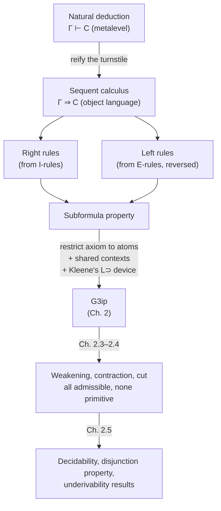

# Sequent Calculus Foundations

[[book-guidelines|↩ Back to guidelines]]

## The problem: natural deduction gives you no map

Natural deduction is easy to read forward — start from assumptions, apply
introduction and elimination rules, land on a conclusion. It is much harder
to *search* backward. Suppose you want to derive $A \supset ((A \supset B)
\supset B)$. The introduction rule for $\supset$ tells you: reduce the goal
to deriving $(A \supset B) \supset B$ under the assumption $A$. Apply $\supset
I$ again and you're deriving $B$ under assumptions $A$ and $A \supset B$. But
now what? There's no *elimination*-side rule that tells you, staring at the
goal $B$, which formula to eliminate next — modus ponens ($\supset E$) looks
forward from a premise you'd have to already possess, not backward from a
goal you're trying to produce. Negri and von Plato put it plainly: you have
to "mentally decompose the goal... but there is no formal way to keep track
of the process. It is as if we had to construct a derivation backwards" (p.
13).

That's the gap sequent calculus closes. It isn't a different logic — it's a
different *bookkeeping device* for exactly the same derivability relation
natural deduction already has, except now every step in the process is
written down explicitly enough that a machine (or a disciplined human) could
follow it mechanically, in either direction.

**What breaks without it:** without an explicit notation for "the set of
open assumptions this formula currently depends on," you're carrying that
bookkeeping in your head. That's fine for toy examples; it is precisely what
makes automated proof search, type inference, and elaboration require an
*explicit context* — which is exactly the technology sequent calculus
invents.

## Reifying the turnstile: from $\Gamma \vdash C$ to $\Gamma \Rightarrow C$

Natural deduction already has an informal derivability relation: "$C$ is
derivable from open assumptions $\Gamma$," written $\Gamma \vdash C$ with
$\vdash$ a *metalevel* symbol — a fact about the proof system, not a piece of
its syntax. Sequent calculus's founding move is to make that relation part
of the object language itself. Negri and von Plato write it with a distinct
symbol,

$$\Gamma \Rightarrow C,$$

called a **sequent**, with $\Gamma$ the **antecedent** (open assumptions)
and $C$ the **succedent** (the conclusion). This sounds like a merely
notational shift, but it's the whole trick: once $\Gamma \Rightarrow C$ is a
syntactic object rather than a claim *about* the system, you can write
*rules that manipulate it directly* — rules about sequents, not about
derivations of formulas with implicit side-bookkeeping.

The book's convention (following the tradition after Gentzen, who used
finite *sequences*) treats $\Gamma$ as a finite **multiset** — a list with
multiplicity but no order (p. 15). This matters immediately: if assumptions
were plain *sets*, you'd silently lose the ability to track how many times
an assumption is used, which is exactly the information the structural rules
below need to control.

> If a topic doesn't naturally fit Rust/Lean/Python, say so — this one fits
> Lean extremely well, so Lean is promoted to primary grounding here, per
> the workbench style rule for proof-theoretic material.

**Lean grounding.** This is the most direct correspondence in the whole
book. A sequent $\Gamma \Rightarrow C$ is exactly a Lean tactic-mode goal
state: a context of hypotheses and a target type.

```lean
-- Γ ⇒ C, spelled out as Lean sees it internally
example (A B : Prop) (h1 : A) (h2 : A → B) : B := by
  -- goal state here IS a sequent: {h1 : A, h2 : A → B} ⊢ B
  exact h2 h1
```

The antecedent is the local context; the succedent is the current goal.
Every tactic Lean runs is, structurally, an application of a sequent-calculus
rule to that goal state. Keep this correspondence in mind — it will pay off
directly in the closing [[Classical-Propositional-and-Predicate-Logic#Synthesis|synthesis]].

## Right rules from introduction, left rules from elimination

Natural deduction's rules are schematic: they mention only the *active*
formulas, leaving the surrounding open assumptions implicit. Written out
with contexts explicit (natural deduction "in sequent calculus style," as
the book calls it, §1.2), conjunction introduction becomes

$$\dfrac{\Gamma \Rightarrow A \qquad \Delta \Rightarrow B}{\Gamma, \Delta \Rightarrow A \& B}\ \&I$$

Sequent calculus keeps this shape for **right rules** — a comma simply
replaces the informal union of assumption sets:

$$
\dfrac{\Gamma \Rightarrow A \quad \Gamma \Rightarrow B}{\Gamma \Rightarrow A \& B}\ R\& \qquad
\dfrac{A, \Gamma \Rightarrow B}{\Gamma \Rightarrow A \supset B}\ R{\supset} \qquad
\dfrac{\Gamma \Rightarrow A}{\Gamma \Rightarrow A \lor B}\ R{\lor}_1 \qquad
\dfrac{\Gamma \Rightarrow B}{\Gamma \Rightarrow A \lor B}\ R{\lor}_2
$$

Read root-first, $R{\supset}$ literally says "reduce a goal of proving an
implication to proving its consequent, with the antecedent added to context"
— i.e., it's the formal version of the very decomposition step you were
doing by hand at the top of this article.

**Left rules are the genuinely new idea**, and they come from the
*elimination* rules — but transformed. In natural deduction, $\&E$ lets you
derive $C$ from $A \& B$ plus a derivation of $C$ from $A, B$ and other
assumptions. Sequent calculus turns this around: instead of a rule that
*removes* $A \& B$ from the right (an elimination), it's a rule that
introduces $A \& B$ on the *left* of the sequent (an antecedent-side
introduction):

$$\dfrac{A, B, \Gamma \Rightarrow C}{A \& B, \Gamma \Rightarrow C}\ L\&
\qquad
\dfrac{A, \Gamma \Rightarrow C \quad B, \Gamma \Rightarrow C}{A \lor B, \Gamma \Rightarrow C}\ L{\lor}
\qquad
\dfrac{\Gamma \Rightarrow A \quad B, \Gamma \Rightarrow C}{A \supset B, \Gamma \Rightarrow C}\ L{\supset}
$$

This is the conceptual pivot of the whole chapter: **every rule of sequent
calculus introduces something — either on the right (from an ND
introduction) or on the left (from an ND elimination) — nothing ever gets
eliminated.** That single design decision is what later makes the
*subformula property* provable by simple inspection.

The formula being introduced by a rule — $A \& B$ in $L\&$, $A \supset B$ in
$R{\supset}$ — is the **principal formula**. Its immediate constituents in
the premises ($A$ and $B$ above) are the **active formulas**. Everything
else, written $\Gamma$ (or $\Delta$), is unaffected **context**. This
three-way vocabulary — principal / active / context — is used relentlessly
for the rest of the book; get it fixed now.

**Subformula property.** Because every rule only ever *introduces* a
principal formula from its active-formula constituents, and never removes
anything, an immediate corollary falls out:

> Every formula occurring anywhere in a sequent-calculus derivation is a
> subformula of the derivation's endsequent (p. 17).

This is *the* structural fact that makes sequent calculus more than a
notational curiosity — it's what will make proof search terminating and
decidability provable in later chapters, because a derivation can never
"invent" a formula out of nowhere; everything traces back to pieces of what
you started with.

**What breaks without it:** if a rule were allowed to introduce a formula
that is *not* a subformula of anything already present (cut, discussed
below, is exactly this loophole), root-first proof search would have no
bound on what to try next — you could always guess a new lemma. The whole
book's research program is about how much of that freedom you can eliminate
while keeping the same derivable sequents.

## Independent vs. shared contexts: a design choice with consequences

Look again at $L{\lor}$ and $L{\supset}$ above — each has *two* premises,
each with its own context ($\Gamma$ in one, $\Delta$ in the other, joined
in the conclusion). This is called an **independent-context** formulation,
and it has an awkward property for root-first search: given the conclusion's
combined context, there's no principled way to know how to split it back
into $\Gamma$ and $\Delta$ for the two premises.

The book's fix (following Ketonen 1944) is to **not split the context at
all** — repeat it in full in both premises:

$$
\dfrac{A, \Gamma \Rightarrow C \quad B, \Gamma \Rightarrow C}{A \lor B, \Gamma \Rightarrow C}\ L{\lor}
\qquad
\dfrac{\Gamma \Rightarrow A \quad B, \Gamma \Rightarrow C}{A \supset B, \Gamma \Rightarrow C}\ L{\supset}
$$

This is motivated by a one-line soundness observation: "if assumptions
$\Gamma$ are permitted in the conclusion, it cannot do any harm to make the
same assumptions elsewhere in the derivation" (p. 15) — weakening more
context in never invalidates a derivation. With **shared contexts**, once
you decide *which* formula of the endsequent is principal, the premises are
*uniquely determined* — this is exactly what makes automatic root-first
proof search well-defined rather than a search over context partitions.

A worked derivation makes this concrete. To derive $\Rightarrow (A \supset
(A \supset B)) \supset (A \supset B)$, shared-context $L{\supset}$ lets both
branches carry the full context $A, A \supset B$ without ever having to
guess a split:

$$
\dfrac{
  \dfrac{}{A \Rightarrow A}
  \quad
  \dfrac{}{B, A \Rightarrow B}
}{
  \dfrac{A \supset B, A \Rightarrow B}{
    \dfrac{A \supset (A \supset B), A \Rightarrow B}{
      \Rightarrow (A \supset (A \supset B)) \supset (A \supset B)
    }
  }
}
$$

(collapsing intermediate $L{\supset}$/$R{\supset}$ steps for legibility; see
p. 16 for the full four-line derivation). Both instances of $L{\supset}$
reuse the *same* context $A$ — nothing had to be partitioned.

The proof-search process bottoms out at sequents where the antecedent and
succedent share a formula — this is the sequent-calculus counterpart of
natural deduction's rule of assumption, formalized as the **logical axiom**
$A \Rightarrow A$, and, dually, the zero-premise rule for falsum,

$$\bot, \Gamma \Rightarrow C \quad (L\bot)$$

which the book deliberately does *not* call an axiom, to keep the
terminology honest about its status as a left rule (p. 17).

## Weakening and contraction: what discharge looks like from outside

Natural deduction lets an introduction rule *discharge* zero, one, or many
occurrences of an assumption (**vacuous** or **multiple discharge**). Sequent
calculus has to represent this explicitly too, since contexts are now
syntax, not metatheory. Two structural rules do the job:

$$
\dfrac{\Gamma \Rightarrow C}{A, \Gamma \Rightarrow C}\ W
\qquad
\dfrac{A, A, \Gamma \Rightarrow C}{A, \Gamma \Rightarrow C}\ Ctr
$$

**Weakening** ($W$, "thinning") adds an unused assumption; it is the exact
formal shadow of a vacuous discharge — whenever a natural-deduction
derivation discharges nothing, the matching sequent-calculus derivation has
a formula that entered the antecedent only via $W$ (p. 17). **Contraction**
($Ctr$) collapses two identical occurrences of a formula into one; it
shadows multiple discharge, the case where one assumption gets used more
than once (p. 18). Note the ordering dependency the book flags explicitly:
*if* contexts were plain sets instead of multisets, contraction would be
invisible — built into set equality — and couldn't be studied as a distinct
rule at all. This is precisely why the multiset choice from the very start
of the section wasn't cosmetic.

**Cut** is the third and most consequential structural rule, corresponding
to natural deduction's *composition of derivations* — gluing $\Gamma \vdash
A$ and $A, \Delta \vdash C$ into $\Gamma, \Delta \vdash C$ by substitution:

$$\dfrac{\Gamma \Rightarrow A \quad A, \Delta \Rightarrow C}{\Gamma, \Delta \Rightarrow C}\ Cut$$

Operationally this is "prove a lemma, then use it" — decompose a hard goal
into intermediate steps. But notice what makes it structurally dangerous
compared to every rule seen so far: **the cut formula $A$ disappears**. It
need not be a subformula of the conclusion $\Gamma, \Delta \Rightarrow C$ at
all — it can be *anything*. Every other rule respects the subformula
property by construction; cut is the one loophole, and if you allowed
unrestricted backward search with cut, you could always try reducing
$\Gamma \Rightarrow C$ to $\Gamma \Rightarrow A$ and $A, \Gamma \Rightarrow
C$ for an arbitrarily-chosen new formula $A$, with no termination in sight
(p. 19).

The book also shows an equivalent phrasing of cut via $R{\supset}$: applying
$R{\supset}$ to the right premise's succedent gives $\Gamma \Rightarrow A
\quad \Delta \Rightarrow A \supset C$, over $\Gamma, \Delta \Rightarrow C$ —
literally a sequent-calculus reading of modus ponens (p. 19). This
foreshadows the deep connection developed in Chapter 8: cut in sequent
calculus and non-normal ("detour") instances of elimination rules in natural
deduction are the same phenomenon seen from two notations.

This is why the book draws a careful distinction between two different
achievements:

- **Closed under cut**: if a sequent is derivable *using* cut, it is also
  derivable *without* cut — usually shown indirectly, by proving the
  cut-free system already complete.
- **Cut elimination**: an actual, explicit *procedure* that transforms any
  derivation-with-cut into a cut-free derivation of the same sequent.

Cut elimination is the sequent-calculus analogue of natural deduction's
normalization — but, as the book flags, sequent calculi in general do *not*
enjoy the same strong properties natural deduction has for normal form
(termination in any reduction order, uniqueness of the normal form); those
properties have to be reestablished (or shown to fail) case by case (p. 19).

**What breaks without admissible cut:** derivations can be arbitrarily
larger than necessary — cut lets you factor a hard sequent through an
intermediate lemma, which is exactly what makes proofs human-sized. What
you gain by *eliminating* it (Chapter 2 onward) is the subformula property
back, and with it, decidability and terminating proof search — at the cost
of derivations that can blow up superexponentially in size. This tension —
compact proofs with cut vs. analytic, subformula-respecting proofs without
it — is the book's central research subject from here on.

Chapter 1 closes by previewing where this cuts both ways: Girard's example
shows that naively adding mathematical *axioms* as extra sequent premises
(e.g. $\Rightarrow A \supset B$ and $\Rightarrow A$ as given, deriving
$\Rightarrow B$ only via cut) seems to break cut elimination outright — no
cut-free derivation of $\Rightarrow B$ exists in that system. Chapter 6's
answer — recast axioms as suitably restricted *nonlogical rules* rather than
bare sequent premises — is out of scope here, but it's worth knowing the
tension exists from the outset: cut elimination is fragile, and keeping it
alive as a system grows is itself a nontrivial design problem.

## From the general idea to a concrete calculus: G3ip

Section 1.3 derives sequent calculus's *shape* from natural deduction.
Section 2.2 commits to a specific, fully worked-out system — **G3ip**, for
intuitionistic propositional logic — with the headline property that
*weakening, contraction, and cut are all admissible in it*: nothing is lost
by disallowing them as primitive rules, they can always be *derived* when
needed. This is a strictly stronger, more useful design than "assume the
structural rules, then prove you can eliminate cut" (Gentzen's original
1934–35 approach) — G3ip builds weakening directly into its axioms and
never needs contraction or cut as primitives at all.

$$
\textbf{G3ip}
$$

**Logical axiom** (atoms only):
$$P, \Gamma \Rightarrow P$$

**Logical rules:**
$$
\dfrac{A, B, \Gamma \Rightarrow C}{A \& B, \Gamma \Rightarrow C}\ L\&
\qquad
\dfrac{\Gamma \Rightarrow A \quad \Gamma \Rightarrow B}{\Gamma \Rightarrow A \& B}\ R\&
$$
$$
\dfrac{A, \Gamma \Rightarrow C \quad B, \Gamma \Rightarrow C}{A \lor B, \Gamma \Rightarrow C}\ L{\lor}
\qquad
\dfrac{\Gamma \Rightarrow A}{\Gamma \Rightarrow A \lor B}\ R{\lor}_1
\qquad
\dfrac{\Gamma \Rightarrow B}{\Gamma \Rightarrow A \lor B}\ R{\lor}_2
$$
$$
\dfrac{A \supset B, \Gamma \Rightarrow A \quad B, \Gamma \Rightarrow C}{A \supset B, \Gamma \Rightarrow C}\ L{\supset}
\qquad
\dfrac{A, \Gamma \Rightarrow B}{\Gamma \Rightarrow A \supset B}\ R{\supset}
$$
$$
\dfrac{}{\bot, \Gamma \Rightarrow C}\ L{\bot}
$$

Three things distinguish G3ip from the generic scheme derived in §1.3 (p.
29):

**1. The axiom is restricted to atoms.** $P, \Gamma \Rightarrow P$ holds
only for atomic $P$ — crucially, $\bot$ is *not* treated as an atom for this
purpose (it's a zero-place logical operation, handled instead by $L\bot$).
Why does this matter? If compound formulas were permitted as axioms, you
could short-circuit the entire left/right rule apparatus — $A \lor B
\Rightarrow A \lor B$ would just *be* an axiom instead of something derived
through $L{\lor}$, $R{\lor}_1$, and the logical axiom for atoms underneath.
That would silently break the subformula property's precision (it would
still technically hold, since $A \lor B$ is a subformula of itself, but it
would let axioms smuggle in arbitrary compound structure without going
through the rules that are supposed to explain *why* that structure is
provable) and, more importantly, it would break the *inductive* proofs of
weakening/contraction/cut admissibility later, which proceed by structural
induction on formulas and need the base case to be genuinely atomic. (This
is Key Question 1 the guidelines flag for this chapter, and it's exactly
this: restrict to atoms, or the induction doesn't close.)

**2. Contexts are shared, not independent**, exactly as motivated in §1.3 —
every two-premise rule repeats $\Gamma$ in full rather than splitting it.

**3. The left-implication rule repeats its own principal formula**: notice
$L{\supset}$'s *first* premise is $A \supset B, \Gamma \Rightarrow A$, not
the "obvious" $\Gamma \Rightarrow A$ you'd expect by analogy with the other
left rules. This is **Kleene's device** (Kleene 1952), and it is not
cosmetic. The book postpones the full justification to the admissibility
proof for contraction (§2.4, pp. 33–34), but the shape of the problem is
visible immediately: proving contraction admissible by induction on
derivation height requires, in the $A \supset B$ case, being able to *reuse*
the inductive hypothesis on a premise that still has less height than the
conclusion — and that's only available if $A \supset B$ is still sitting in
the first premise to be contracted away by the same argument used for the
second. Drop the repetition, and the rule becomes what the ordinary,
"obvious" $L{\supset}$ would be — invertible-looking but *not* actually
provable contraction-admissible by this induction. (The book demonstrates
separately, p. 34, that $L{\supset}$'s first premise is *not* invertible in
general — witness $\bot \supset \bot \Rightarrow \bot \supset \bot$ being
derivable while $\bot \supset \bot \Rightarrow \bot$ is not, since the
latter would make the whole system inconsistent by an application of cut.
Kleene's repetition is what keeps a non-invertible rule from silently losing
information needed later in the derivation.)

**What breaks without any one of these three choices**: drop the atomic
restriction and structural induction on formulas loses its base case; go
back to independent contexts and root-first search must guess a context
split at every two-premise rule; drop Kleene's repetition and the
contraction-admissibility proof (the calculus's headline property) doesn't
go through by height-preserving induction. G3ip is not an arbitrary
presentation — every one of its departures from the "generic" §1.3 scheme
is load-bearing for a specific theorem three sections later.

## Grounding: sequents as judgments, proof search as elaboration

The vocabulary here maps almost too cleanly onto elaborator/type-checker
design, which is exactly why this chapter is foundational for the reader's
own project.

**Lean (primary).** A sequent $\Gamma \Rightarrow C$ *is* a typing judgment
$\Gamma \vdash ? : C$ read propositionally (Curry–Howard is still two
chapters away in the book, but the correspondence is already visible in the
notation). Left rules are *elimination-shaped tactics* — `cases`,
`apply`-on-a-hypothesis — that consume a hypothesis and produce new,
strictly smaller subgoals; right rules are *introduction-shaped tactics* —
`constructor`, `intro` — that reduce the goal itself. Root-first sequent
proof search is precisely what a *backward*-chaining tactic engine does. And
**cut is exactly what `have` does**: `have h : A := proof_of_A; exact
rest_of_proof_using h` glues a proof of $A$ from context $\Gamma$ onto a
proof of $C$ from $\Gamma, A$ — cut's premises, verbatim. This is also why
cut is dangerous for automation the same way `have` is dangerous for
*proof-term search*: an automated prover has to *guess* the lemma statement
$A$, exactly as an elaborator has to guess a metavariable instantiation with
no local syntactic anchor. Kleene's device — repeating the principal
formula so a non-invertible rule doesn't lose information — is the same
concern that shows up in bidirectional elaboration whenever a checking-mode
rule has to retain enough of the original goal to backtrack into, rather
than committing to a premise that turns out to be underdetermined.

**Rust.** The natural encoding is a proof-search / tactic-engine shape:

```rust
#[derive(Clone)]
enum Formula {
    Atom(String),
    Bot,
    And(Box<Formula>, Box<Formula>),
    Or(Box<Formula>, Box<Formula>),
    Imp(Box<Formula>, Box<Formula>),
}

// Multiset context — order-insensitive, multiplicity matters
type Context = Vec<Formula>; // treat as multiset by construction/comparison

struct Sequent {
    antecedent: Context,
    succedent: Formula,
}

// Root-first search over G3ip: subformula property guarantees
// this recursion only ever inspects strictly smaller formulas,
// EXCEPT at a simulated cut, which is exactly the case the
// admissibility theorems (Ch. 2.4) exist to eliminate.
fn prove(seq: &Sequent) -> Option<Proof> {
    // 1. try the atomic logical axiom / L⊥
    // 2. try each applicable right rule (deterministic: driven
    //    by the shape of `seq.succedent`)
    // 3. try each applicable left rule (driven by the shape of
    //    some formula in `seq.antecedent`)
    // no `cut` case — a cut-free calculus needs none, and that's
    // the entire point of proving cut admissible rather than primitive
    todo!()
}
```

The comment matters as much as the code: because G3ip's admissibility
theorems let you treat cut as a *derived*, never-primitive operation, this
search procedure never has to guess an intermediate lemma. That's the
mechanical payoff of everything proved in §2.3–2.4, and it's precisely the
proof-search discipline a hand-rolled theorem-prover backend needs if it's
going to terminate.

**Python (illustrative only).** A five-line sketch of why the subformula
property gives termination for free:

```python
def weight(f):
    # matches Definition 2.3.1 exactly
    if f == "bot": return 0
    if is_atom(f): return 1
    return weight(f.left) + weight(f.right) + 1
```

Every left/right rule (cut aside) replaces a sequent by premises built from
*strict subformulas* of something already present — so `weight` strictly
decreases along any cut-free proof-search branch, which is the two-line
argument behind decidability of G3ip (Chapter 2's closing consequence, not
covered in depth here, but visible already in this weight function).

## Structural map



## Where this leads

Within the book, this topic is the hinge the rest of Part I turns on.
Chapter 2's admissibility proofs (§2.3–2.4) are the technical payoff of the
design choices made here — shared contexts, atomic axioms, Kleene's
repetition — each exists *because* it's needed for a specific
height-preserving induction later. Chapter 3 gets classical logic by
loosening the succedent from one formula to a multiset; Chapters 4–6 extend
the same admissibility machinery to quantifiers and then to mathematical
axioms recast as nonlogical rules (directly answering the Girard puzzle
flagged above); Chapter 8 closes the loop by proving a literal isomorphism
between cut-free sequent derivations and normal natural-deduction
derivations — the intuition sketched here (weakening = vacuous discharge,
contraction = multiple discharge, cut = non-normal elimination) turns into a
theorem.

For the standing compiler project, this chapter is close to maximally
load-bearing, for three concrete reasons:

- **The sequent $\Gamma \Rightarrow C$ is the direct ancestor of the typing
  judgment $\Gamma \vdash e : \tau$** your elaborator will manipulate.
  Principal/active/context vocabulary maps onto "the rule currently firing /
  its immediate subgoals / the rest of the context passed through
  unchanged" — precisely the bookkeeping a bidirectional type checker's
  inference and checking modes need to track explicitly.
- **Left rules vs. right rules *is* checking mode vs. inference mode.**
  Right rules are driven by the shape of the goal (synthesis); left rules
  are driven by the shape of a hypothesis (elimination/pattern-matching on
  context). A bidirectional elaborator that dispatches on "am I looking at
  the goal type or a hypothesis type" is running the same dispatch logic
  G3ip's root-first search runs.
- **Cut is the proof-theoretic name for what a trusted kernel's composition
  lemma, and an elaborator's `isDefEq`/unification engine, both have to
  discharge soundly.** The reason cut is proved *admissible* rather than
  assumed primitive is exactly the reason you'll want your own kernel's
  substitution/composition step to be a *derived*, checked consequence of
  smaller primitive rules rather than a trusted black box — that's the
  proof-theoretic definition of keeping your trusted computing base small.
  The subformula property, meanwhile, is the structural reason a cut-free
  proof is a good *proof certificate*: a checker only ever has to verify
  formulas that are already syntactically present, never guess an
  intermediate lemma the way a cut-based proof would force it to.
