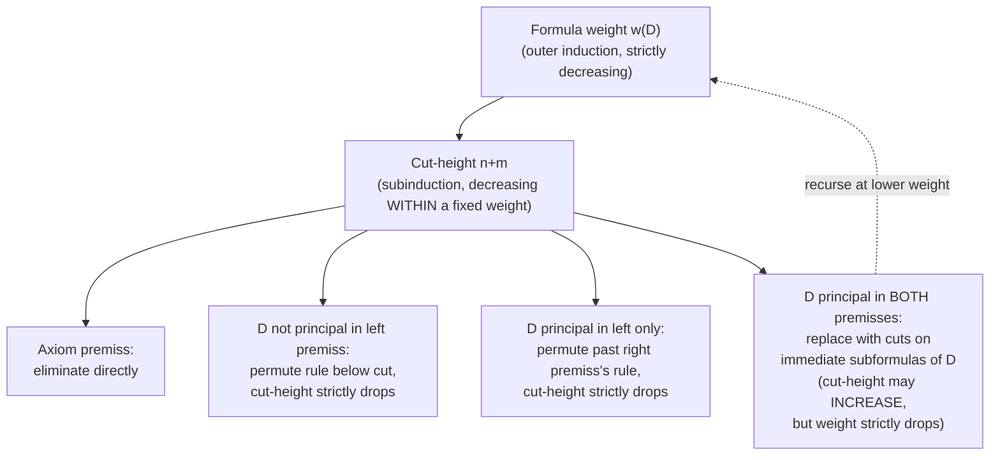
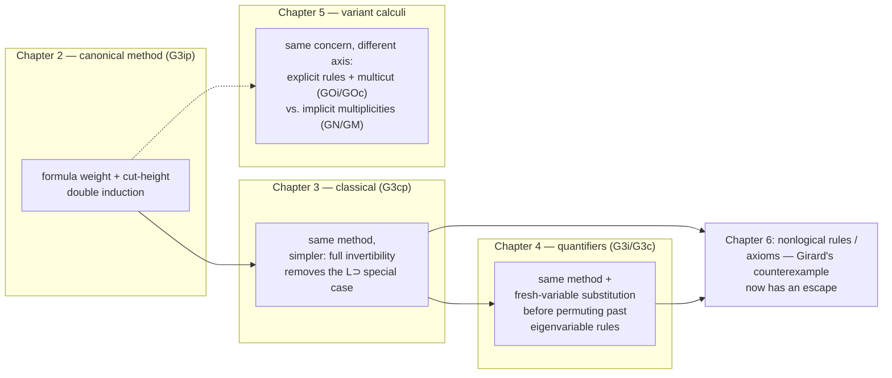

# Structural Rules and Cut Elimination

[[book-guidelines|↩ Back to guidelines]]

## The problem this solves

Say you have a sequent calculus — a system of rules for deriving judgments of the form $\Gamma \Rightarrow C$ ("from context $\Gamma$, conclude $C$"). If your only rules are the *logical* ones (introduce a connective on the left or right of $\Rightarrow$), you get something with a beautiful property almost for free: every formula appearing anywhere in a derivation is a subformula of what you started with. That's the **subformula property**, and it's the reason sequent calculus is a good target for proof search — you never have to guess a formula out of thin air; you only ever decompose what's already in front of you.

The trouble is that a bare logical calculus, on its own, is too weak to actually derive most true sequents unless you also allow yourself to *cut*: derive $D$ from $\Gamma$, derive $C$ from $D$ and $\Delta$, and glue them into a derivation of $C$ from $\Gamma, \Delta$ — without $D$ appearing anywhere in the final conclusion.

$$
\dfrac{\Gamma \Rightarrow D \qquad D, \Delta \Rightarrow C}{\Gamma, \Delta \Rightarrow C}\ \textsf{Cut}
$$

Cut is exactly function composition / lemma application: it's how you chain two proofs through an intermediate result you don't otherwise care about. It's indispensable for *writing* proofs efficiently — but the formula $D$ it introduces is not a subformula of anything in the conclusion. A calculus with cut as a primitive rule therefore has *no* subformula property, and root-first proof search over it doesn't terminate, because you'd have to guess $D$ from nowhere.

This is the tension the whole topic resolves: **you want cut for writing proofs, but you want a cut-free calculus for analyzing them.** Gentzen's 1934–35 answer — his *Hauptsatz*, "main theorem" — is that cut is eliminable: anything derivable with cut is derivable without it. Structural Proof Theory reframes this as **admissibility**: rather than literally rewriting a proof to remove cuts (which is what Gentzen did, and what makes the classical presentation of the Hauptsatz so intricate), you show that a calculus *without* cut, weakening, or contraction as primitive rules is already closed under them — anything you could derive by *adding* one of those rules, you could already derive without it. Book pp. 15–17 make the terminological point explicitly: a rule is **admissible** for a calculus if adding it to the calculus doesn't let you derive any new theorems (as opposed to *derivable*, which would mean it's a defined rule already provable from the others as a single step). Weakening, contraction, and cut are all proved admissible for the base calculus G3ip in Chapter 2, and the same method — with variations — is redone for classical logic (Ch. 3), first-order quantifiers (Ch. 4), and several structurally different calculi (Ch. 5). This article is about *that method*, traced across its four applications.

### What breaks without it — Girard's counterexample

Before diving into the machinery, it's worth seeing what fails when you try to skip this work. Negri and von Plato open with Girard's example (1987, p. 125) of two *axioms* added to a pure logical calculus: $\Rightarrow A \supset B$ and $\Rightarrow A$. Cut lets you derive $\Rightarrow B$ immediately:

$$
\dfrac{\overbrace{\Rightarrow A \supset B}^{\text{axiom}} \qquad \dfrac{A \Rightarrow A \qquad B \Rightarrow B}{A \supset B, A \Rightarrow B}\ L{\supset}}{\underbrace{A \Rightarrow B}_{\text{Cut}}}\ 
\qquad\text{then, with axiom } \Rightarrow A: \qquad
\dfrac{\overbrace{\Rightarrow A}^{\text{axiom}} \qquad A \Rightarrow B}{\Rightarrow B}\ \textsf{Cut}
$$

but there is *no* cut-free derivation of $\Rightarrow B$ — inspection of the rules shows nothing can produce it without going through the intermediate $A \supset B$. Girard's conclusion: "the Hauptsatz fails for systems with proper axioms." This is the "what breaks" anchor for the whole topic — naively adding non-logical content (axioms, in this case) to a sequent calculus can permanently destroy cut-eliminability, and with it every downstream consequence (subformula property, decidability, consistency). Chapter 6 of the book (out of scope here) shows how to add axioms *as rules* in a way that keeps cut admissible, but that repair is only possible *because* Chapters 2–5 first nail down precisely which structural features make cut admissible for pure logic in the first place. That's the payload of this topic: understand the machinery well enough to see exactly what a naive axiomatic extension would violate.

## The method, first application: G3ip (Ch. 2, pp. 30–40)

The calculus **G3ip** (intuitionistic propositional logic, book p. 28) is built specifically to make this proof go through. Three design choices matter:

1. **The logical axiom is restricted to atoms**: $P, \Gamma \Rightarrow P$, never $C, \Gamma \Rightarrow C$ for compound $C$. ($\bot$ is *not* an atom — it's a zero-place logical operation with its own rule $L\bot$: $\bot, \Gamma \Rightarrow C$.)
2. **All two-premiss rules share a context** $\Gamma$, rather than splitting it across premisses the way natural-deduction-derived sequent rules naturally would.
3. **$L{\supset}$ repeats its principal formula** in the left premiss — Kleene's device:

$$
\dfrac{A \supset B, \Gamma \Rightarrow A \qquad B, \Gamma \Rightarrow C}{A \supset B, \Gamma \Rightarrow C}\ L{\supset}
$$

Every one of these choices exists to make weakening, contraction, and cut *provably redundant* rather than primitive. Weakening is free because axioms already carry an arbitrary context $\Gamma$ (Lemma 2.3.3, proved by induction on $w(C)$, the **formula weight** — $w(\bot)=0$, $w(P)=1$, $w(A \circ B) = w(A)+w(B)+1$). The repeated principal formula in $L{\supset}$ exists purely to make *contraction* provable — you'll see exactly where below.

### Height-preserving weakening: the template for every later proof

**Theorem 2.3.4.** If $\Gamma \Rightarrow C$ has a derivation of height $\leq n$ (written $\vdash_n \Gamma \Rightarrow C$), then $D, \Gamma \Rightarrow C$ also has a derivation of height $\leq n$, for arbitrary $D$.

The proof is induction on derivation height, and it sets the pattern used everywhere after: handle the base case (axioms, $L\bot$) directly, then for the inductive step, peel off the last rule applied, apply the inductive hypothesis to its premiss(es) (now $D$ has been added to a *shorter* derivation), and reapply the same rule. The key word is **height-preserving**: the height doesn't just stay finite, it stays *exactly bounded by the same $n$* (or $n+1$ for the reapplied rule). This matters enormously later, because contraction and cut proofs need to invoke weakening (and each other) as subroutines *without* silently blowing up the height, which would break the induction they're embedded in.

### Invertibility: the second load-bearing lemma

**Lemma 2.3.5 (inversion).** If $A \& B, \Gamma \Rightarrow C$ is derivable with height $\leq n$, so are $A, B, \Gamma \Rightarrow C$ with height $\le n$; similarly $A \lor B, \Gamma \Rightarrow C$ height-preserving-implies both $A, \Gamma \Rightarrow C$ and $B, \Gamma \Rightarrow C$; and $A \supset B, \Gamma \Rightarrow C$ height-preserving-implies $B, \Gamma \Rightarrow C$.

A rule is **invertible** when its premisses are derivable whenever its conclusion is — i.e., you can always run it "backwards." Because G3ip's left rules for $\&$, $\lor$, and $\supset$'s conclusion side are invertible, you get an *inversion lemma for free by induction on height*, exactly mirroring the weakening proof's structure. This is what later powers height-preserving contraction: to contract a formula that's principal in the last rule, you first *invert* to strip the connective off both copies, contract the (now smaller) subformulas by the inductive hypothesis, then reapply the rule once.

But notice the asymmetry the book flags explicitly: $L{\supset}$'s **first premiss is not invertible**. The witness is $\bot \supset \bot \Rightarrow \bot \supset \bot$ (an axiom instance, trivially derivable) versus its would-be first premiss $\bot \supset \bot \Rightarrow \bot$, which is *not* derivable — deriving it would let you cut down to $\Rightarrow \bot$, making G3ip inconsistent. This is exactly why $L{\supset}$'s principal formula has to be repeated in that premiss (design choice 3 above): since you can't invert your way back to it, contraction on it has to be handled by a different route than "invert, contract, reapply" — see below.

### Height-preserving contraction

**Theorem 2.4.1.** If $D, D, \Gamma \Rightarrow C$ is height-$n$-derivable, so is $D, \Gamma \Rightarrow C$.

Non-principal case: same shape as weakening — push the inductive hypothesis under the last rule. Principal case splits on the shape of $D$:

- $D = A \& B$: invert twice (Lemma 2.3.5) to get $A, B, A, B, \Gamma \Rightarrow C$, contract $A$ and $B$ each by the inductive hypothesis (now on *shorter* derivations, since inversion preserves height), reapply $L\&$.
- $D = A \lor B$: invert the two $L\lor$ premisses, contract each disjunct, reapply $L\lor$.
- $D = A \supset B$: here's where the repeated-principal-formula device earns its keep. The last step was
  $$\dfrac{A\supset B, A \supset B, \Gamma \Rightarrow A \qquad B, A \supset B, \Gamma \Rightarrow C}{A \supset B, A \supset B, \Gamma \Rightarrow C}\ L{\supset}$$
  The *first* premiss already has two copies of $A \supset B$ — contract it directly by the inductive hypothesis (no inversion needed, since it's not the non-invertible occurrence that's the problem; the repeated copy just needs contracting away). The *second* premiss needs Lemma 2.3.5(iii) first to invert away one occurrence of $A\supset B$ into a duplicated $B$, contract that, then reapply $L{\supset}$.

The book flags something worth internalizing: proving contraction admissible *without* preserving height is actually *harder* — it needs a double induction on formula weight with a subinduction on height, exactly the shape you'll meet again for cut. Height-preservation isn't a bonus feature; it's what keeps the induction structurally simple.

### Cut admissibility: cut-height induction, the technique itself

This is the deepest part of the chapter (Theorem 2.4.3), and the part worth understanding at the mechanism level rather than the case-enumeration level.

**Definition (cut-height).** For an instance of cut with premisses $\Gamma \Rightarrow D$ (height $n$) and $D, \Delta \Rightarrow C$ (height $m$), the cut-height is $n + m$.

The proof is by **induction on the weight $w(D)$ of the cut formula, with a subinduction on cut-height**. Why this specific double structure, and not induction on cut-height alone, or on formula weight alone? Because — and this is the sharp, non-obvious point the book calls out — **cut-height is not monotone going down a derivation**. A cut lower in the derivation can have *smaller* cut-height than one above it, because one of its two premisses might come from a short branch even though the other descends from a tall one containing another cut. So you cannot simply say "keep reducing cut-height until it hits zero" as a global argument; the *permutation* step that pushes a cut upward past a non-principal rule can, in isolated cases (case 5 below), actually *increase* cut-height. What it can never do is increase the *weight* of the cut formula. That's why weight is the outer induction and cut-height only needs to behave well *within* a fixed weight — the outer measure is what guarantees termination overall.

The proof structure, case by case:

**Axiom cases.** If either premiss is an axiom or a conclusion of $L\bot$, the cut is eliminated directly by inspection — e.g. if $\Gamma \Rightarrow D$ is an axiom $P, \Gamma' \Rightarrow P$ with cut formula $D = P \in \Gamma$, the conclusion $\Gamma, \Delta \Rightarrow C$ follows from the right premiss $D, \Delta \Rightarrow C$ by weakening alone — no induction needed.

**Case 3 — cut formula not principal in the left premiss.** The left premiss's last rule (say $L\&$) is *permuted below* the cut:

$$
\dfrac{A, B, \Gamma' \Rightarrow D \qquad D, \Delta \Rightarrow C}{A\&B, \Gamma', \Delta \Rightarrow C}\ \textsf{Cut+}L\&\text{ (after)}
\qquad\Longleftarrow\qquad
\dfrac{\dfrac{A, B, \Gamma' \Rightarrow D \qquad D, \Delta \Rightarrow C}{A, B, \Gamma', \Delta \Rightarrow C}\ \textsf{Cut} }{A\&B, \Gamma', \Delta \Rightarrow C}\ L\&
$$

Cut-height strictly drops (the left premiss's derivation got shorter by exactly the one rule application you permuted past). Case $L\lor$ is similar but the branching *duplicates* the cut into two smaller-cut-height cuts — this is where "the number of cuts increases exponentially" in general (an explicit remark in the book, p. 39), even though each individual cut shrinks.

**Case 4 — cut formula principal in the left premiss only.** Symmetric to case 3, but now permuting past the rule that derived the *right* premiss $D, \Delta \Rightarrow C$. Same effect: cut-height strictly drops, sometimes with duplication.

**Case 5 — cut formula principal in *both* premisses.** This is the interesting case, because it's where you actually use that $D$ got *smaller*, not just that a derivation got shorter. E.g. for $D = A \supset B$:

$$
\dfrac{A, \Gamma \Rightarrow B}{\Gamma \Rightarrow A \supset B}\ R{\supset} \qquad \dfrac{A \supset B, \Delta \Rightarrow A \qquad B, \Delta \Rightarrow C}{A \supset B, \Delta \Rightarrow C}\ L{\supset}
$$

is transformed by cutting the *immediate premisses* against each other — a cut on $A \supset B$ itself (against the $L{\supset}$ left premiss) plus a cut on $B$ (a strictly lighter formula than $A \supset B$) against the derivation of $A, \Gamma \Rightarrow B$. The book notes explicitly (§2.4, case 5.1) that in this step cut-height can *increase* — but formula weight has gone down, which is exactly why the outer induction has to be on weight, with cut-height only doing work within a fixed weight level.

Finally, cut with a **shared context** — $\Gamma \Rightarrow D$ and $D, \Gamma \Rightarrow C$ concluding $\Gamma \Rightarrow C$ (rather than $\Gamma, \Delta \Rightarrow C$) — is recovered as a corollary: apply ordinary cut to get $\Gamma, \Gamma \Rightarrow C$, then apply the already-proved admissibility of contraction to collapse the duplicated $\Gamma$. This is a nice illustration of the whole apparatus being genuinely compositional: cut and contraction, each independently proved admissible, combine to give you a third admissible rule you didn't have to prove separately.

### Consequences (why any of this was worth proving)

Once cut is admissible, the calculus's rules are the *only* way formulas can appear in a derivation — nothing was ever smuggled in via cut. That directly gives the **subformula property** (Theorem 2.5.1), and from it: syntactic consistency ($\not\Rightarrow \bot$, since no rule can conclude an empty-antecedent sequent with $\bot$), the **disjunction property** ($\Rightarrow A \lor B$ derivable implies $\Rightarrow A$ or $\Rightarrow B$ derivable — only $R\lor$ can conclude an empty-antecedent sequent), and its strengthening to **Harrop-formula** hypotheses. These aren't incidental; they're the whole reason the labor above is worth doing. A calculus where you can't trust that every formula in a proof is a subformula of the goal is a calculus where automated proof search has nowhere principled to start.

## Second application: G3cp, classical logic (Ch. 3 §3.2, pp. 53–57)

**G3cp** moves to multisets on *both* sides of the sequent, $\Gamma \Rightarrow \Delta$, read as "the conjunction of $\Gamma$ implies the disjunction of $\Delta$" — Gentzen's operational reading: open assumptions and open cases. This single change (unrestricted succedent) is what makes the logic classical; restrict the succedent back to at most one formula and you're back to intuitionistic logic (a fact worth sitting with — classicality here is not a separate axiom bolted on, it's a *structural* liberty in how many conclusions a sequent is allowed to carry).

**What stays exactly the same:** the proof shapes for height-preserving weakening, contraction, and the cut-height/weight double induction for cut are essentially copy-pasted from Chapter 2, case-by-case, with two symmetric versions of weakening and contraction (left and right) instead of one.

**What changes, and why it's actually *simpler* here:** because G3cp's succedent can hold multiple formulas, *every* logical rule is invertible — including $R{\supset}$, which was G3ip's problem child. There's no analogue of the "$L{\supset}$'s first premiss isn't invertible" wrinkle from Chapter 2, so no Kleene-style repeated-principal-formula device is needed anywhere. Compare the $R{\supset}$ pair now available:

$$
\dfrac{A, \Gamma \Rightarrow \Delta, B}{\Gamma \Rightarrow \Delta, A \supset B}\ R{\supset}
$$

is fully invertible in both directions because the multiset succedent lets $B$ sit alongside $\Delta$ without loss. Full invertibility everywhere means the contraction and cut proofs never need a special-cased detour like G3ip's $L{\supset}$ contraction did — every principal-formula case reduces uniformly via inversion. The book's own framing (§3.2) is explicit that this section is "close" to Ch. 2's proofs, "brief since the pattern is now familiar" — which is itself informative: once you've internalized *why* the double induction is shaped the way it is, re-deriving it for a new calculus is mechanical, not a fresh insight each time.

One more thing genuinely worth flagging: the book notes (§3.1(b), following Gentzen 1938) that once negation is derived rather than primitive ($\lnot A := A \supset \bot$), the awkward asymmetric negation rules of Gentzen's original LK become perfectly symmetric — "an annoying exception... removed, in a way approaching magic," in Gentzen's own words. This is a small but telling illustration of how much design work goes into choosing *which* connectives are primitive before you even start proving admissibility.

## Third application: quantifiers (Ch. 4 §4.2, pp. 70–76) — the genuinely new wrinkle

Extending G3i/G3c with $\forall$ and $\exists$ reuses the entire propositional machinery — weight is extended by $w(\forall x A) = w(\exists x A) = w(A) + 1$, and the height-preserving-weakening / inversion / contraction / cut proofs all proceed by the same case analysis, plus new cases for the quantifier rules:

$$
\dfrac{A(y/x), \Gamma \Rightarrow C}{\forall x A, \Gamma \Rightarrow C}\ L\forall \; (\text{no restriction on } y)
\qquad
\dfrac{\Gamma \Rightarrow A(y/x)}{\Gamma \Rightarrow \forall x A}\ R\forall \; (y \text{ fresh, not free in }\Gamma, \forall x A)
$$

and dually for $\exists$ with the restriction on $L\exists$'s $y$. The **variable restriction** — $y$, the eigenvariable, must not occur free in the conclusion — is what encodes "for an arbitrary/fresh $x$," and it's exactly this restriction that breaks the propositional-case proof pattern when a cut needs to permute past $R\forall$ or $L\exists$.

Concretely (Theorem 4.2.5, case 3.5): suppose the cut formula $D$ is *not* principal in the left premiss, and that premiss's last rule was $L\exists$ with eigenvariable $y$:

$$
\dfrac{\dfrac{A(y/x), \Gamma' \Rightarrow D}{\exists x A, \Gamma' \Rightarrow D} \; L\exists \qquad D, \Delta \Rightarrow C}{\exists x A, \Gamma', \Delta \Rightarrow C}\ \textsf{Cut}
$$

You *want* to permute this into cutting $A(y/x), \Gamma' \Rightarrow D$ against $D, \Delta \Rightarrow C$ first, then reapplying $L\exists$ below. But there's a real hazard: $\Delta$ (dragged in from the right premiss of cut) might contain a free occurrence of $y$ — and $y$ was only fresh *relative to $\exists x A, \Gamma', D$*, never checked against $\Delta$. If $y$ shows up free in $\Delta$, the naive permutation would produce a conclusion $\exists x A, \Gamma', \Delta \Rightarrow C$ where reapplying $L\exists$ violates its own variable restriction. The fix: **substitute a fresh variable $z$ for $y$ first** (using the height-preserving substitution lemma proved earlier in §4.1/4.2, itself an extension of the earlier "renaming a bound variable preserves height" fact), *then* do the cut permutation:

$$
\dfrac{A(z/x), \Gamma' \Rightarrow D \qquad D, \Delta \Rightarrow C}{A(z/x), \Gamma', \Delta \Rightarrow C}\ \textsf{Cut}
\quad\rightsquigarrow\quad
\dfrac{A(z/x), \Gamma', \Delta \Rightarrow C}{\exists x A, \Gamma', \Delta \Rightarrow C}\ L\exists
$$

with $z$ chosen fresh for the *whole* new context including $\Delta$. This one lemma — height-preserving $\alpha$-conversion feeding a substitution before permutation — is the entire novel content Chapter 4 adds to the method; everything else is bookkeeping the propositional cases already established. It's a small addition but a load-bearing one: skip it, and cut elimination for first-order logic simply doesn't go through, because eigenvariable freshness is a *global* side-condition on the whole surrounding derivation, not a local property of the rule instance being permuted.

## Fourth, brief touch: structural rules as a design axis (Ch. 5 §§5.1–5.2, pp. 87–100)

Chapters 2–4 all use *shared*, *implicit*-multiplicity contexts (design choice 2 above) specifically to avoid needing contraction as a primitive rule. Chapter 5 steps back and asks: what if you don't make that choice? Two contrasting answers:

- **GOi/GOc** (§5.1) go back to Gentzen's original style: **independent contexts** in two-premiss rules, with weakening and contraction reinstated as *explicit primitive rules*. This reopens a genuine complication Gentzen had to face directly in 1934–35: if the right premiss of a cut was itself derived by contraction, permuting cut upward past it doesn't obviously reduce anything, because the contracted formula can reappear duplicated. Gentzen's own fix was the **multicut** rule (eliminating $m$ copies of a cut formula from a many-times-contracted premiss in a single step, rather than one at a time). Negri and von Plato instead give a proof of cut elimination *without* multicut, via a more global case analysis on how the contraction premiss itself was derived — worth knowing as a name (multicut, sometimes called Gentzen's *mix* rule) even if you don't need its details: it's the standard textbook route (e.g. Takeuti), and this book's route is a genuine alternative worth recognizing as such.
- **GN/GM** (§5.2) go the opposite direction: **no explicit structural rules at all**. Instead, every active formula carries a multiplicity exponent $A^m$ — $m = 0$ encodes weakening (the formula is vacuously present), $m > 1$ encodes contraction (used multiply), directly inside the logical rule instance:
  $$\dfrac{A^m, B^n, \Gamma \Rightarrow C}{A \& B, \Gamma \Rightarrow C}\ L\&$$
  Because weakening/contraction are baked into the rule rather than free-standing, cut elimination here only has to target **hereditarily principal cuts** (cuts where the cut formula is principal in the right premiss, or becomes so after permuting up) — everything else is *already* guaranteed to satisfy the subformula property without any transformation, since there's no "invisible" structural step where a formula could sneak in or out unaccounted for.

The point of including this, briefly: **weakening/contraction-as-explicit-rules vs. weakening/contraction-as-implicit-multiplicity is a genuine design axis**, not a cosmetic notational choice, and it changes *which* proof of cut admissibility you need (multicut-flavored global case analysis vs. targeting only hereditarily-principal cuts). The G3-style calculi of Chapters 2–4 sit at one clean end of that axis (shared context, no explicit structural rules, but *not* using multiplicity exponents either — because the axiom/inversion trick already suffices for propositional and first-order logic specifically). GN/GM push the same idea further, and GOi/GOc pull back toward Gentzen's original, more general but more work-laden, formulation.

## Synthesis: where this leads, and why it's load-bearing for a checker

Structurally, this topic is the hinge of the whole book. Everything in Chapter 2 §2.5 onward — the subformula property, decidability via bounded proof search, underivability results via loop-detecting search, the completeness proofs of Chapter 3, [[Quantifiers-and-First-Order-Proof-Theory#The midsequent theorem|the midsequent theorem]] and Herbrand disjunction of Chapter 4, and *especially* Chapter 6's extension to axiomatic mathematical theories — is a **downstream consequence of cut being admissible**, not an independent development. Girard's counterexample from Chapter 1 is exactly the failure mode you'd hit if you tried to skip straight to "add axioms and hope for the best": Chapter 6's whole design (nonlogical rules restricted so their principal formulas are atoms, plus a closure condition) exists to keep the Chapter 2 cut-elimination *argument itself* still going through once axioms are added — you can't understand why Chapter 6's restrictions are shaped the way they are without first understanding precisely which step of the cut-height induction they're protecting.

For the compiler/elaborator project this workbench is built around, this is worth being very explicit about: **cut elimination is the proof-theoretic ancestor of proof normalization and proof-term checking in a trusted kernel.** A few concrete transfers:

- **Trusted kernel, small checker.** The entire point of proving cut *admissible rather than primitive* is that you get to keep a small, easily-trusted core calculus (no cut rule to implement or trust) while still being able to *use* cut freely when actually constructing proofs — the elimination procedure is a normalization pass you run once, off the hot path of the trusted kernel. This is precisely the shape of `isDefEq`/kernel-checking in Lean: the elaborator does the (expensive, heuristic, cut-like) work of composing lemmas and unifying metavariables, but the kernel that finally checks the result only needs to trust a much smaller, subformula-property-respecting core. A Rust verifier's trusted computing base should be scoped the same way — keep it to the primitive judgment rules, and treat anything cut-shaped (calling a previously-proved lemma) as something *elaboration* discharges before the kernel ever sees it.
- **Height-preserving induction as an implementation discipline.** The insistence on *height-preserving* weakening/contraction/inversion, not just "eventually admissible," is directly the difference between an admissibility proof that terminates cleanly by structural recursion on a derivation and one that needs an unbounded search. If you're implementing proof normalization or substitution in Rust, the height-preserving lemmas are your guarantee that a transformation pass is a single well-founded recursive traversal, not a fixpoint loop of unknown depth — the same property you want from, say, a substitution or contraction pass in a bidirectional type checker's context management.
- **Cut-height + weight double induction as a termination-measure pattern.** This is a directly reusable technique: whenever you're implementing a rewrite/normalization procedure whose "obvious" measure isn't monotone under the rewrite (exactly cut-height's failure here), look for a coarser measure (formula weight, here) that *is* monotone, and use the well-behaved-but-not-always-decreasing measure only as a subinduction bounded within one value of the outer measure. This shows up again anywhere you eliminate redexes/lemmas by a permutation-based rewrite system — including detour/permutation conversions in natural deduction (Ch. 1, Ch. 8) and, later in your own project, potentially in a CEGAR-style refinement loop where a coarse measure (abstraction precision) has to strictly decrease while a finer one (proof search within one precision level) can wobble.
- **The eigenvariable-freshening lemma is literally the substitution-under-binder discipline** your elaborator's unifier and Pi-type substitution machinery need — "rename to a variable fresh for the *entire ambient context*, not just the rule instance" is the same discipline that keeps capture-avoiding substitution correct when unifying under a $\Pi$-binder or discharging a Miller-pattern metavariable whose scope is a prefix of bound variables.
- **Where Chapter 6 is headed.** The nonlogical-rule restriction to atomic principal formulas (previewed by the Girard counterexample here) is the direct proof-theoretic analogue of restricting Horn clauses / CHCs to atoms in the head when you want a solver's derivation procedure to stay complete and terminating — worth watching for when this book's Chapter 6 material comes up.

