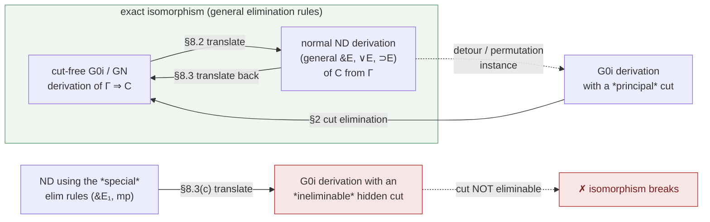
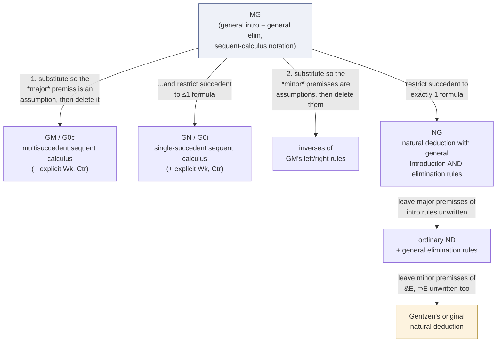

# The Sequent Calculus–Natural Deduction Isomorphism

[[book-guidelines|↩ Back to guidelines]]

## Two proof formats, one question: are they *the same system*?

Natural deduction and sequent calculus both formalize "what counts as a valid proof of $C$ from assumptions $\Gamma$," but they look nothing alike on the page. Natural deduction builds a proof as a tree of introductions and eliminations, hypotheses opened and later discharged wherever convenient in the tree. Sequent calculus builds a proof as a tree of sequents $\Gamma \Rightarrow C$, growing strictly root-first, every rule instance fully local — you never have to scan back up the tree to see whether some assumption got closed off three levels up.

If you're building a verifier, this difference is not cosmetic. It's the difference between two entirely different trusted computing bases. A term-mode elaborator (Lean's, or the one this vault's learning goals are aimed at) naturally produces natural-deduction-shaped proof objects — applications, pattern matches, lambda-abstractions. A resolution engine, an SMT solver, or a tableau-based prover naturally produces sequent-calculus-shaped (or even more general, clause-based) certificates. If the two formats are *isomorphic* — if there is a translation back and forth that is total, structure-preserving, and exact — then a checker for one is, modulo that translation, a checker for the other. If they are merely *related* — sometimes translatable, sometimes not — then accepting a proof from the "other side" means doing real, possibly unbounded, extra work to make it acceptable to your trusted kernel. Chapter 8 is where Negri and von Plato settle, precisely, which of these two situations actually holds — and the answer turns out to hinge entirely on one design decision from Chapter 1: whether natural deduction uses the *general* elimination rules or the *ordinary, special* ones. (For the general elimination rules themselves, the inversion principle that motivates them, and the *direct*, translation-free proof of normalization via threads, see [[Natural-Deduction-and-the-Inversion-Principle]] — this article picks up where that one leaves off, with the explicit translation machinery of §§8.1–8.4 and the book's own final [[Classical-Propositional-and-Predicate-Logic#Synthesis|synthesis]] in the Conclusion.)

## §8.1 — Making natural deduction's derivability relation *formal*

The first obstacle to even stating an isomorphism theorem is that "the natural deduction proof of $C$ from $\Gamma$" is usually a sloppy, metamathematical notion: $\Gamma$ is treated as a *set* of formulas that happen to occur somewhere in the tree as undischarged leaves, and nobody worries about *how many times* a given assumption occurs or *which* rule instance discharged *which* occurrence. That looseness is exactly what a naive translation from sequent calculus — where the antecedent is a precise multiset, and weakening/contraction are explicit rules that add or delete copies — cannot reproduce faithfully. So §8.1 does something the book flags as new and necessary: it makes natural deduction's own derivability relation *formal*, multiset-based, and discharge-labeled, before any translation is attempted.

**Discharge labels vs. assumption labels, made unique.** Every rule instance that can close off hypotheses (the general $\&E$, $\vee E$, $\supset E$, $\supset I$) writes a *discharge label* next to the inference line and the matching *assumption label* on the bracketed hypotheses it closes. The book states this as a hard global constraint:

> **Principle 8.1.1 (Unique discharge of assumptions).** No two instances of rules in a derivation can have a common discharge label.

This is the natural-deduction analogue of never reusing a de Bruijn index across two unrelated binders in an elaborator's internal representation — get it wrong and you can build derivations that look syntactically fine on paper but silently conflate two different hypothesis occurrences (exactly the bug the sibling article flags for the naive one-line derivation of $A \supset A$).

**Derivability as a relation on multisets.** Definition 8.1.2 then gives twelve inductive clauses defining "$A$ is derivable from open assumptions $\Gamma$" as a genuine formal relation, $\Gamma$ a multiset. The clauses relevant here (writing the general elimination rules with explicit multiplicities $m, n \ge 0$, exactly as the book does):

$$
\dfrac{\Gamma \vdash B}{\Gamma\setminus A^m \vdash A\supset B}\;{\supset}I
\qquad
\dfrac{\Gamma \vdash A\&B \quad \Delta \cup A^m \cup B^n \vdash C}{\Gamma,\Delta\setminus(A^m,B^n) \vdash C}\;\&E
$$

$$
\dfrac{\Gamma \vdash A\vee B \quad \Delta \cup A^m \vdash C \quad \Theta \cup B^n \vdash C}{\Gamma,\Delta,\Theta\setminus(A^m,B^n) \vdash C}\;\vee E
\qquad
\dfrac{\Gamma \vdash A\supset B \quad \Delta \vdash A \quad \Theta \cup B^n \vdash C}{\Gamma,\Delta,\Theta\setminus B^n \vdash C}\;{\supset}E
$$

with the two defining clauses:

- **Vacuous discharge:** $m = 0$ (or $n=0$) — the rule closes off zero occurrences of the labeled hypothesis.
- **Multiple discharge:** $m > 1$ (or $n>1$) — the rule closes off more than one occurrence at once.

These are not corner cases to special-case away — they are exactly the phenomena that, a few pages later, turn out to *be* weakening and contraction.

**Composition of derivations (closure under substitution).** The other load-bearing result of §8.1 is:

> **Theorem 8.1.4 (Composition of derivations).** If $\Gamma \vdash A$ and $A,\Delta \vdash C$ are derivations with disjoint discharge labels and no variable clashes, then there is a derivation of $C$ from $\Gamma,\Delta$.

Stated as a rule, in the natural deduction sequent-calculus-style notation of §1.2:

$$
\dfrac{\Gamma \vdash A \quad A,\Delta \vdash C}{\Gamma,\Delta \vdash C}\;\mathrm{Subst}
$$

This looks like cut, and it is proved by an entirely analogous induction (permute $\mathrm{Subst}$ up through the derivation of $C$ until the right premiss is an assumption), but the book is emphatic that it is *not* cut in the sequent-calculus sense: $\mathrm{Subst}$ just certifies that pasting two derivation trees together at a shared formula produces a syntactically well-formed derivation tree again — nothing more. It has to be proved at all only because natural deduction's contexts are *non-local*: an assumption discharged deep inside a subtree can be referenced by a rule instance anywhere below it, so naively splicing two trees together is not obviously still a legal derivation the way splicing two sequent-calculus derivations (with their strictly local, root-first rules) obviously is. Crucially, this composition property needs the contexts $\Gamma, \Delta, \ldots$ to be genuinely arbitrary and independent — the book notes explicitly that with *shared* contexts, as in the G3-style calculi of earlier chapters, Theorem 8.1.4 would simply fail. This is the first hint of a running theme: shared-context calculi are convenient for root-first proof search but resist a clean correspondence with natural deduction; independent-context calculi (G0i here) are what make the translation work.

### Grounding: multiset contexts as a de-Bruijn-indexed proof term

Implementing Definition 8.1.2's formal derivability relation is exactly what a Rust proof-term kernel has to do if it wants derivations, not just formulas, as first-class values:

```rust
// A natural-deduction derivation as a genuinely formal object: every
// discharge is a concrete, uniquely-labeled binder over a subtree,
// and Γ is tracked as a real multiset (here, a Vec used multiset-style).
#[derive(Clone)]
enum Deriv {
    Assump(Formula),                                   // clause 1
    AndIntro(Box<Deriv>, Box<Deriv>),                   // clause 2
    OrIntroL(Box<Deriv>, Formula), OrIntroR(Box<Deriv>, Formula), // clause 3
    ImpIntro { label: usize, body: Box<Deriv> },        // clause 4, DI
    AndElim  { label1: usize, label2: usize,            // clause 7, general &E
               major: Box<Deriv>, minor: Box<Deriv> },
    OrElim   { label1: usize, label2: usize,            // clause 8, general vE
               major: Box<Deriv>, left: Box<Deriv>, right: Box<Deriv> },
    ImpElim  { label: usize,                            // clause 9, general DE
               major: Box<Deriv>, arg: Box<Deriv>, minor: Box<Deriv> },
}

// Theorem 8.1.4: pasting derivations, verified as an actual operation
// on trees rather than assumed — this is what a kernel's `subst`
// primitive has to implement and prove sound before anything built on
// top of it (e.g. elaboration output) can be trusted.
fn compose(of_a: Deriv, rest: Deriv, fresh_labels: &mut LabelSource) -> Deriv {
    // recurse on `rest`, splicing `of_a` in wherever the assumption `A`
    // occurs as a leaf, renaming labels from `fresh_labels` to keep
    // Principle 8.1.1 (unique discharge) intact.
    todo!()
}
```

In Lean terms, `compose`/`Subst` is precisely what happens when the elaborator's term-building monad splices a solved subgoal's proof term into the hole left for it — the kernel doesn't distinguish "a proof assembled all at once" from "a proof assembled by repeated substitution," which is exactly what Theorem 8.1.4 is licensing.

## §8.2 — From cut-free sequent calculus to natural deduction: weakening *is* vacuous discharge

With a formal derivability relation in hand, §8.2 defines an actual translation, root-first, from cut-free derivations in $\mathrm{G0i}$ (the independent-context calculus of Chapter 5, with explicit weakening and contraction) into natural deduction with general elimination rules. Two design choices make this land exactly, rather than approximately:

**1. Only translate derivations with no *unused* weakening or contraction.** Definition 8.2.1 calls a formula **used** if it is active in the antecedent of a subsequent logical rule. If a weakened-in formula never gets used by anything above it, there is *nothing in natural deduction* for it to correspond to — an assumption that's never referenced isn't discharged by any rule instance, vacuously or otherwise, it's just absent. (Delete unused weakenings/contractions first and you get a *multiset reduct* of the original context, in the terminology of Chapter 5 — translate that instead.)

**2. Translate root-first, rule by rule, turning "used" into "discharged."** The translation table (schematically):

$$
\dfrac{A,B,\Gamma\Rightarrow C}{A\&B,\Gamma\Rightarrow C}\;L\&
\;\leadsto\;
\dfrac{A\&B \quad [A],[B],\Gamma\Rightarrow C}{C}\;\&E
\qquad\qquad
\dfrac{\Gamma\Rightarrow A \quad \Delta\Rightarrow B}{\Gamma,\Delta \Rightarrow A\&B}\;R\&
\;\leadsto\;
\dfrac{\Gamma\Rightarrow A\quad \Delta\Rightarrow B}{A\&B}\;\&I
$$

$$
\dfrac{A,\Gamma\Rightarrow C \quad B,\Delta\Rightarrow C}{A\vee B,\Gamma,\Delta\Rightarrow C}\;L\vee
\;\leadsto\;
\dfrac{A\vee B \quad [A],\Gamma\Rightarrow C \quad [B],\Delta\Rightarrow C}{C}\;\vee E
\qquad\qquad
\dfrac{\Gamma\Rightarrow A \quad B,\Delta\Rightarrow C}{A\supset B,\Gamma,\Delta\Rightarrow C}\;L{\supset}
\;\leadsto\;
\dfrac{A\supset B \quad \Gamma\Rightarrow A \quad [B],\Delta\Rightarrow C}{C}\;{\supset}E
$$

and, critically, the two structural rules:

$$
\dfrac{\Gamma\Rightarrow C}{A,\Gamma\Rightarrow C}\;Wk
\;\leadsto\; [A],\Gamma\Rightarrow C
\qquad\qquad
\dfrac{A,A,\Gamma\Rightarrow C}{A,\Gamma\Rightarrow C}\;Ctr
\;\leadsto\; [A],[A],\Gamma\Rightarrow C
$$

That is: **weakening doesn't translate into a rule at all — it translates into an assumption that stays open one more level and then gets bracketed (discharged) without ever having been used**, i.e. vacuous discharge. **Contraction doesn't translate into a rule either — it translates into the same assumption occurring twice among the discharged hypotheses**, i.e. multiple discharge. Everything a sequent-calculus derivation could do with its two "extra" structural rules, a natural-deduction derivation can do purely through the *bookkeeping already built into its elimination rules* — provided those rules are the general ones with $m,n \ge 0$ arbitrary.

**Theorem 8.2.4 / 8.2.5**, formally: given a $\mathrm{G0i}$ derivation of $\Gamma \Rightarrow C$ with no unused weakening/contraction, translation yields a natural-deduction derivation of $C$ from open assumptions $\Gamma$; moreover, every weakening formula becomes vacuously discharged and every contraction formula becomes multiply discharged. And the translation always lands in **full normal form**:

> **Definition 8.2.2.** A natural-deduction derivation is in *full normal form* if every major premiss of an elimination rule is an assumption (open or already discharged) — never the conclusion of another rule.

This makes precise sense of the translation being *root-first*: the sequent-calculus rules are strictly local, so the translation never has to look ahead, and it can never accidentally produce a major premiss that is itself the conclusion of some other rule instance.

**The worked example that makes weakening's meaning concrete.** The simplest weakening derivation, of $A \& B \supset A$:

$$
\dfrac{\dfrac{A\Rightarrow A}{A,B\Rightarrow A}\;Wk}{A\&B\Rightarrow A}\;L\&
$$

translates to a derivation where $B$ is discharged *vacuously* — the book calls the discharge label attached to $B$ a "**ghost**" label, because no open assumption of $B$ actually exists to close; the bracket is there purely to record that the elimination rule's schematic slot for $B$ was left empty. This is a small but sharp result: **it is not possible to state the meaning of weakening in natural-deduction terms at all without the general elimination rules.** If you use the ordinary "special" rule $\&E_1 : A\&B \,/\, A$, there is no discharge slot for $B$ to leave vacuous in the first place — the weakening is invisibly absorbed into Gentzen's *original* left-conjunction rules $L\&_1, L\&_2$ (one premiss per component, rather than one premiss with both $A,B$ discharged together), which is exactly why the ordinary elimination rules and the ordinary sequent-calculus left rules for $\&$ look so naturally paired: they've quietly agreed to hide the same structural content from view, on both sides, in the same way. Multiple discharge gets the mirror-image example, $A \supset A\&A$, via a contraction on $A$.

## §8.3 — The converse translation, the isomorphism claim, and where it breaks

### The exact correspondence

§8.3(a) defines the translation the other way: a fully normal natural-deduction derivation of $C$ from open assumptions $\Gamma$ translates, inductively on the last rule used, into a $\mathrm{G0i}$ derivation of $\Gamma \Rightarrow C$ with **no unused weakening or contraction** — the exact hypothesis Theorem 8.2.4 needed. Vacuous discharge translates back into a weakening step; multiple discharge (of $m$ copies) translates back into an $(m{-}1)$-fold contraction. This is literally the converse of Theorem 8.2.5:

> **Theorem 8.3.2.** If $A$ is vacuously (multiply) discharged in a derivation of $C$ from $\Gamma$, then $A$ is a weakening (contraction) formula in the corresponding derivation of $\Gamma \Rightarrow C$ in $\mathrm{G0i}$.

Because the sequent-calculus side already has the subformula property (established in Chapters 2 and 5, by cut elimination), and every formula in a normal natural-deduction derivation shows up somewhere in its translation, the book gets the natural-deduction subformula property essentially for free:

> **Corollary 8.3.3 (Subformula property).** In a normal derivation of $C$ from open assumptions $\Gamma$, every formula occurring in the derivation is a subformula of some formula in $\Gamma, C$.

(This is the *indirect*, translation-based route to the subformula property; §8.5's direct route via threads, covered in the sibling article, proves the same fact natively in natural-deduction terms without leaving the system.)

§8.3(b) tightens "correspondence" into **isomorphism** proper. The two translations as stated only round-trip up to the freedom to permute an inactive weakening or contraction relative to nearby logical rules — a real but minor ambiguity. Translating instead directly into **$\mathrm{GN}$**, the sequent calculus in natural-deduction style from Chapter 5 that has *no explicit structural rules at all* (weakening is $m{=}0$, contraction is $m{>}1$, built directly into a formula's own multiplicity exponent, exactly mirroring natural deduction's own $A^m$ notation), removes the ambiguity entirely:

> Normal natural-deduction derivations and cut-free $\mathrm{GN}$ derivations differ **only in notation.**

That sentence is the isomorphism theorem, stated as plainly as the book ever states anything. Two proof systems that "differ only in notation" are, for verification purposes, the *same trusted object* wearing two different surface syntaxes — the whole reason this chapter matters to a compiler/prover architecture.

### Where it breaks: the special elimination rules are hidden cuts

Section §8.3(c) is the chapter's sharpest negative result, and it's the one this article's spine turns on. The *ordinary* elimination rules — $\&E_1: A\&B/A$, $\&E_2: A\&B/B$, and modus ponens $\supset E_{\mathrm{mp}}: A\supset B, A / B$ — are exactly the special case of the general rules with $C$ instantiated to a component already sitting in the premisses ($C:=A$, $C:=B$, or $C:=B$), so that the discharged auxiliary derivation collapses to the assumption itself. Translating these specialized rules produces **zero-premiss sequent-calculus rules**:

$$
L\&S_1:\;\dfrac{}{A\&B,\Gamma\Rightarrow A}
\qquad
L\&S_2:\;\dfrac{}{A\&B,\Gamma\Rightarrow B}
\qquad
L{\supset}S:\;\dfrac{\Gamma\Rightarrow A}{A\supset B,\Gamma\Rightarrow B}
$$

obtained by setting $C:=A$ (or $B$) in the general left rule and then discarding the now-redundant premisses $A,B,\Gamma\Rightarrow A$ and $A,B,\Gamma\Rightarrow B$ — both trivially derivable from $A\Rightarrow A$ (resp. $B \Rightarrow B$) *by weakening*. And there is the crack: that discarded weakening step doesn't vanish, it becomes an obligation the special rule quietly assumes was already discharged somewhere else. Two minimal counterexamples show the obligation coming due:

**Conjunction.** Derive $(A\&B)\&C \Rightarrow A$ using only the special rule:

$$
\dfrac{\dfrac{}{(A\&B)\&C\Rightarrow A\&B}\;L\&S_1
\quad
\dfrac{}{A\&B\Rightarrow A}\;L\&S_1}
{(A\&B)\&C\Rightarrow A}\;\mathrm{Cut}
$$

The endsequent $(A\&B)\&C \Rightarrow A$ is *not itself an instance* of $L\&S_1$ (that rule only ever concludes $A\&B, \Gamma \Rightarrow A$ for a formula that is *literally* a top-level conjunction with $A$ as its left component) — there is no way to reach it except through this cut, and the cut cannot be eliminated. Rewriting the corresponding natural-deduction derivation with the *general* $\&E$ rule and normalizing it does produce a valid derivation, but that derivation is no longer expressible using only the special rules — the "shortcut" instantiation stops being available exactly when you need to chain it.

**Modus ponens.** From $A \Rightarrow A$ and $B \Rightarrow B$:

$$
\dfrac{
  \dfrac{A\Rightarrow A}{A\supset(B\supset C),A\Rightarrow B\supset C}\;L{\supset}S
  \quad
  \dfrac{B\Rightarrow B}{B\supset C,B\Rightarrow C}\;L{\supset}S
}{A\supset(B\supset C),A,B\Rightarrow C}\;\mathrm{Cut}
$$

again the conclusion is not an instance of $L{\supset}S$, and again cut cannot be eliminated. The book's own diagnosis:

> The use of special elimination rules in natural deduction involves "**hidden cuts**."

This is exactly why the correspondence with the *ordinary*, textbook elimination rules is not an isomorphism, only a rough resemblance: every use of $\&E_1$, $\&E_2$, or modus ponens smuggles in a piece of structural work — a weakening, absorbed silently into the rule's own instantiation — that the general elimination rules make an honest, first-class part of the discharge bookkeeping instead. Gentzen himself translated natural deduction to sequent calculus (1934–35, §V.4) using essentially the special rules, and — the book notes pointedly — proved the Hauptsatz for sequent calculus while only *mentioning* a natural-deduction normal form as a possibility, without ever remarking that his own translation of normal derivations produces sequent-calculus derivations riddled with these ineliminable cuts. The generalized inversion principle from Chapter 1 isn't a stylistic preference, then; it is the one design choice that decides whether "cut-free sequent calculus" and "normal natural deduction" denote the same proof system or merely two loosely related ones.

<svg viewBox="0 0 760 300" xmlns="http://www.w3.org/2000/svg" font-family="Georgia, serif" font-size="14">
  <style>
    .lbl { font-size: 12px; fill: #666; }
    .rule { fill: #444; }
    .seq { fill: #1a1a1a; }
    .bad { fill: #b03030; }
    .ok { fill: #2f7d4f; }
    line, path { stroke: #888; stroke-width: 1; }
  </style>
  <text x="190" y="24" text-anchor="middle" class="lbl" font-size="15" font-weight="bold">special rules: hidden cut, ineliminable</text>
  <text x="190" y="60" text-anchor="middle" class="seq">(A&amp;B)&amp;C ⇒ A&amp;B</text>
  <text x="70" y="60" text-anchor="middle" class="lbl">(L&amp;S₁, 0-prem.)</text>
  <line x1="30" y1="72" x2="350" y2="72"/>
  <text x="410" y="60" text-anchor="middle" class="seq">A&amp;B ⇒ A</text>
  <text x="470" y="60" text-anchor="middle" class="lbl">(L&amp;S₁, 0-prem.)</text>
  <line x1="360" y1="72" x2="520" y2="72"/>
  <text x="270" y="110" text-anchor="middle" class="seq">(A&amp;B)&amp;C ⇒ A</text>
  <text x="360" y="110" class="bad" font-weight="bold">Cut  ✗ not eliminable</text>
  <line x1="20" y1="122" x2="520" y2="122" stroke-width="1.4"/>
  <text x="270" y="140" text-anchor="middle" class="bad" font-style="italic">endsequent is not an instance of L&amp;S₁</text>

  <line x1="0" y1="170" x2="760" y2="170" stroke-dasharray="4 4"/>

  <text x="380" y="196" text-anchor="middle" class="lbl" font-size="15" font-weight="bold">general rule: cut-free, direct</text>
  <text x="380" y="232" text-anchor="middle" class="seq">A, B, C ⇒ A</text>
  <text x="510" y="232" text-anchor="middle" class="lbl">(weakening on B, C)</text>
  <line x1="270" y1="244" x2="620" y2="244"/>
  <text x="440" y="270" text-anchor="middle" class="seq">A&amp;B, C ⇒ A</text>
  <text x="560" y="270" class="lbl">L&amp; (general, sets C:=A)</text>
  <line x1="300" y1="282" x2="580" y2="282"/>
  <text x="440" y="300" text-anchor="middle" class="ok" font-weight="bold">(A&amp;B)&amp;C ⇒ A   — L&amp;, one step, no cut</text>
</svg>

## §8.4 — Cuts, non-normal derivations, and normalization as translate–eliminate–translate-back

Once cuts are on the table, translation has to say more than "detour or permutation." §8.4 sorts cuts into two kinds. A cut is **principal** if its cut formula is principal in the *right* premiss (a **detour cut**, cut formula principal in *both* premisses) or, more generally, principal only on the right with a left rule permuted through it (a **permutation cut**); everything else is a **nonprincipal cut**. Only principal cuts have a natural-deduction interpretation, and the reason is structural, not accidental:

> A sequent calculus derivation has an equivalent in natural deduction only if it has no unused weakening or contraction formulas. If the right premiss of a cut is derived by contraction, the contraction formula is not used, and there is no corresponding natural-deduction derivation.

This is precisely the situation that historically forced Gentzen to introduce **multicut** (eliminating several copies of a cut formula in one step, rather than one at a time) — and the book flags it as one of the few genuine, irreducible gaps between the two formalisms: some nonprincipal cuts (and permutations of cut past contraction) are sequent-calculus phenomena with *no* natural-deduction shadow at all, however you translate.

**Detour and permutation cuts, translated.** A detour cut on $A\&B$:

$$
\dfrac{
  \dfrac{\Gamma\Rightarrow A \quad \Delta\Rightarrow B}{\Gamma,\Delta\Rightarrow A\&B}\;R\&
  \quad
  \dfrac{A,B,\Theta\Rightarrow C}{A\&B,\Theta\Rightarrow C}\;L\&
}{\Gamma,\Delta,\Theta\Rightarrow C}\;\mathrm{Cut}
\;\leadsto\;
\dfrac{\Gamma\Rightarrow A \quad \Delta\Rightarrow B \quad [A],[B],\Theta\Rightarrow C}{C}\;\&E
$$

which is *literally* a detour conversion on the natural-deduction side ($\&I$ immediately eliminated by $\&E$, collapsing to substitution) — the same fact the sibling article works out in the other direction (detour conversion translates *forward* into cut elimination); here the book runs the correspondence *backward*, cut translates into detour. There are five such detour cuts (one per connective/quantifier) and twenty-five permutation cuts (cut permuted past each combination of left rule), all translated the same systematic way: locate the sequent-calculus rule that concluded the cut formula, rewrite it as the corresponding elimination rule, and continue translating from the premisses.

**Non-normal derivations, translated the other way.** §8.4(b) runs the correspondence forward: any non-normal natural-deduction instance — an elimination rule whose major premiss was produced by the matching introduction rule (five such cases, one per connective/quantifier — these become detour cuts) or by *another* elimination rule (twenty-five cases — these become permutation cuts) — translates into a sequent-calculus derivation using the corresponding left rule *plus a cut*. The book crystallizes this into a single slogan:

> A non-normal instance of a logical rule in natural deduction is represented in sequent calculus by the corresponding left rule and a cut.

and sharpens the informal idea of "cut as combining two lemmas" into something precise: in the derivation of $C$ from $A,\Delta$, the formula $A$ only plays an essential role if it is a major premiss of some elimination rule somewhere in that derivation — i.e., in sequent-calculus terms, the cut formula has to be *principal in a left rule* in the derivation of $A,\Delta \Rightarrow C$ for the cut to be doing real work at all. When the left premiss of the cut is an axiom (the formula being cut is literally already the assumption), the translation simply deletes the cut — exactly matching the case, on the natural-deduction side, where the "major premiss" of the non-normal instance is *already* an open assumption, i.e. the instance was normal all along.

**Normalization, reframed as a three-step pipeline.** Putting the two translations together:

> **Theorem 8.4.1 (Normalization).** Given a natural-deduction derivation of $C$ from $\Gamma$, the derivation converts to a normal derivation of $C$ from $\Gamma^*$ (a multiset reduct of $\Gamma$).

The proof is not a new induction — it is *literally* "translate to $\mathrm{G0i}$-with-cuts, run cut elimination (already proved in Chapter 2), translate the cut-free result back." Since cut elimination itself has no unique output (the order in which cuts are eliminated matters), normalization inherited via this route is likewise non-unique — two different cut-elimination strategies on the same translated derivation can yield two different normal forms. (§8.5's *direct* normalization proof, worked out entirely inside natural deduction via threads and a lexicographic termination measure — no round trip through sequent calculus required — is covered in [[Natural-Deduction-and-the-Inversion-Principle]]; it additionally upgrades this from mere normalization to *strong* normalization, i.e. termination under *any* order of conversions, not just some order.)



## The Conclusion's synthesis: one calculus, three faces

The book's Conclusion ("Diversity and Unity in Structural Proof Theory," pp. 211–218) steps back from the mechanics and asks what actually remains different between the two formalisms once the isomorphism above is in place. Its answer: astonishingly little, and what little remains is itself systematically explainable.

**What's left after §8.1–8.4.** Sequent calculus still wins for automated, root-first proof search — the shared-context calculi of Chapters 2–4 formalize "reduce the goal to subgoals" in a way natural deduction leaves implicit. And an independent, residual gap remains even after the general-elimination-rule fix: cuts with a nonprincipal cut formula (the contraction-on-the-right case flagged in §8.4) simply have no natural-deduction shadow, because sequent calculus's explicit, freestanding rule of cut can combine lemmas in ways that have no correlate in a system where "combining lemmas" is *only* ever expressed as composition of derivations (Theorem 8.1.4's $\mathrm{Subst}$, not cut). The book traces cut itself back further than Gentzen — to Paul Hertz's 1929 rule of "syllogism" (**simultaneous cut**, cutting $n$ formulas from $n$ separate left-premiss derivations in one step, of which Gentzen's binary cut is the $n{=}1$ case), and notes that Hertz's rule with all $n$ premisses identical is *exactly* the simultaneous, multiset substitution a general detour conversion performs — cut and detour conversion are, quite literally, the same generalized operation, just packaged for two different calculi.

**The uniform calculus $MG$.** The Conclusion's real payoff is a single calculus, $MG$ — "a multiple-conclusion natural deduction calculus with general logical rules, written in sequent-calculus style" — from which sequent calculus, natural deduction, and the *inverses* of sequent-calculus rules all fall out as substitution instances of the *same* rules. $MG$ uses Gentzen's original single-arrow notation $\Gamma \to \Delta$ (multiset contexts on both sides), a bare rule of assumption $A \to A$, and — this is the structural punchline — **general introduction rules formulated in perfect symmetry with the general elimination rules**, e.g.

$$
\dfrac{\Gamma\to\Delta,A^m \quad \Gamma'\to\Delta',B^n}{\Gamma,\Gamma'\to\Delta,\Delta',A\&B}\;\&I
\qquad\qquad
\dfrac{A\&B,\Gamma\to\Delta \quad A^m,B^n,\Gamma'\to\Delta'}{\Gamma,\Gamma'\to\Delta,\Delta'}\;\&E
$$

The book states the symmetry in words, and it's worth keeping verbatim because it's the cleanest statement in the whole book of *why* the general rules were the right generalization all along:

> General introduction rules state that if a formula $C$ follows from a formula $A$, then it already follows from the immediate grounds for $A$; general elimination rules state that if $C$ follows from the immediate grounds for $A$, then it already follows from $A$.

$MG$'s own normalization is proved by exactly the pattern established in §8.4 — translate to $\mathrm{GM}{+}\mathrm{Cut}$ (introduction rules become right rules followed by a cut; elimination rules become left rules followed by a cut), run cut elimination, translate back — with one important caveat: **$MG$ is not strongly normalizing**, because it contains rules that can be permuted past each other indefinitely with no progress measure to terminate them. This matters as a design lesson in its own right: generality bought at the level of "recover everything as an instance" is not free — it can cost you the very termination guarantee that made the *specialized* calculi (ordinary sequent calculus, ordinary natural deduction) trustworthy kernels in the first place.

From $MG$, the Conclusion recovers each familiar system by one of two mechanical recipes:



Recipe 1 (find the substitution making a rule's *major* premiss an assumption, delete it, rename introduction/elimination symbols to right/left) yields ordinary sequent calculus — with $m=n=1$ throughout and weakening/contraction added back as primitive rules, it further specializes to the shared-context calculi ($\mathrm{G0c}$, $\mathrm{G0i}$) studied in Chapters 2–5. Recipe 2 (the dual substitution, on the *minor* premisses instead) yields the *inverses* of the sequent-calculus rules — a family the book notes is needed for cut-elimination proofs elsewhere but rarely gets its own uniform derivation. Restricting $MG$'s succedent to a single formula throughout gives $NG$, natural deduction with *both* general introduction and general elimination rules; leaving unwritten (i.e., specializing away) first the major premisses of introduction rules, then the minor premisses of $\&E$/$\supset E$, walks step by step back down to Gentzen's own 1934 natural deduction — the special elimination rules of §8.3(c) turn out to be nothing more than the *last* specialization step in this whole chain, and now it's visible exactly what got thrown away to take it: the discharge slots that made weakening and contraction expressible at all.

## Where this leads, and why it matters for the compiler

Structurally, this topic is the payoff Chapter 1 promised and deferred (its §1.4 explicitly previews "sequent calculus/natural deduction isomorphism" as coming in Chapter 8), and it feeds directly into two things later in the book: the classical extension of natural deduction via excluded middle on atoms (§8.6, sketched but not covered here — it reuses exactly this translate/normalize pipeline with an added nonlogical rule), and the Conclusion's own final synthesis, which is where this article's second half sits.

For the standing project of this vault — a Rust dependent/refinement-type compiler with a Lean-style elaborator and an embedded theorem prover — this chapter is close to a proof-theoretic blueprint for a question that project will face directly: **what do you do when a proof certificate arrives from a system that isn't your kernel's native format?**

- **A trusted kernel only has to check one format.** The isomorphism (via $\mathrm{GN}$) says a normal-natural-deduction checker and a cut-free-sequent-calculus checker are literally checking the same object through two lenses — so a kernel built to check term-mode (natural-deduction-shaped) proofs, the way Lean's kernel does, loses nothing in principle by only ever checking that one format; anything a cut-free sequent-calculus (or resolution-style) prover derives can, *in principle*, be translated in without residue.
- **§8.3(c)'s hidden-cut result is exactly why "in principle" is doing real work.** A backend prover that reasons in a sequent-calculus- or resolution-shaped style (SAT/SMT solvers, CHC solvers, a Horn-clause engine driving abstract-interpretation-style invariant inference) is, structurally, closer to using the *special*, shortcut inference steps than the general ones — its proof steps chain lemmas the way $L\&S$ or $L{\supset}S$ do, by combining already-established facts, which is precisely the shape that hides an ineliminable cut. This is the proof-theoretic ancestor of why accepting an external solver's certificate into a trusted kernel is called **proof reconstruction**, not proof checking: the certificate has to be re-expanded into a form where every step's major premiss really is an assumption (or a previously-checked lemma) before the kernel's own normal-form-only checker can accept it, and that re-expansion is doing exactly the work Cut elimination/normalization do here — turning a "combination of lemmas" proof into a fully analytic one.
- **General elimination rules are the recursor/motive pattern, and the isomorphism says the elaborator and the sequent-calculus-shaped backend agree exactly on what's provable.** The general $\&E$/$\vee E$/$\supset E$ rules are, formally, what an inductive type's eliminator looks like once dependent types are stripped away (the sibling article develops this in Rust/Lean terms); $MG$'s general introduction rules being their exact dual is the proof-theoretic mirror of a bidirectional elaborator's inference/checking symmetry — inference mode destructures (eliminates) a spine of known types, checking mode constructs (introduces) against an expected type, and this chapter's isomorphism theorem is what guarantees those two modes, translated across formalisms, are checking the *same class of derivations*, not two overlapping-but-different ones.
- **$MG$'s failure of strong normalization is a cautionary data point for the kernel's own core calculus.** The maximally general, unifying calculus is *not* the one you'd want as your trusted base — it recovers everything as a special case precisely because it has given up the restrictions (single succedent, fixed major-premiss shape) that made the specialized calculi terminating. A dependent-type kernel's own reduction relation should stay closer to $\mathrm{GN}$/ordinary natural deduction — restrictive, provably strongly normalizing, and exactly isomorphic to a cut-free proof search procedure — than to $MG$'s maximal generality.
