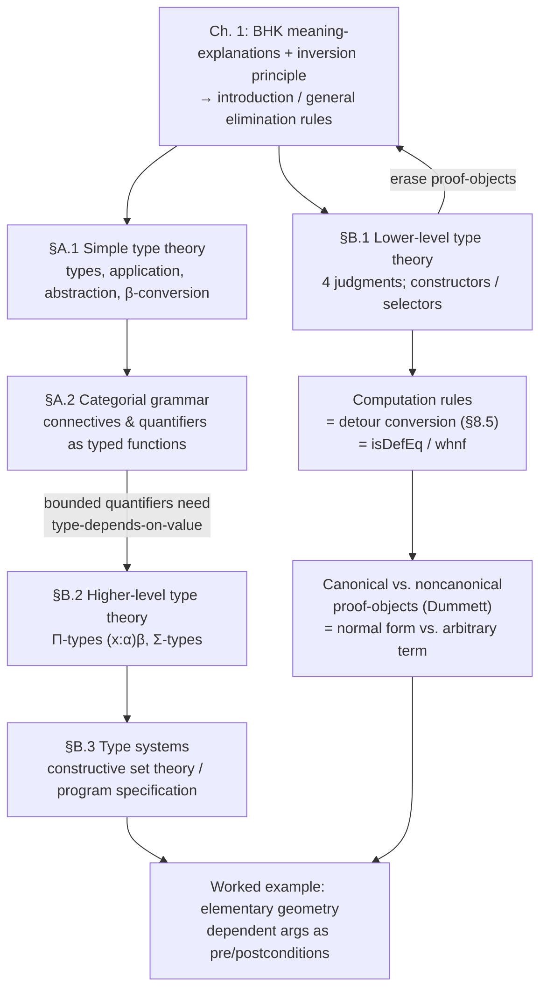

# Type Theory and Categorial Grammar

[[book-guidelines|↩ Back to guidelines]]

## Why the book ends with an appendix on types

Everything up to this point in the book has treated proofs as *trees of rule applications* — objects you draw, count nodes in, and induct over, but never actually *run*. Chapter 1 built natural deduction from BHK meaning-explanations and the inversion principle; Chapter 8 showed that a normal natural-deduction derivation is, formula for formula, the same thing as a cut-free sequent-calculus derivation. What neither chapter tells you is what a proof of $A \supset B$ *is*, computationally — you know how to build one and how to normalize it, but the object itself stays a syntactic tree of judgments $\Gamma \vdash C$, not a value.

Appendices A and B answer that. They introduce **simple** and then **constructive (Martin-Löf) type theory**, and the punchline is one you've probably already met under the name *Curry–Howard*: attach to every judgment $\vdash A$ an explicit witness $a$, so that $a : A$ reads simultaneously as "$a$ is a proof of proposition $A$" and "$a$ is an element of set $A$." Once you do that, the introduction and (general) elimination rules of Chapters 1 and 8 stop being free-floating inference rules and become the **typing rules of a programming language** — a small dependently-typed core language, in fact, with its own constructors, eliminators, and an operational semantics ($\beta$-conversion and its generalizations) that computes proofs to normal form. This is the appendix where the entire proof-theoretic apparatus of the book gets reinterpreted as *evaluation*.

For anyone building a dependently-typed compiler with an embedded elaborator, this is close to the most load-bearing eight pages in the book: §B.1's four judgment forms and constructor/selector split are, essentially unmodified, the typing judgment and the term AST of a Lean-style kernel; the computation rules are exactly what `isDefEq` computes; and §B.3's worked geometry example is a hand-written specimen of refinement typing.

## Part I — Simple type theory as a grammar for functions (§A.1)

### The problem: syntax that hides its own structure

Chapter 1 defined the language of propositional logic the usual way — an inductive grammar $A ::= \bot \mid P \mid A\&B \mid A\vee B \mid A \supset B$. That's a perfectly good definition, but it treats $\&$, $\vee$, $\supset$ as bare syntactic symbols with formation *clauses*, not as things with any internal structure of their own. Appendix A's alternative is to notice that every one of these symbols is secretly a **function** — $\&$ takes two propositions and returns one — and to build a type theory expressive enough to say that directly.

**What breaks without this view:** if connectives are just symbols governed by grammar clauses, you have no uniform account of *arity*, *currying*, or *binding* — each connective's notation (infix, prefix, quantifier-with-bound-variable) has to be specified and parsed separately, and there is no way to talk about "the category of two-place propositional operations" as a single mathematical object. Categorial grammar exists precisely to make that structure explicit.

### Types, declaration, application, abstraction

A **type** ($\alpha, \beta, \gamma, \dots$) is just a domain-and-range classifier for objects: every object belongs to some type. Given two types $\alpha$ and $\beta$, the **function type** $(\alpha)\beta$ classifies functions from $\alpha$ to $\beta$ — mathematicians write $f : \alpha \to \beta$; the book writes $f : (\alpha)\beta$. Three schemes generate everything else:

$$
\dfrac{f:(\alpha)\beta \quad a:\alpha}{f(a):\beta} \quad\text{(application)}
\qquad
\dfrac{\begin{array}{c}[x:\alpha]\\ \vdots \\ b:\beta\end{array}}{(x)b:(\alpha)\beta} \quad\text{(abstraction)}
$$

$$
\dfrac{\begin{array}{c}[x:\alpha]\\ \vdots \\ b:\beta\end{array} \quad a:\alpha}{((x)b)(a) = b(a/x) : \beta} \quad(\beta\text{-conversion})
$$

Abstraction discharges the assumption $x : \alpha$ (bracket notation, exactly as in $\supset I$) and builds a function $(x)b$ of type $(\alpha)\beta$ out of an open expression $b$; application is the reverse. $\beta$-conversion says what happens when you actually run an abstraction on an argument: substitute and simplify. Multi-argument functions are just curried unary functions applied repeatedly: $f(a)\dots(c)$ is abbreviated $f(a,\dots,c)$, so a two-place function is formally a one-place function returning another function.

**Rust grounding.** This triad — application, abstraction, $\beta$-conversion — is precisely how you'd model closures in a tiny interpreter, and pinning the correspondence down now pays off in §B.1:

```rust
enum Type {
    Base(&'static str),          // a basic type, e.g. "Point", "N"
    Arrow(Box<Type>, Box<Type>), // (alpha)beta
}

enum Term {
    Var(String),
    Abs(String, Type, Box<Term>),   // (x) b   -- abstraction, "(x:alpha) -> b"
    App(Box<Term>, Box<Term>),      // f(a)    -- application
}

// beta-conversion as a single reduction step
fn beta_reduce(t: Term) -> Term {
    if let Term::App(f, a) = &t {
        if let Term::Abs(x, _, body) = f.as_ref() {
            return substitute(body, x, a); // b(a/x)
        }
    }
    t
}
```

The book's $(x)b$ is exactly `Abs`; its $((x)b)(a) = b(a/x)$ is exactly one call to `substitute` inside `beta_reduce`. A real type checker's evaluator is, structurally, this function generalized to normalize under binders and to know when to stop (weak-head normal form vs. full normal form).

**Lean correspondence.** This is not an analogy — it *is* the untyped skeleton of Lean's own term language before dependency is added. `(x)b : (α)β` is `fun x => b : α → β`; application `f(a)` is `f a`; $\beta$-conversion is the reduction rule Lean's kernel applies whenever it needs to decide `isDefEq (f a) (b[a/x])` — the two sides are definitionally equal because one $\beta$-reduces to the other. Every time you write `#eval` or the elaborator needs to check two terms match up to computation, it is running this exact rule.

### Categories, propositional functions, and the ground truth about "categorial grammar"

Simple type theory becomes a grammar once you add a distinguished type $\mathrm{Prop}$ ("category" is just the book's synonym for type here) and treat *properties* as **propositional functions** — functions into $\mathrm{Prop}$. E.g. arithmetic gets a domain $N$ and $\mathrm{Even} : (N)\mathrm{Prop}$, so $\mathrm{Even}(12) : \mathrm{Prop}$ by plain application; geometry gets $\mathrm{Point}$, $\mathrm{Line}$, and a two-place $\mathrm{Incident} : (\mathrm{Point})(\mathrm{Line})\mathrm{Prop}$, giving $\mathrm{Incident}(a, l) : \mathrm{Prop}$ for the ordinary-language "point $a$ is incident with line $l$" — a sentence whose functional structure is invisible until you write it this way.

## Part II — Connectives and quantifiers as typed functions (§A.2)

Atomic propositions become pure parameters $P, Q, R : \mathrm{Prop}$. The connectives are then just more functions:

$$
\bot : \mathrm{Prop}
\qquad
\mathrm{Not} : (\mathrm{Prop})\mathrm{Prop}
\qquad
\mathrm{And}, \mathrm{Or}, \mathrm{Implies} : (\mathrm{Prop})(\mathrm{Prop})\mathrm{Prop}
$$

with $\sim, \&, \vee, \supset$ introduced as pure notational abbreviations (definitional equalities) for these functions, plus infix conventions and binding strength (conjunction/disjunction bind tighter than implication) to recover ordinary formula syntax without ambiguity. Negation and equivalence are shown to be *defined*, not primitive: $\sim A := A \supset \bot$, and the book works this out with an explicit abstraction — $\mathrm{Not} = (A)({\supset}(A, \bot)) : (\mathrm{Prop})\mathrm{Prop}$ — so that $\beta$-converting $\mathrm{Not}(B)$ genuinely produces $B \supset \bot$ rather than just asserting it by fiat. This recovers the grammar clause from Chapter 1, $A ::= \bot \mid P \mid A\&B \mid A\vee B \mid A \supset B$, as a *theorem about the range of the connective functions* rather than a primitive syntactic stipulation.

The same move applies to quantifiers over a single fixed domain $D$: $\mathrm{Every}, \mathrm{Some} : ((D)\mathrm{Prop})\mathrm{Prop}$, abbreviated $\forall, \exists$ — functions that take a one-place propositional function $A : (D)\mathrm{Prop}$ and return a proposition $\forall(A)$ or $\exists(A)$.

### Where simple type theory runs out: bounded quantifiers

This is the pivot the whole appendix pair is building toward. As soon as you want the *domain itself* to vary — "some $D$ is $A$" for an arbitrary set $D$, not a single fixed one baked into the grammar — you need a quantifier categorized as

$$
\forall : (D:\mathrm{Set})(A:(D)\mathrm{Prop})\mathrm{Prop}
$$

and this categorization is **not expressible in simple type theory**: the type of the second argument, $(D)\mathrm{Prop}$, depends on the *value* of the first argument $D$, and simple type theory has no mechanism for a type to depend on a preceding value — only fixed types built from fixed types. This is exactly the gap that motivates Appendix B: you need **dependent types**, where a later argument's type is computed from an earlier argument's value, not just from a preceding type.

## Part III — Lower-level type theory: proofs as terms (§B.1)

### Four judgment forms

Appendix B starts from the propositions-as-sets principle — a proposition *is* (identified with) the set of its proofs — and fixes exactly four forms of judgment, which subsume the earlier $A : \mathrm{Prop}$/$A : \mathrm{Set}$ terminology into one framework:

$$
A : \mathrm{Prop}\ (A:\mathrm{Set}) \qquad a : A \qquad a = b : A \qquad A = B : \mathrm{Set}
$$

read respectively as "$A$ is a proposition (a set)," "$a$ is a proof of $A$ (an element of $A$)," "$a$ and $b$ are the same proof/element of $A$," and "$A$ and $B$ are the same set." The witness $a$ in $a : A$ is the **proof-object** (proof term) — the thing that used to be silently discharged in Chapter 1's derivations and is now a first-class syntactic object you can pattern-match on.

**Definitional equality** gets two structural rules — reflexivity and transitivity (symmetry is then derivable: from $b = a : A$, reflexivity gives $a = a : A$, and transitivity of $b=a$ with $a=a$ gives $a = b : A$) — mirrored by an identical pair of rules for equality of *sets*, $A = B : \mathrm{Set}$. This is not incidental bookkeeping: definitional equality is the equivalence relation the *whole* apparatus below is checked against, and it is exactly what a type checker's `isDefEq`/`whnf` machinery computes.

### Constructors and selectors: proofs you build vs. proofs you consume

For each connective, the book gives a **constructor** (a function that *builds* a proof-object of that connective's type — this is the introduction rule made computational) and, where needed, a **selector** (a function that *consumes* a proof-object of that type to extract information — the general elimination rule made computational):

| Connective | Constructor (introduction) | Selector (elimination) |
|---|---|---|
| $A\&B$ | $\mathrm{pair}(a,b) : A\&B$, given $a:A,\ b:B$ | $\&E(c,(x)(y)d) : C$, given $c:A\&B$ |
| $A\vee B$ | $i(a):A\vee B$, $j(b):A\vee B$ | $\vee E(c,(x)d,(y)e) : C$, given $c:A\vee B$ |
| $A\supset B$ | $(\lambda x)b : A \supset B$, given $[x{:}A]\vdash b{:}B$ | $\mathrm{gap}(c,a,(y)d) : C$, given $c:A{\supset}B,\ a{:}A$ |
| $\bot$ | (none) | $\mathrm{efq}(c) : C(c/x)$, given $c:\bot$ |

$p, q$ (the ordinary conjunction projections) and $\mathrm{ap}$ (modus ponens) turn out to be the **special-case** selectors $p(c) = \&E(c,(x)(y)x)$, $q(c) = \&E(c,(x)(y)y)$, and similarly for $\mathrm{ap}$ from $\mathrm{gap}$ — exactly the general-elimination-rule-subsumes-special-elimination-rule relationship established in Chapter 1/Chapter 8, now spelled out as literal function definitions rather than derivability facts.

**If you erase all the proof-objects** — replace every $a : A$ by bare $\vdash A$ — the constructor/selector rules collapse exactly back to the introduction/general-elimination rules of ordinary natural deduction. The book states this outright: *"If in the above rules we hide all the proof-objects, we are back to the usual rules of natural deduction."* Lower-level type theory is not a different logic; it's the same natural deduction with the erased witnesses made explicit again.

**Rust grounding — a term AST for this core.** This is a direct sketch of the term language a small dependent-type-checker kernel would carry, one variant per constructor/selector:

```rust
enum Term {
    // constructors
    Pair(Box<Term>, Box<Term>),               // pair(a, b) : A & B
    Inl(Box<Term>), Inr(Box<Term>),            // i(a), j(b) : A v B
    Lam(String, Box<Term>),                    // (lambda x) b : A -> B

    // selectors (eliminators)
    OrElim { scrutinee: Box<Term>, left: (String, Box<Term>), right: (String, Box<Term>) }, // vE
    App(Box<Term>, Box<Term>),                 // ap(c, a)  -- modus ponens
    GeneralAndElim { scrutinee: Box<Term>, cont: (String, String, Box<Term>) },              // &E(c,(x)(y)d)
    Absurd(Box<Term>),                          // efq(c)
}
```

Note the shape: constructors are exactly a Rust `enum`'s data variants, and selectors are exactly `match` arms — `&E` and `vE` are what you'd write as `match scrutinee { Pair(a,b) => ..., ... }` and `match scrutinee { Inl(x) => ..., Inr(y) => ... }` respectively, generalized to an arbitrary motive `C`.

### Computation rules = operational semantics = detour conversion

Every selector applied to the *matching* constructor reduces:

$$
p(\mathrm{pair}(a,b)) = a : A \qquad q(\mathrm{pair}(a,b)) = b : B
$$
$$
\vee E(i(a),(x)d,(y)e) = d(a/x) : C \qquad \vee E(j(b),(x)d,(y)e) = e(b/y) : C
$$
$$
\mathrm{ap}((\lambda x)b, a) = b(a/x) : B
$$

These are the **computation rules** (equality rules), and the book is explicit that they are the *type-theoretic image of detour conversion* from §8.5 — a selector eating its matching constructor is exactly an elimination rule eating the result of the introduction rule that just built its major premise, i.e. exactly the "introduce-then-immediately-eliminate" redex that normalization removes. Constructing a proof of $A \supset B$ and then immediately applying it (`ap((λx)b, a)`) is a detour; the computation rule is the reduction step that removes it, and it lands you on `b(a/x)` — the same formula normalization would produce by cutting out the middleman.

**This is where the Rust sketch above becomes an evaluator, and where the Lean correspondence is exact rather than illustrative:**

```rust
fn reduce(t: Term) -> Term {
    match t {
        Term::App(f, a) => match *f {
            Term::Lam(x, body) => reduce(substitute(*body, &x, *a)), // ap((lam x)b, a) = b(a/x)
            other => Term::App(Box::new(other), a),
        },
        Term::OrElim { scrutinee, left, right } => match *scrutinee {
            Term::Inl(a) => reduce(substitute(*left.1, &left.0, *a)),   // vE(i(a),...) = d(a/x)
            Term::Inr(b) => reduce(substitute(*right.1, &right.0, *b)), // vE(j(b),...) = e(b/y)
            other => Term::OrElim { scrutinee: Box::new(other), left, right },
        },
        t => t,
    }
}
```

This *is* what a kernel's `whnf`/definitional-equality check does: `isDefEq` in Lean, when comparing two terms, unfolds exactly these redexes (`Or.elim (Or.inl a) f g` reduces to `f a`; `(fun x => b) a` reduces to `b[a/x]` — Lean calls this iota-reduction for the eliminator case and beta-reduction for the lambda case) until both sides reach a form where they can be compared structurally or are seen to be equal. Every computation rule in §B.1 has a named counterpart in Lean's kernel reduction relation.

### Canonical vs. noncanonical proof-objects — Dummett's semantics, and why a type checker cares

The book raises, and answers, a foundational worry: Dummett's constructive semantics explains a proof of $A \supset B$ as "a function converting *an arbitrary* proof of $A$ into some proof of $B$" — but that explanation is circular unless you already understand what "an arbitrary proof" is. Dummett's fix, adopted here, is to split proof-objects into two kinds:

- **Canonical (direct) proof-objects** — objects that are literally of constructor form: $\mathrm{pair}(a,b)$, $i(a)$, $j(b)$, $(\lambda x)b$.
- **Noncanonical (indirect) proof-objects** — objects of selector form: $p(c)$, $q(c)$, $\vee E(\dots)$, $\mathrm{ap}(c,a)$.

The semantic requirement is that *every* noncanonical object must be convertible, by computation rules, into a canonical one — and Martin-Löf (1975) proved this conversion always terminates in a **unique** canonical form. This resolves the circularity: you never actually need to grasp "an arbitrary proof" in the abstract; you only ever need the guarantee that whatever selector-built expression you're handed, it computes down to one of the finitely many constructor shapes.

**Why this is exactly the distinction a type checker lives inside.** This canonical/noncanonical split is precisely *normal form vs. arbitrary term* — the same distinction that governs whether your evaluator can pattern-match directly on a value (`match` requires a canonical/WHNF scrutinee) or must first force reduction. A `match` on `Term::OrElim` in the Rust sketch above is well-defined only once the scrutinee has been driven to canonical form (`Inl`/`Inr`); until then it's a noncanonical, "stuck-looking" expression that the evaluator has to keep reducing. In Lean's kernel, this is the difference between a term in weak-head-normal-form (ready for structural comparison or pattern matching) and one that still has outstanding redexes; `whnf` is literally the Martin-Löf termination result, implemented.

## Part IV — Higher-level type theory: dependent types proper (§B.2)

Simple type theory's abstraction/application/$\beta$-conversion generalize directly once the range type is allowed to *depend on the argument*. Writing $B(x)$ for a type in context $x : \alpha$, the **dependent function type** (the book's notation for what is universally called the **$\Pi$-type**) is $(x:\alpha)\beta$, with:

$$
\dfrac{\begin{array}{c}[x:\alpha]\\ \vdots \\ b:\beta\end{array}}{(x)b : (x:\alpha)\beta}
\qquad
\dfrac{f:(x:\alpha)\beta \quad a:\alpha}{f(a):\beta(a/x)}
\qquad
\dfrac{\begin{array}{c}[x:\alpha]\\ \vdots \\ b:\beta\end{array}\quad a:\alpha}{((x)b)(a) = b(a/x) : \beta(a/x)}
$$

The only change from §A.1's schemes is that the codomain now gets substituted too: $\beta(a/x)$ instead of a constant $\beta$. Simple type theory's $(\alpha)\beta$ is recovered as the special case where $\beta$ doesn't mention $x$. And all four connective/quantifier rule-families from §B.1 now come out as **instances of these two general schemes** rather than being stipulated separately — the bounded quantifier that simple type theory couldn't categorize in §A.2 finally gets its type:

$$
\forall : (A:\mathrm{Set})(B:(A)\mathrm{Prop})\mathrm{Prop}
$$

with a correspondingly dependent typing for its constructor, e.g. for $\exists$-introduction:

$$
\mathrm{pair} : (A:\mathrm{Set})(B:(A)\mathrm{Prop})(x:A)(B(x))\ \Sigma(A,B)
$$

— note this is literally a **$\Sigma$-type** constructor, written out with all its type arguments explicit (the book calls the existential's type $\exists(A,B)$; the modern name is $\Sigma(A,B)$, and $\mathrm{pair}$ here is exactly `Sigma.mk`). This is the moment in the book where $\Pi$- and $\Sigma$-types stop being abstract slogans and become concrete function categorizations you can write and typecheck by hand.

**Rust cannot natively express this** — a `Term` whose *type itself* depends on a runtime value is exactly what Rust's own type system (checked at compile time, values erased) cannot represent without dropping into a separate representation for types-as-terms. That gap is worth naming explicitly, because it is the actual design problem a Rust-hosted dependent-type checker has to solve: types must be reified as first-class `Term`s (a `Type` case *inside* `Term`, not a separate enum) so that a type can mention a value, and the kernel's `type_of` function must be able to substitute values into type-level terms exactly as $\beta(a/x)$ does here.

**Lean correspondence.** $(x:\alpha)\beta$ *is* `(x : α) → β x` in Lean, i.e. a $\Pi$-type; $f(a) : \beta(a/x)$ *is* Lean computing the applied type `β a` by substitution during elaboration; $\Sigma(A,B)$ *is* Lean's `Sigma` (or an existential `Exists`, its `Prop`-valued cousin). The book's insistence on writing out $A$ and $B$ as explicit arguments to `pair`, `ap`, `p`, `q` even though "it is usual not to write out the type arguments" is precisely Lean's distinction between a fully explicit term and its elaborated, implicit-argument-elided surface syntax — the type arguments are always there in the kernel term, just hidden by convention at the surface, exactly as `@Sigma.mk` vs. `⟨a, b⟩` in Lean.

## Part V — Type systems: two readings, and refinement typing by hand (§B.3)

Type theory admits two readings of the basic judgment $a : A$, and the book is careful to keep both live:

1. **Constructive set theory.** $a:A$ means "$a$ is an element of set $A$." Under this reading, $\&$ is intersection, $\vee$ is disjoint union, $\forall$ is a Cartesian product of a family of sets, $\exists$ is a direct sum.
2. **Program specification.** $a:A$ means "program $a$ meets specification $A$." Types express *problems*; objects are *programs solving them*; a formally verified proof is literally a terminating program converting the data of a problem into its solution.

These two readings coinciding — the same judgment simultaneously "is a proof" and "is a well-typed program" — is Curry–Howard stated as an actual design consequence rather than a slogan, and reading (2) is the one that matters for a verifying compiler: it says program correctness reduces to a type-checking problem, with no separate proof-obligation machinery bolted on.

### The worked example: elementary geometry as dependent types (the closest thing in this book to hand-written refinement typing)

The book formalizes a fragment of geometry to make reading (2) concrete, and it is worth walking through in full because it is exactly the pattern a refinement-type compiler needs. Basic sets and relations:

$$
\mathrm{Pt} : \mathrm{Set} \qquad \mathrm{Ln} : \mathrm{Set} \qquad \mathrm{DiPt} : (\mathrm{Pt})(\mathrm{Pt})\mathrm{Prop} \qquad \mathrm{DiLn} : (\mathrm{Ln})(\mathrm{Ln})\mathrm{Prop} \qquad \mathrm{Apt} : (\mathrm{Pt})(\mathrm{Ln})\mathrm{Prop}
$$

[[Variant-Sequent-Calculi#The construction|The construction]] of "the line through two points" is only sensible when the two points are actually *distinct* — and the type theory can say so directly, by making the **proof of distinctness a required argument**, not a side-condition checked separately:

$$
\mathrm{ln} : (a:\mathrm{Pt})(b:\mathrm{Pt})(\mathrm{DiPt}(a,b))\,\mathrm{Ln}
$$

so `ln(a, b, w) : Ln` type-checks only in a context carrying `w : DiPt(a, b)` — a witness that $a \ne b$. This is a refinement/precondition encoded as a **dependent argument type**, not a runtime check: there is no way to call `ln` on two points without also supplying a proof they're distinct, so "line-through-two-equal-points" is not merely a runtime error, it is *not a well-formed term*. The book then attaches the *postcondition* — incidence — as a second family of declared constants, functions that *produce proofs* about the constructed object:

$$
\mathrm{inc\text{-}ln1} : (a:\mathrm{Pt})(b:\mathrm{Pt})(w:\mathrm{DiPt}(a,b))\ \mathrm{Inc}(a,\ \mathrm{ln}(a,b,w))
$$
$$
\mathrm{uni\text{-}ln} : (a:\mathrm{Pt})(b:\mathrm{Pt})(w:\mathrm{DiPt}(a,b))(l:\mathrm{Ln})(\mathrm{Inc}(a,l))(\mathrm{Inc}(b,l))\ \mathrm{EqLn}(l,\ \mathrm{ln}(a,b,w))
$$

Read `uni-ln`'s type as a Hoare triple made literal: *given* two distinct points and any line incident with both, *conclude* that line equals the canonical one — precondition and postcondition are both just more dependent arguments and more dependent return types. This is the book's own hand-rolled precursor to a `requires`/`ensures`-carrying refinement type.

```rust
// A refinement-typed core would carry this exactly as an indexed constructor:
// `ln(a, b, w)` where `w : DiPt(a, b)` is a *term*, not a comment.
enum Term {
    // ... constructors/selectors from Part III, plus:
    Ln { a: Box<Term>, b: Box<Term>, distinct_witness: Box<Term> }, // : Ln, well-typed only if
                                                                     // type_of(distinct_witness) ≡ DiPt(a, b)
}
```

Checking `Ln { a, b, distinct_witness }` well-typed means checking `type_of(distinct_witness)` is *definitionally equal* to `DiPt(a, b)` — the same `isDefEq`/computation-rule machinery from Part III, now doing the work of a refinement-type obligation instead of a plain connective reduction. There is no separate "SMT call" in this 1970s-vintage formalization — the proof term itself discharges the obligation, checked by ordinary type checking. (A modern refinement-type compiler reintroduces automation *underneath* this same judgment, generating the witness via constraint solving rather than requiring the programmer to hand-write it — but the type-theoretic contract the witness has to satisfy is exactly this one.)

## How the pieces fit together



## Where this leads

Within the book, this pair of appendices is a coda: it takes the machine built across Chapters 1 and 8 — introduction rules from BHK conditions, general elimination rules from the inversion principle, normalization via detour conversion — and shows it was secretly a **programming language with an operational semantics** the whole time. Nothing downstream in *this* book depends on it (Appendix C's proof editor PESCA is sequent-calculus-only), but it is the chapter that retroactively explains *why* the book's careful attention to normal form, subformula properties, and cut elimination is worth caring about outside of proof theory as its own subject: those are exactly the properties that make a type checker built on this foundation terminate and stay decidable.

For the standing project, treat this as close to a checklist of what your kernel needs, item for item:

- **§B.1's four judgment forms** ($A:\mathrm{Set}$, $a:A$, $a=b:A$, $A=B:\mathrm{Set}$) are the shared ancestor of "a type checker" and "a proof checker" that the workbench goals ask to keep surfacing — here they are literally the same four judgments, not an analogy.
- **Constructors vs. selectors** is the constructor/eliminator split any Rust `enum`-based kernel term type will need, and the **general elimination rules** ($\&E$, $\mathrm{gap}$) are the right ones to implement first, with $p, q, \mathrm{ap}$ falling out as derived special cases — exactly mirroring how [[Natural-Deduction-and-the-Inversion-Principle|the inversion principle]] produced them in the logic.
- **Computation rules are `isDefEq`'s job description.** Every reduction in the elaborator's unifier — deciding whether two metavariable-containing terms could possibly be equal — bottoms out in exactly this relation, extended to handle metavariables and delta/iota-reduction of user definitions.
- **Canonical vs. noncanonical proof-objects is normal-form-vs-arbitrary-term**, i.e. the precise question a bidirectional type checker asks every time it needs to pattern-match, unify, or compare types up to definitional equality: can this term's head be driven to a constructor, or is it stuck (blocked on a variable or an unresolved metavariable)?
- **§B.2's dependent $(x:\alpha)\beta$ and $\Sigma(A,B)$** are $\Pi$- and $\Sigma$-types in their most literal, least-notation-obscured form — worth returning to as a reference when the elaborator needs to substitute a solved metavariable into a dependent codomain.
- **§B.3's geometry example is a template for refinement types**: preconditions as extra dependent arguments whose type is a proof obligation, postconditions as extra return-type conjuncts proved by constant functions. The gap between this and a modern refinement-type compiler is exactly where constraint generation and solving (unification, SMT, CHCs) plug in to *synthesize* the witness terms this appendix expects the programmer to write by hand.

## Notes on the source material

Both appendices are short (roughly six and ten printed pages) and dense rather than thin — every paragraph introduces a new rule-family, so the coverage above tracks the source closely rather than padding it. The OCR of this range was generally clean; recurring artifacts were Greek letters rendered as Latin look-alikes (`«` for $\alpha$, `¥` for $\gamma$, `S` for $\beta$ in places), turnstiles and inference-rule bars dropped or garbled, and a few connective symbols swapped for stray punctuation (`—` for $\supset$ in one spot, `1` for $\bot$) — all reconstructed here from mathematical context against the book's own notation established earlier in the volume (e.g. Chapter 1's BHK-conditions and Chapter 8's general elimination rules), not read off the raw OCR text directly.
