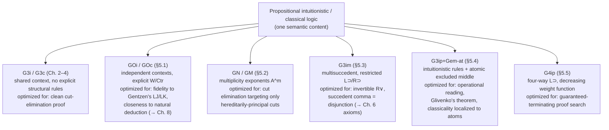

# Variant Sequent Calculi

[[book-guidelines|↩ Back to guidelines]]

## The problem this chapter solves: there is no single "correct" sequent calculus

By the end of Chapter 4, you have one very good sequent calculus for intuitionistic logic (G3i) and one for classical logic (G3c): shared contexts, atomic axioms, contraction and weakening baked in as *admissible* rather than primitive, cut fully eliminable. It would be reasonable to think the job is done — you found the "right" formalization of these logics and everything else is detail.

Chapter 5 pushes back on that assumption. It asks: given a fixed logic, how many genuinely different cut-free sequent presentations of it are there, and what do you gain or lose by picking one over another? The answer is: several, and each one is optimized for a different downstream use. This is the chapter's real content — not five unrelated case studies, but one design space with several independent axes, and the G3 calculi of Chapters 2–4 are themselves just one point in it (shared context, no explicit structural rules, single succedent). Four more points are worth knowing by name:

| Axis | Question it answers | Calculus |
|---|---|---|
| How is bookkeeping (weakening/contraction) represented? | Explicit rules, or folded into the logical rules? | GOi/GOc (§5.1) vs. GN/GM (§5.2) |
| How many formulas can a sequent conclude? | One, or many? | G3im (§5.3) |
| Is the logic classical or intuitionistic, and how is that difference realized structurally? | A different succedent discipline, or an added *rule*? | Gem-at (§5.4) |
| Does proof search actually terminate? | Not necessarily — unless the rules are shaped to force it | G4ip (§5.5) |

This is directly the kind of question a toolchain builder needs answered before writing a proof search engine: "what should my derivation rules look like" is not a stylistic choice, it's an engineering decision with sharp consequences for whether search terminates, what invariants a checker can rely on, and how directly a derivation can be read back as a natural-deduction proof (or a program, under Curry–Howard). Chapter 5 is the book handing you that decision explicitly, worked out for a battery of concrete cases.

## Axis 1 — explicit structural rules vs. structural rules baked into the logic (§5.1–5.2)

This axis is covered in real depth, including the full cut-elimination proofs, in [[Structural-Rules-and-Cut-Elimination|Structural Rules and Cut Elimination]] (§4 of that article). The short version, needed here to complete the family picture:

- **GOi/GOc (§5.1, pp. 87–97)** go back to Gentzen's own 1934–35 style: two-premiss rules have *independent* contexts (added together, not shared), and weakening/contraction are explicit primitive rules. This reopens a genuine complication Gentzen had to face: if the right premiss of a cut was itself derived by contraction, permuting the cut upward past that contraction doesn't obviously shrink anything, because the contracted formula can reappear duplicated on both branches. Gentzen's own repair was **multicut** (eliminating $m>1$ copies of the cut formula from a many-times-contracted premiss in one step, rather than peeling them off one at a time) — this is the standard textbook route (e.g. Takeuti). Negri and von Plato instead prove cut elimination *without* multicut, via a more global case analysis keyed to how the contraction premiss itself was derived. Knowing that multicut exists, and that GOi/GOc's whole raison d'être is avoiding it, is the useful takeaway here even without reproducing every case.
- **GN/GM (§5.2, pp. 98–107)** go the other direction: no explicit structural rules at all. Every active formula in a logical rule carries a **multiplicity exponent** $A^m$ — $m=0$ means the formula is present vacuously (weakening), $m>1$ means it's used multiply (contraction):
$$
\dfrac{A^m, B^n, \Gamma \Rightarrow C}{A \& B, \Gamma \Rightarrow C}\ L\&
$$
Because weakening and contraction are now *part of* the rule instance rather than separate steps, the book's motivation is explicit and worth quoting the shape of: *discharge* in natural deduction corresponds to a sequent-calculus rule with an active antecedent formula; a **vacuous discharge** (a hypothesis introduced and never used) is exactly $m=0$; a **multiple discharge** (a hypothesis used more than once) is exactly $m>1$. GN/GM is the sequent-calculus *encoding* of exactly the bookkeeping that ordinary natural deduction already does silently when it lets an assumption be discharged zero or many times.

  This buys something concrete for cut elimination: because nothing can be "smuggled in or out" through an invisible structural step, only **hereditarily principal** cuts (Definition 5.2.5 — the cut formula is principal in some rule in the derivation of the *right* premiss, possibly several rules up) need to be targeted at all. Everything else is *already* a subformula of the conclusion without any rewriting — the book proves this via the notion of a **multiset reduct** (Definition 5.2.1: a context obtained from another by multiplying or deleting formulas) and a battery of **redundant cut** cases (Definition 5.2.3) that simply vanish. This is a genuinely smaller cut-elimination proof than G3ip's, at the cost of the exponent bookkeeping being visible in every rule instance.

**A Rust-shaped way to hold this axis in your head:** think of a proof context as a set of borrowed values. G3-style calculi (Ch. 2–4) get away with never mentioning multiplicity because atoms are `Copy` — the axiom rule $P,\Gamma\Rightarrow P$ already assumes you can use $P$ zero, one, or many times downstream without asking, so weakening and contraction are silently sound and don't need to be rules at all. GN/GM is what happens when you *refuse* that assumption and insist every use be counted, the way an affine or linear type system tracks a value's use count precisely: $A^0$ is "declared, never consumed" (a `#[allow(unused)]` binding), $A^n$ for $n>1$ is "consumed $n$ times" (which requires `Clone`, i.e. contraction, to be a real rule you can point to rather than something the type system gives you for free). GOi/GOc sits in between: contraction is a real, explicit rule — closer to a linear calculus with an explicit `dup` instruction than to an ambient `Copy` bound.

## Axis 2 — how many things can a sequent conclude? The multisuccedent intuitionistic calculus G3im (§5.3, pp. 108–113)

### The motivating question

G3c (classical) allows an arbitrary multiset $\Delta$ on the right of $\Rightarrow$, read as "$\Gamma$ implies *some* formula in $\Delta$." G3i (intuitionistic) restricts the succedent to at most one formula. It's tempting to think this restriction is what "makes" a logic intuitionistic — but §5.3 shows that's not quite right. **G3im**, due to Dragalin (1988, who called it GHPC — Gentzen-style Heyting Predicate Calculus), is a genuinely multisuccedent calculus that is still intuitionistically sound and complete. The propositional part is identical to G3c except for implication (and, for quantifiers, except for $\forall$ and $\exists$'s right rules):

$$
L{\supset}:\ \dfrac{A \supset B, \Gamma \Rightarrow \Delta, A \qquad B, \Gamma \Rightarrow \Delta}{A \supset B, \Gamma \Rightarrow \Delta}
\qquad\qquad
R{\supset}:\ \dfrac{A, \Gamma \Rightarrow B}{\Gamma \Rightarrow \Delta, A \supset B}
$$

Two deliberate restrictions carry all the intuitionistic content:

1. **$L{\supset}$ repeats the principal formula** in its first premiss (the same Kleene device G3ip needed, for the same reason: $L{\supset}$'s first premiss is not invertible, so without the repeated copy you'd lose it under contraction).
2. **$R{\supset}$'s premiss has exactly one formula in the succedent** ($B$ alone, not $B,\Delta$) — this is the intuitionistic restriction, relocated from "the whole calculus's succedent" (G3i's approach) down to "just this one premiss." $\forall$'s right rule gets the identical treatment (single-formula-succedent premiss, eigenvariable $y$ fresh), while $\exists$'s right rule instead repeats its principal formula in the premiss, dual to how $L\supset$ repeats — the same shape recurring, keyed to which connective is "implication-like" ($\supset,\forall$) versus "disjunction-like" ($\lor,\exists$).

Everything from G3i is recovered as a special case: whenever $\Delta$ happens to be a single formula, these rules degenerate exactly to G3i's. This is why the book calls it "the same calculus" in a generalized form, not a different logic wearing multisuccedent clothes.

### Why bother — the succedent comma as disjunction

The payoff is **Theorem 5.3.7 (Equivalence of G3i and G3im):** $\Gamma \Rightarrow \bigvee \Delta$ is derivable in G3i **iff** $\Gamma \Rightarrow \Delta$ is derivable in G3im (where $\bigvee \Delta = \bot$ if $\Delta$ is empty). The proof is genuinely constructive in both directions — for instance the $\Leftarrow$ direction, when the last rule concluding $\Delta = C_1,\dots,C_n$ is $R\&$ on $C_n = A \& B$, combines the two inductive-hypothesis derivations $\Gamma \Rightarrow C_1 \lor \dots \lor C_{n-1} \lor A$ and $\Gamma \Rightarrow C_1\lor\dots\lor C_{n-1}\lor B$ via $R\&$ and then a *cut* against the (separately, easily derivable) sequent
$$
(C_1\lor\dots\lor C_{n-1}\lor A) \& (C_1\lor\dots\lor C_{n-1}\lor B) \Rightarrow C_1\lor\dots\lor(C_{n-1}\lor(A\&B))
$$
i.e. a use of distributivity — to reassemble the single disjunctive succedent. The result is exactly what the book states in one sentence: **the comma on the right of a G3im sequent behaves like intuitionistic disjunction.** A multisuccedent sequent $\Gamma \Rightarrow \Delta$ is not "a classical sequent that happens to be intuitionistically provable" — it *is* a disjunctive intuitionistic sequent, just written without the explicit $\lor$'s.

**Why this matters for proof search, not just elegance:** G3im's right-disjunction rule $R\lor$ is fully invertible (unlike anything you get if you insist on collapsing to one succedent formula first), which is genuinely useful when you're building a goal-directed prover: you can always split a disjunctive goal into its multiset of disjuncts without loss, postponing the decision of *which* disjunct to actually close until later in the search, rather than having to commit up front. This is also why the book flags G3im as the workhorse for Chapter 6's extension of sequent calculus to axiomatic mathematical theories — closure conditions on nonlogical rules are stated relative to a succedent that can carry several atoms at once.

**Grounding — where this is, and is *not*, like a tactic state.** Resist the pull toward "the succedent is like a list of open goals in Lean." It's the opposite shape: a tactic monad's goal list is a *conjunction* — you must discharge every goal to finish the proof. G3im's succedent is a *disjunction* — the derivation only has to justify *one* of the formulas in $\Delta$, and which one can vary by branch of the derivation tree (this is exactly what the equivalence theorem's translation to $\bigvee\Delta$ makes precise). The genuinely apt Rust/Lean analogy is closer to a `match`/case-split with several live branches, or a disjunctive goal `A ∨ B` in Lean that you can `cases` on and defer committing to `left`/`right` — the succedent comma *is* that deferred commitment, formalized as a structural feature of sequents rather than a connective you have to introduce and eliminate explicitly.

## Axis 3 — classical logic as intuitionistic logic plus one restricted rule (§5.4, pp. 114–121)

### The construction

G3cp (Ch. 3) is classical because its succedent is unrestricted. §5.4 gets classical logic a completely different way: keep the intuitionistic single-succedent calculus G3ip untouched, and add **one new rule**, excluded middle restricted to atoms:
$$
\text{Gem-at}:\ \dfrac{P, \Gamma \Rightarrow C \qquad {\sim}P, \Gamma \Rightarrow C}{\Gamma \Rightarrow C}
$$
Call the result **G3ip+Gem-at**. It's complete for classical propositional logic (Corollary 5.4.7), and every connective still obeys its *intuitionistic* introduction/elimination rules — the classicality is entirely concentrated in this one structural-looking rule, applied only to atoms. Weakening, contraction, and cut all remain admissible (Lemmas/Theorems 5.4.2–5.4.4), and — a genuinely non-obvious extra result — **excluded middle for arbitrary formulas** is admissible too (Theorem 5.4.6, by induction on formula length), even though it isn't a primitive rule. Gentzen himself considered an unrestricted excluded-middle rule in 1936 and rejected it because it destroys the subformula property outright; restricting to atoms is precisely what keeps derivations analyzable.

**What breaks without the restriction:** an unrestricted Gem lets a compound formula vanish from a derivation without ever being decomposed by a logical rule, so nothing forces it to relate to the subformulas of the endsequent — proof search over it has nowhere principled to branch. Restricting to atoms turns "which formula to split on" into a decidable, bounded question (there are only finitely many atoms in a given sequent), which is exactly why the resulting subformula property, though weaker than the usual one, is still strong enough to do real work.

### The generalized subformula property, and why classical logic is "intuitionistic reasoning about decidable atoms"

Theorem 5.4.10: every formula in a G3ip+Gem-at derivation of $\Gamma \Rightarrow C$ is either a subformula of the endsequent, or an atom, or a negated atom. That's a strictly bigger set of "allowed" formulas than the plain subformula property gives you — but the book sharpens it back down: Theorem 5.4.12 shows every derivation can be transformed so that **Gem-at is applied only to atoms actually occurring in the succedent $C$ of the conclusion**, recovering the ordinary subformula property exactly. This is what licenses root-first proof search: to derive $\Gamma \Rightarrow C$, split on the atoms *of $C$ itself* via Gem-at, nothing else.

This is the technical content behind the book's own framing, worth taking completely literally: **G3ip+Gem-at is "an intuitionistic system for theories with decidable basic relations."** Classical propositional reasoning, seen this way, is not a different logic bolted onto intuitionistic logic — it's ordinary constructive reasoning, plus the single extra fact that every *atomic* proposition is decidable ($P \lor {\sim}P$ holds for atoms, unconditionally). Compound formulas never need their own excluded-middle instance because Gem for arbitrary formulas, though admissible, is always reducible to Gem on the atoms occurring in them.

**This is precisely the shape of DPLL/CDCL-style SAT and SMT search**, and it's worth naming directly for the compiler/prover project this workbench is built around: a DPLL solver doesn't case-split on compound formulas either — it picks a *literal* (an atom or its negation) and branches, propagating consequences through the connective structure, exactly the way Gem-at here only ever splits on atoms while the surrounding intuitionistic rules for $\&,\lor,\supset$ handle everything else deterministically. If your embedded theorem prover ever needs a classical propositional core over an SMT-decidable atomic theory (linear arithmetic literals, equality literals, etc.), Gem-at is the proof-theoretic license for exactly that architecture: keep the connective-level reasoning intuitionistic/structural, and localize all classical case-splitting to atomic decisions.

### Glivenko's theorem, made constructive

**Theorem 5.4.9 (Glivenko):** if $\Gamma \Rightarrow {\sim}C$ is derivable in G3ip+Gem-at (classically), it is derivable in G3ip (intuitionistically) — negative sequents need no classical strength at all. The proof isn't a soundness/completeness detour through semantics; it's an **explicit rewrite** of the derivation. First permute all Gem-at instances to the bottom (Lemma 5.4.8 — commuting a structural-looking rule past every logical rule is routine because Gem-at's premisses share the conclusion's succedent formula). Take the lowest one:
$$
\dfrac{P,\Delta \Rightarrow {\sim}C \qquad {\sim}P,\Delta \Rightarrow {\sim}C}{\Delta \Rightarrow {\sim}C}\ \text{Gem-at}
$$
and replace it with a purely intuitionistic derivation that uses only $R{\supset}$'s invertibility and admissible contraction/cut to derive $C, P, \Delta \Rightarrow \bot$ and $C, {\sim}P,\Delta \Rightarrow \bot$, cut them together on $P$ (which is intuitionistically fine — you're proving $\bot$ from both cases of a decidable atom, not asserting the atom's decidability), and conclude $\Delta \Rightarrow {\sim}C$ without Gem-at at all. Repeat for every remaining instance. **This is [[Intermediate-Logical-Systems#The double-negation translation|the double-negation translation]] in its sequent-calculus dress**, made into a syntactic transformation you can actually run on a derivation object rather than a semantic argument about models — precisely the "proof-producing" shape a trusted-kernel architecture wants: if your elaborator or embedded prover ever discharges an obligation classically, Glivenko's proof method is a template for how to *reconstruct* a constructive certificate for the negative fragment mechanically, rather than trusting the classical step as a black box.

### Peirce's law, worked

Theorem 5.4.12's transformation licenses restricting Gem-at to atoms of the *goal*, which turns proof search for classical validities into a concrete recipe: to derive $\Gamma \Rightarrow C$, split on an atom of $C$. Peirce's law, $\Rightarrow ((A\supset B)\supset A)\supset A$ — the textbook example of a classically-but-not-intuitionistically valid schema — needs Gem on exactly one atom, $A$:

$$
\dfrac{
  \dfrac{A \Rightarrow A}{A, (A\supset B)\supset A \Rightarrow A}\text{(weakening)}
  \qquad
  \dfrac{
    \dfrac{A \Rightarrow A \qquad {\sim}A, A \Rightarrow B}{{\sim}A \Rightarrow A \supset B}\,R{\supset}
    \qquad
    \dfrac{A, {\sim}A \Rightarrow A}{}\text{(axiom + weakening)}
  }{{\sim}A, (A\supset B)\supset A \Rightarrow A}\,L{\supset}
}{(A\supset B)\supset A \Rightarrow A}\ \text{Gem-at (on }A\text{)}
$$

then $R{\supset}$ closes $\Rightarrow((A\supset B)\supset A)\supset A$. Notice what's doing the work: the right branch derives ${\sim}A \Rightarrow A\supset B$ **intuitionistically** (from ${\sim}A,A \Rightarrow B$, which holds because $\bot$ proves anything) — no classical step needed there at all. The *only* place classicality enters is the single case split on whether $A$ holds, right at the top. That's the whole content of "excluded middle restricted to atoms suffices for classical logic": Peirce's law isn't secretly about $(A\supset B)\supset A$ needing classical treatment; it's about $A$ needing it, once, and the connective rules carry the rest.

## Axis 4 — making proof search actually terminate: G4ip (§5.5, pp. 122–125)

### What's wrong with G3ip's $L{\supset}$ for search

G3ip's own left-implication rule,
$$
\dfrac{A\supset B,\Gamma \Rightarrow A \qquad B,\Gamma \Rightarrow C}{A\supset B,\Gamma\Rightarrow C}\ L{\supset}
$$
repeats its principal formula $A\supset B$ in the first premiss — necessary for soundness (§2.3's Kleene device, needed because that premiss isn't invertible), but *fatal for naive root-first search*: nothing stops you from applying $L{\supset}$ to the same formula again in the very next step, along that same first-premiss branch, forever. Chapter 2's underivability proofs (§2.5(c)) show this precisely: every derivation attempt either bottoms out at $P_1,\dots,P_n \Rightarrow Q$ with some $P_i = Q$, or loops on repeated applications of $L{\supset}$ to the same $A\supset B$. A cut-free calculus buys you the subformula property, but the subformula property alone doesn't buy you *termination* — you can still search forever inside the space of subformulas if a rule is allowed to reintroduce its own premiss.

### The fix: four rules instead of one, keyed to the antecedent's shape

Hudelmaier (1992) and Dyckhoff (1992) — independently rediscovering ideas of Vorob'ev from the early 1950s — found that $L{\supset}$ splits cleanly into four rules according to the *form* of $A$ in $A\supset B$, and that in every one of them the *active* formulas are provably lighter (under a suitably chosen weight function) than the *principal* formula, so nothing can ever loop:

$$
L{\supset}\text{at}:\ \dfrac{P, B, \Gamma \Rightarrow E}{P, P\supset B, \Gamma \Rightarrow E}
\qquad\quad
L{\supset}\&:\ \dfrac{C\supset(D\supset B),\Gamma \Rightarrow E}{(C\& D)\supset B, \Gamma \Rightarrow E}
$$
$$
L{\supset}\lor:\ \dfrac{C\supset B,\ D\supset B,\ \Gamma \Rightarrow E}{(C\lor D)\supset B,\Gamma \Rightarrow E}
\qquad\quad
L{\supset}\supset:\ \dfrac{C, D\supset B, \Gamma \Rightarrow D \qquad B,\Gamma \Rightarrow E}{(C\supset D)\supset B,\Gamma\Rightarrow E}
$$

The first three are read directly off intuitionistically-provable equivalences: $P \supset (P\supset B) \leftrightarrow (P\supset B)$ for atoms, $(C\supset(D\supset B)) \leftrightarrow ((C\& D)\supset B)$ (currying), and $(C\supset B)\&(D\supset B) \leftrightarrow ((C\lor D)\supset B)$ (case analysis). The fourth is the interesting one — it's *not* intuitive on sight, but has a clean two-line justification: from $C,D\supset B,\Gamma\Rightarrow D$, apply $R{\supset}$ to get $D\supset B,\Gamma \Rightarrow C\supset D$; cut this against the independently-derivable $(C\supset D)\supset B \Rightarrow D\supset B$ to get $(C\supset D)\supset B,\Gamma \Rightarrow C \supset D$; then a single ordinary $L{\supset}$ against $B,\Gamma\Rightarrow E$ finishes it. So $L{\supset}\supset$ is a *derived shortcut* for a two-step detour through cut and an ordinary $L\supset$ — packaged as a primitive rule precisely so that proof search never has to *find* that detour, it's built into the rule table.

The weight function that certifies termination assigns different increments to different connectives — not the naive "count the symbols" measure:
$$
w(\bot)=0,\quad w(P)=1,\quad w(A\supset B)=w(A)+w(B)+1,\quad w(A\& B)=w(A)+w(B)+2,\quad w(A\lor B)=w(A)+w(B)+3
$$
The unequal increments ($1,2,3$) are exactly what's needed to make the active formulas in **every** one of the four rules — including the non-obvious $L{\supset}\supset$, where naive symbol-counting doesn't obviously shrink anything — strictly lighter than the principal formula. Proof search over G4ip is then genuinely a well-founded recursion on $w$: applying any rule to a sequent strictly decreases the total weight of the antecedent along that branch, so there is a hard upper bound on derivation depth for a fixed starting sequent, and root-first search *terminates*, positively or negatively, every time.

### G4ip is equivalent to G3ip — the hard direction is admissibility, not soundness

Showing G4ip's rules are all *sound* (derivable in G3ip) is routine, since G3ip already has weakening and contraction available to use as needed. The interesting direction is the reverse: showing G3ip's ordinary, unrestricted, repetition-using $L{\supset}$ is *admissible* in G4ip — i.e., that the four restricted rules lose no derivational power. This needs weakening (Proposition 5.5.1), the fact $A,\Gamma\Rightarrow A$ for arbitrary compound $A$ (Lemma 5.5.2, proved by induction on $w(A)$ using the four $L{\supset}$ rules to unpack compound antecedents), and — the genuinely hard step — admissibility of **contraction** (Theorem 5.5.3), whose proof needs an auxiliary duplication lemma specifically for the case where a formula's antecedent is itself an implication (exactly $L{\supset}\supset$'s territory), reducing the problem to lighter formulas rather than proving it directly. From there, Lemma 5.5.4 and Theorem 5.5.5 chain together weakening and contraction to derive ordinary $L{\supset}$ as an admissible rule of G4ip, establishing the equivalence. (Direct cut elimination for G4ip is also provable, per Dyckhoff and Negri (2000), but is "quite long and involved" — the book doesn't reproduce it, relying instead on cut admissibility transferred through the G3ip equivalence.)

## Synthesis: one logic, several calculi, each earning its keep differently

Structurally, this chapter is a hinge between "prove cut is admissible" (Chapters 2–4, and the how-and-why covered in [[Structural-Rules-and-Cut-Elimination]]) and two very different places the book goes next: Chapter 6 extends **G3im and G3c** specifically (the multisuccedent calculi of this chapter) with nonlogical axiom-rules while preserving cut elimination — you now know exactly why the multisuccedent shape was worth having in reserve. And Chapter 8's isomorphism between cut-free sequent calculus and normal natural deduction leans on the **independent-context** calculi of §5.1 (GOi/GOc), not the shared-context G3 calculi, because independent contexts track exactly which subtree of the derivation each assumption came from — the structural feature natural-deduction discharge needs to mirror.

For the compiler/elaborator project this workbench is built around, three connections are worth carrying forward explicitly:

- **G4ip is the proof-theoretic ancestor of a terminating decision procedure or tactic.** The weight-function argument — assign a measure that strictly decreases across every rule application, choosing unequal per-connective increments if that's what it takes to make the awkward cases work — is exactly the discipline you need when implementing any bounded/decidable fragment of your refinement-type checker's proof obligations (e.g. a propositional-intuitionistic core of a Horn-clause side condition) as a `termination_by`-style well-founded recursion rather than an unbounded search. G4ip's four-way case split on the antecedent's *syntactic shape* is also a direct model for how a bidirectional elaborator dispatches on the shape of a type being checked against, rather than trying one uniform rule and hoping it terminates.
- **Gem-at is the license for a classical propositional core over decidable atomic theories** — precisely the DPLL/CDCL shape your embedded prover will eventually need: keep connective-level reasoning structural/intuitionistic, localize all genuinely classical branching to atomic literals, and use Glivenko's explicit rewrite as the template for reconstructing a constructive certificate whenever a classical step needs to be justified to a smaller trusted kernel.
- **The GN/GM vs. G3 axis is a live design choice for your own kernel's context representation**, not just historical color: do you want use-counts (weakening=0, contraction=$n$) visible in every judgment, the way an affine/linear type system tracks them, or do you want them absorbed into an ambient "atoms are freely reusable" assumption the way G3ip's axiom rule does? Chapter 5 shows both are sound and complete for the same logic — the choice only affects how much bookkeeping is explicit in the rules your checker has to implement, and how directly a derivation can be re-read as a program.

## Where this leads

Chapter 6 ([[Structural-Proof-Analysis-of-Axiomatic-Theories|Structural Proof Analysis of Axiomatic Theories]]) builds directly on §5.3's G3im and Ch. 3's G3c to add nonlogical rules for equality, order, apartness, and lattice theory while preserving cut elimination — the multisuccedent calculus turns out to be exactly the right substrate for that extension. Chapter 8's natural-deduction/sequent-calculus isomorphism draws on §5.1's independent-context calculi rather than the shared-context ones used everywhere else in the book. And G4ip (§5.5) stands on its own as the calculus you'd actually implement if you needed a decidable intuitionistic-propositional prover as a component — it's the chapter's most directly "build this" result.
