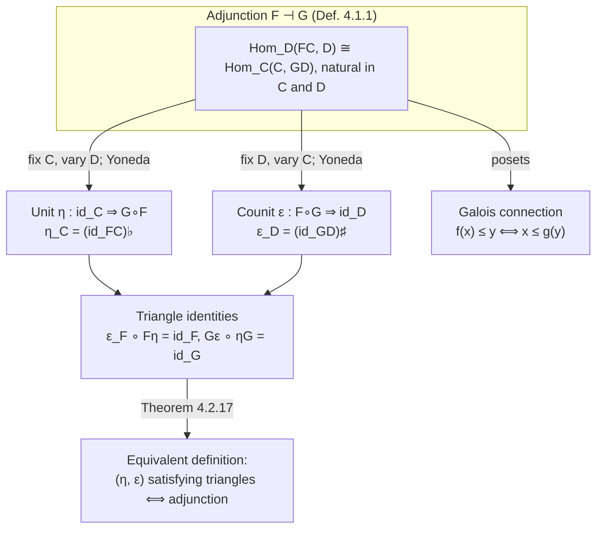
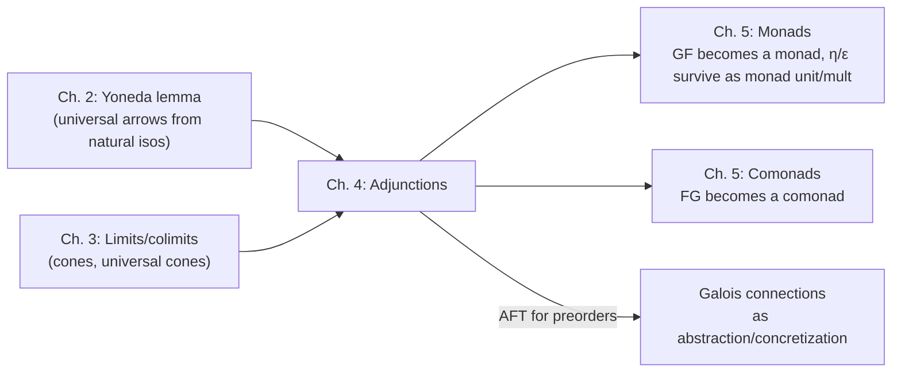

# Adjunctions

[[book-guidelines|↩ Back to guidelines]]

## The problem adjunctions solve

Every earlier chapter built one kind of machine: a way to say "this object is the *best* solution to some mapping-in / mapping-out problem" (a universal property), and a way to compute it (a limit or colimit). Adjunctions ask a slightly different question: instead of fixing one diagram and finding its best solution once, can we find a *systematic, functorial* way to move back and forth between two categories, so that morphisms on one side correspond, bijectively and coherently, to morphisms on the other?

Concretely: take the forgetful functor $U : \mathbf{Vect} \to \mathbf{Set}$ that strips a vector space down to its underlying set. This functor obviously loses information — many different vector spaces share the same underlying set. But there's a canonical, "least committal" way to go back: given a set $X$, build the vector space $FX$ of formal linear combinations of elements of $X$. This isn't an inverse to $U$ (composing $U \circ F$ does *not* give the identity on $\mathbf{Set}$ — $UFX$ is bigger than $X$ unless $X$ is empty). Yet $F$ and $U$ are locked together by a precise relationship: linear maps out of $FX$ correspond exactly, and naturally, to plain functions out of $X$.

$$
\mathrm{Hom}_{\mathbf{Vect}}(FX, V) \;\cong\; \mathrm{Hom}_{\mathbf{Set}}(X, UV)
$$

That bijection — natural in both $X$ and $V$ — *is* the adjunction. This chapter formalizes it, shows it collapses to something very old and concrete (Galois connections) when the categories are posets, extracts two canonical morphisms (the unit and counit) that pin the whole structure down, and proves that adjoints behave beautifully with respect to [[Limits-and-Colimits|limits and colimits]] — well enough that, for preorders, you can go the other direction and *derive* an adjoint purely from a preservation property. That last fact, the adjoint functor theorem, is exactly the abstract shape of concretization/abstraction pairs in abstract interpretation, so it's worth reading closely if that's part of your project.

Grounding note: because this chapter is thoroughly proof- and definition-driven — Yoneda-lemma arguments, universal-arrow diagram chases, natural-transformation coherence — **Lean is the primary grounding language here**, since `mathlib`'s `CategoryTheory.Adjunction` is close to a literal transcription of Perrone's definitions. Rust appears secondarily wherever a concrete, checkable data structure helps (free monoid, path category as an AST). Python appears only for quick throwaway illustrations.

---

## 1. Adjoint functors and hom-set bijections

### 1.1 The definition

**Definition 4.1.1.** Let $\mathcal{C}$ and $\mathcal{D}$ be categories and $F : \mathcal{C} \to \mathcal{D}$, $G : \mathcal{D} \to \mathcal{C}$ [[Functors|functors]]. An **adjunction** between $F$ and $G$ is a bijection

$$
\mathrm{Hom}_{\mathcal{D}}(FC, D) \;\xrightarrow{\;\cong\;}\; \mathrm{Hom}_{\mathcal{C}}(C, GD)
$$

for every object $C$ of $\mathcal{C}$ and $D$ of $\mathcal{D}$, **natural in both $C$ and $D$**. $F$ is the **left-adjoint**, $G$ the **right-adjoint**, written $F \dashv G$. The two maps related by this bijection are called **transpose** or **adjunct** to each other; the book writes $f^\sharp$ ("sharp") for a map $FC \to D$ and $f^\flat$ ("flat") for its transpose $C \to GD$.

Two things to internalize immediately, because the notation hides them:

1. **The relation is not symmetric.** $F \dashv G$ and $G \dashv F$ are entirely different statements about entirely different bijections. Left and right are load-bearing, not decorative.
2. **Naturality is not optional decoration on top of "a bijection exists for each $C, D$."** A merely pointwise bijection (one for each pair of objects, with no coherence between them) is a much weaker, much less useful notion — it's naturality that lets you slide morphisms of $\mathcal{C}$ and $\mathcal{D}$ *through* the correspondence, which is what makes the unit/counit machinery in §2 possible at all. This is the chapter's first Key Question, and it resurfaces as Lemma 4.2.6 below.

**What breaks without naturality.** If the bijection $\mathrm{Hom}_{\mathcal D}(FC,D) \to \mathrm{Hom}_{\mathcal C}(C,GD)$ were only required to exist for each fixed pair $(C,D)$ — no compatibility as $C$ or $D$ varies along a morphism — you could not compose adjunctions, could not derive a *canonical* unit map $\eta_C : C \to GFC$ (you'd have infinitely many unrelated bijections to choose representatives from), and the entire "$G$ preserves limits" theorem in §5 would fail, because that proof is a diagram chase that only closes because the bijection commutes with post- and pre-composition. Naturality is what turns "there happens to be the same number of morphisms on both sides" into "these two hom-functors are secretly the same functor."

**Lean grounding.** `mathlib`'s `CategoryTheory.Adjunction.Core` defines almost exactly this:

```lean
structure Adjunction (F : C ⥤ D) (G : D ⥤ C) where
  homEquiv : ∀ (X : C) (Y : D), (F.obj X ⟶ Y) ≃ (X ⟶ G.obj Y)
  homEquiv_naturality_left_symm :
    ∀ {X X' Y} (f : X' ⟶ X) (g : X ⟶ G.obj Y),
      (homEquiv X' Y).symm (f ≫ g) = F.map f ≫ (homEquiv X Y).symm g
  homEquiv_naturality_right :
    ∀ {X Y Y'} (f : F.obj X ⟶ Y) (g : Y ⟶ Y'),
      (homEquiv X Y').toFun (f ≫ g) = (homEquiv X Y).toFun f ≫ G.map g
```

`homEquiv` is exactly the bijection $\mathrm{Hom}_{\mathcal D}(FC,D) \simeq \mathrm{Hom}_{\mathcal C}(C,GD)$; the two naturality fields are exactly "naturality in $C$" and "naturality in $D$" spelled out as commuting-square equations rather than diagrams. Nothing here is a metaphor — this *is* Perrone's Definition 4.1.1, encoded so Lean's kernel can check it.

**Rust grounding.** There's no first-class notion of "natural bijection between hom-sets" in Rust's type system (it isn't dependently typed, and traits don't carry proof obligations), but you can sketch the *shape*: a pair of conversion functions between two representations of "a morphism from the free side into a target," which is exactly what an adjunction gives you for the free-forgetful case below.

```rust
// Not a general adjunction (Rust can't express the naturality law),
// but the shape for one concrete pair F ⊣ G, sharp/flat as named conversions.
trait Adjoint<C, D> {
    fn sharp(flat_map: C) -> D; // C → G D  ⟹  F C → D  (apply F, "unfold")
    fn flat(sharp_map: D) -> C; // F C → D  ⟹  C → G D  (restrict, "fold")
}
```

### 1.2 Free-forgetful adjunctions

The most common source of adjunctions in ordinary mathematics is a **forgetful functor** $U$ paired with a **free construction** $F$ that goes back in the least committal way possible.

**Example 4.1.2 (Top/Set).** $U : \mathbf{Top} \to \mathbf{Set}$ forgets a topology. Given a set $X$, the *discrete topology* $FX$ (every subset open) is the "least committal" topology you can put back on $X$: every function *out of* $FX$ into any space $S$ is automatically continuous, because $f^{-1}(O)$ is open in $FX$ no matter what $O \subseteq S$ is. That gives exactly the bijection

$$\mathrm{Hom}_{\mathbf{Top}}(FX, S) \cong \mathrm{Hom}_{\mathbf{Set}}(X, US),$$

since a continuous function $FX \to S$, considered as *just* a function, is a function $X \to US$; and conversely every function $X \to US$ automatically becomes continuous once its domain carries the discrete topology.

**Example 4.1.5 (Vect/Set).** $U : \mathbf{Vect} \to \mathbf{Set}$ forgets vector-space structure. The free construction $FX$ is the vector space of **formal linear combinations** $a_1 x_1 + \dots + a_n x_n$ (over $\mathbb{R}$, $x_i \in X$, $n$ finite but arbitrary) — crucially, these expressions are *not evaluated*; $X$ isn't a vector space, so "$a_1 x_1$" is just a syntax tree until something tells you how to interpret it. $X$ is a basis of $FX$. On morphisms, $F$ acts by extending pointwise: $Ff(a_1x_1 + \dots) := a_1 f(x_1) + \dots$.

This "formal expression, not yet evaluated" reading is worth sitting with, because it's the cleanest possible picture of what a **free construction** *is*: the syntactic closure of a set of generators under some operations, with no relations imposed beyond the bare minimum (linearity) needed to make the target type-correct. This is precisely the free monoid / free monad pattern you already know from functional-programming ASTs.

**Rust grounding — the free vector space as a literal AST.** The "formal linear combination, not yet evaluated" reading translates directly into a data type and an evaluator, which is exactly $\varepsilon_V$ (the counit, §3) doing its job:

```rust
// F : Set -> Vect. FX is literally an unevaluated expression tree over generators X.
enum FreeVec<X> {
    Zero,
    Gen(X),                                   // the "trivial" combination 1·x
    Add(Box<FreeVec<X>>, Box<FreeVec<X>>),
    Scale(f64, Box<FreeVec<X>>),
}

// U : Vect -> Set is just "forget you can add/scale" — i.e. erase nothing,
// the underlying set of a Vec<f64>-backed space is that Vec<f64> itself.

// The counit ε_V : F(U V) -> V performs the formal expression:
fn eval(e: &FreeVec<f64>) -> f64 {   // specialized to V = ℝ, U V = ℝ as a set
    match e {
        FreeVec::Zero => 0.0,
        FreeVec::Gen(x) => *x,
        FreeVec::Add(a, b) => eval(a) + eval(b),
        FreeVec::Scale(c, a) => c * eval(a),
    }
}
```

`eval` is literally Perrone's $\varepsilon_{\mathbb{R}}(2 \cdot 3 + 2 \cdot 1) = 8$ (Example 4.2.13) — the formal expression "$2\cdot3+2\cdot1$" and the number "$8$" are different terms of `FreeVec` vs. `f64`, related by `eval`, not equal.

**Lean grounding.** This is exactly `FreeAbelianGroup`, `FreeModule`, or in the monoid case `FreeMonoid α := List α` in mathlib — a free monoid on `α` literally *is* the type of lists, with `FreeMonoid.lift : (α → M) → (FreeMonoid α →* M)` being $(-)^\sharp$: extend a function on generators uniquely to a monoid homomorphism. The universal property Perrone proves by hand in Example 4.1.5 (`𝑙` restricts to a function on the basis; conversely every function on the basis extends uniquely) is exactly `FreeMonoid.lift`'s defining equation plus its uniqueness lemma.

**What breaks without freeness.** If you tried to define $F$ by picking *some* vector space structure on $X$ rather than the free (relation-free) one, you'd lose naturality and uniqueness of the extension: e.g. if $FX$ were forced to satisfy some extra relation like $x_1 + x_2 = 0$, then a function $f: X \to UV$ with $f(x_1) + f(x_2) \ne 0$ in $V$ would have *no* linear extension at all, breaking the bijection. Freeness is exactly "impose no relations beyond what's needed for well-typedness," which is why it's unique and why it's a left adjoint (initial among ways of embedding $X$ into a vector space).

### 1.3 Galois connections

When $\mathcal{C}$ and $\mathcal{D}$ are **posets** (viewed as categories with at most one morphism $x \to y$, present iff $x \le y$), an adjunction between monotone maps $f : X \to Y$, $g : Y \to X$ specializes to something much older:

**Definition 4.1.9.** A **Galois connection** (or Galois correspondence) is an adjunction $f \dashv g$ between posets. $f$ (left-adjoint) is the **lower adjoint**, $g$ (right-adjoint) the **upper adjoint**.

Because a hom-set in a poset has at most one element, the "natural bijection of hom-sets" degenerates to a biconditional — no naturality condition to check, it's automatic:

$$
f(x) \le y \iff x \le g(y).
$$

**Example 4.1.10 (convex hull as a lower adjoint).** Let $X$ = all subsets of $\mathbb{R}^2$, $Y$ = convex subsets of $\mathbb{R}^2$, both ordered by inclusion. The inclusion $i : Y \to X$ ("forget convexity") is the upper adjoint; its lower adjoint is the **convex-hull** map $c : X \to Y$. The Galois-connection condition $c(S) \subseteq C \iff S \subseteq C$ (for $C$ convex) says exactly: *the convex hull of $S$ is the smallest convex set containing $S$* — the usual definition, now derived rather than assumed.

**This is the load-bearing section for abstract interpretation.** A Galois connection between a concrete domain and an abstract domain — $\alpha : \mathcal{C} \to \mathcal{A}$ (abstraction, lower adjoint) and $\gamma : \mathcal{A} \to \mathcal{C}$ (concretization, upper adjoint) with $\alpha(c) \le a \iff c \le \gamma(a)$ — is *exactly* Definition 4.1.9, applied to the lattice of concrete program states and a lattice of abstract facts (intervals, signs, polyhedra, …). The condition "$g$ preserves all infima $\iff$ $g$ has a lower adjoint" you'll meet in §4 below is the precise reason a monotone, meet-preserving concretization function $\gamma$ is *guaranteed* to admit a best abstraction function $\alpha$ — you don't have to invent $\alpha$ by hand, the adjoint functor theorem constructs it for you as an infimum. This is worth remembering by name (Galois connection, lower/upper adjoint) rather than by vibe, because it's exactly the vocabulary the abstract-interpretation literature (Cousot & Cousot) uses.

**Lean grounding.** `mathlib`'s `GaloisConnection` is, again, essentially verbatim:

```lean
def GaloisConnection [Preorder α] [Preorder β] (l : α → β) (u : β → α) :=
  ∀ a b, l a ≤ b ↔ a ≤ u b
```

with lemmas `GaloisConnection.l_le_u_l`, `GaloisConnection.u_l_le`, etc. — these are precisely the poset-degenerate unit and counit of §2, proved generically once and reused for every concrete instance (this is literally what `mathlib`'s order theory does for closure operators, Galois insertions for `ClosureOperator`, and topological closure).

---

## 2. Unit and counit as universal arrows

### 2.1 Where they come from

Fix $C$ in $\mathcal{C}$ and let $D$ vary. The adjunction bijection, natural in $D$, says the functors $\mathrm{Hom}_{\mathcal D}(FC, -)$ and $\mathrm{Hom}_{\mathcal C}(C, G-)$ are naturally isomorphic — i.e. **$\mathrm{Hom}_{\mathcal C}(C, G-)$ is representable, represented by $FC$**. Intuitively (in the "representable functor as a probe" language from Chapter 2): probing $D$ indirectly, by first mapping $D \mapsto GD$ via $G$ and then probing $GD$ with $C$, gives exactly the same information as probing $D$ directly with $FC$.

By [[The-Yoneda-Lemma|the Yoneda lemma]], a natural isomorphism $\mathrm{Hom}_{\mathcal D}(FC,-) \Rightarrow \mathrm{Hom}_{\mathcal C}(C, G-)$ is pinned down uniquely by where it sends $\mathrm{id}_{FC}$ — a single element of $\mathrm{Hom}_{\mathcal C}(C, GFC)$. Setting $D := FC$:

**Definition 4.2.1 (unit).** $\eta_C := (\mathrm{id}_{FC})^\flat : C \to GFC$ is the **unit of the adjunction at $C$**.

Concretely, this recovers the universal property you'd expect: for any $D$ and any $f^\flat : C \to GD$, there is a **unique** $f^\sharp : FC \to D$ making

$$
\begin{array}{ccc}
C & \xrightarrow{\eta_C} & GFC \\
{}_{f^\flat}\!\!\searrow & & \downarrow{}_{Gf^\sharp} \\
& GD &
\end{array}
$$

commute. So $\eta_C$ is the *canonical* map into $GFC$ through which every map $C \to GD$ factors uniquely — a genuine universal-arrow, in the sense of Chapter 2's [[Universal-Properties|universal properties]].

**Example 4.2.2 (unit for Vect/Set).** $\eta_X : X \to UFX$ is the map $x \mapsto 1 \cdot x$: the embedding of $X$ into $FX$'s underlying set as the "trivial" (single-generator) linear combinations. The universal-property diagram then reads: any function $f : X \to UV$ extends *uniquely* to a linear map $f^\sharp : FX \to V$, and $Uf^\sharp \circ \eta_X = f$ says precisely that $f^\sharp$ restricted back to the trivial combinations recovers $f$ — i.e. $f^\sharp$ really is an *extension* of $f$, not some unrelated map.

Dually, fixing $D$ and letting $C$ vary gives the **counit**:

**Definition 4.2.11 (counit).** $\varepsilon_D := (\mathrm{id}_{GD})^\sharp : FGD \to D$, natural in $D$, giving $\varepsilon : F \circ G \Rightarrow \mathrm{id}_{\mathcal D}$.

**Example 4.2.13 (counit for Vect/Set).** $\varepsilon_V : FUV \to V$ takes a *formal* linear combination of vectors of $V$ and evaluates it — literally the `eval` function above. As formal syntax, "$2\cdot 3 + 2\cdot 1$" and "$8$" are different elements of $FUV$'s underlying free vector space and $V = \mathbb{R}$ respectively; $\varepsilon_{\mathbb R}$ is the map that computes one from the other. Perrone flags this as a very general phenomenon: **the counit of a free-forgetful adjunction is exactly the "extra structure" of the target category, expressed as a map** — here, literally the vector-space addition/scaling operation packaged as a single map $FUV \to V$. This observation is the seed of the entire monad chapter that follows (a monad is, informally, "$GF$ together with the coherence that lets you build $\varepsilon$-like evaluation maps everywhere").

### 2.2 Naturality survives translation: Lemma 4.2.6

Before proving $\eta$ itself is natural in $C$ (not just a universal arrow at one fixed $C$), the book proves a technical but genuinely central fact:

**Lemma 4.2.6.** For $f^\sharp : FC \to D$, $g^\sharp : FC' \to D'$, $h : C \to C'$, $k : D \to D'$, the square

$$FC \xrightarrow{f^\sharp} D,\quad Fh \downarrow\;, \quad k\downarrow\;,\quad FC' \xrightarrow{g^\sharp} D' \qquad (\text{i.e. } k\circ f^\sharp = g^\sharp \circ Fh)$$

commutes in $\mathcal D$ **iff** the transposed square $C \xrightarrow{f^\flat} GD$, $h\downarrow$, $Gk\downarrow$, $C' \xrightarrow{g^\flat} GD'$ (i.e. $Gk\circ f^\flat = g^\flat \circ h$) commutes in $\mathcal{C}$.

Read this as: *the $\sharp/\flat$ correspondence is "rigid" — it doesn't just relate individual morphisms, it relates entire *commuting-diagram statements* between the two categories.* Every later proof in the chapter (naturality of $\eta$, the triangle identities, "$R$ preserves limits") is a diagram in one category translated via Lemma 4.2.6 into an equivalent, often much simpler, diagram in the other. This is the real payoff of insisting on *natural* bijections in Definition 4.1.1: naturality is precisely what makes this translation trick legal.

Applying Lemma 4.2.6 to the naturality square for $\eta$ moves it from $\mathcal{C}$ (where it's not obviously true) into $\mathcal{D}$, where it becomes the trivially-commuting square $\mathrm{id}_{FC} \circ Fh = Fh \circ \mathrm{id}_{FC}$ (Lemma 4.2.8's proof). This "push the hard diagram through $\sharp$ or $\flat$ until it's trivial" move recurs constantly — it's worth recognizing as a pattern, not re-deriving each time.

### 2.3 Triangle identities and the alternative definition

Given $\eta$ and $\varepsilon$ as [[Natural-Transformations|natural transformations]], do they determine an adjunction back? Almost — you need two extra coherence conditions, the **triangle identities**:

**Lemma 4.2.15.**

$$
\begin{array}{ccc}
F & \xrightarrow{F\eta} & FGF \\
{}_{\mathrm{id}_F}\downarrow & & \downarrow{}_{\varepsilon F} \\
& F &
\end{array}
\qquad\qquad
\begin{array}{ccc}
G & \xrightarrow{\eta G} & GFG \\
{}_{\mathrm{id}_G}\downarrow & & \downarrow{}_{G\varepsilon} \\
& G &
\end{array}
$$

In components, for every $C$: $\varepsilon_{FC} \circ F\eta_C = \mathrm{id}_{FC}$; and for every $D$: $G\varepsilon_D \circ \eta_{GD} = \mathrm{id}_{GD}$.

Read in words: "unit-then-counit" and "counit-then-unit," suitably whiskered by $F$ or $G$, must cancel back to the identity. Concretely for Vect/Set: take a generator $x \in X$, embed it via $\eta$ as $1\cdot x \in F(UFX)$ — wait, apply $F\eta_X : FX \to FUFX$ first (turn each generator into its trivial combination, formally, inside the *bigger* free space over $UFX$), then evaluate with $\varepsilon_{FX}$ — you get back exactly the combination you started with. It's the categorical incarnation of "wrapping a value and then immediately unwrapping it is a no-op," the same law you'd write for any `wrap`/`unwrap` pair implementing a well-behaved free/forgetful pattern in code.

**Theorem 4.2.17.** An adjunction $F \dashv G$ is *equivalently* given by a pair of natural transformations $\eta : \mathrm{id}_{\mathcal C} \Rightarrow GF$, $\varepsilon : FG \Rightarrow \mathrm{id}_{\mathcal D}$ satisfying the triangle identities.

This is the version you actually use in practice — checking two coherence squares is usually far easier than checking a natural bijection of hom-sets directly, especially once diagrams get complicated (as in the categories/multigraphs example next).

**Lean grounding.** `mathlib` literally carries both formulations and a constructor between them. `Adjunction.mkOfHomEquiv` builds one from the hom-set bijection (Definition 4.1.1's form); `Adjunction.mkOfUnitCounit` builds one from $(\eta, \varepsilon)$ plus exactly the triangle identities, spelled `left_triangle` / `right_triangle`:

```lean
structure CoreUnitCounit (F : C ⥤ D) (G : D ⥤ C) where
  unit   : 𝟭 C ⟶ F ⋙ G
  counit : G ⋙ F ⟶ 𝟭 D
  left_triangle  : whiskerRight unit F ≫ whiskerLeft F counit = ...  -- F η ≫ ε F = id F
  right_triangle : whiskerLeft G unit ≫ whiskerRight counit G = ...  -- η G ≫ G ε = id G
```

That `left_triangle`/`right_triangle` pair is Lemma 4.2.15 verbatim, and Lemma 4.2.16's proof (that these two conditions make $\sharp$ and $\flat$ mutually inverse) is the content of the `Equiv` that `Adjunction.mkOfUnitCounit` hands back. If you ever build an elaborator's own notion of "insert an implicit coercion, then later erase it" as a well-behaved pair, this is the law you want it to satisfy — a coercion-insertion/elaboration round-trip that doesn't cancel to the identity is a coercion that silently corrupts terms.

### 2.4 Worked example: categories and multigraphs, $P \dashv U$

This is the chapter's running example and it's worth working through in full, because it is a second, structurally different instance of the free/forgetful pattern — one that maps directly onto "parse a term, then elaborate/normalize it."

- $U : \mathbf{Cat} \to \mathbf{MGraph}$ sends a small category to its **underlying multigraph**: objects become vertices, *all* morphisms (including identities) become edges.
- $P : \mathbf{MGraph} \to \mathbf{Cat}$ sends a multigraph $G$ to its **free (path/fundamental) category** $P(G)$: objects are vertices, morphisms are **chains** (finite, possibly empty, sequences of head-to-tail edges), composition is **concatenation of chains**, identities are the empty chains.

**Unit** $\eta_G : G \to UP(G)$ is the inclusion of $G$'s edges into $P(G)$'s morphisms as length-1 chains. It's an inclusion, not an isomorphism: $UP(G)$ has *extra* edges that $G$ didn't — the identity loops and the composite edges (e.g. a chain $x \xrightarrow{e_1} y \xrightarrow{e_2} z$ in $G$ becomes an *additional* direct edge $x \to z$ in $UP(G)$, corresponding to the 2-chain $(e_1,e_2)$). Perrone's own remark (4.2.23) makes this precise: when you draw a commutative diagram like $X \xrightarrow{f} Y \xrightarrow{g} Z$, you're implicitly invoking $P$ — the category it generates silently also has $\mathrm{id}_X, \mathrm{id}_Y, \mathrm{id}_Z$, and $g\circ f$, even though you only drew three arrows. $P$ is the rigorous operation of "close a raw graph of primitive edges under identities and composition" — which is *exactly* what elaboration does to a raw parse tree of primitive syntactic applications: it doesn't add new "surface" edges, but it computes and inserts the derived structure (normalized compositions, reflexivity proofs) that the type theory's judgmental-equality machinery needs to be well-founded.

**Counit** $\varepsilon_{\mathcal D} : PU(\mathcal D) \to \mathcal D$ takes a *chain* of composable morphisms $(f_1, \dots, f_n)$ of a category $\mathcal D$ (a syntactic tuple — not yet composed) and sends it to their **actual composite** $f_n \circ \cdots \circ f_1$ (empty chains go to identities). This is the exact analogue of $\varepsilon_V$ evaluating a formal linear combination: $\varepsilon_{\mathcal D}$ evaluates a formal chain of morphisms into the single morphism it denotes. Once again, the counit *is* the extra structure ($\mathcal D$'s composition law) reified as a map.

**Rust grounding — the free category as a literal AST + evaluator.** This maps almost verbatim onto a symbolic path/proof-term representation and its normalizer:

```rust
// U : Cat -> MGraph — a category, viewed as just its raw edge set
struct MGraph<V, E> { vertices: Vec<V>, edges: Vec<(E, V, V)> } // (edge, source, target)

// P : MGraph -> Cat — chains of edges, NOT yet composed (this is P(G))
type Chain<E> = Vec<E>;   // empty = identity; [e] = the 1-chain η_G(e)

// η_G : G -> U(P(G)) — embed a raw edge as the singleton chain
fn unit<E: Clone>(e: &E) -> Chain<E> { vec![e.clone()] }

// ε_D : P(U(D)) -> D — evaluate a chain of *actual* morphisms into their composite.
// `compose` is D's real composition law; this is where the "extra structure"
// (associativity, identities) that P doesn't know about gets used.
fn counit<M: Clone>(chain: &[M], compose: impl Fn(&M, &M) -> M, id: M) -> M {
    chain.iter().cloned().fold(id, |acc, f| compose(&acc, &f))
}
```

`Chain<E>` is precisely an unevaluated derivation — a list of composable steps — and `counit` is precisely a proof-term normalizer that folds a derivation into its single resulting judgment. If you're building a kernel that stores derivations as trees of primitive rule applications and only "runs" them (checks/executes) on demand, `PU` vs. its evaluation by $\varepsilon$ is exactly that separation between *syntax of a proof* and *its checked result*.

**Triangle identities, concretely.** The first triangle identity ($\varepsilon_{PG}\circ P\eta_G = \mathrm{id}_{PG}$) says: take a chain $(e_1,\dots,e_n)$ in $P(G)$, embed each edge as a singleton chain via $\eta_G$ (giving a chain-of-chains $((e_1),\dots,(e_n))$), then concatenate (that's what $P$'s own composition does) — you get back $(e_1,\dots,e_n)$. In other words, singleton-wrapping followed by concatenation is a no-op, exactly the way `chain.iter().map(|e| vec![e]).concat()` returns the original `chain` in the Rust sketch above.

### 2.5 A structural picture of the chapter so far



---

## 3. Adjunctions preserve limits and colimits

### 3.1 The theorem

**Theorem 4.3.1.** Right-adjoint functors are **continuous** (preserve all limits that exist).
**Corollary 4.3.2.** Left-adjoint functors are **cocontinuous** (preserve all colimits that exist).

Caveat worth flagging explicitly, because it's an easy mix-up with the earlier "representable functors are continuous" theorem from Chapter 3: that earlier result reverses only *one* category's arrows (a presheaf turns colimits into limits). Here *both* $\mathcal C$'s and $\mathcal D$'s arrows are involved, so a left-adjoint sends colimits to colimits (same variance), not colimits to limits.

**Intuition (binary product case, §4.3.1).** $R$ (right-adjoint to $L$) preserves the product $A \times B$ because probing $R(A\times B)$ with $C$ is, via the adjunction, the same as probing $A \times B$ directly with $LC$ — and probing a product directly always splits into probing the two factors separately (that's the product's own universal property). So $R$ "inherits" the splitting for free: $R(A\times B) \cong RA \times RB$. In the "probe/extract features" language from Chapter 2 and 3: **right-adjoints don't manufacture spurious interactions between components that weren't already there** — a phenomenon the book earlier called functors "detecting complexity" (recall the power-set and probability functors, which *do* create spurious cross-component interaction and hence fail to preserve products). Right-adjoints are, in this precise sense, the well-behaved functors.

### 3.2 The proof mechanism: cones transpose too

**Lemma 4.3.4.** For $L \dashv R$ and a diagram $E : \mathcal{J} \to \mathcal{D}$, the adjunction bijection lifts to a bijection on cones, natural in $C$:

$$
\mathrm{Cone}(LC, E) \;\cong\; \mathrm{Cone}(C, R \circ E).
$$

[[The-Yoneda-Lemma#The proof|The proof]] is Lemma 4.2.6 applied entry-wise to a cone's family of legs: a family $\{\alpha_I : LC \to EI\}$ commuting with the diagram's own morphisms transposes, leg by leg, to a family $\{\alpha_I^\flat : C \to REI\}$ that *also* commutes with the diagram's morphisms (now composed with $R$) — because Lemma 4.2.6 says commuting-square-ness is exactly preserved by $\sharp/\flat$. Chaining this with the universal property of $\lim E$ itself gives the theorem in one line:

$$
\mathrm{Cone}(C, R\circ E) \cong \mathrm{Cone}(LC, E) \cong \mathrm{Hom}_{\mathcal D}(LC, \lim E) \cong \mathrm{Hom}_{\mathcal C}(C, R(\lim E)),
$$

i.e. $R(\lim E)$ satisfies exactly the universal property that $\lim(R\circ E)$ is *defined* to satisfy — so $R(\lim E) \cong \lim(R \circ E)$, "$R$ commutes with taking limits."

### 3.3 Worked examples

- $U : \mathbf{Top}\to\mathbf{Set}$ has **both** a left-adjoint (discrete topology, Example 4.1.2) and a right-adjoint (indiscrete/trivial topology, Exercise 4.1.4), hence it's both continuous *and* cocontinuous: the underlying set of a product of spaces is the cartesian product of sets, and the underlying set of a coproduct is the disjoint union.
- $U : \mathbf{Vect} \to \mathbf{Set}$ has only a left-adjoint ($F$, free vector space), so it's continuous but *not generally cocontinuous*: products/equalizers of vector spaces behave setwise as expected (an equalizer of linear maps is a genuine subspace, its underlying set literally a subset), but coproducts don't behave setwise (the coproduct of vector spaces is a direct sum, not a disjoint union of underlying sets). Dually, $F$ (the left-adjoint) is cocontinuous: the free vector space on a disjoint union is the direct sum of the two free spaces, and the free vector space on the empty set is the zero space.
- The multigraph adjunction gives, essentially for free, the product and coproduct of categories in $\mathbf{Cat}$: since $U$ is a right-adjoint, the underlying multigraph of a product of categories is forced to be the product of the underlying multigraphs.

**What breaks without an adjoint.** A forgetful functor with *no* left-adjoint at all can fail to preserve even the limits/colimits you'd naively expect — there's no guaranteed mechanism forcing it to. This is exactly why "does this functor have an adjoint" is a genuinely useful diagnostic question to ask about any structure-forgetting map you define in a compiler or verifier: if your "erase to untyped AST" functor doesn't have a free/adjoint counterpart, you have no a priori guarantee it interacts well with your language's meet/join operations on types (subtyping lattices, refinement-type intersections) — which is precisely the setup of §4.

---

## 4. The adjoint functor theorem for preorders

### 4.1 Statement

Theorem 4.3.1 has a converse for preorders — this is the chapter's payoff, and the one most directly relevant if you're building anything abstract-interpretation-shaped.

**Theorem 4.4.1 (Adjoint functor theorem for preorders).** Let $(X,\le)$, $(Y,\le)$ be preorders, $Y$ having all infima. If $g : Y \to X$ is monotone and **preserves all infima**, then $g$ has a lower adjoint $f : X \to Y$, given explicitly by

$$
f(x) = \inf\{\, y \in Y \mid x \le g(y) \,\}.
$$

**Corollary 4.4.3 (dual).** If $X$ has all suprema, a monotone $f : X \to Y$ is a lower adjoint iff it preserves all suprema.

**In words:** a meet-preserving map $g$ doesn't just happen to sit on the right of *some* Galois connection — meet-preservation is *equivalent* to being an upper adjoint, and the theorem hands you the formula for the lower adjoint rather than asking you to guess it. This is the order-theoretic special case of the general adjoint functor theorem: preserving limits (here, infima) is not just necessary for having a left adjoint (Theorem 4.3.1) but, for well-behaved enough categories, *sufficient*.

### 4.2 Why this matters: reconstructing an abstraction map from a concretization map

This theorem is the formal justification for a move abstract interpretation makes constantly: you define the **concretization** $\gamma : A \to C$ (upper adjoint) by hand — it's usually the easy direction, "what set of concrete states does this abstract fact denote" — and you get the **abstraction** $\alpha : C \to A$ (lower adjoint) *automatically*, as

$$
\alpha(c) = \inf\{\, a \in A \mid c \le \gamma(a) \,\},
$$

**provided** $\gamma$ preserves meets (equivalently: $\gamma$ commutes with intersection of concrete states, which is a very natural condition — an abstract fact built by combining two abstract facts should concretize to *at most* the intersection of what each concretizes to). You never have to invent $\alpha$'s formula from scratch; it's forced. This is precisely why standard abstract-interpretation presentations quote the Galois-connection condition $\alpha(c) \le a \iff c \le \gamma(a)$ as *the* defining relationship, and it's why "does my concretization function preserve meets/infima" is the right question to ask before assuming a best abstraction exists — Theorem 4.4.1 is the theorem that turns that check into a guarantee.

### 4.3 Worked instance: convex hull, again, now derived rather than assumed

Example 4.4.1's proof, specialized to Example 4.1.10: infima in both $X$ (all subsets) and $Y$ (convex subsets) are intersections; $g = i$ (inclusion) preserves them because **the intersection of convex sets is convex**. Theorem 4.4.1 then hands you

$$
f(S) = \bigcap \{\, C \subseteq \mathbb{R}^2 \text{ convex} \mid S \subseteq C \,\},
$$

which is exactly the convex hull — the *smallest convex set containing $S$*, recovered mechanically rather than defined by fiat.

**Topological closure, the same pattern (Example 4.4.7).** $Y$ = closed subsets of a space $T$, $X$ = all subsets, $g$ = inclusion. Arbitrary intersections of closed sets are closed, so $g$ preserves infima, so it has a lower adjoint $f$, and $f(S) = \bigcap\{\text{closed } C \mid S \subseteq C\}$ — the **topological closure** of $S$. Same theorem, same three-line proof shape, completely different mathematical content: this is the real power of doing the argument once, abstractly, in order theory.

**The asymmetry is the diagnostic.** Perrone flags the sharpest practical consequence (§4.4.3): an upper adjoint preserving infima says *nothing* about suprema — and indeed, intersections of convex sets/closed sets/vector subspaces/subgroups are always well-behaved, while *unions* generally are not (union of two lines through the origin isn't a subspace; union of two subgroups generally isn't a subgroup). **Whenever you notice a family of "good" substructures closed under intersection but not union, that's the signature of a Galois connection sitting underneath**, with the "goodness" predicate as the upper adjoint's image. This is a genuinely transferable pattern-recognition skill: reachable-state over-approximations, downward-closed constraint sets, and admissible type-refinement predicates all tend to be meet-closed for exactly this structural reason, and checking "is this predicate meet-closed" is a cheap first test for "do I get a canonical abstraction/closure operator here for free."

### 4.4 Proof sketch, and why it's "purely order theory"

The proof (§4.4.2) is short precisely because it never leaves order theory: monotonicity of $f$ follows from "infimum over a larger index set is smaller"; the unit inequality $x \le g(f(x))$ follows because $x$ is a lower bound of $\{g(y) \mid x\le g(y)\}$ and $g(f(x))$ is its infimum, hence $x \le \inf(\cdots)$ by the universal property of infimum; the counit inequality $f(g(z)) \le z$ follows because $z$ itself is a member of the index set $\{y \mid g(z)\le g(y)\}$ (via $g(z)\le g(z)$), so $z$ dominates the infimum over that set. All naturality and triangle-identity conditions are automatic in a preorder — a hom-set has at most one element, so "the diagram commutes" is vacuous once both sides are shown to exist. This is worth noting as a general fact: **in the poset-degenerate case, Theorem 4.2.17's coherence conditions cost nothing**, which is part of why Galois connections were discovered (by Galois, in the 1830s, in the very different context of field extensions and subgroups) more than a century before the general categorical notion.

---

## Synthesis: where this sits in the book's structure



Everything in this chapter is downstream of two earlier tools and upstream of one big one. The unit and counit are literally an application of the Yoneda lemma (§2.1: "the natural isomorphism is specified uniquely by an element of $\mathrm{Hom}_{\mathcal C}(C,GFC)$" — that's Yoneda, cited explicitly). The limit/colimit-preservation proof is an application of Chapter 3's cone machinery, transposed via the adjunction. And going forward: composing an adjunction with itself, $GF$, is *exactly* how the next chapter defines a monad — the unit $\eta$ you derived here **is** the monad's unit, and the triangle identities you proved here are the seed of the monad's coherence laws. If you found the "counit evaluates a formal expression" reading of $\varepsilon_V$ and $\varepsilon_{\mathcal D}$ satisfying, that's not incidental — it's the book setting up the intuition for the Eilenberg-Moore algebra structure map, which is the same idea generalized past the free-forgetful special case.

**Directly load-bearing for the compiler/elaborator project:**
- The unit-counit/triangle-identity formalism (§2) is the correct discipline for any "insert a coercion or default, then later strip it back out" pair in an elaborator — the triangle identities are exactly the round-trip laws that make such an insertion sound rather than silently lossy.
- The categories/multigraphs adjunction $P \dashv U$ (§2.4) is a clean categorical account of "raw syntax tree" vs. "normalized/composed derivation," with the counit doing exactly the job of a proof-term normalizer or evaluator.
- The adjoint functor theorem for preorders (§4) is, essentially verbatim, the theorem that licenses deriving a best-abstraction function from a hand-written concretization function in an abstract-interpretation-based invariant generator — and the "meet-closed but not join-closed" diagnostic is a genuinely useful heuristic to carry into designing abstract domains and refinement-type lattices.

---

[[book-guidelines|↩ Back to guidelines]]
