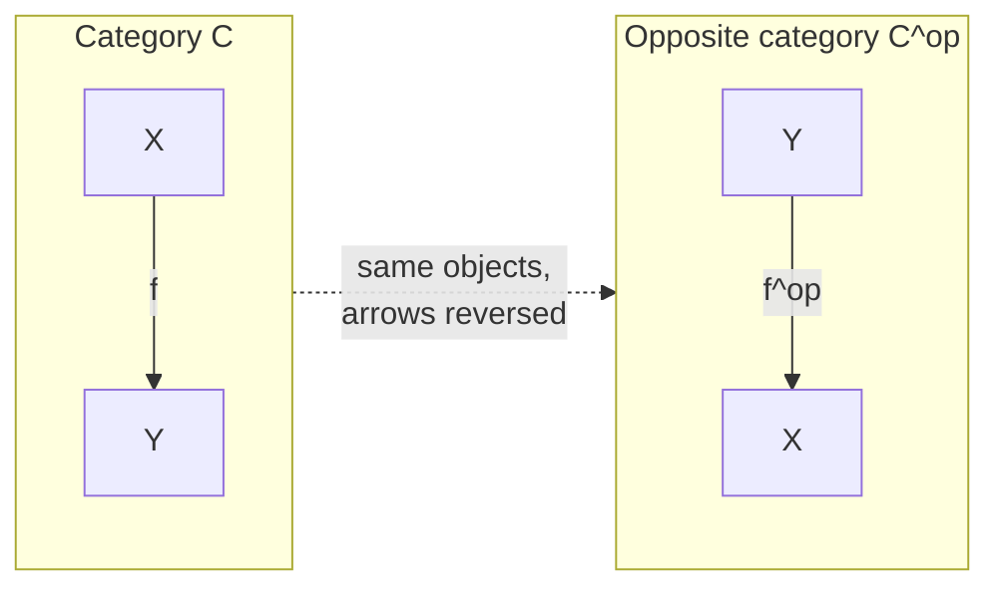
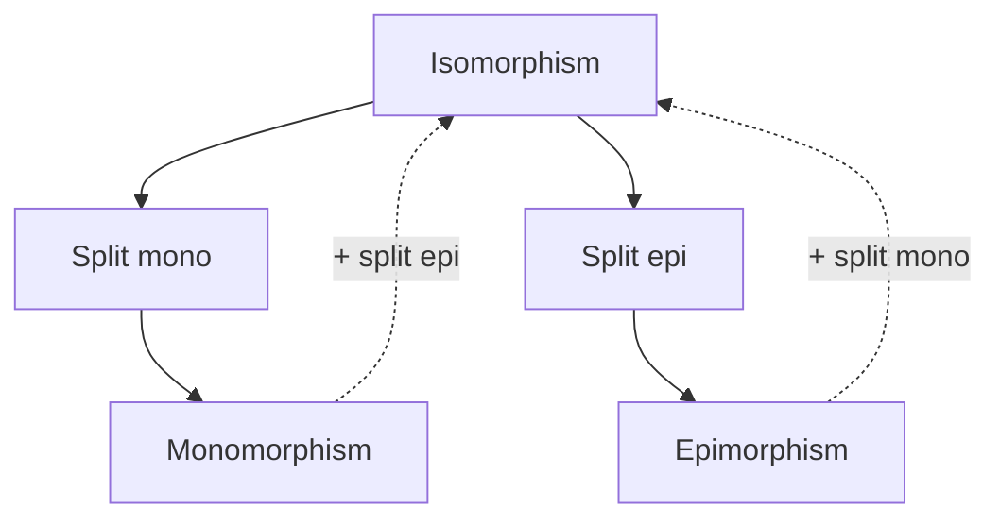
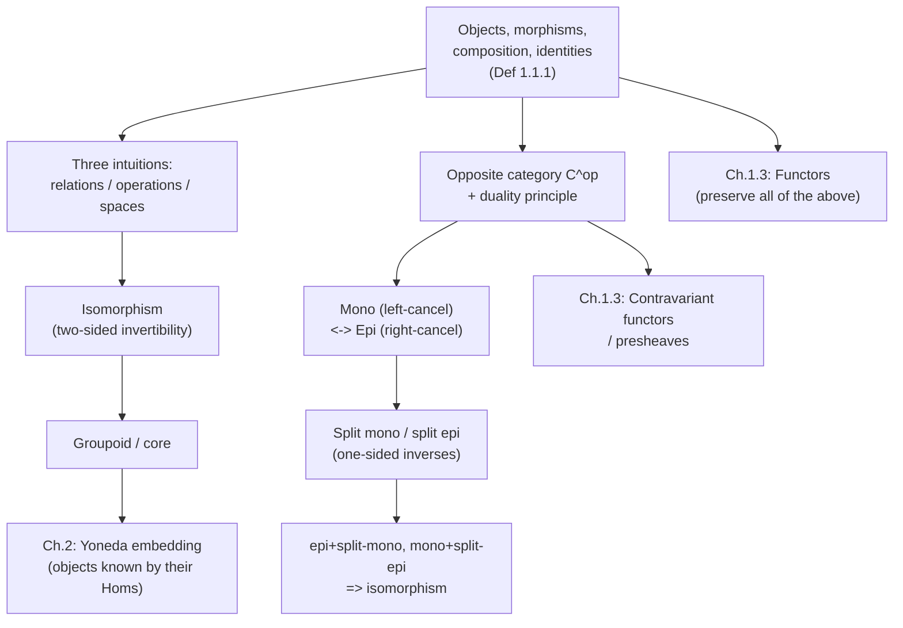

# Categories and Their Basic Structure

[[book-guidelines|↩ Back to guidelines]]

## Why bother with categories at all

Take any area of mathematics — sets, groups, topological spaces, vector spaces — and you'll
notice a recurring pattern: there are *things* (sets, groups, spaces) and there are *structure-preserving maps between things* (functions, homomorphisms, continuous maps, linear
maps). Every one of these settings independently rediscovers the same skeleton: you can compose two compatible maps to get a new one, composition is associative, and every object has a "do-nothing" map that acts as a neutral element for composition.

A category is the decision to stop treating that skeleton as a coincidence and study it directly,
stripped of everything that was specific to sets, or groups, or spaces. This is the same move a
programmer makes when they notice that `Vec<T>::map`, `Option<T>::map`, and `Result<T, E>::map` are "the same shape" and factor it into a `Functor` trait — except category theory did this for mathematics as a whole, a century's worth of *ad hoc* "this composes and it's associative" folklore turned into one four-line definition. Once you have that definition, theorems you prove about it apply uniformly to sets, groups, topological spaces, posets, and — as you'll see throughout this article — to type-theoretic structures like judgment derivations and definitional equality, without re-proving anything field by field.

That's the payoff. The cost is that the definition, on first read, looks like pure bookkeeping.
The rest of this article is about making that bookkeeping feel inevitable rather than arbitrary,
by building it up from three different intuitions the book itself uses (relations, operations,
spaces-with-maps) before landing on the formal notation.

## The formal definition: objects, morphisms, composition, identities

Here is Perrone's Definition 1.1.1, stated in full because every later concept in the book is
built directly on top of it. A **category** $\mathcal{C}$ consists of:

- a collection $\mathcal{C}_0$ of **objects**, typically written with uppercase letters $X, Y, Z, \dots$;
- a collection $\mathcal{C}_1$ of **morphisms** (or arrows), typically written with lowercase letters $f, g, h, \dots$;

such that:

- every morphism $f$ has a **source** $s(f)$ and **target** $t(f)$ — if $f$ has source $X$ and
  target $Y$ we write $f : X \to Y$;
- every object $X$ has a distinguished **identity morphism** $\mathrm{id}_X : X \to X$;
- for every pair of morphisms $f : X \to Y$ and $g : Y \to Z$ (i.e. $t(f) = s(g)$) there is a
  specified **composite morphism** $g \circ f : X \to Z$.

These pieces must satisfy two axioms:

- **Unitality**: for every $f : X \to Y$, $f \circ \mathrm{id}_X = f = \mathrm{id}_Y \circ f$.
- **Associativity**: for $f : X \to Y$, $g : Y \to Z$, $h : Z \to W$, we have $h \circ (g \circ f) = (h \circ g) \circ f$, so the triple composite can be written unambiguously as $h \circ g \circ f$.

One notational trap worth calling out explicitly because the book itself flags it: $g \circ f$
means "first $f$, then $g$" — the same right-to-left reading convention as ordinary function
composition, $\sin(\cos(x))$ applies $\cos$ first. Perrone recommends reading $g \circ f$ out loud
as "$g$ after $f$." This convention is *backwards* relative to how a diagram draws the arrows
($X \xrightarrow{f} Y \xrightarrow{g} Z$, left to right) — a small, permanent source of friction you just have to internalize.

**What breaks without associativity or identities.** Drop associativity and "composition" stops
being a well-defined single operation on chains of morphisms — you'd need to track *how* you
parenthesized every multi-step composite, the categorical equivalent of a language where `f(g(h(x)))` depends on evaluation order. Drop identities and you lose the ability to state "doing nothing" as a morphism, which turns out to matter enormously later: identities are exactly what lets you *compare* morphisms via the mono/epi and isomorphism machinery below, since every equation like $g \circ f = \mathrm{id}_X$ is stated *relative to* the identity as the canonical "no-op."

### Grounding: the category interface in Lean

Since this material is proof-theoretic in nature, Lean's `mathlib` gives the most literal possible
translation of Definition 1.1.1 — it is, almost verbatim, the `CategoryTheory.Category` structure:

```lean
class CategoryStruct (Obj : Type u) where
  Hom     : Obj → Obj → Type v
  id      : (X : Obj) → Hom X X
  comp    : {X Y Z : Obj} → Hom X Y → Hom Y Z → Hom X Z

class Category (Obj : Type u) extends CategoryStruct Obj where
  id_comp   : ∀ {X Y} (f : Hom X Y), comp (id X) f = f
  comp_id   : ∀ {X Y} (f : Hom X Y), comp f (id X) = f
  assoc     : ∀ {W X Y Z} (f : Hom W X) (g : Hom X Y) (h : Hom Y Z),
                comp (comp f g) h = comp f (comp g h)
```

(mathlib actually indexes homs by a universe and reverses `comp`'s argument order relative to the book's $g \circ f$, i.e. it defines `comp f g` to mean "$f$ then $g$" — a deliberate choice to make
`comp` read left-to-right like `>>` in Haskell/Rust's iterator chaining. Keep this in mind if you
ever read mathlib source directly: `f ≫ g` in Lean is the book's $g \circ f$.)

The `id_comp`/`comp_id`/`assoc` fields are *exactly* unitality and associativity — not an analogy,
the literal same equations. This matters for the bigger project this article set is building toward: once you have judgments and typing derivations as morphisms in a category (a very common move in categorical semantics of type theory — see "[[Comonads#Where this leads|Where this leads]]" below), `id_comp`/`assoc` are not bureaucracy, they are the soundness conditions your elaborator's substitution and composition of coercions must satisfy.

### Grounding: composition as a trait in Rust

Rust doesn't have a built-in categorical vocabulary, but you can sketch the shape directly. The
key design choice — and the one that trips people up — is that `Hom` is not one type, it is a
*family* of types indexed by two objects, which Rust encodes as an associated type parameterized by phantom source/target markers, or more pragmatically, as a trait over a fixed collection of "object" marker types:

```rust
trait Category {
    type Obj;
    type Hom<A: Self::Obj, B: Self::Obj>: Sized; // conceptually: morphisms A -> B

    fn id<A: Self::Obj>() -> Self::Hom<A, A>;
    fn compose<A: Self::Obj, B: Self::Obj, C: Self::Obj>(
        f: Self::Hom<A, B>,
        g: Self::Hom<B, C>,
    ) -> Self::Hom<A, C>;
    // laws (not checkable by the type system alone, must hold by construction):
    //   compose(id(), f) == f
    //   compose(f, id()) == f
    //   compose(compose(f, g), h) == compose(f, compose(g, h))
}
```

This won't compile as written in stable Rust (generic associated types over a bound like
`Self::Obj` need real trait objects or a type-level object encoding), but it's worth writing out
precisely *because* it fails cleanly: it shows exactly why "a category" is a strictly richer structure than "a `trait` with a `compose` method" — the indexing by source and target is the part
ordinary trait dispatch doesn't give you for free, and any real implementation (e.g. `Set`
realized as ordinary Rust functions `fn(A) -> B`) sidesteps this by picking one concrete category (functions between Rust types) rather than implementing the abstract interface.

## Three intuitions for what a category *is*

[[Functors#The formal definition|The formal definition]] is intentionally empty of content — objects and morphisms "can be
anything." Perrone deliberately builds up intuition from three different angles before returning to the abstract picture, and each one gives a genuinely different family of examples.

### Intuition 1 — categories from relations

**Idea.** *A category is a collection of objects related to each other in a consistent way.*

Any **preorder** — a relation $\lesssim$ satisfying only reflexivity ($x \lesssim x$) and transitivity ($x \lesssim y \land y \lesssim z \Rightarrow x \lesssim z$) — is a category: objects are the elements of the underlying set, and there is a *unique* morphism $x \to y$ exactly when $x \lesssim y$. Reflexivity supplies the identity morphisms, transitivity supplies composition, and both are automatically associative and unital because there's at most one morphism between any two objects (there's nothing to fail to associate).

- An **equivalence relation** ($\sim$, additionally symmetric) is the special case where every
  arrow that exists has a "way back" — this is your first hint of what a groupoid will be.
- A **partial order** ($\le$, additionally antisymmetric) is the special case where $x \to y$ and
  $y \to x$ both existing forces $x = y$.
- A general preorder sits between these: economics gives a clean example — "cheaper or equally priced" is reflexive and transitive but not antisymmetric (two goods can have the same price without being the same good).

**What breaks without transitivity.** Composition is literally transitivity here: without it,
"$x \to y$" and "$y \to z$" existing wouldn't guarantee "$x \to z$" exists, so you couldn't even
state the composition axiom, let alone satisfy it.

*Grounding (Lean).* This is precisely how `mathlib` turns a `Preorder` into a category — the
morphism type between `x` and `y` is `PLift (x ≤ y)`, a type with at most one inhabitant, and composition is literally `le_trans`:

```lean
instance (α : Type*) [Preorder α] : CategoryTheory.Category α where
  Hom X Y := PLift (X ≤ Y)
  id X := ⟨le_refl X⟩
  comp f g := ⟨le_trans f.down g.down⟩
```

Notice the shape: `Hom X Y` isn't data you construct freely, it's a *proposition* wrapped as a
type (`X ≤ Y` has at most one proof, up to proof irrelevance) — objects related "in at most one way." This is your first concrete example of the general slogan that a category with at most one morphism between any pair of objects is *exactly* a preorder (Perrone states this as Exercise 1.1.21, and it is worth internalizing early: whenever you see "there's a unique such-and-such," a preorder-shaped category is often lurking).

### Intuition 2 — categories from groups and monoids

**Idea.** *A category is a collection of operations that compose consistently.*

Recall a **group**: a set $G$ with a unit $1$, an associative multiplication, and inverses. A
**monoid** is the same minus inverses. Both look *almost* like categories already — the unit
behaves like an identity, multiplication is associative like composition — except a group has no notion of "source and target" to match up. The fix is almost too simple: force every element to have the *same* source and target, i.e. build a category with a **single object**.

**Definition 1.1.7 (delooping).** For a group (or monoid) $G$, the delooping $BG$ is the category
with:

- one object $\bullet$;
- one morphism $\bullet \to \bullet$ for every $g \in G$;
- identity given by $1 \in G$;
- composition given by multiplication: $g \circ h$ (morphisms) $:=$ $g \cdot h$ (group elements).

Unitality and associativity of the category fall directly out of the group axioms. Graphically,
$BG$ is a single point with a loop for every element of $G$, one of which is distinguished as the
identity. $BG$ genuinely contains the *same information* as $G$ — it's a repackaging, not a
generalization — which is why the book keeps the two notions notationally distinct even though some authors just say "a group is a one-object category."

Crucially, the group/monoid *inverses* were never used to build $BG$ as a category — you only need unit and associative multiplication. That's exactly the monoid case: e.g. all linear maps
$V \to V$ (including non-invertible ones like the zero map) form a monoid under composition, and hence a one-object category $BM$. This is the book's running example of "structure without symmetry": Markov kernels iterated as $\{\mathrm{id}_X, k, k^2, k^3, \dots\}$ form a monoid (the
"Markov semigroup") precisely because most stochastic processes are not reversible.

**What breaks without the single-object restriction.** If you tried to deloop a group into a
category with, say, two objects, you'd have no canonical way to assign each group element a
source and target consistent with the multiplication table — the "matching source and target" requirement of composition is fundamentally incompatible with a *set* of objects unless the objects collapse to one.

*Grounding (Rust).* A monoid-as-category is one of the cleanest translations into Rust, because
Rust's own `std` already ships the algebraic half:

```rust
trait Monoid {
    fn identity() -> Self;
    fn combine(&self, other: &Self) -> Self;
    // laws: combine(identity(), x) == x == combine(x, identity())
    //       combine(combine(a,b),c) == combine(a, combine(b,c))
}

// B M as a one-object category: the single object is a phantom marker,
// morphisms are literally the monoid's elements, composition is `combine`.
struct BM<M: Monoid>(std::marker::PhantomData<M>);

impl<M: Monoid + Clone> BM<M> {
    fn id() -> M { M::identity() }
    fn compose(f: &M, g: &M) -> M { f.combine(g) } // "g after f", matching the book's g∘f order needs combine(g, f)
}
```

The phantom-typed wrapper is doing real conceptual work: it's the difference between "$M$ *is* a set of transformations" (the monoid itself) and "$M$ generates a category with one object" (a
strictly different piece of data, per Perrone's Remark 1.1.8, even though they carry the same
information).

### Intuition 3 — categories from spaces and structure-preserving maps

**Idea.** *A category is a collection of sets or spaces with extra structure, together with maps
between them that respect that structure.*

This is the intuition every working mathematician or programmer reaches for first, and it's the one that motivates the book's running roster of named categories:

| Category         | Objects            | Morphisms           |
| ---------------- | ------------------ | ------------------- |
| $\mathbf{Set}$   | sets               | functions           |
| $\mathbf{Top}$   | topological spaces | continuous maps     |
| $\mathbf{Mfd}$   | smooth manifolds   | smooth maps         |
| $\mathbf{Vect}$  | vector spaces      | linear maps         |
| $\mathbf{Meas}$  | measurable spaces  | measurable maps     |
| $\mathbf{Grp}$   | groups             | group homomorphisms |
| $\mathbf{Poset}$ | posets             | monotone maps       |

The key design decision each of these makes — and the one worth dwelling on, since it recurs constantly in later chapters — is **choice of morphism**. Given a fixed collection of objects (say, sets), you get a genuinely different category depending on whether morphisms are all functions, only injective functions, only bijections, or relations instead of functions. The choice of morphism *is* the choice of what structure you care about preserving, not an
afterthought.

**What breaks without checking the axioms.** Not every "objects + a plausible notion of map" pair is a category — composition can fail to be well-behaved. The book's sharpest counterexample:
strictly convex functions on $\mathbb{R}$ do *not* form a category under composition, because composing two strictly convex functions need not be convex ($f(x) = x^2$, $g(x) = x^2 - 1$ gives
$f(g(x)) = (x^2-1)^2$, which dips to $0$ at $x = \pm 1$ and back up to $1$ at $x=0$ — not convex).
The lesson generalizes: "seems compositional" is not a proof, and the associativity/identity
axioms are load-bearing checks, not formalities.

*Grounding (Python).* A five-line illustration of exactly this failure mode is more legible than a
paragraph:

```python
def f(x): return x**2
def g(x): return x**2 - 1
fg = lambda x: f(g(x))       # (x^2 - 1)^2
print(fg(1), fg(0))          # 0, 1 -- not monotone/convex-shaped as a composite
```

### A set-theoretic aside: small vs. locally small

One technical wrinkle the book flags without dwelling on: there is no "set of all sets," so the
objects of $\mathbf{Set}$ can't literally form a set — hence "collection" in the definition, not "set." A category is **small** if both $\mathcal{C}_0$ and $\mathcal{C}_1$ are honest sets;
**locally small** if, for every pair of objects $X, Y$, the morphisms $X \to Y$ form a set (even
if the objects themselves are a proper class). Categories built from relations or as delooping of a monoid are automatically small; $\mathbf{Set}$, $\mathbf{Top}$, $\mathbf{Vect}$, etc. are locally small but not small. This gives the book's standing notation, used everywhere from here on:

$$\mathrm{Hom}_{\mathcal{C}}(X, Y) \;=\; \text{the set of morphisms } X \to Y \text{ in } \mathcal{C}.$$

The subscript matters because the same underlying set can be an object of multiple categories simultaneously with genuinely different hom-sets: $$\mathrm{Hom}_{\mathbf{Set}}(\mathbb{R},
\mathbb{R}^2)$$ (all functions) is a strictly bigger set than $$\mathrm{Hom}_{\mathbf{Top}}(\mathbb{R},
\mathbb{R}^2)$$ (continuous functions only), which is bigger again than
$$\mathrm{Hom}_{\mathbf{Vect}}(\mathbb{R}, \mathbb{R}^2)$$ (linear functions only).

## Isomorphisms and groupoids

Both the "relations" intuition (equivalence relations, "we can always go back") and the
"operations" intuition (groups, where every element has an inverse) point at the same underlying notion, which the book now makes precise for an arbitrary category.

**Definition 1.1.24.** An **isomorphism** between $X$ and $Y$ is a pair of morphisms $f : X \to Y$
and $g : Y \to X$ such that:

$$g \circ f = \mathrm{id}_X \qquad \text{and} \qquad f \circ g = \mathrm{id}_Y.$$

If such a pair exists, $X$ and $Y$ are **isomorphic**.

The two conditions are independent — this is not a minor technicality, it's the whole point of
requiring both. Perrone's example: let $f : \mathbb{R}^2 \to \mathbb{R}$ be projection onto the $x$-axis, $(x,y) \mapsto x$, and $g : \mathbb{R} \to \mathbb{R}^2$ be inclusion of the $x$-axis, $x \mapsto (x, 0)$. Then $f \circ g = \mathrm{id}_{\mathbb{R}}$ (project, then include, gets you back where you started along that one axis) but $g \circ f \ne \mathrm{id}_{\mathbb{R}^2}$ (include-then-project collapses the $y$-coordinate — $g \circ f(x,y) = (x, 0) \ne (x,y)$ in general). So $f$ has a right inverse but not a left inverse — it is *not* an isomorphism, even though one of the two triangle equations holds.

**Instances:** in $\mathbf{Set}$, isomorphisms are exactly bijections; in $\mathbf{Top}$, homeomorphisms (invertible *and* continuous in both directions — strictly stronger than "continuous bijection," a classic gotcha); in $\mathbf{Vect}$, invertible linear maps.

A **groupoid** (Definition 1.1.29) is a category where *every* morphism is invertible — the direct
generalization of both equivalence relations and delooped groups ($BG$ is always a groupoid; this is where the name comes from). The **core** of any category $\mathcal{C}$ is the groupoid you get
by keeping all the objects but throwing away every non-invertible morphism — applied to a
preorder, this recovers exactly the "symmetrized" equivalence relation from Exercise 1.1.5.

### The philosophical payoff: equality of objects vs. equality of morphisms

This is one of the most consequential asides in the whole chapter, and it's worth stating
explicitly because it is *the* recurring theme of category theory as a discipline: **category
theory almost never asks whether two objects are equal — only whether they're isomorphic.**

Whether two objects are "the same" in the naive sense (literally identical) is treated as
essentially uninteresting; what matters is whether everything you can *do* with one object, you can do with the other via a structure-preserving correspondence. Every 3-dimensional real vector space is isomorphic to $\mathbb{R}^3$; asking whether it's *equal* to $\mathbb{R}^3$ is usually a
category error about what vector spaces even are.

Morphisms, by contrast, *are* usually compared by ordinary equality 
$$f^{-1} \circ f =
\mathrm{id}_X$$
not "isomorphic to $\mathrm{id}_X$." (Higher category theory relaxes this too, by letting you talk about isomorphisms *between* morphisms, but the book stays at the ordinary, 1-categorical level throughout.)

**Load-bearing connection.** If you've spent any time inside a dependently-typed proof assistant, this distinction should feel immediately familiar, because it is *structurally the same fork* as Lean's split between **definitional equality** (`Eq.refl`-checkable, decided by the kernel via reduction — the "on the nose" notion) and **propositional equality bundled with extra data**, of which the paradigm example is exactly an isomorphism-style structure:

```lean
structure Iso (X Y : C) where
  hom : X ⟶ Y
  inv : Y ⟶ X
  hom_inv_id : hom ≫ inv = 𝟙 X
  inv_hom_id : inv ≫ hom = 𝟙 Y
```

Two objects being isomorphic (`Nonempty (Iso X Y)`) is a weaker, more useful, and vastly more common relation than `X = Y`; univalence-flavored foundations (HoTT, and increasingly Lean's own `Quotient`/`Iso`-driven idioms) are precisely the technology for treating "isomorphic" as *good enough to be substitutable* without literally identifying the objects. When your elaborator later has to decide whether two types are "the same" for the purposes of unification, you will constantly be choosing between a cheap syntactic/definitional check (equality of morphisms, essentially) and a more expensive semantic one (existence of an isomorphism, or in the refinement-type setting, a subtyping coercion) — this section is the conceptual ancestor of that choice.

## The opposite category and the duality principle

**Definition 1.1.41.** Given a category $\mathcal{C}$, the **opposite category** $\mathcal{C}^{\mathrm{op}}$
has the same objects, and a morphism $f^{\mathrm{op}} : X \to Y$ in $\mathcal{C}^{\mathrm{op}}$
for every morphism $f : Y \to X$ in $\mathcal{C}$ — i.e. every arrow is formally reversed.

Composition is inherited but reversed in order: 
$$g^{\mathrm{op}} \circ f^{\mathrm{op}} :=
(f \circ g)^{\mathrm{op}}$$

This is "reverse all the arrows," made rigorous rather than a hand-wave. Two worked instances:

- If $(X, \le)$ is a poset, $(X,\le)^{\mathrm{op}} \cong (X, \ge)$ — literally flip the order.
- $(BG)^{\mathrm{op}}$ is again a one-object category over $G$, but with multiplication reversed:
  $(g \cdot h)^{\mathrm{op}} = h^{\mathrm{op}} \cdot g^{\mathrm{op}}$.

The payoff is the **duality principle**: because the category axioms are symmetric under
"reverse every arrow," *any statement provable in an arbitrary category $\mathcal{C}$ is automatically true, in its dualized form, in $\mathcal{C}^{\mathrm{op}}$* — and since $\mathcal{C}^{\mathrm{op}}$ is again just some category, that dual statement is also automatically true back in $\mathcal{C}$ itself, read appropriately. Concretely: a diagram commutes in $\mathcal{C}$ iff its arrow-reversed image commutes in $\mathcal{C}^{\mathrm{op}}$ (Corollary 1.1.45); $f$ is invertible in $\mathcal{C}$ iff $f^{\mathrm{op}}$ is invertible in $\mathcal{C}^{\mathrm{op}}$ (Corollary 1.1.46). This is what makes duality *free*, in the sense of "you proved one theorem and got two": the `mono/epi` pairing in the next section is the first big
payoff of exactly this principle.



*Grounding (Lean).* mathlib literally has `CategoryTheory.Opposite` and a functor `op` / `unop`
pair — reading its source is a good gut-check for whether you've really understood the definition, because it has to thread the reversed composition through Lean's own definitional
equality machinery carefully (this is one of the places where getting associativity/unitality
proofs to line up *definitionally*, not just propositionally, actually matters for downstream
automation).

## Monomorphisms and epimorphisms

Isomorphism captured "sameness." The next question the book asks: what's the categorical
generalization of *injective* and *surjective*, stated without ever mentioning elements (a
category's objects need not have "elements" at all — think of a poset, or $BG$)?

**Definition 1.2.1 (monomorphism).** $m : X \to Y$ is a **monomorphism** (mono) if, for every
object $A$ and every pair $f, g : A \to X$:

$$m \circ f = m \circ g \implies f = g.$$

Read categorically: $m$ is **left-cancellable**. The elementwise intuition — $m$ doesn't map two
different things in $X$ to the same thing in $Y$ — is recovered by taking $A$ to probe $X$ with
generalized "elements" (maps *into* $X$) rather than literal elements, which is exactly what makes the definition work uniformly in $\mathbf{Set}$, $\mathbf{Top}$, $\mathbf{Grp}$, or a preorder.

**Definition 1.2.14 (epimorphism), dually.** $e : X \to Y$ is an **epimorphism** (epi) if, for
every object $A$ and every pair $f, g : Y \to A$:

$$f \circ e = g \circ e \implies f = g.$$

$e$ is **right-cancellable**. And indeed — via Exercise 1.2.15 — $f$ is epi in $\mathcal{C}$ iff $f^{\mathrm{op}}$ is mono in $\mathcal{C}^{\mathrm{op}}$: epi is *literally* the dual notion to mono, obtained for free by the duality principle above. Every proposition about mono has an epi counterpart proved by "apply the mono proof in $\mathcal{C}^{\mathrm{op}}$" (Perrone does exactly this for Proposition 1.2.16, "every isomorphism is epi," as the dual of Proposition 1.2.6, "every isomorphism is mono" — same proof, arrows reversed).

**In familiar categories**, mono/epi collapse to the classical notions:

| Category         | Monomorphisms             | Epimorphisms               |
| ---------------- | ------------------------- | -------------------------- |
| $\mathbf{Set}$   | injective functions       | surjective functions       |
| $\mathbf{Top}$   | injective continuous maps | surjective continuous maps |
| $\mathbf{FVect}$ | injective linear maps     | surjective linear maps     |
| $\mathbf{Grp}$   | injective homomorphisms   | surjective homomorphisms   |
| preorder (any)   | every morphism            | every morphism             |

That last row is worth sitting with: in a preorder there's at most one arrow between any two
objects, so the cancellation conditions are trivially satisfiable — *every* morphism is both mono
and epi, however "unlike an injection or surjection" it might look ontologically. This is the
book's warning shot that mono/epi are genuinely more general than "injective"/"surjective," not just a relabeling — confirmed sharply by two counterexamples worth internalizing:

- In $\mathbf{Mon}$ (monoids), the inclusion $\mathbb{N} \hookrightarrow \mathbb{Z}$ is an
  epimorphism, despite obviously not being surjective as a function — any monoid map out of  $\mathbb{Z}$ is fully determined by where it sends $1 \in \mathbb{N} \subset \mathbb{Z}$, because every negative integer is a "formal inverse" forced by that choice.
- Every isomorphism is both mono and epi (a direct corollary of being invertible), but — as the next section shows — the converse fails outside particularly well-behaved categories like $\mathbf{Set}$.

**What breaks without duality here.** If you tried to prove the epi facts from scratch rather than by the $\mathcal{C}^{\mathrm{op}}$ trick, you'd end up writing the mono proofs twice with the arrows flipped by hand — exactly the redundant work the duality principle exists to eliminate. This is the first chapter section where duality stops being a curiosity and starts being a load-bearing proof technique.

## Split monomorphisms and split epimorphisms

Proposition 1.2.6's proof that "isomorphism $\Rightarrow$ mono" only ever used the *left* inverse
($m^{-1} \circ m = \mathrm{id}_X$) — never the right one. That observation is worth promoting to its own definition, because it isolates exactly how much inverse-ness you actually need for
cancellability, short of full invertibility.

**Definition 1.2.7.** A **retraction** (left inverse) of $m : X \to Y$ is $r : Y \to X$ with $r \circ m = \mathrm{id}_X$. If such an $r$ exists, $m$ is a **split monomorphism**, with **splitting** $r$.

**Definition 1.2.20, dually.** A **section** (right inverse) of $e : X \to Y$ is $s : Y \to X$ with $e \circ s = \mathrm{id}_Y$. If such an $s$ exists, $e$ is a **split epimorphism**, with splitting $s$.

The chain of implications is now:

$$\text{isomorphism} \implies \text{split mono} \implies \text{mono}, \qquad
\text{isomorphism} \implies \text{split epi} \implies \text{epi}.$$

None of the reverse implications hold in general — and *where* they fail is one of the most
concrete, memorable parts of this section:

- **In $\mathbf{Set}$ and $\mathbf{FVect}$**, every injective map has a left inverse and every surjective map has a right inverse (in $\mathbf{Set}$, the latter is *equivalent to the axiom of choice* — footnote 2 in the book, worth knowing by name), so mono $=$ split mono and epi $=$ split epi. This is exactly why "injective+surjective $=$ bijective (invertible)" feels self-evident in ordinary set-based mathematics: in $\mathbf{Set}$, mono/epi and split-mono/split-epi are the same thing, so the distinction this whole section makes is invisible there.
- **In $\mathbf{Top}$, it genuinely isn't.** The circle-into-disc embedding $m : S^1 \hookrightarrow
  D^2$ (boundary inclusion) is injective and continuous, hence mono — but has no continuous retraction $D^2 \to S^1$: any such map would have to send the boundary identically to itself while somehow continuously assigning the center of the disc to *some* point on the circle, which "pierces a hole" in the disc. Dually, the map $e : [0,1) \to S^1$ that closes a half-open interval into a circle ($t \mapsto (\cos 2\pi t, \sin 2\pi t)$) is surjective, hence epi — but has no continuous section, since any section would have to "break the circle open" at a single point discontinuously.
- **In $\mathbf{Grp}$**, $\mathbb{Z} \hookrightarrow \mathbb{R}$ is mono but not split mono; the quotient map $\mathbb{R} \to S^1$ (angle mod $2\pi$) is epi but not split epi.

A pair $e : X \to Y$, $s : Y \to X$ with $e \circ s = \mathrm{id}_Y$ makes $Y$ a **retract** of $X$ — simultaneously a "subspace" (via $s$, split mono) and a "quotient" (via $e$, split epi) of $X$. The book's $[0,1) \to S^1$ example above is the cleanest illustration of a map that is bijective, hence mono *and* epi, yet still fails to be an isomorphism: it has no continuous inverse at all, because closing an interval into a circle cannot be undone continuously. This nails down the precise sense
in which "bijective $\ne$ isomorphism" outside $\mathbf{Set}$.

The section closes with the cleanest converse available in general:

**Proposition 1.2.26.** If $f$ is epi *and* split mono, it's an isomorphism. Dually, if $f$ is mono
*and* split epi, it's an isomorphism.

(One direction is genuinely provable by hand — mono lets you cancel to show the retraction is also a section — and the other follows for free by duality, exactly as flagged in the exercise.) This is the precise general statement behind the informal "injective + surjective = invertible" — but now correctly qualified: you need the *split* versions of mono/epi, and in $\mathbf{Set}$ that qualifier is automatically satisfied, which is why the naive statement feels true there and only there.



*Grounding (Rust).* A retract is a familiar pattern under a different name: `Vec<T> -> Option<T>`
via `.first()` is not split epi in general (empty vector has no section back), but a bounded
buffer `[T; N] -> [T; N-1]` with an explicit "pad" section is. The cleanest everyday Rust example of split mono/epi living side by side is a **newtype with a canonical projection and canonical injection that don't round-trip both ways**:

```rust
struct Meters(f64);
struct Feet(f64);

fn meters_to_feet(m: &Meters) -> Feet { Feet(m.0 * 3.28084) }
fn feet_to_meters(f: &Feet) -> Meters { Meters(f.0 / 3.28084) }
// Both directions round-trip up to floating point error: this pair is
// "morally" iso, but a strict equality check would reject it -- a concrete,
// everyday echo of Proposition 1.2.26's "epi + split mono" fine print:
// real-world isomorphisms often only hold up to a tolerance/quotient,
// which is exactly what forces you to state both triangle equations
// and check them separately rather than assuming one gives the other.
```

*Grounding (Lean).* Split mono/epi appear in mathlib as `SplitMono`/`SplitEpi` structures carrying the retraction/section as data (not just an existence claim) — a design choice worth noting for your own trusted-kernel work: *which* retraction/section you pick is frequently as important as the fact that one exists, exactly the way a proof-producing elaborator needs to keep the actual coercion term around, not just a `True`/`False` "these types are compatible" flag.

## Synthesis: where this sits in the book's structure



Sections 1.1 and 1.2 are the vocabulary the rest of the book assumes fluent, silent use of. The
very next section (1.3, not covered here) defines **[[Functors|functors]]** as maps between categories that must preserve everything built here — identities, composition, isomorphisms, and (per the book's Theorem, previewed in the Key Definitions) split mono/epi status, which becomes a genuine *tool*:
if a functor sends a morphism to something that is *not* split mono, the original morphism
couldn't have been split mono either — a technique for proving retractions *don't exist* by
mapping the question into an easier category. Contravariant functors (1.3.7) are functors *out
of* $\mathcal{C}^{\mathrm{op}}$, so the opposite category built here is the literal prerequisite for presheaves and, later, the entire Yoneda lemma (Chapter 2), which is arguably the book's central theorem and rests on treating $\mathrm{Hom}_{\mathcal C}(-, X)$ — a presheaf, i.e. a contravariant functor — as carrying complete information about $X$ up to isomorphism.

## Where this leads

This chapter's isomorphism/equality distinction is the direct conceptual ancestor of definitional vs. propositional equality in a dependently-typed kernel, and its mono/epi machinery is the categorical vocabulary later chapters use to characterize injective/surjective behavior of functors and [[Natural-Transformations|natural transformations]] without ever mentioning elements — a habit worth adopting early, since the same "probe with maps rather than elements" style is exactly how you'll reason about metavariable assignments and substitution instances once contexts and judgments themselves get modeled categorically. The opposite category and duality principle set up presheaves ($\mathcal{C}^{\mathrm{op}} \to \mathbf{Set}$) in Chapter 1.3, which are the machinery behind [[The-Yoneda-Lemma|the Yoneda lemma]] (Chapter 2) and, further out, the free-forgetful [[Adjunctions|adjunctions]] (Chapter 4) that are the closest categorical relative of an elaborator's own generation of fresh metavariables against a context.
