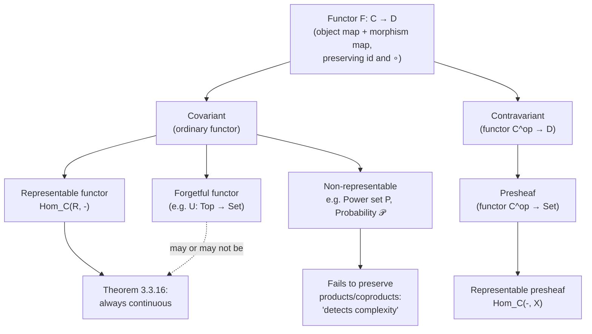

# Functors

[[book-guidelines|↩ Back to guidelines]]

## Why category theory needs a second kind of map

A category by itself is a closed world: objects, morphisms, composition, identities, all internal to that one structure. But almost nothing interesting happens inside a single category. The real content of category theory shows up when you compare two categories, or map one *into* another — when you ask "how does the structure of groups relate to the structure of sets?", or "how does topology relate to algebra?"

A **functor** is exactly that comparison: a structure-preserving map between categories. This is the same move you already know from ordinary mathematics — a group homomorphism doesn't just move elements around, it moves them around in a way that respects multiplication; a continuous function doesn't just move points, it does so respecting the topology. A functor generalizes this idea to categories: it must move objects to objects and *morphisms to morphisms*, and it must do so in a way that respects the two things that make a category a category — identities and composition.

[[Comonads#What breaks without this|What breaks without this]]? If you only required a functor to map objects to objects (like a plain function on the "object level"), you'd throw away almost all the information a category carries — the morphisms, which encode *how* objects relate, would be invisible. A category theory built only on object-maps would degenerate into ordinary set theory with extra decoration. Functors force you to carry the relational structure along, which is precisely what makes them useful for transporting proofs, representations, and invariants from one setting to another.

## The formal definition

Perrone's Definition 1.3.1: a functor $F : \mathcal{C} \to \mathcal{D}$ consists of:

- an object map: for every object $X$ of $\mathcal{C}$, an object $FX$ of $\mathcal{D}$;
- a morphism map: for every morphism $f : X \to Y$ of $\mathcal{C}$, a morphism $Ff : FX \to FY$ of $\mathcal{D}$ (note that the domain/codomain of $Ff$ are *forced* to be $FX$ and $FY$ — you don't get to choose);

subject to two **functoriality axioms**:

- **Unitality** (also called normalization): $F(\mathrm{id}_X) = \mathrm{id}_{FX}$ for every object $X$.
- **Compositionality** (also called the cocycle condition): $F(g \circ f) = Fg \circ Ff$ for every composable pair $f : X \to Y$, $g : Y \to Z$.

That's the whole definition — deceptively small, and that smallness is the point: everything that follows in this article is what these two axioms buy you once you specialize $\mathcal{C}$ and $\mathcal{D}$ to concrete categories.

A first, very literal grounding, before the deeper analogies: think of a functor the way you'd think of a `trait` implementation that has to act uniformly on an entire category of types and the functions between them, not on a single type.

```rust
// Not literally how Rust functors/traits work end-to-end (Rust has no
// built-in notion of "category"), but this shape is the right first mental
// model: an object-level map (a type constructor) plus a morphism-level map
// (a function transformer) that must commute with composition and identity.
trait CategoricalFunctor {
    type Source;      // stand-in for an object X of C
    type Target;      // stand-in for FX in D
    fn map_object(x: Self::Source) -> Self::Target;
    // the morphism map: given f: X -> Y, produce Ff: FX -> FY
    fn map_morphism<X, Y>(f: impl Fn(X) -> Y) -> impl Fn(Self::Target /* FX */) -> Self::Target /* FY */
    where
        Self: Sized;
}
```

This is close in spirit to Rust's actual `Functor`-like patterns (`Option::map`, `Iterator::map`), and we'll come back to that connection below — but first the book's own examples, in the order Perrone gives them, because the ordering itself is a pedagogical argument about what functors *are*.

## 1.3.1 — Functors as maps preserving relations

The simplest kind of category is one built from a relation: a preorder $(X, \lesssim)$, or an equivalence relation $(X, \sim)$, viewed as a category where there's at most one morphism between any two objects. In that setting, functoriality is almost free.

- A functor $F : (X, \leq) \to (Y, \leq)$ between partial orders is exactly a **monotone map**: $x \leq x' \implies Fx \leq Fx'$.
- A functor $F : (X, \sim) \to (Y, \sim)$ between equivalence relations is exactly a map respecting the equivalence — an **equivariant map**.

Why do the functoriality axioms come "for free" here? Because between any two objects of a preorder-as-category there is *at most one* morphism. So there's no room for $F$ to choose wrong on identities or composition — uniqueness of morphisms forces it.

Perrone flags an important asymmetry (the **Caveat** after Example 1.3.3): the target category may have *more* relations than the source — $F$ can "create" relations ($x \not\leq x'$ but $Fx \leq Fx'$ is allowed) but must never "destroy" one ($x \leq x'$ forces $Fx \leq Fx'$). In the book's words: **relations have to be preserved, but not necessarily reflected.** This distinction — preserving vs. reflecting a property — recurs constantly in category theory (it's exactly the language used later for faithful/full functors), so it's worth internalizing here in its simplest form.

**What breaks without it:** if functors were allowed to destroy relations, a functor could map a chain $x \leq x' \leq x''$ to three unrelated points, and any invariant you tried to transport along $F$ (e.g. "this is a lower bound") would simply stop being true on the other side. The entire idea of "transporting structure" collapses.

## 1.3.2 — Functors as maps preserving operations

The next intuition: view a group $G$ (or monoid) as a one-object category $BG$ (its "delooping"), whose morphisms are the elements of $G$ and whose composition is the group operation. Then:

> A function $f : G \to H$ is a group homomorphism if and only if the induced map $BG \to BH$ is a functor.

This is a genuinely satisfying unification: "preserves the unit and preserves multiplication" (the classical definition of a homomorphism) is *literally* the same statement as "preserves identities and preserves composition" (the functor axioms), just read through the $BG$ construction. Group homomorphisms aren't *analogous* to functors — for one-object categories, they *are* functors.

This gives two of the book's headline examples:

- **Linear representation** of $G$: a functor $R : BG \to \mathbf{Vect}$. Concretely: pick a vector space $V$ (the image of the single object), and for each $g \in G$ a linear isomorphism $R_g : V \to V$, with $R_1 = \mathrm{id}_V$ and $R_{gg'} = R_g \circ R_{g'}$. This is precisely a group homomorphism $G \to \mathrm{Aut}(V)$.
- **Permutation representation** of $G$: a functor $R : BG \to \mathbf{Set}$ — $G$ acting on a set $X$ by permutations, i.e. a homomorphism $G \to \mathrm{Aut}(X)$.

Both can lose information (they need not be faithful), but **Cayley's theorem** guarantees a permutation representation exists that doesn't: every group embeds into some $\mathrm{Aut}(X)$. Perrone flags this explicitly as a special case of [[The-Yoneda-Lemma|the Yoneda lemma]], to be revisited — a nice preview of how far the "functors from a category with one object" trick generalizes.

**Rust grounding.** A group acting on a set is exactly a `PermutationGroup` whose elements implement `Fn(T) -> T` bijectively, subject to the same two laws (identity acts as `id`, composition of actions matches group multiplication). If you've ever implemented a symmetry group acting on a board state (chess, Rubik's cube solvers), you were implementing a functor $BG \to \mathbf{Set}$ without naming it.

**Lean grounding, since this material is proof-adjacent.** A group homomorphism in Lean/Mathlib is `f : G →* H`, packaged with proof obligations `map_one'` and `map_mul'` — these are *literally* the unitality and compositionality axioms of a functor $BG \to BH$, spelled out as separate proof fields because Lean's `Category` typeclass and `Group` typeclass aren't unified at that level of the library, even though the mathematics says they should be. This is a good moment to notice: whenever you see a bundled morphism-with-axioms structure (`→*`, `→+`, `RingHom`, ring morphisms, `LinearMap`), it is, structurally, "a functor between one-object categories, unpacked by hand."

## 1.3.3 — Functors defining induced maps

This is the most operationally important class, and the one that will feel most familiar if you've programmed in a functional style: a functor as *a consistent way to extend an existing map to a bigger structure built from it*.

- **Power set functor** $P : \mathbf{Set} \to \mathbf{Set}$. On objects, $X \mapsto PX$ (all subsets of $X$). On morphisms, $f : X \to Y$ induces $Pf : PX \to PY$ by taking images: $(Pf)(S) := \{y \in Y \mid y = f(x) \text{ for some } x \in S\}$.
- **Probability/distribution functor** $\mathcal{P} : \mathbf{Set} \to \mathbf{Set}$. On objects, $X \mapsto \mathcal{P}X$, the finitely-supported probability measures on $X$. On morphisms, $f$ induces the *pushforward* $(\mathcal{P}f)(p)(y) := \sum_{x \in f^{-1}(y)} p(x)$ — "stack the histogram columns that land on the same output."
- **List functor** $L : \mathbf{Set} \to \mathbf{Set}$: $X \mapsto LX$ (finite lists over $X$), and $f$ acts elementwise. Perrone explicitly calls out that this is `map` in Python, `fmap` in Haskell — the functional-programming "functor" you already know by name *is* a categorical functor $\mathbf{Set} \to \mathbf{Set}$ (an *endofunctor*, since source and target coincide).

```python
# Exactly Perrone's list functor: object map X -> list[X],
# morphism map f -> "apply f to every element."
def L_object(X):
    return list  # the type constructor list[X]

def L_morphism(f):
    def Lf(xs):
        return [f(x) for x in xs]
    return Lf

# functoriality, checked informally:
# L(id)(xs) == xs                         (unitality)
# L(g)(L(f)(xs)) == L(g compose f)(xs)    (compositionality)
```

```rust
// The same functor, in Rust: Vec<T> is the object map, Iterator::map/collect
// is the morphism map. Functoriality is exactly why `v.iter().map(f).map(g)`
// and `v.iter().map(|x| g(f(x)))` are observationally identical — that
// equality *is* F(g ∘ f) = Fg ∘ Ff for F = Vec.
fn list_functor_morphism<A, B>(f: impl Fn(A) -> B) -> impl Fn(Vec<A>) -> Vec<B> {
    move |xs: Vec<A>| xs.into_iter().map(&f).collect()
}
```

This is worth pausing on: Rust's `Option<T>::map`, `Result<T, E>::map`, and `Iterator::map` are all endofunctors on (a subcategory of) `Set` under this exact definition, and the functor laws (`map(id) == id`, `map(f).map(g) == map(g ∘ f)`) are the *same two axioms*, just phrased operationally instead of diagrammatically. If you've ever wondered why functional programmers insist those "functor laws" matter and aren't just style preferences — it's because violating them means your `map` isn't a functor at all, and every proof that relies on functoriality (fusion/rewrite optimizations, `map`-`map` collapsing into one pass) silently breaks.

### Forgetful functors

A second major species inside this class: functors that **forget structure**.

- $U : \mathbf{Top} \to \mathbf{Set}$: a topological space $\mapsto$ its underlying set; a continuous map $\mapsto$ the underlying function, forgetting continuity.
- $\mathbf{Grp} \to \mathbf{Set}$, $\mathbf{Ring} \to \mathbf{Grp}$ (keep addition, forget multiplication), $\mathbf{TopGrp} \to \mathbf{Top}$ / $\mathbf{TopGrp} \to \mathbf{Grp}$.

Two things Perrone flags as easy to get wrong:

1. Forgetting is *many-to-one up to isomorphism*: many different topologies can sit on the same underlying set, so $U$ is not injective on objects (in the relevant sense).
2. A forgetful functor never gains morphisms — every continuous function is a function, so $U$ is always defined — but the target category can have *more* morphisms than the source provides (not every function between the underlying sets is continuous). This is the operational version of the "preserved but not reflected" caveat from §1.3.1.

**Load-bearing connection to your project:** forgetful functors are the categorical name for "erase a refinement/proof-carrying layer and keep only the underlying computational object" — exactly the type-erasure step a refinement-type compiler performs when it discards a value's logical annotation (`{x : Int | x > 0}`) and keeps only its runtime representation (`Int`). The fact that $U$ is not full (not every function between underlying sets came from a continuous one; not every `Int`-to-`Int` function respects the refinement) is the categorical shadow of why type erasure is *lossy*, and why re-attaching a refinement after erasure (re-verification) is not automatic — you need new proof obligations, not just a type coercion.

A deeper example the book gives: the **fundamental group** functor $\pi_1 : \mathbf{Top}_* \to \mathbf{Grp}$, taking a pointed space to its group of homotopy classes of loops, and a base-point-preserving continuous map to the induced group homomorphism on loop classes. Or, from calculus: the **derivative** as a functor $D : \mathbf{Euc}_* \to \mathbf{Vect}$ sending $(\mathbb{R}^n, x)$ to $\mathbb{R}^n$ (as a vector space of "vectors based at $x$") and a smooth map to its Jacobian at $x$ — where *functoriality is exactly the chain rule*: $D(g \circ f)|_x = Dg|_{f(x)} \circ Df|_x$.

## 1.3.4 — Functors and cocycles

A short but conceptually important detour: in several branches of mathematics (algebraic topology, stochastic processes, bundle theory), the functoriality condition shows up under the alias **cocycle condition**, because it has the same shape as a 1-cocycle: "the value only depends on the endpoints, not the path." Examples the book gives:

- A **continuous-time Markov process**: kernels $K_{s,t} : X \to X$ for $s \le t$ with $K_{t,t} = \mathrm{id}_X$ and $K_{r,s} \circ K_{s,t} = K_{r,t}$ — precisely a functor from the poset $(\mathbb{R}, \le)$ (as a category) into the category of measurable spaces and Markov kernels.
- The **Čech cocycle condition** for vector bundle transition functions: a functor from the Čech groupoid of an open cover into $\mathbf{Vect}$.

This section is mostly a "same idea, different vocabulary" warning — useful chiefly so that when you meet "cocycle condition" in a different field's literature, you recognize it as functoriality rather than treating it as new machinery.

## 1.3.5 — What functors preserve (and don't): mono, epi, and detecting obstructions

Here the book turns from *constructing* functors to reasoning *about* what any functor is forced to preserve, purely from the two axioms.

**Functors preserve commutative diagrams** (Corollary 1.3.32) — trivially, since a diagram commutes iff two composite morphisms are equal, and $F$ respects equality of morphisms it's applied to (it's a function on the morphism-hom-sets).

**Functors preserve isomorphisms** (Proposition 1.3.33): if $f, g$ form an isomorphism ($g \circ f = \mathrm{id}_X$, $f \circ g = \mathrm{id}_Y$), applying $F$ and using both axioms gives $Fg \circ Ff = \mathrm{id}_{FX}$, $Ff \circ Fg = \mathrm{id}_{FY}$ — so $(Ff, Fg)$ is an isomorphism too.

The same proof, using only *one* of the two triangle equations, gives **Proposition 1.3.34**: functors preserve [[Categories-and-Their-Basic-Structure#Split monomorphisms and split epimorphisms|split monomorphisms and split epimorphisms]] (with retraction/section carried along by $F$).

Here's the sharp edge, and it's the crux of the whole section: **that's it.** Functors do *not*, in general, preserve plain (non-split) monomorphisms or epimorphisms. Perrone's counterexample: the inclusion $\mathbb{N} \hookrightarrow \mathbb{Z}$ is epi in $\mathbf{Mon}$ (monoids), but its image under the forgetful functor $U : \mathbf{Mon} \to \mathbf{Set}$ is not surjective, hence not epi in $\mathbf{Set}$.

This asymmetry is turned into a genuinely useful proof technique, **Corollary 1.3.37**:

> If $f$ is mono (resp. epi) but $Ff$ is *not* mono (resp. epi), then $f$ cannot be split — it admits no retraction (resp. section).

In other words: since functors are *guaranteed* to preserve split mono/epi, finding *any* functor under which the image fails to be mono/epi is a certificate that no splitting can exist. This is the book's technique for proving **non-existence**, illustrated by the graph-theoretic example (a monomorphism of graphs whose image under $\pi_0$, "set of connected components," is not injective — so the original map cannot be split), and then used to reprove a fact about $S^1 \hookrightarrow D^2$: the inclusion of the circle into the disk has no retraction, because $\pi_1(S^1) \cong \mathbb{Z} \to \pi_1(D^2) = 0$ is the zero map (not injective, hence not mono in $\mathbf{Grp}$) — the categorical seed of Brouwer's fixed point theorem.

**Why this matters for a verifier/compiler.** This "functors as obstruction detectors" pattern is structurally identical to how abstract interpretation proves the *absence* of counterexamples: you push a concrete property through an abstraction map (a functor from concrete states to an abstract domain) and, if the property fails to hold abstractly, you've certified it cannot hold concretely — you never had to search the (possibly infinite) concrete space directly. Corollary 1.3.37 is the categorical skeleton of that move: "if a coarser observation already rules something out, the finer thing can't have held either." It's also the same logical shape as **Craig interpolation**-driven refinement: an interpolant is exactly a "less informative" witness (an abstraction) that already suffices to prove the property, without needing the full concrete proof.

## 1.3.6 — What is *not* a functor

A useful negative example, because the failure mode is instructive: $\mathrm{Aut}$ (the automorphism group of a set) looks tempting as a functor $\mathbf{Set} \to \mathbf{Grp}$, but there's no natural way to define it on morphisms — a plain function $f : X \to Y$ gives you no canonical way to turn a bijection $X \to X$ into a bijection $Y \to Y$ unless $f$ is itself invertible. Same story for $\mathrm{End}(X)$ (endomorphism monoid) as a functor $\mathbf{Set} \to \mathbf{Mon}$. The lesson: having a good *object*-level construction is not enough; functoriality is a real constraint on morphisms, and it can fail even when the objects behave perfectly.

## 1.3.7 — Contravariant functors and presheaves

Some very natural constructions reverse arrows. Fix a target object, say $\mathbb{R}$, in $\mathbf{Set}$. Given $X$, form $\mathrm{Hom}_{\mathbf{Set}}(X, \mathbb{R})$ — the set of functions out of $X$. Given $f : X \to Y$, there is **no natural way** to push a function $X \to \mathbb{R}$ forward to a function $Y \to \mathbb{R}$. But there *is* a natural way to go the other direction: precompose. Given $g : Y \to \mathbb{R}$, form $g \circ f : X \to \mathbb{R}$:

$$X \xrightarrow{f} Y \xrightarrow{g} \mathbb{R}$$

This assignment is functorial, but it reverses arrows: $f : X \to Y$ induces a map $\mathrm{Hom}(Y, \mathbb{R}) \to \mathrm{Hom}(X, \mathbb{R})$ — backwards. Formally, this is a functor $\mathcal{C}^{\mathrm{op}} \to \mathcal{D}$, called (informally) a **contravariant functor** $\mathcal{C} \to \mathcal{D}$ (ordinary functors are then, by contrast, *covariant*). The book is explicit that in category theory proper the convention is to avoid the word "contravariant" and always write $\mathcal{C}^{\mathrm{op}} \to \mathcal{D}$, precisely because "a contravariant functor $\mathcal{C}^{\mathrm{op}} \to \mathcal{D}$" double-negates and confuses (Exercise 1.3.41 shows $\mathcal{C}^{\mathrm{op}} \to \mathcal{D}$ and $\mathcal{C} \to \mathcal{D}^{\mathrm{op}}$ are the same notion up to notation).

The book's example — the **dual space functor** $(-)^* : \mathbf{Vect}^{\mathrm{op}} \to \mathbf{Vect}$, sending $V \mapsto V^*$ and $f : V \to W$ to $f^* : W^* \to V^*$ (precompose a functional on $W$ with $f$) — and applying it twice recovers an *ordinary* (covariant) functor $\mathbf{Vect} \to \mathbf{Vect}$: the **double dual** $V \mapsto V^{**}$. (This double-dual construction becomes the star worked example of *naturality* one section later, in 1.4 — a natural transformation from the identity functor to the double-dual functor — but that's out of scope for this article.)

Then the headline definition:

**Definition 1.3.44.** A **presheaf** on $\mathcal{C}$ is a functor $\mathcal{C}^{\mathrm{op}} \to \mathbf{Set}$.

Why $\mathbf{Set}$ specifically? Because we're working with *locally small* categories, where $\mathrm{Hom}_{\mathcal{C}}(X, Y)$ is always a plain set — so "probing" or "observing" an object naturally lands you in $\mathbf{Set}$. (Perrone notes in passing that other target categories are possible — this is the seed of *enriched* category theory, out of scope here.)

The canonical presheaf: fix $X$, form $\mathrm{Hom}_{\mathcal{C}}(-, X) : \mathcal{C}^{\mathrm{op}} \to \mathbf{Set}$ — "map into $X$." (This is the object that becomes central in the Yoneda lemma, two chapters later.) But not every presheaf arises this way — Perrone's worked non-representable example is worth internalizing because it will recur constantly through the rest of the book:

**Directed multigraphs as presheaves.** Let $\mathbf{Par}$ be the category with two objects $V, E$ and two parallel morphisms $s, t : V \to E$ (plus identities — no composition to check since there's nothing to compose beyond identities). A presheaf $F : \mathbf{Par}^{\mathrm{op}} \to \mathbf{Set}$ consists exactly of: two sets $FV$ (vertices), $FE$ (edges), and two functions $Fs, Ft : FE \to FV$ (source and target of each edge — note the direction flips because $\mathbf{Par}^{\mathrm{op}}$ reverses $s, t$). That's precisely the data of a directed multigraph (multiple edges and loops allowed).

**Why this is load-bearing for your project.** A presheaf category $[\mathcal{C}^{\mathrm{op}}, \mathbf{Set}]$ is exactly the right abstraction for thinking about *syntax with variable binding as a functor of contexts* — this is the standard categorical semantics move (presheaves on the category of contexts and substitutions) that shows up in treatments of syntax-with-binders, and it's the same shape as "a term is a functor from `Context^op` to `Set`, contravariant because substitution goes backwards along context morphisms — weakening a context pushes a term forward, but *substituting into* a term pulls along a context map the other way." If you ever formalize substitution categorically (rather than by hand-rolled de Bruijn manipulation), this is the framework it lives in. The $\mathbf{Par}$-as-multigraph example is also the book's own running thread — it returns for representable functors (Chapter 2) and the categories-vs-multigraphs adjunction (Chapter 4), so it's worth keeping as a concrete anchor.

```
-- Lean sketch: a presheaf on a category C is literally Cᵒᵖ ⥤ Type,
-- using mathlib's CategoryTheory library. The book's Par-graph example
-- is essentially: a functor out of a two-object "walking parallel pair"
-- category into Set, contravariant.
-- (Illustrative signature, not a complete mathlib snippet:)
-- def MultigraphPresheaf := ParCat.op ⥤ Type
-- structure MultigraphPresheaf where
--   F_V : Type          -- FV, the set of vertices
--   F_E : Type          -- FE, the set of edges
--   F_s : F_E → F_V      -- Fs
--   F_t : F_E → F_V      -- Ft
```

## Functors detecting complexity — jumping to Chapter 3

Section 1.3 sets up preservation as the default expectation; Chapter 3 (§3.3) is where the book systematically studies *failure* to preserve, and turns that failure into insight. This is the payoff of the "preserved but not reflected" caveat from §1.3.1, now sharpened into a precise statement about [[Limits-and-Colimits|limits and colimits]].

### Continuous and cocontinuous functors

**Definition 3.3.1.** A functor $F : \mathcal{C} \to \mathcal{C}'$ is **continuous** if it preserves *all* limits that exist in $\mathcal{C}$: whenever $\lim D$ exists for a diagram $D$ in $\mathcal{C}$, then $\lim F(D)$ exists in $\mathcal{C}'$ and $\lim F(D) \cong F(\lim D)$, compatibly with the limit cones. **Cocontinuous** is the dual: $F$ preserves all existing colimits.

("Continuous" here is a categorical term of art, not a topological one — though the terminology is not an accident: preserving limits behaves formally like preserving a notion of "closeness"/convergence, which is exactly what a topologically continuous map does to convergent sequences.)

The book immediately grounds this with the forgetful functor $U : \mathbf{Top} \to \mathbf{Set}$:

- The underlying set of the one-point space is the one-point set — $U$ preserves the terminal object (a limit).
- The underlying set of a product of spaces is the cartesian product of the underlying sets — $U$ preserves products (limits).
- The underlying set of the empty space is empty — $U$ preserves the initial object (a colimit).
- The underlying set of a disjoint union of spaces is the disjoint union of the underlying sets — $U$ preserves coproducts (colimits).

So this particular forgetful functor is unusually well-behaved on *both* sides. But that's a special property of $\mathbf{Top}$, not a general fact about forgetful functors — Example 3.3.4 immediately breaks the symmetry: for $U : \mathbf{Vect} \to \mathbf{Set}$, binary [[Limits-and-Colimits#Products and coproducts|products and coproducts]] *coincide* in $\mathbf{Vect}$ (the direct sum serves as both), but they don't coincide in $\mathbf{Set}$ — so $U$ cannot possibly preserve both simultaneously. Likewise, [[Limits-and-Colimits#Initial and terminal objects|initial and terminal objects]] coincide in $\mathbf{Vect}$ (both are the zero vector space) but not in $\mathbf{Set}$ (initial $= \emptyset$, terminal $=$ a singleton), so $U : \mathbf{Vect} \to \mathbf{Set}$ preserves products and terminal objects, but *not* coproducts and the initial object.

**What breaks without tracking this carefully:** if you assumed forgetful functors always preserve (co)limits, you would wrongly conclude that "the underlying set of a coproduct of vector spaces is the disjoint union of the underlying sets" — false; it's the disjoint union modulo the vector-space identifications (effectively the direct sum), which is a proper quotient of the naive set-level disjoint union.

### §3.3.1 — Power set and probability functors: functors detecting complexity

This is the section that gives real teeth to "functors don't preserve limits/colimits" — with an interpretation, not just a counterexample.

**Power set and coproducts.** For $X, Y$ with at least two elements each, compare $P(X \sqcup Y)$ with $PX \sqcup PY$. A subset of $X \sqcup Y$ can be "mixed" — containing elements from both $X$ and $Y$ — but an element of $PX \sqcup PY$ is *either* a subset of $X$ *or* a subset of $Y$, never both. So $PX \sqcup PY \subsetneq P(X \sqcup Y)$ strictly — the power set functor **fails to preserve coproducts**.

**Power set and products.** Compare $P(X \times Y)$ with $PX \times PY$. Every subset $S \subseteq X \times Y$ projects onto a subset of $X$ and a subset of $Y$, giving a canonical surjective map $P(X \times Y) \to PX \times PY$ — but it's far from injective: many different subsets of the plane $\mathbb{R}^2$ share the same axis-projections. So $P$ also **fails to preserve products**.

**Probability functor, same phenomenon with a sharper reading.** $\mathcal{P}(X \times Y)$ is the set of *joint* distributions on $X, Y$; $\mathcal{P}(X) \times \mathcal{P}(Y)$ is the set of pairs of *marginals*. The canonical map (via the universal property of the product) forgets the joint structure down to the marginals — and this is exactly lossy in the way probability theorists care about: for a fixed $p$ on $X$, both the independent joint $p \otimes p$ and the perfectly-correlated joint (supported on the diagonal of $X \times X$) have the same marginals but are wildly different distributions. **Statistical correlation is literally the information this functor loses when you try to push it through a product.**

Perrone's synthesis, worth quoting closely because it names the pattern precisely:

> The features extracted by these functors do not respect the composition of objects, either via products or coproducts... we are free to compose our objects to obtain more complex ones, however, observing the more complex objects is different from observing the parts separately.

This is the "**functors detecting complexity**" idea: a functor that fails to commute with products/coproducts is, structurally, a functor sensitive to *interaction between parts* — mixed subsets, statistical correlation. Preservation of (co)limits is therefore not just a technical property to check; its *failure* is diagnostic of genuine compositional complexity in what the functor observes.

**Why this is exactly your CSP/abstract-interpretation territory.** This is the categorical name for a phenomenon you already care about under a different name: **non-relational vs. relational abstract domains**. An abstract domain that tracks each variable independently (interval domain: track $x \in [\ell_1, u_1]$ and $y \in [\ell_2, u_2]$ separately) is, in this vocabulary, forgetting the "joint distribution" in favor of the "marginals" — it cannot represent correlations like $x = y$ or $x + y \le 10$, exactly the way $\mathcal{P}(X) \times \mathcal{P}(Y)$ cannot represent the diagonal-supported joint. A relational domain (octagons, polyhedra) is closer to preserving the product — it retains cross-variable interaction. The theorem that "the interval-abstraction functor doesn't preserve the product structure" is the precise categorical statement of "non-relational abstract interpretation loses precision on correlated variables," and it explains structurally *why* CEGAR loops sometimes need to refine toward relational predicates (Craig interpolants that mention multiple variables jointly) — the non-relational domain's failure to preserve the product is exactly the gap the interpolant has to plug.

### §3.3.2 — Continuity and equivalence

A short but important stability toolkit:

- Continuity/cocontinuity is invariant under **natural isomorphism** of functors (Exercise 3.3.13) — if $F \cong G$ naturally and $F$ preserves a given limit, so does $G$.
- Continuous and cocontinuous functors are **stable under composition** (Exercise 3.3.14).
- A functor inducing an **equivalence of categories** is automatically both continuous and cocontinuous (Exercise 3.3.15) — and consequently, completeness/cocompleteness of a category transfers across equivalence. This is a genuinely useful fact: it means "does every diagram have a limit" is an invariant of the category up to equivalence, not a fragile property tied to one particular presentation of it.

### §3.3.3 — Representable functors are continuous

The chapter's payoff theorem:

**Theorem 3.3.16.** Representable functors are continuous.

Concretely: if $\lim D$ exists in $\mathcal{C}$ for a diagram $D : J \to \mathcal{C}$, and $R$ is any object of $\mathcal{C}$, then the limit of $\mathrm{Hom}_{\mathcal{C}}(R, D-) : J \to \mathbf{Set}$ exists in $\mathbf{Set}$ and equals $\mathrm{Hom}_{\mathcal{C}}(R, \lim D)$.

The dual (**Corollary 3.3.17**): a representable presheaf $P = \mathrm{Hom}_{\mathcal{C}}(-, R)$ turns colimits into limits: $\lim (P \circ D) \cong P(\mathrm{colim}\, D)$.

[[The-Yoneda-Lemma#The proof|The proof]] idea for binary products (given in full in the source, sketched here): the universal property of $X \times Y$ says maps $R \to X \times Y$ correspond bijectively to *pairs* of maps $(R \to X, R \to Y)$ — which is exactly the statement that $\mathrm{Hom}_{\mathcal{C}}(R, X \times Y) \cong \mathrm{Hom}_{\mathcal{C}}(R, X) \times \mathrm{Hom}_{\mathcal{C}}(R, Y)$ as sets. That bijection *is* the representable functor $\mathrm{Hom}_{\mathcal{C}}(R, -)$ preserving the product — the universal property of the limit and the continuity of the representable functor are two readings of the same fact.

Perrone's own intuitive gloss is worth keeping verbatim because it explains *why* the power-set/probability failure above was inevitable, not a coincidence: representable functors are "experiments consisting of probing the objects of $\mathcal{C}$ with a given object $R$", and the theorem says **probing a composite system $X \times Y$ is the same as probing $X$ and $Y$ separately.** Non-representable functors (like $P$ and $\mathcal{P}$) have no such guarantee — and indeed, they fail exactly at composite objects, which is the diagnostic signature of non-representability.

This also retroactively explains Example 3.3.2/3.3.4: the forgetful functors $\mathbf{Top} \to \mathbf{Set}$, $\mathbf{Vect} \to \mathbf{Set}$, $\mathbf{Grp} \to \mathbf{Set}$ are all *representable* (each is $\mathrm{Hom}(\bullet, -)$ for a one-point space / a one-dimensional vector space / a free group on one generator, respectively), so Theorem 3.3.16 was guaranteeing their continuity — the preservation of products and terminal objects observed by hand earlier wasn't luck, it followed for free once you knew these functors were representable.

## A worked mermaid summary of the taxonomy



## Where this leads

Within this chapter, §1.3's preservation results (mono/epi, isomorphisms, split arrows) set up the exact vocabulary that §1.4 ([[Natural-Transformations|natural transformations]]) and §1.5 (faithful/full/essentially-surjective functors, equivalence of categories) will refine: "preserves but doesn't reflect" becomes the precise distinction between an arbitrary functor and a *full* or *faithful* one. The presheaf definition from §1.3.7 is the object that Chapter 2 makes central: [[Representable-Functors-and-Presheaves|representable functors and presheaves]] become the subject of [[Representable-Functors-and-Presheaves#The Yoneda embedding theorem|the Yoneda embedding theorem]] and the Yoneda lemma itself — the single bijection $\alpha \mapsto \alpha_X(\mathrm{id}_X)$ that recovers Cayley's theorem (already previewed here in §1.3.2) as a special case.

The continuity material from §3.3 is load-bearing for Chapter 4: **[[Adjunctions|Adjunctions]]** proves that right adjoints are always continuous and left adjoints always cocontinuous — a vast generalization of Theorem 3.3.16 (every representable functor $\mathrm{Hom}_{\mathcal{C}}(R,-)$ is secretly a right adjoint, to the functor $- \times R$, when that exists). And §3.3.1's "functors detecting complexity" framing recurs, unnamed but structurally identical, whenever the book later distinguishes a monad's Kleisli category (which forgets exactly how a composite computation was built, "probing" it only through its endpoints) from its Eilenberg–Moore category (which retains the full algebraic structure) — the same preserved-vs-lost-information tension that power set and probability exhibit here at the level of plain limits/colimits.

For the compiler/elaborator project specifically: the mono/epi-preservation-as-obstruction technique (§1.3.5) is the categorical ancestor of abstraction-based non-existence proofs used throughout abstract interpretation and CEGAR; the presheaf-of-contexts framing (§1.3.7) is the standard semantic scaffolding for substitution and binding; and the non-preservation-of-products-as-loss-of-correlation (§3.3.1) is a precise structural explanation for why relational abstract domains exist and why non-relational analyses need interpolant-driven refinement to recover the joint information they started out forgetting.
