[[book-guidelines|↩ Back to guidelines]]

## The problem: one pattern, dozens of names

By the time you reach this chapter you already know the cartesian product $A \times B$ satisfies a universal property: it's the object that receives a pair of maps $(f, g)$ from anywhere and factors them uniquely. You've also probably met, in completely different contexts:

- the greatest lower bound of a set of numbers,
- the set of vectors fixed by a group of rotations,
- the intersection of two subsets,
- the kernel of a linear map,
- gluing two topological spaces along a shared subspace.

These look unrelated — one is order theory, one is representation theory, one is set algebra, one is linear algebra, one is topology. Chapter 3's whole point is that they are *the same construction*, instantiated in different categories. This isn't a cute unifying slogan; it's a precise theorem. Once you see the single scaffold — the **cone** — you can read off "what the limit is" in any category almost mechanically, the way you can read off "what a fold does" once you've internalized `Iterator::fold` instead of memorizing `sum`, `product`, and `max` as unrelated functions.

That's the real payoff of this chapter for a programmer: it's the categorical analogue of noticing that `sum`, `all`, `find`, and `reduce` are all instances of one traversal skeleton. Limits and colimits *are* that skeleton for "compose several objects into one according to a shape," and it turns out `struct`, `enum`, `Option<T>`, `!`, and even unification variables are all points on this same map.

## Cones, cocones, and universal cones

### What breaks without a cone

Chapter 2 gave you [[Universal-Properties|universal properties]] for *pairs* of objects: $X \times Y$, $V \otimes W$. But real diagrams aren't just pairs — they can have any shape: a chain $A \to B \to C$, a "cospan" $A \to C \leftarrow B$, an infinite family $\{A_i\}_{i \in I}$, or a diagram with no objects at all. If you only had machinery for representable functors built from *two* objects, you'd need a bespoke definition for every shape. The fix is to abstract "shape" itself into a category.

**Definition (diagram).** A diagram of shape $\mathcal J$ in $\mathcal C$ is a functor $F : \mathcal J \to \mathcal C$, where $\mathcal J$ is small. ($\mathcal J$ is often called the *index category* — its objects are diagram nodes, its morphisms are the arrows connecting them, and $F$ places an actual object/morphism of $\mathcal C$ at each node/arrow.) You met this already in the previous chapter as "diagrams are functors"; here it becomes the load-bearing definition.

Now define the simplest possible diagram: the **constant diagram** at an object $X$, written $\underline X : \mathcal J \to \mathcal C$, sends every object of $\mathcal J$ to $X$ and every morphism to $\mathrm{id}_X$. It's the categorical equivalent of a constant function.

**Definition 3.1.2 (cone, cocone).** A **cone** over a diagram $F$ with tip $X$ is a natural transformation $\underline X \Rightarrow F$. A **cocone** under $F$ with bottom $X$ is a natural transformation $F \Rightarrow \underline X$.

Unpacked: a cone is a family of morphisms $\alpha_J : X \to FJ$, one for every object $J$ of $\mathcal J$, such that for every morphism $m : J \to J'$ in $\mathcal J$ the triangle

$$
\begin{array}{ccc}
& X & \\
\alpha_J \swarrow & & \searrow \alpha_{J'} \\
FJ & \xrightarrow{\ Fm\ } & FJ'
\end{array}
$$

commutes. Naturality of $\underline X \Rightarrow F$ is *exactly* the commuting-triangle condition — this is worth sitting with, because it means "cone" isn't a new primitive, it's naturality applied to the special case of a constant source functor. Geometrically, $X$ sits above the diagram with legs running down to every node — hence the name. Note carefully: the *legs* commute with each other through $X$, but the original diagram $F$ itself need not commute.

A cocone is the mirror image: legs running *up* from every node of the diagram into a shared bottom $X$.

### Cones form a presheaf — this is where Yoneda comes back

Here's the move that makes the rest of the chapter fall out almost for free. Fix a diagram $F : \mathcal J \to \mathcal C$. Varying the tip $X$ gives a **presheaf of cones**:

$$
\mathrm{Cone}(-, F) : \mathcal C^{op} \to \mathbf{Set}, \qquad X \mapsto \{\text{cones over } F \text{ with tip } X\},
$$

with the action on a morphism $f : X \to Y$ sending a cone $\alpha$ of tip $Y$ to the *precomposed* cone $\alpha \circ f$ of tip $X$ (you get a cone into $F$ from anything mapping into $X$, for free, by composing). Dually, $\mathrm{Cone}(F, -) : \mathcal C \to \mathbf{Set}$ is a genuine functor sending $X$ to the set of cocones with bottom $X$.

This is precisely the shape of a *universal-property functor* from Chapter 2. So the definition writes itself:

**Definition 3.1.5 (limit, colimit).** A **limit** of $F$, if it exists, is an object $\lim F$ of $\mathcal C$ *representing* the presheaf $\mathrm{Cone}(-, F)$. A **colimit** of $F$, if it exists, is an object $\mathrm{colim}\, F$ representing the functor $\mathrm{Cone}(F, -)$.

By Yoneda, representing means there's a natural isomorphism $\mathrm{Hom}_{\mathcal C}(-, \lim F) \cong \mathrm{Cone}(-, F)$, and by [[The-Yoneda-Lemma|the Yoneda lemma]] itself this natural transformation is pinned down by a single *universal element*: a specific cone with tip $\lim F$ that every other cone factors through uniquely. That's the whole content of "limit": it's the terminal object in the category of cones over $F$ (we'll make that literal later, via the slice category). Concretely: for any cone with tip $X$, there is a **unique** map $u : X \to \lim F$ such that every leg $\alpha_J$ factors as $\alpha_J = \phi_J \circ u$, where $\phi_J : \lim F \to FJ$ is the limit's own leg. Colimits are the same statement with every arrow reversed: $\mathrm{colim}\, F$ is *initial* among cocones.

**A category is complete** if every (small) diagram has a limit, **cocomplete** if every diagram has a colimit. (Chapter 3.4 proves $\mathbf{Set}$ is both.)

**What breaks without uniqueness.** Existence alone would just say "some object receives compatible maps into the diagram" — lots of objects do that (e.g. any subset of invariant elements below, not just the biggest one). Uniqueness of the mediating map is what pins the limit down to *the* canonical, largest/smallest such object, and — as in Chapter 2 — is what makes limits unique up to isomorphism rather than merely "a" solution among many.

### Grounding: cones as a Lean structure, limits as terminality

This is exactly how `mathlib`'s `CategoryTheory.Limits` is built, and seeing the real definition helps because it's a completely literal transcription:

```lean
-- A cone over F : J ⥤ C with tip X is data: a leg to every node,
-- natural in the sense that the triangle commutes for every m : J ⟶ J'.
structure Cone (F : J ⥤ C) where
  pt   : C
  leg  : ∀ j, pt ⟶ F.obj j
  -- naturality: leg j' = F.map m ≫ leg j  is enforced by the `NatTrans` machinery

-- A limit is a *terminal object* in the category of cones over F.
def IsLimit (c : Cone F) := IsTerminal c
```

The point worth internalizing: `mathlib` doesn't define `IsLimit` as some bespoke "biggest compatible thing" predicate — it defines the *category of cones over `F`* (objects = cones, morphisms = maps between tips commuting with the legs) and then says a limit is a terminal object *in that category*. This is precisely Perrone's Exercise 3.2.48 below, stated as the actual mathlib definition rather than a derived fact. If you've used Lean's `isDefEq`/unifier, this pattern — "characterize an object by a universal factoring property, then let the elaborator find the unique mediating morphism" — is structurally the same move `isDefEq` makes when it unifies a metavariable against a rigid type: it isn't searching a space of candidate terms, it's finding the unique map that makes a diagram of constraints commute.

## Limits and colimits as constrained optimization: the poset case

Take a poset $(X, \le)$ as a category (an arrow $x \to y$ exists iff $x \le y$). A diagram is just a subset $S \subseteq X$ (no arrows to preserve unless $S$ happens to be a chain). Plug the definitions in:

- A **cone** with tip $x$ over $S$ is an element $x$ with $x \to s$ for every $s \in S$, i.e. $x \le s$ for all $s \in S$ — exactly a **lower bound** of $S$.
- The **limit** is the *largest* such lower bound: the **infimum**, $\inf S$ (also $\wedge S$, the *meet*).
- Dually, a **cocone** is an **upper bound**, and the **colimit** is the **supremum**, $\sup S$ ($\vee S$, the *join*).

This is the cleanest possible reading of "limits and colimits are constrained optimization": the limit of $S$ is the largest element still satisfying the constraint "below everything in $S$"; the colimit is the smallest element satisfying "above everything in $S$." Every construction later in the chapter is a version of "find the extremal object subject to a compatibility constraint" — keep this poset picture in your head as the intuition pump; Perrone explicitly flags it as the thing to reuse for every subsequent example.

Note the mildly confusing direction: the *tip* of a cone sits *below* the set in the order, even though the arrows in the cone diagram point outward from the tip.

**Rust grounding.** A partial order over a `struct` with a `PartialOrd` bound and `Iterator::min`/`max`-by-key over a chain is the finite-poset special case; but the general infimum/supremum over an infinite or non-total poset is not something `Ord` gives you for free — it's the shape of, e.g., an abstract-interpretation lattice's `meet`/`join` operators (`⊓`/`⊔`), which is exactly why this section matters to a program-analysis toolchain: a widening/narrowing operator on an abstract domain *is* computing limits and colimits in the domain's poset category, and Galois connections (a later chapter) formalize exactly when two such lattice maps agree.

## Invariants and orbits of a group action

Now take a group $G$, viewed as the one-object category $BG$. A diagram $F : BG \to \mathbf{Set}$ is precisely a $G$-set: a set $X$ with an action of $G$.

**Cone over $F$:** a set $S$ with a map $f : S \to X$ such that for every $g \in G$, $g \cdot f(s) = f(s)$. Every element in the image of $f$ is a **$G$-invariant element** — one that the whole group action fixes.

> **Caveat worth internalizing.** A *set of invariant elements* is not the same as an *invariant set*. If $S$ is invariant elements, every $g$ fixes every $s \in S$ pointwise. If $S$ is an invariant *set*, $g$ may permute points *within* $S$ but never send a point of $S$ outside it. A circle centered at the origin under rotation is an invariant set whose points move; the origin alone is an invariant element.

**Limit:** the argument (worth walking through once, because it's the template for every limit-in-Set argument that follows) goes: the map $\lim F \to X$ must be injective — otherwise its image $I \hookrightarrow X$ would itself be a smaller cone that everything factors through, contradicting minimality/uniqueness unless $\lim F \cong I$. And $\lim F$ must contain *every* invariant element, because every singleton invariant element gives its own cone that has to factor through $\lim F$. Conclusion: $\lim F$ is exactly **the set of all $G$-invariant elements** of $X$ — the largest invariant subset, i.e. constrained optimization again.

**Cocone:** a map $p : X \to Y$ with $p(g \cdot x) = p(x)$ for all $g, x$ — an **invariant function**. Reading $p$ as a partition of $X$ into fibers $p^{-1}(y)$, invariance of $p$ is equivalent to every fiber being an invariant *set* (never a set of invariant elements — mind the caveat above).

**Colimit:** by the dual argument, $X \to \mathrm{colim}\, F$ must be surjective, and the partition it induces has to be exactly as fine as the partition into **orbits** of the $G$-action (any coarser partition would fail to distinguish two different orbits; any finer one wouldn't factor a genuinely invariant map through it). So $\mathrm{colim}\, F$ is **the set of orbits** $X/G$ — the finest invariant partition.

This pairing — *invariants* as the limit, *orbits* as the colimit — is one of the sharpest intuition pumps in the whole chapter, and it recurs almost verbatim in the equalizer/coequalizer and pullback/pushout sections below (limits = "largest compatible subset," colimits = "coarsest/finest compatible quotient").

**Rust/Lean grounding.** In Rust terms, invariants are the elements surviving a `filter(|x| group.iter().all(|g| g.act(x) == x))`; orbits are the equivalence classes of a union-find (`ena`/`petgraph`'s `UnionFind`) seeded by unioning every $x$ with $g \cdot x$ for each generator $g$. That union-find *is* a coequalizer computation in disguise — see below.

## Products and coproducts

Take the **discrete diagram** on two sets $A, B$ (no non-identity arrows). A cone with tip $X$ is a pair of maps $f : X \to A$, $g : X \to B$. The limit — the universal such cone — is precisely $A \times B$ with its projections, which you already met in Chapter 2's universal-property treatment (there it was introduced axiomatically; here it drops out mechanically from the general definition).

**Definition 3.2.4/3.2.7.** The limit of a discrete diagram is the **product** $\prod_i A_i$; the colimit is the **coproduct** $\coprod_i A_i$ (also written $A \sqcup B$ or $A + B$; the symbol $\sqcup$ is literally the upside-down $\sqcap$).

- In $\mathbf{Set}$: product = cartesian product, coproduct = disjoint union.
- In $\mathbf{Vect}$: product and coproduct of two (or finitely many) spaces coincide — the direct sum.
- In $\mathbf{Top}$: product topology / disjoint-union topology.
- In $\mathbf{Grp}$: coproduct = free product (very much *not* the direct product).

**Rust grounding — this is the sharpest correspondence in the whole chapter.** A product is a `struct` (you need *all* the fields, and you can always project one out); a coproduct is an `enum` (you need *exactly one* variant, and you can always inject one in):

```rust
// Product A × B: has BOTH projections A×B → A and A×B → B.
struct Product<A, B> { a: A, b: B }
fn proj1<A, B>(p: &Product<A, B>) -> &A { &p.a }
fn proj2<A, B>(p: &Product<A, B>) -> &B { &p.b }

// Coproduct A + B: has BOTH injections A → A+B and B → A+B.
enum Coproduct<A, B> { Left(A), Right(B) }
fn inj1<A, B>(a: A) -> Coproduct<A, B> { Coproduct::Left(a) }
fn inj2<A, B>(b: B) -> Coproduct<A, B> { Coproduct::Right(b) }
```

The universal property is exactly what makes `struct`/`enum` the *canonical* shapes rather than an arbitrary encoding choice: **any** type with a pair of maps out of it into $A$ and $B$ factors uniquely through `Product<A,B>` (that's just "you can always build the struct from its two projections and get the originals back"), and **any** type with a pair of maps in from $A$ and $B$ factors uniquely through `Coproduct<A,B>` (that's exhaustive `match`). This is why sum types and product types are the two type-formers every ADT language needs — they're literally the terminal/initial solutions to "combine two types," in opposite directions.

## Equalizers and coequalizers

Take a **parallel pair** $f, g : A \rightrightarrows B$ (a diagram with two objects and two parallel arrows — not necessarily commuting).

A cone with tip $X$ reduces to a single map $p : X \to A$ (the $B$-leg is forced to be $f \circ p = g \circ p$, so it's redundant data) satisfying $f \circ p = g \circ p$ — i.e. $f$ and $g$ *agree on the image of* $p$.

**Limit — the equalizer:** the largest subset of $A$ on which $f$ and $g$ agree, with the inclusion as the universal map.

**Definition 3.2.12.** The limit of a parallel pair is the **equalizer** of $f, g$.

> Equalizers are how you carve out subspaces *by equations* — this is the categorical engine behind algebraic geometry ("the zero locus of a polynomial") and behind the unit circle as the equalizer of $x^2+y^2$ and the constant $1$ in $\mathbf{Top}$ (Example 3.2.13). In $\mathbf{Vect}$/$\mathbf{Grp}$, the equalizer of $f$ against the zero map *is* the kernel of $f$ — kernels are a special case of equalizers, not a separate idea.

**Colimit — the coequalizer:** a cocone reduces to a map $q : B \to Y$ with $q \circ f = q \circ g$ — $q$ *can't tell $f$ and $g$ apart*. Define $b \sim b'$ iff $b = f(a), b' = g(a)$ for some $a$; the coequalizer is $B$ quotiented by the **equivalence relation generated by $\sim$**, with the quotient map universal.

**Definition 3.2.19.** The colimit of a parallel pair is the **coequalizer**.

> Coequalizers build quotient spaces canonically by identification — gluing the endpoints $0, 1$ of $[0,1]$ under the coequalizer of the two point-inclusions produces the circle $S^1$ (Exercise 3.2.20). This is the mechanism behind every "quotient by a relation" construction you've used informally: take the smallest equivalence relation making two maps equal, then quotient by it.

**Why this is the mechanism you already reach for.** This is the cleanest bridge in the chapter to your unification/constraint work: an equalizer is *literally* "the largest subset where two functions agree" — read $f, g : A \to B$ as two elaborations of the same expression under different substitutions, and the equalizer is the set of substitutions that make them *definitionally equal*. A coequalizer, symmetrically, is the finest quotient that *forces* $f$ and $g$ to agree — congruence closure under a rewrite system (the core of an `isDefEq` check that normalizes both sides and compares) is exactly a coequalizer computation: you're building the smallest equivalence relation containing "these two terms reduce to the same thing," which is precisely "the equivalence relation generated by $\sim$" in the definition above. Union-find with path compression is the standard *algorithm* for computing (a presentation of) a coequalizer in $\mathbf{Set}$.

```rust
// Equalizer of f, g : A → B in Set: the largest agreeing subset.
fn equalizer<A: Clone, B: PartialEq>(domain: &[A], f: impl Fn(&A) -> B, g: impl Fn(&A) -> B) -> Vec<A> {
    domain.iter().filter(|a| f(a) == g(a)).cloned().collect()
}
// Coequalizer of f, g : A → B in Set: B modulo the relation generated by f(a) ~ g(a).
// This is exactly what a Union-Find (Disjoint Set) structure computes.
```

## Pullbacks and pushouts

Now the shape is a **cospan** $A \xrightarrow{f} C \xleftarrow{g} B$. A cone with tip $X$ is a pair $p : X \to A$, $q : X \to B$ with $f \circ p = g \circ q$ (the map into $C$ is then forced by composition — redundant, just as $B$-leg was redundant for the equalizer).

**Definition 3.2.22.** The limit of a cospan is the **pullback**, or **fibered product**, written $A \times_C B$, with universal maps $f^*g : A \times_C B \to A$ and $g^*f : A \times_C B \to B$ — drawn as a commuting square with a corner tag $\ulcorner$ or $\lrcorner$ marking it as universal (a "pullback square").

In $\mathbf{Set}$: with $S, T \subseteq X$ mapped in by inclusion, the pullback of the two inclusions into $X$ is exactly $S \cap T$ (Exercise 3.2.25) — the pullback is the categorical generalization of *intersection subject to a shared ambient constraint*. Pulling back along $C = 1$ (the terminal object) recovers the ordinary product $A \times B$ — the pullback specializes to the product once there's no constraint left to satisfy.

**Kernel pair.** Pull $f : X \to Y$ back against itself: the two universal maps $X \times_Y X \rightrightarrows X$ are the **kernel pair** of $f$. Exercise 3.2.28: $f$ is **mono** iff its kernel pair is trivial (both legs are isomorphisms $X \times_Y X \cong X$) — the categorical kernel pair generalizes the linear-algebra kernel, and mono-ness is "nothing collapses," i.e. the kernel pair carries no genuine identification information.

Dually, the shape is a **span**: an object $A$ with two arrows out of it, $A \xrightarrow{f} B$ and $A \xrightarrow{g} C$. The colimit is the **pushout**:

**Definition 3.2.31.** The colimit of a span is the **pushout**, written $B \sqcup_A C$, with universal maps $f_*g, g_*f$.

In $\mathbf{Set}$, pushing out along a shared subset $S \hookrightarrow A, S \hookrightarrow B$ glues $A$ and $B$ along $S$, counting shared elements once (the non-disjoint union). **Cokernel pair:** the pushout of $f$ with itself; $f$ is **epi** iff its two induced maps coincide and are isomorphisms.

> **Caveat (from the book, worth repeating verbatim in spirit).** "Pullback" in category theory is not always the same thing as "pullback" elsewhere in math — for fiber bundles they do coincide (the fiber-bundle pullback exercises spell this out), but the *dual* notion in category theory is called "pushout," while in differential geometry the dual of pullback is "pushforward" — genuinely different operations. Don't assume the vocabulary transfers.

**Why this matters for your unification/CSP work.** A pullback is the categorical shape of **unification along a shared codomain**: $A \times_C B$ collects exactly the pairs $(a, b)$ that *agree once mapped into $C$* — read $C$ as a set of terms and $f, g$ as substitution-application maps, and $A \times_C B$ is the constraint set "these two metavariable assignments produce the same normal form." Miller pattern unification's tractability result is precisely about which pullback-shaped constraint systems admit a *unique most general solution* (an actual limit) rather than merely *some* solution (a mere cone). The general higher-order unification problem is undecidable exactly because, unrestricted, cones over the relevant diagram need not have a terminal one — no limit exists in general, only a (possibly infinite, possibly non-unique) family of unifiers.

```rust
// Pullback of f: A → C, g: B → C in Set: pairs that agree after mapping into C.
fn pullback<A: Clone, B: Clone, C: PartialEq>(
    as_: &[A], bs: &[B], f: impl Fn(&A) -> C, g: impl Fn(&B) -> C,
) -> Vec<(A, B)> {
    as_.iter()
        .flat_map(|a| bs.iter().map(move |b| (a.clone(), b.clone())))
        .filter(|(a, b)| f(a) == g(b))
        .collect()
}
```

## Initial and terminal objects

Take the **empty diagram** — the unique functor out of the empty category $\mathbf O$. A cone with tip $X$ is trivial data (just $X$ and its identity — there's nothing to be compatible *with*), but the limit is not trivial:

**Definition 3.2.36.** The limit of the empty diagram is the **terminal object** $1$: the object such that every object has a **unique** morphism into it.

**Definition 3.2.41.** The colimit of the empty diagram is the **initial object** $0$: the object with a unique morphism **out of** it into everything.

- $\mathbf{Set}$: $1$ = any singleton set, $0$ = the empty set $\varnothing$ (the unique function $\varnothing \to X$ is the empty function — vacuously well-defined, exactly like `match` on an uninhabited enum needing no arms).
- Posets: $1$ = top element $\top$, $0$ = bottom element $\bot$.
- $\mathbf{Vect}$, $\mathbf{Grp}$: initial and terminal coincide — a **zero object** (the zero vector space / trivial group).

> **Caveat.** "Terminal" does *not* mean "no other arrows out of it" — in $\mathbf{Set}$, a singleton has plenty of outgoing maps, just only one *incoming* map from each $X$. Don't let the word mislead you into an over-strong reading.

**Rust grounding — again exact.** The terminal object is `()` (unit): from any type there's exactly one function to it (`fn to_unit<T>(_: T) -> () { () }` — necessarily unique, since `()` has one inhabitant). The initial object is `!` (the never type, or `enum Void {}`): there's exactly one function *out of* it into any type, `fn absurd<T>(v: !) -> T { match v {} }` — vacuously exhaustive, again necessarily unique because there's no case to get wrong.

### Every limit is a terminal object, in disguise

**Definition 3.2.47 (slice category).** Given a diagram $D : \mathcal J \to \mathcal C$, the **slice category** $\mathcal C / D$ has cones over $D$ as objects and cone-preserving maps between tips as morphisms.

**Exercise 3.2.48:** the limit cone of $D$, if it exists, is precisely the **terminal object of $\mathcal C/D$**. This closes the loop: "limit" was defined as *representing a presheaf*, but it can equally be read as *the terminal object of the category of all cones* — every special case in this chapter (product, equalizer, pullback, infimum, invariants) is secretly "find the terminal object of some auxiliary category built from the problem." That reframing is what "limits and colimits can be seen as ways to complete the diagram by adding an initial or terminal object" (the book's closing remark) actually means.

## Completeness of the category of Set

Section 3.4 makes good on a promise implicit in everything above: rather than checking completeness diagram-shape by diagram-shape, **construct the limit of an arbitrary diagram of sets explicitly, once**.

Let $D : \mathcal J \to \mathbf{Set}$ be any small diagram. Form the giant product of every set appearing in it,

$$
P := \prod_{I \in \mathcal J_0} DI,
$$

with projections $p_I : P \to DI$. In general the diagram's own compatibility conditions won't hold for an arbitrary tuple $y \in P$ — for a morphism $m : I \to I'$ of $\mathcal J$, we need $Dm(p_I(y)) = p_{I'}(y)$. Let $S_m \subseteq P$ be the subset where this holds for a single $m$, and take the intersection over **all** morphisms of $\mathcal J$:

$$
S := \bigcap_{m \in \mathcal J_1} S_m.
$$

**Lemma 3.4.1.** $S$, together with $p_I \circ i : S \to DI$ (where $i : S \hookrightarrow P$ is the inclusion), is a limit cone over $D$.

*Proof sketch.* $S$ is a cone by construction. Given any other cone $\alpha$ with tip $X$, the universal property of the product $P$ already gives a unique $u : X \to P$ with $p_I \circ u = \alpha_I$ for every $I$. The compatibility of $\alpha$ (it's a cone, so $Dm(\alpha_I(x)) = \alpha_{I'}(x)$ for every $x$) forces $u(x) \in S$ for every $x$, so $u$ factors uniquely through $S$. $\blacksquare$

**Theorem 3.4.2.** $\mathbf{Set}$ is complete.

Crucially, this only works because $\mathcal J$ is *small* — the product and the intersection both need to range over a set-sized index, not a proper class. (Exercise 3.4.3–3.4.4 push this further: $S$ can itself be written as an equalizer of a pair of parallel maps $P \rightrightarrows P$, so **every limit factors as an equalizer of a product** — and dually, every colimit is a coequalizer of a coproduct. A category is complete as soon as it has all products and all equalizers; you never need to solve the general problem case by case.)

### Why this makes representable functors continuous "for free"

The chapter closes (§3.4.2) by using this explicit construction to prove a fact stated earlier as Theorem 3.3.16 — *representable functors preserve limits* (i.e. are **continuous**) — without any hand-waving. Sketch of the argument, since it's a satisfying capstone: given $D : \mathcal J \to \mathcal C$ with a limit, and any object $R$, run the same $S \subseteq P$ construction on the diagram $\mathrm{Hom}_{\mathcal C}(R, D-) : \mathcal J \to \mathbf{Set}$. Unwinding what $S$ concretely *is* — tuples of maps $R \to DI$ compatible across every $m : I \to I'$ — shows $S$ is exactly $\mathrm{Cone}(R, D)$, the set of cones over $D$ with tip $R$. But by definition, $\mathrm{Cone}(R, D) \cong \mathrm{Hom}_{\mathcal C}(R, \lim D)$ (that's what "$\lim D$ represents $\mathrm{Cone}(-, D)$" means). So:

$$
\lim_{I \in \mathcal J} \mathrm{Hom}_{\mathcal C}(R, DI) \;\cong\; \mathrm{Hom}_{\mathcal C}\!\left(R, \lim_{I \in \mathcal J} DI\right).
$$

In words: computing limits of hom-sets **commutes with taking the hom out of the limit**. The reason this "falls out for free" once $\mathbf{Set}$'s limits are explicit is that both sides reduce to literally the same set of compatible tuples — the theorem isn't a coincidence, it's a restatement of "a cone into $D$ with tip $R$ is the same data no matter which side you compute it from." (The general theory of which functors preserve limits/colimits — continuous/cocontinuous functors — is developed in §3.3 and covered in the companion [[Functors]] article; this section only needed the one instance that makes $\mathbf{Set}$'s role as the universal "probing" category precise.)

## The pattern, laid out

```mermaid
flowchart TB
    subgraph Shape["Diagram shape (in J)"]
        direction LR
        empty["empty diagram"]
        discrete["discrete pair A, B"]
        parallel["parallel pair A ⇉ B"]
        cospan["cospan A → C ← B"]
        span["span A ← ∘ → B... (B ← A → C)"]
        poset["subset S of a poset"]
        group["G-set X"]
    end
    subgraph Limit["Limit (universal cone)"]
        direction LR
        term["terminal object 1"]
        prod["product A × B"]
        eq["equalizer"]
        pb["pullback A ×_C B"]
        inv["G-invariant elements"]
        inf["infimum / meet"]
    end
    subgraph Colimit["Colimit (universal cocone)"]
        direction LR
        init["initial object 0"]
        coprod["coproduct A ⊔ B"]
        coeq["coequalizer"]
        po["pushout B ⊔_A C"]
        orb["orbits X/G"]
        sup["supremum / join"]
    end
    empty --> term
    empty --> init
    discrete --> prod
    discrete --> coprod
    parallel --> eq
    parallel --> coeq
    cospan --> pb
    span --> po
    group --> inv
    group --> orb
    poset --> inf
    poset --> sup
```



Every row is the same universal-cone machinery from the "Cones, cocones, universal cones" section, specialized to a different index category $\mathcal J$. That's the entire chapter in one picture: change the shape, get a different named construction, but the *definition doing the work never changes*.

## Synthesis: where this sits in the book, and where this leads

This chapter cashes out Chapter 2's "universal property" idea in full generality: Chapter 2 showed you *one* representable functor built from two objects ($X \times Y$); this chapter shows that *any* diagram shape gives rise to its own representable presheaf/functor of cones, and every named construction you'll meet later — products, quotients, pullbacks, fixed points — is one instance of representing $\mathrm{Cone}(-, F)$ or $\mathrm{Cone}(F, -)$. The Yoneda lemma from Chapter 2 is doing the uniqueness work throughout: "the limit is unique up to isomorphism" is Yoneda, not a separate argument.

**[[Categories-and-Their-Basic-Structure#Where this leads|Where this leads]]:**
- **[[Adjunctions|Adjunctions]] (Chapter 4)** are defined via a bijection of hom-sets, and one of the chapter's main theorems is that right adjoints are automatically continuous (preserve limits) and left adjoints automatically cocontinuous — [[The-Yoneda-Lemma#The proof|the proof]] is literally a bijection of cone-sets, reusing the $\mathrm{Cone}(-, F)$ machinery built here.
- **[[Monads|Monads]] and [[Comonads|comonads]] (Chapter 5)**: algebras of a monad are defined via a coequalizer condition, and free algebras are built as colimits — you'll recognize the coequalizer pattern from this chapter immediately.
- **For your compiler/elaborator project specifically:** the equalizer/pullback framing of "largest subset where two maps agree" is the cleanest categorical vocabulary for what a unifier computes, and the kernel-pair characterization of monomorphism (Exercise 3.2.28) is the general-nonsense version of "injective substitution ⟺ no two distinct metavariable assignments collapse to the same normal form." When you design your CSP kernel's domain propagation, the poset reading of limits/colimits as infima/suprema is exactly the abstract-interpretation lattice `meet`/`join` you'll implement for interval, sign, or DFA-shaped abstract domains — this chapter is the categorical scaffolding underneath that machinery, not just an analogy to it.
