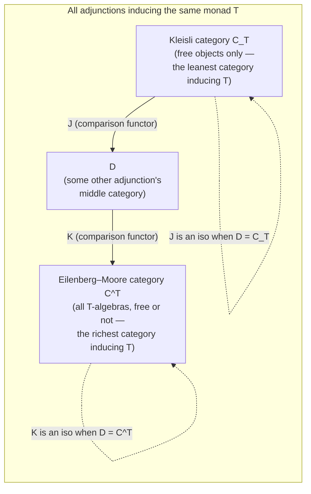
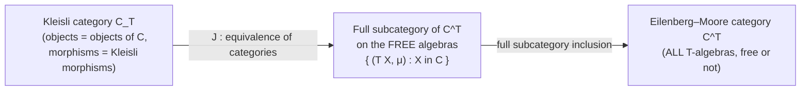
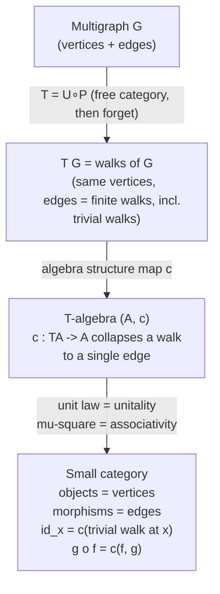

# Monads, Comonads, and [[Adjunctions|Adjunctions]]

[[book-guidelines|↩ Back to guidelines]]

## The question this section actually answers

You already know two ways to manufacture an adjunction out of a monad $T$ on a category $\mathcal C$: the **Kleisli adjunction** $F_T \dashv U_T$ (free objects on Kleisli morphisms — objects of $\mathcal C$, morphisms are $T$-flavored) and the **Eilenberg-Moore adjunction** $L_T \dashv R_T$ (free/forgetful on the category of $T$-algebras $\mathcal C^T$). Both give you back the exact same monad $T = U_T F_T = R_T L_T$ if you compose them. Two structurally different categories, $\mathcal C_T$ (Kleisli) and $\mathcal C^T$ (Eilenberg-Moore), producing the identical monad.

That should bother you a little. If a monad only remembers "an object and an effectful arrow," how can two different categories of effectful arrows both encode it faithfully? The answer this section gives is: **every adjunction that induces $T$ lives somewhere between these two extremes**, and there's a precise sense of "between" — a pair of comparison [[Functors|functors]] that slot any such adjunction's middle category in among the Kleisli and Eilenberg-Moore categories, without loss of information. Kleisli is the "smallest" (fewest morphisms, only free objects) and Eilenberg-Moore is the "largest" (all algebras, including non-free ones) category that induces $T$; everything else sits strictly in between.

This matters because "monad" as an algebraic gadget and "adjunction" as a factorization of a functor into free/forgetful pieces are, in the end, almost the same idea — but not *exactly* the same idea, and the gap between them is exactly what this section measures. An adjunction whose middle category turns out to be, up to equivalence, the Eilenberg-Moore category is called **monadic** — this is the strongest, cleanest form of "free/forgetful," and it's the property that lets you say things like "vector spaces really are just algebraic structure on sets, no more, no less." The closing worked example of the whole book — the underlying-multigraph functor $U : \mathbf{Cat} \to \mathbf{MGraph}$ — cashes this out concretely: it turns out that **a small category is exactly an algebra of the "walks" monad on multigraphs**, nothing added, nothing lost.

This article assumes you already have the [[Monads]] and [[Comonads]] articles' machinery in hand (Kleisli category, Eilenberg-Moore category, coalgebras, free algebras) — we're not re-deriving those here, only using them.

---

## Part 1 — Every adjunction gives you a monad and a comonad, for free

### 1.1 Why this has to be true

Start from the *shape* of a monad: a functor $T$ with a unit $\eta : \mathrm{id} \Rightarrow T$ and a multiplication $\mu : T^2 \Rightarrow T$ satisfying unit and associativity laws. Now look at any adjunction $F \dashv G$, $F : \mathcal C \to \mathcal D$, $G : \mathcal D \to \mathcal C$, with unit $\eta : \mathrm{id}_{\mathcal C} \Rightarrow G F$ and counit $\varepsilon : F G \Rightarrow \mathrm{id}_{\mathcal D}$.

Composite $GF : \mathcal C \to \mathcal C$ is already an endofunctor on $\mathcal C$, and you already have a natural transformation $\eta : \mathrm{id}_{\mathcal C} \Rightarrow GF$ sitting right there as the adjunction's unit — that's your monad unit for free. For multiplication, you need $GF \circ GF \Rightarrow GF$, i.e. $GFGF \Rightarrow GF$; insert the counit $\varepsilon : FG \Rightarrow \mathrm{id}_{\mathcal D}$ in the middle slot, whiskered on both sides: $G\varepsilon F : GFGF \Rightarrow GF$. That's the multiplication. Dually, $FG : \mathcal D \to \mathcal D$ becomes a comonad with counit $\varepsilon$ and comultiplication $F\eta G : FG \Rightarrow FGFG$.

**This is exactly what you'd expect from "adjunction = free/forgetful pair."** $G$ forgets structure, $F$ freely re-adds it; doing "forget, then re-add" twice and squashing the middle layer with the counit is precisely how a monad's multiplication is supposed to behave — it's "flatten," the same job $\mu$ always does.

**[[Comonads#What breaks without this|What breaks without this]]:** if $GF$ failed the monad laws, the round-trip "forget $\to$ free $\to$ forget $\to$ free" would not associate consistently — you'd get different answers depending on how you parenthesized a chain of unit/counit insertions, which would make the very notion of "the algebraic theory generated by this adjunction" ill-defined. The theorem below is what guarantees that never happens; it isn't an accident of the examples, it's forced by the triangle identities alone.

### 1.2 The theorem, and why the proof is almost free

> **Theorem 5.5.1** (book). Let $\mathcal C, \mathcal D$ be categories, $F \dashv G$ with $F : \mathcal C \to \mathcal D$, $G : \mathcal D \to \mathcal C$, unit $\eta : \mathrm{id}_{\mathcal C} \Rightarrow GF$, counit $\varepsilon : FG \Rightarrow \mathrm{id}_{\mathcal D}$. Then:
> (a) $GF$ is a monad on $\mathcal C$, with unit $\eta$ and multiplication $G\varepsilon F$;
> (b) $FG$ is a comonad on $\mathcal D$, with counit $\varepsilon$ and comultiplication $F\eta G$.

Both naturality and "correct type" are automatic — $\eta$ and $G\varepsilon F$ are [[Natural-Transformations|natural transformations]] of exactly the shapes a monad's unit and multiplication need, by construction. The only real content is checking the **monad axioms** commute, and each of the three required squares turns out to be *literally* one of the adjunction's own triangle identities, whiskered by $G$:

- unit law on one side $\leftrightarrow$ the second triangle identity ($\varepsilon F \circ F \eta = \mathrm{id}_F$), evaluated at $D = FC$;
- unit law on the other side $\leftrightarrow$ $G$ applied to the first triangle identity ($G\varepsilon \circ \eta G = \mathrm{id}_G$);
- associativity $\leftrightarrow$ a naturality square for $\varepsilon$.

So the "monad from an adjunction" fact isn't a new axiom you have to separately verify each time — the triangle identities you already proved when you established $F \dashv G$ are *doing double duty* as the monad axioms for $GF$. That's the sense in which this theorem is close to free once you have an adjunction at all. (b) is the exact dual — swap the roles of $\eta/\varepsilon$ and reverse the relevant arrows; the book leaves it as Exercise 5.5.2.

**Rust grounding.** Think of $F \dashv G$ as a pair of associated-type conversions: $G$ is "view as the underlying structure," $F$ is "freely wrap." A monad from adjunction reads exactly like the standard `Wrap<Wrap<T>>::flatten` pattern:

```rust
// G : D -> C is "forget," F : C -> D is "freely add structure."
// GF : C -> C is the induced monad's underlying endofunctor.
trait Monad<C> {
    fn unit(c: C) -> Self;                 // eta: C -> G(F(C))
    fn flatten(nested: Self::Nested) -> Self; // G(eps)_F: G(F(G(F(C)))) -> G(F(C))
}
```

If `F` is "build a free monoid from a set of generators" and `G` is "forget the monoid structure, keep the carrier set," then `GF` is literally `Vec<T>` (lists as free monoids), `unit` is `|x| vec![x]`, and `flatten` is `Vec<Vec<T>>::concat` — the counit $\varepsilon$ at the vector-space/monoid level *is* concatenation, and $G\varepsilon F$ is "concatenate, then forget you did." This is the same `flatten` you already know from `Option<Option<T>>` or `Result<Result<T,E>,E>` — those *are* $GF$ for the trivial one-object adjunction case.

**Lean grounding.** Mathlib formalizes this precisely as `CategoryTheory.Adjunction.toMonad` (and dually `Adjunction.toComonad`): given `adj : F ⊣ G`, `adj.toMonad : CategoryTheory.Monad C` packages `G.comp F` together with `adj.unit` and the whiskered counit as the multiplication, and the associated `Monad.Algebra` category is exactly $\mathcal C^T$. The triangle-identity-reuse argument above is literally how `Adjunction.toMonad`'s proof obligations discharge in Mathlib's source — `assoc` and `left_unit`/`right_unit` unfold to `Adjunction.left_triangle`/`right_triangle` plus one naturality rewrite.

---

## Part 2 — Comparison functors: every adjunction sits between Kleisli and Eilenberg-Moore

### 2.1 The intuition first

You now have, for a fixed monad $T$ on $\mathcal C$:

- the Kleisli adjunction $F_T \dashv U_T$, whose middle category $\mathcal C_T$ has *only the free objects of $\mathcal C$* as objects, and Kleisli morphisms as arrows — this is the "leanest possible" category that induces $T$;
- the Eilenberg-Moore adjunction $L_T \dashv R_T$, whose middle category $\mathcal C^T$ has *every* $T$-algebra as an object, free or not — this is the "richest possible" category that induces $T$.

Now suppose someone hands you a *third* adjunction $F \dashv G$, $F : \mathcal C \to \mathcal D$, whose induced monad $GF$ happens to equal (or be isomorphic to) $T$. Intuition says $\mathcal D$ should be "some category of $T$-algebra-like things, at least as rich as the free ones, but maybe not all of them." The theorem below makes that intuition a theorem: there's a *canonical, unique-up-to-isomorphism* functor from $\mathcal C_T$ into $\mathcal D$, and a canonical functor from $\mathcal D$ into $\mathcal C^T$ — meaning $\mathcal D$ genuinely factors between the two extremes, and does so compatibly with the free/[[Functors#Forgetful functors|forgetful functors]] on both ends.

**What breaks without this:** without a canonical comparison functor, "the monad induced by this adjunction" would be a purely formal label — you'd know $GF \cong T$ abstractly, but you'd have no way to relate concrete elements of $\mathcal D$ to concrete $T$-algebras or Kleisli morphisms. The comparison functors are what let you transport actual proofs and constructions back and forth, not just isomorphism classes.

### 2.2 The comparison functor $J : \mathcal C_T \to \mathcal D$

> **Theorem 5.5.3** (book, citing [Rie16, Prop. 5.2.12]). Let $F \dashv G$, $F : \mathcal C \to \mathcal D$, $G : \mathcal D \to \mathcal C$, with induced monad $T = GF$. Then:
> **(a)** there is a canonical comparison functor $J : \mathcal C_T \to \mathcal D$, unique up to isomorphism, making both triangles below commute up to isomorphism:
> $$\mathcal C_T \xrightarrow{J} \mathcal D \qquad\qquad \mathcal C_T \xrightarrow{J} \mathcal D$$
> $$R_T\!\!\searrow\quad \swarrow G \qquad\qquad\qquad L_T\!\!\searrow\quad\swarrow F$$
> $$\qquad\mathcal C \qquad\qquad\qquad\qquad\qquad \mathcal C$$
> **(b)** there is a canonical comparison functor $K : \mathcal D \to \mathcal C^T$, unique up to isomorphism, making both triangles below commute up to isomorphism:
> $$\mathcal D \xrightarrow{K} \mathcal C^T \qquad\qquad \mathcal D \xrightarrow{K} \mathcal C^T$$
> $$G\!\!\searrow\quad \swarrow R_T \qquad\qquad\qquad F\!\!\searrow\quad\swarrow L_T$$
> $$\qquad\mathcal C \qquad\qquad\qquad\qquad\qquad\mathcal C$$

Read (a) in words: $J$ takes a Kleisli morphism and reinterprets it, faithfully, as a genuine morphism of $\mathcal D$ — the commuting square on the right says "$J$ agrees with $F$ on objects and on the free construction," and the one on the left says "reforgetting through $G$ after $J$ gives back exactly the Kleisli forgetful functor $R_T$." Read (b): $K$ takes any object of $\mathcal D$ and produces its *canonical $T$-algebra structure* — the algebra you'd get from "forget it into $\mathcal C$, then remember that $\mathcal D$'s structure gives you a canonical action of $T = GF$ on it."

### 2.3 Constructing $J$ explicitly (this is where the content is)

The book's proof of (a) is a genuinely instructive piece of "the definition is forced" reasoning — worth walking through because it's a template for how comparison functors get built in general.

**On objects:** the Kleisli category has the same objects as $\mathcal C$, and $L_T$ is the identity on objects. Commutativity of the right-hand triangle *forces* $J(X) := F(X)$ — there is no other choice. Check this is also consistent with the left triangle: $GJ(X) = GF(X) = TX$, and indeed $R_T(X) = TX$ on the nose. No freedom, no arbitrary choice — the diagrams pin down $J$ on objects completely.

**On morphisms:** a Kleisli morphism $k : X \to Y$ of $T$ is, underneath, an ordinary $\mathcal C$-morphism $k : X \to GFY = TY$. Since $F \dashv G$, this transposes (via the adjunction bijection) to a genuine $\mathcal D$-morphism $k^\sharp : FX \to FY$, computed by the usual formula
$$k^\sharp = \varepsilon_{FY} \circ Fk.$$
Define $J(k) := k^\sharp$. This is precisely the map that took a Kleisli morphism "$X \to$ effectful $Y$" and turned it into a genuine morphism between the *free* objects on $X$ and $Y$ — exactly the transpose operation you already used to build the Kleisli adjunction in the first place, just run through the general adjunction $F \dashv G$ instead of the specific Kleisli one.

**Checking it's a functor.** Two things to verify, both short:
- **Identities:** $J(\eta_X) = \eta_X^\sharp = \mathrm{id}_{FX}$ — the transpose of the Kleisli identity (which *is* $\eta$) is the identity on $FX$, by the defining property of the adjunction transpose.
- **Composition:** for $k : X \to TY$ and $h : Y \to TZ$, Kleisli composition is $h \bullet k = \mu_Z \circ Th \circ k$ (the usual "substitute and flatten"). A short calculation using naturality of $\varepsilon$ shows
$$J(h \bullet k) = \varepsilon \circ F(\mu \circ Th \circ k) = \varepsilon \circ Fh \circ \varepsilon \circ Fk = J(h) \circ J(k).$$
So Kleisli composition maps, under $J$, exactly onto ordinary composition in $\mathcal D$ — the substitution-and-flatten operation that defines Kleisli composition is nothing but ordinary composition in $\mathcal D$, viewed through the adjunction transpose. This is a genuinely satisfying payoff: it tells you *why* Kleisli composition has the shape it does — it's not an ad-hoc definition, it's forced to be the transpose-image of ordinary composition in whatever concrete category $\mathcal D$ you started from.

Part (b), constructing $K$, is symmetric (Exercise 5.5.4 in the book — "important!" is the book's own annotation) and Exercise 5.5.5 asks for the dual statements for comonads (be careful, the book warns, about which arrows reverse).

**Rust grounding — why $J$'s formula is just `.and_then`.** If $\mathcal D$ is `Vec<T>`-land (lists), $\mathcal C$ is `Set`, $F$ = "singleton list," $G$ = "forget it's a list, just a set of elements": a Kleisli morphism $k : X \to T(Y)$ is exactly a function `fn k(x: X) -> Vec<Y>`. Its transpose $k^\sharp : F(X) \to F(Y)$, i.e. `Vec<X> -> Vec<Y>`, is exactly

```rust
fn transpose<X, Y>(k: impl Fn(X) -> Vec<Y>) -> impl Fn(Vec<X>) -> Vec<Y> {
    move |xs| xs.into_iter().flat_map(&k).collect()   // = eps . F(k)
}
```

`flat_map` *is* $\varepsilon \circ Fk$: apply `k` to each element (that's `Fk`), then flatten the resulting `Vec<Vec<Y>>` (that's $\varepsilon$, concatenation). The functoriality check above — that Kleisli composition maps to ordinary composition — is exactly the statement that `xs.flat_map(f).flat_map(g) == xs.flat_map(|x| f(x).flat_map(g))`, i.e. monad associativity for `Vec`, which is the law `flat_map` has to satisfy for `Iterator`/`Vec` chains to compose predictably.

**Lean grounding.** This is `CategoryTheory.Adjunction.toKleisliCompatibleFunctor`-shaped territory in spirit; Mathlib's actual name for this construction is the *Kleisli category comparison*, built from `CategoryTheory.Monad.Kleisli` together with the adjunction's transpose `Adjunction.homEquiv`. The line `k^♯ = ε ∘ Fk` is precisely `Adjunction.homEquiv`'s definition unfolded — Mathlib's `Adjunction` bundles the hom-set bijection $\mathrm{Hom}_{\mathcal D}(FX, Y) \cong \mathrm{Hom}_{\mathcal C}(X, GY)$ together with a proof that it's natural, and the forward direction applied to $k$ followed by $\varepsilon$ is exactly this transpose formula.

### 2.4 Why $\mathcal C_T$ and $\mathcal C^T$ are the two extremes

Instantiate Theorem 5.5.3 at the *identity* adjunction case — take $F \dashv G$ to *be* the Kleisli adjunction $F_T \dashv U_T$ itself. Then $\mathcal D = \mathcal C_T$, and $J : \mathcal C_T \to \mathcal C_T$ is (up to isomorphism) the identity — there's nothing smaller to compare against. Symmetrically, taking $F \dashv G$ to be the Eilenberg-Moore adjunction makes $K : \mathcal C^T \to \mathcal C^T$ the identity. This is the precise sense in which Kleisli is the initial ("smallest," free-objects-only) object and Eilenberg-Moore is the terminal ("largest," all-algebras) object among all adjunctions inducing a given monad $T$ — every other adjunction's middle category $\mathcal D$ sits strictly between them, connected on both sides by canonical, forced comparison functors.



### 2.5 Monadic adjunctions: when $K$ is an equivalence

> **Definition 5.5.6** (book). Let $F \dashv G$, $F : \mathcal C \to \mathcal D$, induced monad $T$. The adjunction $F \dashv G$ is **monadic** if and only if the comparison functor $K : \mathcal D \to \mathcal C^T$ is an *equivalence of categories*. In that case, the right adjoint $G$ is called a **monadic functor**.

In words: an adjunction is monadic exactly when $\mathcal D$, up to equivalence, *is* the category of $T$-algebras — no non-algebra objects hiding in $\mathcal D$, and no algebras missing. This is the mathematically precise version of the informal phrase "$G$ is a genuinely free/forgetful functor with no cheating." $K$ being fully faithful says every $\mathcal D$-morphism is recoverable from its underlying algebra-morphism (no extra structure in $\mathcal D$ that $G$ throws away silently); $K$ being essentially surjective says every $T$-algebra actually shows up as (the image of) some object of $\mathcal D$ (no missing algebras).

**Example 5.5.7 (book).** Most "free-forgetful" adjunctions you already know are monadic: sets $\rightleftarrows$ vector spaces, sets $\rightleftarrows$ groups, and — by construction — every Eilenberg-Moore adjunction from Section 5.2.3 of the book is trivially monadic (its own comparison functor $K$ *is* the identity, per §2.4 above).

**Non-examples.** The Kleisli adjunction of a typical monad is usually *not* monadic — $\mathcal C_T$ only contains the free objects, so unless every $T$-algebra happens to be free, $\mathcal C_T \to \mathcal C^T$ can't be essentially surjective. This is why the two extremes genuinely differ: monadicity is a statement about $\mathcal D$ being "exactly as big as $\mathcal C^T$," and Kleisli categories, being deliberately minimal, generically fail it.

**Exercise 5.5.10 (book, linear algebra).** The Kleisli adjunction for the vector-space monad *is* monadic — because, unusually, every algebra of that monad happens to be free (every vector space is free on some basis). This is the exception that proves the rule: monadicity of a Kleisli adjunction specifically requires "all algebras are free," which is special to a handful of theories (vector spaces over a field being the classic one, thanks to the existence of bases).

**Exercise 5.5.11 (book, topology).** Is $\mathrm{Top} \to \mathrm{Set}$ monadic? The book poses this as a hint-driven exercise ("what is the induced monad on $\mathrm{Set}$?") rather than answering it outright — and it's a well-known cautionary tale in category theory: the forgetful functor from topological spaces to sets is *not* monadic, because distinct topologies on the same underlying set can induce the same "convergence" data the induced monad would have to encode, so $K$ fails to be fully faithful. It's the textbook example of "looks free-forgetful, isn't."

### 2.6 The Kleisli category as a full subcategory of free algebras

There's a second comparison functor worth isolating: instantiate Theorem 5.5.3 with $F \dashv G$ *being* the Eilenberg-Moore adjunction itself. You get a comparison functor $J : \mathcal C_T \to \mathcal C^T$ — from Kleisli straight into Eilenberg-Moore.

> **Proposition 5.5.8** (book). The comparison functor $J : \mathcal C_T \to \mathcal C^T$ establishes an equivalence between the Kleisli category $\mathcal C_T$ and the **full subcategory of $\mathcal C^T$ whose objects are the free algebras**.

*Proof sketch, and why each piece works:*
- **On objects:** instantiating the general construction of §2.3, $J(X) = L_T(X) = (TX, \mu)$ — literally the free algebra on $X$. So the image of $J$ consists exactly of free algebras, and conversely every free algebra $(TY, \mu)$ is $J(Y)$ for some $Y$ — surjective onto free algebras, by definition of "free algebra."
- **Fully faithful:** need a bijection between Kleisli morphisms $X \to Y$ and algebra morphisms $TX \to TY$. But that's *exactly* the universal property of free algebras that built the Eilenberg-Moore adjunction in the first place (Corollary 5.2.31 in the book): a morphism out of a free algebra $(TX, \mu)$ into any algebra $(A, e)$ corresponds bijectively to a plain $\mathcal C$-morphism $X \to A$ — instantiate $A = TY$, $e = \mu_Y$, and that bijection is precisely "Kleisli morphisms $X \to TY$ $\leftrightarrow$ algebra morphisms $TX \to TY$."

So this pins down, precisely, what a "Kleisli morphism" *is* inside the richer Eilenberg-Moore world: it's nothing but an algebra morphism between the two corresponding free algebras. Kleisli morphisms aren't a separate, ad-hoc notion — they're the restriction of ordinary algebra homomorphisms to the free objects, seen through this equivalence.



**Example 5.5.9 (book, probability).** This isn't abstract nonsense — it explains a concrete fact about Markov kernels. Recall a stochastic map $k : X \to \mathcal P Y$ (a Markov kernel — Kleisli morphism of the finite-distributions monad $\mathcal P$) canonically extends to a map $\mathcal P X \to \mathcal P Y$. Proposition 5.5.8 says precisely: that extended map is the *unique morphism of free $\mathcal P$-algebras* making the obvious triangle with the unit $\delta$ (Dirac delta) commute. In the finite case, such algebra morphisms between simplices are exactly the **stochastic matrices** — so "stochastic maps between sets" and "stochastic matrices between simplices" are literally the same category, up to the equivalence Proposition 5.5.8 hands you. That's not a coincidence or an analogy; it's this proposition, instantiated.

### 2.7 Beck's monadicity theorem (cited, not proved)

The book flags, without proving, the natural next question: given some functor $G : \mathcal D \to \mathcal C$ with a left adjoint, *how do you tell* whether $F \dashv G$ is monadic, short of constructing $K$ and checking it by hand? The answer is **Beck's monadicity theorem**: a clean necessary-and-sufficient characterization (roughly: $G$ creates, or reflects, certain coequalizers — specifically coequalizers of "$G$-split" or "$G$-contractible" pairs). The book explicitly punts on [[The-Yoneda-Lemma#The proof|the proof]] and points to [Rie16, Chapter 5] — worth knowing the name and the shape of the statement even without reproducing the proof, because "is this adjunction monadic" is a question that recurs constantly once you start treating "free/forgetful" claims rigorously rather than by vibes.

**Where this shows up for a compiler engineer:** Beck's theorem is the abstract-nonsense ancestor of a very concrete question you'll ask about a trusted kernel: *"is my surface representation exactly the free structure generated by my core representation, with nothing extra and nothing missing?"* A monadic adjunction is the categorical certificate that the answer is yes — that elaboration (the left adjoint, "freely add structure") and forgetting (the right adjoint, "erase back to core") form a faithful, no-information-either-way round trip once you quotient by the induced equivalence relation. Non-monadic adjunctions are the formal shape of "your surface syntax secretly carries information your core IR can't see" (the $\mathrm{Top} \to \mathrm{Set}$ story above, transplanted: two distinct topologies collapsing to the same underlying set is structurally the same failure mode as two distinct source-level terms elaborating to observationally-identical core terms while *not* actually being interchangeable).

---

## Part 3 — Worked example 5.5.1: categories and multigraphs, monadically

This is the book's closing example, and it's worth taking slowly — it's the payoff for everything above, applied to the running categories-as-graphs thread from Section 4.2.2.

### 3.1 Setup: the monad $T = U \circ P$

Recall the adjunction $P \dashv U$ between multigraphs and categories from Section 4.2.2: $U : \mathbf{Cat} \to \mathbf{MGraph}$ forgets a category down to its underlying multigraph (objects become vertices, morphisms become edges, composition and identities are simply forgotten), and $P$ is left adjoint — $P(G)$ is the **free category on a multigraph** $G$: its objects are the vertices of $G$, and its morphisms $X \to Y$ are *walks* (finite paths of composable edges) from $X$ to $Y$ in $G$, including the empty walk at each vertex (which becomes the identity).

By Theorem 5.5.1, $T := U \circ P$ is a monad on $\mathbf{MGraph}$. Concretely: given a multigraph $G$, $TG$ has the *same vertices* as $G$, but its *edges are the walks of $G$* (including trivial walks at each vertex). On a multigraph morphism $f : G \to H$, $Tf$ sends a walk to its image under $f$ (well-defined because $f$ preserves incidence, so images of walks are walks).

This should already feel familiar if you've done any graph algorithms: $T$ is exactly "close a graph under path-concatenation" — the same operation lurking behind reachability computations and transitive closure, just kept at the structured level of *walks* rather than collapsed down to a boolean reachability relation.

### 3.2 What a $T$-algebra is, unpacked

A $T$-algebra is a multigraph $A$ together with a structure map $c : TA \to A$ preserving incidence — i.e., a way to collapse any walk in $A$ down to a single edge of $A$, "composing the walk's edges." The algebra unit law forces $c$ to fix vertices (the trivial-walk-at-$x$ has to map to something that behaves like "the identity at $x$"), and forces $c$ to act as the identity on the walks that are already single edges (you can't be forced to change a length-1 walk into a different edge).

**The claim: $T$-algebras are exactly small categories, and $T$-algebra morphisms are exactly functors.** Both directions are worth walking through, because each direction is really "recover one of the category axioms from one piece of the algebra structure."

**Algebra $\Rightarrow$ category.** Given $(A, c)$:
- define $\mathrm{id}_x := c(1_x)$ where $1_x$ is the trivial walk at $x$;
- define $e_2 \circ e_1 := c(e_1, e_2)$ for composable edges;
- **unitality** falls straight out of the algebra unit law: $c(1_x, e) = c(e) = e$ (composing with a trivial walk is a no-op — a trivial walk contributes nothing to concatenation) and symmetrically on the other side;
- **associativity** falls straight out of the algebra's *multiplication* square (i.e. $c$ commuting with $T$'s $\mu$, which is walk-concatenation): $g \circ (f \circ e) = c(c(e,f), c(g)) = c(e,f,g) = c(c(e), c(f,g)) = (g \circ f) \circ e$ — both sides collapse the same three-edge walk, just grouped differently, and $\mu$'s associativity (concatenation doesn't care how you bracket it) is what guarantees the two groupings agree.

Notice how clean this is: **category-axiom unitality is literally algebra-axiom unitality, and category-axiom associativity is literally algebra-axiom associativity for $\mu$** — nothing is proved from scratch, it's a direct transcription.

**Category $\Rightarrow$ algebra.** Given a small category $\mathcal C$ (equivalently, its underlying multigraph plus composition), define $c$ on a walk by *composing it*: the trivial walk at $X$ maps to $\mathrm{id}_X$, a one-morphism walk maps to itself, and a walk of two-or-more composable morphisms $(f, g)$ maps to $g \circ f$. Algebra unitality holds by construction (a single-morphism composite is that morphism). Algebra associativity — the requirement that "flatten a walk-of-walks then compose" agrees with "compose each sub-walk then compose the results" — is *exactly* ordinary composition's associativity in $\mathcal C$, applied to however you choose to bracket a long composable chain. (The book spells this out with an explicit multi-index computation — flattening $((f_{1,1},\dots,f_{1,n_1}),\dots,(f_{m,1},\dots,f_{m,n_m}))$ before or after composing gives the same morphism, by associativity of $\circ$.)

**Algebra morphisms $\Leftrightarrow$ functors.** A morphism of $T$-algebras is a graph morphism $f : \mathcal C \to \mathcal D$ making
$$\begin{array}{ccc} TC & \xrightarrow{Tf} & TD \\ \downarrow c & & \downarrow c \\ C & \xrightarrow{f} & D \end{array}$$
commute. Functoriality of an ordinary functor gives you exactly this: $f(c(1_X)) = f(\mathrm{id}_X) = \mathrm{id}_{f(X)} = c(Tf(1_X))$ (functors preserve identities), and $f(c(e_1,\dots,e_n)) = f(e_n \circ \cdots \circ e_1) = f(e_n)\circ\cdots\circ f(e_1) = c(Tf(e_1),\dots,Tf(e_n))$ (functors preserve composition). Conversely, if $f$ makes the square commute, unwinding the same equations at $c(1_X)$ and $c(g,h)$ shows $f$ preserves identities and composition — i.e. $f$ *is* a functor. The square commuting is *definitionally equivalent* to functoriality; there's no gap between the two notions at all.

**Conclusion (book, verbatim in spirit):** the $T$-algebras are precisely the small categories, and their morphisms are precisely the functors between them. The extra structure a multigraph needs in order to become a category is exactly encoded by this monad — no more, no less. This is the adjunction $P \dashv U$ being **monadic**: the comparison functor $K : \mathbf{Cat} \to \mathbf{MGraph}^T$ is an equivalence of categories, in fact essentially an *identity* once you see that "category" and "$T$-algebra" are, unwound, the same data.



**Rust grounding.** This example maps almost verbatim onto a design decision you'll actually make in a compiler IR: do you represent a control-flow graph's paths as a *derived*, computed structure (walks/closures on top of an edge list — the multigraph view), or do you bake composition in as a first-class operation on the IR itself (the category/algebra view, where "compose two blocks" is a primitive)?

```rust
// The "multigraph" view: only raw incidence data.
struct MGraph<V, E> {
    edges: Vec<(V, V, E)>,   // an edge is just a labeled pair of endpoints
}

// T G: the free category's morphisms are walks — Vec<E> chains.
type Walk<E> = Vec<E>;   // includes the empty walk (= identity)

// The T-algebra view: incidence data PLUS a composition law satisfying
// unit and associativity laws — this is definitionally "a category."
trait TAlgebra<V, E> {
    fn collapse(&self, walk: Walk<E>) -> E;      // c : T A -> A
    // laws (not enforced by the type system, but required for `collapse`
    // to actually define a category):
    //   collapse(vec![]) behaves as identity at each vertex
    //   collapse(concat(w1, w2)) == compose(collapse(w1), collapse(w2))
}
```

The theorem's content, transplanted: *any* well-behaved "path-collapsing" function on a graph automatically gives you a category (unitality + associativity of `collapse` are exactly the category laws), and conversely every category you build by hand is secretly just a graph plus a `collapse` satisfying those two laws. If you've ever implemented an IR where "blocks" are nodes and "control flow edges" compose into "extended basic blocks," you were implicitly picking a $T$-algebra structure on a multigraph — this theorem is what guarantees that choice is *equivalent to*, not merely *analogous to*, defining a category.

**Lean grounding.** Mathlib's `CategoryTheory.Monad.Algebra` is the general $T$-algebra category $\mathcal C^T$; the specific fact "$\mathbf{Cat}$ is monadic over $\mathbf{MGraph}$-like quiver data" mirrors Mathlib's own foundational move of defining `CategoryTheory.Category` on top of `Quiver` (Mathlib's multigraph-like primitive: vertices plus a `Hom` relation with no composition assumed) by *adding* `id` and `comp` fields satisfying exactly the unit and associativity laws — i.e., Mathlib's `Category` really is implemented as "a `Quiver` plus an algebra structure for the free-category-then-forget monad," even though Mathlib doesn't phrase it in those words. Seeing the book's proof is a good way to understand *why* Mathlib's `Category.comp_id`/`Category.assoc` fields are exactly the two laws they are, and not some other pair.

---

## Synthesis: the shape of the whole book, from here

The book has spent five chapters building up, in order: categories and functors $\to$ natural transformations and [[The-Yoneda-Lemma|the Yoneda lemma]] $\to$ [[Limits-and-Colimits|limits and colimits]] $\to$ adjunctions $\to$ monads and comonads. This section is the closing joint that welds the last two chapters together and shows they were never really separate: **adjunctions and monads are two views of the same phenomenon**, related by a precise correspondence (Theorem 5.5.1) with a precise notion of "faithfully so" (monadicity, Definition 5.5.6) and a precise account of the extremes (Kleisli minimal, Eilenberg-Moore maximal, Theorem 5.5.3/Proposition 5.5.8). The categories-and-multigraphs example that closes the book is deliberately chosen because it's the cleanest possible instance where *all three chapters' machinery* — adjunctions (Ch. 4), monads (Ch. 5), and the running graph-theoretic thread that started back in Chapter 1 — cash out simultaneously in a single, checkable fact: a category just *is* a walk-collapsing algebra on a graph.

## Where this leads

Within the book, this is genuinely the end — Perrone's own closing section points outward rather than forward, and it's worth following those pointers directly:

- **Beck's monadicity theorem**, left unproved here, is the natural next technical target if you want to *decide* monadicity instead of verifying it by hand each time (the book points to Riehl's *Category Theory in Context*, Chapter 5).
- **Monoidal categories and string diagrams** are the next major structural layer once ordinary category theory is solid — relevant if your CSP/abstract-interpretation work ever wants a diagrammatic calculus for composing abstract domains or program transformers.
- For the compiler/elaborator project specifically, the load-bearing takeaways from this section are: (1) **the comparison functor machinery** is the right lens for asking "is my elaboration pass exactly free-construction-then-forget, or does it lose/invent information" — a question worth asking of any surface-to-core translation, framed via Beck's theorem rather than by informal argument; (2) **the categories-as-$T$-algebras example** is a template for treating an IR's structural invariants (SSA well-formedness, dominance, block composition) as an algebra over a "raw graph" monad, which is precisely the algebraic-graph-theory framing your standing goals call out — walks-as-monad-elements is a direct ancestor of treating reachability, path-sensitive analysis, and Horn-clause-style verification conditions over a CFG as computations in a Kleisli category, rather than as bespoke graph algorithms; (3) the Kleisli/Eilenberg-Moore "minimal vs. maximal" sandwich (§2.4) is the same shape as the relationship between a **trusted kernel's minimal proof term representation** and the **full space of semantically valid proof objects** a proof-producing architecture might generate — monadicity there would be the (rarely true, worth checking) claim that your kernel's term language loses no information relative to the richer space of valid derivations.
