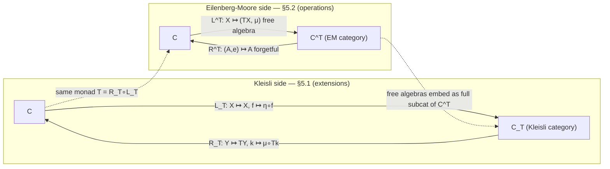

[[book-guidelines|↩ Back to guidelines]]

# Monads

## The problem a monad solves

Everything up to this chapter has been about *ordinary* morphisms: a function $f : X \to Y$ takes a single input and produces a single, definite output. But a huge number of real constructions don't look like that:

- A relation between $X$ and $Y$ can send one $x$ to *several* $y$'s, or none.
- A random process sends $x$ to a whole *probability distribution* over $Y$, not one committed value.
- A logging computation sends $x$ to a value in $Y$ *plus* a side record of what happened along the way.
- A parser sends an input to "a $Y$, or failure."

In each case, the "function" $f$ doesn't land in $Y$ — it lands in some *extension* of $Y$: the power set $PY$, the distributions $\mathcal PY$, the pairs $Y \times M$, the "maybe" set $Y \sqcup 1$. If you've written Rust or Haskell, you already know this shape by another name: it's exactly why `Option<T>`, `Result<T, E>`, and custom effect types exist. A monad is category theory's answer to the question: *what is the general pattern shared by all of these "extended output" constructions, and — crucially — how do you compose functions that have this shape without the composition blowing up in complexity at every step?*

The book gives [[Functors#The formal definition|the formal definition]] first, then spends the rest of the chapter unpacking it from two angles that turn out to be complementary: monads *as extensions of spaces* (§5.1, this is the Kleisli/`bind` side, familiar from functional programming) and monads *as theories of operations* (§5.2, the Eilenberg–Moore side, which is closer to "what does it mean to actually interpret/evaluate an effect").

## The formal definition (§5.0)

> **Definition 5.0.1.** A **monad** on a category $\mathcal C$ consists of a functor $T : \mathcal C \to \mathcal C$, together with two [[Natural-Transformations|natural transformations]]:
> - a **unit** $\eta : \mathrm{id}_{\mathcal C} \Rightarrow T$ (component $\eta_X : X \to TX$),
> - a **multiplication** $\mu : TT \Rightarrow T$ (component $\mu_X : TTX \to TX$),
>
> satisfying **left/right unitality** and **associativity**:
> $$\mu \circ \eta T = \mathrm{id}_T, \qquad \mu \circ T\eta = \mathrm{id}_T, \qquad \mu \circ T\mu = \mu \circ \mu T.$$

In words: $\eta$ says "here is how an ordinary element becomes a generalized one" (a *unit* insertion), and $\mu$ says "here is how to collapse a generalized-generalized element into a single generalized element" (a *flattening*). Associativity says it doesn't matter which pair of nested levels you flatten first.

If this smells exactly like Haskell/Rust's `pure`/`return` and `flatten`/`join`, that's not a coincidence — it's the same structure. In Rust terms, if you had a generic `T<X>` with

```rust
trait Monad {
    type Wrapped<A>;
    fn unit<A>(a: A) -> Self::Wrapped<A>;             // η
    fn flatten<A>(nested: Self::Wrapped<Self::Wrapped<A>>) -> Self::Wrapped<A>; // μ
}
```

the three monad laws are exactly what makes `flatten` well-behaved regardless of how deeply you've nested `Wrapped<Wrapped<Wrapped<A>>>`. Rust's actual `Option`/`Result` don't expose `flatten` as the primitive — they expose `and_then` (Kleisli composition, see below) instead, which is an equivalent formulation the book proves in Proposition 5.1.25.

**What breaks without associativity/unitality:** without them, "simplifying a nested expression" would depend on the order you simplify in — e.g., collapsing `Option<Option<Option<A>>>` down to `Option<A>` could give different answers depending on whether you flatten the outer two levels first or the inner two first. The monad laws are precisely the guarantee that this never happens, which is what lets you write `x.flatten().flatten()` (or chain `and_then` calls) without reasoning case-by-case about associativity every time.

The book immediately notes (Definition 5.0.2) that a **comonad** is just a monad on $\mathcal C^{\mathrm{op}}$ — dualize every arrow, get a counit $\varepsilon : C \Rightarrow \mathrm{id}$ and a comultiplication $\nu : C \Rightarrow CC$. That's the subject of the *next* article in this series; this one stays entirely on the monad side.

---

## Part I — Monads as extensions of spaces (§5.1)

> **Idea.** A monad is a consistent way of extending spaces to include generalized elements and generalized functions of a specific kind.

### Worked examples of the extension idea

The book builds intuition with three running examples, each showing the same pattern: an endofunctor $T$, a unit embedding "old" elements as trivial "new" elements, and a multiplication that collapses one level of nesting.

**The power set monad** $(P, \sigma, \cup)$. $PX$ is the "space of generalized elements of $X$", where a generalized element is a subset (a "multi-valued" or "possibly no-valued" choice). The unit $\sigma_X : X \to PX$ sends $x \mapsto \{x\}$ (singleton), and the multiplication $\cup_X : PPX \to PX$ takes a set of subsets and unions them — "removes the inner brackets." Checking the monad laws here is checking facts about unions you already know instinctively (union of a singleton set-of-sets gives back the one set; union after applying singletons pointwise is a no-op) — the book walks through all three diagrams concretely with $\{x,y,z\}$-style examples (pp. 133–135).

**The distribution monad** $(\mathcal P, \delta, E)$. $\mathcal PX$ is the set of finitely-supported probability measures on $X$ — "random points" of $X$. The unit $\delta_X : X \to \mathcal PX$ sends $x$ to the point mass $\delta_x$ (certainty). The multiplication $E : \mathcal P\mathcal PX \to \mathcal PX$ **averages a distribution over distributions**:
$$E(\pi)(x) = \sum_{p \in \mathcal PX} \pi(p)\, p(x).$$
The book's coin example (p. 135–136) makes this concrete: you have a fair coin and a two-headed coin, you pick one at random (50/50) and flip it — that "law over laws" is an element of $\mathcal P\mathcal PX$, and $E$ collapses it to the actual marginal distribution over {heads, tails} ($3/4$ heads, $1/4$ tails). This is the categorical formalization of the law of total probability. (The Giry monad and Radon monad, Exercises 5.1.4–5.1.5, generalize this to measure-theoretic and topological settings via integration instead of a finite sum.)

**The writer monad** $T_M$ (Example 5.1.7). Fix a monoid $M$ (written additively, neutral element $0$). Then $T_M X = X \times M$, with $\eta(x) = (x, 0)$ and $\mu(x, m, n) = (x, m+n)$. This is *exactly* the `Writer` monad from Haskell, and it models a computation that produces a value **plus a side accumulator** — a cost, an energy release, or (the name's origin) a log/output string, where $M$'s operation is string concatenation. The monad laws here are *literally* the monoid axioms for $M$ — associativity and unitality of $+$ — which is one of the reasons monads are named the way they are: the writer monad is the example that motivated the terminology.

**What breaks without the unit map specifically:** if $\eta$ weren't required to be natural (commute with $Tf$), "treating an ordinary value as a trivial generalized value" could depend on which function you'd already applied, i.e. embedding-then-mapping and mapping-then-embedding could disagree. Naturality of $\eta$ is what guarantees `Some(f(x)) == Option::from(x).map(f)` holds unconditionally.

### 5.1.1 — Kleisli morphisms and the Kleisli category

This is the payoff, and it's the part every working programmer already knows under a different name.

> **Definition 5.1.8.** A **Kleisli morphism** of $T$ from $X$ to $Y$ is a morphism $k : X \to TY$ of $\mathcal C$.

That's it — a Kleisli morphism is just an ordinary morphism, but one whose *target* is an extended space. The reason it deserves its own name is **how it composes**. Given $k : X \to TY$ and $h : Y \to TZ$, you cannot compose them directly (the output type of $k$ doesn't match the input type of $h$). The monad structure fixes this:

> **Definition 5.1.11 (Kleisli composition).** $h \circ_{kl} k : X \to TZ$ is defined by
> $$X \xrightarrow{\;k\;} TY \xrightarrow{\;Th\;} TTZ \xrightarrow{\;\mu\;} TZ. \tag{5.1.1}$$

This is `bind`/`and_then`, spelled out into its three atomic pieces: apply $k$, apply $h$ *underneath* the extension (functorially, via $Th$), then flatten the resulting double-extension with $\mu$. In Rust:

```rust
// A Kleisli morphism X -> M<Y> is exactly this shape:
fn k<X, Y>(x: X) -> Option<Y> { /* ... */ }
fn h<Y, Z>(y: Y) -> Option<Z> { /* ... */ }

// Kleisli composition h ∘_kl k, i.e. μ ∘ Th ∘ k:
fn kleisli_compose<X, Y, Z>(
    k: impl Fn(X) -> Option<Y>,
    h: impl Fn(Y) -> Option<Z>,
) -> impl Fn(X) -> Option<Z> {
    move |x| k(x).and_then(&h)   // .and_then IS μ ∘ Th, fused into one call
}
```

`Option::and_then` (and `Result::and_then`, and Rust's `?` operator desugaring for `Result`) is precisely $\mu \circ Th$ applied to a single Kleisli morphism, i.e. `and_then(h)` on the result of `k` computes exactly $h \circ_{kl} k$ applied to $x$. This is not an analogy — it is the same construction, discovered independently by functional-programming language designers and by Kleisli/Eilenberg–Moore in the 1960s.

**Worked instances (the book's examples, pp. 138–142):**

- **Power set monad.** A Kleisli morphism $X \to PY$ is precisely a *relation* $X \to Y$ (an element can relate to zero, one, or many elements of $Y$). Kleisli composition is exactly relational composition: "$x$ relates to $z$ iff there is a $y$ with $x$ related to $y$ and $y$ related to $z$." The book illustrates this with an explicit bipartite-graph picture — compose $k : X \to PY$ and $h : Y \to PZ$ by fanning out through the intermediate $Y$-nodes and collapsing with union.
- **Distribution monad.** A Kleisli morphism $X \to \mathcal PY$ is a *stochastic map* (a conditional distribution, written $p(y \mid x)$). Kleisli composition works out to
  $$p(z \mid x) = \sum_{y \in Y} p(z \mid y)\, p(y \mid x) \tag{5.1.2}$$
  — the **Chapman–Kolmogorov equation**. This is worth sitting with: the abstract "apply $k$, then $Th$, then $\mu$" recipe, when unwound for the distribution monad, is *exactly* the formula every probabilist already uses to compose Markov transition kernels. For the Giry monad the sum becomes an integral, same formula.
- **Writer monad.** A Kleisli morphism $X \to Y \times M$ is a process that produces a $Y$-value *and* an $M$-cost. Composing $k : X \to Y \times M$ with $h : Y \to Z \times M$ runs $k$, feeds the $Y$ into $h$, and **sums the two costs**. This is literally what a `Writer` monad's `>>=` does with an accumulated log, and it's exactly the mental model for "the total error count after several LaTeX-compilation passes is the sum of the per-pass error counts," which the book uses as its running example.

> **Proposition 5.1.15 / Definition 5.1.16.** The Kleisli morphisms of $T$, with identities given by $\eta$ and composition given by Kleisli composition, form a category $\mathcal C_T$ — the **Kleisli category** of $T$.

[[The-Yoneda-Lemma#The proof|The proof]] that $\eta$ acts as identity and that Kleisli composition is associative is *exactly* re-deriving the monad laws — this is the other reason for the terminology: "unitality" and "associativity" of the monad structure are literally unitality and associativity of a category. In Rust/Haskell language: proving `Option` is a lawful monad *is* proving `Option`'s Kleisli category is a genuine category. Lean's `LawfulMonad` typeclass demands exactly this — `pure` is a two-sided identity for `bind`, and `bind` is associative — and a Lean `Monad` instance without a matching `LawfulMonad` proof is precisely a $T$ that has the operations $\eta,\mu$ but hasn't been shown to satisfy (5.0.1). This is the load-bearing distinction: **any endofunctor with `unit`/`join`-shaped operations can be written down; being a monad is a theorem, not just a type signature.**

### 5.1.2 — The Kleisli adjunction

Every monad, it turns out, *is* an adjunction in disguise — the first of several such results in this chapter (the full theorem, "every adjunction induces a monad," is proved in the chapter's closing section, out of scope here).

There are two canonical [[Functors|functors]] between $\mathcal C$ and its Kleisli category $\mathcal C_T$:

- $L_T : \mathcal C \to \mathcal C_T$, identity on objects, sending $f : X \to Y$ to the Kleisli morphism $\eta \circ f : X \to TY$ — "every ordinary function is trivially a generalized one." (Every function is a special relation; every function is a deterministic stochastic map.)
- $R_T : \mathcal C_T \to \mathcal C$, sending an object $Y$ to $TY$, and a Kleisli morphism $k : X \to TY$ to $\mu \circ Tk : TX \to TY$ — "every generalized function extends to an ordinary function *between the extended spaces*."

> **Proposition 5.1.25.** $R_T \circ L_T \cong T$; $L_T \dashv R_T$ (the Kleisli adjunction); and the unit of this adjunction is exactly $\eta$, the monad's own unit.

The bijection underlying the adjunction is almost a tautology once you see it: $\mathrm{Hom}_{\mathcal C}(X, TY) \cong \mathrm{Hom}_{\mathcal C_T}(X, Y)$ because a Kleisli morphism $X \to Y$ *is by definition* a morphism $X \to TY$ of $\mathcal C$ — the "bijection" is the identity map on the same underlying data, just viewed through two different categories' eyes. What takes real work (and is where the naturality squares in the book's proof, p. 145, earn their keep) is checking this identification is natural in both variables, which is what makes it a genuine adjunction rather than a coincidence.

This matters conceptually: **every monad arises from some adjunction**, and the Kleisli adjunction is the "smallest" (most economical) adjunction that does the job — its total category is built from nothing but $\mathcal C$'s objects and the monad's own generalized morphisms. (The chapter's closing sections show the Eilenberg–Moore adjunction, Part II below, is the "largest" such adjunction, and that *every* adjunction inducing $T$ sits between these two extremes.)

### 5.1.3 — Closure operators and idempotent monads

Specializing to posets makes monads land somewhere very familiar if you've done any lattice-theoretic reasoning: a monad on a poset $(X, \le)$ is a monotone map $t : X \to X$ with $\mathrm{id} \le t$ and $t^2 \le t$ (which, given monotonicity, forces $t^2 = t$). This is exactly:

> **Definition 5.1.27 (closure operator).** $t : X \to X$ is a closure operator if it is (a) **monotone**, (b) **extensive** ($x \le t(x)$), and (c) **idempotent** ($t(t(x)) = t(x)$).

Convex hull, topological closure, and linear span are all closure operators (Exercises 5.1.28–5.1.30) — and, the book notes, **any Galois connection $f \dashv g$ gives a closure operator $g \circ f$** (Exercise 5.1.31), a fact generalized later when the book proves every adjunction induces a monad.

On a general (non-poset) category, "idempotent" needs to be phrased up to isomorphism:

> **Definition 5.1.32.** A monad $(T,\eta,\mu)$ is **idempotent** if $\mu$ is a natural isomorphism.

Idempotent monads model "completing a space in a way that can't be extended any further" — Cauchy completion of a metric space (Exercise 5.1.33), quotienting by an equivalence relation (Exercise 5.1.34), the Kolmogorov quotient of a topological space, group abelianization. Notice the Cauchy-completion and quotient examples: the unit map $\eta$ is sometimes a genuine *embedding* (extending), but for a quotient monad $\eta$ is a **surjection that identifies points** — "extension" is compressing, not enlarging, in that case. The book is explicit that the "extension" intuition, while useful, is not universally accurate: it depends on whether $\eta$ happens to be monic.

**This is directly load-bearing for the CSP/abstract-interpretation side of your project.** A monotone, extensive, idempotent operator on a lattice is exactly the shape of a **fixpoint/closure computation over an abstract domain** — computing the least fixpoint of a constraint-propagation step (interval propagation, congruence closure, transitive closure of a reachability relation) *is* applying an idempotent monad on the poset of abstract states, and "the monad's algebras are exactly the already-closed elements" (Exercise 5.2.21/5.2.22, below) is the categorical statement of "once you've reached a fixpoint, applying the propagator again is a no-op." Galois-connection-induced closures (Exercise 5.1.31) are the same fact underlying abstraction/concretization pairs in abstract interpretation.

---

## Part II — Monads as theories of operations (§5.2)

> **Idea.** A monad is a consistent choice of formal expressions of a specific kind, together with ways to evaluate them.

This is a genuinely different lens on the *same* data $(T, \eta, \mu)$ — instead of asking "what does $T$ let me extend $X$ with," we ask "what formal syntax does $T$ generate over $X$, and what does it mean for a space to actually be able to evaluate that syntax." If Part I was the Kleisli/`bind` side of monads-as-known-from-programming, Part II is closer to what a compiler-writer means by "algebraic effects" or "free monads" — and it maps directly onto elaborator/interpreter design.

**The free commutative monoid monad** $F$ (Example 5.2.1) is the running example: $FX$ is the set of *formal sums* $x_1 + \cdots + x_n$ of elements of $X$ (finite, including the empty sum), with commutativity assumed but nothing else. Crucially, $x + y$ here is **syntax, not computation** — there's no addition on $X$ itself, this is a term you can write down and manipulate symbolically without ever evaluating it, exactly the way $a + b$ is a well-formed expression in a compiler's AST even before $a$ and $b$ have values. $\eta(x)$ is the one-term expression "$x$"; $\mu$ removes one layer of nested brackets, e.g. $(x_1+x_2)+(x_1+x_3) \mapsto x_1+x_2+x_1+x_3$. Checking the monad laws is checking that "collapse nested formal sums" doesn't care which pair of bracket-levels you collapse first — see the book's explicit worked example on p. 151.

(The list monad reinterprets similarly as *non-commutative* formal products — the free monoid monad; the distribution monad reinterprets as *formal convex combinations* — Example 5.2.3's coin-flip point that "there is no actual midpoint between heads and tails" is worth internalizing: a formal expression genuinely can have no result.)

### 5.2.1 — Algebras of a monad (Eilenberg–Moore algebras)

Given the syntax ($T$), an **algebra** is a place where that syntax gets *evaluated*.

> **Definition 5.2.5.** A **$T$-algebra** is an object $A$ together with a morphism $e : TA \to A$ (the evaluation map), satisfying
> $$e \circ \eta_A = \mathrm{id}_A \qquad\text{and}\qquad e \circ \mu_A = e \circ Te.$$

The second axiom is the crux: it says "flatten-then-evaluate" equals "evaluate-the-inside-then-evaluate-the-outside" — you get the same answer whether you first simplify a nested formal expression and then compute its result, or first evaluate the inner sub-expressions and then combine those results. This is exactly the soundness condition you'd demand of an interpreter that's supposed to respect substitution: evaluating a compound expression must agree with substituting evaluated subexpressions and re-evaluating.

**The payoff (Example 5.2.6 and Exercises 5.2.7–5.2.19):** the algebras of $F$ (the free commutative monoid monad) are **exactly the commutative monoids** — a set with an actual $+$, where $e$ interprets each formal sum as its real sum. Symmetrically:

| Monad $T$ | Kleisli morphism $X \to TY$ is... | $T$-algebras are... |
|---|---|---|
| Power set $P$ | a relation | complete semilattices (join/meet) |
| Distribution $\mathcal P$ | a stochastic map / Markov kernel | convex spaces (spaces admitting real weighted averages) |
| List $L$ | — | monoids |
| Free comm. monoid $F$ | — | commutative monoids |
| Writer $T_M$ | a process with a logged cost $m \in M$ | $M$-sets (sets with an $M$-action) |
| Maybe ($X \sqcup 1$) | a partial function | pointed sets |

The morphisms of $T$-algebras are the maps that **commute with evaluation** — $f \circ e_A = e_B \circ Tf$ (Definition 5.2.11) — additive maps for monoids, equivariant maps for $M$-sets, affine maps for convex spaces. The category of $T$-algebras and their morphisms is the **Eilenberg–Moore category**, denoted $\mathcal C^T$.

One structural fact worth flagging for the compiler-project angle: **Exercise 5.2.20** shows that for any $T$-algebra $(A,e)$,
$$TTA \;\underrightarrow{\;\;\mu\;\;}_{\;\;Te\;\;} \;TA \xrightarrow{\;e\;} A$$
is a *coequalizer* diagram — the evaluation map $e$ is, up to universal property, uniquely determined by demanding that "flatten" and "evaluate-then-embed" get identified. And **Exercise 5.2.21** nails down exactly when the "idempotent monad = closure operator" intuition from Part I bites: a monad is idempotent **iff every algebra's structure map is an isomorphism** — i.e., idempotent monads are ones where "already being evaluated/closed" is the *only* possible algebra structure, which is precisely the fixpoint-uniqueness property a well-behaved abstract-domain closure operator needs.

### 5.2.2 — Free algebras

Every extended object $TX$ is canonically a $T$-algebra with structure map $\mu_X : TTX \to TX$ itself (the left-unitality and associativity axioms of the monad *are* the algebra axioms for $(TX,\mu)$, so no extra work is needed — Definition 5.2.23). These are the **free $T$-algebras**: $LX$ (words/lists) is the free monoid on $X$; $FX$ (formal sums) is the free commutative monoid on $X$; $\mathcal PX$ (the simplex over $X$) is the free convex space on $X$, with $X$'s image under $\delta$ picked out as the simplex's **extreme points**.

"Free" means exactly what it does in `Free<F, A>`-style effect libraries: $TX$ contains *every possible formal expression* built from $X$, and nothing is identified except what the algebraic laws force. This is the categorical backbone of the **free monad** pattern used to represent effectful computations as an inert AST/syntax tree that gets *interpreted* later by supplying an algebra (an evaluator) — exactly the "build the term, then discharge it against a semantics" architecture you'd want for a Hoare-logic verification-condition generator that first builds the VC as a formal term and only later interprets it against a specific proof backend (SMT, a custom prover, etc.).

### 5.2.3 — The Eilenberg–Moore adjunction

The forgetful functor $R^T : \mathcal C^T \to \mathcal C$ (an algebra $(A,e) \mapsto A$, forgetting the evaluation map — literally the `Vect → Set`, `Mon → Set`, `Grp → Set` functors from earlier chapters) has a **left adjoint**:

> **Definition 5.2.29.** $L^T : \mathcal C \to \mathcal C^T$ sends $X \mapsto (TX, \mu)$ (the free algebra) and $f \mapsto Tf$.

> **Proposition 5.2.30.** $R^T \circ L^T \cong T$; $L^T \dashv R^T$; the unit is $\eta$; **the counit is given by the algebra structure maps $e$ themselves** — for each algebra $(A,e)$, $\varepsilon_{(A,e)} = e : (TA,\mu) \to (A,e)$.

That last point is worth pausing on: in the Kleisli adjunction (Part I), the unit was the monad's $\eta$ and the counit was comparatively opaque (an isomorphism $R_TL_T \cong T$). Here, in the **Eilenberg–Moore adjunction**, it's the reverse emphasis — the counit is now the maximally concrete "just evaluate" map, because $\mathcal C^T$ is built to contain a *distinguished evaluator* at every object. This asymmetry is exactly why the book calls the Kleisli category and the Eilenberg–Moore category the two "opposite extremes" among all [[Adjunctions|adjunctions]] inducing the same monad $T$ (a fact proved formally later in the chapter, §5.5).

**The universal property (Corollary 5.2.31)** is the one every functional programmer has used without necessarily naming it:
$$\mathrm{Hom}_{\mathcal C}(X, A) \;\cong\; \mathrm{Hom}_{\mathcal C^T}\big((TX,\mu), (A,e)\big).$$
Concretely: any function $f : X \to A$ into the underlying object of a $T$-algebra extends **uniquely** to a morphism of algebras $\tilde f : TX \to A$ with $f = \tilde f \circ \eta$. This single statement recovers:

- the universal property of **free vector spaces** (linear extension of a map defined on a basis) — Example 5.2.32;
- the universal property of **free monoids** — a function out of a generating set extends uniquely to a monoid homomorphism out of the free monoid — Example 5.2.33;
- the universal property of the **simplex/expectation value** — a function $X \to A$ into a convex space extends uniquely to an *affine* map $\mathcal PX \to A$ agreeing with $f$ on the extreme points, i.e. "define an operation on point-masses, and there's exactly one way to extend it to all mixtures that respects convexity" — Example 5.2.34.

In Lean terms, this is precisely the shape of `List.foldr`/`List.rec`'s universal property, or more generally the recursion/elaboration principle you get for free once you know a type is initial for an algebra structure — "any interpretation of the generators into a target algebra determines the interpretation of every compound term, uniquely." If you are building an elaborator that needs to interpret a syntax tree of formal expressions against a semantic domain, Corollary 5.2.31 **is** the theorem that says your interpretation function is well-defined and unique once you've said what it does to the leaves — you don't get to also independently define what it does to compound nodes.

---

## The two-sided picture



Both adjunctions reproduce the *same* monad $(T,\eta,\mu)$ ($R_T \circ L_T \cong T \cong R^T \circ L^T$), but they sit at opposite ends of the space of adjunctions that do so: $\mathcal C_T$ is the leanest possible category realizing $T$ (only the generalized morphisms, nothing more), while $\mathcal C^T$ is the richest (every possible way of *evaluating* $T$-shaped expressions). The Kleisli category always embeds fully faithfully into $\mathcal C^T$ as exactly the free algebras — the book proves this later (§5.5), but you can already see the shape of it here: $L^T(X) = (TX,\mu)$ is precisely the object $R_T(X)$ from the Kleisli side.

---

## Where this leads

Within this book, this chapter's remaining sections dualize everything here to **[[Comonads|comonads]]** (§5.3–5.4: co-Kleisli morphisms, coalgebras, the adjunction of coalgebras — extra *context* rather than extra *output*), and then §5.5 proves the general theorem this article kept gesturing at: *every* adjunction $F \dashv G$ induces a monad $GF$ and a comonad $FG$, with the Kleisli and Eilenberg–Moore constructions bracketing every adjunction that induces a given monad — closing with the payoff example that the categories-vs-multigraphs adjunction from Chapter 4 is *monadic*, meaning its Eilenberg–Moore algebras are exactly categories themselves.

For your own project: the Kleisli/`bind` side is the machinery you already reach for whenever you thread failure, nondeterminism, or logging through a pipeline (a constraint solver's search, an elaborator's metavariable-assignment monad); the Eilenberg–Moore/algebra side is the more load-bearing one going forward — it's the precise categorical statement of "build a term, then interpret it against a semantics," which underlies free-monad-style effect interpreters, and it's the exact shape of "the unique structure-preserving map out of a freely-generated syntax" that any elaborator or verification-condition generator depends on to be well-defined. And §5.1.3's idempotent monads/closure operators are, without any translation needed, the categorical description of the fixpoint/closure operators (Galois-connection-induced abstraction, congruence/transitive closure, interval-propagation to a fixpoint) that abstract interpretation runs on.
