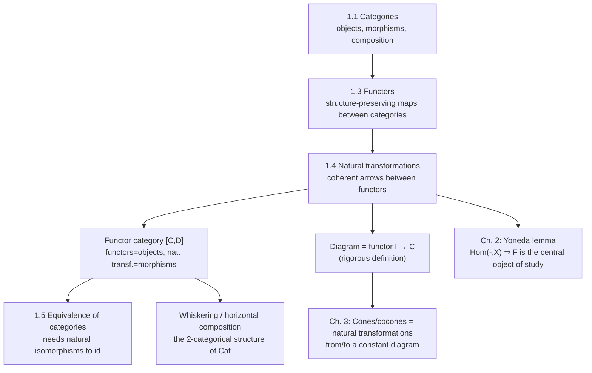

[[book-guidelines|↩ Back to guidelines]]

# Natural Transformations

## The problem: comparing two functors

By this point in the book you have two levels of structure: objects and morphisms inside a category ($\S$1.1), and [[Functors|functors]] mapping whole categories into other categories while preserving that structure ($\S$1.3). The next question is unavoidable once you have functors at all: given two functors $F, G : \mathcal{C} \to \mathcal{D}$ with the *same* source and target, what does it mean to compare them, or to map one into the other?

A tempting first answer — "just give a function from $F$ to $G$" — doesn't even parse; functors aren't sets, they're whole assignments of objects-to-objects and morphisms-to-morphisms. What you actually want is a *coherent, uniform way of relating the image of $F$ to the image of $G$*, one relating arrow $F C \to G C$ for every object $C$, such that these arrows don't work at cross purposes with the morphisms already present in $\mathcal{C}$ and $\mathcal{D}$.

That's exactly what a **natural transformation** is. It is the "arrow between functors" — the third rung of a ladder that starts with objects, rises to morphisms, and rises again to transformations of whole structure-preserving maps. This three-level structure (objects, morphisms, morphisms-between-morphisms) is your first encounter with what's called a *2-category*, and $\mathrm{Cat}$ (categories, functors, natural transformations) is the paradigmatic example.

If you've done any work with type classes or traits, there's a load-bearing analogy here worth stating up front and then earning properly below: a natural transformation is the categorical version of a **polymorphic function that works uniformly for every instantiation of a type parameter**, in exactly the sense that Reynolds' "parametricity" makes precise for `fn foo<T>(x: F<T>) -> G<T>`. We'll come back to this once [[Functors#The formal definition|the formal definition]] is on the table.

## The formal definition

**Definition 1.4.1 (the book's own).** Let $\mathcal{C}$ and $\mathcal{D}$ be categories, and let $F, G : \mathcal{C} \to \mathcal{D}$ be functors. A natural transformation $\alpha$ from $F$ to $G$ consists of:

- For each object $C$ of $\mathcal{C}$, a morphism $\alpha_C : FC \to GC$ in $\mathcal{D}$, called the **component of $\alpha$ at $C$**;
- For each morphism $f : C \to C'$ of $\mathcal{C}$, the following square — the **naturality square** — must commute:

$$
\begin{array}{ccc}
FC & \xrightarrow{\ Ff\ } & FC' \\
{\scriptstyle \alpha_C}\downarrow & & \downarrow{\scriptstyle \alpha_{C'}} \\
GC & \xrightarrow{\ Gf\ } & GC'
\end{array}
$$

i.e. $\alpha_{C'} \circ Ff = Gf \circ \alpha_C$.

Notation: natural transformations get a **double arrow**, $\alpha : F \Rightarrow G$, to visually distinguish them from functors (single arrows) and from ordinary morphisms. Perrone draws the whole picture as:

$$
\mathcal{C} \underset{G}{\overset{F}{\rightrightarrows}} \mathcal{D}, \qquad \alpha : F \Rightarrow G \text{ sitting between the two arrows.}
$$

Reading the naturality square as "what breaks without it" is the fastest way in: without the square, $\alpha$ is just a family of unrelated morphisms $\{\alpha_C\}_{C \in \mathcal{C}}$, one per object, with no relationship to the morphism structure of $\mathcal{C}$ at all. You could pick them arbitrarily and independently. The naturality condition is what forces the components to *cohere* — to form a single uniform transformation rather than an incoherent object-by-object patch job. This is precisely the failure mode the book spends an entire subsection (1.4.4) demonstrating with real, damning counterexamples — more on that below.

## Three complementary intuitions

The book deliberately gives three readings of the same definition before naming what "not natural" means, because no single intuition alone makes the concept feel inevitable. Each is grounded in a worked example straight from the source pages.

### 1. A natural transformation as a system of arrows

**Idea (1.4.1, the book's own phrasing):** *A natural transformation is a consistent system of arrows between the images of two functors.*

**Example 1.4.2 (posets).** Let $(X, \le)$ and $(Y, \le)$ be posets viewed as categories (objects = elements, a unique morphism $x \to x'$ exactly when $x \le x'$). Monotone maps $f, g : X \to Y$ are functors. A natural transformation $f \Rightarrow g$ is, for each $x \in X$, an arrow $f(x) \to g(x)$ in $Y$ — that is, $f(x) \le g(x)$ for every $x$. The naturality square is *automatically* satisfied here (in a poset every diagram commutes, since there's at most one morphism between any two objects). So the whole content of "natural transformation" collapses to: $f \le g$ pointwise. This is the cleanest possible illustration that a natural transformation is a systematic, all-at-once comparison — here, literally the statement "$f$ is everywhere below $g$."

### 2. A natural transformation as a structure-preserving mapping

**Idea (1.4.2):** *A natural transformation is a mapping between functors preserving specified actions, symmetries, or other structures.*

**Example 1.4.4 (group representations).** A linear representation of a group $G$ is a functor $R : BG \to \mathrm{Vect}$ (recall $BG$ is the delooping of $G$: one object, morphisms = elements of $G$, composition = group multiplication). Given two representations $R, S : BG \to \mathrm{Vect}$ on vector spaces $V, W$, a natural transformation $\alpha : R \Rightarrow S$ is a single linear map $\alpha : V \to W$ (one component, since $BG$ has one object) such that for every $g \in G$:

$$
\alpha(g \cdot v) = g \cdot \alpha(v).
$$

This is precisely the definition of an **equivariant map** — a map commuting with a group action. So "natural transformation between two representations of $G$" *is* "morphism of representations" in the ordinary sense of representation theory; the abstract machinery reproduces the concrete definition exactly. The book extends this immediately to $G$-spaces (Example 1.4.5, functors $BG \to \mathrm{Top}$) and to monoid-indexed dynamical systems (Example 1.4.6, functors $BM \to \mathrm{Top}$, where $M$ can be $(\mathbb{N}, +)$): in both cases a natural transformation is exactly a map compatible with the acting structure ("$\alpha$ is compatible with the dynamics").

**Example 1.4.7 (multigraphs as presheaves).** Recall from $\S$1.3 that a directed multigraph is a presheaf $F : \mathrm{Par}^{op} \to \mathrm{Set}$, where $\mathrm{Par}$ is the two-object, two-parallel-morphism shape category. A natural transformation $\alpha : F \Rightarrow G$ between two such presheaves consists of two functions $\alpha_E : FE \to GE$ and $\alpha_V : FV \to GV$ such that source and target are preserved: the source of $\alpha_E(e)$ equals $\alpha_V$ applied to the source of $e$, and likewise for targets. In plain terms, $\alpha$ is a graph homomorphism — a mapping of edges and vertices that respects incidence. Naturality here *is* "structure preservation" in the most literal graph-theoretic sense.

### 3. A natural transformation as a canonical map

**Idea (1.4.3):** *A natural transformation is a mapping or assignment which is canonical, systematic, or "natural" (hence the name).*

This is the reading that gives the concept its name, and it's worth sitting with because it's the one that will matter most for anything type-theoretic later: naturality formalizes *independence from an arbitrary choice*.

**Example 1.4.8 (the singleton embedding).** Take the power set functor $P : \mathrm{Set} \to \mathrm{Set}$. There's an obvious map $\sigma : X \to PX$ sending $x \mapsto \{x\}$. Is this natural? Check: for any $f : X \to Y$,

$$
\sigma(f(x)) = \{f(x)\}, \qquad Pf(\sigma(x)) = Pf(\{x\}) = \{f(x)\}.
$$

Equal. So $\sigma$ is a natural transformation $\sigma : \mathrm{id}_{\mathrm{Set}} \Rightarrow P$ (note: the top edge of the square is $f$ with the *identity functor* silently applied). What does naturality buy you here? Take $p : X \to X$ a permutation — a relabeling of $X$'s elements. Naturality of $\sigma$ with respect to $p$ says the diagram with $p$ and $Pp$ commutes: relabel $X$, then take singletons, is the same as taking singletons, then relabel $PX$ accordingly. The map $\sigma$ "doesn't care" how you label the elements. *That* is what "canonical" cashes out to, precisely: invariance under all automorphisms of the source, expressed as commutativity of one square. The book runs the identical pattern for the Dirac-measure embedding into the distribution/probability functor $\mathcal{P}$ (Exercises 1.4.9–1.4.10, both finitely-supported and full measure-theoretic Giry/Radon versions) and leaves the list-functor analogue as Exercise 1.4.11.

**Example 1.4.12 (the double-dual embedding — the flagship example).** This is the book's central illustration, and it's worth working through completely because it's the textbook case of "naturality separates the canonical map from the merely well-defined one." Every finite-dimensional vector space $V$ is isomorphic to its dual $V^*$ *and* to its double dual $V^{**}$ — but only one of those isomorphisms is basis-independent.

Define $\eta : V \to V^{**}$ by evaluation: for $v \in V$, let $\eta(v)$ be the functional $V^* \to \mathbb{R}$, $\omega \mapsto \omega(v)$. Naturality means: for every linear $f : V \to W$,

$$
\begin{array}{ccc}
V & \xrightarrow{\ f\ } & W \\
{\scriptstyle \eta}\downarrow & & \downarrow{\scriptstyle \eta} \\
V^{**} & \xrightarrow{\ f^{**}\ } & W^{**}
\end{array}
$$

[[The-Yoneda-Lemma#The proof|The proof]] is a one-line unwind of definitions: $\eta(f(v))(\omega) = \omega(f(v))$, while $f^{**}(\eta(v))(\omega) = \eta(v)(f^*\omega) = (f^*\omega)(v) = \omega(f(v))$. Equal, so $\eta$ is natural — with no basis in sight anywhere in the argument. When $V$ is finite-dimensional, $\eta$ is furthermore an isomorphism, giving a **natural isomorphism** (defined formally as Definition 1.4.13: a natural transformation whose every component is an isomorphism).

## What is *not* natural (Section 1.4.4) — the load-bearing counterexamples

The book devotes an entire subsection to failures, and this is deliberate: understanding naturality by its failure modes is more durable than understanding it only by successful examples. Two counterexamples matter most.

**The single dual $V \to V^*$.** First, there's a type mismatch: the single-dual functor $(-)^* : \mathrm{Vect} \to \mathrm{Vect}$ is *contravariant* (it reverses arrows — see the functors article), so there can be no natural transformation from $\mathrm{id}_{\mathrm{Vect}}$ (covariant) to $(-)^*$ at all; one lives on $\mathrm{Vect}$, the other on $\mathrm{Vect}^{op}$. But even setting that aside, there's a deeper reason: every isomorphism $V \to V^*$ you can actually construct requires picking a basis $e_1, \dots, e_n$ of $V$, then defining the dual basis $e^1, \dots, e^n$ by $e^i(e_j) = \delta_{ij}$, then setting $d(e_i) := e^i$. Change the basis and $d$ changes — the book invites you to verify this directly. So $d$ is basis-*dependent*: well-defined once you commit to a basis, but with no canonical, basis-free description. That's exactly what "not natural" means in practice.

**The no-cloning theorem (Example 1.4.16).** The tensor-square functor $F(V) = V \otimes V$ admits no natural transformation $\alpha : \mathrm{id} \Rightarrow F$ except the zero map. The naive coordinate-dependent attempt $\alpha(\sum v^i e_i) := \sum v^i (e_i \otimes e_i)$ again depends on the choice of basis and fails naturality — and this algebraic fact is literally the categorical statement of the quantum no-cloning theorem: there is no basis-independent, universal way to "duplicate" an arbitrary quantum state, because duplication in this sense would be exactly a natural transformation $\mathrm{id} \Rightarrow (-)\otimes(-)$, and none exists.

**Grounding this for a type-theorist.** This is precisely the phenomenon *parametricity* in Rust/Lean rules out by construction. A Rust function `fn dual_hack<V: VectorSpace>(v: V) -> V::Dual` that internally picks a basis to build its answer is not "natural in `V`" — it's exploiting extra information (a basis) that the type signature `∀V. V -> Dual<V>` doesn't actually grant it. A genuinely parametric function — one that only uses the operations `V` exposes, uniformly, for every instantiation — automatically satisfies a naturality square, by Reynolds' abstraction theorem (the "theorems for free" result). The naturality square in category theory *is* what a free theorem states for a specific transformation; the failure of $V \to V^*$ to be natural is the same shape of fact as "you cannot write a well-typed generic function that inspects the internal representation of an opaque type parameter." If you've written Rust generics that compile only because you added a `Basis` trait bound (extra data attached to `V` beyond what "vector space" alone gives you), you've just reproduced the $d : V \to V^*$ counterexample: the map exists, but only relative to structure the naturality square would have required to be *irrelevant*.

```rust
// A hypothetical "natural" (parametric) map: works for EVERY V uniformly,
// using only the vector-space operations — analogous to eta : V -> V**.
fn double_dual_embed<V: VectorSpace>(v: V) -> DoubleDual<V> {
    // eta(v)(omega) = omega(v) — defined purely in terms of V's own structure,
    // no basis ever chosen.
    DoubleDual::from_evaluation(move |omega: Dual<V>| omega.apply(&v))
}

// The non-natural analogue would require an extra capability the type alone
// doesn't provide, e.g. `V: VectorSpace + HasChosenBasis`, which breaks
// uniformity across choices of basis — exactly Perrone's counterexample.
```

In Lean terms: a natural transformation is what you get automatically at the term level once you have a genuinely polymorphic proof term `η : ∀ V, F V → G V` built only from the functorial actions of `F` and `G` — checking naturality is checking that `η` commutes with `F f` and `G f` for arbitrary `f`, which is precisely the kind of coherence obligation `isDefEq`-style definitional unfolding either discharges by `rfl` (when the square commutes by unfolding definitions, as in `η` above) or cannot discharge (when — as with $d : V \to V^*$ — the construction secretly consults extra data like a basis that isn't part of the abstract signature).

## Functor categories: natural transformations as morphisms

Once you have objects (functors $\mathcal{C} \to \mathcal{D}$) and arrows between them (natural transformations) that compose associatively and have identities, you have a category — and this is exactly Definition 1.4.17:

**Definition 1.4.17.** The **functor category** $[\mathcal{C}, \mathcal{D}]$ has:
- objects: functors $F : \mathcal{C} \to \mathcal{D}$;
- morphisms: natural transformations $\alpha : F \Rightarrow G$.

The identity on $F$ is the natural transformation with components $\mathrm{id}_{FC}$. Composition ("**vertical composition**", though the book doesn't use that phrase explicitly here but it's the standard name) of $\alpha : F \Rightarrow G$ and $\beta : G \Rightarrow H$ is $\beta \circ \alpha : F \Rightarrow H$, with components $(\beta \circ \alpha)_C = \beta_C \circ \alpha_C$ — you literally compose the component morphisms in $\mathcal{D}$. (Exercise 1.4.18 asks you to check this is again natural — a short diagram chase pasting two commuting squares side by side.)

This single construction *retroactively explains* every example above:

| $\mathcal{C}$ | $\mathcal{D}$ | $[\mathcal{C}, \mathcal{D}]$ is... |
|---|---|---|
| any poset-shaped $\mathcal{C}$ | a poset $\mathcal{D}$ | the poset of monotone maps, pointwise order |
| $BG$ | $\mathrm{Vect}$ | the category of linear representations of $G$ and $G$-equivariant maps |
| $BG$ | $\mathrm{Top}$ | the category of $G$-spaces and $G$-equivariant continuous maps |
| $BM$ | $\mathrm{Top}$ | dynamical systems indexed by monoid $M$, and their morphisms |
| $\mathrm{Par}$ | $\mathrm{Set}$ | (as presheaves on $\mathrm{Par}^{op}$) directed multigraphs and incidence-preserving maps — the book names this category $\mathbf{MGraph}$ |

The caveat the book flags immediately: $[\mathcal{C}, \mathcal{D}]$ can fail to be **locally small** even when $\mathcal{C}$ and $\mathcal{D}$ both are — the collection of natural transformations between two functors can be large in general, since it's built from a whole family of hom-sets indexed by (possibly many) objects. This is a genuine set-theoretic subtlety, not a technicality to skip past: it's the same kind of size issue that later forces care around presheaf categories and the Yoneda embedding.

## Diagrams as functors (Definition 1.4.20 — "this time for real")

Earlier in the book, "diagram" was used informally (dots and arrows on the page, as in commutative-square arguments). Now that functors and functor categories exist, diagrams get a rigorous definition:

**Definition 1.4.20.** Let $\mathcal{C}$ be a category and $I$ a *small* category (the "shape"). A **diagram in $\mathcal{C}$ of shape $I$** is a functor $D : I \to \mathcal{C}$.

The category of $I$-shaped diagrams in $\mathcal{C}$ is exactly the functor category $[I, \mathcal{C}]$.

This is the same move as defining a loop in a space $X$ as a continuous map $S^1 \to X$, or a path as a continuous map $[0,1] \to X$: instead of "a picture," a diagram becomes a first-class mathematical object (a functor) that can itself be manipulated, compared, and mapped between. Crucially, $D$ need not be injective — objects and morphisms of $\mathcal{C}$ can repeat in the diagram — and a non-commuting triangle in $I$ produces a non-commuting triangle in $\mathcal{C}$; but a commuting one in $I$ is *forced* by functoriality to commute in $\mathcal{C}$.

Once diagrams are functors, **morphisms of diagrams are natural transformations** $\alpha : D \Rightarrow D'$ between two functors $I \to \mathcal{C}$ — this is the "vertical squares must commute" picture the book draws with a triangle-shaped $I$. This is the seed of the next chapter: cones and cocones (used to define [[Limits-and-Colimits|limits and colimits]]) are literally natural transformations from a constant diagram to $D$, or from $D$ to a constant diagram.

## Whiskering and horizontal composition (Section 1.4.6)

Vertical composition (inside one functor category $[\mathcal{C}, \mathcal{D}]$) is not the only way to combine natural transformations. When three categories and *two* different arrows of the "2-category" picture are in play, you get **whiskering** and its generalization, **horizontal composition**.

### Whiskering by a functor

**Left whiskering.** Given $F : \mathcal{C} \to \mathcal{D}$, functors $H, I : \mathcal{D} \to \mathcal{E}$, and $\beta : H \Rightarrow I$, you can produce a new natural transformation $\beta F : H \circ F \Rightarrow I \circ F$ by "pre-restricting" $\beta$'s components to the image of $F$: $(\beta F)_C := \beta_{FC}$. Naturality of $\beta F$ is inherited directly from naturality of $\beta$, since $FC$ is just a particular object of $\mathcal{D}$.

**Right whiskering.** Symmetrically, given $F, G : \mathcal{C} \to \mathcal{D}$, $\alpha : F \Rightarrow G$, and $H : \mathcal{D} \to \mathcal{E}$, you get $H\alpha : HF \Rightarrow HG$ by applying $H$ to every component: $(H\alpha)_C := H(\alpha_C)$. The naturality square for $H\alpha$ is obtained by *applying the functor $H$ to the naturality square of $\alpha$* — and since functors preserve commutative diagrams (established back in $\S$1.3), the resulting square commutes too. This is a clean, reusable proof technique worth internalizing: naturality of a whiskered transformation is inherited "for free" via functoriality of the whiskering functor, not re-derived from scratch.

Whiskering is the operation your elaborator/unifier intuition should key onto: it is *substitution into one side of a coherence obligation while leaving the other structure fixed* — the same shape of operation as substituting a term into one hole of a typing judgment while other premises stay put.

### Horizontal composition

Whiskering is the special case where one of the two natural transformations is trivial (an identity). The general situation: given

$$
\mathcal{C} \underset{G}{\overset{F}{\rightrightarrows}} \mathcal{D} \underset{I}{\overset{H}{\rightrightarrows}} \mathcal{E}, \qquad \alpha : F \Rightarrow G,\ \ \beta : H \Rightarrow I,
$$

there are two ways to build a transformation $HF \Rightarrow IG$: whisker $\alpha$ right by $H$ then compose with $\beta$ whiskered left by $G$ (giving $(\beta G) \circ (H\alpha)$), or whisker $\beta$ left by $F$ first then $\alpha$ right by $I$ (giving $(I\alpha) \circ (\beta F)$). **Proposition 1.4.22** is the fact that these agree:

$$
(\beta G) \circ (H\alpha) = (I\alpha) \circ (\beta F).
$$

The proof is a textbook instance of *pasting two commuting squares and reading the diagonal two ways* — plug in definitions of whiskering at a component $C$, and both sides reduce to checking commutativity of

$$
\begin{array}{ccc}
HFC & \xrightarrow{\ H\alpha_C\ } & HGC \\
{\scriptstyle \beta_{FC}}\downarrow & & \downarrow{\scriptstyle \beta_{GC}} \\
IFC & \xrightarrow{\ I\alpha_C\ } & IGC
\end{array}
$$

which is exactly the naturality square of $\beta$ applied at the morphism $\alpha_C : FC \to GC$. So the coincidence isn't a coincidence — it's naturality of $\beta$, restated. This is Perrone's own closing remark: *"Naturality, in other words, means that writing these diagrams does not lead to ambiguity."* This unambiguity is Definition 1.4.23's justification for defining the **horizontal composition** $\beta\alpha : HF \Rightarrow IG$ as this common value, denoted by bare juxtaposition.

This is the algebraic backbone of a 2-category: objects (categories), 1-morphisms (functors) composing associatively, 2-morphisms (natural transformations) composing two independent ways — vertically inside a fixed pair of categories, horizontally across a chain of functors — with an interchange law (Proposition 1.4.22, generalized) guaranteeing the two composition operations commute with each other. Anyone who has worked with substitution and context extension in a typed calculus has effectively met this shape before: horizontal composition is analogous to composing two substitutions across a telescope of contexts, where the interchange law is what lets you not care about the order you push substitutions through independent binders.

## Synthesis: where this sits in the book, and where it leads



Natural transformations complete the definitional core of the book's opening chapter — categories, functors, natural transformations is the standard "0-, 1-, 2-cell" triad that everything else builds on. Concretely, this section is a direct prerequisite for:

- **Section 1.5 (equivalence of categories)**, which needs a natural isomorphism, not mere isomorphism, between $GF$ and $\mathrm{id}_{\mathcal{C}}$ (and dually) — you cannot even state what an equivalence is without this chapter.
- **Chapter 2 (Yoneda lemma)**, whose central objects — $\mathrm{Nat}(\mathrm{Hom}_{\mathcal{C}}(-,X), F)$ — are literally sets of natural transformations between a representable functor and an arbitrary one. [[The-Yoneda-Lemma|The Yoneda lemma]] cannot be *stated* without this chapter's vocabulary.
- **Chapter 3 (limits and colimits)**, where a cone over a diagram $F : I \to \mathcal{C}$ is defined as a natural transformation from the constant diagram at some object $X$ to $F$ — the "diagrams as functors" reframing from 1.4.5 is exactly what makes this definition possible.

**For your compiler/elaborator project**, the most load-bearing single fact in this section is the naturality-as-parametricity connection developed above: naturality squares are the categorical shadow of Reynolds parametricity / free theorems, and the failure examples (single dual, no-cloning) are a precise, checkable model of "a generic function that secretly depends on more than its type signature grants it" — the exact bug class an elaborator's unifier needs to rule out when it decides two terms are definitionally equal only up to a choice it shouldn't be allowed to make. Horizontal composition and the interchange law are also worth flagging explicitly: they are the same associativity/commutativity discipline your context-management and substitution machinery will need when composing several unification or elaboration steps across nested binders, and are a clean, minimal setting to get the bookkeeping right before facing it inside a full bidirectional type checker.
