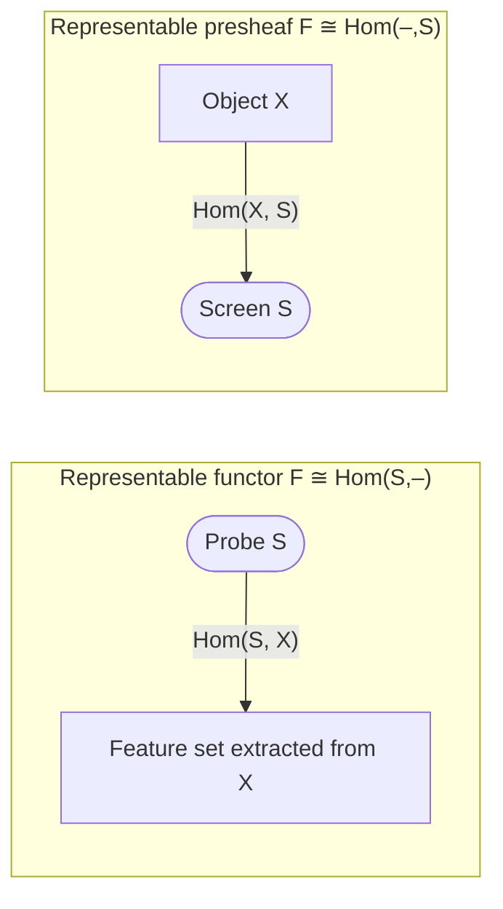

[[book-guidelines|↩ Back to guidelines]]

## Why bother extracting sets from objects?

A category, on its own, gives you objects and arrows and nothing else — no "elements," no way to peek inside an object and ask what it's made of. That's deliberate: category theory wants to talk about a topological space, a group, or a graph without committing to a particular internal representation. But it's also inconvenient, because a huge amount of ordinary mathematical (and computational) reasoning is about *contents*: the points of a space, the elements of a group, the vertices of a graph.

Perrone opens §2.1 by noting that you can still get sets like these out of an object $X$, as long as you do it *functorially* — i.e. the extraction has to be natural with respect to morphisms, not an ad hoc peek. Given a topological space $X$, for instance, you can extract:

- $U(X)$, the underlying set of points,
- $\mathrm{Curve}(X)$, the set of continuous curves in $X$,
- $\mathrm{Loop}(X)$, the set of continuous loops (closed curves),
- $\pi_0(X)$, the set of path-connected components,
- $O(X)$, the set of open sets (the topology itself).

Each of these is functorial: a continuous map $f: X \to Y$ pushes points to points, curves to curves, loops to loops, components to components — giving [[Functors|functors]] $U, \mathrm{Curve}, \mathrm{Loop}, \pi_0 : \mathbf{Top} \to \mathbf{Set}$. The open-sets assignment $O$ goes the *other* way — $f^{-1}$ pulls open sets of $Y$ back to open sets of $X$ — so it's a **presheaf**, a contravariant functor $O : \mathbf{Top}^{op} \to \mathbf{Set}$.

**What breaks without functoriality.** If you allowed *any* assignment $X \mapsto (\text{some set})$, you'd lose the ability to compare the sets you get for different objects, because there'd be no map relating $U(X)$ to $U(Y)$ when there's a map $X \to Y$. You'd have a pile of disconnected sets, not a structure you can reason about across the whole category. Functoriality is what turns "peeking inside $X$" into something that composes with the rest of category theory.

The book runs the same move for directed multigraphs ($\mathrm{Vert}$, $\mathrm{Edge}$, $\mathrm{Chain}_n$, $\pi_0$) and for groups ($U(G)$, and the set of order-$n$ elements). This is the setup — the actual content of §2.1 is the observation that comes next: *most of these functors turn out to have exactly the same shape*.

## Representable functors: a functor that *is* a Hom-set

Look again at $U : \mathbf{Top} \to \mathbf{Set}$. A point of $X$ is exactly the same thing as a continuous map from the one-point space $1$ into $X$ — pick out a point, or pick out a map from $1$; it's a bijection, and one that's natural in $X$. So

$$
U(X) \;\cong\; \mathrm{Hom}_{\mathbf{Top}}(1, X).
$$

The functor $U$ isn't just *related to* a Hom-functor — it *is* one, up to natural isomorphism. This is common enough, and important enough, that it gets a name.

**Definition 2.1.6 (representable functor / presheaf).** A functor $F : \mathcal{C} \to \mathbf{Set}$ is **representable** if it is naturally isomorphic to $\mathrm{Hom}_\mathcal{C}(S, -) : \mathcal{C} \to \mathbf{Set}$ for some object $S$ of $\mathcal{C}$. $S$ is called the **representing object**.

A presheaf $F : \mathcal{C}^{op} \to \mathbf{Set}$ is **representable** if it is naturally isomorphic to $\mathrm{Hom}_\mathcal{C}(-, S) : \mathcal{C}^{op} \to \mathbf{Set}$ for some $S$; again $S$ is the representing object.

### The intuition: $S$ as a probe, or as a screen

This is the load-bearing intuition of the whole section, and it's worth sitting with before moving to the worked examples.

- $\mathrm{Hom}_\mathcal{C}(S, -)$ applied to $X$ is the set of arrows *from* $S$ *into* $X$. Think of $S$ as a **probe**: you insert it into $X$ in every possible way, and $\mathrm{Hom}_\mathcal{C}(S, X)$ is the set of readings you get. A representable functor is one whose feature-extraction is entirely explained by "how many ways can a fixed probe $S$ be mapped in."
- Dually, $\mathrm{Hom}_\mathcal{C}(-, S)$ applied to $X$ is the set of arrows *from* $X$ *into* $S$. Think of $S$ as a **screen** or **measuring device with a fixed set of readouts**: $\mathrm{Hom}_\mathcal{C}(X, S)$ is every way you can project $X$ onto that screen. A representable presheaf is a feature-extraction fully explained by "how many ways can $X$ be observed against a fixed screen $S$."

This is the same duality that shows up constantly once you start looking for it: probes go in, observations come out; a representable functor packages the "in" direction and a representable presheaf packages the "out" direction. Everything below is just this idea worked out in four different categories.



### What breaks without representability

Most functors are *not* representable — $\pi_0 : \mathbf{Top} \to \mathbf{Set}$ is the running counterexample in the text. There is no space $S$ such that "maps from $S$ into $X$" naturally recovers the connected components of $X$, because path-components are a *quotient* of the points of $X$, not a set of things you can pick out one probe-map at a time — no single probe can distinguish "$x$ and $y$ are in the same component" from "$x$ and $y$ are literally the same point" the way a Hom-set would need to. Representability is a genuine structural fact about a functor, not something you get for free — which is exactly why, when it does hold, it's worth naming and exploiting.

## Worked examples

The book's worked examples are the real content here — each one nails down a concrete representing object, and each one teaches you something different about how to *find* one.

### $\mathbf{Top}$: points, curves, loops, and the open-set presheaf

| Functor | Representing object $S$ | Why |
|---|---|---|
| $U$ (points) | the one-point space $1$ | a continuous map $1 \to X$ is exactly a choice of point |
| $\mathrm{Curve}$ (curves w/ endpoints) | $[0,1]$ | a continuous map $[0,1] \to X$ *is* a curve with endpoints |
| $\mathrm{Loop}$ (closed curves) | the circle $S^1$ | a continuous map $S^1 \to X$ *is* a loop |
| $O$ (open sets, a **presheaf**) | the Sierpiński space $\mathbb{S} = \{0,1\}$, open sets $\{\varnothing, \{1\}, \{0,1\}\}$ | a continuous $f: X \to \mathbb{S}$ is exactly the "is this point in $U$?" indicator of an open set $U \subseteq X$ |

The Sierpiński-space example is the one worth lingering on, because it's the least obvious and the most structurally important. A continuous function $f: X \to \mathbb{S}$ must satisfy $f^{-1}(\varnothing) = \varnothing$ and $f^{-1}(\mathbb{S}) = X$ automatically, so continuity reduces to a single condition: $f^{-1}(\{1\})$ must be open in $X$. That's it — every continuous $f : X \to \mathbb{S}$ *is* (the indicator function of) an open subset of $X$, and every open subset gives such an $f$. So

$$
O(X) \;\cong\; \mathrm{Hom}_{\mathbf{Top}}(X, \mathbb{S}),
$$

naturally in $X$ — the topology presheaf is representable by the Sierpiński space. This is the categorical seed of an idea you'll recognize if you've touched domain theory or denotational semantics: $\mathbb{S}$ behaves like a "one-bit observation," and open sets are exactly the semi-decidable properties you can detect by observing a point through that one bit. Note $\pi_0$, by contrast, does *not* appear in this table — it isn't representable, for the reason given above.

### $\mathbf{MGraph}$: vertices, edges, and $n$-chains

Let $G_0$ be the multigraph with one vertex and no edges, and $G_1$ the multigraph with two vertices and a single edge between them. Then:

- $\mathrm{Vert}(G) \cong \mathrm{Hom}_{\mathbf{MGraph}}(G_0, G)$ — a morphism $G_0 \to G$ has nowhere to send edges (there are none), so it's nothing but a choice of target vertex.
- $\mathrm{Edge}(G) \cong \mathrm{Hom}_{\mathbf{MGraph}}(G_1, G)$ — a morphism $G_1 \to G$ has to send $G_1$'s single edge somewhere, and that choice is exactly a choice of edge in $G$ (together with its forced endpoints).
- More generally, letting $G_n$ be the chain of $n$ edges and $n+1$ vertices, $\mathrm{Chain}_n(G) \cong \mathrm{Hom}_{\mathbf{MGraph}}(G_n, G)$.

This is a clean, minimal instance of the probe intuition: $G_0, G_1, G_n$ are the *smallest possible shapes* that can witness "a vertex," "an edge," "an $n$-chain," respectively, and mapping the smallest witnessing shape into $G$ is precisely what it means to find one of those things inside $G$. This is worth remembering — representing objects are frequently the free/minimal structure exhibiting exactly the shape you're trying to extract, nothing more.

### $\mathbf{Grp}$: why the trivial group doesn't work, and $\mathbb{Z}$ does

For a group $G$, you might guess (by analogy with the one-point space representing points) that the trivial group $\{e\}$ represents $U : \mathbf{Grp} \to \mathbf{Set}$. It doesn't — and the reason is instructive. A group homomorphism $f : \{e\} \to G$ is forced to send $e \mapsto e_G$; there's only ever *one* such homomorphism, so $\mathrm{Hom}_{\mathbf{Grp}}(\{e\}, G)$ is always a one-element set, no matter how big $G$ is. It can't possibly be naturally isomorphic to $U(G)$.

The correct representing object is $(\mathbb{Z}, +)$. A homomorphism $f : \mathbb{Z} \to G$ is completely determined by where it sends the generator $1$ — set $f(1) = g$, and then $f(0) = e$, $f(-1) = g^{-1}$, $f(2) = g^2$, and so on is all forced. So there's a bijection between homomorphisms $\mathbb{Z} \to G$ and elements $g \in G$, natural in $G$:

$$
U(G) \;\cong\; \mathrm{Hom}_{\mathbf{Grp}}(\mathbb{Z}, G).
$$

Why does this work when the trivial group fails? Because $\mathbb{Z}$ is the *free group on one generator* — it has exactly enough structure (one generator, no relations) to force a homomorphism out of it to carry exactly one bit of free choice, matching "pick an element of $G$" one-for-one. $\{e\}$ has *no* free generators, so maps out of it carry zero bits of choice. The lesson generalizes: representing objects for "extract an $n$-ary piece of structure" functors tend to be free objects on $n$ generators of the appropriate shape — this is precisely why $G_1$ (not $G_0$) represents edges, and $\mathbb{Z}$ (not $\{e\}$) represents elements. The same pattern gives you the order-$n$ elements of $G$ as $\mathrm{Hom}_{\mathbf{Grp}}(\mathbb{Z}/n, G)$.

### $B G$: representability means the group acts on itself

Recall $BG$, the one-object category whose single Hom-set is $G$ itself (composition = group multiplication) — this is the "delooping" encoding of a group as a category from Chapter 1. A functor $F : BG \to \mathbf{Set}$ is a *permutation representation* of $G$: a set $X$ (the image of $BG$'s one object) with a $G$-action.

When is $F$ representable? Definition 2.1.6 forces $S$ to be the unique object $\bullet$ of $BG$, so representability means $F\bullet \cong \mathrm{Hom}_{BG}(\bullet, \bullet)$, naturally. But $\mathrm{Hom}_{BG}(\bullet,\bullet)$ *is* the underlying set of $G$, with $G$ acting on itself by left multiplication. So: **$F$ is representable exactly when $X$, with its given $G$-action, is isomorphic as a $G$-set to $G$ acting on itself by multiplication.** This is the categorical shadow of a fact you already know from group theory — the regular representation is the canonical, maximally-informative one, and it's singled out here as *the* representable case among all permutation representations of $G$.

## The Yoneda embedding theorem

The worked examples raise two natural questions, which the book states explicitly:

1. If a functor/presheaf is representable, is the representing object unique up to isomorphism?
2. If, for every object $S$, $\mathrm{Hom}_\mathcal{C}(S, X) \cong \mathrm{Hom}_\mathcal{C}(S, Y)$ naturally — i.e. no probe can tell $X$ and $Y$ apart — must $X \cong Y$?

Both answers are yes, and both follow from one theorem.

**Theorem 2.1.16 (Yoneda embedding).** Let $\mathcal{C}$ be a category, $X, Y$ objects of $\mathcal{C}$. There is a natural bijection of sets

$$
\mathrm{Hom}_\mathcal{C}(X, Y) \;\cong\; \mathrm{Hom}_{[\mathcal{C}^{op}, \mathbf{Set}]}\bigl(\mathrm{Hom}_\mathcal{C}(-, X),\ \mathrm{Hom}_\mathcal{C}(-, Y)\bigr)
$$

between morphisms of $\mathcal{C}$ from $X$ to $Y$, and [[Natural-Transformations|natural transformations]] between the presheaves that $X$ and $Y$ represent.

Read this carefully: on the left is a single Hom-set inside $\mathcal{C}$. On the right is a Hom-set *inside the functor category* $[\mathcal{C}^{op}, \mathbf{Set}]$ — natural transformations between two entire presheaves, each of which is itself a whole family of sets and functions indexed by every object of $\mathcal{C}$. The theorem says these two very differently-sized-looking things are in natural bijection. The assignment $X \mapsto \mathrm{Hom}_\mathcal{C}(-, X)$ is therefore a functor

$$
\mathcal{C} \longrightarrow [\mathcal{C}^{op}, \mathbf{Set}]
$$

— the **Yoneda embedding** — and Theorem 2.1.16 says exactly that this functor is *fully faithful* (recall §1.5.3: bijective, not just a function, on every Hom-set). $\mathcal{C}$ embeds into its own category of presheaves without losing or adding any morphism information.

Corollary 2.1.17 states the dual: $\mathrm{Hom}_\mathcal{C}(X,Y) \cong \mathrm{Hom}_{[\mathcal{C},\mathbf{Set}]}(\mathrm{Hom}_\mathcal{C}(Y,-), \mathrm{Hom}_\mathcal{C}(X,-))$ — the contravariant embedding $X \mapsto \mathrm{Hom}_\mathcal{C}(X,-)$ is also fully faithful. (The book proves 2.1.16 in the next section, §2.2, using the Yoneda *lemma* as the key lever — that proof, and the lemma itself, are the next article's territory; here we only need the statement and its consequences.)

### The consequence that matters: objects are what they interact with

**Corollary 2.1.18.** For objects $X, Y$ of $\mathcal{C}$:

- $X \cong Y$ if and only if the (pre)sheaves they represent are naturally isomorphic.
- $X \cong Y$ if and only if $\mathrm{Hom}_\mathcal{C}(S,X) \cong \mathrm{Hom}_\mathcal{C}(S,Y)$ naturally, for *every* object $S$ — i.e. iff no probe in the whole category can tell them apart.

This answers both opening questions at once, and it's the philosophical payoff of the whole section: **an object is completely determined, up to isomorphism, by the totality of arrows into it (or out of it).** You never need to look "inside" $X$ at all — its entire identity, categorically speaking, is exhausted by how it relates to everything else in $\mathcal{C}$. Perrone flags this himself as sounding almost like a metaphysical claim (the identity of indiscernibles), and then notes the crucial difference: here it isn't an axiom you take on faith, it's a *theorem*, with a proof, true in every category without exception.

```
      Fully faithful embedding      X ≅ Y  in  C
   C  ───────────────────────►  [C^op, Set]
                                       │
                          X ↦ Hom(-,X)   ⇔   Hom(-,X) ≅ Hom(-,Y) naturally
                                       │
                                  presheaves
```

## Grounding: representability as "witness types," Yoneda as extensionality

**Lean / type theory (primary grounding for this topic).** The cleanest way to see representability in a system you already reason in is mathlib's own encoding. `CategoryTheory.Functor.Corepresentable F` in Lean's mathlib is essentially Definition 2.1.6 read off verbatim: `F.CorepresentableBy X` bundles a natural isomorphism between `F` and `coyoneda.obj (op X)`, i.e. `Hom(X, -)`. The Yoneda embedding itself is `CategoryTheory.yoneda : C ⥤ (Cᵒᵖ ⥤ Type v)`, and `CategoryTheory.Yoneda.fullyFaithful` is the literal Lean statement of Theorem 2.1.16. More conceptually: Corollary 2.1.18's "objects are what they interact with" is the categorical ancestor of **extensionality principles** you already rely on in a proof assistant — two types are propositionally equal when everything you can do with one, you can do with the other. This is exactly the move `isDefEq`/`isEq`-style checks in an elaborator have to make when unifying two terms up to definitional equality: rather than inspecting internal structure, you check that they behave identically against every relevant "probe" (typically, every eliminator/projection applicable to them). If you're building bidirectional typing with metavariables, the representable-functor picture is a useful mental model for what a metavariable's *type* really is: not a fixed internal structure, but a constraint on how the metavariable must interact with its context — a "probe" in Perrone's sense, applied to an as-yet-unresolved object.

**Rust (secondary grounding).** A representable functor corresponds, loosely, to a generic constructor pattern: if `F<X>` is always isomorphic to `Hom(S, X)` for a fixed witness type `S`, you can model this as a trait

```rust
trait RepresentedBy<S> {
    type Probe;
    fn from_probe(p: fn(S) -> Self) -> Self::Probe;
    fn to_probe(x: Self::Probe) -> fn(S) -> Self;
}
```

concretely instantiated by the $\mathbf{MGraph}$ example: `Vert(G)` is isomorphic to "morphisms out of the single-vertex graph $G_0$" — in Rust terms, the vertex set of a graph type `G` is naturally in bijection with `Hom<G0, G>`, the set of ways to embed the minimal one-vertex shape. The `Chain_n` family generalizes this to `Hom<Gn, G>` for the length-`n` path shape — a pattern you'll recognize as identical in spirit to how a query language (or a graph-pattern matcher) represents "find all subgraphs matching shape `P`" as `Hom(P, G)`, the set of graph homomorphisms from the pattern into the target.

## Where this leads

Section 2.1 is a warm-up for the two theorems that everything downstream of it depends on:

- **§2.2 ([[The-Yoneda-Lemma|the Yoneda lemma]] proper)** supplies the actual proof mechanism behind Theorem 2.1.16 — the bijection $\mathrm{Hom}_{[\mathcal{C}^{op},\mathbf{Set}]}(\mathrm{Hom}_\mathcal{C}(-,X), F) \cong FX$ for an *arbitrary* presheaf $F$, not just a representable one. Everything you saw here as "the representing object is unique because of Yoneda" gets its actual proof there.
- **§2.3 ([[Universal-Properties|universal properties]])** reframes representability itself as the general engine behind constructions you already know informally — the cartesian product, the tensor product — recast as "the object representing this particular functor built from $X$ and $Y$."
- Later, **[[Limits-and-Colimits|limits and colimits]]** (Chapter 3) are defined outright as representing objects for a cone/cocone presheaf — so the vocabulary introduced here (probe, screen, representing object, naturally isomorphic to a Hom-functor) is the vocabulary the rest of the book runs on, not a one-off idea confined to this section.

For the elaborator/verifier project specifically: this is the conceptual ancestor of treating a type (or a metavariable's constraint set) as *defined by its interaction with the rest of the context* rather than by internal structure — the same move that makes definitional-equality checking and higher-order unification tractable when you refuse to peek "inside" a term and instead compare how it behaves under every relevant elimination form.
