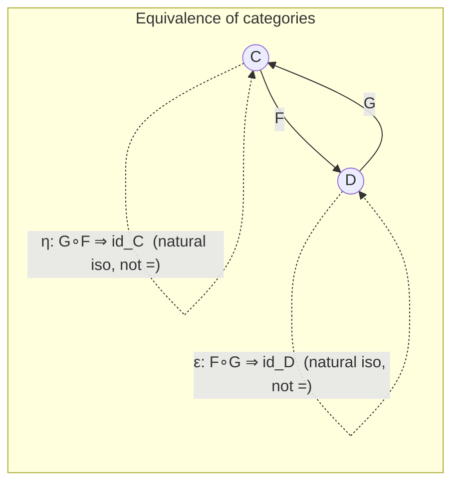

# Studying Categories via [[Functors|Functors]]

[[book-guidelines|↩ Back to guidelines]]

## Why this section exists

Category theory's founding move is: don't look inside an object, look at its arrows. Section 1.1
applied that to objects within a category (isomorphism, not equality, is the right notion of
"sameness"). Section 1.5 applies the *same* move one level up — to categories themselves. If
`Cat`, the category of all small categories, is itself a category, then studying a category `C`
should mean studying the functors into and out of it, not poking at its internal set of objects.

That reframing forces a question that doesn't arise for plain functions: what does it even mean
for two categories to be "the same"? Set-level bijection has an obvious analogue (a functor that's
invertible on the nose), but category theory has already taught us to distrust "equal" and prefer
"isomorphic." So the chapter builds toward a *weaker*, more useful notion — equivalence of
categories — and proves that you can check it using only local, functor-level properties
(fully faithful + essentially surjective), without ever having to exhibit an inverse functor by
hand. That theorem (1.5.16) is the payoff of the whole section.

**[[Comonads#What breaks without this|What breaks without this]] machinery:** without equivalence of categories, you'd be stuck with
strict isomorphism of categories — literally the same objects and morphisms, up to relabeling.
That's far too rigid. Finite-dimensional vector spaces and $n\times n$-tuples-of-numbers-with-matrices
are *not* the same category (a vector space is not literally a natural number), yet every working
mathematician treats "pick a basis" as a harmless, reversible translation. Equivalence of categories
is the formal license for that translation — and Theorem 1.5.16 is what makes it checkable in
practice instead of a leap of faith.

---

## 1. `Cat`: the category of categories

**Definition 1.5.1.** `Cat` has small categories as objects and functors as morphisms; identities
are identity functors, composition is functor composition.

The word "small" isn't decoration — it's there to dodge Russell's-paradox-style size issues (the
"category of all categories" can't itself be an object of anything without contradiction, the same
reason `Set` can't contain itself as an element).

More interesting than the size caveat: the book immediately tells you *not* to over-rely on `Cat`.
Given two categories $\mathcal C, \mathcal D$, the functors between them don't just form a set
$\mathrm{Hom}_{\mathbf{Cat}}(\mathcal C, \mathcal D)$ — they form a *category*, the functor category
$[\mathcal C, \mathcal D]$ (built in section 1.4), whose morphisms are [[Natural-Transformations|natural transformations]]. Once
you have that finer structure, treating $\mathrm{Hom}_{\mathbf{Cat}}(\mathcal C,\mathcal D)$ as a bare set
throws information away — exactly the same demotion the book warns against when it says a category's
objects are better compared by isomorphism than equality. A structure with hom-*categories* instead
of hom-*sets* is called a **2-category**, and `Cat` is the standard first example. The book doesn't
develop 2-category theory (it flags this as "beyond scope"), but the term is worth knowing because it's
exactly the shape you'll meet again if you go on to look at bicategories or higher inductive types.

The concrete consequence for this section: because `Cat`'s mono/epi notions are built on **equality**
of functors (not isomorphism of functors), they turn out not to be the right tool for comparing
categories. Section 1.5.3–1.5.4 develops the tools that actually are.

---

## 2. Subcategories

**Definition 1.5.2.** A subcategory $\mathcal S$ of $\mathcal C$ is a sub-collection of $\mathcal C$'s
objects together with a sub-collection of $\mathcal C$'s morphisms, closed under identities (every
object kept in $\mathcal S$ keeps its identity arrow) and closed under composition (composable arrows
of $\mathcal S$ compose to an arrow that's also in $\mathcal S$).

That's the categorical analogue of a subgroup or subring: you don't get to just grab any subset of
objects and morphisms, the result has to still satisfy the category axioms internally.

There are two useful, orthogonal ways a subcategory can be "maximal" along one axis:

- **Wide** (Definition 1.5.3): $\mathcal S$ keeps *all* the objects of $\mathcal C$, but possibly
  fewer morphisms.
- **Full**: $\mathcal S$ keeps *all* the morphisms between any two objects it retains — formally,
  for $X, Y$ objects of $\mathcal S$,
  $$
  \mathrm{Hom}_{\mathcal S}(X, Y) = \mathrm{Hom}_{\mathcal C}(X, Y),
  $$
  but $\mathcal S$ can drop objects.

These pull in opposite directions: wide subcategories restrict *behavior* while keeping the full
*population*; full subcategories restrict the population while keeping *all* the behavior between
whatever's left.

The book's examples make the distinction concrete:

| Wide subcategories | Full subcategories |
|---|---|
| $\mathbf{Lip} \subset \mathbf{Met}$ (same spaces, only Lipschitz maps, not all continuous maps) | $\mathbf{AbGrp} \subset \mathbf{Grp}$ (fewer groups, but every homomorphism between two abelian groups counts) |
| sets + injective maps $\subset \mathbf{Set}$ | $\mathbf{FVect} \subset \mathbf{Vect}$ (finite-dim only, but all linear maps between them) |
| the *core* of any category (Def. 1.1.32 — keep all objects, keep only the isomorphisms) $\subset$ that category | $\mathbf{CHaus} \subset \mathbf{Top}$ (compact Hausdorff spaces, all continuous maps) |
| $B S \subset B G$ for $S \le G$ a subgroup | a subposet with the induced order $\subset$ the ambient poset |

**Grounding — this is exactly a trait-object restriction vs. a type restriction in Rust.**
A *wide* subcategory is like keeping every concrete type in your program but restricting which
trait methods you're allowed to call on them (e.g. "only types implementing `Lipschitz`, not the
full `Continuous` trait" — same population of types, narrower interface). A *full* subcategory is
like restricting to a smaller set of concrete types, but once a type is in scope, every method the
original trait bound offered is still available — nothing about the *interface* shrinks, only the
*population*. `FVect ⊂ Vect` corresponds to "only finite-dimensional structs implementing `VectorSpace`,
but every linear-map function between two such structs is still callable."

```rust
// A full subcategory: FVect as a marker-bounded restriction of Vect.
// The interface (every linear map / trait method) is preserved in full;
// only which concrete types are admitted is restricted.
trait VectorSpace { fn dim(&self) -> Option<usize>; }

trait FiniteDim: VectorSpace {}   // marker: "this object is in the full subcategory"

fn linear_map<V: FiniteDim, W: FiniteDim>(v: &V, f: impl Fn(&V) -> W) -> W {
    f(v) // every Hom(V, W) morphism from Vect is still available here, unrestricted
}
```

---

## 3. Faithful, full, and essentially surjective functors

### 3.1 Why three properties, not two

A plain function $f: X \to Y$ between sets has exactly two independent properties worth naming:
injective and surjective. A functor $F : \mathcal C \to \mathcal D$ acts on *two* levels at once — objects
and morphisms — so naively you might expect four properties (injective/surjective on objects,
injective/surjective on morphisms). The book gets you to **three**, and the reduction is not
arbitrary; it's a direct consequence of the categorical stance that objects should be compared up
to isomorphism, not equality.

**Definition 1.5.5.** $F: \mathcal C \to \mathcal D$ is:

- **faithful**: for all objects $C, C'$ and arrows $f, f' : C \to C'$, $Ff = Ff' \implies f = f'$
  (injective on each individual hom-set);
- **full**: for all objects $C, C'$ and every $g : FC \to FC'$ in $\mathcal D$, there exists
  $f : C \to C'$ with $Ff = g$ (surjective on each individual hom-set);
- **fully faithful**: full and faithful together;
- **essentially surjective**: for every object $D$ of $\mathcal D$, there exists an object $C$ of
  $\mathcal C$ and an *isomorphism* $FC \to D$ (not necessarily equality — "surjective up to
  isomorphism").

**Remark 1.5.6** packages faithful/full/fully-faithful as one clean statement: $F$ induces, for each
pair $C, C'$, a function on hom-sets
$$
\mathrm{Hom}_{\mathcal C}(C, C') \longrightarrow \mathrm{Hom}_{\mathcal D}(FC, FC'),
$$
and $F$ is faithful iff this is injective for every pair, full iff it's surjective for every pair,
fully faithful iff it's bijective for every pair. So "faithful" and "full" really are just "injective"
and "surjective," but applied *hom-set-by-hom-set* rather than to the whole functor as one flat map —
this is the piece that a naive function-level intuition misses. Essential surjectivity is then the
"surjective on objects" analogue, except demoted from equality to isomorphism, because — as
established back in §1.1 — equality of objects inside a category isn't a meaningful thing to test.

There is no "essentially injective" in the definition, and Remark 1.5.12 explains why by degenerate
example: view a plain set $X$ as a category whose only morphisms are identities (an arrow
$x \to x'$ exists iff $x = x'$). Then a function $f : X \to Y$ is injective *exactly when* it is
surjective on arrows, because "there's an arrow $f(x) \to f(x')$" literally means $f(x)=f(x')$. So
plain-set injectivity/surjectivity collapse into object-level essential surjectivity plus
morphism-level fullness once you see sets as categories with only identity arrows — the two
function-level properties are recovered as the object- and morphism-level halves of the *same*
categorical notion (surjectivity), and "injective on arrows" only becomes a separate concern once a
category can have more than one arrow between two objects, which sets-as-categories never do. That's
also the promised first answer to "why three, not four": injectivity on objects would ask about
*equality* of objects, which the categorical worldview has already discarded as not worth asking. The
book flags Theorem 1.5.16 (below) as the second, sharper answer.

**Proposition 1.5.7** — fully faithful functors are "injective up to isomorphism" on objects: if
$F$ is fully faithful and $\phi : FC \to FC'$ is an isomorphism in $\mathcal D$, there is a *unique*
isomorphism $\tilde\phi : C \to C'$ in $\mathcal C$ with $F\tilde\phi = \phi$. In particular,
$FC \cong FC' \implies C \cong C'$. [[The-Yoneda-Lemma#The proof|The proof]] is a clean two-line argument from fullness (get
$\tilde\phi$ and a candidate inverse $\tilde\psi$ from $\phi,\psi$), functoriality (compose and push
through $F$), and faithfulness (cancel $F$ off both sides to conclude $\tilde\psi\tilde\phi = \mathrm{id}$
and vice versa) — a good worked illustration of how faithful/full get *used*, not just defined.

### 3.2 Worked examples across the book's running fields

| Setting | Faithful? | Full? | Essentially surjective? |
|---|---|---|---|
| forgetful $\mathbf{AbGrp} \to \mathbf{Grp}$ | yes | yes (fully faithful) | **no** — not every group is abelian |
| forgetful $\mathbf{Lip} \to \mathbf{Met}$ | yes | **no** — not every continuous map is Lipschitz | yes |
| monotone $f : (X,\le) \to (Y,\le)$ as a functor | always, trivially (at most one arrow between any two objects) | iff $f$ is *order-reflecting*: $f(x)\le f(x') \Rightarrow x \le x'$ (stronger than monotone!) | iff surjective (iso = equality in a poset) |
| $F : B G \to B H$ from group hom. $f: G \to H$ | iff $f$ injective | iff $f$ surjective | always, trivially ($BH$ has one object) |
| linear representation $R : BG \to \mathbf{Vect}$ | iff $R$ is a *faithful representation* in the rep-theory sense: $g \ne h \Rightarrow$ distinct linear maps | — | — |

Two things worth dwelling on:

1. **General inclusion fact**: a full subcategory always gives rise to a fully faithful "inclusion"
   functor, and conversely — this is exactly why $\mathbf{AbGrp} \hookrightarrow \mathbf{Grp}$ and
   $\mathbf{FVect} \hookrightarrow \mathbf{Vect}$ (both full subcategories, §2 above) are fully faithful
   but *not* essentially surjective — being a full subcategory is precisely the "fully faithful" half
   of an equivalence with the failure mode being on the essential-surjectivity axis (there's more stuff
   outside).
2. **The representation-theory etymology**: "faithful" as a name for functors comes directly from
   "faithful representation" in group theory — a rep is faithful exactly when the induced functor
   $BG \to \mathbf{Vect}$ is faithful in the categorical sense. The categorical definition didn't
   invent new vocabulary; it generalized an existing one and the name stuck.

**Grounding — faithful/full as a type-level API surface.** Think of a functor $F : \mathcal C \to
\mathcal D$ as a compiler pass or a lowering translation between two IRs. *Faithful* says: distinct
source-level operations never collapse to the same target-level operation (no accidental aliasing —
this is what you want from a sound compilation pass, so that source-level equational reasoning
survives translation). *Full* says: every target-level operation between translated objects has a
source-level preimage (the translation doesn't produce "extra" behavior the source language couldn't
already express — no smuggled-in target-only power). *Fully faithful* is the strongest of the three:
the lowering is a **conservative extension** at the level of morphisms — $\mathrm{Hom}$-sets biject
exactly.

```rust
// "Fully faithful" as: this lowering pass is bijective on the operations
// between any two translated IR nodes — no aliasing, no smuggled extra power.
trait Lowering<Src, Tgt> {
    fn lower_obj(&self, s: &Src) -> Tgt;
    fn lower_morphism(&self, f: SrcOp<Src>) -> TgtOp<Tgt>;
}

// faithful:  lower_morphism(f) == lower_morphism(f')  =>  f == f'
// full:      forall g: TgtOp<lower(A), lower(B)>, exists f: SrcOp<A,B> with lower(f) == g
// fully faithful together mean Hom_Src(A,B) <-> Hom_Tgt(lower A, lower B) is a bijection.
```

**Lean angle — this is the shape of `isDefEq` conservativity.** When Lean's elaborator inserts
coercions or unfolds definitions to check two terms are defeq, you *want* that translation to be
faithful in exactly this sense: if two elaborated (target) terms are literally the same, the source
terms the elaborator started from had better already be definitionally equal, or you've silently
identified things that shouldn't be identified — that's an unsoundness bug in a kernel, not a
convenience. Full/faithful for functors is the categorical, general-purpose statement of the property
a trusted elaboration or lowering step must have to be sound: full says the target doesn't gain power
translation shouldn't grant it, faithful says the target doesn't erase distinctions the source needs
to keep.

---

## 4. Equivalence of categories

### 4.1 Definition and the "homotopy equivalence, not homeomorphism" intuition

**Definition 1.5.13.** An equivalence of categories between $\mathcal C$ and $\mathcal D$ is a pair of
functors $F : \mathcal C \to \mathcal D$, $G : \mathcal D \to \mathcal C$, together with **natural
isomorphisms** (not equalities!) $\eta : G \circ F \Rightarrow \mathrm{id}_{\mathcal C}$ and
$\epsilon : F \circ G \Rightarrow \mathrm{id}_{\mathcal D}$. $G$ is called a **pseudoinverse** of $F$.

Compare directly against isomorphism of objects inside a category (Definition 1.1.24, which demands
$g \circ f = \mathrm{id}$ *on the nose*): here we only demand $G \circ F$ and $\mathrm{id}$ agree up to a
*coherent, natural* isomorphism, not literal equality of functors. The book's own analogy is the
sharpest one available: this is to isomorphism of categories what a **homotopy equivalence** is to a
**homeomorphism** of topological spaces — you don't need a literal continuous inverse, just an inverse
"up to continuous deformation." Equivalence is the correctly-relaxed notion once you accept that
functor equality (like object equality within a category) is too rigid to be useful.



Immediate examples (Example 1.5.14):

- Two posets are equivalent as categories **iff** they are isomorphic as posets (no slack here —
  a poset's core rigidity collapses equivalence down to isomorphism).
- Two sets-with-equivalence-relations are equivalent iff their quotients are isomorphic.
- Two groups $G, H$ are isomorphic iff $BG$ and $BH$ are equivalent as categories — same for
  monoids.

### 4.2 Theorem 1.5.16: the payoff

> **Theorem 1.5.16.** A functor $F : \mathcal C \to \mathcal D$ defines an equivalence of categories
> if and only if it is fully faithful and essentially surjective.

This is the direct categorical analogue of "a function is a bijection iff it's injective and
surjective" — with the same substitutions §3 has been building toward: injective $\to$ faithful,
surjective $\to$ full (both computed hom-set-by-hom-set), and object-level surjective $\to$ essentially
surjective. The practical value is enormous: exhibiting a pseudoinverse $G$ and two natural
isomorphisms by hand is tedious and easy to bungle; checking fully-faithful-plus-essentially-surjective
is a much more local, mechanical task.

**Lemma 1.5.17** (attributed to Riehl) is the technical workhorse behind the proof: given
$f : X \to Y$ in $\mathcal C$ and isomorphisms $\phi : X \to X'$, $\psi : Y \to Y'$, there is a
*unique* morphism $X' \to Y'$ completing the square, namely $\psi \circ f \circ \phi^{-1}$. In other
words, transporting a morphism along isomorphisms on both ends is forced, not a choice — this
uniqueness is exactly what lets the theorem's proof pin down $G$'s action on morphisms without
ambiguity.

**Proof sketch, both directions** (full argument spans pp. 63–65 of the source; here's the shape):

- **($\Leftarrow$, has pseudoinverse $\Rightarrow$ fully faithful + ess. surjective).** Faithfulness of
  $F$: if $Ff = Ff'$ then $GFf = GFf'$; naturality of $\eta$ turns this into a diagram whose two
  "fill-in" arrows must coincide by Lemma 1.5.17's uniqueness, forcing $f = f'$. Fullness: given
  $g : FC \to FC'$, transport $Gg$ back along $\eta$ to define a candidate $f$; naturality plus
  Lemma 1.5.17 shows $GFf = Gg$, and faithfulness of $G$ then forces $Ff = g$. Essential surjectivity:
  for $D$, set $C := GD$; then $\epsilon_D : FGD \to D$ is the witnessing isomorphism $FC \cong D$.
- **($\Rightarrow$, fully faithful + ess. surjective $\Rightarrow$ has pseudoinverse).** Use essential
  surjectivity to *choose*, for every $D$, an object $GD$ and isomorphism $\phi_D : F(GD) \to D$ (this
  is a genuine use of choice — the book is explicit that you pick one witness per object). Define
  $G$ on morphisms via Lemma 1.5.17 transport, then use fullness to pull the transported map back
  through $F$ (this is where fullness is used: the transported map lives in $\mathcal D$, and you need
  a $\mathcal C$-morphism whose image under $F$ *is* it). Functoriality of $G$ and naturality of the
  two isomorphisms $\eta, \epsilon$ then follow from faithfulness (to cancel $F$ off both sides of an
  equation) plus Lemma 1.5.17's uniqueness again.

Notice how all three properties get used in complementary roles: faithful cancels $F$ from equations,
full supplies preimages, essential surjectivity supplies the object-level witnesses that make $G$
well-defined at all. This is Remark 1.5.12's second promised answer to "why three properties": each
one is independently load-bearing in this single proof, and dropping any one breaks a specific step.

**Corollary 1.5.18** (posets): a monotone $f : (X,\le) \to (Y,\le)$ is a poset isomorphism iff it's
order-reflecting and surjective — theorem 1.5.16 specialized to the poset row of the earlier table.

### 4.3 The worked centerpiece: $\mathbf{FVect} \simeq \mathbf{Mat}$

This is the book's best illustration of what "equivalent but not isomorphic" buys you in practice,
and it directly formalizes the "a vector is just an array of numbers" intuition every engineer
already has, while explaining precisely what's imprecise about that statement.

**$\mathbf{Mat}$** (Example 1.5.19): objects are natural numbers $n \in \mathbb N$ (including $0$);
a morphism $m \to n$ is an $m\times n$ real matrix (with a unique morphism to/from $0$, treated as a
"zero-dimensional matrix"); composition is ordinary matrix multiplication.

The functor $F : \mathbf{Mat} \to \mathbf{FVect}$: send $n \mapsto \mathbb R^n$ ($0$ to the zero
space), and send a matrix $M : m \to n$ to the linear map $\mathbb R^m \to \mathbb R^n$ it represents.
This preserves identities and composition (functoriality is essentially "matrix multiplication
represents composition of linear maps," a fact from first-year linear algebra now recast
categorically). Then:

- **faithful** — distinct matrices give distinct linear maps;
- **full** — every linear map $\mathbb R^m \to \mathbb R^n$ is representable by *some* matrix;
- **essentially surjective** — every finite-dimensional vector space is isomorphic to $\mathbb R^n$
  for some $n$ (pick a basis).

By Theorem 1.5.16, $F$ is an equivalence — no need to hand-construct the pseudoinverse and the two
natural isomorphisms directly.

**What the equivalence buys you, concretely** — applying Lemma 1.5.17 to this specific $F$: given
vector spaces $V, W$ of dimension $m, n$ and chosen isomorphisms $\phi_V : \mathbb R^m \to V$,
$\phi_W : \mathbb R^n \to W$ (i.e. **choices of basis**), any linear map $f : V \to W$ transports to a
*unique* matrix $\phi_W^{-1} \circ f \circ \phi_V$ — precisely "the matrix representation of $f$ in the
chosen bases." Fix the bases and the representation is pinned down uniquely by $f$; vary the choice of
basis and the representation changes (this is why change-of-basis exists as a nontrivial operation).
So "a linear map is just a matrix" is true *relative to a chosen basis*, and equivalence-of-categories
is exactly the formal device that says: the translation is faithful, so no information about $f$ is
lost; full, so every matrix arises this way; and essentially-surjective-witnessed-by-a-basis-choice,
so the translation is always available, but never canonical (no natural, basis-free way to pick it) —
which is the precise, checkable content behind the informal "up to a choice of basis" caveat everyone
already knows to attach to "vectors are just arrays."

**Rust grounding.** This is a strikingly literal analogue of a `From`/`Into`-pair between an
abstract trait object and a concrete representation — except the categorical statement is *stronger*
than "these types can be converted," because it asserts the conversion is fully faithful (no
information loss on morphisms, not just on objects) and gives you Lemma 1.5.17's explicit,
unique-up-to-choice transport formula:

```rust
// FVect ≃ Mat, made concrete: choosing a basis is choosing an isomorphism R^n -> V.
// Once chosen, every linear map V -> W transports to a UNIQUE matrix — but the choice
// of basis is exactly the non-canonical "essentially surjective" witness.
struct Basis<const N: usize> { vectors: [Vector; N] } // witnesses R^N ≅ V

fn to_matrix<const M: usize, const N: usize>(
    f: impl Fn(&Vector) -> Vector,
    basis_v: &Basis<M>,
    basis_w: &Basis<N>,
) -> [[f64; M]; N] {
    // phi_W^{-1} ∘ f ∘ phi_V, computed column by column — Lemma 1.5.17's transport formula
    core::array::from_fn(|j| {
        let image = f(&basis_v.vectors[j]);
        basis_w.coordinates(&image) // unique, by faithfulness of F
    })
}
```

**Lean angle.** In a Lean-style dependent setting this is the difference between `V ≅ W` (an
isomorphism datum you carry around, which is what "choose a basis" produces) and `V = W`
(propositional/definitional equality, which you generally do *not* have between an abstract
`FiniteDimVectorSpace` and `Fin n → ℝ`). Category-theoretic equivalence is precisely the tool that
lets you treat `V` and `Fin n → ℝ` as interchangeable *for every purpose that respects morphisms*,
without ever asserting the false, over-strong claim that they're the same term. This is the same
discipline univalent/HoTT-flavored libraries push all the way down to types themselves ("equivalent
types are equal"), and it's worth naming explicitly: mathlib's `LinearEquiv`/`CategoryTheory.Equivalence`
machinery is the Lean-formalized version of exactly this section.

### 4.4 A closing exercise worth flagging

**Exercise 1.5.20**, closing the section: a category is *connected* if there's an arrow (in some
direction) between any two objects. The exercise asks you to show a connected groupoid is
equivalent to some $BG$, and — pointedly — that the analogous statement for connected categories
and *monoids* is **false**, asking for a counterexample. This is a good self-check on whether
Theorem 1.5.16 has really landed: a connected groupoid's "many isomorphic objects" all collapse
under essential surjectivity down to $BG$'s single object, but a connected category can have
non-invertible arrows that a single-object monoid-category $BM$ simply has no room to represent
faithfully — the fully-faithful direction of the theorem is what fails.

---

## Where this leads

Section 1.5's vocabulary is used immediately and constantly for the rest of the book:

- **Chapter 2** (representable functors, Yoneda) explicitly needs "isomorphic up to natural
  isomorphism" as the ambient notion of sameness for functors — [[The-Yoneda-Lemma|the Yoneda lemma]]'s conclusion is a
  *natural* bijection, and the payoff (objects determined up to isomorphism by their Hom-functors)
  is a direct generalization of Proposition 1.5.7's "fully faithful ⇒ injective up to isomorphism."
- **Chapter 3** notes explicitly that continuity/cocontinuity of a functor is preserved under
  equivalence of categories — so once you know two categories are equivalent, results about limits
  transfer for free across the equivalence, which is exactly the kind of "whatever can be done in
  $\mathcal C$ can be done in $\mathcal D$" payoff this section promises.
- More broadly, **every later universal-property argument** in the book ([[Adjunctions|adjunctions]], [[Monads|monads]]) relies
  on the same discipline this section establishes: characterize a construction by its *interaction
  with morphisms*, prove uniqueness up to (natural) isomorphism, and never ask for equality where
  isomorphism suffices.

**For the elaborator/verifier project:** the faithful/full/essentially-surjective trichotomy is the
cleanest general vocabulary for stating what a *sound and complete* translation between two
representations must satisfy — e.g. between a surface refinement-type language and its lowered
constraint-clause form. "Faithful" is exactly a soundness requirement (distinct source judgments
never collapse into an indistinguishable target constraint — no accidental proof of something false);
"full" is exactly a completeness requirement (every target-provable fact has a source-level witness,
so the constraint solver isn't secretly more powerful, or differently powered, than the source type
system claims to be). When you eventually verify that your CHC-generation pass or your bidirectional
elaboration preserves meaning, "is this translation fully faithful" is the precise question you're
answering, and Theorem 1.5.16 is the template for *how* to check it compositionally (locally, one
hom-set/one judgment form at a time) instead of by exhibiting a global inverse.
