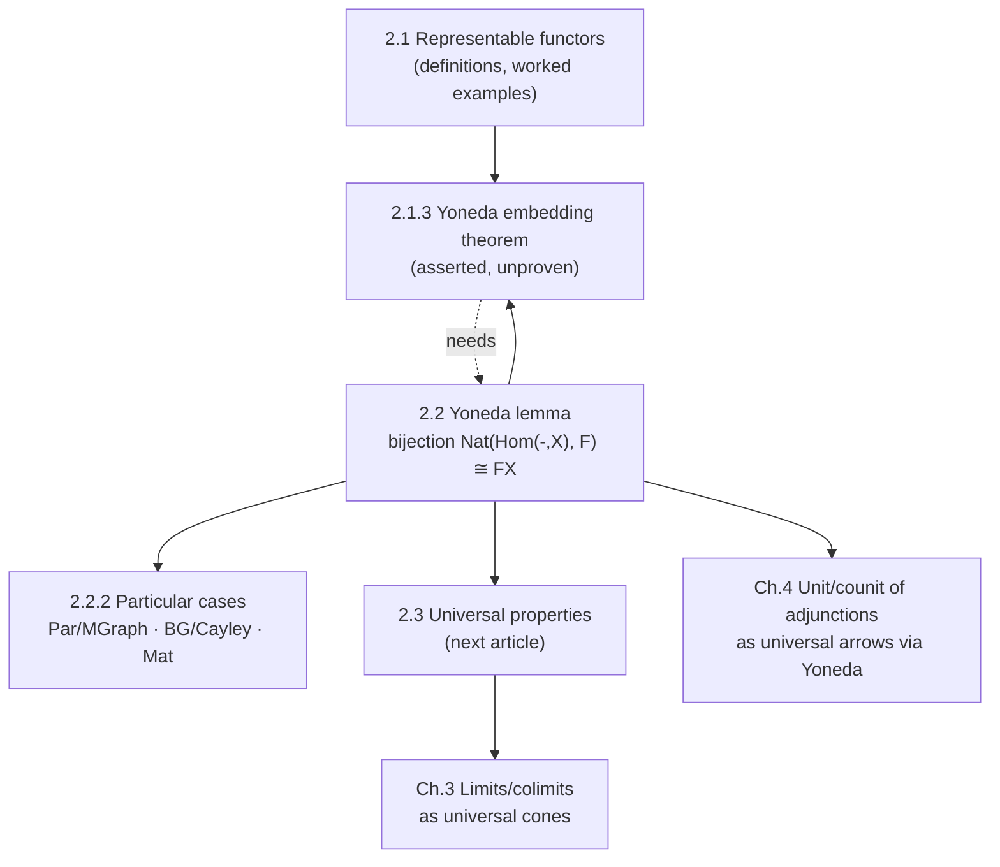

[[book-guidelines|↩ Back to guidelines]]

# The Yoneda Lemma

## Why you need this before you can prove anything about representability

Section 2.1 left a debt unpaid. It stated [[Representable-Functors-and-Presheaves#The Yoneda embedding theorem|the Yoneda embedding theorem]] — that $\mathrm{Hom}_{\mathcal C}(X,Y)$ is in natural bijection with the set of [[Natural-Transformations|natural transformations]] $\mathrm{Hom}_{\mathcal C}(-,X) \Rightarrow \mathrm{Hom}_{\mathcal C}(-,Y)$ — but didn't prove it. It just asserted that two objects are isomorphic exactly when they're "indistinguishable by every probe $S$." That's a strong claim: it says an object is nothing more than the totality of how everything else maps into (or out of) it. You'd want a real proof before trusting a claim that philosophically loaded.

The Yoneda lemma is that proof's engine, and it's strictly more general than the embedding theorem — the embedding theorem falls out of it as a one-line corollary. The lemma isn't really about comparing two objects $X$ and $Y$ at all. It's about comparing an object $X$ against *any* presheaf $F$ whatsoever, representable or not. That generality is what makes it foundational rather than a curiosity: limits, [[Adjunctions|adjunctions]], and the unit/counit of an adjunction (Chapters 3 and 4) will all be reconstructed as special instances of "what does it mean to map out of a representable presheaf."

**What breaks without it.** Without the Yoneda lemma, "representable functor" is just a definition with no leverage — you can check specific [[Functors|functors]] are representable by hand (as Section 2.1 did for $U$, $\mathrm{Curve}$, $\mathrm{Loop}$, $\mathrm{Vert}$, $\mathrm{Edge}$...) but you have no general tool for reasoning about *all* natural transformations out of $\mathrm{Hom}_{\mathcal C}(-,X)$ at once, and no proof that representing objects are unique. Cayley's theorem, the "row operations are matrices" fact, and the graph-theoretic reconstruction of multigraphs from $\mathrm{Vert}$/$\mathrm{Edge}$ would all remain isolated, ad hoc observations instead of instances of one mechanism.

## The intuition first: self-observation loses nothing

Here's the shape of the idea before any notation. Fix an object $X$ in a category $\mathcal C$, and let $F : \mathcal C^{\mathrm{op}} \to \mathbf{Set}$ be *any* presheaf — think of it as some way of extracting information from objects of $\mathcal C$, contravariantly (an arrow $Y \to X$ gets turned into a function $FX \to FY$).

Now consider natural transformations $\alpha : \mathrm{Hom}_{\mathcal C}(-, X) \Rightarrow F$. Each such $\alpha$ is, on the face of it, a huge amount of data: for *every* object $Y$ of $\mathcal C$, a function $\alpha_Y : \mathrm{Hom}_{\mathcal C}(Y,X) \to FY$, all glued together coherently by naturality squares. That looks like it should carry a lot of independent information.

The Yoneda lemma says it doesn't. All of that data is already determined by a single value: what $\alpha$ does to the identity morphism $\mathrm{id}_X \in \mathrm{Hom}_{\mathcal C}(X,X)$. That one element $\alpha_X(\mathrm{id}_X) \in FX$ pins down every other component $\alpha_Y$ completely, and conversely every element of $FX$ arises this way from exactly one natural transformation.

Why should this be plausible? $\mathrm{id}_X$ is the one arrow into $X$ that observes $X$ *without any loss of information whatsoever* — it maps $X$ to itself faithfully. Any other arrow $f : Y \to X$ is really $\mathrm{id}_X$ "viewed through" precomposition with $f$: as a set element, $f \in \mathrm{Hom}_{\mathcal C}(Y,X)$ is literally $\mathrm{id}_X \circ f$. Naturality then forces $\alpha_Y(f)$ to be $Ff$ applied to $\alpha_X(\mathrm{id}_X)$ — the "corrupted," lossy image of the same one piece of information. So a natural transformation out of the representable presheaf $\mathrm{Hom}_{\mathcal C}(-,X)$ can carry no more information than $FX$ itself; the identity already sees everything there is to see about $X$, and everything else is a derived, information-losing view of that single observation.

## The formal statement

> **Lemma 2.2.1 (Yoneda).** Let $\mathcal C$ be a category, $X$ an object of $\mathcal C$, and $F : \mathcal C^{\mathrm{op}} \to \mathbf{Set}$ a presheaf on $\mathcal C$. The map
> $$\mathrm{Hom}_{[\mathcal C^{\mathrm{op}},\mathbf{Set}]}\big(\mathrm{Hom}_{\mathcal C}(-,X),\, F\big) \longrightarrow FX$$
> sending a natural transformation $\alpha : \mathrm{Hom}_{\mathcal C}(-,X) \Rightarrow F$ to the element $\alpha_X(\mathrm{id}_X) \in FX$ (the value of the component $\alpha_X$ on the identity at $X$) is a **bijection**, and it is **natural both in $X$ and in $F$**.

Read the left-hand side carefully: it is the *set of natural transformations* between two functors — $\mathrm{Hom}_{\mathcal C}(-,X) : \mathcal C^{\mathrm{op}} \to \mathbf{Set}$ (the representable presheaf at $X$) and $F$ — living inside the functor category $[\mathcal C^{\mathrm{op}}, \mathbf{Set}]$. The right-hand side, $FX$, is a plain set — the value $F$ assigns to the single object $X$. The lemma is saying that this potentially enormous set of natural transformations is in bijection with something as small and concrete as one set. That collapse is the entire content of the result: **all coherent ways of mapping the representable presheaf at $X$ into $F$ are already counted by the elements of $FX$.**

Once you have this, the Yoneda embedding theorem (2.1.16) is immediate: set $F = \mathrm{Hom}_{\mathcal C}(-,Y)$. The lemma then gives a bijection between natural transformations $\mathrm{Hom}_{\mathcal C}(-,X) \Rightarrow \mathrm{Hom}_{\mathcal C}(-,Y)$ and elements of $\mathrm{Hom}_{\mathcal C}(X,Y)$ — exactly the embedding theorem's statement. The general lemma subsumes the special case where $F$ happens itself to be representable.

## The proof

### Setting up what's being asked

Given a natural transformation $\alpha : \mathrm{Hom}_{\mathcal C}(-,X) \Rightarrow F$, its component at any object $Y$ is a function $\alpha_Y : \mathrm{Hom}_{\mathcal C}(Y,X) \to FY$, subject to the naturality square: for every $f : Y \to Z$ in $\mathcal C$,

$$
\begin{array}{ccc}
\mathrm{Hom}_{\mathcal C}(Z,X) & \xrightarrow{\ -\circ f\ } & \mathrm{Hom}_{\mathcal C}(Y,X) \\
\alpha_Z \downarrow & & \downarrow \alpha_Y \\
FZ & \xrightarrow{\ \ Ff\ \ } & FY
\end{array}
$$

Note both functors here reverse the arrow's direction — $F$ is contravariant, and precomposition $-\circ f$ also turns $f : Y \to Z$ into a map on hom-sets going the *other* way, $\mathrm{Hom}_{\mathcal C}(Z,X) \to \mathrm{Hom}_{\mathcal C}(Y,X)$. This is what makes $\mathrm{Hom}_{\mathcal C}(-,X)$ itself a presheaf, and it's why the square typechecks at all.

The map claimed by the lemma sends $\alpha \mapsto \alpha_X(\mathrm{id}_X)$. To show it's a bijection we build its inverse; to show it's natural we chase two more squares.

### The key identity

Plug $f : Y \to X$ into the naturality square above, but with $Z := X$ — i.e., instantiate the square at the specific arrow $f$ landing in $X$:

$$
\begin{array}{ccc}
\mathrm{Hom}_{\mathcal C}(X,X) & \xrightarrow{\ -\circ f\ } & \mathrm{Hom}_{\mathcal C}(Y,X) \\
\alpha_X \downarrow & & \downarrow \alpha_Y \\
FX & \xrightarrow{\ \ Ff\ \ } & FY
\end{array}
$$

Start with $\mathrm{id}_X$ in the top-left corner. Going right-then-down: $\mathrm{id}_X \mapsto \mathrm{id}_X \circ f = f \mapsto \alpha_Y(f)$. Going down-then-right: $\mathrm{id}_X \mapsto \alpha_X(\mathrm{id}_X) \mapsto Ff(\alpha_X(\mathrm{id}_X))$. Commutativity of the square gives the identity that does all the work in this proof:

$$
Ff(\alpha_X(\mathrm{id}_X)) = \alpha_Y(f) \tag{2.2.1}
$$

In words: *the value of $\alpha$ at any arrow $f$ is completely determined by the value of $\alpha$ at the identity, pushed forward along $F$.* This is the precise version of the "self-observation loses nothing" intuition above.

### Bijectivity

**Injectivity.** Suppose $\alpha, \beta : \mathrm{Hom}_{\mathcal C}(-,X) \Rightarrow F$ agree on the identity, i.e. $\alpha_X(\mathrm{id}_X) = \beta_X(\mathrm{id}_X)$. For any object $Y$ and any $f \in \mathrm{Hom}_{\mathcal C}(Y,X)$, Eq. (2.2.1) applied to both gives
$$\alpha_Y(f) = Ff(\alpha_X(\mathrm{id}_X)) = Ff(\beta_X(\mathrm{id}_X)) = \beta_Y(f).$$
Since this holds for every $Y$ and every $f$, $\alpha = \beta$ as natural transformations. Two natural transformations that agree on one value — the identity — agree everywhere.

**Surjectivity.** Given any $p \in FX$, define, for each object $Y$, the function $\alpha_Y : \mathrm{Hom}_{\mathcal C}(Y,X) \to FY$ by $\alpha_Y(f) := Ff(p)$ — literally reading Eq. (2.2.1) backward as a *definition*. Naturality of this assignment needs checking: for $g : Y \to Z$, the square

$$
\begin{array}{ccc}
\mathrm{Hom}_{\mathcal C}(Z,X) & \xrightarrow{\ -\circ g\ } & \mathrm{Hom}_{\mathcal C}(Y,X) \\
\alpha_Z \downarrow & & \downarrow \alpha_Y \\
FZ & \xrightarrow{\ \ Fg\ \ } & FY
\end{array}
$$

must commute, i.e. for $h \in \mathrm{Hom}_{\mathcal C}(Z,X)$, $Fg(\alpha_Z(h)) = \alpha_Y(h \circ g)$. Since $F$ is a (contravariant) functor,
$$Fg(\alpha_Z(h)) = Fg(Fh(p)) = F(h \circ g)(p) = \alpha_Y(h \circ g),$$
using $F(h \circ g) = Fg \circ Fh$ — the direction-reversal is exactly what makes this composite line up. So $\alpha$ is natural. And its value on the identity recovers $p$: $\alpha_X(\mathrm{id}_X) = F(\mathrm{id}_X)(p) = \mathrm{id}_{FX}(p) = p$, using functoriality's preservation of identities. So every $p \in FX$ is hit.

Injectivity plus surjectivity gives bijectivity.

### Naturality in $X$ and in $F$

The lemma claims more than "there's a bijection for each fixed $X, F$" — it claims the *family* of bijections, as $X$ and $F$ vary, is itself natural. This matters: it means the bijection isn't an accident of choice, it's forced by the structure, in the same sense that a natural isomorphism (rather than a bare bijection) is what lets you substitute one side for the other inside larger constructions.

**Naturality in $X$.** For $h : X \to Y$, postcomposition induces $h_* : \mathrm{Hom}_{\mathcal C}(-,X) \Rightarrow \mathrm{Hom}_{\mathcal C}(-,Y)$. Naturality in $X$ says the square

$$
\begin{array}{ccc}
\mathrm{Hom}_{[\mathcal C^{\mathrm{op}},\mathbf{Set}]}\big(\mathrm{Hom}_{\mathcal C}(-,Y),F\big) & \xrightarrow{\ -\circ h_*\ } & \mathrm{Hom}_{[\mathcal C^{\mathrm{op}},\mathbf{Set}]}\big(\mathrm{Hom}_{\mathcal C}(-,X),F\big) \\
\downarrow & & \downarrow \\
FY & \xrightarrow{\ \ Fh\ \ } & FX
\end{array}
$$

commutes, i.e. for $\alpha : \mathrm{Hom}_{\mathcal C}(-,Y) \Rightarrow F$, that $Fh(\alpha_Y(\mathrm{id}_Y)) = \alpha_X(h_*(\mathrm{id}_X))$. The right side is $\alpha_X(\mathrm{id}_X \circ h) = \alpha_X(h)$, and Eq. (2.2.1) (applied with $f := h : X \to Y$) says exactly $Fh(\alpha_Y(\mathrm{id}_Y)) = \alpha_X(h)$. Done — this is the same identity that drove bijectivity, just read in the other variable.

**Naturality in $F$.** For a natural transformation $\beta : F \Rightarrow G$, naturality in $F$ asks that
$$\beta_X(\alpha_X(\mathrm{id}_X)) = (\beta \circ \alpha)_X(\mathrm{id}_X)$$
for every $\alpha : \mathrm{Hom}_{\mathcal C}(-,X) \Rightarrow F$ — which is just unfolding the definition of vertical composition of natural transformations at the component $X$. No new work required; it's definitional.

So the whole proof rests on one algebraic identity, Eq. (2.2.1), used three times: once forward (injectivity), once backward as a definition (surjectivity), and once more read in the other slot (naturality in $X$). Naturality in $F$ needs nothing beyond unwinding a definition. This is worth sitting with — the celebrated "Yoneda lemma" is not a deep combinatorial fact; it's the precise bookkeeping consequence of what it means for $\mathrm{id}_X$ to be an identity in a category with functorial presheaves acting on it.

### Grounding the proof: types, not diagrams

The diagram chase reads more directly once you see it as a computation over types.

**Lean.** This is the setting where the correspondence to the book's argument is most literal: a natural transformation is a dependent function of components plus a naturality proof obligation, and Eq. (2.2.1) is a `rfl`-adjacent unfolding once you plug in the right instantiation.

```lean
-- Category C, presheaf F : Cᵒᵖ ⥤ Type, and a fixed object X.
-- A natural transformation α : (Hom(-, X)) ⟶ F packages exactly what
-- the book calls the "components" αY together with the naturality square.
structure YonedaNatTrans (C : Type*) [Category C] (F : Cᵒᵖ ⥤ Type*) (X : C) where
  app : ∀ Y : C, (Y ⟶ X) → F.obj ⟨Y⟩
  naturality : ∀ {Y Z : C} (f : Y ⟶ Z) (h : Z ⟶ X),
    F.map f.op (app Z h) = app Y (f ≫ h)          -- this is Eq. (2.2.1), stated generally

-- The forward map α ↦ α_X(id_X)
def yonedaForward {C : Type*} [Category C] (F : Cᵒᵖ ⥤ Type*) (X : C)
    (α : YonedaNatTrans C F X) : F.obj ⟨X⟩ :=
  α.app X (𝟙 X)

-- The inverse map p ↦ (the α defined by αY(f) := F.map f.op p)
def yonedaBackward {C : Type*} [Category C] (F : Cᵒᵖ ⥤ Type*) (X : C)
    (p : F.obj ⟨X⟩) : YonedaNatTrans C F X where
  app Y f := F.map f.op p
  naturality f h := by simp [Functor.map_comp]   -- functoriality does the rest
```

The `naturality` field is literally Eq. (2.2.1) turned into a proof obligation baked into the structure — the same move mathlib's actual `CategoryTheory.Yoneda` file makes, where `yonedaEquiv` is proved by exhibiting exactly this forward/backward pair and showing they're mutually inverse. Reading the book's proof next to that Lean development, the correspondence is almost line-for-line: "injectivity" is `yonedaBackward (yonedaForward α) = α`, "surjectivity" is `yonedaForward (yonedaBackward p) = p`, and both reduce to `Functor.map_id`/`Functor.map_comp`, i.e. functoriality — nothing more exotic is used anywhere.

**Rust.** Rust has no native notion of a presheaf category, but the *shape* of the data — components indexed by objects, glued by a coherence law — is exactly what you build when you represent a natural transformation as a trait with an associated obligation, which is close to what an elaborator's internal representation of a "constraint with an attached proof term" looks like:

```rust
// A stand-in for Hom_C(-, X) ⇒ F, restricted to a fixed small index set of objects.
// `app` are the components α_Y; `naturality` is the law they must satisfy —
// unenforced by the type system here, but this is exactly the proof obligation
// Eq. (2.2.1) demands, and exactly what the Lean `naturality` field checks.
trait YonedaTransform<Obj, Hom, FVal> {
    fn app(&self, y: &Obj, f: &Hom) -> FVal;      // component α_Y
    fn identity_value(&self, x: &Obj) -> FVal {    // the ONE value that determines everything
        // conceptually: self.app(x, &identity_hom(x))
        unimplemented!("α_X(id_X) — the Yoneda element")
    }
}
```

The point this snippet is meant to make, not to be literal executable machinery: the entire `YonedaTransform` — however many objects `Obj` ranges over — is reconstructible from `identity_value` alone, given `F`'s action on morphisms. That's the "no information beyond one value" claim made concrete in a language where you'd otherwise think of a trait implementation as an unboundedly large table of method bodies.

**Python**, briefly, for the computational content stripped of type ceremony — given `F`'s action on morphisms as a function `F_map`, and a single element `p`, the whole family of components is one line:

```python
def alpha(Y, f, p, F_map):
    # alpha_Y(f) = F(f)(p) — Eq. (2.2.1) used as a *definition*
    return F_map(f)(p)
```

## Particular cases and applications

The book instantiates the general lemma in three settings, each showing a different flavor of "one identity-observation determines everything."

### $\mathbf{Par}$ and multigraphs: representable presheaves *are* the graphs

Recall $\mathbf{Par}$ is the two-object, two-parallel-arrow category $V \rightrightarrows E$ (source $s$, target $t$), whose presheaves $\mathbf{Par}^{\mathrm{op}} \to \mathbf{Set}$ are exactly directed multigraphs (Example 1.3.46). The two representable presheaves on $\mathbf{Par}$ are $\mathrm{Hom}_{\mathbf{Par}}(-,V)$ and $\mathrm{Hom}_{\mathbf{Par}}(-,E)$, and unpacking them directly:

- $\mathrm{Hom}_{\mathbf{Par}}(-,V)$ sends $V \mapsto \{\mathrm{id}_V\}$ (a singleton — there's only one arrow $V \to V$) and $E \mapsto \varnothing$ (no arrows $E \to V$ exist in $\mathbf{Par}$). As a multigraph this is $G_0$: one vertex, no edges.
- $\mathrm{Hom}_{\mathbf{Par}}(-,E)$ sends $V \mapsto \{s, t\}$ (two elements) and $E \mapsto \{\mathrm{id}_E\}$ (one element). As a multigraph this is $G_1$: two vertices joined by one directed edge.

Now instantiate the Yoneda lemma with $\mathcal C = \mathbf{Par}$, so that $[\mathcal C^{\mathrm{op}}, \mathbf{Set}] = \mathbf{MGraph}$. For any multigraph $G$:
$$\mathrm{Hom}_{\mathbf{MGraph}}\big(\mathrm{Hom}_{\mathbf{Par}}(-,V),\, G\big) \cong GV = \mathrm{Vert}(G), \qquad \mathrm{Hom}_{\mathbf{MGraph}}\big(\mathrm{Hom}_{\mathbf{Par}}(-,E),\, G\big) \cong GE = \mathrm{Edge}(G),$$
i.e. $\mathrm{Hom}_{\mathbf{MGraph}}(G_0,G) \cong \mathrm{Vert}(G)$ and $\mathrm{Hom}_{\mathbf{MGraph}}(G_1,G) \cong \mathrm{Edge}(G)$ — recovering the direct hand-check from Example 2.1.8, but now for free, from the general machinery. And the *content* of the bijection, per the lemma, is: a multigraph morphism $G_0 \to G$ is recovered entirely by asking where the single vertex of $G_0$ lands; a morphism $G_1 \to G$ is recovered entirely by asking where the single edge lands. Picking a vertex, or picking an edge, is nothing but a probe with the representable "unit" object — a direct, structural instance of the "self-observation loses nothing" intuition from earlier, now in a setting with actual combinatorial content.

This is the cleanest place to see why the lemma matters for *representation*: $G_0$ and $G_1$ aren't just any two multigraphs — they are, by construction, the smallest multigraphs that can act as complete "vertex-probes" and "edge-probes" for every other multigraph simultaneously.

### $BG$ and Cayley's theorem: the group acting on itself is forced

$BG$ is the one-object category whose single hom-set is $G$ itself, composition being the group operation. A presheaf $BG^{\mathrm{op}} \to \mathbf{Set}$ is a right $G$-set; the unique representable one is $G$ acting on its own underlying set $U(G)$ by right multiplication.

Instantiate the Yoneda embedding theorem (2.1.16), which — recall — is the $F = \mathrm{Hom}_{\mathcal C}(-,Y)$ special case of the lemma, at the single object $\bullet$ of $BG$:
$$\mathrm{Hom}_{BG}(\bullet,\bullet) \cong \mathrm{Hom}_{[BG^{\mathrm{op}},\mathbf{Set}]}\big(\mathrm{Hom}_{BG}(-,\bullet),\, \mathrm{Hom}_{BG}(-,\bullet)\big).$$
The left side is $G$ itself (arrows $\bullet \to \bullet$ *are* the group elements, by definition of $BG$). The right side, since the representable presheaf is $G$ acting on $U(G)$, is $\mathrm{Hom}_{G\text{-}\mathbf{Set}}(U(G), U(G))$ — the $G$-equivariant self-maps of the underlying set, which form a subgroup of the full symmetric group $\mathrm{Sym}(U(G))$. So:
$$G \cong \mathrm{Hom}_{G\text{-}\mathbf{Set}}\big(U(G), U(G)\big) \le \mathrm{Sym}(U(G)).$$

That's **Cayley's theorem** — every group embeds into the symmetric group on its own underlying set — recovered as one instance of Yoneda, rather than a separately-proved combinatorial fact.

The lemma says more than the embedding theorem alone gives you, though. For *any* right $G$-set $X$ (any presheaf $F : BG^{\mathrm{op}} \to \mathbf{Set}$, not just the representable one), the Yoneda lemma gives a natural bijection between elements of $X$ and $G$-equivariant maps $f : U(G) \to X$ — and this bijection is, again, "where does $f$ send the identity element $e$." Every element of $X$ can be the image of $e$; but once $f(e)$ is fixed, equivariance forces the rest: for any $g \in G$, $f(g) = f(e \cdot g) = f(e)\cdot g$. So the whole $G$-equivariant map is rigidly determined by one value — precisely the "self-observation loses nothing" principle, this time cashed out as: *knowing where the identity of the group lands under an equivariant map determines the whole orbit map.*

### $\mathbf{Mat}$: linear operations on rows are literally matrices

$\mathbf{Mat}$ has natural numbers as objects and $\mathrm{Hom}_{\mathbf{Mat}}(n,n)$ = the $n\times n$ matrices. Consider a *row operation* — a natural transformation $\phi : \mathrm{Hom}_{\mathbf{Mat}}(-,n) \Rightarrow \mathrm{Hom}_{\mathbf{Mat}}(-,n)$ (naturality here is exactly the statement that $\phi$ commutes with left-multiplication by other matrices, i.e. that the operation is linear and independent of how you factor the matrix you apply it to).

By the Yoneda embedding theorem with $X = Y = n$:
$$\mathrm{Hom}_{\mathbf{Mat}}(n,n) \cong \mathrm{Hom}_{[\mathbf{Mat}^{\mathrm{op}},\mathbf{Set}]}\big(\mathrm{Hom}_{\mathbf{Mat}}(-,n),\, \mathrm{Hom}_{\mathbf{Mat}}(-,n)\big),$$
so row operations on $n$-row matrices correspond bijectively to $n\times n$ matrices — and the correspondence, again, is "apply the operation to the identity matrix, then let linearity do the rest." Concretely: applying "add twice row 2 to row 1" to the $2\times 2$ identity yields $\begin{pmatrix}1&2\\0&1\end{pmatrix}$, and applying the *same operation* to any matrix $M$ is identical to left-multiplying $M$ by that resulting matrix. This is a fact every linear algebra course states as a computational trick ("row-reduce by tracking elementary matrices"); the Yoneda lemma is the reason it's *true*, not merely a convenient coincidence — the identity is once again the one observation ($\mathrm{id}_n$, here literally the identity matrix) from which every other value of the natural transformation is derivable by functoriality (here, matrix multiplication).

## Synthesis: where this sits in the book's structure



The lemma is the load-bearing result of the chapter, even though the embedding theorem gets top billing in 2.1: everything downstream — [[Universal-Properties|universal properties]] (2.3, defined literally as "a chosen natural isomorphism $\mathrm{Hom}_{\mathcal C}(X,-)\Rightarrow F$," whose existence-and-uniqueness reading is proved by re-running the Yoneda argument with $\alpha$ constrained to be an isomorphism), [[Limits-and-Colimits|limits and colimits]] (Chapter 3, representing the presheaf of cones over a diagram), and the unit/counit of an adjunction (Chapter 4, constructed as universal arrows "arising via the Yoneda lemma") — is a variation on the same mechanism: *take a presheaf built from some data, ask what represents it, and read off existence-and-uniqueness by chasing the identity through Eq. (2.2.1).*

**[[Categories-and-Their-Basic-Structure#Where this leads|Where this leads]].** For your elaborator/unifier project, this is worth internalizing precisely, not just admiring: the Yoneda lemma's proof pattern — "an entire coherent family of data is pinned down by its value at one canonical point, and reconstructible from that point by functoriality" — is structurally the same argument that justifies why a metavariable's assignment, once fixed, determines the value of every term that mentions it, and why substitution (`Ff` in this proof, literally "apply $F$ to a morphism") has to respect composition for that reconstruction to be sound. The naturality-in-$X$ argument here (Eq. 2.2.1 read in its other variable) is also a clean small-scale rehearsal for the general shape of a "coherence proof" you'll be writing much bigger versions of when you verify that your elaborator's unification algorithm produces substitutions that commute correctly with typing judgments — the same "one square commutes, and everything else follows by functoriality" discipline scales up directly.
