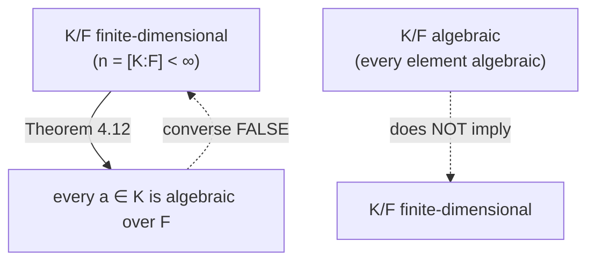

[[book-guidelines|↩ Back to guidelines]]

# Field Extensions and Degree

## The problem: how do you measure "how much bigger" one field is than another?

Take $\mathbb{Q} \subseteq \mathbb{Q}[\sqrt2]$. Both are fields, one contains the other, and $\mathbb{Q}[\sqrt2] \setminus \mathbb{Q}$ is infinite — so "bigger" can't mean cardinality. It has to mean something structural: $\mathbb{Q}[\sqrt2]$ is obtained from $\mathbb{Q}$ by throwing in exactly *one* new independent quantity, $\sqrt2$, and then closing under the field operations. Contrast that with $\mathbb{Q}[\sqrt2,\sqrt3]$, which needs two independent quantities. That intuitive "how many independent quantities did I have to add" is precisely what the previous chapter's machinery was built to make precise: it's a *dimension*.

**What breaks without this framing:** without a vector-space structure to fall back on, "size of a field extension" has no rigorous meaning at all — you'd be reduced to hand-wavy talk about "how many new numbers" appear, which fails the moment the extension is infinite (as it always is, over $\mathbb{Q}$). The entire reason Chapter 3 existed was to manufacture this one definition.

## Degree as a vector-space dimension

Recall from Chapter 3 (see [[Vector-Spaces]]) that whenever $K/F$ is a field extension, $K$ is automatically an $F$-vector space: vector addition is just addition in $K$, and scalar multiplication restricts $K$'s own multiplication to only using scalars from $F$. This gives:

**Definition 4.1.** Given a field extension $K/F$, the *degree of $K$ over $F$*, written $[K:F]$, is the dimension of $K$ as an $F$-vector space.

For $\mathbb{Q}[\sqrt2]/\mathbb{Q}$: every element is $a + b\sqrt2$ for $a,b \in \mathbb{Q}$, uniquely (since $\sqrt2 \notin \mathbb{Q}$), so $\{1, \sqrt2\}$ is a basis and $[\mathbb{Q}[\sqrt2]:\mathbb{Q}] = 2$. A *finite* extension is one with $[K:F] < \infty$; this is the well-behaved case the rest of the chapter (and the whole book's constructibility argument) lives in.

In Rust terms, think of $[K:F]$ as the *size of the "extra state"* a value of type $K$ carries beyond what an $F$-value carries — exactly the way an `enum` tag adds a fixed, bounded amount of extra information on top of its payload type. A `struct QSqrt2 { a: Rational, b: Rational }` literally *is* the basis representation $a\cdot 1 + b \cdot \sqrt2$, with `[K:F] = 2` showing up as "two rational fields." In Lean/Mathlib, this is exactly `FiniteDimensional.finrank F K`, and `Mathlib`'s `Module.rank` machinery is the direct ancestor of everything in this section.

## The Tower Theorem: degree is multiplicative

Now suppose you have a chain $F \subseteq K \subseteq L$ — a *tower* of fields. Three degrees are in play: $[K:F]$, $[L:K]$, $[L:F]$. How do they relate?

**Theorem 4.2.**
1. If $[L:F]$ is finite, then $[L:K]$ and $[K:F]$ are also finite.
2. If $[L:K] = m$ and $[K:F] = n$ are finite, with $B = \{v_1,\dots,v_m\}$ a $K$-basis for $L$ and $C = \{w_1,\dots,w_n\}$ an $F$-basis for $K$, then $A = \{v_i w_j\}$ is an $F$-basis for $L$. In particular $[L:F] = [L:K]\cdot[K:F]$.

**What breaks without careful bookkeeping (the "what breaks" paragraph):** the subtlety in the proof is that $K$ plays *two different roles simultaneously* — as the field of *scalars* for the vector space $L$ (via $L/K$), and as a *vector space* in its own right over $F$ (via $K/F$). If you don't keep straight, at every step, "is this element of $K$ acting as a scalar or a vector right now," the proof that the $mn$ products $v_iw_j$ are distinct and independent falls apart — you'd be silently mixing two different vector-space structures on the same underlying set.

The proof itself is a clean two-part argument. **Spanning:** any $x \in L$ writes as $x = \sum_i k_i v_i$ with $k_i \in K$ (since $B$ spans $L/K$); each $k_i$ then writes as $\sum_j f_{ij} w_j$ with $f_{ij}\in F$ (since $C$ spans $K/F$); substituting gives $x = \sum_{i,j} f_{ij}(v_iw_j)$, an $F$-linear combination of the $v_iw_j$. **Independence:** if $\sum_{i,j} f_{ij}v_iw_j = 0$, group by $i$ to get $\sum_i\left(\sum_j f_{ij}w_j\right)v_i = 0$ — this is a $K$-linear relation among the $v_i$ (with coefficients $k_i := \sum_j f_{ij}w_j \in K$), so $K$-independence of $B$ forces every $k_i = 0$; then $F$-independence of $C$ forces every $f_{ij} = 0$.

**Worked example (4.4).** Take $F=\mathbb{Q}$, $K=\mathbb{Q}[\sqrt2]$, $L=\mathbb{Q}[\sqrt2,\sqrt3]$. A $K$-basis for $L$ is $B=\{1,\sqrt3\}$ (every element is $(a+b\sqrt2) + (c+d\sqrt2)\sqrt3$), and an $F$-basis for $K$ is $C=\{1,\sqrt2\}$. The theorem says the $\mathbb{Q}$-basis for $L$ is the product set $\{1\cdot1,\ 1\cdot\sqrt2,\ \sqrt3\cdot1,\ \sqrt3\cdot\sqrt2\} = \{1,\sqrt2,\sqrt3,\sqrt6\}$ — exactly what you'd guess by hand, but now with a proof that it's a *basis* (spanning + independent), not just a spanning set. Hence $[L:\mathbb{Q}] = 2\cdot2 = 4$.

If you're building a type checker with a telescope of context extensions $\Gamma \subseteq \Gamma,x_1{:}A_1 \subseteq \Gamma,x_1{:}A_1,x_2{:}A_2 \subseteq \cdots$, the Tower Theorem is the same shape of fact you'd want about a *composable, multiplicative cost measure* through a chain of extensions — though there the "cost" is usually additive (number of binders), not multiplicative; the multiplicativity here comes specifically from the *basis-as-Cartesian-product* structure, which is worth noticing precisely because it's *not* how most compiler-side "extension size" measures compose.

## Algebraic vs. transcendental elements

Given $K/F$ and $a \in K$, does $a$ satisfy some polynomial equation with coefficients back in $F$?

**Definition 4.10.** $a \in K$ is *algebraic over $F$* if there exist $f_0,\dots,f_n \in F$, not all zero, with $f_na^n + \cdots + f_1a + f_0 = 0$ — i.e., $a$ satisfies some nonzero polynomial over $F$. Otherwise $a$ is *transcendental over $F$*.

**Definition 4.11.** When $F=\mathbb{Q}, K=\mathbb{C}$: algebraic elements are called *algebraic numbers*, transcendental ones *transcendental numbers*.

Every rational number is trivially algebraic over $\mathbb{Q}$ (it satisfies $x-a$). $\sqrt2$ is algebraic (satisfies $x^2-2$). The book's other worked example, $x^2$ viewed as an element of $\mathbb{R}(x)$ over $F=\mathbb{R}$: it is *transcendental* over $\mathbb{R}$, because the set $\{1,x^2,x^4,x^6,\dots\}$ turns out to be $\mathbb{R}$-linearly independent — no finite $\mathbb{R}$-linear combination of powers of $x^2$ can vanish identically. This is a clean illustration that "transcendental" doesn't mean exotic — it just means "no polynomial relation exists," which for a genuine indeterminate is exactly the expected, boring case.

Note the sharp asymmetry the book flags explicitly: to *prove* $a$ is algebraic, you just need to exhibit *one* satisfying polynomial. To prove $a$ is transcendental, you must rule out *every* nonzero polynomial over $F$ — infinitely many candidates. This is why concrete transcendence proofs (like those for $e$ and $\pi$) are hard, while exhibiting algebraic numbers is routine.

If you've done any work with SMT solvers: "is $a$ algebraic over $F$" is structurally the decision question "does there exist a satisfying nonzero-coefficient assignment to this existentially-quantified polynomial constraint over $F$" — which for $F=\mathbb{Q}$ is exactly the kind of existential arithmetic query a real-closed-field decision procedure (e.g. CAD) answers. Worth knowing the vocabulary lines up, even though this book doesn't go anywhere near decidability.

## Finite extensions are automatically algebraic

**Theorem 4.12.** If $K/F$ is finite-dimensional, then every $a \in K$ is algebraic over $F$.

**Proof idea (a pigeonhole/linear-dependence argument):** let $n = [K:F]$. The $n+1$ elements $1, a, a^2, \dots, a^n$ all live in the $n$-dimensional $F$-vector space $K$, so they *must* be $F$-linearly dependent (any $n{+}1$ vectors in an $n$-dimensional space are dependent — see [[Vector-Spaces]]). A nontrivial dependence $f_na^n + \cdots + f_1a+f_0=0$ (not all $f_i$ zero) is exactly a polynomial that $a$ satisfies. Done — and notice this is a *pure existence* argument: it proves a satisfying polynomial exists without ever constructing it.

**Worked example (4.13).** $F=\mathbb{Q}$, $K=\mathbb{Q}[\sqrt2]$, $[K:F]=2$. To show $1+\sqrt2$ is algebraic "by hand" via this method: the three elements $\{1,\ 1+\sqrt2,\ (1+\sqrt2)^2\}$ must be dependent since $[K:F]=2 < 3$. Indeed $(1+\sqrt2)^2 = 3+2\sqrt2 = 2(1+\sqrt2)+1$, giving $(1+\sqrt2)^2 - 2(1+\sqrt2) - 1 = 0$ — so $1+\sqrt2$ satisfies $x^2-2x-1$.

**Definition 4.14.** $K/F$ is an *algebraic extension* if every element of $K$ is algebraic over $F$ (a property of the whole field, not just one element). A finite-dimensional extension of $\mathbb{Q}$ is called an *algebraic number field*.

The book flags — and this matters — that **the converse of Theorem 4.12 is false**: a field can be algebraic over $F$ without being finite-dimensional over $F$ (the field of *all* algebraic numbers over $\mathbb{Q}$ is the standard example, though it's infinite-dimensional over $\mathbb{Q}$). "Algebraic" is a weaker, pointwise condition; "finite-dimensional" is a stronger, global one that happens to imply it.

## Where this leads

This chapter deliberately stops one step short of a full answer: Theorem 4.12 tells you *that* every element of a finite extension is algebraic, but not *how big* $F(a)$ is, nor whether $F[a]$ (the ring generated by $a$) equals $F(a)$ (the field generated by $a$) — those two open questions are exactly what [[The-Field-Generated-by-an-Element-and-Minimal-Polynomials]] (Chapter 6) resolves via the *minimal polynomial* of $a$. And the Tower Theorem proved here is the load-bearing tool that [[Straightedge-and-Compass-Constructibility]] (Chapter 7) uses directly: showing a constructible number lives at the top of a tower of degree-2 extensions, and multiplying those degrees up via Theorem 4.2, is the entire mechanism behind proving trisection, squaring the circle, and doubling the cube are all impossible.
