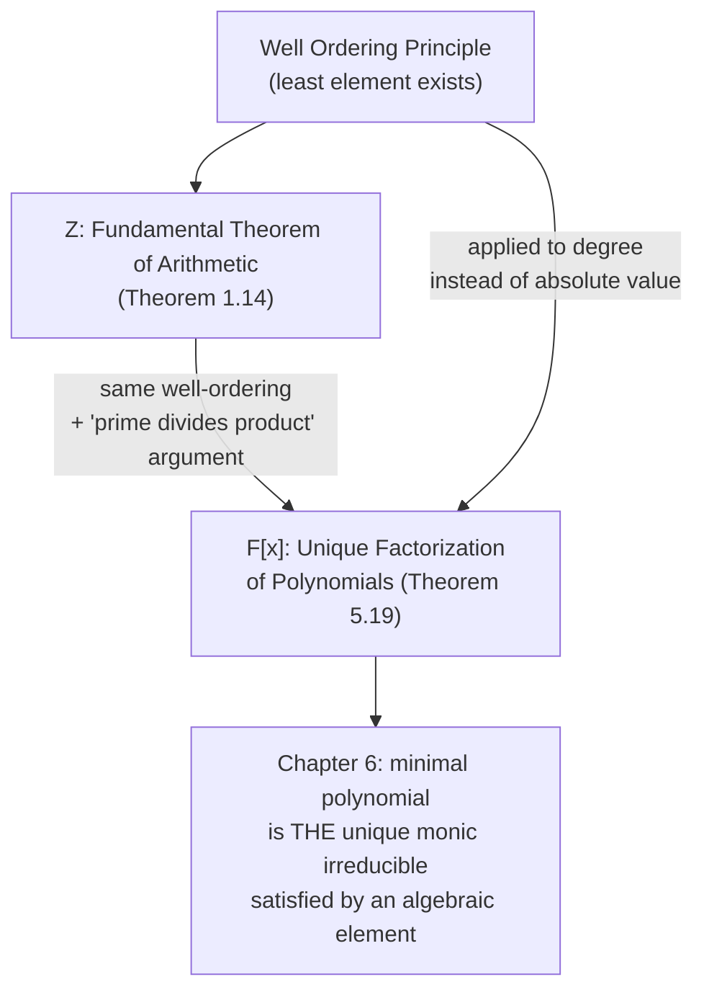

[[book-guidelines|↩ Back to guidelines]]

# Polynomial [[Rings|Rings]] and Factorization

## Why this chapter exists

Chapter 1 proved that $\mathbb{Z}$ has unique prime factorization. Chapter 6 (coming next) needs the *same* fact about $F[x]$, the ring of polynomials over a field $F$ — because the whole theory of "the field generated by an algebraic element" is going to be built on the idea that there's a single, canonical, irreducible polynomial attached to each algebraic number. Before that machinery can work, you need to know that $F[x]$ factors uniquely into irreducibles, exactly the way $\mathbb{Z}$ factors uniquely into primes.

This chapter is the bridge. It re-derives, for $F[x]$, essentially every tool Chapter 1 built for $\mathbb{Z}$: a division algorithm, a notion of gcd, a notion of "prime" (renamed *irreducible*), and a unique factorization theorem. The proofs are almost line-for-line analogous — which is itself the point. The author is showing you that "unique factorization" isn't really a fact about integers; it's a fact about *any ring with a division algorithm*, and $F[x]$ happens to be another instance.

**What breaks without this:** without unique factorization in $F[x]$, the notion of "the minimal polynomial of $\alpha$" in Chapter 6 wouldn't be well-defined — there could be several fundamentally different "smallest" polynomials satisfied by $\alpha$, with no canonical choice among them. The entire degree-counting argument that eventually proves the impossibility of angle trisection depends on minimal polynomials being unique.

## The division algorithm, again

Just like $\mathbb{Z}$, $F[x]$ supports long division:

**Theorem 5.2 (Division Algorithm).** Let $F$ be a field, $f(x), g(x) \in F[x]$ with $g(x) \neq 0$. There exist *unique* $q(x), r(x) \in F[x]$ with $f(x) = q(x)g(x) + r(x)$, where either $r(x) = 0$ or $0 \le \deg(r(x)) < \deg(g(x))$.

This is exactly Theorem (Lemma 1.3) from Chapter 1, with "$\deg$" playing the role that "$|\cdot|$" (well, really "$<$" on nonnegative integers) played there. The proof is the familiar long-division algorithm you learned in high school, formalized: at each step you cancel the leading term, and the degree of what's left strictly decreases, so the process terminates.

**If you've implemented a compiler**, this is the shape of the algorithm for reducing a term to normal form under a rewriting system with a strictly-decreasing measure — the "measure decreases each step, so it terminates" argument recurs constantly in operational semantics and termination proofs.

```rust
// Polynomial division over a field F.
// deg(remainder) < deg(divisor), or remainder is zero — checked by the loop invariant.
fn divide<F: Field>(mut f: Polynomial<F>, g: &Polynomial<F>) -> (Polynomial<F>, Polynomial<F>) {
    let mut q = Polynomial::zero();
    while !f.is_zero() && f.degree() >= g.degree() {
        let shift = f.degree() - g.degree();
        let coeff = f.leading_coeff() / g.leading_coeff();     // requires F to be a field
        let term = Polynomial::monomial(coeff, shift);
        q = q + term.clone();
        f = f - term * g.clone();                              // strictly reduces f.degree()
    }
    (q, f) // (quotient, remainder)
}
```

Notice the `coeff = f.leading_coeff() / g.leading_coeff()` line — this is *exactly* why the division algorithm needs $F$ to be a field, not just a ring. You need to invert the leading coefficient of $g(x)$. This is the polynomial analogue of why integer division needs a quotient/remainder pair instead of exact division: $\mathbb{Z}$ isn't a field, but it *is* a Euclidean domain, and Euclidean domains are precisely the rings where "division with remainder, remainder strictly smaller" makes sense. $F[x]$ for a field $F$ is another Euclidean domain — same abstract pattern, different notion of "size" (degree instead of absolute value).

## The evaluation homomorphism and the factor theorem

**Lemma 5.3 (Evaluation Homomorphism).** For any $a \in F$, evaluating at $a$ commutes with sums and products: $(fg)(a) = f(a)g(a)$ and $(f+g)(a) = f(a) + g(a)$.

This sounds almost too obvious to name, but it's the fact that makes substitution *legal* — it says "plug in $a$" is a ring homomorphism $F[x] \to F$. In Lean terms, this is `eval` being a `RingHom`, and it's the load-bearing fact underneath every claim like "if $f(a)=0$ then $f(x)$ has $(x-a)$ as a factor."

Dividing $f(x)$ by $x - a$ specifically gives a constant remainder (degree $< 1$ means degree $0$), and substituting $x = a$ shows that constant *is* $f(a)$:

**Corollary 5.4.** The remainder of $f(x)$ divided by $x - a$ is $f(a)$.

**Definition 5.5 (Root).** $a \in F$ is a root of $f(x)$ if $f(a) = 0$.

Immediately: $a$ is a root of $f(x)$ if and only if $(x - a) \mid f(x)$. This is the **factor theorem**, and it's the hinge the rest of the chapter turns on — every later result about counting roots is really a result about how many times $(x-a)$-type factors can appear in a factorization.

## Divisibility for polynomials

**Definition 5.7.** $g(x)$ divides $f(x)$ if $f(x) = q(x)g(x)$ for some $q(x) \in F[x]$ — verbatim the same shape as Definition 1.1 for integers. This isn't a coincidence; it's the generic definition of divisibility in *any* commutative ring, and the book flags this explicitly: "the same definition of divisibility would apply to any commutative ring." **What breaks without commutativity:** you'd have to distinguish left- and right-divisors, since $db = a$ and $bd = a$ would no longer coincide.

## Greatest common divisor: why "largest" doesn't work here

This is the most conceptually interesting design decision in the chapter. In Chapter 1, $\gcd(a,b)$ was defined as *the largest* common divisor — a definition that works because $\mathbb{Z}$ has a total order and only finitely many divisors of a given number.

Polynomials have no such order. There is no sensible sense in which $x^2 + 1$ is "bigger" or "smaller" than $x^3 - x$. So Sethuraman does something the notes flag as a deliberate pedagogical pivot: he defines gcd the way *some* number-theory textbooks alternatively define it for $\mathbb{Z}$ (via Corollary 1.7, "every common divisor divides the gcd") rather than the way this book itself defined it for $\mathbb{Z}$ (as the literal maximum):

**Definition 5.9.** $d(x)$ is a gcd of $f(x), g(x)$ if (1) $d(x)$ divides both, and (2) every common divisor of $f(x), g(x)$ divides $d(x)$.

This is a *universal-property* style definition — "greatest" doesn't mean "biggest" anymore, it means "most divisible-into by everything else that divides both." Two consequences fall out immediately, both proved in the text:

- **Uniqueness only up to a constant multiple.** If $d(x)$ and $d'(x)$ both satisfy Definition 5.9, each divides the other, forcing $d'(x) = c \cdot d(x)$ for some nonzero constant $c$. So "the" gcd of two polynomials is really an equivalence class under scaling — you conventionally normalize by taking the monic representative.
- **Existence, via the least-degree trick (Theorem 5.10).** Exactly mirroring Theorem 1.6's "$\gcd(a,b)$ is the least positive element of $\{xa+yb\}$," here $d(x)$ is taken to be an element of least *degree* in $S = \{a(x)f(x) + b(x)g(x)\}$. The division algorithm then forces $d(x)$ to divide both $f(x)$ and $g(x)$: if it didn't divide $f(x)$, the remainder of that division would itself be a nonzero, strictly-lower-degree element of $S$ — contradicting minimality.

**Corollary 5.12 (Bézout for polynomials).** $f(x), g(x)$ are *relatively prime* (gcd is a unit, i.e. a nonzero constant) iff $p(x)f(x) + q(x)g(x) = 1$ for some $p(x), q(x) \in F[x]$.

This Bézout identity is the polynomial-ring analogue of the extended Euclidean algorithm's output, and it's precisely the mechanism used later (Chapter 6, Theorem 6.10) to show $1/g(a) \in F[a]$ when $g(a) \neq 0$ — i.e., it's what makes field-generation-by-an-element actually produce a *field*.

```rust
// Extended Euclidean algorithm for F[x]: returns (gcd, p, q) with p*f + q*g == gcd.
fn extended_gcd<F: Field>(f: Polynomial<F>, g: Polynomial<F>) -> (Polynomial<F>, Polynomial<F>, Polynomial<F>) {
    if g.is_zero() { return (f, Polynomial::one(), Polynomial::zero()); }
    let (q, r) = divide(f.clone(), &g);
    let (d, p1, q1) = extended_gcd(g.clone(), r);
    // f = q*g + r  =>  p1*g + q1*r = d, and r = f - q*g
    // so d = p1*g + q1*(f - q*g) = q1*f + (p1 - q1*q)*g
    (d, q1.clone(), p1 - q1 * q)
}
```

Mathlib's `EuclideanDomain.gcd` (and the corresponding `EuclideanDomain.gcd_eq_gcd_ab` for the Bézout coefficients) is the literal Lean-side counterpart — `F[x]` for a field `F` is registered as a `EuclideanDomain` instance precisely because of Theorem 5.2.

## Irreducibility: the polynomial analogue of "prime"

**Definition 5.14.** $f(x)$ (nonconstant) is *irreducible* if every factorization $f = gh$ is trivial — one of $g, h$ is a nonzero constant. Otherwise $f$ is *reducible*. A *monic* polynomial has leading coefficient $1$ (the natural normalization, since irreducibility is invariant under scaling by a nonzero constant — Example 5.15.7).

Some sharp, useful facts the book proves as worked examples:

- Every linear polynomial is automatically irreducible (nothing of lower positive degree to factor it into).
- For degree 2 or 3 specifically: $f(x)$ is reducible **iff** it has a root in $F$ (Examples 5.15.4–5). This *fails* for degree $\ge 4$ — a quartic can be reducible (product of two irreducible quadratics) while having no roots at all. This is a genuinely important trap: "no rational roots" does **not** imply "irreducible over $\mathbb{Q}$" once you're past degree 3.
- $x^2 - 2$ is irreducible over $\mathbb{Q}$ — proved directly from $\sqrt2 \notin \mathbb{Q}$ (Example 5.15.3). This example gets reused verbatim in Chapter 6 to show $x^2-2$ is the *minimal polynomial* of $\sqrt2$.
- The **Fundamental Theorem of Algebra** (Example 5.15.9, stated without proof — genuinely outside the book's scope, needs analysis): every nonconstant $f(x) \in \mathbb{C}[x]$ has a root in $\mathbb{C}$. Equivalently: the only irreducibles in $\mathbb{C}[x]$ are the linear ones.

## Unique factorization: the payoff theorem

**Theorem 5.19 (Unique Prime Factorization of Polynomials).** Every nonconstant $f(x) \in F[x]$ factors into a product of irreducibles, unique up to reordering and multiplication by (unit) constants.

The proof is deliberately built to mirror Theorem 1.14 (Fundamental Theorem of Arithmetic) step for step, and the book explicitly tells you to go re-read that proof first. Both proofs have the same two-part shape:

- **Existence** by "keep factoring until you can't" — for integers the *factors themselves* shrink; for polynomials it's their *degrees* that shrink, bottoming out because degree is a nonnegative integer (another well-ordering argument).
- **Uniqueness** by "peel off matching irreducibles pairwise" — the key generalized lemma (Exercise 2, generalizing Lemma 5.18 the same way Exercise 3 of Chapter 1 generalized Lemma 1.13) is: *if an irreducible $p(x)$ divides a product $f_1(x)\cdots f_n(x)$, it divides one factor*. This "prime-like" behavior of irreducibles is really the crux fact; everything else is bookkeeping.

The one genuine wrinkle versus the integer case: two irreducible factorizations can only be matched up to multiplication by a nonzero constant, not exactly — a direct consequence of gcd (and hence irreducible factors) only being well-defined up to scaling in $F[x]$.



## Counting roots with multiplicity

**Definition 5.20 (Multiplicity).** $a$ is a root of multiplicity $k$ if $(x-a)^k \mid f(x)$ but $(x-a)^{k+1} \nmid f(x)$.

Combining this with unique factorization: **Corollary 5.22** — the number of roots of $f(x)$ in $F$, counted with multiplicity, can never exceed $\deg(f)$. (Each distinct root contributes at least one linear factor to the unique factorization, and degrees add.)

Over $\mathbb{C}$ specifically, the Fundamental Theorem of Algebra upgrades this inequality to an *equality*:

**Theorem 5.23.** For nonconstant $f(x) \in \mathbb{C}[x]$, the number of roots in $\mathbb{C}$, counted with multiplicity, equals $\deg(f)$ exactly, and $f(x) = c(x-a_1)^{k_1}\cdots(x-a_t)^{k_t}$ for the leading coefficient $c$.

This is the reason a real or rational polynomial that has *no* roots at all in its own field can still be guaranteed to fully factor into linear pieces once you're willing to look in $\mathbb{C}$ — a fact Chapter 7 leans on implicitly when it talks about minimal polynomials and their roots.

## Eisenstein's Criterion (from the Notes)

Stated without proof in the main text (the proof needs Gauss's Lemma — *a polynomial in $\mathbb{Z}[x]$ that factors over $\mathbb{Q}$ also factors over $\mathbb{Z}$* — which the book explicitly omits as "carrying us a little too far afield"):

> Let $f(x) = a_nx^n + \cdots + a_1x + a_0 \in \mathbb{Z}[x]$. If some prime $p$ satisfies $p \nmid a_n$, $p \mid a_{n-1}, \ldots, p \mid a_0$, and $p^2 \nmid a_0$, then $f(x)$ is irreducible over $\mathbb{Q}$.

The payoff application: the **$p$-th cyclotomic polynomial** $x^{p-1} + x^{p-2} + \cdots + x + 1$ is irreducible over $\mathbb{Q}$ for any prime $p$ (proved indirectly, by showing $f(x)$ irreducible iff $f(x+1)$ irreducible, then applying Eisenstein to the shifted polynomial). This is precisely the fact needed to analyze constructibility of regular $p$-gons in Chapter 7 — one more place where this chapter's machinery is silently doing the work behind a much later, more visible theorem.

## Where this leads — and why it's load-bearing for your project

This chapter is one of the most directly transferable pieces of the whole book for a compiler/theorem-prover project, for three specific reasons:

1. **The division algorithm + Bézout identity is literally the extended-Euclidean-algorithm pattern** used inside constraint solvers and CAS-style symbolic simplifiers — any place you need "$\gcd$, plus a certificate of how to build it as a linear combination," this is the abstract shape.
2. **Irreducibility and unique factorization are the same "fully-normalized / no further decomposition possible" pattern** that shows up as clause normal form in SAT/SMT, and as normal forms under a confluent, terminating rewriting relation in operational semantics — the "keep factoring until you can't, and the result doesn't depend on the order you did it in" argument here *is* a confluence-and-termination argument, just for a very concrete rewriting system (polynomial factorization).
3. **The Unique Factorization Theorem is the direct prerequisite for Chapter 6's minimal polynomial**, which is in turn the object whose degree drives the entire degree-counting proof of angle-trisection's impossibility in Chapter 7. Without unique factorization, "the minimal polynomial of $\alpha$" wouldn't be a well-defined single object — you'd only have an equivalence class, and none of the later degree arithmetic ($[F(\alpha):F] = \deg(m_{F,\alpha})$) would hold as stated.

Chapter 6 picks this up immediately: it studies $I_{F,a}$, the set of all polynomials in $F[x]$ satisfied by an algebraic element $a$, and uses exactly the least-degree argument from Theorem 5.10 to extract a canonical generator — the minimal polynomial.
