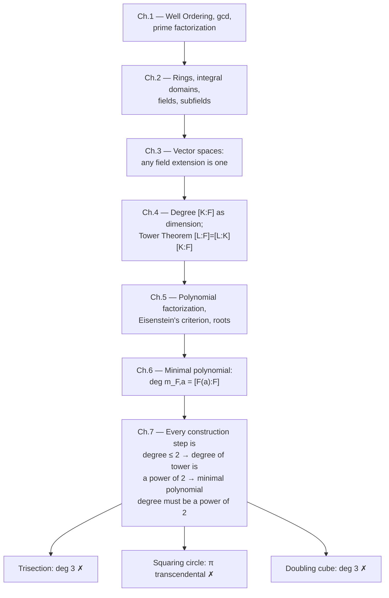

[[book-guidelines|↩ Back to guidelines]]

# Straightedge and Compass Constructibility

## The problem: a geometric question with no geometric answer

For about two thousand years, three questions resisted every attempt at a geometric solution:

1. **Trisect an arbitrary angle** — given angle $\theta$, construct $\theta/3$.
2. **Square the circle** — given a circle of radius 1 (area $\pi$), construct a square of the same area (side $\sqrt\pi$).
3. **Double the cube** — given a cube of side 1 (volume 1), construct a cube of volume 2 (side $\sqrt[3]{2}$).

All three are *impossible*, but not because nobody was clever enough. The reason they resisted two thousand years of geometric attack is that they aren't geometric problems in disguise — they're algebraic problems, and the algebra needed to state them precisely (fields, field extensions, minimal polynomials) didn't exist until the 19th century. This chapter is the payoff of the entire book: it takes every piece of machinery built in Chapters 1–6 and uses it to convert "can you draw this with a straightedge and compass?" into "does this number's minimal polynomial have degree a power of 2?" — a question you can just *compute*.

This is worth pausing on as a *pattern*, independent of the specific geometry: an open-ended constructive/operational question (can a sequence of geometric moves ever reach this point?) gets reduced to a closed, checkable algebraic invariant (the degree of a polynomial). This is the same move that underlies most soundness arguments in program verification — you don't reason about all possible executions or derivations directly; you find an algebraic or combinatorial invariant that every valid derivation must satisfy, then show your target violates it. Keep this shape in mind; it recurs at the end.

## What breaks if you don't formalize "constructible"

Straightedge-and-compass constructions feel intuitive until you try to prove something is *impossible* with them — "I couldn't figure out how" is not a proof. You need a precise, checkable characterization of every number that *can* be constructed, so that showing $\sqrt[3]{2}$ falls outside that characterization becomes a finite computation rather than an infinite search over "maybe some clever construction exists."

## Step 1: the three elemental operations

Every straightedge-and-compass construction reduces to exactly three primitive moves:

1. **Line ∩ line** — intersect two constructed lines.
2. **Line ∩ circle** — intersect a constructed line and a constructed circle.
3. **Circle ∩ circle** — intersect two constructed circles.

Any construction — bisecting a segment, dropping a perpendicular, copying an angle — is just a finite sequence of these three operations. This observation is what makes the algebraic translation possible: instead of reasoning about arbitrarily complicated *figures*, you only ever need to reason about what happens at *one intersection step*.

## Step 2: giving the plane algebraic coordinates

Before any construction begins, you draw an arbitrary line (call it the $x$-axis), pick two points on it, and declare the distance between them to be your unit of length. Everything else — the $y$-axis, the origin, positive/negative directions — is built from this by more constructions (e.g. the perpendicular bisector of two points gives you the $y$-axis).

Once you have this coordinate system, you can construct every point $(m,n)$ with integer coordinates, and then (using the classical construction for dividing lengths) every point $(q,s)$ with **rational** coordinates $q, s \in \mathbb{Q}$.

**Definition 7.1.** A real number $r$ is *constructible* if a line segment of length $|r|$ can be built with straightedge and compass.

**Definition 7.3.** For a subfield $F \subseteq \mathbb{R}$:
- The **plane of $F$** is $\{(a,b) : a, b \in F\}$.
- A **line of $F$** is any line $ax + by + c = 0$ with $a,b,c \in F$.
- A **circle of $F$** is any circle $x^2+y^2+ax+by+c=0$ with $a,b,c \in F$.

**Lemma 7.2.** The plane of $\mathbb{Q}$ is constructible — every point with rational coordinates can be built.

So the base case is settled: $\mathbb{Q}$ is where every construction starts.

## Step 3: the technical heart — one intersection step is at worst a square root

This is the crux of the whole chapter, so it's worth walking through carefully. Suppose the plane of $F$ is already constructible (every point with coordinates in $F$ can be built). You now draw more lines and circles using points of $F$; **Lemma 7.4** confirms these are lines and circles *of* $F$ (their coefficients stay in $F$, by Pythagoras and basic linear algebra — nothing surprising). The real question: when you intersect two such lines/circles, where do the coordinates of the intersection point live?

**Proposition 7.5.** *Let $F$ be a constructible subfield of $\mathbb{R}$. The coordinates of any intersection point between lines and circles of $F$ lie in a field $F(\sqrt d)$ for some nonnegative $d \in F$.*

The proof is a case analysis on the three elemental operations, and each case is genuinely illuminating:

- **Line ∩ line.** Solving $a_1x+b_1y+c_1=0$ and $a_2x+b_2y+c_2=0$ simultaneously is straight linear algebra (Cramer's rule):
$$x = \frac{b_1c_2 - b_2c_1}{a_1b_2 - a_2b_1}, \qquad y = \frac{a_2c_1 - a_1c_2}{a_1b_2 - a_2b_1}.$$
Both coordinates are just field operations on elements of $F$ — so they land in $F$ itself. **No extension needed at all.**

- **Line ∩ circle.** Solve the line for one variable (say $x$ in terms of $y$), substitute into the circle equation. The circle is *quadratic*, so substituting a linear expression for $x$ produces a single **quadratic equation in $y$**: $ly^2+my+n=0$ with $l,m,n \in F$. Its roots are
$$y = \frac{-m \pm \sqrt{m^2-4ln}}{2l}.$$
Write $d = m^2-4ln$ (nonnegative, else the line and circle don't meet in $\mathbb{R}^2$). The roots live in $F(\sqrt d)$ — and then $x$, being an $F$-linear expression in $y$, lands in $F(\sqrt d)$ too.

- **Circle ∩ circle.** Subtract the two circle equations $x^2+y^2+a_1x+b_1y+c_1=0$ and $x^2+y^2+a_2x+b_2y+c_2=0$. The $x^2$ and $y^2$ terms cancel, leaving a **linear** equation — i.e. this case *reduces to* line ∩ circle (intersect that line with either original circle). Same conclusion: $F(\sqrt d)$.

The pattern: line ∩ line is degree-1 algebra (stay in $F$); anything involving a circle is degree-2 algebra (a quadratic pops out, so you adjoin one square root and move to $F(\sqrt d)$). This is *why* constructibility is fundamentally a story about towers of **quadratic** extensions — there is no other degree a single intersection can produce.

**Lemma 7.7** proves the converse direction: if $F$ is constructible, then $F(\sqrt d)$ *is* constructible for any nonnegative $d \in F$ (you can literally construct $\sqrt d$ geometrically, e.g. via the geometric mean construction, then build $a+b\sqrt d$ from constructible $a,b$). **Lemma 7.8** is just Pythagoras: the distance between two points of the plane of $F$ lands in some $F(\sqrt d)$.

## Step 4: the full criterion

Putting Steps 2–3 together as an induction over however many intersection steps a construction takes:

**Theorem 7.9.** *A real number $\alpha$ is constructible if and only if $\alpha$ lies in a field $K$ that sits in a tower*
$$\mathbb{Q} = K_0 \subseteq K_1 \subseteq \cdots \subseteq K_t = K, \qquad K_i = K_{i-1}(\sqrt{d_{i-1}}) \text{ for some } d_{i-1} \ge 0 \text{ in } K_{i-1}.$$

This is *exactly* the algebraic shadow of "a finite sequence of ruler-and-compass moves": each $K_i$ represents the field you can express coordinates in after $i$ intersection steps. The ⟸ direction constructs $K$ step by step using Lemma 7.7; the ⟹ direction watches an actual construction unfold and reads off the tower using Proposition 7.5 at each intersection.

## Step 5: turning the tower into a checkable number

The tower criterion is precise but unwieldy — you don't want to hunt for an explicit tower every time you want to rule something out. This is where Chapters 4–6 cash in.

**Corollary 7.10 (the necessary condition).** *If $\alpha$ is constructible, then $\alpha$ is algebraic over $\mathbb{Q}$ and its minimal polynomial has degree a power of 2.*

*Proof sketch.* Each step $K_i/K_{i-1}$ has degree 1 or 2 (Exercise, using $[K_{i-1}(\sqrt d):K_{i-1}] \in \{1,2\}$ — trivial if $d$ is already a perfect square in $K_{i-1}$, else 2 by the minimal-polynomial machinery of Chapter 6). By the **Tower Theorem** (Theorem 4.2, multiplicativity of degree), $[K:\mathbb{Q}] = \prod [K_i:K_{i-1}]$ is a product of 1's and 2's — a power of 2. Since $\mathbb{Q}(\alpha) \subseteq K$, Theorem 4.2 again gives $[\mathbb{Q}(\alpha):\mathbb{Q}] \mid [K:\mathbb{Q}]$, so it's *also* a power of 2. And by Theorem 6.10.2, $[\mathbb{Q}(\alpha):\mathbb{Q}]$ **is** the degree of $\alpha$'s minimal polynomial. $\blacksquare$

This corollary is the whole book's machinery collapsing into one computable check: *compute the minimal polynomial of $\alpha$ over $\mathbb{Q}$; if its degree isn't a power of 2, $\alpha$ is not constructible.*

### The converse is false — and this matters

The book is explicit and insistent about this in its Notes: **having minimal-polynomial degree a power of 2 does not imply constructibility.** Theorem 7.9 requires $\alpha$ to live in a field with a *specific kind* of tower — degree exactly 2 (or 1) at every single step. $[\mathbb{Q}(\alpha):\mathbb{Q}]$ being a power of 2 only guarantees the *total* degree is a power of 2; it says nothing about whether $\mathbb{Q}(\alpha)$ itself decomposes into a chain of quadratic steps. There exist degree-4 extensions of $\mathbb{Q}$ (a power of 2!) that contain no intermediate quadratic subfield at all, and elements of such fields are *not* constructible despite passing the degree test.

(The book's Notes mention the actual fix, without proving it: $\alpha$ is constructible iff **both** $\mathbb{Q}(\alpha)$ and its *normal closure* over $\mathbb{Q}$ have degree a power of 2 — the normal closure being the field generated by *all* roots of $\alpha$'s minimal polynomial. This is a Galois-theoretic refinement just past the book's scope.)

**This distinction is worth sitting with if you work on abstract interpretation or decision procedures**: Corollary 7.10 is a sound but incomplete over-approximation of "constructible" — every constructible number passes the test, but not every number that passes the test is constructible. It's structurally the same gap between an abstract domain's static invariant (cheap, decidable, checkable in isolation) and full operational reachability (expensive, requires tracking the actual derivation/tower, not just a summary statistic of it). A degree-power-of-2 check is to constructibility what a type/interval/octagon abstraction is to true reachability: a necessary filter, not a certificate.

## Step 6: three impossibility proofs, one line each

With Corollary 7.10 in hand, all three classical problems become a matter of computing one minimal polynomial and checking its degree.

**Theorem 7.11 — trisecting $60°$ is impossible.** Trisecting $60°$ would mean constructing $\cos 20°$. The triple-angle identity $\cos 3\theta = 4\cos^3\theta - 3\cos\theta$ at $\theta=20°$, using $\cos 60° = \tfrac12$, gives
$$4(\cos 20°)^3 - 3(\cos 20°) = \tfrac12 \;\Longrightarrow\; 8x^3 - 6x - 1 = 0 \text{ at } x = \cos 20°.$$
This cubic is irreducible over $\mathbb{Q}$ (checked via the rational root test — Example 5.16 in the book), so it *is* the minimal polynomial of $\cos 20°$ over $\mathbb{Q}$ (Theorem 6.9). Degree 3 is not a power of 2. Done.

**Theorem 7.12 — squaring the circle is impossible.** Constructing side $\sqrt\pi$ would put $\sqrt\pi$ (hence $\pi = (\sqrt\pi)^2 \in \mathbb{Q}(\sqrt\pi)$) in a finite extension of $\mathbb{Q}$, so $\pi$ would be algebraic (Theorem 4.12). But $\pi$ is transcendental (cited from Chapter 4, proof out of scope). Contradiction — no minimal polynomial exists at all, let alone one of power-of-2 degree.

**Theorem 7.13 — doubling the cube is impossible.** Constructing $\sqrt[3]2$ requires its minimal polynomial $x^3-2$ (irreducible over $\mathbb{Q}$ by Eisenstein at $p=2$) to have power-of-2 degree. It's degree 3.

Every one of these arguments is *purely* "compute a minimal polynomial's degree, compare to a power of 2" — no geometric reasoning left at all. That's the whole point: the geometry was translated away in Steps 2–5, and what's left is arithmetic.

## Bonus: regular $n$-gons

The book sketches (without full proof, citing it as beyond scope) the complete characterization: a regular $n$-gon ($n \ge 3$) is constructible iff
$$n = 2^k p_1 p_2 \cdots p_t, \qquad t \ge 0,\ k \ge 0 \ (k \ge 2 \text{ if } t=0),$$
where each $p_i$ is a distinct **Fermat prime** ($p = 2^{2^j}+1$). This is the Gauss–Wantzel theorem; getting there needs a bit of the theory of roots of unity and (per the book) "a little Galois theory," both past this book's scope — but the shape is exactly Corollary 7.10 refined by the normal-closure fix mentioned above.

## Grounding: the reduction as a soundness argument

**Rust.** The cleanest way to make this concrete is to model the *degree tower* directly rather than the geometry:

```rust
/// A field extension step, tracked purely by its degree over the previous field.
/// This mirrors Theorem 7.9: constructibility is a tower of degree-≤2 steps.
struct ExtensionStep {
    degree: u32, // must be 1 or 2 for a "constructible" tower
}

/// Corollary 7.10 as a *necessary* filter — this is a sound over-approximation,
/// not a decision procedure. It can reject correctly (degree not a power of 2)
/// but cannot certify (power of 2 does not imply an actual quadratic tower exists).
fn passes_necessary_filter(min_poly_degree: u32) -> bool {
    min_poly_degree != 0 && (min_poly_degree & (min_poly_degree - 1)) == 0
}

// e.g. passes_necessary_filter(3) == false  -> cos(20°), cbrt(2) correctly rejected
// e.g. passes_necessary_filter(4) == true   -> NOT a certificate; would need the
//                                              actual tower / normal-closure check
//                                              to confirm constructibility.
```
The `passes_necessary_filter` / "actual tower" split is the same shape you'll want for any abstract-interpretation-style filter: a cheap syntactic/algebraic check that soundly rejects, paired with an explicit acknowledgment that passing it is not a proof.

**Lean.** Because this chapter *is* a theorem with hypotheses and a clean conclusion, it's worth phrasing as a Lean-style statement to see the proof-obligation shape explicitly (Mathlib actually has `IsConstructible`-adjacent machinery in its Galois theory / `Polynomial.Gal` files, though not identical to this book's elementary treatment):

```lean
-- Sketch, not literal Mathlib API — illustrates the proof obligation shape.
theorem constructible_imp_pow_two_degree
    (α : ℝ) (h : Constructible α) :
    ∃ n : ℕ, (minpoly ℚ α).natDegree = 2 ^ n := by
  -- from h, extract a tower Q = K₀ ≤ K₁ ≤ ... ≤ Kₜ = K, α ∈ K,
  -- each [Kᵢ : Kᵢ₋₁] ∈ {1, 2}          -- Theorem 7.9
  -- [K : Q] = ∏ [Kᵢ : Kᵢ₋₁]            -- Theorem 4.2 (tower law)
  -- [Q(α) : Q] ∣ [K : Q]               -- Theorem 4.2 again
  -- (minpoly ℚ α).natDegree = [Q(α):Q] -- Theorem 6.10.2
  sorry
```
The `sorry` marks exactly where the real content lives — this is a genuine multi-lemma soundness proof, and writing it this way makes explicit that *no step is geometric*; every step is a field-theory lemma already proved earlier in the book.

**Python**, for a quick sanity check of the trisection argument's polynomial:

```python
from sympy import symbols, Poly, factor
x = symbols('x')
p = Poly(8*x**3 - 6*x - 1, x)
print(factor(p.as_expr()))  # irreducible over Q -> stays as 8*x**3 - 6*x - 1
```

## Where this leads

This chapter is the reason the book exists — it's the terminal application, not a stepping stone to something further. Structurally:



If your own project ever needs to prove a similar *negative* result — "no derivation of this judgment exists," "this constraint system is unsatisfiable," "this program admits no valid refinement typing" — this chapter is a template for the general strategy: find an algebraic/combinatorial invariant that every valid derivation must preserve, show it's cheap to compute, and show your target violates it. The care the book takes to flag that Corollary 7.10 is *only* a necessary condition (not sufficient) is the more subtle and more transferable lesson: a sound filter that isn't complete is still enormously useful, as long as you're honest about which side of the implication you've actually proved.
