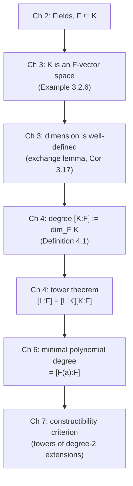

[[book-guidelines|↩ Back to guidelines]]

# Vector Spaces

## Why this chapter exists at all

Sethuraman is upfront about it in the first paragraph of Chapter 3: the whole book is aimed at proving that certain straightedge-and-compass constructions are impossible, and the proof strategy hinges on being able to *measure* a field extension $K/\mathbb{Q}$ — to say precisely how "big" $K$ is relative to $\mathbb{Q}$. "Big" is vague until you have a number attached to it. Vector spaces are the machine that produces that number. This chapter is not a general linear-algebra refresher for its own sake; it's built, start to finish, toward one specific payoff: showing that a field extension is automatically a vector space, so that its dimension becomes a legitimate way to measure the extension's size. Chapter 4 picks this up immediately and *defines* $[K:F]$, the degree of a field extension, to be exactly this dimension.

If you're building a compiler with a Rust-based kernel, the analogy worth holding onto from the start: this chapter is doing for "extension" what a lattice-height or ordinal-rank function does for an abstract domain — turning a structural containment relationship into a comparable numeric invariant. Keep that in the back of your mind; it resurfaces at the end.

## From geometry to algebra

The chapter starts where you'd expect — $\mathbb{R}^2$ and $\mathbb{R}^3$, vectors as arrows, addition via the parallelogram law, scalar multiplication by stretching/flipping. Two things about $(\mathbb{R}^2, +)$ get flagged as important: it satisfies all the abelian group axioms (commutative, associative, has a zero, has inverses), and scalar multiplication by real numbers satisfies four properties:

$$r \cdot (v + w) = r \cdot v + r \cdot w, \quad (r+s)\cdot v = r \cdot v + s \cdot v, \quad (rs) \cdot v = r \cdot (s \cdot v), \quad 1 \cdot v = v$$

**What breaks without this generalization step:** if you stopped at "vectors are arrows in a plane," you'd have no way to talk about $\mathbb{Q}[\sqrt2]$ as a vector space, no way to talk about polynomials as vectors, and — critically — no way to talk about a field extension $K$ as a vector space over its base field $F$. The entire payoff of the chapter requires stripping away the geometric picture and keeping only the algebraic skeleton.

That skeleton is Definition 3.1:

> Let $F$ be a field. A **vector space over $F$** (an *$F$-vector space*) is an abelian group $V$ together with a function $F \times V \to V$, called scalar multiplication and written $\cdot$, such that for all $r, s \in F$ and $v, w \in V$:
> 1. $r \cdot (v+w) = r\cdot v + r \cdot w$
> 2. $(r+s)\cdot v = r\cdot v + s\cdot v$
> 3. $(rs)\cdot v = r \cdot (s\cdot v)$
> 4. $1 \cdot v = v$

Elements of $V$ are *vectors*, elements of $F$ are *scalars*. Notice what's *not* required: there's no dot product, no norm, no notion of angle. A vector space is purely additive-group-plus-a-compatible-scaling-action. That minimalism is exactly what lets the same definition capture $\mathbb{R}^2$, polynomial [[Rings|rings]], and field extensions as instances of one structure.

## The examples, and why one of them matters more than the rest

Sethuraman works through a sequence of examples (3.2.1–3.2.10), and they're worth walking through because they build in difficulty toward the one that actually matters for the rest of the book.

- **$\mathbb{R}^n$, then $F^n$ for an arbitrary field $F$** — componentwise addition and scaling. Straightforward generalization of the geometric picture.
- **$F^\infty$** — infinite tuples, same idea, no geometric picture available at all anymore. This is the first hint that the abstract definition has outrun intuition, which is the point.
- **$M_n(F)$**, the $n\times n$ matrices over $F$, as an $F$-vector space under the usual addition and scalar-times-matrix multiplication.
- **$F[x]$**, the polynomial ring, as an $F$-vector space: addition of polynomials, scalar multiplication by an element of $F$. Every real number $r$ sits inside $\mathbb{R}[x]$ as the constant polynomial $r$, giving $\mathbb{R}$ a **dual role** — as a vector when you see it standing alone, as a scalar when you see it multiplying a polynomial.
- **$\mathbb{Q}[\sqrt2]$ as a $\mathbb{Q}$-vector space** (Example 3.2.5) — this is the pivot example. $(\mathbb{Q}[\sqrt2], +)$ is an abelian group because $\mathbb{Q}[\sqrt2]$ is a field, hence a ring, hence has an additive group structure "for free." Scalar multiplication is just $q \cdot (a + b\sqrt2) = qa + qb\sqrt2$ for $q \in \mathbb{Q}$. Same dual-role phenomenon: $q$ by itself is a vector (it *is* an element of $\mathbb{Q}[\sqrt2]$, namely $q + 0\sqrt2$), but $q$ inside $q \cdot (a+b\sqrt2)$ is a scalar.

Then Sethuraman generalizes this one example twice in a row, and this is the crux of the whole chapter:

**Example 3.2.6 — the general case.** Let $K/F$ be *any* field extension. Since $K$ is a field, $(K,+)$ is automatically an abelian group. Now restrict multiplication: instead of using the full multiplication $K \times K \to K$, only multiply an element of $F$ against an element of $K$. This restricted operation satisfies exactly the four scalar-multiplication axioms (they're inherited directly from $K$'s own ring axioms — distributivity, associativity, and $1\cdot k = k$ all come for free). Conclusion:

> **Every field extension $K/F$ makes $K$ into an $F$-vector space**, with $F$ as scalars and $(K,+)$ as vectors.

As with $\mathbb{Q}[\sqrt2]$, elements of $F$ play a dual role: a vector when viewed as an element of $K$ on its own, a scalar when multiplying another element of $K$. Sethuraman flags this explicitly: *"taking $F = \mathbb{Q}$, we find that any extension field $K$ of $\mathbb{Q}$ is automatically a vector space over $\mathbb{Q}$. This fact will be central to our study of constructibility."* This sentence is the reason Chapter 3 exists.

**Example 3.2.7 pushes it further still**: you don't even need $K$ to be a field. If $R$ is *any ring* containing a field $F$, the same restricted-multiplication trick makes $R$ into an $F$-vector space. (Concretely: $\mathbb{Q}[\pi]$ is only an integral domain, not a field — Chapter 4 proves this — but it's still a $\mathbb{Q}$-vector space, because $\mathbb{Q} \subseteq \mathbb{Q}[\pi] \subseteq \mathbb{R}$.) This is a genuinely weaker hypothesis producing the same conclusion, which is the kind of "abstraction pays for itself" moment the book keeps returning to.

**Consequence properties (Remark 3.3).** From the four axioms alone, four "obviously true" facts follow: $f \cdot 0_V = 0_V$; $0_F \cdot v = 0_V$; $(-f)\cdot v = -(f \cdot v)$; and if $v \ne 0$, then $f \cdot v = 0$ forces $f = 0$. These are left as an exercise, but the point of stating them is the same move Sethuraman makes with [[Rings#The ring axioms|the ring axioms]] in Chapter 2: checking that the "obvious" consequences really do follow from the formal axioms is what certifies the axioms are the *right* ones — they don't accidentally admit pathological vector spaces that fail to behave like $\mathbb{R}^2$.

## Linear independence, spanning, and the redundancy problem

The motivating question: what should "dimension" even mean, algebraically? The geometric intuition — $\mathbb{R}^3$ feels bigger than $\mathbb{R}^2$ because it has three coordinate axes instead of two — needs to be turned into something that makes sense for an abstract vector space with no picture attached.

**Linear combination** (Def 3.4): any vector of the form $a_1 v_1 + \cdots + a_n v_n$.

**Spanning set** (Def 3.5): $S \subseteq V$ spans $V$ if every vector in $V$ is a linear combination of (finitely many) elements of $S$.

The naive idea — "dimension = size of a spanning set" — fails immediately, and Sethuraman constructs the counterexample explicitly. In $\mathbb{R}^2$, let $i = (1,0)$, $j = (0,1)$, $w = (1/\sqrt2, 1/\sqrt2)$. All three vectors together span $\mathbb{R}^2$ — trivially, since $i,j$ alone already do, using $0 \cdot w$. But *any two* of $\{i,j,w\}$ already span $\mathbb{R}^2$ too, because $j = -i + \sqrt2 w$, so any linear combination involving $j$ can be rewritten without it. The set $\{i,j,w\}$ has **redundancy**: one of its vectors is superfluous, expressible in terms of the others.

Sethuraman formalizes this: a spanning set has redundancy iff one of its vectors is a linear combination of the rest, iff (Lemma 3.7) there's a nontrivial relation $a_1 v_1 + \cdots + a_n v_n = 0$ with not all $a_i$ zero. This is exactly the negation of **linear independence** (Def 3.8): $v_1,\ldots,v_n$ are linearly independent if the *only* way to write $0$ as a combination of them is the trivial one (all coefficients zero).

**Basis** (Def 3.10): a spanning set with no redundancy — equivalently, a linearly independent spanning set. This is the algebraic replacement for "coordinate axes."

Two structural theorems then do the heavy lifting:

- **Theorem 3.12 / 3.14**: every vector space has a basis. (The finite-spanning-set case is proved constructively — repeatedly throw out redundant vectors until none remain. The general case needs Zorn's Lemma to extract a maximal linearly independent set, which the proof then shows must span.)
- **Lemma 3.15 / Corollaries 3.16–3.17 (the exchange lemma)**: if $B$ is a basis with $n$ elements and $C$ is any linearly independent set, then $|C| \le n$. Applying this in both directions to two bases $B$ and $T$ of the same space forces $|B| = |T|$. **Every basis of a vector space has the same size.**

That second result is what makes "dimension" well-defined at all (Def 3.18): a vector space is finite-dimensional if it has a finite basis, and its dimension is the (basis-independent) size of any basis. Without the exchange lemma, "dimension" would be a lie — a space could have a 2-element basis and a 5-element basis simultaneously, and the word would mean nothing.

## Subspaces

**Definition 3.21**: $W \subseteq V$ is a subspace if it's closed under vector addition and scalar multiplication, and is itself a vector space under the inherited operations. As with subrings, there's a convenient shortcut (**Theorem 3.22**): for vector spaces, unlike rings, mere closure under the two operations is *sufficient* — a nonempty subset closed under $+$ and scalar multiplication automatically satisfies every vector space axiom, because those axioms (associativity, distributivity, etc.) are inherited wholesale from the ambient space. You don't need to separately check for an identity or verify inverses exist by hand the way you sometimes do for subrings — closure under scalar multiplication by $-1$ hands you additive inverses for free.

Examples: $\mathbb{R}^2$ sits inside $\mathbb{R}^3$ as the $xy$-plane; $F_n[x] \subseteq F_m[x] \subseteq F[x]$ for $n < m$; $\mathbb{Q}[\sqrt2]$ is a subspace of the $\mathbb{Q}$-vector space $\mathbb{Q}[\sqrt2,\sqrt3]$. A useful corollary that gets used later in the book (Chapter 4's tower theorem): dimension is monotone under subspace inclusion — $\dim W \le \dim V$ when $W$ is a subspace of $V$.

## Grounding it: Rust

The cleanest Rust encoding treats the field and the vector space as separate trait bounds, mirroring the two-sorted structure of Definition 3.1 directly:

```rust
trait Field: Sized + Clone + PartialEq {
    fn zero() -> Self;
    fn one() -> Self;
    fn add(&self, other: &Self) -> Self;
    fn neg(&self) -> Self;
    fn mul(&self, other: &Self) -> Self;
    fn inv(&self) -> Option<Self>; // None only for zero
}

trait VectorSpace<F: Field>: Sized + Clone {
    fn zero() -> Self;
    fn add(&self, other: &Self) -> Self;
    fn neg(&self) -> Self;
    fn scale(&self, scalar: &F) -> Self; // the "." of Definition 3.1
}
```

The scalar-multiplication axioms (distributivity over vector addition, distributivity over scalar addition, associativity with field multiplication, and the $1 \cdot v = v$ law) are exactly the *laws* this trait is implicitly promising but that Rust's type system cannot check for you — they live in a doc comment or a `proptest`/`quickcheck` property suite, not in the type signature. This is worth sitting with: the book's Definition 3.1 is precisely a law-abiding-instance obligation, the same shape as "this `Monoid` impl must actually be associative" in a Haskell-style typeclass discipline.

The "field extension is automatically a vector space" fact (Example 3.2.6) is a blanket impl once you have a `Field` extension trait:

```rust
trait FieldExtension<F: Field>: Field {
    fn from_base(f: F) -> Self; // the inclusion F ↪ K
}

impl<F: Field, K: FieldExtension<F>> VectorSpace<F> for K {
    fn zero() -> Self { <K as Field>::zero() }
    fn add(&self, other: &Self) -> Self { Field::add(self, other) }
    fn neg(&self) -> Self { Field::neg(self) }
    fn scale(&self, scalar: &F) -> Self {
        Field::mul(self, &K::from_base(scalar.clone()))
    }
}
```

This blanket `impl` *is* Example 3.2.6, made executable: it says "any type that's a field extension of `F` gets an `F`-vector-space structure for free, with scaling defined by restricting multiplication." A basis, correspondingly, is naturally represented as a `Vec<V>` plus a linear-independence check (solve the homogeneous system $\sum a_i v_i = 0$ over `F` and confirm the only solution is all-zero) — which is exactly the Gaussian-elimination kernel-computation your verifier's linear-algebra layer will eventually need anyway, e.g. for checking that a set of generators for a refinement predicate lattice is actually minimal.

## Grounding it: Lean

Mathlib's algebraic hierarchy makes the correspondence to Definition 3.1 almost embarrassingly literal. A `Field` extension gives you a `Module` (and, since fields have no zero-divisors issues to worry about here, effectively a `VectorSpace`, which in Mathlib is just notation for a `Module` over a `Field`/`DivisionRing`):

```lean
variable {F K : Type*} [Field F] [Field K] [Algebra F K]

-- K is automatically an F-module (vector space) via the algebra structure
example : Module F K := inferInstance
```

`Algebra F K` is Mathlib's name for exactly the situation of Example 3.2.6/3.2.7 — a ring $K$ equipped with a ring homomorphism from $F$, which is precisely "F embeds into K, so K becomes an F-vector space by restricting multiplication." The instance resolution (`inferInstance`) finding a `Module F K` automatically is Lean's typeclass mechanism doing, silently, exactly the "this is enough to give a vector space structure" verification that Sethuraman spells out by hand for $\mathbb{Q}[\pi]$ in Example 3.2.7.

A `Basis` in Mathlib is a linear equivalence between your space and `ι →₀ F` (finitely-supported functions from an index set to the field) — which is the formalized version of "every vector is *uniquely* a finite linear combination of basis vectors." The theorem that any two bases have the same cardinality is `Module.rank` / `FiniteDimensional.finrank` being well-defined, which internally depends on the exact exchange-lemma argument (Lemma 3.15) Sethuraman proves by hand.

## Where this leads

This chapter's entire purpose is to license one sentence in Chapter 4: *"the size of $K/F$ as a field extension is best measured by the dimension of $K$ as an $F$-vector space."* That sentence becomes the formal Definition 4.1, $[K:F] := \dim_F K$, and everything downstream of it — the tower theorem $[L:F] = [L:K][K:F]$, the fact that finite extensions are algebraic, the minimal-polynomial machinery of Chapter 6, and ultimately the constructibility criterion of Chapter 7 (constructible numbers live in towers of *degree-2* extensions) — is built on top of the guarantee this chapter proves: that dimension is a well-defined invariant, the same for every basis.

For the compiler/elaborator project specifically: the pattern "restrict a bigger structure's operation to get a smaller structure's action, and get axioms for free" (Example 3.2.6/3.2.7) is worth recognizing on sight — it's the same move as a lattice inheriting its join/meet from a larger domain via a Galois connection, or a sub-signature's term algebra inheriting evaluation from a larger signature's. And the exchange-lemma argument that pins down dimension as basis-independent is structurally the same argument you'd reach for to show that two different *minimal* generating sets of an abstraction (say, two candidate bases of predicates for a numeric domain in abstract interpretation) must have the same size — "no redundancy + spans" is a general shape for "minimal generating set," not something specific to linear algebra.


