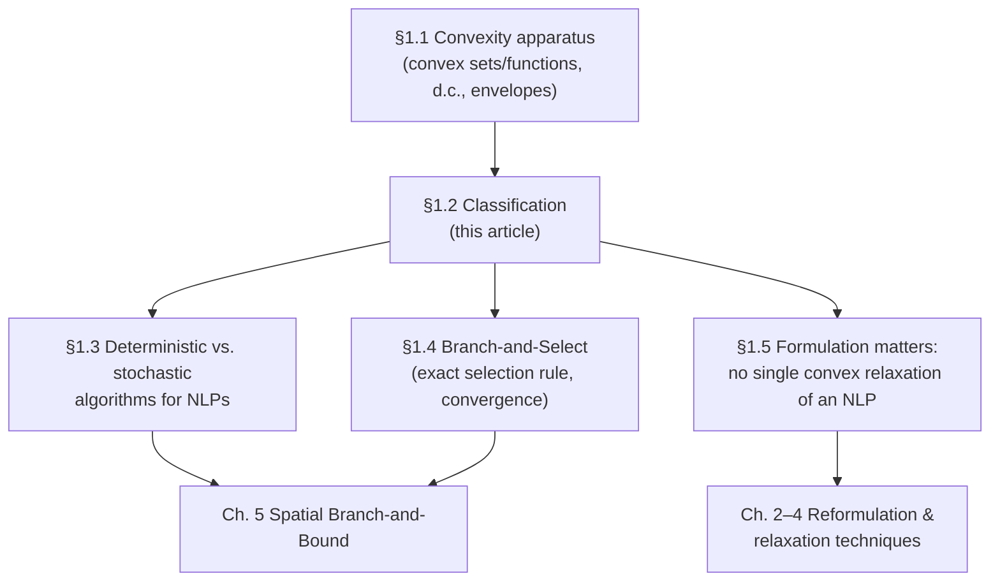

[[book-guidelines|↩ Back to guidelines]]

# Classification of Optimization Problems

## Why bother classifying at all

Before Liberti writes down a single algorithm, he spends §1.2 sorting optimization problems into boxes. That looks like housekeeping, but it isn't — it's the thesis's actual thesis in miniature. The book's central claim (stated later, in §1.5) is that *how you formulate* a nonconvex NLP matters as much as *which algorithm* you throw at it, sometimes more. You can't make that claim precise without a vocabulary for "the same problem, formulated two different ways can land in different classes" — and it's exactly the class a problem lands in that determines which solution technology applies to it at all. A linear program has a polynomial-time algorithm (simplex, interior point). A convex NLP has one too, morally. A general nonconvex NLP does not — it's NP-hard, full stop. So classification isn't decoration on top of the algorithm; it's the thing that tells you whether "solve this to global optimality" is even a tractable ask.

There's a sharper way to say what breaks without this vocabulary: without it, "optimization problem" is a single undifferentiated bucket, and every algorithm looks equally applicable to every problem. In reality, applying a local NLP solver (like a KKT-conditions-based interior point method) to a problem in the nonconvex class silently gives you *a* local optimum with zero guarantee it's *the* global one — no error, no warning, just a wrong answer dressed up as a right one. The classification is what tells you, before you run anything, whether that risk is even present.

Liberti's own generic formulation, which every classification axis below refines, is:

$$
\begin{aligned}
\min_{\mathbf{x}} \quad & f(\mathbf{x}) \\
\text{s.t.} \quad & \mathbf{g}^L \le \mathbf{g}(\mathbf{x}) \le \mathbf{g}^U \\
& \mathbf{x}^L \le \mathbf{x} \le \mathbf{x}^U
\end{aligned}
\tag{1.1}
$$

where $\mathbf{x} \in \mathbb{R}^n$ are the decision variables, $f : \mathbb{R}^n \to \mathbb{R}$ is the objective function, $\mathbf{g} : \mathbb{R}^n \to \mathbb{R}^m$ are the constraint functions, and $\mathbf{g}^L, \mathbf{g}^U, \mathbf{x}^L, \mathbf{x}^U$ are (component-wise) lower and upper bounds. (Liberti notes this two-sided-inequality form is slightly nonstandard — most of the literature writes $\mathbf{g}(\mathbf{x}) \le \mathbf{0}$ — but it's more compact to represent in software, which is a design choice that already foreshadows the thesis's software chapter, $\mathcal{OS}$.) Every classification axis in §1.2 is really a question about which piece of $(1.1)$ — the domain of $\mathbf{x}$, the shape of $\mathbf{g}$, the shape of $f$, or the notion of "solution" itself — gets restricted or generalized.

## Axis 1: what kind of decisions — continuous, integer, mixed-integer

The first axis asks: what does the feasible set $X$ (informally, "the space $\mathbf{x}$ ranges over before constraints are applied") actually look like as a set?

- **Continuous optimization** — $X$ is a subset of a Euclidean space $\mathbb{R}^n$. Decisions are real-valued: a flow rate, a temperature, a mole fraction.
- **Integer optimization** — $X$ is finite or countable. Decisions are discrete: how many units to build, which route to take, on/off switches encoded as $\{0,1\}$.
- **Mixed-integer optimization** — $X = Y \times Z$ where $Y \subseteq \mathbb{R}^n$ is continuous and $Z$ is finite or countable. Most real engineering design problems are mixed: you're choosing both *which* equipment to install (discrete) and *how* to operate it (continuous) — this is exactly the MINLP class that $\mathcal{OS}$ (Chapter 5) is built to handle.

**What breaks without this distinction:** the algorithmic toolkits for these three are almost disjoint. Continuous problems admit gradient-based local search (Newton-type methods) because the feasible set is locally smooth — you can ask "which direction decreases $f$" and get a meaningful answer. Integer problems have no such local structure: there's no gradient on $\{0,1\}^n$, so you're forced into combinatorial enumeration (Branch-and-Bound is the classic answer). Mixed-integer problems need *both* machineries stitched together, which is precisely why spatial Branch-and-Bound (the subject of Chapter 5) has to branch on discrete variables combinatorially while calling a continuous NLP solver as a subroutine at each node.

```rust
// A crude typestate-flavored sketch of the three domain shapes.
// The point isn't the arithmetic — it's that the *type* of the
// decision variable determines which solver interface applies.
enum Domain {
    Continuous { lower: f64, upper: f64 },
    Integer(Vec<i64>),              // finite/countable set, enumerated
    Mixed(Vec<Domain>),             // heterogeneous product
}

impl Domain {
    fn admits_gradient_search(&self) -> bool {
        matches!(self, Domain::Continuous { .. })
    }
}
```

## Axis 2: what the objective and constraints look like

This axis has several sub-cuts, and they compose — a problem is simultaneously "constrained *and* linear *and* convex," for instance.

**Constrained vs. unconstrained.** A problem is constrained if the feasible region is carved out by an explicit constraint set $\mathbf{g}$; it's unconstrained if that set is empty. (Liberti flags a common looseness in the literature: a problem with only variable-range bounds $\mathbf{x}^L \le \mathbf{x} \le \mathbf{x}^U$ — a *box*-constrained problem — is often informally still called "unconstrained," because box constraints are cheap to handle and don't need the general machinery that general constraints do.)

**Linear vs. nonlinear.** Linear if both $f$ and every component of $\mathbf{g}$ are linear functions of $\mathbf{x}$; nonlinear otherwise. This is the sharpest tractability line in the whole taxonomy: linear programs (LPs) solve in polynomial time via simplex or interior-point methods, full stop, no caveats about local vs. global. The instant you allow one nonlinear term — one product of two variables, one square — you've stepped outside that guarantee.

**Convex, concave, d.c., nonconvex.** This sub-cut is the one that actually decides tractability *within* the nonlinear world, and it's where §1.1's definitions (convex sets, convex functions, d.c. functions — see the companion article on convexity for the full apparatus) get put to use:

- *Convex optimization*: $f$ is a convex function and the feasible region is a convex set. (A problem with convex constraints — meaning $\mathbf{g}$ satisfies the appropriate convexity/concavity direction relative to each inequality — automatically lands here.)
- *Concave optimization*: $f$ is concave (the constraints are usually, but not always, convex).
- *D.c. optimization*: $f$ is a difference-of-convex function and the feasible region is a d.c. set.
- *Nonconvex optimization*: $f$ and/or the constraints may be arbitrary — no structural guarantee at all.

Convex optimization is the good case: every local optimum is automatically global (a fact you get almost for free from the definitions, and it's the single most important fact in the entire book, because it's exactly what a convex *relaxation* of a nonconvex problem tries to borrow). Concave minimization is a specific kind of hard — the global minimum of a concave function over a polytope is always at a vertex, which sounds combinatorial because it is. D.c. and general nonconvex problems can have exponentially many local optima that are not global, and telling them apart requires exactly the global-search machinery (Branch-and-Select, Chapters 1.4 and 5) the rest of the thesis builds.

```python
# A tiny, deliberately naive illustration of *why* convexity matters
# operationally: local search finds the global optimum on a convex
# problem regardless of starting point, but gets stuck on a nonconvex one.
import random

def local_descent(f, grad_f, x0, step=0.01, iters=200):
    x = x0
    for _ in range(iters):
        x -= step * grad_f(x)
    return x, f(x)

# Convex: f(x) = x^2 -- any starting point converges to the same x* = 0.
convex_f      = lambda x: x**2
convex_grad   = lambda x: 2*x

# Nonconvex: f(x) = x^4 - 3x^2 -- two symmetric local (=global) minima
# plus a local *maximum* at 0; different starts land in different basins.
nonconvex_f    = lambda x: x**4 - 3*x**2
nonconvex_grad = lambda x: 4*x**3 - 6*x

for x0 in (-3.0, -0.1, 0.1, 3.0):
    print(x0, "->", local_descent(nonconvex_f, nonconvex_grad, x0))
# Different x0 land in different basins: local search alone cannot
# certify which of the two minima (if either found) is *global*.
```

## Axis 3: what "solved" means — local vs. global optimality

The last axis isn't about the problem's shape at all — it's about the *solution concept* being demanded, and it's the one the whole thesis is really about.

- **Local optimization.** $\mathbf{x}^*$ is a local minimizer with respect to some neighborhood $N$ (nearly always a topological neighborhood of $\mathbf{x}^*$) if $f(\mathbf{x}^*) \le f(\mathbf{x})$ for all $\mathbf{x} \in N$. It only has to beat its immediate neighbors.
- **Global optimization.** $\mathbf{x}^*$ is a global minimizer if $f(\mathbf{x}^*) \le f(\mathbf{x})$ for *all* feasible $\mathbf{x}$ — it has to beat every competitor, not just nearby ones.

On a convex problem these two notions coincide, which is why convex optimization gets treated almost as a solved problem in practice. On a general nonconvex problem they can differ arbitrarily — and there is no way to certify you've found the global optimum by local information alone (gradient, Hessian) no matter how much of it you gather at a single point. Certifying global optimality *requires* some form of exhaustive — but structured — search over the whole feasible region, which is exactly what Branch-and-Select algorithms (§1.4) exist to do: they don't just search, they maintain a provable *bound* on how far the best point found so far can be from the true global optimum, shrinking that bound to zero (or to within $\varepsilon$) as the search proceeds.

## The payoff: NLPs as the central problem class

Liberti closes §1.2 by naming the class the rest of the thesis lives in: **nonlinear programs (NLPs)**, defined as the intersection of *global* + *constrained* + *nonlinear* optimization. Every other combination of the axes above is either a special case that's already well-understood (LP: linear + convex trivially; convex NLP: tractable via local methods since local = global) or reduces to this one (integer and mixed-integer problems are handled, in the spatial-Branch-and-Bound tradition this thesis follows, by continuous relaxation plus branching — so the continuous NLP subproblem is still the computational core). NLP-in-the-general-nonconvex-sense is the class where none of the easy outs apply: no polynomial algorithm, no local-implies-global shortcut, and (as §1.3.3, just past this section, states directly) local optimization of a nonconvex problem is already NP-hard, so global optimization of the same class inherits that hardness for free.

## A worked classification, end to end

Concretely: consider $\min x_1 x_2$ subject to $x_1 + x_2 \le 4$, $0 \le x_1, x_2 \le 3$, with $x_1, x_2 \in \mathbb{R}$.

- **Axis 1:** continuous (both variables real-valued).
- **Axis 2:** constrained (a nontrivial linear inequality plus box bounds); nonlinear (the objective $x_1 x_2$ is bilinear, not linear); **not** convex — $x_1 x_2$ is indefinite (its Hessian $\begin{pmatrix}0&1\\1&0\end{pmatrix}$ has eigenvalues $\pm 1$, one of each sign), so it's neither convex nor concave on its own, though it *is* d.c. (any smooth function locally is, and here $x_1x_2 = \tfrac14\big[(x_1+x_2)^2 - (x_1-x_2)^2\big]$ exhibits the difference-of-convex-functions structure explicitly).
- **Axis 3:** asking for the global minimum (not just a stationary point) makes it a genuine target for global search — and indeed this exact bilinear-term shape, when it multiplies extensive and intensive quantities in a conservation law (flow rate × concentration, say), is the running example that motivates Chapters 3 and 7 of the thesis.

So: it's an NLP (continuous, constrained, nonlinear, nonconvex) — precisely the class Liberti's machinery targets, and its bilinear term is exactly the kind of nonconvexity a McCormick-envelope convex relaxation (Chapter 2 onward) is built to underestimate.

## Where this leads



The classification in §1.2 is the pivot the rest of Chapter 1 turns on: §1.3's algorithm survey is organized by which of these classes each historical method could actually handle (Interval Optimization and Branch-and-Reduce were the first to tackle generic nonconvex NLPs in the form of $(1.1)$); §1.4's Branch-and-Select framework is the general recipe for solving the *global + nonconvex* case exactly (up to $\varepsilon$); and §1.5's key observation — that, unlike an MILP's essentially unique LP relaxation, a nonconvex NLP has *no single* convex relaxation — only makes sense once you've fixed what "nonconvex NLP" means, which is exactly this section's job.

There's also a point of contact with abstract-interpretation and constraint-solving work more broadly, worth flagging even though this thesis doesn't use that vocabulary: the axis-3 distinction (local vs. global optimality) is a close cousin of the distinction between *proving the absence* of counterexamples (needs global/exhaustive reasoning — over-approximation, exactly like Branch-and-Select's fathoming step rejecting regions that provably cannot contain the optimum) and *finding one concrete example* (a local/existential search suffices, exactly like a local NLP solver finding *a* stationary point). A CSP or SMT-style solver hunting for a counterexample to a non-linear numeric invariant is, structurally, doing local/existential search over a nonconvex feasible region; a soundness proof for the same invariant needs the global/universal certificate — the same asymmetry Liberti draws here between "found a local optimum" and "proved it's global."
