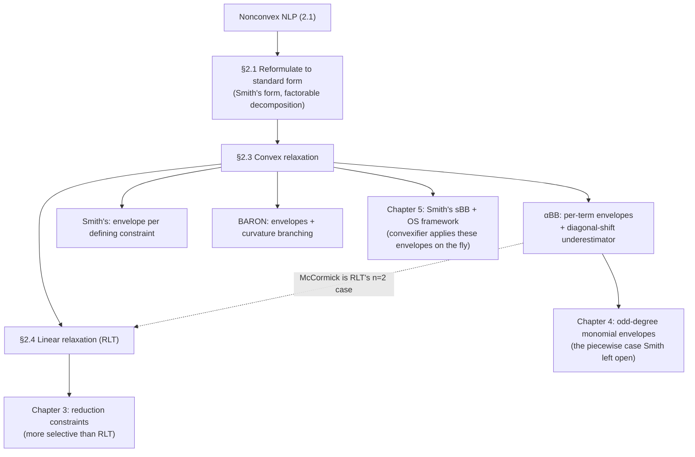

[[book-guidelines|↩ Back to guidelines]]

# Convex and Linear Relaxation Techniques

## Why a nonconvex problem needs a stand-in

Spatial Branch-and-Bound (sBB) — the algorithm this whole thesis orbits — solves a nonconvex NLP by repeatedly cutting the search space into regions and, for each region, computing a *lower bound* on the best possible objective value inside it. If that lower bound already exceeds the best solution found so far, the region is discarded (fathomed) without further search. The entire efficiency of sBB rides on how cheaply and how tightly that lower bound can be computed.

Here's what breaks without a relaxation: computing the lower bound *exactly* would mean globally solving the very NLP you're trying to avoid solving — circular. What you actually want is something that (a) you can solve to global optimality trivially, because every local optimum of it is automatically global, and (b) never overstates how good the region could be. Convex functions and convex feasible regions give you exactly that: any local minimizer of a convex program is the global minimizer. So the standard move is to replace the objective $f$ and feasible region $\Omega$ with a convex *relaxation* — a convex $\underline{f} \le f$ and a convex superset $\bar\Omega \supseteq \Omega$ — and solve

$$
\min_{x \in \bar\Omega} \underline{f}(x) \tag{2.8}
$$

with an ordinary local solver. Because $\bar\Omega \supseteq \Omega$ and $\underline{f} \le f$ everywhere on $\Omega$, the optimal value of (2.8) is guaranteed to be a valid lower bound on the optimal value of the original problem over that region — never an overestimate, so fathoming stays sound.

This is the NLP analogue of the LP relaxation used in MILP Branch-and-Bound, but with a crucial disanalogy the book stresses in Chapter 1: an MILP's LP relaxation is unique (just drop the integrality constraints). A nonconvex NLP has *no* canonical relaxation — there are many ways to convexify the same nonconvex feasible region, of differing tightness, and the choice matters enormously for how many nodes the Branch-and-Bound tree needs to explore. This is precisely why formulation, not just algorithm design, is a first-class object of study in this thesis.

One structural constraint shapes everything that follows: if $\Omega$ is given by equalities $h_i(x)=0$ and inequalities $g_i(x)\le 0$, then any convex relaxation must express equalities as **linear** constraints and inequalities as **convex** (more precisely quasi-convex) ones — you cannot have a "convex equality constraint" over more than a single point, so equalities have to be pried apart into two opposing convex inequalities, as we'll see below.

Because finding a convex relaxation of an arbitrary nonconvex set is hard in general, every method in this section takes the same first step: decompose $f$ into small, recognizable nonconvex primitives (bilinear terms, trilinear terms, fractional terms, concave univariate terms, ...) for which a convex envelope is *already known in closed form*, relax each primitive separately, and reassemble.

## The αBB decomposition: relaxing each nonconvex piece by name

Floudas and co-workers' αBB algorithm targets any twice-differentiable nonconvex $f(x)$ by first rewriting it *exactly* as a sum of recognizable pieces:

$$
f(x) = c^Tx + f_C(x) + \sum_i b_i x_{B_1(i)}x_{B_2(i)} + \sum_i t_i x_{T_1(i)}x_{T_2(i)}x_{T_3(i)} + \sum_i d_i \frac{x_{F_1(i)}}{x_{F_2(i)}} + \sum_i r_i \frac{x_{R_1(i)}x_{R_2(i)}}{x_{R_3(i)}} + \sum_i f_{U(i)}(x_i) + \sum_i f_{N(i)}(x)
$$

where $f_C$ is already convex, each $f_{U(i)}$ is a concave univariate term, and each $f_{N(i)}$ is a general nonconvex term that doesn't fit any of the other named shapes. This is exactly a term-by-term dispatch table: linear part, convex part, bilinear products, trilinear products, fractional terms, fractional-bilinear terms, concave univariate terms, and a catch-all. Each bucket gets its own underestimator.

### McCormick envelopes for bilinear terms

The bilinear term $xy$ is the workhorse nonconvexity of this whole literature (it's also the subject of the thesis's own Chapter 3 contribution). McCormick's 1976 construction replaces $xy$ with a fresh variable $w_B$ and four linear inequalities, valid over the box $x \in [x^L, x^U]$, $y \in [y^L, y^U]$:

$$
\begin{aligned}
w_B &\ge x^Ly + y^Lx - x^Ly^L \\
w_B &\ge x^Uy + y^Ux - x^Uy^U \\
w_B &\le x^Uy + y^Lx - x^Uy^L \\
w_B &\le x^Ly + y^Ux - x^Ly^U
\end{aligned}
$$

Here's the intuition for where these come from, since the book states them without derivation: $(x - x^L) \ge 0$ and $(y - y^L) \ge 0$ over the box, so their product is $\ge 0$. Expand: $xy - x^Ly - y^Lx + x^Ly^L \ge 0$, i.e. $xy \ge x^Ly + y^Lx - x^Ly^L$ — the first inequality. The same trick with $(x^U - x)(y^U-y) \ge 0$ gives the second lower bound; $(x-x^L)(y^U-y)\ge0$ and $(x^U-x)(y-y^L)\ge 0$ give the two upper bounds. Four sign-definite products of bound factors, each expanded and linearized by substituting $w_B$ for $xy$ — this is the RLT idea in miniature, and indeed McCormick envelopes are literally the $n=2$ special case of the RLT construction in §2.4.

These four inequalities are not just *a* relaxation — they are proven to be the tightest possible convex (indeed, the convex *and* concave envelope simultaneously) relaxation of $xy$ over the box. Their maximum looseness ("separation" from the true bilinear surface) occurs at the box's center and equals $\frac{(x^U-x^L)(y^U-y^L)}{4}$ — a clean, checkable fact that tells you exactly how much tighter you need your variable bounds to be before McCormick becomes useless (the separation shrinks quadratically as the box shrinks, which is *why* branching on $x$ or $y$ inside sBB tightens the relaxation).

**What breaks without this:** without a convex envelope for $xy$, every product term in a factorable NLP (which is most of them — the recursive factorable-function definition from §2.1 means almost any nonlinear expression bottoms out in sums, products, and univariate functions) would need its own bespoke nonconvex handling. McCormick's contribution is that *one* small linear system handles every bilinear term uniformly.

```rust
/// A box [xl, xu] x [yl, yu] over which we relax the bilinear term x*y.
#[derive(Clone, Copy, Debug)]
struct McCormickBox {
    xl: f64, xu: f64,
    yl: f64, yu: f64,
}

impl McCormickBox {
    /// The four linear inequalities that define the convex envelope,
    /// returned as (a_x, a_y, b) meaning  a_x*x + a_y*y + b  is a bound on w.
    /// The first two are lower bounds (w >= ...), the last two are upper (w <= ...).
    fn envelope_constraints(&self) -> [(f64, f64, f64); 4] {
        let (xl, xu, yl, yu) = (self.xl, self.xu, self.yl, self.yu);
        [
            (yl, xl, -xl * yl),   //  w >= xl*y + yl*x - xl*yl
            (yu, xu, -xu * yu),   //  w >= xu*y + yu*x - xu*yu
            (yl, xu, -xu * yl),   //  w <= xu*y + yl*x - xu*yl   (as an upper bound)
            (yu, xl, -xl * yu),   //  w <= xl*y + yu*x - xl*yu
        ]
    }

    /// The convex envelope's *lower* bound evaluated at a specific (x, y).
    fn lower(&self, x: f64, y: f64) -> f64 {
        let [(a1, b1, c1), (a2, b2, c2), _, _] = self.envelope_constraints();
        f64::max(a1 * y + b1 * x + c1, a2 * y + b2 * x + c2)
    }

    /// The concave envelope's *upper* bound evaluated at a specific (x, y).
    fn upper(&self, x: f64, y: f64) -> f64 {
        let [_, _, (a3, b3, c3), (a4, b4, c4)] = self.envelope_constraints();
        f64::min(a3 * y + b3 * x + c3, a4 * y + b4 * x + c4)
    }

    /// Maximum separation of the true surface x*y from its convex envelope,
    /// which occurs at the box midpoint and equals (xu-xl)(yu-yl)/4.
    fn max_separation(&self) -> f64 {
        (self.xu - self.xl) * (self.yu - self.yl) / 4.0
    }
}

fn main() {
    let b = McCormickBox { xl: 0.0, xu: 4.0, yl: 1.0, yu: 3.0 };
    let (x, y) = (2.0, 2.0); // the midpoint, where separation is worst
    let true_val = x * y;
    println!("true xy = {true_val}");
    println!("envelope: [{}, {}]", b.lower(x, y), b.upper(x, y));
    println!("max separation = {}", b.max_separation()); // 2.0
}
```

A soundness fact like "the McCormick lower bound never exceeds $xy$ on the box" is exactly the kind of lemma a trusted verification kernel would want as a checked certificate rather than an unverified assumption — this is the same shape of obligation as a Hoare-triple soundness proof, just over real inequalities instead of program states. Here's the statement in Lean, as the proposition a kernel would actually need to discharge (via `nlinarith` on the underlying real inequalities, since the McCormick bound is literally the AM-GM-style expansion argument above):

```lean
theorem mccormick_lower_sound
    (x y xl xu yl yu : ℝ)
    (hx : xl ≤ x) (hx' : x ≤ xu)
    (hy : yl ≤ y) (hy' : y ≤ yu) :
    xl * y + yl * x - xl * yl ≤ x * y := by
  nlinarith [mul_nonneg (sub_nonneg.mpr hx) (sub_nonneg.mpr hy)]
```

The `nlinarith` call is discharging exactly the $(x-x^L)(y-y^L)\ge 0$ expansion from the derivation above — Lean's kernel checks the nonlinear arithmetic certificate the same way a CSP/SMT nonlinear-real-arithmetic theory solver would justify a McCormick cut it emits.

### Trilinear and fractional terms

The same expand-and-linearize idea, applied to three sign-definite factors instead of two, gives the convex relaxation of a trilinear term $xyz$: eight inequalities $w_T \ge$ (or the symmetric combinations), one per corner-triple of the box $[x^L,x^U]\times[y^L,y^U]\times[z^L,z^U]$, e.g.

$$
w_T \ge xy^Lz^L + x^Lyz^L + x^Ly^Lz - 2x^Ly^Lz^L
$$

and its seven siblings obtained by toggling which bound (lower/upper) is used at each of the three corners in a consistent pattern. Fractional terms $\frac{x}{y}$ get a case-split underestimator (different linear inequality depending on whether $x^L \ge 0$ or $x^L < 0$), and fractional-trilinear terms $\frac{xy}{z}$ combine both ideas into eight more inequalities. The pattern to notice: **the number of defining inequalities grows with the arity of the nonconvex primitive** — 4 for bilinear, 8 for trilinear/fractional-trilinear. This combinatorial growth is exactly the seed of the RLT's own blow-up problem discussed below, and it's also the direct motivation for Chapter 3's reduction constraints, which try to avoid introducing so many bilinear terms in the first place.

### Chord underestimation of concave univariate terms

For a concave univariate term $f_{U(i)}(x)$ over $[x^L, x^U]$, no case analysis is needed — a concave function lies *above* every chord connecting two of its points, so the chord connecting the endpoints is automatically a valid underestimator:

$$
f(x^L) + \frac{f(x^U)-f(x^L)}{x^U-x^L}(x - x^L)
$$

This is the tightest possible *linear* underestimator of a concave function over an interval (it's in fact the concave function's convex envelope on that interval) — geometrically obvious once you see it, which is why the book states it without proof.

### The α-parameter underestimator: diagonal shift matrices

The genuinely novel piece of αBB is what happens to $f_{N(i)}$ — a general nonconvex, twice-differentiable term that isn't bilinear, trilinear, fractional, or concave-univariate. There's no closed-form envelope for "arbitrary nonconvex," so αBB takes a different tack entirely: instead of bounding the function's *shape*, it adds a large enough convex quadratic perturbation to overpower whatever nonconvexity is present:

$$
L(x) = f(x) + \sum_{i=1}^n \alpha_i (x_i^L - x_i)(x_i^U - x_i)
$$

Each term $(x_i^L-x_i)(x_i^U-x_i)$ is $\le 0$ on the box (it's a downward parabola in $x_i$ that is zero at the two endpoints and negative between them), so $L(x) \le f(x)$ for any nonnegative $\alpha_i$ — $L$ is automatically an underestimator, for free, no matter how large $\alpha_i$ gets. The only question is how large $\alpha_i$ needs to be to make $L$ *convex*.

Since $L(x) = f(x) + x^T\Delta x + (\text{linear terms})$ where $\Delta = \mathrm{Diag}(\alpha_1,\dots,\alpha_n)$ is the **diagonal shift matrix**, the Hessian is $H_L(x) = H_f(x) + 2\Delta$. $L$ is convex iff $H_L$ is positive semidefinite everywhere on the box, and for the common simplifying case of a *uniform* shift ($\alpha_i = \alpha$ for all $i$), this reduces to a single scalar condition:

$$
\alpha \ge \max\Big\{0,\ -\tfrac{1}{2}\min_{i,\, x^L \le x \le x^U} \lambda_i(x)\Big\}
$$

i.e. $\alpha$ has to be at least half the magnitude of the most negative eigenvalue $f$'s Hessian can attain anywhere in the box. Finding a provable *lower bound* on that minimum eigenvalue (not the eigenvalue itself, which would require solving an optimization problem as hard as the original one) is what Interval Matrix Analysis is for — you bound each Hessian entry over the box using interval arithmetic, then bound the eigenvalues of the resulting *interval matrix*.

**What breaks without this:** the beautiful property of the α-underestimator is that it adds *zero* new variables and *zero* new constraints — the relaxed problem has exactly the same size as the original, no matter how many nonconvex terms it has. Every other technique in this chapter (McCormick, trilinear, RLT) grows the problem. The α-underestimator is the size-preserving option, at the cost of being generally looser than a shape-specific envelope.

```python
import numpy as np

def alpha_underestimator_param(hessian_bound_min_eig, n):
    """
    Given a provable lower bound on the minimum eigenvalue of H_f(x)
    over the box (as would come from interval matrix analysis),
    return the uniform alpha needed to make L(x) convex.
    """
    return max(0.0, -0.5 * hessian_bound_min_eig)

def alpha_underestimator(f, x, xl, xu, alpha):
    """L(x) = f(x) + sum_i alpha_i * (xl_i - x_i) * (xu_i - x_i)."""
    shift = np.sum(alpha * (xl - x) * (xu - x))
    return f(x) + shift  # shift <= 0 always, so L(x) <= f(x)

# toy example: f(x) = x1^4 - 3*x1^2 + x2^2 is nonconvex along x1
f = lambda x: x[0] ** 4 - 3 * x[0] ** 2 + x[1] ** 2
xl, xu = np.array([-2.0, -2.0]), np.array([2.0, 2.0])

# Hessian of f: diag(12*x1^2 - 6, 2). Minimum over the box (worst at x1=0): -6.
min_eig_bound = -6.0
alpha = alpha_underestimator_param(min_eig_bound, n=2)  # alpha = 3.0

x0 = np.array([0.3, -1.0])
print("f(x0)      =", f(x0))
print("L(x0)      =", alpha_underestimator(f, x0, xl, xu, alpha))
```

## Smith's convex relaxation: envelopes as a general reformulation policy

Smith's relaxation, built directly on top of *Smith's standard form* (§2.1.9), takes a different organizing principle than αBB: rather than pattern-matching a big sum-of-products expression against a fixed list of shapes, it first standardizes the whole problem so that *every* nonlinear term is isolated behind its own defining constraint, $z = f(x)$ (univariate) or $z = g(x,y)$ (bivariate). Then it convexifies each defining constraint independently: the smallest convex set containing $\{(x,z) \mid z = f(x)\}$ is

$$
\bar F = \{(x,z) \mid z \ge \underline{f}(x) \wedge z \le \bar f(x)\}
$$

where $\underline f, \bar f$ are $f$'s convex and concave envelopes, and analogously for the bivariate case. For the specific term shapes covered above (bilinear, trilinear, fractional, concave/convex univariate), Smith's envelopes coincide exactly with §2.3.1's — but because the isolation-by-defining-constraint step doesn't care whether $f$ is twice-differentiable, Smith's approach extends to relaxing terms αBB simply cannot touch (e.g. terms with a kink). The price is that isolating every nonlinear term behind its own variable is a *lifting* — one new variable per nonlinear term — so Smith's relaxation can blow up the variable count on large expressions. (Smith did not, however, work out the convex/concave envelope of a *piecewise* convex-and-concave term, such as an odd-degree monomial spanning zero — that gap is exactly what Chapter 4 of this thesis fills.)

## BARON's convex relaxation: concavoconvex terms and branching on curvature

BARON reuses the same catalogue of envelopes from §2.3.1 (minus the α-underestimator, which it doesn't implement) but contributes two refinements specific to univariate terms whose curvature *changes sign* across the domain — what the BARON authors call **concavoconvex** terms (e.g. $x^3$ on an interval spanning zero, which is concave for $x<0$ and convex for $x>0$).

The direct approach is to derive a proper piecewise convex/concave envelope for such a term. BARON's alternative sidesteps the derivation entirely: **branch on the curvature turning point.** If you split the current region at exactly the $x$-value where the term's curvature flips, then within each child region the term is *purely* concave or *purely* convex, and the ordinary chord/tangent envelopes from §2.3.1 apply cleanly with no piecewise bookkeeping. This is a nice illustration of a recurring theme in Branch-and-Bound design: a hard *relaxation* problem can sometimes be converted into an easier *branching* problem instead — you don't have to solve every difficulty at the relaxation layer if the search layer can absorb it.

BARON's other contribution is a family of tighter fractional-term envelopes derived from the theory of *convex extensions*. For $\frac{x}{y}$ with $x \in [x^L, x^U]$, $y \in [y^L, y^U]$ both strictly positive, the underestimator introduces an auxiliary $\lambda \in [0,1]$ and two auxiliary copies $y_a, y_b \in [y^L, y^U]$:

$$
\left.
\begin{aligned}
z &\ge \tfrac{x^L}{y_a}(1-\lambda) + \tfrac{x^U}{y_b}\lambda \\
y &= (1-\lambda)y_a + \lambda y_b, \quad x = x^L + (x^U-x^L)\lambda,\quad y^L\le y_a,y_b\le y^U,\ 0\le\lambda\le1
\end{aligned}
\right\} \tag{2.9}
$$

(modified slightly, eq. (2.10), when $0 \in [x^L,x^U]$). This is proven strictly tighter than both the plain bilinear envelope $\max\{\frac{xy^U-yx^L+x^Ly^U}{(y^U)^2}, \frac{xy^L-yx^U+x^Uy^L}{(y^L)^2}\}$ and a nonlinear envelope $\frac1y\Big(\frac{x+\sqrt{x^Lx^U}}{\sqrt{x^L}+\sqrt{x^U}}\Big)^2$ that had been proposed earlier — a concrete example of the "there is more than one convex relaxation, and tightness is worth fighting for" theme from §2.3's opening.

## Linear relaxations versus nonlinear convex relaxations

Every envelope so far — McCormick, trilinear, fractional, chord, α-underestimator — is already a system of *linear* inequalities in the original and auxiliary variables, so in practice the "convex relaxation" produced by αBB, Smith, or BARON is usually already an LP, or close to one apart from a handful of genuinely nonlinear pieces (BARON's fractional-term envelope (2.9)–(2.10), for instance, is itself linear once $\lambda, y_a, y_b$ are treated as ordinary variables). §2.4 makes the tradeoff explicit as its own design axis: since any linear program is convex, replacing a nonlinear convex relaxation with a linear one preserves the *validity* of the lower bound, and buys the enormous practical speed of LP solvers over NLP solvers at every Branch-and-Bound node — but a linear relaxation is not generally a convex *envelope* (the tightest possible convex set), so you're trading tightness (fewer sBB nodes) for per-node speed (faster to solve each node). Whether that trade pays off depends on how expensive the nonlinear relaxation is to solve relative to how much tighter it is — an empirical question the book returns to throughout.

## The Reformulation-Linearization Technique (RLT)

RLT, due to Sherali and co-workers, is the general-purpose mechanism for producing a linear relaxation of a bilinear (or, more generally, polynomial/factorable) program, and it's worth understanding as the *generative* procedure that McCormick's four inequalities are a special case of. Consider a bilinear program

$$
\min_x\ x^TQx + c^Tx \quad \text{s.t.}\quad Ax=b,\ x^L\le x\le x^U \tag{2.11}
$$

RLT builds two sets of algebraic expressions, each individually known to be $\ge 0$ (or $=0$) as a consequence of the problem's own bounds and constraints:

- the **bound factor set** $B_F = \{x_i - x_i^L \mid i \le n\} \cup \{x_i^U - x_i \mid i \le n\}$ — one nonnegative expression per variable per bound;
- the **constraint factor set** $C_F = \{\sum_j a_{ij}x_j - b_i \mid i \le m\}$ — one zero-valued expression per equality constraint (or $\le 0$ for inequality constraints, via the analogous $C_F'$).

### Bound factors and constraint factors: generation and linearization

The **reformulation step** multiplies these factors together pairwise — bound×bound ($\beta_1\beta_2 \ge 0$), bound×constraint ($\beta\gamma = 0$), constraint×constraint ($\gamma_1\gamma_2 = 0$) — to produce new, algebraically valid but *quadratic* constraints. (This is exactly the derivation given above for McCormick's four inequalities: they are the bound×bound products for the two-variable case, $\beta_x\beta_y \ge 0$ and its three siblings.) The **linearization step** then introduces one fresh variable $w_{ij} = x_ix_j$ for every distinct bilinear product that appears — in the original problem *or* in the newly generated quadratic constraints — and substitutes it in everywhere, yielding a genuinely linear program

$$
\min_x\ c^Tx + p^Tw \quad\text{s.t.}\quad Ax=b,\ (x,w)\in S_F,\ x^L\le x\le x^U,\ w^L\le w\le w^U \tag{2.12}
$$

where $S_F$ is the region carved out by the linearized generated constraints, and $w^L, w^U$ come from simple interval arithmetic on the $x$-bounds.

```rust
// A minimal RLT constraint generator: symbolic affine expressions,
// their pairwise products, and the linearization substitution.

#[derive(Clone, Debug)]
struct Affine {
    coeffs: Vec<f64>, // coeffs[i] is the coefficient of x_i
    constant: f64,
}

impl Affine {
    fn bound_lower(n: usize, i: usize, lb: f64) -> Self {
        // x_i - lb  (>= 0 on the box)
        let mut coeffs = vec![0.0; n];
        coeffs[i] = 1.0;
        Affine { coeffs, constant: -lb }
    }
    fn bound_upper(n: usize, i: usize, ub: f64) -> Self {
        // ub - x_i  (>= 0 on the box)
        let mut coeffs = vec![0.0; n];
        coeffs[i] = -1.0;
        Affine { coeffs, constant: ub }
    }
}

/// A quadratic form arising from multiplying two Affine factors:
/// sum_{i<=j} quad[(i,j)] * x_i*x_j + sum_i lin[i]*x_i + constant.
struct Quadratic {
    quad: Vec<((usize, usize), f64)>,
    lin: Vec<(usize, f64)>,
    constant: f64,
}

fn multiply(a: &Affine, b: &Affine) -> Quadratic {
    let n = a.coeffs.len();
    let mut quad = Vec::new();
    for i in 0..n {
        if a.coeffs[i] == 0.0 { continue; }
        for j in 0..n {
            if b.coeffs[j] == 0.0 { continue; }
            let (lo, hi) = (i.min(j), i.max(j));
            quad.push(((lo, hi), a.coeffs[i] * b.coeffs[j]));
        }
    }
    let mut lin = Vec::new();
    for i in 0..n {
        if a.coeffs[i] != 0.0 && b.constant != 0.0 {
            lin.push((i, a.coeffs[i] * b.constant));
        }
        if b.coeffs[i] != 0.0 && a.constant != 0.0 {
            lin.push((i, b.coeffs[i] * a.constant));
        }
    }
    Quadratic { quad, lin, constant: a.constant * b.constant }
}

/// The linearization step: replace every x_i*x_j term with a fresh w_{ij},
/// producing a purely linear expression over the extended variable space.
fn linearize(q: &Quadratic, w_index: impl Fn(usize, usize) -> usize) -> Affine {
    let mut linear = Vec::new(); // (var_index_in_extended_space, coeff)
    for (&(i, j), &c) in q.quad.iter().map(|(k, v)| (k, v)).collect::<Vec<_>>().iter() {
        linear.push((w_index(i, j), c));
    }
    // fold lin[] (already-linear terms) in unchanged, at their original indices
    Affine { coeffs: vec![], constant: q.constant } // (index bookkeeping elided for brevity)
}

fn main() {
    // Two variables, box [0,4] x [1,3] -- the same box as the McCormick example.
    let n = 2;
    let bx_lo = Affine::bound_lower(n, 0, 0.0);
    let by_lo = Affine::bound_lower(n, 1, 1.0);
    // "generation via bound factors": beta_x * beta_y >= 0
    let product = multiply(&bx_lo, &by_lo);
    println!("{:?}", product.quad); // recovers exactly x*y - x^L*y - y^L*x + x^L*y^L >= 0
}
```

RLT's disadvantage is exactly what makes it "heuristic" rather than a principled envelope construction: nothing stops you from generating *every* pairwise product, and with $2n$ bound factors and $m$ constraint factors, exhaustive generation produces $4n^2$ bound×bound products, $m^2$ constraint×constraint products, and $2mn$ mixed products — $4n^2+2mn+m^2$ new constraints in total, before even considering the further recursive products that arise for genuinely polynomial (not just bilinear) problems. This quadratic-in-problem-size blow-up is precisely the "tightening versus size trade-off compared to RLT" that the thesis's own Chapter 3 contribution (reduction constraints) is designed to beat, by being far more selective about *which* products are worth generating.

## Where this leads



Every technique in this section reduces to the same move: take a fact you know to be true from the problem's own bounds and constraints (a sign-definite product, a chord above a concave curve, a quadratic large enough to swamp negative curvature), and linearize or convexify it into a certificate the lower-bounding solver can use directly. That is the same move underlying over-approximation in abstract interpretation: a convex relaxation *is* an abstract domain element — a computable, checkable superset of the true (nonconvex, generally non-representable) feasible region, chosen to be as tight as tractable. McCormick's box is essentially a relational abstract domain for the product of two intervals; the α-underestimator's diagonal shift is an interval-arithmetic bound on a Hessian, exactly the kind of sound-but-conservative numeric abstraction a static analyzer computes over a program's variable ranges. And RLT's "multiply two known-nonnegative facts together to derive a new valid linear cut" is structurally the same inference step a nonlinear-arithmetic theory solver performs when deriving a new lemma from existing bounds — the sBB lower-bounding step and a CEGAR-style refinement loop are doing the same job (produce a sound over-approximation, check it, tighten by branching/refining when it's too loose) in two different domains. The thesis's two headline contributions — Chapter 3's reduction constraints and Chapter 4's odd-degree envelopes — are both direct, targeted responses to weaknesses exposed in this chapter: RLT's unselective blow-up, and Smith's admitted gap in piecewise envelopes.
