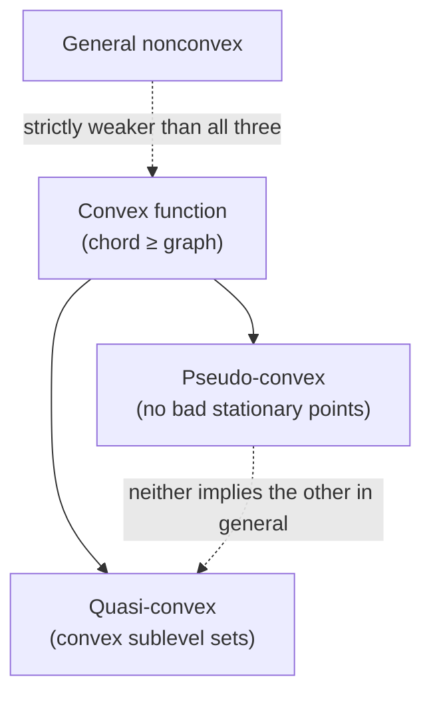

[[book-guidelines|↩ Back to guidelines]]

## Why the thesis needs a vocabulary of "shape" before it needs algorithms

Before you can branch, bound, or relax anything, you need a precise way to talk about the *shape* of the objects an optimization problem is built from — sets and functions. Liberti's whole thesis is an argument that **formulation matters as much as algorithm**: two mathematically equivalent NLPs can have wildly different solve times depending on how "nice" (convex) or "ugly" (nonconvex) their relaxations turn out to be. §1.1 is the ten-minute vocabulary lesson that makes the rest of the thesis legible — every later chapter (relaxations, envelopes, sBB) is just this vocabulary being operationalized.

The underlying problem convexity solves is a *certification* problem. If you hand a solver an arbitrary nonlinear, nonconvex feasible region, local search can get stuck in a local optimum with no way to prove it isn't global — gradient information only tells you about the neighborhood you're standing in. Convexity is the structural property that closes this gap: a convex function's local information (a supporting hyperplane, a gradient) is automatically *global* information. That's the "what breaks without it" — nonconvexity is precisely the loss of the guarantee that local reasoning implies global conclusions. Everything in this note is either (a) a way of formally saying "this object has that guarantee," or (b) a way of manufacturing an approximation that does, when the original object doesn't.

## Convex sets and the convex hull

**Intuition.** A set is convex if it has no "dents" — if you pick any two points inside it and draw the straight line segment between them, that segment never leaves the set. A crescent moon is not convex (some chords poke outside); a disk is.

**Book's definition (§1.1).** $\Omega \subseteq \mathbb{R}^n$ is *convex* if, for all $x, y \in \Omega$ and for all $\lambda \in [0,1]$, the vector $\lambda x + (1-\lambda)y$ is also in $\Omega$. The intersection of an arbitrary collection of convex sets is convex.

That closure-under-intersection fact is what makes the next definition well-posed: given $S \subseteq \mathbb{R}^n$, the *convex hull* of $S$ is the intersection of all convex subsets of $\mathbb{R}^n$ containing $S$ — i.e. the smallest convex set that contains $S$. It exists and is unique precisely because arbitrary intersections of convex sets stay convex (if they didn't, "the intersection of all convex supersets" might not itself be convex, and the definition would be circular).

For a *finite* set $\{v_1, \dots, v_m\} \subset \mathbb{R}^n$, the book gives the hull constructively rather than as an intersection: it's every convex combination
$$
\sum_{i=1}^m \lambda_i v_i, \qquad \lambda_i \ge 0,\ \sum_{i=1}^m \lambda_i = 1.
$$
This constructive form is the one that's actually computable, and it's the one every relaxation technique later in the thesis (McCormick envelopes, RLT, the odd-degree-monomial envelope of Chapter 4) ultimately reduces to: replace a nonconvex feasible region locally by the convex hull of a small set of extreme points.

**What breaks without convexity.** Without it, "the region between two feasible points" isn't guaranteed feasible — cutting planes, linear relaxations, and any argument of the form "interpolate between two known-good solutions" become unsound.

**Grounding — checking and computing convex hulls.**

Convexity of a *set* is usually infeasible to check directly (the definition quantifies over infinitely many point pairs and $\lambda$), so in practice you either (a) work with sets given by a convex *representation* (halfspace intersections, i.e. polyhedra) where convexity is true by construction, or (b) compute the hull of a finite point set, which is a well-studied computational-geometry problem (gift wrapping, QuickHull, etc.).

```rust
// A convex polyhedron represented the way a convex-relaxation / RLT
// engine would want it: an intersection of halfspaces a_i · x <= b_i.
// Convexity here is a representational invariant, not something checked
// at runtime — this is exactly the "convex by construction" idea.
struct Halfspace {
    a: Vec<f64>, // normal vector
    b: f64,
}

struct Polyhedron {
    constraints: Vec<Halfspace>,
}

impl Polyhedron {
    fn contains(&self, x: &[f64]) -> bool {
        self.constraints.iter().all(|h| dot(&h.a, x) <= h.b)
    }
}

fn dot(a: &[f64], b: &[f64]) -> f64 {
    a.iter().zip(b).map(|(ai, bi)| ai * bi).sum()
}

// The book's finite convex-hull characterization, directly executable:
// is `p` a convex combination of the points in `vs`? This is exactly the
// membership test a bounded-relaxation / lifting step needs.
fn in_convex_hull(p: &[f64], vs: &[Vec<f64>]) -> bool {
    // In practice this is solved as an LP feasibility problem:
    // find lambda >= 0, sum(lambda) = 1, sum(lambda_i * v_i) = p.
    // Sketched here as the *statement* of that LP, not a solver.
    todo!("LP feasibility: lambda >= 0, sum lambda = 1, V*lambda = p")
}
```

```python
# Quick illustrative sketch: verifying the convex-combination definition
# on a concrete finite point set, no LP solver needed for small m.
import itertools
import numpy as np

def is_convex_combination(p, vs, tol=1e-9, grid=50):
    # Brute-force search over the simplex of lambdas (fine for small m,
    # illustrative only — real code uses linprog).
    from scipy.optimize import linprog
    V = np.array(vs).T          # n x m
    n, m = V.shape
    A_eq = np.vstack([V, np.ones(m)])
    b_eq = np.append(p, 1.0)
    res = linprog(c=np.zeros(m), A_eq=A_eq, b_eq=b_eq, bounds=(0, None))
    return res.success
```

```lean
-- Lean formalizes the book's definitions almost verbatim as Props, which
-- is the payoff of a set-theoretic definition: it drops straight into a
-- kernel-checkable statement. `Convex` here mirrors the standard-library
-- shape (Mathlib's `Convex` is essentially this).
def IsConvex (Ω : Set (EuclideanSpace ℝ n)) : Prop :=
  ∀ x ∈ Ω, ∀ y ∈ Ω, ∀ lam : ℝ, 0 ≤ lam → lam ≤ 1 →
    lam • x + (1 - lam) • y ∈ Ω

-- The "intersection of convex sets is convex" fact the book states
-- without proof is a one-line structural induction over the definition —
-- exactly the kind of closure property a trusted kernel wants to check
-- once and reuse, the same way a type-soundness lemma gets reused.
theorem convex_inter {ι : Type*} (S : ι → Set (EuclideanSpace ℝ n))
    (h : ∀ i, IsConvex (S i)) : IsConvex (⋂ i, S i) := by
  intro x hx y hy lam h0 h1
  simp only [Set.mem_iInter] at hx hy ⊢
  exact fun i => h i x (hx i) y (hy i) lam h0 h1
```

## Convex and concave functions

**Intuition.** A function is convex if its graph curves "upward" everywhere — the chord connecting any two points on the graph lies on or above the graph. Concretely: mixing two inputs and evaluating is never worse than mixing the two outputs. This is precisely what makes minimization tractable: there's nowhere for a spurious local dip to hide.

**Book's definition.** $f : \mathbb{R}^n \to \mathbb{R}$ is *convex* iff it is defined on a convex set $\Omega$ and, for all $x, y \in \Omega$ and $\lambda \in [0,1]$,
$$
f(\lambda x + (1-\lambda) y) \le \lambda f(x) + (1-\lambda) f(y).
$$
$f$ is *concave* if $-f$ is convex. Notice the definition presupposes $\Omega$ convex — convexity of a function is only meaningful over a convex domain, because the left-hand side needs $\lambda x + (1-\lambda)y \in \Omega$ to be well-defined in the first place. This is the load-bearing dependency of function-convexity on set-convexity from the previous section.

**Grounding — checking convexity computationally.** In general, verifying the inequality for *all* $x,y,\lambda$ is undecidable/intractable for arbitrary $f$; real tools instead certify convexity structurally (sum of convex functions, composition rules, disciplined convex programming à la CVX) or *numerically sample* the inequality as a falsification heuristic — which is the practical, checker-shaped reading of the definition.

```rust
// A numerical convexity *falsifier*: sampling the definition directly.
// This can never prove convexity (finite sampling), only disprove it —
// which is exactly the asymmetry a sound-but-incomplete static checker
// has to live with (same shape as testing vs. verification).
fn convexity_violation<F: Fn(&[f64]) -> f64>(
    f: F,
    x: &[f64],
    y: &[f64],
    lambdas: &[f64],
) -> Option<(f64, f64, f64)> {
    for &lam in lambdas {
        let mid: Vec<f64> = x.iter().zip(y)
            .map(|(xi, yi)| lam * xi + (1.0 - lam) * yi)
            .collect();
        let lhs = f(&mid);
        let rhs = lam * f(x) + (1.0 - lam) * f(y);
        if lhs > rhs + 1e-9 {
            return Some((lhs, rhs, lam)); // witness of nonconvexity
        }
    }
    None
}
```

```lean
-- The Lean statement is the definition, not a checker: convexity is a
-- proof obligation, discharged once and reused, in contrast to Rust's
-- runtime sampling above. This is the same "check vs. certify" split
-- that shows up between abstract interpretation (sound, cheap, partial)
-- and a full proof (complete, expensive, total).
def IsConvexFn (Ω : Set (EuclideanSpace ℝ n)) (f : EuclideanSpace ℝ n → ℝ) : Prop :=
  IsConvex Ω ∧
  ∀ x ∈ Ω, ∀ y ∈ Ω, ∀ lam : ℝ, 0 ≤ lam → lam ≤ 1 →
    f (lam • x + (1 - lam) • y) ≤ lam * f x + (1 - lam) * f y

def IsConcaveFn (Ω : Set (EuclideanSpace ℝ n)) (f : EuclideanSpace ℝ n → ℝ) : Prop :=
  IsConvexFn Ω (fun x => -f x)
```

## Pseudo-convex and quasi-convex functions: two ways to weaken convexity

Convexity is a strong, global condition. The book immediately introduces two weaker notions, each keeping one useful consequence of convexity while dropping the rest — this is the standard move in this literature: name a class exactly as tight as the property you actually need.

**Pseudo-convex.** $f$ is pseudo-convex if for all $x_1, x_2$ with $f(x_1) < f(x_2)$, we have $\nabla f(x_2)(x_1 - x_2) < 0$. In words: whenever one point is strictly better than another, the gradient at the worse point points (has negative inner product) toward the better one. This is the property convexity actually buys you for *first-order local-search algorithms*: it guarantees that "no direction of local improvement" (stationarity, $\nabla f = 0$) implies global optimality, without requiring the full chord inequality. It's the minimal condition under which gradient descent's stopping criterion is trustworthy.

**Quasi-convex.** $f$ is quasi-convex if all its sublevel sets $S_\alpha = \{x \mid f(x) \le \alpha\}$ are convex. This keeps the property that matters for *feasible-region shape*: every "below this cost" region is convex, even if $f$ itself dips and rises in ways a true convex function couldn't. Every convex function is quasi-convex (a convex function's sublevel sets are always convex — a one-line consequence of the chord inequality), but not conversely: $f(x) = x^3$ restricted to where it's monotonic is quasi-convex without being convex.

**Where this hierarchy bites in the thesis.** Global-optimization algorithms don't need the full convexity assumption everywhere — sBB's convergence argument (Chapter 1 §1.4, Theorem 1.4.1) only needs an *exact selection rule*, and later reformulation chapters exploit exactly this graded hierarchy: a term that's only pseudo-convex or quasi-convex can sometimes skip the expensive general-nonconvex-term relaxation machinery.



```python
# Quasi-convexity as an executable check via sublevel sets, sampled on a grid —
# illustrates the definition directly rather than the chord inequality.
import numpy as np

def sublevel_set_is_convex_sample(f, alpha, grid_points, tol=1e-9):
    below = [p for p in grid_points if f(p) <= alpha]
    for p, q in zip(below, below[1:]):
        mid = 0.5 * (np.array(p) + np.array(q))
        if f(mid) > alpha + tol:
            return False  # midpoint escaped the sublevel set -> not convex
    return True
```

## D.c. functions and d.c. sets

**Intuition.** Almost nothing you'll optimize in practice is convex end-to-end — but a huge class of functions can be written as *a difference of two convex functions*, and that decomposition is exploitable even though the difference of two convex things is generally not convex. This is the thesis's escape hatch from "assume convexity" to "assume decomposable into convexity."

**Book's definition.** $f : \Omega \to \mathbb{R}$ is a *d.c. function* if there exist convex $g, h : \Omega \to \mathbb{R}$ with $f(x) = g(x) - h(x)$ for all $x \in \Omega$. Given convex sets $C, D$, the set $C \setminus D$ is a *d.c. set* (a difference of convex sets — $C \setminus D$ meaning the elements of $C$ not in $D$). More generally, a set $M$ for which there exist convex $g, h : \mathbb{R}^n \to \mathbb{R}$ such that $M = \{x \mid g(x) \le 0 \wedge h(x) \ge 0\}$ is a d.c. set.

The book flags (and defers to §2.1.7) that d.c. functions have rich structure — in particular they're *dense* among continuous functions on a compact set, meaning essentially any continuous objective can be reformulated, or at least well-approximated, in d.c. form. That density result is exactly why the thesis can treat "d.c. reformulation" as a general-purpose technique rather than a special case.

**What breaks without the d.c. view.** Without decomposing into $g - h$, a nonconvex function offers no structural handle at all — you're stuck treating it as an opaque black box for relaxation purposes. With the decomposition, you get one for free: you already know how to convexly *underestimate* $g$ (it's already convex) and how to convexly *overestimate* $-h$ (since $h$ convex means $-h$ concave, and a concave function's chord gives a cheap linear overestimator) — giving a convex relaxation of $f = g - h$ almost by inspection. This is the seed of every relaxation technique in Chapters 2–4.

```rust
// A d.c. decomposition as a first-class Rust value: instead of one opaque
// closure, keep the convex/concave halves separate so downstream code
// (a relaxation builder) can dispatch on each independently — the same
// pattern as splitting an AST node into a "positive" and "negative" part
// for a sound over-approximation pass.
struct DcFunction<G, H>
where
    G: Fn(&[f64]) -> f64, // convex part
    H: Fn(&[f64]) -> f64, // convex part (subtracted)
{
    g: G,
    h: H,
}

impl<G: Fn(&[f64]) -> f64, H: Fn(&[f64]) -> f64> DcFunction<G, H> {
    fn eval(&self, x: &[f64]) -> f64 {
        (self.g)(x) - (self.h)(x)
    }
}

// Example: f(x) = x^2 - 2x^2 = -x^2 is trivially d.c. (g = x^2, h = 2x^2),
// though the whole point of Chapter 4 is finding *nontrivial*,
// *tight* decompositions for things like odd-degree monomials.
let f = DcFunction { g: |x: &[f64]| x[0].powi(2), h: |x: &[f64]| 2.0 * x[0].powi(2) };
```

## Convex and concave relaxations, and the envelope as the *best* relaxation

**Intuition.** A relaxation replaces a hard (nonconvex) function with an easy (convex) one that's guaranteed not to overestimate it — a safe, solvable stand-in. Since many different convex functions can safely underestimate the same $f$, the interesting question is: which one is *tightest*? The envelope answers that.

**Book's definitions.** Let $f$ be nonconvex. A *convex relaxation* of $f$ is a convex function $\underline{f}$ with $\underline{f}(x) \le f(x)$ for all $x$. A *concave relaxation* is a concave $\bar f$ with $\bar f(x) \ge f(x)$. Writing $\underline{F}$ for the set of all convex relaxations of $f$ and $\bar F$ for the set of all concave relaxations,
$$
\text{convex envelope of } f = \max\{g(x) \mid g \in \underline{F}\}, \qquad
\text{concave envelope of } f = \min\{g(x) \mid g \in \bar F\}.
$$
So the envelope isn't a different *kind* of object from a relaxation — it's the pointwise-best member of the relaxation set: the tightest convex function that still stays underneath $f$ everywhere, and dually for the concave side.

This is a genuinely important structural point for the rest of the thesis: an infinite family of valid relaxations exists (McCormick, $\alpha$BB, Smith's, BARON's — all Chapter 2 material), and they're all approximations to the one canonical, provably-tightest object, the envelope, which is often too expensive to compute in closed form for general nonconvex terms (this is exactly why Chapter 4's contribution — a *closed-form* envelope for odd-degree monomials — is a real result rather than a restatement).

**Convex inequality.** Given $g(x) \le 0$, the set $\{x \mid g(x) \le 0\}$ is convex if $g$ is a convex function — this is the sublevel-set fact from the quasi-convexity discussion, specialized to $\alpha = 0$. Symmetrically, if $g$ is concave, $g(x) \ge 0$ describes a convex set. Both are called *convex inequalities*: the syntactic shape ($\le 0$ with $g$ convex, or $\ge 0$ with $g$ concave) that guarantees the constraint carves out a convex feasible region.

**Grounding — the envelope as a Galois-connection-style best abstraction.** This is the single most transferable idea in this section for a static-analysis/abstract-interpretation project: `max{g ∈ F}` over "all convex functions below $f$" is *exactly* the shape of a Galois connection's abstraction map $\alpha$ — the least (here: highest, since we're maximizing among underestimators) element of an abstract domain that soundly over-approximates a concrete semantics. Read "convex function" as "value expressible in an abstract domain" and the convex envelope of $f$ *is* $\alpha(f)$, the best abstraction of $f$ in the domain of convex functions. A generic-but-unsound relaxation (McCormick, $\alpha$BB) is the analogue of a coarse abstract domain (e.g. intervals) that's sound but not best-in-class; the envelope is the analogue of what a *convex polyhedra* or other richer numerical abstract domain is chasing — the tightest sound over-approximation representable at all.

```rust
// A relaxation as a trait: many implementations (McCormick, alpha-BB,
// the envelope) all conform to the same contract — soundness w.r.t. f.
// This is the "many analyses, one soundness contract" shape that also
// governs abstract-interpretation domains.
trait ConvexRelaxation {
    fn eval(&self, x: &[f64]) -> f64;
    // Soundness obligation (not machine-checked here, but this is exactly
    // the property a domain-correctness proof would discharge):
    // for all x, self.eval(x) <= f(x).
}

struct McCormickBilinear { /* ... */ }
struct AlphaBBUnderestimator { /* ... */ }
struct OddDegreeEnvelope { /* the Chapter 4 closed-form envelope */ }

// "Best relaxation" = pointwise supremum over all sound relaxations —
// the envelope, mirroring a Galois connection's alpha as best abstraction.
fn tightest_at<'a>(
    relaxations: &'a [Box<dyn ConvexRelaxation>],
    x: &[f64],
) -> f64 {
    relaxations.iter().map(|r| r.eval(x)).fold(f64::NEG_INFINITY, f64::max)
}
```

```lean
-- The envelope's soundness/tightness contract stated as Lean Props —
-- this is the kind of statement a "proof-producing" relaxation generator
-- would need to discharge to be trusted inside a verified pipeline,
-- rather than trusted by construction the way McCormick envelopes
-- usually are in practice.
def IsConvexRelaxation (f g : EuclideanSpace ℝ n → ℝ) (Ω : Set (EuclideanSpace ℝ n)) : Prop :=
  IsConvexFn Ω g ∧ ∀ x ∈ Ω, g x ≤ f x

def IsConvexEnvelope (f envelope : EuclideanSpace ℝ n → ℝ) (Ω : Set (EuclideanSpace ℝ n)) : Prop :=
  IsConvexRelaxation f envelope Ω ∧
  ∀ g, IsConvexRelaxation f g Ω → ∀ x ∈ Ω, g x ≤ envelope x
  -- "envelope dominates every other sound convex relaxation pointwise"
```

## Where this leads

Structurally, §1.1's vocabulary is the load-bearing foundation for almost everything downstream:

- **Chapter 2** classifies whole *problems* (convex, concave, d.c., nonconvex optimization — §1.2, immediately after this section) using exactly these function/set categories, and surveys the existing relaxation techniques (McCormick, $\alpha$BB, Smith's, BARON's, RLT) as different *engineering compromises* on the envelope ideal defined here.
- **Chapter 3**'s reduction constraints are explicitly justified as *tightening the convex relaxation* of a bilinear NLP without changing the feasible region — a direct application of "many relaxations exist, some are tighter than others."
- **Chapter 4**'s central contribution is literally a closed-form convex/concave *envelope* (in this section's exact sense) for odd-degree monomials — the chapter is only intelligible once "envelope = tightest relaxation, not merely a relaxation" has landed.
- **Chapter 5**'s Smith's sBB algorithm automates exactly the convexification step this section makes precise: replacing nonconvex "defining constraints" with sound convex/concave relaxations term-by-term.

For the standing compiler/verifier project, the load-bearing transfer is the **envelope-as-best-abstraction** idea: a Galois connection's $\alpha$ is precisely "the tightest sound member of an abstraction family," which is what the convex/concave envelope is here, restricted to the family of convex (resp. concave) functions. The distinction between a *generic sound relaxation* (McCormick, interval-style) and the *envelope* (best-in-class) maps directly onto the distinction between "some sound abstract domain" and "the best abstraction representable in that domain" in abstract interpretation — and d.c. decomposition ($f = g - h$, both convex) is a concrete instance of splitting a nonconvex/non-monotone semantic function into pieces that are each separately well-behaved for over- and under-approximation, the same move CEGAR-style refinement makes when it isolates the part of a program's semantics responsible for spurious counterexamples.
