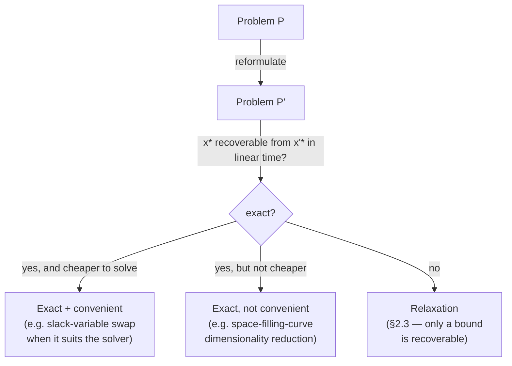

[[book-guidelines|↩ Back to guidelines]]

## Why "reformulation" needs its own vocabulary before it needs a technique

Before Chapter 2 shows you a single trick, it does something more important: it draws a line
that most people solving optimization problems never bother to draw. Given a hard problem
$P$, you can attack it three structurally different ways — and confusing them is how you end up "solving" the wrong problem, or trusting a bound that was never guaranteed to be valid.

Liberti's definitions (pp. 31–32) are deliberately precise:

- A **reformulation** of $P$ is a different problem $P'$ that shares some mathematical property  with $P$.
- $P'$ is an **exact** reformulation if the global solution $x^*$ of $P$ can be computed from the  global solution $x'^*$ of $P'$ in time linear in the size of $x'^*$.
- An exact reformulation is **convenient** if solving $P'$ actually costs *less* than solving $P$  directly.
- A useful reformulation that is *not* exact is called a **relaxation** — you solve $P'$, but you can no longer recover $x^*$ from $x'^*$; at best you get a bound on the optimal value of $P$.

This is the taxonomy the whole chapter hangs off. §2.1 (covered elsewhere in this vault) is about reformulations to *standard forms* — reshaping $P$ so an algorithm can consume it mechanically. §2.2, the subject of this article, is about exact reformulations that are useful *without* being standard-form conversions: they change the shape of the problem for a specific structural reason,not to satisfy an algorithm's input contract. §2.3 (relaxations) is the payoff of admitting that notevery useful transformation can afford to stay exact.

**What breaks without this distinction:** if you don't separate "exact" from "relaxation," you will, sooner or later, run a Branch-and-Bound algorithm whose lower-bounding step silently returns a bound for a *different* feasible region than the one you're branching on, and get convergence failures with no obvious cause. The entire spatial Branch-and-Bound (sBB) machine in this thesis works only because every step is tagged, precisely, as exact or as relaxation — and only the relaxation steps are allowed to lose information.

## Exact vs. convenient: two different promises

It's worth sitting with the fact that "exact" and "convenient" are *independent* properties. An
exact reformulation with no convenience is still exact — it lets you recover the true answer, it
just doesn't help you compute it faster. This matters because §2.2's two techniques are exact but their convenience is conditional: slack-variable reformulation is convenient when your solver's internals prefer equalities (e.g. an active-set or simplex-style method); dimensionality reduction via space-filling curves is *rarely* convenient in practice, because — as the book itself admits — "these functions are usually a set of theoretical tools used to prove existence theorems, and as such are even difficult to describe explicitly" (p. 48). You'll see below why that caveat isn't just academic throat-clearing.



## Liftings: the general move of buying structure with new variables

Several of the standard-form reformulations in §2.1 — Smith's standard form chief among them — are **liftings**: reformulations that add new problem variables. The book states this almost in passing ("Smith's standard form is a lifting... it adds new variables to the problem," p. 47), but it's a load-bearing concept for §2.2, because the slack-variable technique is the simplest possible instance of a lifting, isolated and studied on its own.

The trade a lifting makes is always the same shape: you enlarge the search space by $k$ new
coordinates, in exchange for the constraints or the objective becoming *individually simpler* — often just linear or affine, where they were nonlinear in the original variables alone. This is
worth naming as a general pattern, because it recurs everywhere in the thesis (bilinear-term
substitution, Smith's standard form, discrete-to-binary reformulation) and, not coincidentally, it recurs in constraint-programming and SAT-encoding practice more broadly: a Tseitin transformation adds one auxiliary boolean per subformula so that a deeply nested propositional formula becomes a flat conjunction of 3-clauses; a CSP flattening pass adds one auxiliary variable per compound subexpression so that a global nonlinear constraint becomes a chain of simple ones. The slack variable below is the same move, one variable at a time, in continuous optimization.

## §2.2.1 — Interchanging equality and inequality constraints via slack variables

**The problem this solves.** Some solution methods are naturally built around equality
constraints (e.g. algorithms that walk along the boundary of the feasible region, or that need a system of equations to eliminate variables via substitution); others are built around inequalities directly. If your problem is stated in the "wrong" form for the algorithm you want to use, you need a way to convert — *without changing what counts as an optimal solution*.

**The two directions, and why they're asymmetric.**

Given an inequality $g(x) \leq 0$, introduce a new variable $s$ (the **slack variable**) and write:
$$
g(x) \leq 0 \quad\Longleftrightarrow\quad g(x) + s = 0,\ \ s \geq 0.
$$
Read the equivalence directly: $s$ absorbs exactly the "room to spare" the inequality had. When $g(x) < 0$ strictly, $s$ is positive and measures the slack; when $g(x) = 0$ (the constraint is *active*, tight), $s = 0$. This is exact — you can recover feasibility and even the exact tightness of the original constraint from $s$ — and it **is a lifting**: the reformulated problem has one more variable than the original.

The reverse direction needs no new variable at all. Given an equality $g(x) = 0$:
$$
g(x) = 0 \quad\Longleftrightarrow\quad g(x) \leq 0 \ \text{ and } \ g(x) \geq 0.
$$
This is exact and costs nothing dimensionally — you've split one constraint into two, but added no coordinates to the search space.

The asymmetry is the whole lesson: turning an inequality into an equality *requires* a lifting
(you need somewhere to "store" the slack); turning an equality into inequalities never does
(an equality is just a symmetric pair of one-sided bounds already).

**What breaks without slack variables at all**, concretely: a solver that internally maintains a system of *linear equations* to compute search directions (e.g. any simplex-family LP method, or many interior-point KKT solves) cannot directly represent "this row must be $\leq 0$" — its linear-algebra core only knows how to factor and solve $Ax = b$. Slack variables are exactly how LP and QP solvers bridge that gap: every inequality constraint becomes an equality against a nonnegative slack, and the whole system becomes amenable to Gaussian-elimination-style machinery. This is *why* the standard-form LP you'll see in any operations-research textbook always looks like $Ax = b,\ x \geq 0$ — the slack variables are already folded into $x$ before you ever see the tableau.

### Grounding: slack-variable reformulation in Rust

The cleanest way to see this is to build the reformulator itself: a function that takes an
inequality-constrained linear system and returns the equality-constrained one, tracking which variables are original and which are slacks (mirroring exactly the "original vs. added variables" distinction the thesis itself needs in §5.3 for its Branch-and-Bound branching logic).

```rust
/// A linear constraint  a·x <op> b , where <op> is Le, Ge, or Eq.
#[derive(Clone, Copy, PartialEq, Eq, Debug)]
enum RelOp { Le, Ge, Eq }

#[derive(Clone, Debug)]
struct Constraint {
    coeffs: Vec<f64>, // a
    op: RelOp,
    rhs: f64,          // b
}

/// Marks whether a coordinate in the reformulated problem is one of the
/// original problem's variables, or a slack variable this pass introduced —
/// exactly the distinction Smith's sBB needs when deciding what to branch on.
#[derive(Clone, Copy, PartialEq, Eq, Debug)]
enum VarKind { Original, Slack }

struct Standardized {
    constraints: Vec<Constraint>, // now all RelOp::Eq
    var_kinds: Vec<VarKind>,
    n_original: usize,
}

/// §2.2.1: reformulate every inequality  a·x <= b  (resp. >= b) exactly as
/// a·x + s = b, s >= 0  (resp.  a·x - s = b, s >= 0).  This is a lifting:
/// one new coordinate per inequality constraint.
fn to_equality_form(cons: &[Constraint], n_original: usize) -> Standardized {
    let mut var_kinds = vec![VarKind::Original; n_original];
    let mut out = Vec::with_capacity(cons.len());

    for c in cons {
        match c.op {
            RelOp::Eq => out.push(c.clone()), // already exact, no lifting needed
            RelOp::Le | RelOp::Ge => {
                let sign = if c.op == RelOp::Le { 1.0 } else { -1.0 };
                let mut coeffs = c.coeffs.clone();
                // pad every existing constraint's row for the new slack column
                for row in &mut out {
                    row.coeffs.push(0.0);
                }
                coeffs.push(sign); // this constraint's own slack coefficient
                out.push(Constraint { coeffs, op: RelOp::Eq, rhs: c.rhs });
                var_kinds.push(VarKind::Slack); // s >= 0 tracked separately as a bound
            }
        }
    }
    Standardized { constraints: out, var_kinds, n_original }
}
```

The function is small on purpose: the point isn't the code, it's that the exactness claim
("the reformulation is exact") is *checkable structurally* — every row is padded consistently,
so a solution $(x, s)$ of the equality system restricted to its first `n_original` coordinates is, by construction, a solution of the original inequality system, and the slack values $s$ are exactly the constraint margins.

### Grounding: the exactness claim as a proof, in Lean

The book states the equivalence in prose; making it a theorem is a genuinely useful exercise,
because it's precisely the shape of soundness argument you'll want for *any* reformulation pass in a verified toolchain — you are proving that a syntactic rewrite of a constraint preserves its semantic content. Here, the "semantics" of a constraint is just: which assignments satisfy it.

```lean
-- g(x) ≤ 0  is exactly reformulated as  ∃ s ≥ 0, g(x) + s = 0.
theorem slack_reformulation_exact (g : ℝ → ℝ) (x : ℝ) :
    g x ≤ 0 ↔ ∃ s : ℝ, s ≥ 0 ∧ g x + s = 0 := by
  constructor
  · intro h
    exact ⟨-g x, by linarith, by ring⟩
  · rintro ⟨s, hs, heq⟩
    linarith
```

This is a one-line proof once you see the witness ($s = -g(x)$), but the shape is the important part: an exact reformulation, formalized, is always an `Iff` (or an explicit recovery function plus a proof it's a section/retraction), not just an informal "these feel equivalent." If you're building a trusted kernel around a reformulation pass in a compiler or verifier, this is the certificate you'd actually want your elaborator to produce and check — the reformulation is *proof-carrying*, not just believed.

## §2.2.2 — Dimensionality reduction via space-filling curves

**The problem this solves.** Optimizing over $\mathbb{R}^n$ is, in general, exponentially harder than optimizing over $\mathbb{R}$ — grid-based and exhaustive 1-dimensional search techniques scale far better than their $n$-dimensional analogues. If you could losslessly turn *any* $n$-dimensional optimization problem into a genuinely 1-dimensional one, you would want to.

**The set-theoretic starting point.** Cantor proved $\mathbb{R}^n$ and $\mathbb{R}$ have the same cardinality $\mathfrak{c}$ by constructing a bijection between them — but Cantor's bijection is *discontinuous* (it interleaves digits), which makes it useless for optimization: a discontinuous map can send two points that are close together in $\mathbb{R}^n$ to points arbitrarily far apart in $\mathbb{R}$, destroying any notion of "nearby $y$ means nearby $g(y)$" that a search algorithm relies on. Peano and Hilbert's contribution was to exhibit bijections — **space-filling curves** — that are everywhere continuous (though nowhere differentiable): they preserve *closeness*, even though they can't preserve smoothness.

**The reformulation itself.** Given a space-filling curve
$$
g : \mathbb{R} \to [0,1]^n,
$$
the original $n$-dimensional problem $\min_{x \in [0,1]^n} f(x)$ is reformulated exactly as the 1-dimensional problem
$$
\min_{y \in \mathbb{R}} f(g(y)).
$$
The composite $f \circ g$ maps $\mathbb{R} \to \mathbb{R}$, and can be handed to any efficient 1-dimensional global optimizer. If $y^*$ minimizes $f \circ g$, then $g(y^*)$ minimizes $f$ — the recovery map is literally $g$ itself, applied once, which is why this counts as *exact*.

**Why this is exact but rarely convenient.** The book is candid about the catch (p. 48): the space-filling curve's *existence* is guaranteed by a cardinality argument, but the curve itself is "even difficult to describe explicitly." You've traded an $n$-dimensional problem for a 1-dimensional one whose objective, $f \circ g$, is now nowhere differentiable (because $g$ is nowhere differentiable) and whose evaluation may itself be expensive or only approximable — e.g. via a finite-recursion-depth approximation of the Hilbert curve. This is the general tension the "exact vs. convenient" distinction was built to name: you've bought dimensionality at the cost of every other nice property (smoothness, cheap evaluation) the original problem might have had. It's exact, full stop — but whether it's *convenient* depends entirely on whether your 1-dimensional search method can tolerate a fractal, non-smooth objective, and whether you can afford to approximate $g$ to the precision the optimization needs.

### Grounding: Hilbert-curve dimensionality reduction in Python

A finite-depth Hilbert curve (the "space-filling curve" the book's Figure 2.1 actually plots — an
order-$k$ approximation, since the true curve is a limit object) is easy to construct explicitly and makes the exactness of the reformulation concrete: you can watch a 2D minimization problem get solved by a 1D scan.

```python
def hilbert_d2xy(order: int, d: int) -> tuple[int, int]:
    """Map a 1D Hilbert index d (0 <= d < 4**order) to a 2D grid point (x, y)
    in a 2**order x 2**order grid. This IS the reformulation map g,
    restricted to a finite lattice approximation (as the book notes on p.48,
    this lattice-approximation regime is where the technique is actually
    tractable)."""
    x = y = 0
    t = d
    s = 1
    while s < (1 << order):
        rx = 1 & (t // 2)
        ry = 1 & (t ^ rx)
        if ry == 0:
            if rx == 1:
                x, y = s - 1 - x, s - 1 - y
            x, y = y, x
        x += s * rx
        y += s * ry
        t //= 4
        s *= 2
    return x, y

def f(x: float, y: float) -> float:
    """Some 2D objective on [0,1]^2 — a stand-in for f(x) in the thesis."""
    return (x - 0.7) ** 2 + (y - 0.2) ** 2

def reduced_objective(order: int, d: int) -> float:
    """This is exactly f(g(y)): the composite the book reformulates to."""
    n = (1 << order)
    gx, gy = hilbert_d2xy(order, d)
    return f(gx / n, gy / n)

# 1-dimensional exhaustive scan replaces a 2-dimensional search:
order = 8  # 256x256 lattice
best_d = min(range(4 ** order), key=lambda d: reduced_objective(order, d))
bx, by = hilbert_d2xy(order, best_d)
print((bx / (1 << order), by / (1 << order)))  # recovered (x*, y*) = g(y*)
```

This is a *lattice-approximated* instance of the technique, which is precisely the caveat the book flags: "this approach may be worth investigating when the Euclidean space is approximated by a rational or integer lattice" (p. 48). At finite order it's a clean illustration; the thesis's actual concern is the true continuum-limit curve, which is why the technique remained a specialized, mostly-theoretical tool rather than a workhorse of the sBB algorithms developed later in the thesis.

## Where this leads

§2.2's two techniques sit at opposite ends of the "exact reformulation" spectrum the chapter
defines: slack-variable interchange is a *local*, cheap, frequently-convenient lifting that later
chapters use routinely (Smith's standard form is built from the same move, repeated); space-
filling-curve dimensionality reduction is a *global*, structurally elegant but rarely-convenient
exact reformulation that the book flags mainly to be complete, before pivoting — in §2.3 — to the technique that actually carries the rest of the thesis: giving up exactness on purpose, in a controlled way, to get a **relaxation** that is convex and therefore *tractable*. Read §2.2 as the chapter proving a negative result first: exactness alone, even when achievable (as it is here, both times), does not guarantee tractability. That's the setup for why Chapters 3 and 4 spend so much effort not on more exact reformulations, but on *tighter relaxations* of bilinear terms and odd-degree monomials — the thesis's own two open problems, identified at the end of this chapter.

For the standing project: the exactness/relaxation boundary drawn here is the same boundary that separates a sound-and-complete constraint transformation (a Tseitin-style CNF encoding, a provably-equivalent slack-variable LP standard form) from a sound-but-incomplete *abstraction* (an interval or octagon domain in abstract interpretation, a convex relaxation used to prune search in a CSP solver). The slack-variable proof above is a template worth keeping:
any reformulation pass in your compiler's constraint layer — flattening a refinement predicate, introducing a fresh metavariable, splitting an equality obligation into two inequality checks for a numeric domain — deserves exactly this kind of `Iff`-shaped exactness certificate before your kernel is allowed to trust it.
