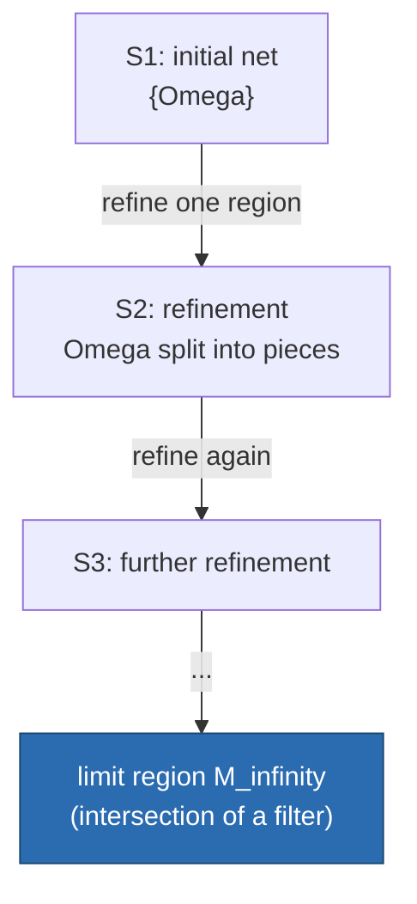
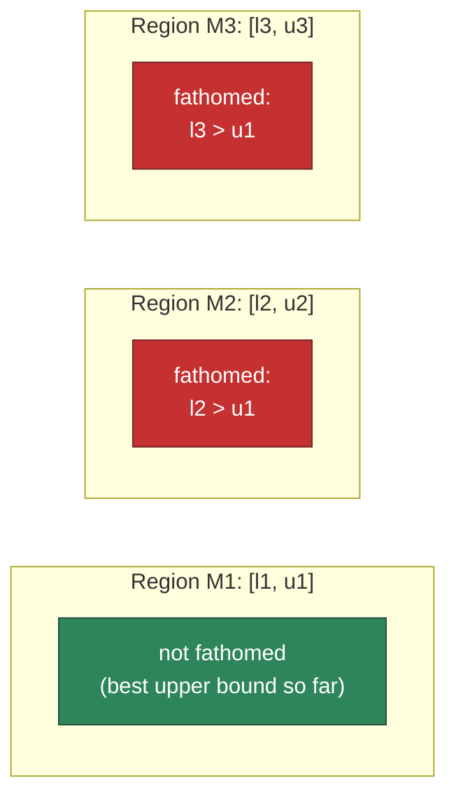

# Global Optimization and the Branch-and-Select Framework

[[book-guidelines|↩ Back to guidelines]]

## Why this section exists in the thesis

Chapter 1 has just finished classifying optimization problems — convex vs. nonconvex, local vs. global optimum. §1.2 leaves you with an uncomfortable fact: for a *nonconvex* nonlinear program (NLP), a point that looks optimal to any local method (gradient is zero, Hessian is positive semidefinite) might still be a terrible answer, because somewhere else in the feasible region there's a strictly better point that no local method will ever see. §1.3–1.4 is the thesis's answer to "okay, so how do you actually find the *global* optimum, provably, of a problem that can have arbitrarily many local optima scattered across a nonconvex landscape?"

The answer the thesis commits to is a family of algorithms called **Branch-and-Select**, and it matters enormously for the rest of the 130-page document: every algorithm in the following chapters (spatial Branch-and-Bound, Smith's symbolic reformulation, the $\mathcal{OS}$ software framework) is a *particular instance* of the abstract Branch-and-Select scheme defined here. Get the scheme and its convergence theorem right, and you understand the skeleton that every later, more sophisticated algorithm in this thesis hangs off of.

## The optimization problem on the table

The thesis fixes its central object once, in equation (1.1):

$$
\begin{aligned}
\min_x \quad & f(x) \\
\text{s.t.} \quad & \alpha \le g(x) \le \beta \\
& a \le x \le b
\end{aligned}
$$

where $x \in \mathbb{R}^n$ are continuous decision variables, $f : \mathbb{R}^n \to \mathbb{R}$ is the objective, $g : \mathbb{R}^n \to \mathbb{R}^m$ are the constraints, and $\alpha, \beta, a, b$ bound the constraints and variables respectively. Nothing here says $f$ or $g$ are convex. That's the whole point: this is the generic **nonlinear program (NLP)**, and the thesis's project is to solve it to *global* optimality even when it isn't convex.

One notational choice is worth flagging because it's easy to skim past: the constraint is written as a two-sided inequality $\alpha \le g(x) \le \beta$ rather than the more common $h(x) = 0 \wedge g(x) \le 0$. Liberti says explicitly this is a software-engineering decision — a single interval-constraint representation is more compact to store and manipulate symbolically than separate equality/inequality constraint types. That's a small signal of the thesis's recurring theme (formulation choices have real computational consequences), showing up even at the level of how you *represent* a constraint in code, not just how you solve it.

## Deterministic vs. stochastic: two philosophies of "search"

Before getting to Branch-and-Select specifically, §1.3 draws the field's foundational split:

- **Deterministic** methods never make a random choice, and their convergence proofs never invoke probability. Given the same input, they always explore the same trajectory.
- **Stochastic** (nondeterministic) methods use randomization (Simulated Annealing, Tabu Search, Differential Evolution, Ant Colony methods — the thesis lists a whole zoo of these), and their convergence arguments are probabilistic.

**What breaks without this distinction:** if you don't separate these, you can't reason about what a "solved" instance even means. A deterministic Branch-and-Select run either *terminates with a certificate* (a proof that no better point exists outside the region you stopped exploring) or it doesn't terminate — but it never lies to you about a region it hasn't ruled out. A stochastic method can report a very good answer and simply never prove it's the *best* answer; its guarantees are statistical, not certificate-based. The thesis is unambiguous about which camp it's in: "This research focuses on deterministic algorithms for global optimization" — because deterministic methods are the ones that can carry a machine-checkable proof of global optimality, which is exactly what an engineering design problem (the thesis's target applications: process scheduling, distillation columns, pooling/blending) needs before you trust it with capital expenditure.

If you've worked with SAT/SMT solvers or CDCL, this split should feel familiar: a DPLL-style solver is deterministic and produces a certificate (a satisfying assignment, or a resolution proof of unsatisfiability); a stochastic local search SAT solver (WalkSAT) can find satisfying assignments fast but can't certify unsatisfiability. Branch-and-Select is, structurally, the numerical-optimization sibling of DPLL/CDCL — branch, propagate bounds, prune, backtrack, and only ever discard a region when you have a *proof* it can't contain the answer.

## A potted history, and why Branch-and-Bound is the ancestor of everything here

§1.3.2 traces global optimization back to Lagrange (1797), but notes that global optimization *as a computational problem* only became meaningful once electronic computers made "keep the theory simple, brute-force the computation" viable — the shift from symbolic/algebraic problem-solving to iterative numerical search. The key lineage:

1. **Branch-and-Bound (BB)**, late 1950s, originally for discrete/combinatorial problems (Traveling Salesman Problem). Divide-and-conquer: split the problem into subproblems ("branch"), and prove some subproblems can't contain the optimum ("bound"), so you never have to actually solve them.
2. **1969**: first paper applying BB to *continuous* global optimization.
3. **1970s–80s**: slow going — theory outpaced hardware.
4. **Interval Optimization**: the first deterministic method able to handle generic nonconvex continuous NLPs, but convergence is often painfully slow because interval arithmetic tends to produce very loose bounds.
5. **1995 onward**: Ryoo & Sahinidis's Branch-and-Reduce, then Floudas/Adjiman's $\alpha$BB, Smith & Pantelides's symbolic reformulation approach, Pistikopoulos's Reduced-Space Branch-and-Bound, Grossmann's Branch-and-Contract, Barton's Branch-and-Cut — a proliferation of BB variants, each targeting a different class of problem structure or bottleneck.

The thesis's framing move is to notice that *all of these* — Branch-and-Cut, Branch-and-Bound, Branch-and-Reduce, even modern interval-analysis methods — are instances of one more general abstract pattern, which it names **Branch-and-Select**. This is why §1.4 doesn't present "the" algorithm for global optimization; it presents a *schema*, parameterized by a **selection rule**, and proves a convergence theorem about the schema itself, so that every concrete BB variant inherits the proof for free as long as its own selection rule satisfies the schema's exactness condition.

## Two-phase search: why global methods still need local optimizers

§1.3.3 makes an important practical point that's easy to miss if you only think of Branch-and-Select in the abstract: almost every real global optimization method is **two-phase** — a *global* search phase (partition and prune the feasible region) combined with a *local* search phase (run a fast local NLP solver inside a promising region). The reason is efficiency: local solvers (gradient-based, interior-point) are extremely fast and mature, but structurally incapable of proving global optimality on their own. The global phase's job is to confine the local phase to regions where "the local optimum found here is provably close to the true global optimum," and to keep splitting regions until that gap vanishes.

**What breaks without the local phase:** a purely global, gradient-free method (e.g. exhaustive interval bisection with no local refinement) converges, but glacially — you'd be paying for global rigor everywhere in the search space, including deep inside regions that are already known to be well-behaved. Local search is what makes the "distinguished point" of each region (see below) a genuinely good candidate incumbent, rather than an arbitrary sample point.

## NP-hardness: the wall you can't optimize your way around

§1.3.3 states, without ceremony, one of the load-bearing facts of the whole thesis:

> **Local optimization of nonconvex problems is NP-hard.** Because every iterative global method relies on a local search phase, global optimization of NLPs (in the general form (1.1)) is therefore NP-hard too. Even the one *non-iterative* method known (Gröbner-basis-based) is NP-hard.

This is worth sitting with. It's not "global optimization is hard because our algorithms are bad" — it's a statement that no algorithm, however clever, can solve the general nonconvex NLP in worst-case polynomial time (assuming P ≠ NP). This is exactly the same shape of result you'd cite for SAT, or for general CSP consistency-checking, or for typechecking under an undecidable unification theory: worst-case intractability doesn't mean "give up," it means "invest in reformulation, pruning heuristics, and problem structure exploitation to make the *typical* case tractable" — which is precisely the thesis's stated thematic bet (mathematical formulation matters as much as algorithmic sophistication). If you're building a CSP kernel for verification-condition search over abstract domains, this is the same lesson: NP-hardness of the general problem is not a reason to skip propagation and pruning — it's the *reason* propagation and pruning exist as an engineering discipline.

## Nets, refinements, and filters: the topology of "keep splitting the search space"

§1.4 needs precise vocabulary before it can state the algorithm, because "keep partitioning the region" has to be made rigorous enough to support a convergence proof. Three definitions, read in order:

**Net.** Let $\Omega \subseteq \mathbb{R}^n$ be the feasible region. A finite family of sets $\mathcal{S}$ is a **net** for $\Omega$ if it's pairwise disjoint and covers $\Omega$:
$$
\forall s, t \in \mathcal{S}\ (s \cap t = \emptyset) \quad\text{and}\quad \Omega \subseteq \bigcup_{s \in \mathcal{S}} s.
$$
Read this as: a net is a jigsaw-puzzle partition of the search space into disjoint "regions," each of which the algorithm will track, evaluate, and either keep or discard as a whole.

**Refinement.** A net $\mathcal{S}'$ is a **refinement** of $\mathcal{S}$ if $\mathcal{S}'$ was obtained from $\mathcal{S}$ by taking exactly one set $s \in \mathcal{S}$, partitioning it into finitely many disjoint pieces $s_i'$, and replacing $s$ in the net by those pieces. In symbols: $s = \bigcup_i s_i' \in \mathcal{S}$, $s \notin \mathcal{S}'$. This is literally the "branch" step of Branch-and-Select — you never touch the rest of the net, you only ever subdivide the one region you've selected.

**Filter and its limit.** Given an infinite sequence of nets $\mathcal{S}_n$, each a refinement of the previous one, a **filter** is an infinite sequence of regions $M_n$, one drawn from each $\mathcal{S}_n$, such that each is nested inside the previous: $M_i \subseteq M_{i-1}$ for all $i$. Its **limit** is $M_\infty = \bigcap_{i \in \mathbb{N}} M_i$ — the (possibly single-point) region you converge to if you keep tracing that one nested chain of shrinking regions forever.

**What breaks without this machinery:** without "filter" as a formal object, you have no way to talk about "the sequence of regions the algorithm keeps zooming into around the eventual optimum" as a single mathematical entity — and the convergence theorem below is precisely a statement about *what must be true of every filter's limit*. This is the same structural move as defining a Cauchy sequence before proving completeness: you need the right notion of "a coherent shrinking sequence" before you can say anything about what it converges to.



## The generic Branch-and-Select algorithm

Now the schema itself. Fix the problem $\min\{f(x) \mid x \in \Omega\}$. Given a threshold $\gamma \in \mathbb{R}$, a **selection rule** on a net $\mathcal{S}$ for $\Omega \cap \{x \mid f(x) < \gamma\}$ determines three things:

1. a **distinguished point** $\omega(M)$ for every region $M \in \mathcal{S}$ — the region's "best known candidate solution" (in practice: the output of a local optimizer run inside $M$),
2. a subfamily $\mathcal{R} \subseteq \mathcal{S}$ of **qualified** members — the regions that survive pruning,
3. a **distinguished member** $M^*(\mathcal{S}) \in \mathcal{R}$ — the one region chosen for further splitting next,

subject to the constraint that every point in every *rejected* region has objective value at least $\gamma$: for all $x \in \bigcup_{s \in \mathcal{S} \setminus \mathcal{R}} s$, $f(x) \ge \gamma$. In words: the selection rule is only allowed to throw away a region if it can *prove* that region has no chance of beating the current threshold.

With that rule fixed, here is the algorithm exactly as the thesis states it:

1. **(Initialization)** Start with a net $\mathcal{S}_1$ for $\Omega$. Set $x_0 = \emptyset$, let $\gamma_0$ be any upper bound for $f(\Omega)$. Set $\mathcal{P}_1 = \mathcal{S}_1$, $k = 1$, $\sigma_0 = \emptyset$.
2. **(Evaluation)** Let $\sigma_k = \{\omega(M) \mid M \in \mathcal{P}_k\}$ — the set of all distinguished points of the newest regions.
3. **(Incumbent)** Let $x_k$ be the point in $\{x_{k-1}\} \cup \sigma_k$ minimizing $f$; set $\gamma_k = f(x_k)$. This is the running best-known solution ("the incumbent") and its objective value.
4. **(Screening)** Determine the qualified family $\mathcal{R}_k \subseteq \mathcal{S}_k$ — reject any region provably unable to beat $\gamma_k$.
5. **(Termination)** If $\mathcal{R}_k = \emptyset$, stop. If $\gamma_k \ge \gamma_0$, the problem is infeasible; otherwise $x_k$ is the global optimum.
6. **(Selection)** Choose the distinguished member $M_k = M^*(\mathcal{S}_k) \in \mathcal{R}_k$, partition it by a pre-specified branching rule into $\mathcal{P}_{k+1}$, and replace $M_k$ by $\mathcal{P}_{k+1}$ inside $\mathcal{R}_k$ to obtain the new refinement net $\mathcal{S}_{k+1}$. Set $k \leftarrow k+1$, go to Step 2.

Every named step in this list corresponds to a term you'll meet by that exact name again and again through the rest of the thesis and in the broader BB literature — *incumbent*, *screening*, *fathoming* — so it's worth internalizing the six-step shape now.

```mermaid
flowchart TD
    A["1. Initialization<br/>S1 for Omega, gamma0 = any upper bound"] --> B["2. Evaluation<br/>compute distinguished points sigma_k"]
    B --> C["3. Incumbent<br/>x_k = best of x_{k-1} and sigma_k"]
    C --> D["4. Screening<br/>R_k = qualified regions of S_k"]
    D --> E{"5. Termination<br/>R_k empty?"}
    E -->|yes, gamma_k >= gamma0| F["Infeasible"]
    E -->|yes, gamma_k < gamma0| G["x_k is global optimum"]
    E -->|no| H["6. Selection<br/>branch M_k in R_k, partition -> P_{k+1}"]
    H -->|new net S_{k+1}, k += 1| B
```

### Grounding it in code: Branch-and-Select as a search-and-prune loop

The six-step schema maps almost verbatim onto a generic branch-and-prune search loop — the same shape you'd write for a CSP solver doing domain-splitting with pruning, just with an interval "lower bound oracle" standing in for constraint propagation. Here's Rust, since this is exactly the shape a verifier's search kernel takes:

```rust
/// A "region" is an abstraction over a subset of the search space — for a
/// numeric NLP this would be a box of variable intervals; for a CSP over
/// abstract domains it would be a tuple of per-variable domain abstractions.
trait Region: Clone {
    /// omega(M): the distinguished point — e.g. run a local optimizer inside
    /// this region and return (candidate point, objective value).
    fn distinguished_point(&self) -> (Vec<f64>, f64);

    /// A cheap, sound *lower bound* on the objective over this region.
    /// Must satisfy: for all x in region, f(x) >= lower_bound(region).
    fn lower_bound(&self) -> f64;

    /// The branching rule: split this region into finitely many disjoint
    /// sub-regions that still cover it.
    fn partition(&self) -> Vec<Self>;
}

fn branch_and_select<R: Region>(initial: R, gamma0: f64) -> Option<(Vec<f64>, f64)> {
    let mut regions: Vec<R> = vec![initial];      // the current net S_k
    let mut incumbent: Option<(Vec<f64>, f64)> = None; // x_k, gamma_k
    let mut best = gamma0;                         // gamma_k

    loop {
        // 2. Evaluation — 3. Incumbent
        for m in &regions {
            let (pt, val) = m.distinguished_point();
            if val < best {
                best = val;
                incumbent = Some((pt, val));
            }
        }

        // 4. Screening: an exact selection rule discards M only when its
        // lower bound proves it cannot beat the incumbent.
        let qualified: Vec<R> = regions
            .into_iter()
            .filter(|m| m.lower_bound() <= best)   // this is fathoming
            .collect();

        // 5. Termination
        if qualified.is_empty() {
            return incumbent; // None if best never improved on gamma0: infeasible
        }

        // 6. Selection: pick the region with the lowest lower bound (a common,
        // but not the only, valid distinguished-member rule) and branch it.
        let (idx, chosen) = qualified
            .iter()
            .enumerate()
            .min_by(|a, b| a.1.lower_bound().partial_cmp(&b.1.lower_bound()).unwrap())
            .unwrap();
        let mut next_regions = qualified.clone();
        let branched = next_regions.remove(idx).partition();
        next_regions.extend(branched);
        regions = next_regions;
    }
}
```

The load-bearing correctness property is entirely carried by `lower_bound`: it must be a *sound* underestimate of $f$ over the region (exactly condition (1) of exactness below), or the whole search becomes unsound — you'd prune away regions that actually contain the optimum. This is precisely the role a convex/concave relaxation plays in the rest of the thesis (Chapters 2, 5, 7): it's how you compute `lower_bound()` cheaply for a nonconvex region.

A short Python sketch of the same loop, useful for prototyping a selection rule before committing to Rust's ownership discipline:

```python
def branch_and_select(initial_region, gamma0, distinguished_point, lower_bound, partition):
    regions = [initial_region]
    incumbent, best = None, gamma0
    while True:
        for m in regions:
            pt, val = distinguished_point(m)
            if val < best:
                best, incumbent = val, pt
        qualified = [m for m in regions if lower_bound(m) <= best]  # screening + fathoming
        if not qualified:
            return incumbent  # None -> infeasible
        chosen = min(qualified, key=lower_bound)                    # selection
        regions = [m for m in qualified if m is not chosen] + partition(chosen)
```

## Exact selection rules and the convergence theorem

Not every selection rule is trustworthy — you could screen too aggressively and accidentally discard the true optimum. A selection rule is **exact** if two conditions hold:

1. Every region that stays qualified throughout the *entire* solution process has infimum objective value at least the true global optimum $\gamma^*$:
$$
\forall M \in \bigcap_{k=1}^{\infty} \mathcal{R}_k \quad \left(\inf f(\Omega \cap M) \ge \gamma^*\right)
$$
2. The limit $M_\infty$ of *any* filter $\{M_k\}$ satisfies $\inf f(\Omega \cap M_\infty) \ge \gamma^*$.

A Branch-and-Select algorithm is **convergent** if $\gamma^* = \inf f(\Omega) = \lim_{k \to \infty} \gamma_k$ — i.e. the incumbent's objective value tracks down to the true optimum in the limit.

**Theorem 1.4.1.** *A Branch-and-Select algorithm using an exact selection rule converges.*

**Proof (as given in the thesis).** Suppose for contradiction there's a point $x \in \Omega$ with $f(x) < \gamma^*$. Since $x \in \Omega$, it lies in some region $M \in \mathcal{R}_n$ for some iteration $n$. By exactness condition (1), $M$ cannot stay qualified forever — and since unqualified regions can't (by the definition of a valid selection rule) contain points better than the incumbent, $M$ must eventually be split, at some later iteration $n' > n$. So $x$ belongs to every region in some filter $\{M_n\}$ derived by always following the piece containing $x$ — i.e. $x \in \Omega \cap M_\infty$. By exactness condition (2), $f(x) \ge \inf f(\Omega \cap M_\infty) \ge \gamma^*$. This contradicts $f(x) < \gamma^*$. $\blacksquare$

The proof structure is worth naming explicitly because it recurs everywhere in verification-adjacent reasoning: it's a **soundness-by-invariant-preservation** argument. Condition (1) says the screening step never discards a region that could beat $\gamma^*$ (a *soundness of pruning* invariant); condition (2) says that even in the limit of infinite refinement, that invariant survives (a *completeness-in-the-limit* invariant). Together they rule out the only way convergence could fail — a "hidden" better point surviving in the shadows. If you've written a soundness proof for an abstract-interpretation widening operator, or for a CEGAR refinement loop's spurious-counterexample elimination, this is the same skeleton: prune only what's provably safe to prune, and show the invariant is preserved as the abstraction gets refined arbitrarily far.

**What breaks without exactness:** a selection rule that's merely a heuristic (e.g. "discard any region whose *estimated* — not proven — lower bound looks bad") gives you a fast algorithm with zero correctness guarantee. It might silently discard the region containing the true optimum and report a merely-local answer with false confidence. This is exactly the bug class that separates a real theorem prover's trusted kernel from an unsound heuristic search: the kernel only ever performs steps it can *justify*, even if that means being slower.

## Fathoming: turning the abstract screening step into a computable procedure

§1.4.1 makes the abstract "screening" step concrete. Let $\mathcal{S}_k$ be the net at iteration $k$. For each region $M \in \mathcal{S}_k$:

- compute a **lower bound** $l(M)$ of $f(M \cap \Omega)$ and set the distinguished-point value $\omega(M) = l(M)$;
- $M$ is **qualified** if $l(M) \le \gamma_k$;
- the distinguished region is usually (though not always) the one with the lowest $l(M)$.

The algorithm accelerates further if you *also* compute an **upper bound** $u(M)$ of $f(M \cap \Omega)$ (typically: run a local optimizer inside $M$ and use its value) and reject any $M$ whose *lower* bound $l(M)$ exceeds the *best upper bound found so far across all regions*. Regions rejected this way are said to be **fathomed**.

This is the crucial acceleration device, and it's worth being precise about why it's stronger than screening on $l(M) \le \gamma_k$ alone: fathoming lets one region's good upper bound prune *other, unrelated* regions immediately, rather than waiting for each region's own lower bound to individually cross the current threshold. Figure 1.1 in the source (regions $M_1, M_2, M_3$ each with their own $[l_i, u_i]$ interval) shows this visually: $M_2$'s lower bound $l_2$ exceeds $M_1$'s upper bound $u_1$, so $M_2$ is fathomed outright — $M_1$'s already-known good solution certifies that nothing in $M_2$ can compete, without ever refining $M_2$ further.



Fathoming is a pure *accelerator* — it never changes whether the algorithm converges (that's Theorem 1.4.1's job, and it holds regardless), only how fast it gets there. This distinction — "correctness comes from the selection rule's exactness; speed comes from fathoming" — is a clean separation of concerns worth carrying into any pruning-search design: keep the soundness argument independent of the heuristics that make the search fast in practice.

A minimal illustration of fathoming as an interval-arithmetic pruning oracle, in Rust:

```rust
#[derive(Clone, Copy)]
struct Interval { lo: f64, hi: f64 }

/// A crude but sound lower/upper bound via interval arithmetic on a box region.
/// Real sBB codes (Ch. 5) replace this with a convex relaxation's LP/NLP bound.
fn bound_box(box_vars: &[Interval], f: impl Fn(&[f64]) -> f64) -> (f64, f64) {
    // Sound lower bound: naive interval evaluation (placeholder — real code
    // would propagate interval arithmetic through f's expression tree).
    let corner_min = box_vars.iter().map(|iv| iv.lo).collect::<Vec<_>>();
    let corner_max = box_vars.iter().map(|iv| iv.hi).collect::<Vec<_>>();
    let l = f(&corner_min).min(f(&corner_max)); // NOT sound in general for nonconvex f —
    let u = f(&corner_min).max(f(&corner_max)); // stand-in for a real relaxation's l(M), u(M)
    (l, u)
}

fn fathom(regions: &[(Interval, Interval)], bounds: &[(f64, f64)]) -> Vec<bool> {
    let best_upper = bounds.iter().map(|(_, u)| *u).fold(f64::INFINITY, f64::min);
    bounds.iter().map(|(l, _)| *l > best_upper).collect() // true = fathomed
}
```

(The `bound_box` stand-in is deliberately naive — computing a genuinely *sound* lower bound for a nonconvex $f$ is exactly the subject of Chapters 2 and 7 of the thesis, via convex/concave relaxations and envelopes. The point here is only to show fathoming's control-flow shape.)

## $\varepsilon$-optimality: why practitioners give up on exact equality

Theorem 1.4.1 guarantees convergence *in the limit* — it says nothing about *finite termination*. In general, the Branch-and-Select loop might need infinitely many iterations to certify exact optimality (the same way a general Newton-style root-finder converges but never lands on the root in finitely many floating-point steps). So in practice, almost every implementation relaxes the target from exact optimality to **$\varepsilon$-optimality**:

Recall $x^* \in \Omega$ is a **global optimum** if $f(x^*) \le f(x)$ for all $x \in \Omega$. Given $\varepsilon > 0$, a point $\bar x \in \Omega$ is **$\varepsilon$-globally optimal** if there exist bounds $m \le f(x^*) \le M$ such that $f(\bar x) \in [m, M]$ and $M - m < \varepsilon$.

In other words: you don't need to *know* $f(x^*)$ exactly — you just need a certified lower bound $m$ and a certified upper bound $M$ (exactly the $l(M)$/$u(M)$ machinery from fathoming!) that have converged to within $\varepsilon$ of each other, and any feasible point whose objective falls in that bracket counts as good enough. Because the lower and upper bound sequences ($\gamma_k$ from the incumbent, and the best surviving $l(M)$ across the net) are both monotonically converging toward $\gamma^*$, you can *actually check*, after finitely many iterations, whether $M - m < \varepsilon$ — giving you a computable finite-termination criterion that pure exact-optimality convergence doesn't hand you for free. Getting a theoretically guaranteed exact finite termination needs additional regularity assumptions the thesis cites but doesn't pursue; $\varepsilon$-optimality is "sufficient for most practical purposes."

If you've worked with SMT solvers over reals or floating-point abstractions, this is the numerical-optimization analogue of accepting a *bounded* answer (a certified interval containing the true value) instead of demanding exact algebraic equality — the same pragmatic move that makes interval constraint propagation and DPLL(T)-style theory reasoning terminate in practice.

## Closing synthesis: where this sits in the thesis, and in your project

**Downward dependency, within the thesis.** Everything from Chapter 2 onward is built on this scaffold. Spatial Branch-and-Bound (sBB, Chapter 5) is the Branch-and-Select schema specialized to continuous NLPs, with $l(M)$ computed via a *convex relaxation* of the nonconvex problem restricted to region $M$ — which is exactly why Chapters 2, 7, 8, and 9 (all about reformulation and convex/linear relaxation techniques) matter so much: they're all in service of computing a tight, sound `lower_bound()` cheaply. The thesis's own framing — "mathematical formulation is as important as algorithmic sophistication" — is really the claim that a *tighter* $l(M)$ (from a better relaxation) prunes the search tree far more effectively than any amount of cleverness in the *Selection* step alone.

**Upward dependency, from §1.2.** The convex/concave function and relaxation/envelope definitions from §1.1 (covered in the sibling article on Convexity and Function/Set Classification) are exactly what makes it *possible* to compute a sound $l(M)$ in the first place — a convex relaxation is a convex underestimator of $f$, and Theorem 1.4.1's condition (1) is precisely the soundness property that relaxation must have.

**Where this bears on your compiler/CSP project.** Branch-and-Select is, structurally, the same search discipline your CSP kernel needs for finding counterexamples over abstract domains: partition the search space (branch), compute a sound abstraction of what's reachable in each partition (the analogue of $l(M)$ — this is literally what an abstract-interpretation lattice element or interval-domain abstraction gives you), discard partitions the abstraction proves are infeasible (fathoming — this is exactly what a Galois-connection-sound abstract domain buys you: prune whole regions of concrete search space via one abstract check), and refine only where the abstraction is too coarse to decide (this is the "region selection" step, and it is *precisely* the shape of a CEGAR refinement loop: an inexact/coarse abstraction gives a spurious result, so you refine — partition — the abstract domain and retry). Theorem 1.4.1's soundness/exactness split — pruning is only ever justified by a *proven* invariant, never a heuristic guess — is the same discipline a trusted verification kernel must hold to: your Rust CSP kernel's domain-propagation pruning steps need to satisfy an analogue of exactness condition (1) (never discard a domain assignment that could satisfy the constraints) to be a sound counterexample search, exactly as $l(M) \le \gamma_k$ soundly certifies "this region might still beat the incumbent." And the NP-hardness result above is the same reason your CSP kernel's efficiency will ultimately live or die on propagation strength and domain representation — not on search-order cleverness alone — which is the thesis's central thematic bet, restated one level up the abstraction stack.
