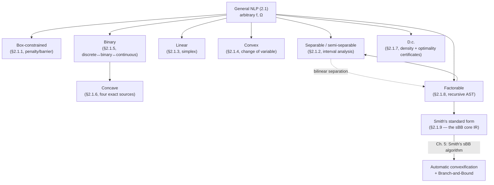

# Reformulation to Standard Forms

[[book-guidelines|↩ Back to guidelines]]

## Why a "standard form" matters before you can search

A spatial Branch-and-Bound (sBB) algorithm — the machinery this whole thesis is built around — needs to do two things over and over, millions of times, on tiny sub-boxes of the search space: compute a cheap *lower bound* and check *feasibility*. Neither of those is easy to automate against an arbitrary nonlinear program written the way a domain scientist would write it, with nested logarithms, products of decision variables, absolute values, discrete choices, and constraints scattered across the model. What sBB actually wants is a small, fixed vocabulary of *shapes* it already knows how to bound: a box, a sum of one-variable terms, a bilinear product, a linear system. Chapter 2 §2.1 is a catalogue of the recipes that get you from "whatever a modeler wrote" to one of those shapes, without changing the optimal solution.

This is the same move a compiler makes when it lowers an arbitrary source expression to a small IR before running an optimization pass — you don't write a constant-folding pass for every possible surface syntax; you normalize first, then optimize the normal form. Liberti's chapter is literally an IR-design chapter for optimization problems: it is deciding what the "core language" of an NLP-solving compiler looks like, and giving you provably-equivalent lowering rules into it, subsection by subsection. Keep that frame in mind — every "reformulation" below is a *semantics-preserving program transformation* to a decidable target grammar, and the recurring proof obligation (which the book calls being **exact**) is exactly a compiler's correctness obligation: the lowered program must be *directly invertible* back to a solution of the original one in linear time.

Formally (p. 31): a reformulation $Q$ of problem $P$ shares mathematical properties with $P$; it is **exact** if the global solution $x^*$ of $P$ can be recovered from the global solution $x'^*$ of $Q$ in linear time; it is **convenient** if, in addition, $Q$ is cheaper to solve than $P$. A useful *non*-exact reformulation is a **relaxation** (covered in a later topic article, not here). Throughout, the book fixes a reference problem form:

$$\min_{x \in \Omega} f(x) \tag{2.1}$$

where $\Omega \subseteq \mathbb{R}^n$ is the feasible region, usually given by $Ax = b$, $Ax \le b$, and box bounds $x^L \le x \le x^U$.

```rust
// The generic shape every reformulation below either targets or starts from.
struct Nlp {
    n_vars: usize,
    objective: Expr,           // f
    equalities: Vec<Expr>,     // h_i(x) = 0
    inequalities: Vec<Expr>,   // g_i(x) <= 0
    lower: Vec<f64>,           // x^L
    upper: Vec<f64>,           // x^U
}
```

A "reformulation" in this article is a function `Nlp -> Nlp` (possibly adding variables) that is provably solution-preserving. What follows is organized by the *target class* each transformation lands in — box-constrained, separable, linear, convex, binary, concave, d.c., factorable, and finally Smith's standard form, which is the book's own "core IR" that later chapters build the sBB algorithm on top of.

---

## 1. Box-constrained problems: penalty and barrier reformulation

**What breaks without this.** Most global-optimization machinery — including plain stochastic search and interval arithmetic — is originally designed for the simplest possible feasible region: a box, $\Omega = \{x \mid x^L \le x \le x^U\}$, with no equality or inequality constraints at all (p. 32). Constrained problems are the norm in practice, so before you can reuse box-only tooling, you need a way to fold arbitrary constraints *into* the objective.

**The idea.** Given

$$\Omega = \{x \in \mathbb{R}^n \mid \forall i \le m\,(h_i(x)=0) \wedge \forall i \le m'\,(g_i(x) \le 0) \wedge x^L \le x \le x^U\} \tag{2.2}$$

define indicator ("boolean-valued") penalty functions $\delta_i, \varepsilon_i : \mathbb{R} \to \{0, \infty\}$ that are $0$ when their constraint is satisfied and $\infty$ otherwise. Then

$$\min_{x^L \le x \le x^U} F(x) = f(x) + \sum_{i=1}^m \delta_i(h_i(x)) + \sum_{i=1}^{m'} \varepsilon_i(g_i(x)) \tag{2.3}$$

is an **exact** reformulation to box-constrained form: if $x$ is feasible in the original problem, $F(x) = f(x)$; if infeasible, $F(x) = \infty$. This is the textbook "constraints become infinite walls" trick, done rigorously.

**What breaks with the naive version.** The indicator functions are wildly non-smooth (a step to infinity), and $\infty$ itself is numerically unusable — most solvers choke on it immediately. Two fixes, each with a cost: if $f$ is Lipschitz, replace $\infty$ with a finite global upper bound $L$ on $f$ over $\Omega$ — this handles numerics but not smoothness. To handle smoothness you replace $\delta_i, \varepsilon_i$ with a smooth **penalty function**, e.g.

$$F(x) = f(x) + \mu\Big(\sum_{i=1}^m |h_i(x)| + \sum_{i=1}^{m'} \max(0, g_i(x))\Big),$$

but now the reformulation is only exact for *some* value of $\mu$ that cannot be known a priori, and $|\cdot|$, $\max(0,\cdot)$ are still not smooth everywhere. This is the general shape of every reformulation in the chapter: gaining tractability (a simpler target grammar) costs you either exactness, smoothness, or both, and the book is explicit about which trade each recipe makes.

```rust
// A crude, illustrative penalty-reformulation pass (fixed mu, not exact in general).
fn penalize(p: &Nlp, mu: f64) -> Nlp {
    let mut objective = p.objective.clone();
    for h in &p.equalities {
        objective = objective + mu * h.abs();               // |h_i(x)|
    }
    for g in &p.inequalities {
        objective = objective + mu * g.clone().max(Expr::zero()); // max(0, g_i(x))
    }
    Nlp { objective, equalities: vec![], inequalities: vec![], ..p.clone() }
}
```

```python
# Same idea, numerically, for a toy problem: minimize x^2 s.t. x >= 3 (i.e. g(x) = 3 - x <= 0)
def penalized_objective(x, mu):
    g = 3 - x
    return x**2 + mu * max(0.0, g)

# As mu grows, the unconstrained minimizer of penalized_objective converges to x* = 3.
```

---

## 2. The Lagrangian and Lagrangian duality

**Why this matters here, not just in a calculus course.** The Lagrangian is the theoretical bridge between "a constrained problem" and "a bound you can compute cheaply" — which is precisely what an sBB lower-bounding step needs at every node of the search tree.

With $\Omega$ as in (2.2), the **Lagrangian** is

$$L(x,\lambda,\mu) = f(x) + \sum_{i=1}^m \lambda_i h_i(x) + \sum_{i=1}^{m'} \mu_i g_i(x), \qquad \mu_i \ge 0.$$

The $\lambda_i, \mu_i$ are the **Lagrange multipliers**; they underwrite the Karush-Kuhn-Tucker (KKT) optimality conditions used throughout local optimization. More important for this thesis: the **Lagrangian dual**

$$\max_{\lambda;\, \mu > 0} \min_{x^L \le x \le x^U} L(x,\lambda,\mu) \tag{2.4}$$

has *exactly* the same solution as $P$ when $P$ is convex, and is only a **lower bound** on $P$'s solution when $P$ is nonconvex — with a **duality gap** measuring the shortfall. Since (2.4) is routinely used as the lower-bounding subroutine in Branch-and-Bound, closing the duality gap is a live research target. The book cites two approaches: partitioning the variable ranges and solving the dual over each piece, and reformulating the Lagrangian itself with an exponent $p \ge 1$:

$$L_p(x,\lambda,\mu) = f^p(x) + \sum_{i=1}^m \lambda_i h_i^p(x) + \sum_{i=1}^{m'} \mu_i g_i^p(x),$$

which, for large enough $p$, has a positive-definite Hessian (hence is locally convex) near a local optimum $x^*$ of the original problem — making $L_p$ a valid lower-bounding function there even though $L$ itself might not be.

```rust
// Lagrangian as a closure-producing function — the "compiled lower-bound oracle"
// an sBB node would call at every branch.
fn lagrangian<'a>(
    f: &'a dyn Fn(&[f64]) -> f64,
    h: &'a [Box<dyn Fn(&[f64]) -> f64>],
    g: &'a [Box<dyn Fn(&[f64]) -> f64>],
) -> impl Fn(&[f64], &[f64], &[f64]) -> f64 + 'a {
    move |x, lambda, mu| {
        f(x)
            + h.iter().zip(lambda).map(|(hi, &li)| li * hi(x)).sum::<f64>()
            + g.iter().zip(mu).map(|(gi, &mi)| mi * gi(x)).sum::<f64>()
    }
}
```

*Connection worth flagging*: this "relax equality constraints into a weighted penalty on the objective, then optimize over the multipliers" pattern is structurally the same move as turning a Hoare-logic verification condition into a weighted constraint-satisfaction score in a CEGAR loop — you're trading a hard feasibility question for a parametrized, easier-to-search relaxation and tightening the parameter (here $\mu_i$ or $p$; there, refined predicates) until the relaxation becomes exact enough to trust.

---

## 3. Separable problems and the separation of bilinear forms

### 3.1 Separable and semi-separable functions

A function $f: \mathbb{R}^n \to \mathbb{R}$ is **separable** iff $f(x) = \sum_{i=1}^n f_i(x_i)$ for univariate $f_i$ (p. 35) — every term touches exactly one variable. This is the single most valuable shape in the chapter, because a separable *box-constrained* problem decomposes completely into $n$ independent one-dimensional optimizations, each solvable by fast interval arithmetic (§3.3 below). The relaxed notion, **semi-separable**, groups variables into disjoint blocks $N_1,\dots,N_m$ partitioning $\{1,\dots,n\}$ and requires $f(x) = \sum_{i=1}^m f_i(x^{[i]})$ where $x^{[i]}$ is the sub-vector of variables in block $N_i$ — i.e., separable *up to* small clusters instead of individual variables.

```rust
enum Objective {
    Separable(Vec<Univariate>),              // one closure per variable
    SemiSeparable(Vec<(Vec<usize>, MultiVar)>), // (variable-block, block function)
    Opaque(Expr),                             // not (yet) known to be (semi-)separable
}
```

### 3.2 Separating a bilinear form

**What breaks without this.** A term like $x_1 x_2$ is not separable — it couples two variables. The chapter's recurring trick for breaking that coupling rests on an identity known since the 18th century:

$$(x+y)^2 = x^2 + 2xy + y^2 \;\Rightarrow\; xy = \tfrac{1}{2}(w^2 - x^2 - y^2), \qquad w = x + y. \tag{p. 35}$$

More generally, any quadratic form $\sum_{i,j=1}^n a_{ij}x_ix_j$ can be reduced, via a real linear transformation $x_i = \sum_j b_{ij}y_j$ with nonzero determinant, to a sum/difference of squares:

$$y_1^2 + \dots + y_r^2 - y_{r+1}^2 - \dots - y_{r+t}^2. \tag{2.5}$$

Terminology from Gauss: $t=0$ gives a **positive definite** form (convex, since a positive quadratic term is a convex function); $t>0$ gives a **semidefinite** form. Generalizing to $x \ne s$, the expression $x^T A s = \sum_{i,j} a_{ij}x_is_j$ is called a **generalized bilinear form**. Reducing it to a semidefinite quadratic form requires a non-singular transformation $x = Py$ such that $P^TAP$ is diagonal — a classical matrix-diagonalization problem. This reformulation is exact and, importantly, "often gives rise to better convex relaxations" (p. 36) — a preview of why this separation step matters later, in Chapter 3's reduction-constraints work on sparse bilinear programs.

```python
import numpy as np

def separate_bilinear(x, y):
    """xy = 1/2 * (w**2 - x**2 - y**2), w = x + y — the atomic separation step."""
    w = x + y
    return 0.5 * (w**2 - x**2 - y**2)

x, y = 3.0, -2.0
assert np.isclose(separate_bilinear(x, y), x * y)
```

### 3.3 Global solution of separable box-constrained problems

If a box-constrained problem's objective is separable, $\min_{x^L \le x \le x^U} \sum_{i=1}^n f_i(x_i)$ decomposes into $n$ independent scalar problems $\min_{x_i^L \le x_i \le x_i^U} f_i(x_i)$, each solvable by **interval arithmetic** — evaluating $f_i$ over the interval $[x_i^L, x_i^U]$ directly to get certified bounds, without gradient information. This is why the very first Branch-and-Bound methods for global optimization were restricted to separable problems (p. 35).

**Worked example from the book (§2.1.2.2, p. 36–37).** Minimize
$$f(x) = x_1x_2 + x_3^4 - 10x_3^3 + \cos(e^{x_4})$$
over $-1\le x_1,x_2\le 1$, $-5\le x_3\le 10$, $0\le x_4\le 2$. Notice $f$ is only *semi-separable* — $f_1(x_1,x_2)=x_1x_2$, $f_2(x_3)=x_3^4-10x_3^3$, $f_3(x_4)=\cos(e^{x_4})$ — but the method still applies block-by-block. Interval analysis on the bilinear block gives minima at $(x_1,x_2)=(\pm1,\mp1)$; algebraically, $f_2'(x_3)=2x_3^2(2x_3-15)=0$ gives $x_3=15/2$; and $\cos(e^{x_4})=-1$ forces $e^{x_4}=(2k+1)\pi$, giving $x_4=\log(\pi)\approx1.14473$ for the only $k$ ($k=0$) landing in range. So the global solutions are $(x_1,x_2,x_3,x_4)=(\pm1,\mp1,\tfrac{15}{2},\log\pi)$.

```rust
// Interval arithmetic sketch — the certified-bounds primitive that makes
// separable box-constrained global solution "fast" instead of heuristic.
#[derive(Clone, Copy, Debug)]
struct Interval { lo: f64, hi: f64 }

impl std::ops::Mul for Interval {
    type Output = Interval;
    fn mul(self, other: Interval) -> Interval {
        let products = [self.lo * other.lo, self.lo * other.hi,
                         self.hi * other.lo, self.hi * other.hi];
        Interval {
            lo: products.iter().cloned().fold(f64::INFINITY, f64::min),
            hi: products.iter().cloned().fold(f64::NEG_INFINITY, f64::max),
        }
    }
}

fn f1_bounds() -> Interval {
    let x1 = Interval { lo: -1.0, hi: 1.0 };
    let x2 = Interval { lo: -1.0, hi: 1.0 };
    x1 * x2   // certified range of x1*x2 over the box, no calculus needed
}
```

---

## 4. Linear problems and simplex

A **linear** problem has both $f$ and every constraint linear in $x$. Dantzig's **simplex method** (1940s) solves these to global optimality efficiently, and remains the workhorse of large-scale LP solvers today. Two facts matter for the rest of the thesis: linear *reformulations* of nonlinear problems are almost never exact — they show up as linear *relaxations* instead, embedded inside Branch-and-Bound (deferred to the relaxation-techniques topic). One genuine exception exists.

### Reformulating quadratic binary problems to linear binary problems (a lifting)

Any unconstrained quadratic binary problem $\max_{x\in\{0,1\}^n} x^TQx$ reformulates *exactly* to a linear binary problem (p. 37):

$$
\begin{aligned}
\max\quad & q^Ty \\
\text{s.t.}\quad & \forall i,j\le n\,(y_{ij}\le x_i),\quad \forall i,j\le n\,(y_{ij}\le x_j),\quad \forall i,j\le n\,(y_{ij}\ge x_i+x_j-1) \\
& x \in \{0,1\}^n,\ y \in \{0,1\}^{n^2}
\end{aligned}
$$

where $q$ stacks $Q$'s entries column-major. The three inequalities force $y_{ij}=x_ix_j$ exactly at every binary vertex (McCormick-style bound tightening — you'll see this exact triple of inequalities again as the McCormick envelope in the convex-relaxation topic, this time exact rather than relaxed because $x,y$ are binary). This belongs to a class the book names **liftings**: reformulations that "lift" the problem's geometry into a higher-dimensional space by adding variables. More variables usually means a harder problem, but here it buys exact linearity — worth it.

```rust
// The lifting as a data transformation: Q (n x n) -> a linear binary program.
struct LinearBinaryLift {
    q_vec: Vec<f64>,           // q, column-major flattening of Q
    n: usize,
}

fn lift_quadratic_binary(q_matrix: &[Vec<f64>]) -> LinearBinaryLift {
    let n = q_matrix.len();
    let mut q_vec = Vec::with_capacity(n * n);
    for j in 0..n {
        for i in 0..n {
            q_vec.push(q_matrix[i][j]); // column-major
        }
    }
    LinearBinaryLift { q_vec, n }
    // Constraints y_ij <= x_i, y_ij <= x_j, y_ij >= x_i + x_j - 1 generated separately.
}
```

---

## 5. Convex problems and convexifying changes of variable

A problem is **convex** if both $f$ and $\Omega$ are convex — the class where every local solution is automatically global (p. 38). Convex *reformulations* of nonconvex problems are rare, but two genuine mechanisms exist:

**1. Positive-definite bilinear forms are already convex** — if $t=0$ in the quadratic-form reduction (2.5) from §3.2 above, the reformulation to semidefinite quadratic form is exact *and* makes the objective fully convex.

**2. Nonlinear change of variables.** $f(x) = ax_1\cdots x_n$ is nonconvex. Substitute $X_i = \log x_i$ for all $i$: then $f(X) = ae^{X_1+\cdots+X_n}$, which *is* convex (an exponential of a linear function). This is the geometric-programming trick, generalized in the book to discrete variables via a mixed-integer reformulation using auxiliary binary "selector" variables $\beta_{ij}$ that interpolate log-transformed breakpoints — the equality constraints there are explained by the discrete-to-binary reformulation covered next (§6). A second family handles terms $-ax^py^q$ ($a,p,q>0$): these are already convex when $p+q\le 1$; when $p+q>1$, substituting $x = X^{1/(p+q)}$, $y=Y^{1/(p+q)}$ turns the term into $-aX^{p/(p+q)}Y^{q/(p+q)}$, convex because the new exponents sum to exactly 1.

```python
import math

def convexify_product(a, xs):
    """f(x) = a * prod(xs) is nonconvex; g(X) = a * exp(sum(X)) is convex, X_i = log(x_i)."""
    Xs = [math.log(x) for x in xs]
    def g(Xs):
        return a * math.exp(sum(Xs))
    return g(Xs)  # equals a * prod(xs), but g is convex in X
```

---

## 6. Binary problems: discrete-to-binary and binary-to-continuous

A **binary** problem has $\Omega \subseteq \{0,1\}^n$. It is the simplest discrete class — every search-tree node has exactly two children — and theorems are easiest to state and prove here, so the book routes *other* discrete and continuous problem families through binary form as an intermediate representation (p. 38–40).

### 6.1 Discrete → binary (a lifting)

A discrete variable $v \in \{v_1,\dots,v_d\}$ is replaced by $d$ new binary variables $\beta_1,\dots,\beta_d$, with $v = \sum_{i=1}^d v_i\beta_i$ and the linear constraint $\sum_{i=1}^d \beta_i = 1$ added to $\Omega$. This is exact: exactly one $\beta_i$ is forced to 1, so $v$ takes exactly one value from its domain, and the whole reformulation stays linear. A refinement needs one fewer binary variable:

$$v = v_1 + \sum_{i=1}^{n-1}\beta_i(v_{i+1}-v_1), \qquad \sum_{i=1}^{n-1}\beta_i \le 1, \qquad \beta_i \in \{0,1\}.$$

### 6.2 Binary → continuous (integrality-enforcing constraints)

Sometimes it's more convenient to run continuous solvers on a discrete problem. Substitute each binary $y \in \{0,1\}$ with continuous $\bar y \in [0,1]$ and add $\bar y = \bar y^2$ — an **integrality-enforcing constraint** — since $\bar y(\bar y - 1) = 0$ has exactly the solutions $\{0,1\}$. This generalizes to any finite discrete set $S=\{a_i\}$: relax to $\bar y \in [\min S, \max S]$ and add $g(\bar y) = \prod_{i=1}^{|S|}(\bar y - a_i) = 0$.

**What breaks without care here.** Smith showed (p. 40, citing [114]) that the *simplest linear relaxation* of $\bar y = \bar y^2$ collapses to just $\bar y \in [0,1]$ — enforcing no integrality at all once you relax it for a Branch-and-Bound lower bound. So $g$ must be chosen to minimize the "convexity gap" between it and its convex/concave relaxations, or the whole point of the constraint disappears the moment the relaxation is taken. This is a sharp, general lesson: an exact reformulation can be silently useless downstream if the *relaxation* of that reformulation throws away the property you introduced it to capture.

```rust
// Binary -> continuous: the equality constraint that "remembers" integrality
// only as long as it is enforced exactly, not relaxed.
fn integrality_enforcing_residual(y_bar: f64) -> f64 {
    y_bar * (y_bar - 1.0)   // == 0  iff y_bar in {0, 1}
}
```

---

## 7. Concave problems and their reformulation sources

A **concave** problem has concave $f$ over convex $\Omega$. It's the simplest *hard* class — multi-extremal (many local minima), so local methods fail — yet simple enough that efficient global algorithms exist for it specifically. Four other families reformulate exactly into concave form (§2.1.6, pp. 41–43), each worth knowing because it explains *why* concave optimization gets so much dedicated algorithmic attention in the literature the book surveys:

- **Binary → concave.** For $C$ convex and a Lipschitz, twice-differentiable $f$ on $\bar B^n=[0,1]^n$, there is $\mu_0$ such that for all $\mu>\mu_0$, $\min\{f(x)\mid x\in C\cap\{0,1\}^n\}$ reformulates exactly to $\min_{x\in C\cap\bar B^n} F(x) = f(x)+\mu\sum_i x_i(1-x_i)$, concave on $\bar B^n$ — note the term $x_i(1-x_i)$ is exactly $-1$ times the integrality-enforcing residual from §6.2, now used as a *penalty pushing toward the vertices* rather than an equality constraint.
- **Bilinear → concave.** The bilinear program $\min_{x\in X,y\in Y} px+xQy+qy$ (2.6), with $X,Y$ convex polyhedra, reformulates exactly to a piecewise-linear concave minimization by restricting the inner minimization over $y$ to the finite vertex set $V(Y)$: $f(x)=\min_{y\in V(Y)}f(x,y)$ is a pointwise minimum of finitely many linear functions of $x$ — hence concave and piecewise linear.
- **Complementarity → concave.** Complementarity problems ("find $x$ with $g_i(x)\ge0, h_i(x)\ge0, g_i(x)h_i(x)=0$ for all $i$") model equilibria and logical disjunction. When $g_i,h_i$ are concave, they reformulate exactly to $\min_{x\in\Omega}\sum_i\min\{g_i(x),h_i(x)\}$ subject to $g_i(x)\ge0,h_i(x)\ge0$ — again a pointwise minimum of concave functions, hence concave.
- **Max-min → concave.** $\max_{x\ge0}\min_{y\ge0}\{ax+by \mid Ax+By\le c\}$ reformulates to $-\min_{x\in P}(-f(x)-ax)$ where $f(x)=\min\{by\mid By\le c-Ax,\ y\ge0\}$ is convex piecewise linear on the projected feasible set $P$ — so $-f(x)-ax$ is concave piecewise linear.

The pattern across all four: **pointwise minima of linear/concave functions stay concave.** That single fact — concavity is preserved under $\min$, not $\max$ — is doing all the work in this section, and is worth internalizing as a standalone lemma before the individual proofs.

---

## 8. D.c. problems and d.c. reformulation

An optimization problem is **d.c.** (difference-of-convex) if its objective is a d.c. function and $\Omega$ is a d.c. set. Two structural facts make this class important beyond its own algorithms (p. 43):

1. **Density.** The space of d.c. functions is *dense* in the space of continuous functions (uniform convergence topology) — any continuous problem can be approximated arbitrarily closely by a d.c. one.
2. **Certifiable optimality.** D.c. problems admit explicit necessary-and-sufficient global optimality conditions, and in some formulations these conditions are *constructive*: if they fail at a feasible point $x$, they hand you a strictly better point $x'$.

**Trivial general construction (with a catch).** Every twice-differentiable $f:\mathbb{R}^n\to\mathbb{R}$ is d.c., since $g(x)=f(x)+\rho x^Tx$ is convex for sufficiently large $\rho$ — but estimating a *good* $\rho$ is itself a hard problem, so this doesn't give an automatic efficient procedure in general.

**The separable case is tractable (§2.1.7.1, pp. 43–44).** If $f(x)=\sum_i f_i(x_i)$ is separable, and each $f_i$ is continuous but neither convex nor concave, you can d.c.-decompose each $f_i$ individually. Partition $[a,b]$ into intervals $[a_i,b_i]$ where $f_i$ alternates between concave and convex (found by studying $f'$, $f''$); build affine "tangent" functions $s_i(x) = f(b_i)+\Delta_i(x-b_i)$ from one-sided derivatives at each breakpoint, then alternating-sign partial sums $t_i(x)=\sum_{k=1}^i(-1)^{k+i}s_k(x)$; finally, on each subinterval $D_i$ route $f-t_{i-1}$ into whichever of $p$ (concave) or $q$ (convex) is appropriate, and the leftover $t_{i-1}$ piece into the other. The result satisfies $p(x)+q(x)=f(x)$ exactly, with $p$ concave and $q$ convex — an explicit, constructive d.c. split for a piecewise-alternating univariate function, no black-box $\rho$ needed.

```python
# Sketch of the piece-selection logic (not the tangent-line algebra) —
# the key move is alternating which piece "absorbs" f and which absorbs
# the running correction t_{i-1}, based on the parity of the current segment.
def dc_split(i, f_x, t_prev):
    if i % 2 == 1:      # i odd
        p = f_x - t_prev
        q = t_prev
    else:                # i even
        p = t_prev
        q = f_x - t_prev
    return p, q          # p concave, q convex, p + q == f_x
```

---

## 9. Factorable problems and recursive structure

**This is the section that will feel most familiar if you've written a compiler front end.** A problem is in **factorable form** (2.7, p. 45) if

$$\min_{x\in\mathbb{R}^n} X^N(x), \quad -\infty < a_i \le X^i(x) \le b_i < \infty,\ i\in[1,N-1]$$

where $X^i(x)=x_i$ for $i\le n$, and every subsequent $X^i$ is defined *recursively* from earlier ones:

$$X^i(x) = \sum_{p=1}^{i-1} T^i_p(X^p(x)) + \sum_{p=1}^{i-1}\sum_{q=1}^{p} V^i_{q,p}(X^p(x))\,U^i_{p,q}(X^q(x))$$

for univariate $T,U,V$. Read structurally: this is exactly an **abstract syntax tree with sharing** — a DAG of intermediate expressions, each node either a univariate function of an earlier node, or a bilinear product of two earlier nodes, with the leaves being the original variables. Most functions that show up in practice are factorable, and the payoff is huge: because every non-leaf node is *one of two known shapes* (univariate-of-a-subexpression, or bilinear-product-of-two-subexpressions), you can build a convex relaxation of the *whole tree* recursively by relaxing each node from the leaves up — which is exactly how $\alpha$BB and Smith's algorithm (later chapters) construct relaxations automatically, without any problem-specific insight. Sherali also showed the RLT relaxation technique applies directly to factorable problems.

### Reformulation of factorable problems to separable form (§2.1.8.1, pp. 45–46)

Two rewrite rules, applied recursively until no non-separable term remains — literally a normalization pass over the expression tree:

1. **Product rule.** Replace $q_1(x)q_2(x)$ by $y_1^2-y_2^2$, adding $q_1(x)=y_1-y_2$, $q_2(x)=y_1+y_2$ to $\Omega$. (This is exactly the bilinear-separation identity from §3.2, applied to arbitrary subexpressions, not just raw variables.)
2. **Composition rule.** Replace $T(t(x))$ by $T(y)$, adding $t(x)=y$ to $\Omega$.

The class reachable by this procedure loosely corresponds to the factorable class, and it extends further to terms like $q_1(x)^{q_2(x)}$ via a six-line chain: introduce $y_1=q_1(x)$, $y_2=q_2(x)$, $y_3=\log y_2$, $y_4=y_1+y_3$, $y_5=\frac12(y_4^2-y_1^2-y_3^2)$ (bilinear separation again — this is $y_1y_3$ in disguise), $y=e^{y_5}$ — a genuinely nontrivial rewrite chain built purely by composing the two base rules.

```rust
// A factorable expression as a term with explicit sharing — the same shape
// as a compiler's SSA / A-normal-form IR, or a Lean expression's `Expr` DAG.
#[derive(Clone, Debug)]
enum FExpr {
    Var(usize),
    Univariate(String, Box<FExpr>),        // T(X^p)  e.g. log, exp
    Bilinear(Box<FExpr>, Box<FExpr>),       // V(X^p) * U(X^q)
}

/// Recursively rewrite one non-separable node into fresh "w" variables +
/// side constraints — mirrors Smith's standard form construction (§10).
fn to_separable(e: &FExpr, fresh: &mut Vec<FExpr>, side_constraints: &mut Vec<(usize, FExpr)>) -> usize {
    match e {
        FExpr::Var(i) => *i,
        FExpr::Univariate(name, inner) => {
            let inner_idx = to_separable(inner, fresh, side_constraints);
            let w = fresh.len();
            fresh.push(FExpr::Univariate(name.clone(), Box::new(FExpr::Var(inner_idx))));
            side_constraints.push((w, fresh[w].clone()));
            w
        }
        FExpr::Bilinear(a, b) => {
            let ai = to_separable(a, fresh, side_constraints);
            let bi = to_separable(b, fresh, side_constraints);
            let w = fresh.len();
            fresh.push(FExpr::Bilinear(Box::new(FExpr::Var(ai)), Box::new(FExpr::Var(bi))));
            side_constraints.push((w, fresh[w].clone()));
            w
        }
    }
}
```

If you're building a term-checking or elaboration pipeline: this recursive "hoist every compound subterm into a fresh named binding plus a defining equation" pass is structurally identical to A-normal-form conversion or to how an elaborator flattens a nested term into a sequence of metavariable-defining constraints before unification runs on it. Same move, different domain.

---

## 10. Smith's standard form — the chapter's own target IR

Everything above builds toward this: **Smith's standard form** (§2.1.9, first proposed in [114], detailed later in §5.2.2.1) is a symbolic, exact reformulation that isolates *every* nonlinear term of an NLP/MINLP into a flat list of simple defining constraints. It is the literal "core IR" the rest of the thesis's sBB algorithm compiles into and relaxes automatically.

**Worked example from the book (p. 46).** Reduce

$$\min_{x\in\Omega} f(x_1,x_2) = \log(x_1x_2)\,e^{(x_1+x_2)} + 2x_1$$

Define new variables $w_1,\dots,w_5$ via the constraint list:

$$
\begin{aligned}
w_1 &= x_1x_2 \\
w_2 &= x_1+x_2 \\
w_3 &= \log(w_1) \\
w_4 &= e^{w_2} \\
w_5 &= w_3w_4
\end{aligned}
$$

and the objective becomes the *linear* $f(w_5,x_1) = w_5 + 2x_1$, with the five constraints above added to $\Omega$. Every constraint is now one of exactly two shapes — "new variable equals a univariate function of an earlier variable" or "new variable equals a bilinear product of two earlier variables" — the same two node-kinds as the factorable-form recursion in §9. Smith's standard form *is* the factorable-to-list-of-simple-constraints reformulation, specialized and made canonical for use as an sBB solver's internal representation.

**Why a lifting is worth it here.** Smith's standard form adds variables (it's a lifting), so it isn't always the cheapest representation to *solve* directly — but it is dramatically easier for an *automatic algorithm* to process: a list of "$w = \text{univariate}(w')$" and "$w = w' \cdot w''$" constraints is trivial to walk and convexify term-by-term, versus pattern-matching against an arbitrary nonlinear expression in the general form (2.1). It is exact: solving the standard-form problem to global optimality reproduces the original problem's solutions.

```rust
// Smith's standard form: a flat constraint list over exactly two node kinds.
enum SmithConstraint {
    Univariate { new_var: usize, func: String, arg: usize },   // w_i = T(w_p)
    Bilinear   { new_var: usize, left: usize, right: usize },  // w_i = w_p * w_q
}

struct SmithForm {
    linear_objective: Vec<(f64, usize)>, // f expressed linearly in original + new vars
    constraints: Vec<SmithConstraint>,
}
```

```lean
-- Smith's standard form as a small inductive expression language with a
-- structural normalization function — literally the shape of a term
-- elaborator's ANF pass, or a kernel's `whnf`-adjacent normal-form step.
-- (Illustrative Lean 4 sketch, not the book's own formalism — the book is
-- fully classical/numeric here, but the recursive-normal-form structure is
-- exactly what a dependently-typed elaborator's flattening pass looks like.)

inductive FExpr where
  | var  : Nat → FExpr
  | uni  : String → FExpr → FExpr
  | bil  : FExpr → FExpr → FExpr

/-- One "defining constraint" produced while flattening. -/
structure DefConstraint where
  newVar : Nat
  rhs    : FExpr

/-- Structural recursion mirrors `to_separable` in Rust above: every
    compound subterm gets hoisted into a fresh variable plus a defining
    equation, exactly as an elaborator turns nested syntax into a sequence
    of metavariable assignments before running unification. -/
partial def flatten (e : FExpr) (fresh : Nat) : FExpr × List DefConstraint × Nat :=
  match e with
  | .var i => (.var i, [], fresh)
  | .uni f a =>
    let (a', csA, fresh1) := flatten a fresh
    let w := fresh1
    (.var w, csA ++ [⟨w, .uni f a'⟩], fresh1 + 1)
  | .bil a b =>
    let (a', csA, fresh1) := flatten a fresh
    let (b', csB, fresh2) := flatten b fresh1
    let w := fresh2
    (.var w, csA ++ csB ++ [⟨w, .bil a' b'⟩], fresh2 + 1)
```

---

## Where this leads

The following diagram is the map of this article — every arrow is one of the exact reformulations above, all converging on Smith's standard form, which Chapter 5 turns into an actual sBB solver:



Structurally, this section is a *prerequisite* for nearly everything downstream in the thesis: Chapter 2 §2.3's convex relaxations (McCormick envelopes, $\alpha$BB, Smith's own convex relaxation) are all defined *on top of* the factorable/Smith's-standard-form representation built here — you cannot automatically relax a nonconvex term you haven't first isolated into one of the two canonical node shapes. Chapter 3's [[Reduction-Constraints-for-Sparse-Bilinear-Programs|reduction constraints for sparse bilinear programs]] directly extend the bilinear-separation idea from §3.2/§9. And Chapter 5's whole sBB implementation *is* an algorithm for building Smith's standard form efficiently and convexifying it on the fly.

If you're carrying this into a compiler/elaborator project: the recurring pattern across §9 and §10 — recursively hoisting every compound subexpression into a fresh binding with an explicit defining equation, until only two canonical node shapes remain — is precisely the discipline behind A-normal form and behind an elaborator's constraint-generation pass (turn nested syntax into a flat list of metavariable-defining equations, then run a fixed algorithm over the flat list rather than the tree). The optimization-specific content here is the two node *shapes* (univariate function, bilinear product) and the two-inequality-triple McCormick-style relaxation each shape gets in the next topic — but the "normalize to a small closed IR before doing anything clever" architecture transfers directly.
