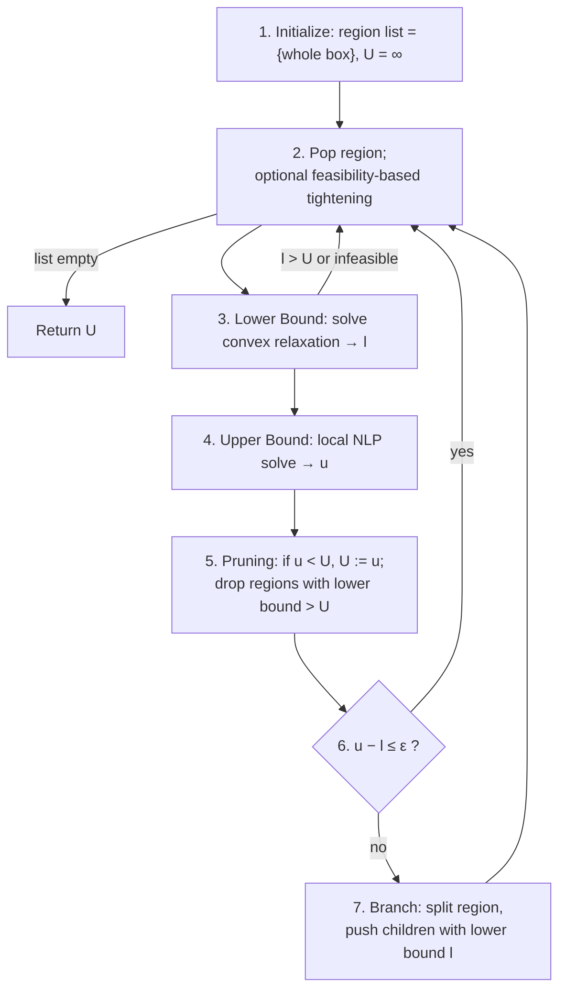
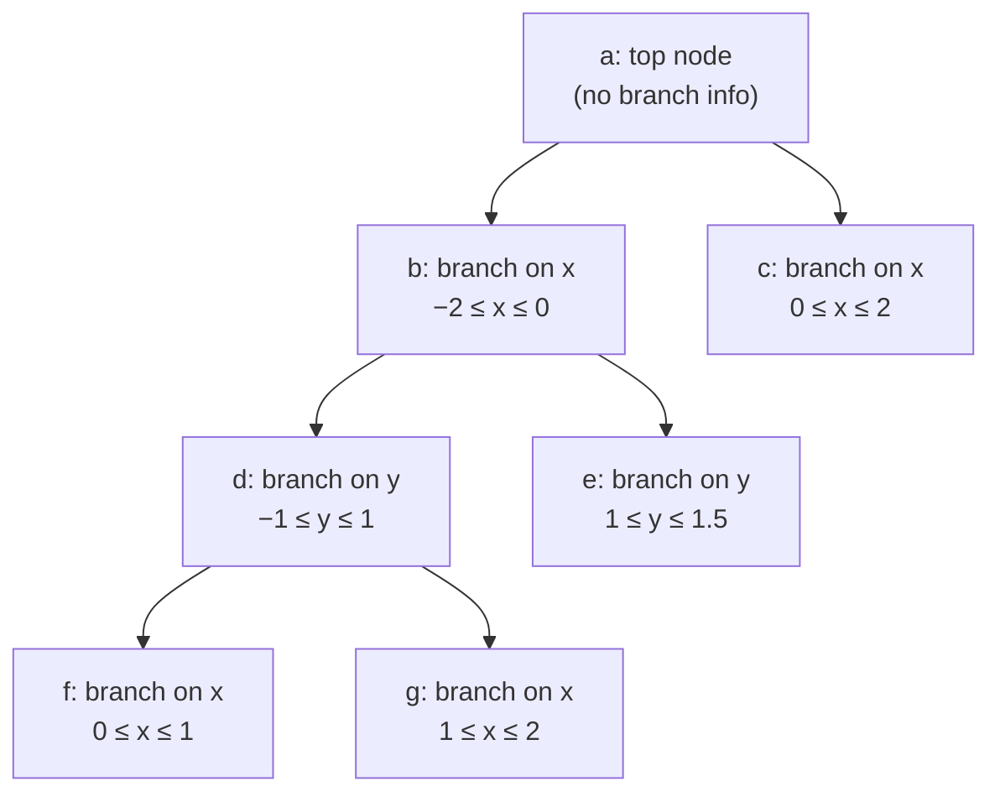

# Spatial Branch-and-Bound (sBB) Algorithms

[[book-guidelines|↩ Back to guidelines]]

## Why this chapter exists, and what problem it's solving

By the time Chapter 5 opens, the thesis has spent two chapters (2 and the review material in Chapter 1, §1.4) establishing an abstract schema — **Branch-and-Select** — and proving that it converges to the global optimum *provided* the selection rule is "exact" (it never discards a region that could contain the optimum, and the regions it does keep shrink to nothing). That theorem tells you convergence is *possible*. It says nothing about how to actually build a working, efficient instance of the schema for a **nonconvex nonlinear program (NLP)**.

Chapter 5's job is to fill that gap for the specific case where the search space isn't a discrete set of integer assignments (as in classic MILP Branch-and-Bound) but a *continuous* box in $\mathbb{R}^n$ that has to be split geometrically, along a variable's range, at each branching step — hence **spatial** Branch-and-Bound. The chapter first gives the generic sBB loop shared by essentially every algorithm in this family (§5.1), then works through the specific instantiation the thesis builds on — **Smith's sBB algorithm** (§5.2) — in enough mechanical detail that you could implement it, and finally proposes two concrete efficiency fixes to that mechanism (§5.3). Chapter 1, §1.5, previews the punch line in one sentence worth keeping in mind throughout: *unlike MILP relaxation (drop integrality, get one canonical LP relaxation), a nonconvex NLP has no single canonical convex relaxation* — which is exactly why so much of this chapter is about how the relaxation gets built.

**What breaks without a spatial variant:** ordinary MILP Branch-and-Bound branches by fixing an integer variable to one of finitely many values — the tree has bounded depth and finite branching factor "for free," because the domain is discrete. A continuous variable has no such structure: you can't enumerate "the values of $x$." sBB solves this by branching on *ranges*: pick a point, split $[x^L, x^U]$ into $[x^L, \hat x]$ and $[\hat x, x^U]$, and recurse. Convergence now depends on the *shrinking* of ranges driving the gap between the relaxation's lower bound and a feasible point's upper bound to zero — not on hitting a finite set of leaves.

## The generic sBB loop

Every sBB algorithm surveyed in §5.1 — the thesis names Ryoo & Sahinidis's **Branch-and-Reduce** (heavy emphasis on variable-range reduction), Floudas et al.'s **$\alpha$BB** (automatic convex underestimators for any twice-differentiable term), Pistikopoulos's **reduced-space Branch-and-Bound** (identify a small subset of variables worth branching on, up front), and a **Branch-and-Cut** framework that derives cutting planes from violated constraints — conforms to the same seven-step skeleton, solving:

$$
\begin{aligned}
\min_x \quad & f(x) \\
\text{s.t.} \quad & \alpha \le g(x) \le \beta \\
& a \le x \le b
\end{aligned} \tag{5.1}
$$

with $f$ and (components of) $g$ possibly nonconvex. The loop:

1. **Initialization.** Region list := $\{[a,b]\}$ (one region, the whole box). Tolerance $\varepsilon$. Incumbent $U := \infty$. *Optionally* run optimization-based bounds tightening once, up front.
2. **Choice of Region.** If the list is empty, stop — return $U$. Otherwise pop a region (the "current region"). *Optionally* run feasibility-based bounds tightening on it.
3. **Lower Bound.** Build a convex relaxation of (5.1) restricted to the current region; solve it to get $l$, a certified underestimate of the true optimum over that region. If $l > U$ or the relaxation is infeasible, this region is dead — go to step 2.
4. **Upper Bound.** Try to locally solve the original (still nonconvex) problem in this region to get a feasible point with value $u$; if that fails, $u := +\infty$.
5. **Pruning.** If $U > u$, update $U := u$ (found a better feasible point) and discard every region on the list whose lower bound exceeds $U$ — they're certified not to contain anything better.
6. **Check Region.** If $u - l \le \varepsilon$, this region's local optimum is $\varepsilon$-close to its true regional minimum — accept it, go to step 2.
7. **Branching.** Otherwise, split the region into sub-regions along some variable, inherit $l$ as their initial lower bound, push them onto the list, go to step 2.



Notice how directly this mirrors a **CDCL/CSP search loop**: step 3 (relaxation) is *constraint propagation over-approximating* the feasible region (an abstract-interpretation move: solve a sound, tractable relaxation of the real problem to get a guaranteed bound), step 4 is a *satisfying-assignment search* for a concrete witness, and steps 2 and 7 are the branch/backtrack machinery of any tree search over a partitioned space. Where CDCL prunes using learned clauses, sBB prunes using a numeric bound. Where CDCL's decision heuristic picks a variable to branch, sBB's is discussed next.

## Smith's sBB algorithm: making the relaxation *automatic*

Every instance of the generic loop needs an answer to "how, concretely, do I build the convex relaxation in step 3?" Most sBB variants at the time hand-tailor this to a restricted problem class (e.g. only bilinear/quadratic terms). **Smith's algorithm** (Smith & Pantelides, the basis for the thesis's own implementation) instead builds the relaxation *symbolically and automatically*, for essentially any NLP with a closed-form analytic expression — by treating the problem as a syntax tree of operators and recognizing which subexpressions are nonconvex.

Smith's algorithm targets NLPs of the equality-constrained form

$$
\begin{aligned}
\min_x \quad & f(x) \\
\text{s.t.} \quad & \bar g(x) = 0 \\
& a \le x \le b
\end{aligned} \tag{5.2}
$$

obtained from (5.1) by introducing slack variables to turn every inequality $\alpha \le g_i(x) \le \beta$ into an equality. (§5.3.1, below, will show this step is actually unnecessary — but it's how Smith originally set the problem up.)

### Stage 1: reformulation to standard form

The relaxation is built in two stages. First, the problem is rewritten into **Smith's standard form**, which isolates every nonlinear term into its own auxiliary "defining constraint" so the rest of the problem is purely linear:

$$
\begin{aligned}
\min \quad & x_{obj} & &\text{(5.3)}\\
& l \le Ax \le u & &\text{(5.4)}\\
x_k &= x_i x_j & \forall (i,j,k) \in \mathcal{M} & \quad\text{(5.5) — bilinear}\\
x_k &= x_i / x_j & \forall (i,j,k) \in \mathcal{D} & \quad\text{(5.6) — fractional}\\
x_k &= x_i^{\nu} & \forall (i,k,\nu) \in \mathcal{P} & \quad\text{(5.7) — power}\\
x_k &= f_\mu(x_i) & \forall (i,k,\mu) \in \mathcal{U} & \quad\text{(5.8) — univariate}\\
x^L &\le x \le x^U & &\text{(5.9)}
\end{aligned}
$$

$\mathcal{M}, \mathcal{D}, \mathcal{P}, \mathcal{U}$ are just index sets recording *which* variable triples participate in *which* kind of nonlinearity — a flattened, typed representation of the nonlinear part of the expression graph. Each defining constraint has the shape `added_variable = operand (binary op) operand` or `added_variable = (unary op) operand`, where an *operand* is either an original problem variable or one of these newly "added" ones — this distinction between **original** and **added** variables resurfaces as load-bearing in §5.3.2. Even the objective gets folded in this way: $f(x)$ is replaced by an added variable $x_{obj}$ constrained by $x_{obj} = f(x)$, so the *objective itself* is just another linear constraint (5.3) referencing whatever nonlinear defining constraints it needs.

**Why bother reducing to this recursive, term-by-term form at all?** Because it turns "find the convex relaxation of an arbitrary nonlinear expression" — a hard, unbounded problem in general — into "walk a finite list of *typed* atomic nonlinear terms and apply one relaxation rule per type." Reformulation to standard form is exactly a compiler's job: recursively lower a general expression AST into a small fixed instruction set (here: bilinear, fractional, power, univariate-function nodes) so that a later pass (convexification) never has to pattern-match on arbitrary expression shapes.

```python
# A tiny sketch of what "reformulation to standard form" is doing structurally —
# recursively factoring an expression tree into (linear part) + (typed nonlinear atoms).
from dataclasses import dataclass, field

@dataclass
class Standardizer:
    linear_rows: list = field(default_factory=list)   # rows of A x ~ b
    bilinear: list = field(default_factory=list)       # (i, j, k): x_k = x_i * x_j
    fractional: list = field(default_factory=list)     # (i, j, k): x_k = x_i / x_j
    power: list = field(default_factory=list)          # (i, k, nu): x_k = x_i ** nu
    univariate: list = field(default_factory=list)     # (i, k, mu): x_k = f_mu(x_i)
    next_var: int = 0

    def fresh(self):
        self.next_var += 1
        return f"x_added_{self.next_var}"

    def standardize(self, expr):
        """Recursively lower `expr` to a variable reference, emitting defining
        constraints for every nonlinear subexpression it contains."""
        match expr:
            case ("mul", a, b):
                va, vb = self.standardize(a), self.standardize(b)
                vk = self.fresh()
                self.bilinear.append((va, vb, vk))
                return vk
            case ("div", a, b):
                va, vb = self.standardize(a), self.standardize(b)
                vk = self.fresh()
                self.fractional.append((va, vb, vk))
                return vk
            case ("pow", a, nu):
                va = self.standardize(a)
                vk = self.fresh()
                self.power.append((va, vk, nu))
                return vk
            case ("call", name, a):
                va = self.standardize(a)
                vk = self.fresh()
                self.univariate.append((va, vk, name))
                return vk
            case ("var", name):
                return name
```

This is a real, if simplified, model of the "recursively tackling nonlinear terms ... forming linear and defining constraints as it goes along" procedure the thesis cites — Smith's actual algorithm additionally works to *minimize the number of new variables* (e.g. reusing an added variable if the same subexpression recurs), which this sketch omits for clarity.

### Stage 2: convexification — one rule per term type

With the problem in standard form, every defining constraint (5.5)–(5.8) gets replaced by a **convex envelope**: a pair (or more) of linear/convex inequalities that sandwich the true nonlinear relationship from above and below, tight at the current region's bounds $x^L, x^U$. The rules, verbatim from the thesis (§5.2.2.2):

1. **Bilinear**, $x_i = x_j x_k$ — replaced by the four **McCormick envelopes**:
   $$x_i \ge x_j^L x_k + x_k^L x_j - x_j^L x_k^L \qquad (5.10)$$
   $$x_i \ge x_j^U x_k + x_k^U x_j - x_j^U x_k^U \qquad (5.11)$$
   $$x_i \le x_j^L x_k + x_k^U x_j - x_j^L x_k^U \qquad (5.12)$$
   $$x_i \le x_j^U x_k + x_k^L x_j - x_j^U x_k^L \qquad (5.13)$$
   These are just the four "corner" bilinear-underestimator/overestimator planes obtained by expanding $(x_j - x_j^L)(x_k - x_k^L) \ge 0$ and the three analogous sign-definite products at the box corners — cheap to derive, and provably the *convex hull* of $\{(x_j, x_k, x_j x_k) : x_j \in [x_j^L,x_j^U], x_k \in [x_k^L, x_k^U]\}$.
2. **Fractional**, $x_i = x_j / x_k$ — reformulated to $x_i x_k = x_j$ and rule 1 applied.
3. **Concave univariate** ($x_i = f_\mu(x_j)$, $f_\mu$ concave) — sandwiched between the function itself (upper bound, since a concave function lies below its tangents but *above* nothing simpler — here it's used as an overestimator) and the **secant line** joining the endpoints (a valid *underestimator*, since a concave function lies above its chord):
   $$x_i \le f_\mu(x_j) \qquad (5.14)$$
   $$x_i \ge f_\mu(x_j^L) + \frac{f_\mu(x_j^U) - f_\mu(x_j^L)}{x_j^U - x_j^L}(x_j - x_j^L) \qquad (5.15)$$
4. **Convex univariate** — the mirror image: the secant becomes the *over*estimator, the function itself the underestimator.
   $$x_i \le f_\mu(x_j^L) + \frac{f_\mu(x_j^U) - f_\mu(x_j^L)}{x_j^U - x_j^L}(x_j - x_j^L) \qquad (5.16)$$
   $$x_i \ge f_\mu(x_j) \qquad (5.17)$$
5. **Fractional power**, $x_i = x_j^\nu$, $0 < \nu < 1$ — concave, handled as case 3.
6. **Even power**, $x_i = x_j^{2m}$ — convex, handled as case 4.
7. **Odd power**, $x_i = x_j^{2m+1}$ — the genuinely hard case: piecewise convex/concave with an inflection at $0$. If $[x_j^L, x_j^U]$ doesn't straddle zero, it's globally convex or concave and reduces to case 6 or 5. If it *does* straddle zero, Smith's original algorithm has no envelope at all — this is precisely the open gap the thesis's own Chapter 4 (the odd-degree-monomial convex/concave envelope) fills, and this section says as much explicitly, recommending its own Chapter 4 construction be plugged in here.

```rust
// A minimal, directly runnable model of McCormick's four bilinear envelope
// inequalities (5.10)-(5.13). In a real convexifier these become rows appended
// to an LP/NLP relaxation; here we just check whether a candidate (xi, xj, xk)
// point satisfies the envelope for a given box [xj_l,xj_u] x [xk_l,xk_u].
#[derive(Clone, Copy, Debug)]
struct Box { lo: f64, hi: f64 }

fn mccormick_feasible(xi: f64, xj: f64, xk: f64, bj: Box, bk: Box) -> bool {
    let lb1 = bj.lo * xk + bk.lo * xj - bj.lo * bk.lo; // (5.10)
    let lb2 = bj.hi * xk + bk.hi * xj - bj.hi * bk.hi; // (5.11)
    let ub1 = bj.lo * xk + bk.hi * xj - bj.lo * bk.hi; // (5.12)
    let ub2 = bj.hi * xk + bk.lo * xj - bj.hi * bk.lo; // (5.13)
    xi >= lb1.max(lb2) - 1e-9 && xi <= ub1.min(ub2) + 1e-9
}

// The envelope tightens automatically as the box shrinks during branching —
// this is the geometric content of sBB's convergence: as x_j, x_k ranges → 0,
// all four planes converge onto the bilinear surface itself.
fn envelope_width(bj: Box, bk: Box) -> f64 {
    // A crude proxy for relaxation gap: the envelope is exact (width 0) exactly
    // when one of the two boxes has zero width.
    (bj.hi - bj.lo) * (bk.hi - bk.lo)
}
```

**What breaks without symbolic, term-typed convexification:** without recognizing *which* rule applies to *which* subexpression, you're forced either into a fully numerical, black-box underestimation scheme (like $\alpha$BB's diagonal-shift-matrix approach for *any* twice-differentiable term — general but typically far looser, since it doesn't exploit the specific algebraic shape of a bilinear or power term) or into hand-coding a relaxation per problem, which doesn't scale to a general-purpose solver. Symbolic term recognition is what lets one solver automatically relax pooling problems, distillation-column models, and portfolio-optimization NLPs alike.

### Region choice, branching point, and branch variable

- **Region choice (step 2)** is deliberately simple: always pop the region with the *lowest lower bound* — a best-first strategy, analogous to A\* search using $l$ as the admissible heuristic. It's the region "most likely" to still contain the global optimum, since every other region has already been certified to have a *worse* best-case value.
- **Branching point.** Smith uses the solution of the *upper*-bounding NLP (step 4) if one was found, else the lower-bounding relaxation's solution. From that point, it finds the nonconvex term with the *largest violation* against its own convex envelope — i.e. the term contributing the most looseness to the current relaxation.
- **Branch variable.** Among the variables in that worst-violating term, pick the one whose value at the branching point sits closest to the midpoint of its current range. This is a reasonably balanced-partition heuristic — it tends to shrink the offending term's range roughly in half on both children, rather than producing one near-empty child and one nearly-unchanged one.

This is worth pausing on from a CSP-solver lens: branching-variable selection here is functionally the same design decision as *decision-heuristic* selection in a CSP/SAT solver (which variable to assign next) — except the "score" here is a numeric infeasibility/looseness measure derived from the current relaxation's slack, rather than a VSIDS-style activity count. Both are heuristics for "which decision most reduces the remaining search"; sBB just has a numerically continuous notion of "how wrong is this relaxation" to exploit that a discrete CSP solver doesn't.

### Bounds tightening: propagation, sBB-style

Two schemes tighten variable ranges — i.e., they shrink $[x^L, x^U]$ *before* the relaxation is even built, which tightens every subsequent McCormick/secant envelope for free, since all of them are parameterized directly by the current box bounds.

**Optimization-based bounds tightening (step 1).** For each of the $n$ variables, solve (roughly) $2n$ auxiliary convex NLPs/LPs — minimize and maximize $x_j$ subject to the current convex relaxation's constraint set — iterating until the bounds converge. This is expensive (each iteration is $O(n)$ relaxation solves), so it's normally done exactly once, at the very start, on the whole box.

**Feasibility-based bounds tightening (step 2).** Much cheaper, so it's applied at *every* region, not just once. For linear constraints $l \le Ax \le u$, it isolates each variable $x_j$ on one side and uses interval arithmetic on the rest of the row to bound the extremal values it could take:

$$
x_j \in \Big[\max\Big(x_j^L, \min_i \tfrac{1}{a_{ij}}\big(l_i - \sum_{k \ne j}\max(a_{ik}x_k^L, a_{ik}x_k^U)\big)\Big),\ \min\Big(x_j^U, \max_i \tfrac{1}{a_{ij}}\big(u_i - \sum_{k\ne j}\min(a_{ik}x_k^L, a_{ik}x_k^U)\big)\Big)\Big] \quad \text{if } a_{ij} > 0
$$

(with the max/min roles swapped when $a_{ij} < 0$). Smith notes ([114], p.202) that this can be extended to certain nonlinear constraints too.

**This is textbook interval-constraint propagation** — exactly the mechanism an abstract-interpretation-based analyzer uses to narrow variable domains under a linear/interval abstract domain, and exactly what a CSP solver's arc-consistency / bounds-consistency propagator does with a linear constraint over a finite domain. The isomorphism is precise enough to be worth stating outright: *feasibility-based bounds tightening is domain propagation over the interval abstract domain, applied to the linear part of Smith's standard form.* If you're building a CHC/Horn-clause invariant generator with interval or octagon domains, this is the same fixpoint-narrowing idea, just specialized to $\le/\ge$ linear rows instead of program guards.

```python
def feasibility_tighten_linear(A, l, u, xL, xU):
    """One sweep of feasibility-based bounds tightening on l <= A x <= u.
    A: list of rows (dicts var_index -> coeff). xL, xU: mutable bound lists.
    This is interval constraint propagation restricted to linear rows."""
    n = len(xL)
    for row_idx, row in enumerate(A):
        for j, a_ij in row.items():
            if a_ij == 0:
                continue
            # sum over k != j of interval-extremal a_ik * x_k
            lo_sum = sum(min(a_ik * xL[k], a_ik * xU[k])
                         for k, a_ik in row.items() if k != j)
            hi_sum = sum(max(a_ik * xL[k], a_ik * xU[k])
                         for k, a_ik in row.items() if k != j)
            if a_ij > 0:
                new_lo = (l[row_idx] - hi_sum) / a_ij
                new_hi = (u[row_idx] - lo_sum) / a_ij
            else:
                new_lo = (u[row_idx] - lo_sum) / a_ij
                new_hi = (l[row_idx] - hi_sum) / a_ij
            xL[j] = max(xL[j], new_lo)
            xU[j] = min(xU[j], new_hi)
    return xL, xU
```

## Two improvements the thesis proposes to Smith's algorithm

Both improvements are pure *implementation* wins — they provably don't change what the algorithm converges to, only how much work it does to get there. This matters because it demonstrates a point the thesis returns to repeatedly: correctness and efficiency of an sBB implementation are almost entirely separable concerns once the relaxation and branching rules are fixed.

### §5.3.1 — Avoiding slack variables in standardization

Recall Smith's problem form (5.2) requires pure equalities $\bar g(x) = 0$, obtained by converting each two-sided inequality constraint $\alpha \le g(x) \le \beta$ into an equality via a slack variable. Since the generic form (5.1) has *two* inequalities per constraint (a lower and an upper bound), this **doubles** the number of slack variables added — and more variables directly means a bigger, slower relaxation to solve at every single node of the search tree.

The fix is an observation about what the standardization procedure actually touches: it only ever inspects the *expression* $g(x)$ inside a constraint, never whether the relational operator is $=$, $\le$, or $\ge$. So standardization can be applied directly to the inequality-form constraint, and the resulting defining constraints are exactly the same either way — the slack variable was never load-bearing for the reformulation step, only for the (unnecessary) uniformity of forcing everything into equality form first.

**What breaks without this fix:** nothing breaks — it's strictly a size reduction. But every added variable propagates through every relaxation and every local-solver call for the rest of the run; for a problem where most constraints are inequalities, this can be a very large constant-factor speedup with zero cost.

### §5.3.2 — Avoiding redundant local optimizations during branching

This is the more interesting fix, and it hinges on the **original vs. added variable** distinction introduced back in the standard-form definition. Two situations let you skip a call to the (expensive, nonconvex) local upper-bounding solve entirely:

**Branching on an added variable.** The upper-bounding problem — the *original* nonconvex NLP — never references added variables at all; they only exist inside the defining constraints of the *relaxation*. So if the branch variable is an added variable, splitting the region changes the *lower*-bounding relaxation (which does reference it), but the upper-bounding problem is *identical* in both children and in the parent. Without this fix, the same exact NLP gets locally solved three times — once for the parent, once per child — for literally no new information. The fix: cache the parent's upper bound and reuse it in both children whenever the branch variable is an added one.

**Branching on an original variable.** Here the upper-bounding problem *does* change between children (its variable ranges genuinely differ) — but there's still a cheap check available. If branching on $x_j \in [x_j^L, x_j^U]$ splits it into $[x_j^L, \hat x_j]$ and $[\hat x_j, x_j^U]$, and the *parent's* upper-bounding solution happened to land at a point where $x_j \le \hat x_j$, that same feasible point is *also* feasible for the left child (its range only got smaller, and the point already satisfies the tighter bound) — so its objective value is already a valid upper bound for that child, and there's no need to re-solve. The right child, whose range excludes the parent's optimal point, still needs a fresh solve.

```rust
// Sketch: deciding whether an upper-bounding NLP solve can be skipped when
// branching a region on variable `branch_var`, per §5.3.2.
enum VarKind { Original, Added }

struct ParentSolution {
    branch_var_value: f64,
    upper_bound: Option<f64>, // None if the parent's local solve failed
}

fn needs_upper_bound_solve(
    kind: VarKind,
    parent: &ParentSolution,
    child_range: (f64, f64), // (lo, hi) of branch_var in this child
) -> bool {
    match (kind, parent.upper_bound) {
        // §5.3.2.1: branching on an added variable never changes the
        // original (upper-bounding) problem — reuse the parent's bound.
        (VarKind::Added, Some(_)) => false,
        (VarKind::Added, None) => true, // parent solve failed; must retry
        // §5.3.2.2: branching on an original variable — reuse only if the
        // parent's optimal branch-var value already lies in this child's range.
        (VarKind::Original, Some(_)) => {
            let (lo, hi) = child_range;
            !(parent.branch_var_value >= lo && parent.branch_var_value <= hi)
        }
        (VarKind::Original, None) => true,
    }
}
```

Together, the thesis reports these two rules should "at least halve" the number of upper-bounding solves performed over the course of a run — a substantial saving, since local NLP solves are consistently the most expensive per-node operation in the loop.

## Storing the region list as a tree

One more structural idea worth pulling in from the neighboring §5.5.3, because it directly completes the picture of "how do you actually implement step 2 (the region list) without wasting memory": a region is, in the abstract, just a full list of $n$ variable ranges — so storing every region explicitly costs $O(n)$ space, and every branching step would naively *copy* an entire $O(n)$-sized region to produce each child.

But branching only ever changes **one** variable's range per split; every other variable's bounds are inherited unchanged from the parent. So the thesis stores the region list as an actual **tree**, where each node holds only:

- the branch variable that produced this node, and its (new, narrower) range;
- a pointer to the parent node;
- this region's lower and upper objective bounds;
- a flag recording whether an upper bound is already available without recomputation (this is exactly the §5.3.2 caching mechanism, made concrete as one bit of per-node state).

To recover the *full* set of variable ranges for any node, walk up the tree via parent pointers, and for each variable, take the range recorded at the first ancestor (closest to the node) that branched on it — falling back to the original problem's bounds for any variable no ancestor on the path ever branched on.



(This reproduces the thesis's own Fig. 5.2 example. Note node $f$ branches on $x$ *again*, further narrowing the $x$-range already fixed at node $b$ — walking up from $f$, you take $f$'s own $x$-range first since it's the closest ancestor that mentions $x$, and only fall through to $b$'s range for variables $f$ doesn't itself branch on.)

```rust
use std::rc::Rc;

struct RegionNode {
    parent: Option<Rc<RegionNode>>,
    branch_var: Option<usize>,       // None only at the top node
    range: Option<(f64, f64)>,
    lower_bound: f64,
    upper_bound: Option<f64>,
    upper_bound_cached: bool,        // the §5.3.2 flag
}

/// Reconstruct the full n-dimensional box for a node by walking to the root,
/// taking the *first* (closest-ancestor) range recorded for each variable.
fn full_ranges(node: &Rc<RegionNode>, original: &[(f64, f64)]) -> Vec<(f64, f64)> {
    let mut ranges = original.to_vec();
    let mut marked = vec![false; ranges.len()];
    let mut cur = Some(Rc::clone(node));
    while let Some(n) = cur {
        if let (Some(v), Some(r)) = (n.branch_var, n.range) {
            if !marked[v] {
                ranges[v] = r;
                marked[v] = true;
            }
        }
        cur = n.parent.clone();
    }
    ranges
}
```

This is the same space/time trade-off a **persistent data structure** (or a version-control system, or an incremental type-checker's context) makes: rather than copying the whole state at every step, share the unmodified prefix and record only the delta. If you've built a Rust `im`-style persistent map or a Lean-style local context extended by `Context.push`, this is the identical move — a search tree of *diffs*, not of *snapshots*.

## Named sBB variants, briefly

§5.1 name-drops the landscape this chapter's contribution sits inside; worth having the map, even without full detail on each:

- **$\alpha$BB** — automatic convex underestimation for *any* twice-differentiable nonconvex term, via a diagonal shift (adding $\alpha \sum (x_i - x_i^L)(x_i^U - x_i)$ to make the Hessian PSD everywhere on the box) — more general than Smith's term-typed rules, but typically looser, since it doesn't exploit a term's specific algebraic structure the way McCormick envelopes exploit bilinearity.
- **Branch-and-Reduce** — an sBB with its main emphasis on aggressive variable-range reduction (i.e., leaning hard on the bounds-tightening machinery above) to shrink the search tree.
- **Reduced-space Branch-and-Bound** — identifies *a priori* a small subset of variables actually worth branching on, cutting the effective branching factor of the tree.
- **Branch-and-Cut** — augments the loop with cutting planes derived from violated constraints in related sub-problems, closer in spirit to MILP Branch-and-Cut.
- **BARON** — the best-known production-grade sBB solver, later chapters compare against it directly; it adds its own convexification rules for concavoconvex univariate terms and branches specifically on curvature turning points, plus range-reduction machinery Liberti's own $\mathcal{OS}$-based implementation notably lacks (per the thesis's own concluding remarks in Chapter 6).

All five are the *same* seven-step loop from §5.1, differentiated only by which optional step gets the most engineering attention, or how the relaxation (step 3) gets built. That's the chapter's real thesis in miniature: the algorithmic skeleton is fixed and well-understood; essentially all the research contribution room is in the *formulation* and *relaxation-construction* machinery layered on top of it.

## Where this leads

Chapter 5's Smith-algorithm mechanics are the direct prerequisite for everything downstream in the thesis: Chapter 7's convex/linear relaxation techniques (McCormick, $\alpha$BB, BARON's relaxation, RLT) are all elaborations of exactly the convexification step sketched here; Chapter 3's reduction constraints and Chapter 4's odd-degree-monomial envelopes are both, structurally, *better versions of one rule in the §5.2.2.2 list* — Chapter 4 literally patches the missing case-7 gap this article flagged above. And the region-tree and redundant-solve-avoidance material (§5.3, §5.5.3) is exactly what gets realized in code in the $\mathcal{OS}$ software framework covered next (§5.4–5.5), where the `opssolvermanager`/`convexifiermanager` split is the object-oriented embodiment of "lower-bounding solver, upper-bounding solver, and a convexifier that watches variable-range changes and updates the relaxation on the fly."

For the standing project: this chapter is close to a direct blueprint for a **CHC/Horn-clause solving or refinement-type constraint-solving backend** built around branch-and-prune search with an abstract (interval/relaxation) domain for pruning and a concrete solver for witness-finding — precisely the CEGAR shape (over-approximate, check, if the abstract witness isn't concrete, refine/branch and retry) that a CSP kernel searching for counterexamples to type invariants would need. The region-tree-as-persistent-structure idea, in particular, is a pattern worth carrying straight into a Rust proof-search or elaboration context stack: don't copy the whole context at each metavariable/branch point, store the delta and a parent pointer.
