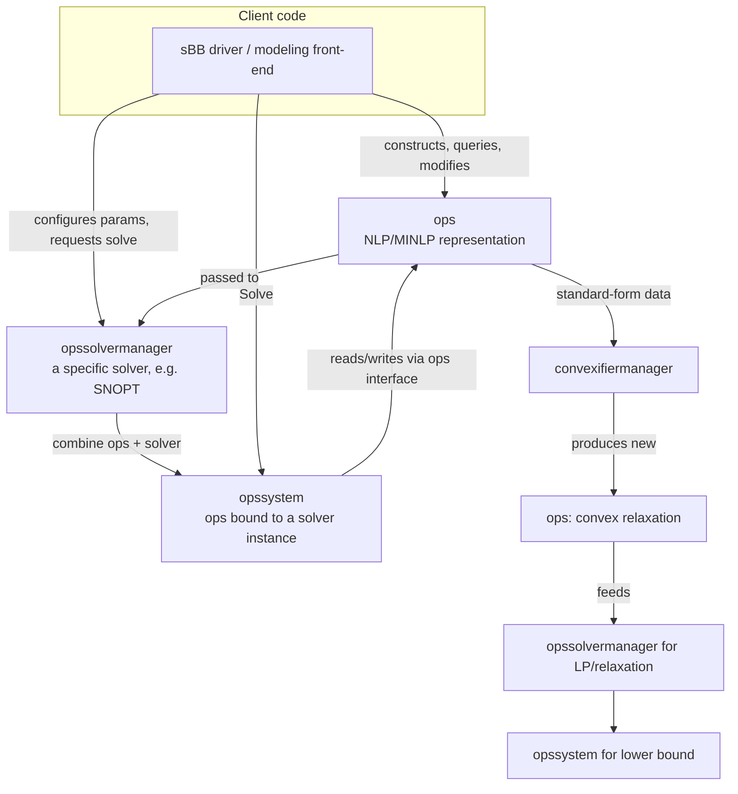

# The $\mathcal{OS}$ Software Framework

[[book-guidelines|↩ Back to guidelines]]

## Why a thesis about convex relaxations ends in a chapter about software architecture

Every earlier chapter of this thesis is about a mathematical object: an envelope, a reduction constraint, a standard form. But none of that mathematics runs on its own. Somewhere, a piece of code has to hold the constraints, know their sparsity pattern, differentiate them, rewrite them into a convex relaxation, hand that relaxation to an LP solver, hand the original problem to an NLP solver, and repeat this thousands of times as the spatial Branch-and-Bound (sBB) tree grows. That "somewhere" is the actual bottleneck of practical global optimization, and Liberti spends §5.4–5.6 designing it properly, then documents the result — $\mathcal{OS}$, "object-oriented OPtimization System" — in a 63-page reference manual (Appendix A).

This is worth taking as seriously as the math, for a reason that generalizes past optimization: **any tool that must symbolically manipulate a program-like object — differentiate it, rewrite it, relax it, re-run it under perturbed inputs — needs an architecture that separates the *representation* of that object from the *procedures* that act on it.** That is precisely the shape of a compiler's IR versus its passes, or a proof assistant's term representation versus its tactics. Liberti's $\mathcal{OS}$ is a smaller, more concrete instance of the same problem you'll face building a verifying compiler: you need a data structure that is simultaneously numerically evaluable, structurally introspectable, and symbolically differentiable/rewritable — and you need solver "backends" that consume it uniformly.

## The problem: what does an sBB code actually need to know?

Liberti opens §5.4 by listing exactly what information a general-purpose sBB implementation requires about the problem it is solving (p. 114–115):

1. **Numerical information** — the kind a local solver wants: objective and constraint *values* at a point, i.e. the ability to evaluate the problem like a black-box function.
2. **Structural information** — the *sparsity pattern* of the constraints (which variables appear in which constraints), needed both for solver efficiency and for the reformulation algorithms of Chapter 3, which are explicitly graph-theoretic and need to see the bipartite variable/constraint incidence structure.
3. **Symbolic information** — the actual algebraic *form* of the objective and constraints, needed to do reformulation and convexification at all (you cannot rewrite $x^3 \to$ McCormick-style envelope terms if all you have is a numeric evaluator).

**What breaks without this separation:** if you only had numerical information (a callback `f(x) -> value`), you could run a local solver but never build a convex relaxation — you'd have no way to know *which* nonlinear terms need replacing or how. If you only had symbolic information without fast structural/numerical access, every solver iteration would pay the cost of re-parsing an expression tree. sBB genuinely needs all three simultaneously and needs them to stay *consistent* as the problem gets rewritten (standardized, relaxed, re-bounded) hundreds of times during the search. That consistency requirement is what forces an object-oriented design rather than a loose collection of functions passing arrays around.

This is the same argument that justifies separating a compiler's AST from its later IRs: the AST needs to support pretty-printing and further elaboration (symbolic), the IR needs to support constant folding and dataflow (structural), and codegen needs concrete values (numerical) — but they must all agree on what program they describe.

## Design decision: everything is object-oriented, in C++

Liberti is explicit about the choice of C++ (p. 116): object-oriented for the modeling discipline, but "low-level enough to leave memory management to the programmer" — i.e., no garbage collector getting in the way of tight numerical loops, but with the abstraction facilities (interfaces, polymorphism) needed to plug in arbitrary solver backends. $\mathcal{OS}$ is not a standalone application; it's a library exposing an API to client code (§5.4.1) — the client could be an sBB driver, a modeling front-end, or (as the CAPE-OPEN connection later shows) an entire chemical-process simulator.

The other pillar of the design (point 2, p. 116) is **structured, multidimensional variables and constraints**: instead of forcing the client to declare ten thousand scalar variables one at a time, $\mathcal{OS}$ lets you declare a variable *set* like $x_{r,t}$ (resource $r$ at time $t$) as one object with an arbitrary number of index dimensions, and a *slice* mechanism (Appendix A.2.2) for referring to sub-ranges of an index — e.g. "all $t$, fixed $r$." Formally, a slice $S$ of an $n$-dimensional set is given by lower/upper index vectors $\ell, u \in \mathbb{Z}^n$, and an element $(i_1,\dots,i_n)$ belongs to $S$ iff $\ell_j \le i_j \le u_j$ for all $j$ — a bounding box in index space, exactly the shape of a NumPy/array-slice or a Rust range-indexed tensor view.

```rust
// A direct structural analogue of an OS "multidimensional set" + "slice".
// Not from the book — an original illustration of the same idea in Rust.

#[derive(Clone, Copy, Debug)]
struct Slice<const N: usize> {
    lo: [i64; N],
    hi: [i64; N],
}

impl<const N: usize> Slice<N> {
    fn contains(&self, idx: [i64; N]) -> bool {
        (0..N).all(|j| self.lo[j] <= idx[j] && idx[j] <= self.hi[j])
    }
}

// A structured (multidimensional) variable set, e.g. x_{r,t}.
struct VariableSet<const N: usize> {
    name: String,
    dims: [i64; N],       // dimensionality size
    lb: Vec<f64>,
    ub: Vec<f64>,
    value: Vec<f64>,
    is_integer: bool,
}
```

The point of this isn't that Rust arrays are novel — it's that $\mathcal{OS}$'s "structured" layer is an explicit acknowledgment that **the natural unit of a real optimization model is an indexed family, not a scalar**, and that the software should track that structure as first-class metadata rather than flattening it away immediately. It flattens it later, deliberately, for solver consumption (next section) — but the structure is preserved as long as possible because the reformulation algorithms of Chapter 3 need to see the original index sets, not just an anonymous vector of numbers.

## The four object classes, and why exactly these four

§5.4.2 names four classes; this is the load-bearing architectural decision of the chapter.



- **`ops`** — the *problem*. A software object representing one NLP/MINLP: its variables, constraints, objective, in structured, flat, and standard forms simultaneously, plus the machinery to construct and modify all of that.
- **`opssolvermanager`** — a *solver*, reified as an object. Given any `ops` object, it can produce an `opssystem` binding that problem to that particular numerical code (SNOPT, CPLEX, ...).
- **`opssystem`** — the *combination* of one `ops` and one solver: configure algorithmic parameters, call `Solve()`.
- **`convexifiermanager`** — takes an `ops` describing a non-convex problem and produces *another* `ops` describing a convex relaxation of it, with an `UpdateConvexVarBounds()` method for cheaply refreshing that relaxation as variable bounds change (this is what makes the design usable inside an sBB inner loop rather than merely for one-off relaxation).

**Why exactly this split, and not (say) one monolithic "Problem+Solver" object?** Because sBB genuinely needs to hold *two* `ops` objects alive simultaneously — the original NLP and its convex relaxation — and needs to bind each to a *different* solver (a local NLP solver for the original, an LP/NLP solver for the relaxation), while both objects must stay synchronized as branching narrows variable ranges. If `ops` and solver were fused into one class, you could not swap solvers without rewriting the problem representation, and you could not cheaply keep two live problem/solver pairs whose problems are related by a *transformation* (convexification) rather than being independent. The separation is the same reasoning that keeps a compiler's IR independent of its backend: one IR, many possible codegen targets, and passes (here: convexification) that produce a *new* IR object related to but distinct from the input.

This is close enough to a trait-object design that it's worth writing out directly — this is the one place in the thesis where "sketch it as real Rust" earns its keep, because the book's own separation of concerns *is* an interface-segregation argument:

```rust
// Sketch of the OS object relationships as Rust traits.
// Faithful to the *relationships* Liberti describes in §5.4.2/§5.5.1,
// not a transcription of the C++ API in Appendix A.

/// A software representation of an NLP/MINLP: variables, constraints,
/// objective, in structured, flat, and standard-form views.
trait Ops {
    fn num_variables(&self) -> usize;
    fn variable_bounds(&self, idx: usize) -> (f64, f64);
    fn set_variable_bounds(&mut self, idx: usize, lb: f64, ub: f64);
    fn evaluate_objective(&self, x: &[f64]) -> f64;
    fn evaluate_constraints(&self, x: &[f64]) -> Vec<f64>;
    fn constraint_jacobian(&self, x: &[f64]) -> SparseMatrix; // symbolic diff, evaluated
    fn standard_form(&self) -> StandardForm;                  // Smith's standard form, §5.2
}

/// One numerical solver, reified as an object: given any Ops, it can
/// bind that problem to this solver code and hand back a solvable system.
trait OpsSolverManager {
    fn get_parameter_list(&self) -> Vec<(String, ParamValue)>;
    fn set_parameter(&mut self, name: &str, value: ParamValue);
    fn new_system(&self, problem: Box<dyn Ops>) -> Box<dyn OpsSystem>;
}

/// The bound combination of one Ops and one solver.
trait OpsSystem {
    fn solve(&mut self) -> SolutionStatus;
    fn get_solution_status(&self) -> SolutionStatus;
}

/// Takes a non-convex Ops, returns a *new* Ops describing its convex
/// relaxation, and supports cheap on-the-fly bound updates without
/// rebuilding the relaxation from scratch.
trait ConvexifierManager {
    fn get_convex_minlp(&self) -> Box<dyn Ops>;
    fn update_convex_var_bounds(&mut self, lb: &[f64], ub: &[f64]);
}
```

Every method here has a direct counterpart in Appendix A: `Ops::variable_bounds`/`set_variable_bounds` mirror `GetVariableInfo`/`SetVariableBounds` (A.4.4.1, A.4.3.2); `OpsSolverManager::new_system` mirrors `NewMINLPSystem` (A.5.4.3); `ConvexifierManager::get_convex_minlp`/`update_convex_var_bounds` are the book's own `GetConvexMINLP`/`UpdateConvexVarBounds` (A.6.1.2–3) verbatim in name and signature.

## Constructing an NLP: symbolic, not numeric, all the way down

Point 3 of §5.4.1 (p. 117) is easy to skim past but is the crux of the whole design: **an `ops` object is built symbolically.** The client doesn't hand $\mathcal{OS}$ a compiled function pointer for "evaluate this constraint" — it issues a *sequence of calls* that build the expression term-by-term, factor-by-factor (Appendix A.4.2.6–A.4.2.9: `NewConstantExpression`, `NewVariableExpression`, `BinaryExpression`, `UnaryExpression`). The result is that $\mathcal{OS}$ holds an actual expression tree, not a black box, and can therefore:

- evaluate it numerically at any point (`EvalFlatMINLPNonlinearConstraint`),
- differentiate it symbolically in closed form (`GetFlatMINLPConstraintDerivatives` — "exact partial derivatives" via "symbolic differentiation," footnote 3, p. 117),
- rewrite it (this is what convexification and Chapter 3's reduction constraints ultimately operate on).

This is exactly the discipline you'd want from an elaborator's core term representation: an AST-like object that supports evaluation, structural traversal, and *substitution/rewriting*, rather than a black-box closure. $\mathcal{OS}$'s `FlatExpression` interface (A.6.2) is a minimal visitor-style API over this tree — `GetKind()` tells you whether a node is a constant, a variable, or an operator, and `GetOperand()` walks the children — which is worth writing as the Rust `enum` it obviously is:

```rust
// FlatExpression, as an OS client would traverse it (A.6.2), recast
// as the algebraic-data-type it's clearly trying to be under a C++
// class hierarchy with a GetKind() discriminator.

enum FlatExpression {
    Constant(f64),
    Variable { flat_index: usize },
    Operator {
        op: OperatorKind,          // Sum, Difference, Product, Power, Sin, ...
        operands: Vec<FlatExpression>,
    },
}

impl FlatExpression {
    fn eval(&self, x: &[f64]) -> f64 {
        match self {
            FlatExpression::Constant(c) => *c,
            FlatExpression::Variable { flat_index } => x[*flat_index],
            FlatExpression::Operator { op, operands } => {
                op.apply(&operands.iter().map(|o| o.eval(x)).collect::<Vec<_>>())
            }
        }
    }

    /// Symbolic differentiation — structural recursion over the tree,
    /// exactly the closed-form partials §5.4.1 point 7 describes.
    fn diff(&self, wrt: usize) -> FlatExpression {
        match self {
            FlatExpression::Constant(_) => FlatExpression::Constant(0.0),
            FlatExpression::Variable { flat_index } if *flat_index == wrt =>
                FlatExpression::Constant(1.0),
            FlatExpression::Variable { .. } => FlatExpression::Constant(0.0),
            FlatExpression::Operator { op, operands } => op.chain_rule(operands, wrt),
        }
    }
}
```

**What breaks without symbolic construction:** if the client only ever supplied numeric evaluators, $\mathcal{OS}$ could still *solve* the original NLP with a local solver, but it could never build a convex relaxation, because "replace this bilinear term with its McCormick envelope" is an operation on the *symbolic* representation of the term, not on its numeric value at one point. Symbolic construction is what makes the convexifier possible at all — it's the same reason a type checker needs the actual syntax tree of an expression, not just its runtime value, to typecheck it.

## Three views of the same problem: structured, flat, standard-form

$\mathcal{OS}$ never forces a single representation. Every `ops` object simultaneously offers (Appendix A.4.4, A.4.5, A.4.6):

- **Structured form** — the multidimensional-set view the client authored the model in (`GetVariableInfo`, `GetConstraintInfo` indexed by name + index tuple).
- **Flat form** — everything collapsed into one-dimensional vectors (point 4, p. 116–117), because numerical solvers universally want a flat vector of variables and a flat vector of constraint residuals, regardless of how the model was conceptually structured. `GetFlatMINLPSize`/`GetFlatMINLPStructure` expose this.
- **Standard form** — Smith's standard form from §5.2 (linear constraints plus "defining constraints" isolating each nonlinear term), automatically derived and exposed via `GetSFMatrix`, `GetSFNonlinearConstraint`, etc. (A.4.6). This is *the* representation the convexifier consumes (A.6.1: "gets its input data from the MINLP in standard form").

The reason for keeping all three alive rather than picking one: each consumer wants a different one. The reformulation algorithms of Chapter 3 want structural/sparsity information tied to the *original* named constraint sets (structured form, so a reduction constraint on "the resource-balance constraints for $t = 5$" is meaningful). A generic local solver just wants flat vectors and doesn't care about the model's index semantics. The convexifier specifically wants standard form because that's the representation Smith's convexification rules (McCormick envelopes for bilinear defining constraints, secant/tangent envelopes for univariate ones, cf. §5.2.2) are stated over. $\mathcal{OS}$ derives all three automatically from one symbolic construction, so the client authors the model once and gets every view for free — the multi-representation analogue of a compiler that derives its SSA form and its flat bytecode from one shared AST, rather than requiring the front-end to emit each independently.

## Putting it together: the typical client scenario and the sBB solver

§5.4.3's typical usage sequence is the concrete instantiation of the class diagram above: (1) build an `ops`; (2) create an `opssolvermanager` for the chosen solver; (3) configure its parameters; (4) combine them into an `opssystem`; (5) call `Solve()`, during which the solver repeatedly queries structural info, evaluates the objective/constraints, evaluates derivatives, and updates variable values; (6) read the solution back out of the `ops` object.

§5.5 then shows that the sBB solver Liberti built is *itself* just a client of this API, using **two sub-solvers plus a convexifier**, each itself $\mathcal{OS}$-compliant:

1. An `opssolvermanager` for a **local NLP solver** (SNOPT in the implementation) bound to the *original* `ops` → an upper-bounding `opssystem`.
2. A `convexifiermanager` that, from that same original `ops`, produces a **relaxed `ops`** (a linear relaxation in the actual implementation, using the standard-form data).
3. An `opssolvermanager` for an **LP solver** (CPLEX) bound to the relaxed `ops` → a lower-bounding `opssystem`.
4. Inside the branch-and-bound loop: call `Solve()` on both systems at each region; on branching, call `UpdateConvexVarBounds()` on the convexifier rather than reconstructing the relaxation.

The dependency-link mechanism (§5.5.2) is the engineering payoff of the flat-relaxation design: the convexifier records which relaxed constraints depend on which original variable ranges, so narrowing a variable's bounds at a branching step triggers an $O(\text{affected constraints})$ update, not an $O(\text{whole relaxation rebuild})$. This is the software-level manifestation of the same "avoid redundant work" instinct that motivated the algorithmic improvements in §5.3 (avoiding slack variables, avoiding redundant local optimizations) — here applied to relaxation maintenance rather than to the search itself.

```rust
// The sBB driver as a client of the OS interfaces above.

struct SbbSolver {
    upper_system: Box<dyn OpsSystem>,       // local NLP solver on original ops
    convexifier: Box<dyn ConvexifierManager>,
    lower_system: Box<dyn OpsSystem>,       // LP solver on the relaxed ops
}

impl SbbSolver {
    fn process_region(&mut self, lb: &[f64], ub: &[f64]) -> (f64, f64) {
        // On-the-fly relaxation update instead of rebuilding it (§5.5.2).
        self.convexifier.update_convex_var_bounds(lb, ub);
        let upper = self.upper_system.solve();
        let lower = self.lower_system.solve();
        (extract_bound(lower), extract_bound(upper))
    }
}
```

## Storing the region tree: the other O(n) trap

§5.5.3 addresses a second engineering hazard that has nothing to do with the four object classes but everything to do with disciplined memory representation. A naive sBB implementation stores each region (a hypercube of variable ranges) as a full copy of $n$ bound-pairs. Since branching only ever changes *one* variable's range, copying all $n$ bounds at every node wastes $O(n)$ time and space per node for an update that touches one coordinate. Liberti's fix: store the region list as a **tree**, where each node holds only the branch variable, its new range, and a pointer to its parent; recovering the full bound vector for a node means walking up to the root, marking each variable the first time its bound is encountered (Fig. 5.2, worked through explicitly for a 3-variable example in the text). This is the same "persistent data structure" idea behind a Rust `im::HashMap` or a Lean `PersistentArray` — share unchanged structure between successive versions instead of copying it, because only the diff is ever new information.

```rust
struct RegionNode {
    parent: Option<Rc<RegionNode>>,
    branch_var: usize,
    range: (f64, f64),
    obj_lb: f64,
    obj_ub: f64,
    upper_bound_available: bool,
}

/// Reconstruct full bounds for `node` by walking to the root,
/// keeping the first (innermost) bound seen for each variable.
fn full_bounds(node: &Rc<RegionNode>, base: &[(f64, f64)]) -> Vec<(f64, f64)> {
    let mut bounds = base.to_vec();
    let mut marked = vec![false; bounds.len()];
    let mut cur = Some(node.clone());
    while let Some(n) = cur {
        if !marked[n.branch_var] {
            bounds[n.branch_var] = n.range;
            marked[n.branch_var] = true;
        }
        cur = n.parent.clone();
    }
    bounds
}
```

## CAPE-OPEN: the design wasn't invented in a vacuum

§5.6 closes with a genealogical note that matters for understanding *why* the `ops`/`opssystem`/`opssolvermanager` split looks the way it does: it is borrowed from **CAPE-OPEN**, an international standardization initiative for process-engineering software (separating the representation of a system of nonlinear algebraic/DAE equations from the numerical solver acting on it). Liberti's contribution went the other direction too — the optimization-specific extensions of this pattern developed for $\mathcal{OS}$ were contributed back to CAPE-OPEN as the basis of a new optimization-solver standard (with the caveat, footnote 6, that this standard did not yet cover global solvers). The lesson generalizes past optimization: a good problem/solver separation is reusable across an entire domain of numerical software, not just one algorithm, precisely because it depends only on the *shape* of the interaction (construct → configure → solve → query) and not on what kind of equations are being solved.

## Synthesis: what depends on this, and what it depends on

Structurally, $\mathcal{OS}$ is the **executable target** of everything earlier in the thesis: Smith's standard form (§5.2) is a data structure `ops` materializes and exposes (`GetSFMatrix` etc.); the convexification rules (McCormick envelopes, §5.2.2, and implicitly the thesis's own reduction constraints and odd-degree envelopes from Chapters 3–4) are the *transformation* a `ConvexifierManager` implementation performs on standard-form data; the sBB algorithmic loop of Chapter 1/§5.1 is the control flow a client (here, the sBB solver itself) drives via repeated `Solve()`/`UpdateConvexVarBounds()` calls; and the region-tree storage of §5.5.3 is the data structure realizing the "list of regions" abstraction from the generic Branch-and-Select framework. Nothing upstream of Chapter 5 depends on $\mathcal{OS}$ — it is the thesis's terminus, the place where the mathematics becomes runnable.

**[[Classification-of-Optimization-Problems#Where this leads|Where this leads]] / how it bears on the standing project:** this chapter is worth reading as a worked case study in exactly the architectural problem your compiler faces: a term/expression representation that must simultaneously support (a) fast numeric evaluation, (b) structural/sparsity introspection, and (c) symbolic rewriting into a *related but distinct* object (here, a relaxation; for you, a simplified/normalized form, or a weakest-precondition transform of a program). The `ops`/`convexifiermanager` split — "one representation object, and a manager that turns it into *another* representation object of the same interface, with cheap incremental updates" — is structurally close to what a Hoare-logic verification-condition generator needs to do to a program's AST: produce a *new* term (the VC, or an abstract-interpretation-narrowed program) related to the original by a well-defined transformation, and be able to re-derive it cheaply when one piece of context (here, a variable's bounds; there, a loop invariant or an abstract domain element) is refined rather than starting over. The `FlatExpression` visitor interface is a minimal but real instance of the same pattern your elaborator's term traversal and your CSP kernel's constraint propagation will both need: an algebraic data type over `Constant | Variable | Operator(children)`, with structural recursion for evaluation, differentiation, and rewriting all falling out of the same `match`.
