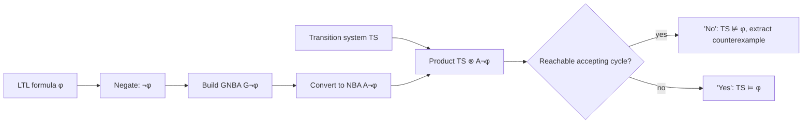
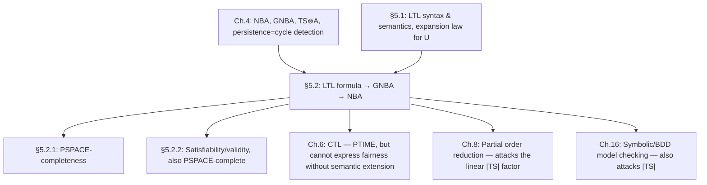

[[book-guidelines|↩ Back to guidelines]]

# Automata-Based LTL Model Checking

## The problem this section actually solves

Chapter 5 up to this point has given you a *specification language*: LTL formulae denote languages of infinite words over $2^{AP}$, via $\mathit{Words}(\varphi) \subseteq (2^{AP})^\omega$. That's a semantic definition — it tells you what $\varphi$ *means*, not how to check whether a transition system obeys it. A transition system $TS$ can easily have $10^9$ reachable states; there is no realistic sense in which a human inspects $\mathit{Traces}(TS)$ and asks "is this a subset of $\mathit{Words}(\varphi)$?" by hand. Section 5.2 closes that gap: it is the *algorithm*, and it is where the automata theory of Chapter 4 (NFAs, NBAs, generalized NBAs, the product construction, persistence-checking-as-cycle-detection) stops being a self-contained theory of automata and becomes the actual verification engine LTL was building toward.

The core mathematical move is short. Start from the satisfaction relation and manipulate it with nothing but set algebra:

$$
TS \models \varphi \quad\text{iff}\quad \mathit{Traces}(TS) \subseteq \mathit{Words}(\varphi) \quad\text{iff}\quad \mathit{Traces}(TS) \cap \big((2^{AP})^\omega \setminus \mathit{Words}(\varphi)\big) = \emptyset \quad\text{iff}\quad \mathit{Traces}(TS) \cap \mathit{Words}(\neg\varphi) = \emptyset.
$$

So if you can build an automaton $A_{\neg\varphi}$ recognizing exactly the "bad" traces — the ones that satisfy the *negation* of what you want — then $TS \models \varphi$ reduces to a language-emptiness question: does $TS$ have *any* trace $A_{\neg\varphi}$ accepts? This is precisely the $\omega$-regular verification pattern from Chapter 4 (build $TS \otimes A$, check for a reachable accepting cycle), specialized to the case where $A$ comes from an LTL formula instead of being handed to you directly.

**What breaks without working over the negation**: if you built $A_\varphi$ instead and asked "does $TS \otimes A_\varphi$ have an accepting run for *every* path," you'd need a *universality* check on the product — checking that all paths are accepted — which for nondeterministic Büchi automata is a much harder (PSPACE-hard in the automaton, not just the formula) question than emptiness. Working over the negation converts "prove correctness" (a $\forall$-statement, awkward for nondeterministic automata) into "prove absence of a counterexample" (an emptiness / $\exists$-statement, which the existing NBA machinery already handles). This single algebraic trick is why the whole edifice of Chapter 4 — built for *checking* automata properties, i.e. finding bad runs — slots directly under LTL model checking.



This is Algorithm 11 (p. 272) and Figure 5.16 in full. Everything else in this section is about the one step that Chapter 4 leaves unaddressed: **how do you actually build $A_{\neg\varphi}$ from a formula?**

## Translating an LTL formula into a generalized Büchi automaton

### Why go through a *generalized* Büchi automaton at all

The target is an NBA $A_\varphi$ with $\mathcal{L}_\omega(A_\varphi) = \mathit{Words}(\varphi)$. The book does not build this directly; it first builds a **generalized** NBA (GNBA) $G_\varphi$ and then applies the standard GNBA→NBA transformation from Theorem 4.56 (duplicate the state space once per acceptance set, cycle through the copies). The reason is architectural, not incidental: LTL's `until` operator has a genuinely conjunctive acceptance condition — one accept-set requirement *per until-subformula*, since each `until` needs its own promise "$\psi_2$ eventually becomes true" independently enforced. A GNBA's semantics (*every* acceptance set $F \in \mathcal{F}$ visited infinitely often) is the natural container for a conjunction of independent "does not stall forever" obligations. Building a single-acceptance-set NBA directly, encoding this conjunction some other way, would smuggle the same exponential blowup back in through a more awkward door. So the section reuses Definition 4.52's GNBA machinery verbatim:

> **Definition 5.33 (Generalized NBA).** $G = (Q, \Sigma, \delta, Q_0, \mathcal{F})$ where $Q, \Sigma, \delta, Q_0$ are as for an NBA and $\mathcal{F} \subseteq 2^Q$ is a set of *acceptance sets*. A run is accepting iff, for **every** $F \in \mathcal{F}$, it visits $F$ infinitely often.

If $\mathcal{F} = \emptyset$, every infinite run is accepting (vacuous conjunction) — a fact that turns out to matter directly below, for formulae with no `until` at all.

### The idea: states are "enough information to know what's still owed"

Before the formal construction, it's worth reconstructing why the states of $G_\varphi$ turn out to be *sets of formulae* rather than, say, [[Timed-CTL-and-TCTL-Model-Checking#Syntax|syntax]]-tree positions or a stack. Fix an infinite word $\sigma = A_0 A_1 A_2 \dots \in \mathit{Words}(\varphi)$. The automaton has to decide, incrementally, symbol by symbol, whether $\sigma$ satisfies $\varphi$ — but LTL semantics is about the *entire suffix* from a position on ($\sigma[i..] \models \psi$), not just the symbol at that position. The trick is to annotate each position $i$ with exactly the subformulae of $\varphi$ that the *suffix starting there* satisfies:

$$
B_i = \{\, \psi \in \mathit{closure}(\varphi) \mid \sigma[i..] \models \psi \,\}.
$$

This $B_i$ is precisely "the information a finite-state automaton needs to carry forward" — it doesn't need to know the whole future to answer "does $\varphi$ hold from here," because $B_i$ already recorded the answer for every relevant subformula, and (crucially) $B_{i+1}$ is *locally derivable* from $B_i$ and the current symbol $A_i$, because LTL's operators only ever look one step ahead plus a recursive obligation (this is exactly the *expansion law* $\varphi_1 \, U \, \varphi_2 \equiv \varphi_2 \lor (\varphi_1 \land \bigcirc(\varphi_1 \, U \, \varphi_2))$ doing the work — it is what makes `until`, an operator that superficially talks about an unbounded future, expressible via a one-step transition plus a [[Fairness|fairness]]-style side condition). This is the entire justification for making formula-sets the states: it is a finite-state summary of infinite semantic information, made possible because LTL's temporal operators are *self-referential over one step*.

**What breaks without this**: if you tried to build states out of, say, "the truth value of $\varphi$ at this position and nothing else," you couldn't compute successors, because whether $\varphi$ holds tomorrow depends on subformulae of $\varphi$ that aren't $\varphi$ itself. You need the *closure* — all subformulae and their negations — as the vocabulary states are built from.

### Closure and elementary sets

> **Definition 5.34 (Closure of $\varphi$).** $\mathit{closure}(\varphi)$ is the set of all subformulae $\psi$ of $\varphi$ and their negations $\neg\psi$ (identifying $\psi$ with $\neg\neg\psi$).

For $\varphi = a\,U\,(\lnot a \land b)$: $\mathit{closure}(\varphi) = \{a, b, \lnot a, \lnot b, \lnot a \land b, \lnot(\lnot a \land b), \varphi, \lnot\varphi\}$. Since every subformula contributes at most itself and its negation, $|\mathit{closure}(\varphi)| \in O(|\varphi|)$ — linear, not exponential; the exponential blowup arises later, from the number of *subsets* of the closure, not from the closure itself.

A state of $G_\varphi$ has to be a *consistent, complete* description of "what a path satisfies from here" restricted to $\mathit{closure}(\varphi)$ — consistent in the propositional-logic sense, and complete (maximal) because for any path and formula, exactly one of $\psi, \lnot\psi$ holds.

> **Definition 5.35 (Elementary Sets of Formulae).** $B \subseteq \mathit{closure}(\varphi)$ is *elementary* if it is:
> 1. **Propositionally consistent**: for all $\varphi_1 \land \varphi_2, \psi \in \mathit{closure}(\varphi)$: $\varphi_1 \land \varphi_2 \in B \iff \varphi_1 \in B \text{ and } \varphi_2 \in B$; $\psi \in B \Rightarrow \lnot\psi \notin B$; $\mathrm{true} \in \mathit{closure}(\varphi) \Rightarrow \mathrm{true} \in B$.
> 2. **Locally consistent w.r.t. until**: for all $\varphi_1\,U\,\varphi_2 \in \mathit{closure}(\varphi)$: $\varphi_2 \in B \Rightarrow \varphi_1\,U\,\varphi_2 \in B$; and $\varphi_1\,U\,\varphi_2 \in B \text{ and } \varphi_2 \notin B \Rightarrow \varphi_1 \in B$.
> 3. **Maximal**: $\psi \notin B \Rightarrow \lnot\psi \in B$.

These three conditions are exactly the *local*, one-step-checkable part of LTL semantics — everything about `until` that *can* be decided by looking only at the current formula set (via the expansion law), leaving the genuinely temporal part (does $\varphi_2$ *actually* show up eventually?) to be handled elsewhere — the acceptance condition. This split — local truth conditions in the states, "eventually delivers on its promise" in the acceptance sets — is the single organizing idea of the whole construction.

For $\varphi = a\,U\,(\lnot a \land b)$, Example 5.36 shows $\{a, b, a\,U\,(\lnot a \land b)\}$ fails maximality (it says nothing about $\lnot a \land b$), while
$$
B_1 = \{a, b, \lnot(\lnot a \land b), \varphi\}, \quad B_5 = \{\lnot a, \lnot b, \lnot(\lnot a \land b), \lnot\varphi\}, \quad B_6 = \{\lnot a, b, \lnot a \land b, \varphi\}
$$
(among others) are elementary — each is a maximal, internally-consistent guess about which subformulae hold from "here" onward.

### Building $G_\varphi$: states, transitions, acceptance

> **Theorem 5.37 (GNBA for an LTL formula).** For LTL formula $\varphi$ over $AP$, assumed written using only $\land, \lnot, \bigcirc, U$ (all derived operators expanded), there is a GNBA $G_\varphi = (Q, 2^{AP}, \delta, Q_0, \mathcal{F})$ with $\mathcal{L}_\omega(G_\varphi) = \mathit{Words}(\varphi)$, constructible in $2^{O(|\varphi|)}$ time/space, with $O(|\varphi|)$ acceptance sets, where:
> - $Q$ = all elementary sets $B \subseteq \mathit{closure}(\varphi)$,
> - $Q_0 = \{B \in Q \mid \varphi \in B\}$,
> - $\mathcal{F} = \{F_{\varphi_1 U \varphi_2} \mid \varphi_1 U \varphi_2 \in \mathit{closure}(\varphi)\}$ where $F_{\varphi_1 U \varphi_2} = \{B \in Q \mid \varphi_1\,U\,\varphi_2 \notin B \text{ or } \varphi_2 \in B\}$,
> - $\delta(B, A) = \emptyset$ if $A \ne B \cap AP$; otherwise $\delta(B, A)$ is the set of elementary $B'$ satisfying, for every $\bigcirc\psi \in \mathit{closure}(\varphi)$: $\bigcirc\psi \in B \iff \psi \in B'$, and for every $\varphi_1\,U\,\varphi_2 \in \mathit{closure}(\varphi)$: $\varphi_1\,U\,\varphi_2 \in B \iff \big(\varphi_2 \in B \lor (\varphi_1 \in B \land \varphi_1\,U\,\varphi_2 \in B')\big)$.

Read this in three independent pieces, one per logical connective family:

- **Propositional structure ($\land, \lnot, \mathrm{true}$)**: entirely handled by elementary-set consistency — no work needed in $\delta$ or $\mathcal{F}$.
- **Next-step ($\bigcirc$)**: handled *entirely by the transition relation* — a nonlocal fact ("$\bigcirc\psi$ holds now" means "$\psi$ holds at the successor") becomes a purely syntactic one-step transition condition. This is why $\bigcirc$ needs no acceptance-set machinery at all: it's a "look one step ahead" operator, and a transition *is* one step ahead.
- **Until ($U$)**: split across *two* mechanisms. The expansion law gives the transition-side condition ($\varphi_1\,U\,\varphi_2 \in B \iff \varphi_2 \in B \lor (\varphi_1 \in B \land \varphi_1\,U\,\varphi_2 \in B')$) — but the expansion law alone is satisfied by the *weak* until, which never actually requires $\varphi_2$ to happen (recall from the LTL chapter: $U$ is the *least* fixed point of this equivalence, $W$ the *greatest*). To rule out "$\varphi_1\,U\,\varphi_2$ held forever without $\varphi_2$ ever showing up," the acceptance set $F_{\varphi_1 U \varphi_2}$ forces every accepting run to visit "$\varphi_1\,U\,\varphi_2$ is no longer pending" ($\varphi_1\,U\,\varphi_2 \notin B$, i.e. it's been discharged) or "$\varphi_2$ just became true" infinitely often — precisely a Büchi-style *liveness* obligation bolted onto an otherwise purely local (safety-flavored) transition system. This is the mechanism, concretely: **least-fixed-point semantics of $U$ = local expansion-law transitions + a Büchi fairness condition ruling out infinite stalling.**

**Sizing the automaton.** States are elementary subsets of $\mathit{closure}(\varphi)$, representable as bit vectors with one bit per subformula (present, or its negation present); since $|\mathit{closure}(\varphi)| \le 2|\varphi|$, $|Q| \le 2^{O(|\varphi|)}$. The number of acceptance sets is exactly the number of `until`-subformulae, so $\le |\varphi|$.

### Two worked constructions from the book

**$\varphi = \bigcirc a$** (Example 5.38, Figure 5.21). $\mathit{closure}(\varphi) = \{a, \bigcirc a, \lnot a, \lnot \bigcirc a\}$, giving four elementary sets $B_1 = \{a, \bigcirc a\}$, $B_2 = \{a, \lnot\bigcirc a\}$, $B_3 = \{\lnot a, \bigcirc a\}$, $B_4 = \{\lnot a, \lnot\bigcirc a\}$. $Q_0 = \{B_1, B_3\}$ (those containing $\varphi$ itself). $\delta(B_1, \{a\}) = \{B_1, B_2\}$ because $\bigcirc a \in B_1$ forces the successor to contain $a$, and $B_1, B_2$ are exactly the states that do. There is **no `until`-subformula**, so $\mathcal{F} = \emptyset$ — every infinite run is accepting (the vacuous-conjunction reading of Definition 5.33's semantics). This is a case where the book's own construction reduces cleanly to a plain Büchi-acceptance-free automaton, because the only temporal content is a single one-step lookahead.

**$\varphi = a\,U\,b$** (Example 5.39, Figure 5.22). Five elementary sets survive; $Q_0 = \{B_1, B_2, B_3\}$ (all sets containing $\varphi$); $\mathcal{F} = \{F_\varphi\}$ is a *singleton* here (one `until`), $F_\varphi = \{B \mid \varphi \notin B \lor b \in B\}$ — so this particular $G_\varphi$ can already be read as a plain NBA. The run $B_3 B_3 B_1 B_4^\omega$ over $\{a\}\{a\}\{a,b\}\emptyset^\omega$ is accepting (matches $a\,U\,b$); the unique run over $\{a\}^\omega$ is $B_3^\omega$, which never visits $F_\varphi$ and is correctly rejected — $\{a\}^\omega \notin a\,U\,b$, exactly as intended: $a$ holding forever without $b$ ever becoming true.

### From GNBA to NBA, and the size that actually matters

Applying the GNBA→NBA transformation of Theorem 4.56 (one copy of the state space per acceptance set, advancing to the next copy each time the current one's set is visited, looping back to copy 0 after the last) to $G_\varphi$:

> **Theorem 5.41.** For any LTL formula $\varphi$, there is an NBA $A_\varphi$ with $\mathit{Words}(\varphi) = \mathcal{L}_\omega(A_\varphi)$, constructible in $2^{O(|\varphi|)}$ time and space.

Since $G_\varphi$ has $\le 2^{|\varphi|}$ states and $\le |\varphi|$ accept sets, the resulting NBA has $\le 2^{|\varphi|} \cdot |\varphi| = 2^{|\varphi| + \log|\varphi|}$ states — still single-exponential, the extra factor of $|\varphi|$ is asymptotically absorbed.

**This exponential is not an artifact of a sloppy construction — it is provably unavoidable in the worst case:**

> **Theorem 5.42 (Lower bound).** There is a family $\varphi_n$ with $|\varphi_n| = O(\mathrm{poly}(n))$ such that every NBA for $\varphi_n$ needs $\ge 2^n$ states.

The witnessing family, $\varphi_n = \bigwedge_{a \in AP} \bigwedge_{0 \le i < n} \big(\bigcirc^i a \leftrightarrow \bigcirc^{n+i} a\big)$, forces any automaton for it to remember an entire length-$n$ prefix of the input in its state, because two different prefixes $A_1 \dots A_n \ne A_1' \dots A_n'$ lead to *distinguishable* futures (repeating one prefix is accepted, repeating the mismatched pair is not) — so the automaton needs a distinct state per possible prefix, and there are $|2^{AP}|^n \ge 2^n$ of them. This is the formal justification, not just a folk claim, for why "LTL model checking is exponential in formula size" isn't a solvable-with-a-cleverer-algorithm problem — the automaton itself must be exponential in the worst case, independent of how you build it.

One more fact worth naming precisely, since it explains *why* the book bothers with NBA at all rather than some restricted deterministic automaton: **NBA are strictly more expressive than LTL.** The property "$a$ holds at every even position" ($P = \{A_0 A_1 A_2 \dots \mid a \in A_{2i} \text{ for all } i\}$) has an NBA (alternate between two states, one requiring $a$, one not) but *no* LTL formula — LTL cannot count modulo 2 along a path. LTL formulae denote a strict subset of the $\omega$-regular languages; automata are the more expressive representation, which is exactly why translating *into* automata (rather than trying to stay purely at the formula level) is the right computational strategy.

### Grounding: the closure construction as a compiler pass

The elementary-set construction is, functionally, a *state-machine synthesis pass from an AST* — the kind of thing a compiler backend does when lowering a high-level combinator language into an explicit automaton (a regex engine compiling to an NFA is the closest cousin). In Rust, the closure and elementary-set-generation steps are naturally a subformula-indexed bitset:

```rust
use std::collections::HashSet;

#[derive(Clone, PartialEq, Eq, Hash, Debug)]
enum Ltl {
    True,
    Prop(String),
    Not(Box<Ltl>),
    And(Box<Ltl>, Box<Ltl>),
    Next(Box<Ltl>),
    Until(Box<Ltl>, Box<Ltl>),
}

/// closure(phi): all subformulae of phi and their negations (dedup phi/¬¬phi).
fn closure(phi: &Ltl) -> HashSet<Ltl> {
    let mut set = HashSet::new();
    fn walk(f: &Ltl, set: &mut HashSet<Ltl>) {
        set.insert(f.clone());
        set.insert(negate(f)); // syntactic double-negation collapse
        match f {
            Ltl::Not(g) => walk(g, set),
            Ltl::And(a, b) => { walk(a, set); walk(b, set); }
            Ltl::Next(g) => walk(g, set),
            Ltl::Until(a, b) => { walk(a, set); walk(b, set); }
            _ => {}
        }
    }
    walk(phi, &mut set);
    set
}

fn negate(f: &Ltl) -> Ltl {
    match f {
        Ltl::Not(g) => (**g).clone(),
        other => Ltl::Not(Box::new(other.clone())),
    }
}

/// A GNBA state: one elementary subset of closure(phi), represented as the
/// subset of closure elements it contains. Checking Definition 5.35's three
/// conditions against a candidate subset is exactly a SAT-style consistency
/// check over a fixed, small propositional vocabulary — closure(phi).
struct GnbaState {
    contained: HashSet<Ltl>,
}
```

Enumerating elementary sets by brute-force subset consistency checking is exactly where the $2^{O(|\varphi|)}$ blowup becomes visible as *code*: you are iterating over up to $2^{|\mathit{closure}(\varphi)|}$ candidate subsets and filtering by the three local conditions — the same shape as a DPLL-style SAT solver enumerating (or, better, backtracking-searching) assignments over the "variables" $\mathit{closure}(\varphi)$. This is not a coincidence: elementary-set generation over a fixed formula vocabulary *is* a small SAT instance per candidate state, and production LTL-to-Büchi translators (e.g. the tableau-based approaches referenced in the bibliographic notes: Gerth et al., used in SPIN) avoid materializing all $2^{|\varphi|}$ candidates by doing exactly this — incremental, on-the-fly satisfiability-guided expansion rather than brute enumeration.

## The product of a transition system and a Büchi automaton

This part of [[Probabilistic-Computation-Tree-Logic#The algorithm|the algorithm]] is inherited essentially unchanged from Chapter 4's $TS \otimes A$ construction for $\omega$-regular verification (§4.4) — the book deliberately does not re-derive it, only re-applies it with $A = A_{\neg\varphi}$. The product's states pair a $TS$-state with an automaton state reachable *consistently with the labeling*: $s \xrightarrow{} s'$ in $TS$ and $q \xrightarrow{L(s')} q'$ in $A_{\neg\varphi}$ combine into a product edge $\langle s, q\rangle \to \langle s', q'\rangle$. A run of $TS \otimes A_{\neg\varphi}$ projects onto a path of $TS$ and, simultaneously, a run of $A_{\neg\varphi}$ over that path's trace — so an *accepting* run of the product (one visiting the accept states of $A_{\neg\varphi}$ infinitely often) corresponds exactly to a $TS$-path whose trace is accepted by $A_{\neg\varphi}$, i.e. a path violating $\varphi$:

$$
TS \models \varphi \quad\text{iff}\quad TS \otimes A_{\neg\varphi} \models \Diamond\Box\,\lnot F
$$

(no reachable state of $TS \otimes A_{\neg\varphi}$ lies on a cycle visiting $F$ — a *persistence* property, reducible, as in Chapter 4, to a *reachable accepting cycle* check). This is why the book calls checking $TS \models \varphi$ "an instance of the persistence-checking algorithm from Chapter 4" rather than presenting new machinery: **the entire novelty of LTL model checking is the LTL-to-automaton translation above; the graph algorithm underneath is identical to plain $\omega$-regular verification.** This is the connective tissue back to Topic 10 in the guidelines — automata-based verification of properties — of which LTL model checking is a specific instantiation, not a new algorithmic pattern.

## On-the-fly model checking

Building $A_{\neg\varphi}$ in full before ever touching $TS$ wastes work whenever a counterexample is shallow — most of $A_{\neg\varphi}$'s $2^{O(|\varphi|)}$ states may never be reached in the product with a *particular* $TS$. The book's fix is architectural rather than algorithmic: interleave the three constructions —

1. generating reachable states of $TS$ (e.g. from a Promela-style high-level description, as in SPIN),
2. generating the relevant fragment of $A_{\neg\varphi}$ (equivalently, of $G_{\neg\varphi}$, since successors are computed lazily via $\delta$), and
3. exploring the product $TS \otimes A_{\neg\varphi}$ via DFS —

so that a new product vertex is generated only when the outer DFS actually visits it, and $A_{\neg\varphi}$'s successors are computed only for the current $TS$-state's label rather than for all of $2^{AP}$. Concretely, this outer DFS *is* the outer pass of the nested-DFS persistence/cycle-detection algorithm from Chapter 4 — on-the-fly generation and nested-DFS emptiness checking are not two separate techniques stacked on top of each other, they're the same traversal, with automaton-state and product-state expansion happening lazily inside it. **What breaks without this**: precomputing all of $A_{\neg\varphi}$ before model checking begins forces you to pay the full $2^{O(|\varphi|)}$ cost even for formulae violated by a two-step counterexample — on-the-fly checking makes the *observed* cost proportional to how much of the product a counterexample (or its absence) actually requires exploring, which is the difference between "exponential in theory" and "fast in practice" that the book leans on heavily in its complexity discussion below.

### Grounding: lazy automaton construction as a Rust iterator/coroutine

```rust
/// The GNBA's transition function computed lazily: given a formula-set state
/// and the *specific* label observed at the current TS state, compute only
/// the successors consistent with that label — never materialize δ(B, A)
/// for all A ∈ 2^AP.
fn successors_for_label(state: &GnbaState, closure: &HashSet<Ltl>, observed: &HashSet<String>) -> Vec<GnbaState> {
    // Filter candidate elementary sets by:
    //  (i) propositional agreement with `observed` on AP,
    //  (ii) the ○ψ and until expansion-law conditions from Theorem 5.37.
    // Crucially: only invoked when the outer product-DFS actually visits
    // this (TS-state, automaton-state) pair — mirroring the book's
    // on-the-fly interleaving of TS, automaton, and product generation.
    unimplemented!("elementary-set successor filter, invoked on demand")
}
```

The discipline here — "never build the whole structure, only the parts the search actually visits" — is the same discipline behind lazy graph exploration in any verifier, and it maps directly onto Rust's iterator adaptors or a hand-rolled worklist algorithm; it needs no exotic language feature, only that state generation be pushed behind a function call rather than precomputed into a table.

## Complexity of the LTL model-checking problem

Putting the pieces together: constructing $A_{\neg\varphi}$ costs $O(2^{|\varphi|} \cdot |\varphi|) = O(2^{|\varphi| + \log|\varphi|})$, and exploring $TS \otimes A_{\neg\varphi}$ (nested DFS, linear in the product's size) costs $O(|TS| \cdot |A_{\neg\varphi}|)$. Overall:

$$
O(|TS| \cdot 2^{|\varphi|}).
$$

**Linear in system size, exponential in formula size.** The book is explicit that this asymmetry is not a defect to be apologized for: real specifications are short (a handful of temporal operators), while $|TS|$ is where state-space explosion (Chapter 2's problem) actually bites. The exponential dependency on $|\varphi|$ is "not decisive for the practical application of LTL model checking" — the linear dependency on $|TS|$ is the binding constraint in practice, which is precisely why later chapters (symbolic/BDD-based [[CTL-Model-Checking|CTL model checking]], partial-order reduction, bisimulation-based abstraction) all attack $|TS|$, never $|\varphi|$.

### Why this bound is tight: PSPACE-hardness

The book proves PSPACE-hardness in two stages, each illustrating a different technique for reduction into temporal logic:

**Stage 1 — coNP-hardness via Hamiltonian path (Lemma 5.45).** Given digraph $G = (V,E)$, build $TS$ from $G$ by adding a state $b$ with a self-loop, reachable from every vertex, and set

$$
\varphi = \lnot\bigvee_{v \in V}\Big(\Diamond v \land \Box(v \to \bigcirc\lnot v)\Big).
$$

The disjunct for $v$ says "$v$ is visited, and once visited is never visited again" — so the *negation-of-disjunction* $\varphi$ says "it is not the case that some vertex is visited exactly once and thereafter avoided," which combined with the self-loop trap at $b$ forces: $TS \models \varphi$ fails exactly when some path visits every vertex exactly once, i.e. exactly when $G$ has a Hamiltonian path. Since Hamiltonian path is NP-complete, this already shows the *complement* of LTL model checking is NP-hard, i.e. LTL model checking itself is **coNP-hard** — a first, easier lower bound before the full PSPACE argument.

**Stage 2 — full PSPACE-hardness via Turing machine encoding (Theorem 5.46).** The heavier argument reduces an arbitrary PSPACE-bounded (deterministic) Turing machine computation to an LTL model-checking instance, in the spirit of Cook's theorem for SAT but targeting temporal structure instead of a single Boolean formula. The construction is worth understanding at the level of *why* each piece is needed, not just what it says:

- $TS(M,n)$ is built as $P(n)$ "diamond" gadgets chained together (Figure 5.23), each representing one tape cell's possible $(state, symbol)$ configuration at one point in the machine's run, so that a path through the whole chain encodes one full configuration of $M$.
- $\varphi_{Conf}$ (using nested $\bigcirc^i$, i.e. $i$-fold next) pins down that at every "checkpoint" exactly one cursor-position atom holds — the crucial trick being that **iterated $\bigcirc$ is doing the job of an explicit index/pointer**, since LTL has no direct notion of "the $i$-th position" other than counting $\bigcirc$'s.
- $\varphi_\delta$ encodes the transition function stepwise: "if the cursor is in $(q,A)$ at position $i$ now, then $2P(n)+1$ steps later (one full configuration-length away) the tape and state must reflect $\delta(q,A)$" — the fixed stride $2P(n)+1$ between successive configurations is what lets a *local*, one-step-flavored LTL formula (conjoined `next`s) encode the *global* consistency of an unboundedly long simulated computation.
- $\varphi_{accept}$ is just $\Diamond \bigvee_{q \in F} q$: eventually reach an accepting configuration.

The formula $\varphi_w = \varphi_w^{start} \land \varphi_{Conf} \land \varphi_\delta \land \varphi_{accept}$ has length polynomial in $|M|, |w|$, and $M$ accepts $w$ iff $TS(M,n)$ has *some* path satisfying $\varphi_w$ — i.e. iff the *existential* LTL model-checking problem answers yes. Since PSPACE is closed under complement, PSPACE-hardness of the existential variant transfers to the (universal, $\models$) variant the book actually defines.

**Membership in PSPACE (Lemma 5.47, via Savitch's theorem).** The matching upper bound doesn't build $A_{\neg\varphi}$ explicitly at all — it works directly with the GNBA $G_{\neg\varphi}$ and *guesses* a lasso-shaped path (prefix $u_0 \dots u_{n-1}$ plus cycle $v_0 \dots v_{m-1}$) through $TS \otimes G_{\neg\varphi}$, checking local consistency conditions (successor validity, elementary-set membership, label agreement, transition-relation membership) one step at a time. The key move making this *polynomial space* despite an exponentially long lasso: you never need to store the whole path, only the current and previous states (each of size $O(\log|TS| + |\varphi|)$), plus $O(|\varphi|)$ bits tracking which `until`-obligations from the cycle remain undischarged. A nondeterministic algorithm using only polynomial space, by Savitch's theorem, implies a *deterministic* polynomial-space algorithm exists too (Savitch: $\mathrm{PSPACE} = \mathrm{NPSPACE}$) — so this Lemma is really doing double duty: it shows membership constructively, and it is the concrete reason the book can say PSPACE (not just NPSPACE) is the right class.

$$
\boxed{\text{The LTL model-checking problem is PSPACE-complete.} \quad \text{(Theorem 5.48)}}
$$

### Fairness is free, almost

Because LTL fairness constraints reduce to ordinary LTL formulae ($TS \models_{\mathit{fair}} \varphi$ iff $TS \models (\mathit{fair} \to \varphi)$, from the earlier §5.1 material), fairness needs *no new algorithm* — just check $\mathit{fair} \to \varphi$ with the same procedure. The catch the book flags explicitly (Remark 5.44): naively doing this makes the automaton exponential in $|\mathit{fair}| + |\varphi|$ rather than just $|\varphi|$, since $\mathit{fair}$ can be a long conjunction of fairness constraints. The practical fix is to keep $A_{\neg\varphi}$ (not $A_{\neg(\mathit{fair}\to\varphi)}$) and modify the *persistence check itself* to additionally demand that the accepting cycle satisfy the fairness constraints as a side condition on the graph search — trading a blowup in automaton size for a more elaborate (but still polynomial-per-step) graph algorithm. This is a recurring pattern worth internalizing: whenever a side condition can be checked as a *graph property of the product* rather than baked into automaton size, prefer the graph-side encoding.

## LTL satisfiability and validity checking

Two more decision problems fall out of exactly the same machinery, with no new automata theory required:

- **Satisfiability**: does $\mathit{Words}(\varphi) \ne \emptyset$? Build $A_\varphi$ (not $A_{\neg\varphi}$ — there's no transition system here, you're asking about the formula in isolation) and check $\mathcal{L}_\omega(A_\varphi) \ne \emptyset$ via the same nested-DFS emptiness technique used for persistence checking (Algorithm 12: find a reachable accept state lying on a cycle).
- **Validity**: is $\varphi \equiv \mathrm{true}$, i.e. $\mathit{Words}(\varphi) = (2^{AP})^\omega$? Reduce to satisfiability of the negation: $\varphi$ valid iff $\lnot\varphi$ unsatisfiable.

Both inherit the $2^{O(|\varphi|)}$ construction cost, and — mirroring model checking exactly — both are **PSPACE-complete** (Theorem 5.49). The lower-bound proof is a clean illustration of how tightly these problems are related to model checking rather than independent facts: it reduces the *existential* LTL model-checking problem to satisfiability by building a formula $\psi$ that "simulates $TS$ inside LTL." Concretely, for $TS = (S, Act, \to, I, AP, L)$, introduce one fresh atomic proposition per state $s \in S$, and conjoin:
- $\Psi_I$ (some initial-state proposition holds now),
- $\Xi$ (exactly one state-proposition holds at every position — path positions correspond to states one-to-one),
- $\Box \Psi_S$ (always exactly one holds),
- $\bigwedge_{s} \Box(s \to (\Phi_s \land \bigcirc \Psi_{\mathit{Post}(s)}))$ (whenever "we are at $s$," the labeling matches $L(s)$ and the next position is one of $s$'s actual successors),
- and finally $\varphi$ itself.

A model of this conjunction is, by construction, forced to trace out an actual path of $TS$ (the state-propositions act as a deterministic "position pointer," and the successor-constraint enforces $TS$'s transition relation edge by edge) while also satisfying $\varphi$ — so $\psi$ is satisfiable iff $TS$ has a path satisfying $\varphi$. This is the same idea as the Turing-machine encoding above, one level more elementary: **LTL, despite having no explicit reference to "the current program state," can simulate an arbitrary finite transition system by dedicating one atomic proposition per state and using $\bigcirc$ to enforce the transition relation locally at every position.** Internalizing this technique is worth more than the specific theorem — it's the general recipe for encoding "walk a graph" problems into LTL satisfiability, useful well beyond this one reduction.

## Where this leads



This section is the payoff of a long setup: Chapter 2 built transition systems, Chapter 4 built the automata-theoretic verification pattern in the abstract ($\omega$-regular properties via NBA products and persistence checking), and §5.1 built LTL as a human-usable specification notation. §5.2 is the bridge — it shows LTL is *just* a syntax for a restricted subclass of $\omega$-regular properties (strictly restricted, per Theorem 5.42's lower bound and the "$a$ at every even position" non-expressibility result), and that the automata machinery already built is sufficient to check it, at the cost of an unavoidable exponential translation step. Everything downstream of this section that concerns LTL — fairness handling, on-the-fly/nested-DFS tooling in real model checkers like SPIN, the entire comparison with CTL in Chapters 6–7 (where CTL trades expressiveness for a PTIME algorithm precisely by giving up the freedom that makes LTL's automaton exponential) — is a consequence of the translation-and-product-and-cycle-detection pattern fixed here.

**Toward the standing project (this book's `sat-smt-csp` tag applies most directly here):** the elementary-set/closure construction is, mechanically, a bounded, syntax-directed satisfiability search — decide membership of formula-subsets by propositional consistency plus a local expansion-law side condition, which is exactly the shape of a DPLL-style search over a fixed variable set (the closure), and it is the same "consistency-check-then-expand" discipline that a CDCL-based SMT/CHC solver or a symbolic-automaton-based abstract-domain propagator (per the standing project's CSP kernel goal) performs when synthesizing states from a formula. The reduction from LTL model checking to satisfiability (§5.2.2), which forges an explicit correspondence between "graph reachability under a transition relation" and "propositional/temporal satisfiability," is a direct ancestor of encoding *reachability analysis and path coverage* into a solver's input, per the `sat-smt-csp` and `static-analysis` "Specific threads to keep surfacing." And the tableau/on-the-fly alternative construction the book gestures at in its bibliographic notes (Lichtenstein–Pnueli; Gerth et al., used in SPIN) is the production-grade version of exactly the same lazy-expansion discipline this article's Rust sketches model — worth revisiting directly if the compiler project ever needs an embedded LTL-to-automaton translator for runtime verification or property-guided test generation.
