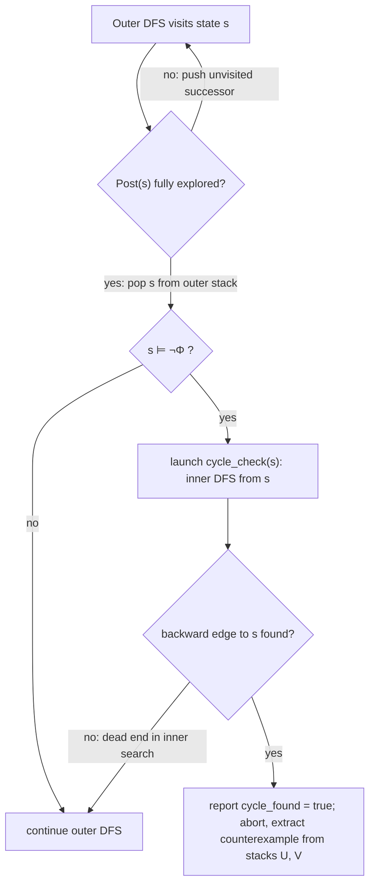
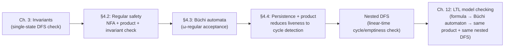

# Automata-Based Verification of Properties

[[book-guidelines|↩ Back to guidelines]]

## Why this chapter exists: turning "the property" into "a graph search"

Chapters 3's whole apparatus — invariants, safety, liveness, [[Fairness|fairness]] — gives you a *vocabulary* for saying what a system should do. But saying "the property is $P = \{$ all infinite words where the light is never red-without-a-preceding-yellow $\}$" doesn't hand you an algorithm. An invariant $\Phi$ is checkable by depth-first search because it collapses to a single question per state: does $s \models \Phi$? A general linear-time property is a *set of infinite words* — you can't evaluate "is this word in $P$" state-by-state unless $P$ has some finite-state structure to exploit.

The move this chapter makes is: represent the *bad* behaviors — the traces that must never occur — as another finite-state machine, and then explore the two machines running in lockstep. If you can walk the system and the "badness detector" together and prove the detector never fires, you've proven the property. This is the single idea that gets instantiated twice in this chapter, at two different levels of automaton:

1. For **regular safety properties**, "the detector fires" means *reaching* a bad state — an ordinary reachability question, solved with a single depth-first search (this is exactly the invariant-checking machinery from Chapter 3, reused).
2. For general **$\omega$-regular properties** (which subsume safety, but also liveness properties like "infinitely often green"), "the detector fires" means *cycling forever through* certain states — a genuinely different graph question, solved by the **nested depth-first search** algorithm that is this chapter's centerpiece.

What breaks without this reduction: without an automaton for the bad prefixes, you would need a bespoke ad-hoc procedure for every property you want to check. Automata-based verification instead separates "what is bad" (a finite-state description, cheap to build once) from "how do I search for it" (one reusable graph algorithm), which is exactly the architecture every real model checker (SPIN, NuSMV, and friends) is built on.

## Part 1 — Regular safety properties, or: invariant checking in disguise

### The setup: bad prefixes as a language

Recall from Chapter 3 that a safety property $P_{safe}$ is characterized by its **bad prefixes**: every trace that violates $P_{safe}$ has some finite prefix that already dooms it, no matter how the trace continues. The book calls $P_{safe}$ **regular** (Definition 4.11) when $\mathit{BadPref}(P_{safe})$ is a regular language over the alphabet $\Sigma = 2^{AP}$ — i.e., recognizable by a finite automaton whose input symbols are *sets of atomic propositions* (not single characters — each "letter" the automaton reads is one state's full label).

The paradigm case: **every invariant is a regular safety property.** If $\Phi$ is the state condition of the invariant, its bad prefixes are exactly the words matching the (informally written) regular expression

$$
\Phi^*\,(\neg\Phi)\,\mathrm{true}^*,
$$

i.e., "zero or more $\Phi$-states, then one $\neg\Phi$-state, then anything." A two-state NFA recognizes this directly: stay in $q_0$ on $\Phi$, jump to the accepting trap state $q_1$ on $\neg\Phi$, and self-loop in $q_1$ forever after (Figure 4.3 in the book). Not every safety property is regular, though — the book's standard counterexample is "coins inserted $\geq$ drinks dispensed," whose minimal bad prefixes are $\{\, \mathrm{pay}^n\,\mathrm{drink}^{n+1} \mid n \geq 0 \,\}$, a context-free but non-regular language (you need to *count*, which no finite automaton can do). Regular safety properties are exactly the ones a finite automaton can serve as a "bad-prefix detector" for — everything in this section depends on that.

One structural fact worth internalizing before [[Probabilistic-Computation-Tree-Logic#The algorithm|the algorithm]]: **regularity of the bad prefixes is equivalent to regularity of just the *minimal* bad prefixes** (Lemma 4.12). This matters because it means you get to choose the more convenient automaton — you don't have to decide whether your NFA accepts every prefix that comes after a violation, or stops exactly at the point of violation.

### The reduction: build the product, then it's just an invariant

Here is the actual algorithmic content of §4.2.2. Given a finite transition system $TS$ and an NFA $A = (Q, 2^{AP}, \delta, Q_0, F)$ recognizing $\mathit{BadPref}(P_{safe})$, define the **product transition system** $TS \otimes A$ (Definition 4.16):

$$
TS \otimes A = (S \times Q,\ \mathit{Act},\ \rightarrow',\ I',\ Q,\ L')
$$

where the product steps in lockstep — $TS$ takes an ordinary transition, and simultaneously $A$ consumes the label of the *target* state as its next input symbol:

$$
\frac{s \xrightarrow{\alpha} t \qquad q \xrightarrow{L(t)} p}{\langle s, q\rangle \xrightarrow{\alpha} \langle t, p\rangle}
$$

and $L'(\langle s,q\rangle) = \{q\}$ — the label of a product state is just the automaton state, which is the only part of the product state that matters for what comes next. Initial states are seeded by feeding $A$ the label of $TS$'s own initial state: $\langle s_0, q\rangle \in I'$ iff $s_0 \in I$ and some $q_0 \in Q_0$ has $q_0 \xrightarrow{L(s_0)} q$.

Why build this at all? Because now a run of $A$ over a trace of $TS$ literally *is* a path through $TS \otimes A$, and "the trace is a bad prefix" (i.e., $A$ accepts it) has become "the path in the product ends in a state whose $A$-component is accepting." This is stated precisely by **Theorem 4.19**:

$$
TS \models P_{safe} \iff \mathit{Traces}_{fin}(TS) \cap L(A) = \emptyset \iff TS \otimes A \models P_{inv}(A)
$$

where $P_{inv}(A)$ is the invariant $\neg F := \bigwedge_{q \in F} \neg q$ — "never enter an accept state of $A$." The three-way equivalence is the whole point: a question about an arbitrary regular safety property has been turned into a question about *invariants*, which Chapter 3 already solved with plain depth-first search (Algorithm 4). Nothing new has to be invented — you reuse the existing invariant checker on the product.

**Algorithm 5** (the book's name) is exactly this: construct $A$ for the bad prefixes, build $TS \otimes A$, run invariant checking on $\neg F$. If it fails, the DFS stack at the point of failure — projected back onto $TS$'s component — is literally a finite path fragment whose trace is a bad prefix: a genuine, human-readable counterexample. Complexity is $O(|TS|\cdot|A|)$ (Theorem 4.22), because $|S \times Q|$ is the obvious bound on the product's size and invariant checking is linear.

*What breaks without the product construction:* if you tried to check "is this trace a bad prefix" state-by-state on $TS$ alone, you'd have no memory of *which prefix of the bad-prefix language* you'd matched so far — you'd need to somehow track automaton state without an automaton. The product is precisely a machine that carries that memory alongside the system's own state.

### A Rust sketch: the product and the safety check

This is checker-shaped code — exactly the kind of pass a Rust-based verifier would need — so it's worth writing out in full rather than gesturing at it.

```rust
use std::collections::{HashMap, HashSet};

type StateId = usize;
type PropSet = u32; // bitset over atomic propositions

/// A finite transition system: only what invariant/product checking needs.
struct TransitionSystem {
    initial: Vec<StateId>,
    label: HashMap<StateId, PropSet>,
    succ: HashMap<StateId, Vec<StateId>>,
}

/// An NFA over the alphabet 2^AP, i.e. Sigma = PropSet.
struct Nfa {
    initial: Vec<StateId>,
    accept: HashSet<StateId>,
    // delta(q, A) as an adjacency map keyed by (q, A)
    delta: HashMap<(StateId, PropSet), Vec<StateId>>,
}

impl Nfa {
    fn step(&self, q: StateId, symbol: PropSet) -> Vec<StateId> {
        self.delta.get(&(q, symbol)).cloned().unwrap_or_default()
    }
}

/// Product state <s, q> flattened into a single id via a HashMap.
fn build_product(ts: &TransitionSystem, a: &Nfa) -> TransitionSystem {
    let mut label = HashMap::new();
    let mut succ: HashMap<StateId, Vec<StateId>> = HashMap::new();
    let mut ids: HashMap<(StateId, StateId), StateId> = HashMap::new();
    let mut next_id = 0;
    let mut fresh = |s: StateId, q: StateId, ids: &mut HashMap<_, _>| -> StateId {
        *ids.entry((s, q)).or_insert_with(|| { let id = next_id; next_id += 1; id })
    };

    // Seed initial product states: <s0, q> for s0 in I, q in delta(q0, L(s0)).
    let mut initial = Vec::new();
    let mut frontier = Vec::new();
    for &s0 in &ts.initial {
        let sym = ts.label[&s0];
        for &q0 in &a.initial {
            for q in a.step(q0, sym) {
                let pid = fresh(s0, q, &mut ids);
                label.insert(pid, q as PropSet); // label' = {q}
                initial.push(pid);
                frontier.push((s0, q, pid));
            }
        }
    }

    // BFS/DFS the product on the fly: <s,q> -> <t,p> iff s->t in TS and q --L(t)--> p in A.
    let mut visited = HashSet::new();
    while let Some((s, q, pid)) = frontier.pop() {
        if !visited.insert(pid) { continue; }
        succ.entry(pid).or_default();
        for &t in ts.succ.get(&s).map(|v| v.as_slice()).unwrap_or(&[]) {
            let sym_t = ts.label[&t];
            for p in a.step(q, sym_t) {
                let cid = fresh(t, p, &mut ids);
                label.insert(cid, p as PropSet);
                succ.get_mut(&pid).unwrap().push(cid);
                frontier.push((t, p, cid));
            }
        }
    }

    TransitionSystem { initial, label, succ }
}

/// Algorithm 5: TS |= Psafe  iff  TS ⊗ A never visits an accept state of A.
/// `accept_ids` are the product-state ids whose A-component is in F.
fn check_regular_safety(product: &TransitionSystem, accept_ids: &HashSet<StateId>)
    -> Result<(), Vec<StateId>>
{
    let mut visited = HashSet::new();
    let mut stack = Vec::new();
    for &s0 in &product.initial {
        if accept_ids.contains(&s0) {
            return Err(vec![s0]); // violated immediately
        }
        if visited.insert(s0) {
            stack.push(vec![s0]);
        }
        while let Some(path) = stack.pop() {
            let s = *path.last().unwrap();
            for &t in product.succ.get(&s).map(|v| v.as_slice()).unwrap_or(&[]) {
                if accept_ids.contains(&t) {
                    let mut counterexample = path.clone();
                    counterexample.push(t);
                    return Err(counterexample); // the bad prefix, as a path
                }
                if visited.insert(t) {
                    let mut extended = path.clone();
                    extended.push(t);
                    stack.push(extended);
                }
            }
        }
    }
    Ok(())
}
```

Two things worth flagging in this code because they mirror subtleties the book calls out explicitly: (1) the product is built *lazily*, state by state, as `check_regular_safety` explores it — this is exactly the "on-the-fly" spirit the book keeps returning to, since in practice $TS$ itself comes from an exponentially larger syntactic description (a program graph or channel system) that you never want to materialize in full; (2) `check_regular_safety` doubles as both invariant checker *and* counterexample extractor, matching Corollary 4.20 — the DFS stack at the moment of failure is definitionally a trace accepted by $A$, i.e. a bad prefix.

## Part 2 — From safety to arbitrary $\omega$-regular properties: persistence

### Why a product with an NFA isn't enough anymore

Safety properties only ever need to catch a violation at a *finite* point in time — that's what a bad prefix is. Liveness properties like "the light is green infinitely often" can't be refuted by any finite prefix; refutation requires an *infinite* bad behavior. The finite-word automaton (NFA) that worked for §4.2 is the wrong tool here — you need an automaton that accepts *infinite* words, and one whose acceptance condition talks about what happens forever, not what happens by some point.

That automaton is the **nondeterministic Büchi automaton (NBA)** from §4.3 — syntactically identical to an NFA, but a run is accepting iff it visits the accept set $F$ *infinitely often* (not "ends in $F$" — there's no "end"). If you already have Büchi automata from Topic 9 in hand, the leap this section makes is: **the same reduction pattern from §4.2 generalizes**, provided you swap "reachability" for a strictly harder graph question.

### The generalized reduction

Given a finite $TS$ and an $\omega$-regular property $P$, take an NBA $A$ for the *complement* $\overline{P} = (2^{AP})^\omega \setminus P$ — i.e. $A$ recognizes exactly the bad (infinite) traces. Then

$$
TS \models P \iff \mathit{Traces}(TS) \cap \mathcal{L}_\omega(A) = \emptyset.
$$

Build $TS \otimes A$ — **Definition 4.62** is textually the same product construction as Definition 4.16 (same transition rule, same labeling by the automaton component), just now with $A$ ranging over infinite runs. Define the **persistence property**

$$
P_{pers}(A) = \text{"eventually forever } \neg F\text{"}, \qquad \neg F := \bigwedge_{q \in F}\neg q,
$$

i.e., from some point on, the product never touches an $F$-labeled state again. **Theorem 4.63** gives the three-way equivalence exactly mirroring Theorem 4.19:

$$
TS \models P \iff \mathit{Traces}(TS)\cap\mathcal{L}_\omega(A) = \emptyset \iff TS \otimes A \models P_{pers}(A).
$$

**Definition 4.61** formalizes what a persistence property actually is, in general — "eventually forever $\Phi$":

$$
P_{pers} = \Big\{ A_0 A_1 A_2 \ldots \in (2^{AP})^\omega \ \Big|\ \exists i \geq 0.\, \forall j \geq i.\, A_j \models \Phi \Big\}.
$$

This is the liveness-side twin of an invariant: an invariant demands $\Phi$ *always*; a persistence property only demands $\Phi$ *eventually and thereafter*. You can read $P_{pers}(A)$'s $\Phi = \neg F$ as "$F$ is an invariant after a while" — the book's own phrasing.

The book's traffic-light examples (Example 4.64) are worth carrying forward because they show the pattern concretely: a two-color pedestrian light alternating red/green, checked against "infinitely often green," complement automaton "eventually always $\neg$green" with one accepting state $q_1$. The product has no reachable cycle through a state labeled $q_1$ — the light really does keep alternating — so the persistence property $P_{pers}(A)$ holds and the original liveness property is verified. A variant light that can power off while red *does* admit a cycle through an $F$-labeled product state (off $\to$ red $\to$ off $\to \ldots$), witnessing a genuine counterexample to "infinitely often green."

### Persistence checking is cycle detection

**Theorem 4.65** is the crux that makes persistence property checking *algorithmic* rather than merely definitional:

$$
TS \models P_{pers} \iff \exists s \in \mathit{Reach}(TS).\ s \models \neg\Phi \ \wedge\ s \text{ lies on a cycle in } G(TS).
$$

The intuition, stated plainly: a $\neg\Phi$-state on a reachable cycle can be visited infinitely often just by looping the cycle forever — so it witnesses a path that violates "eventually forever $\Phi$." Conversely, if some infinite path visits $\neg\Phi$ infinitely often on a *finite* transition system, pigeonhole forces some state to repeat infinitely often, and any two visits to that state bound a cycle. So the liveness question "is there a path violating this persistence property" has been reduced entirely to a **graph-structural** question — "is there a reachable cycle through a bad state" — with no residual temporal reasoning left. This is exactly the same move as reducing "an ω-regular property holds" to "no reachable accepting cycle," and it's why persistence checking, cycle detection, and NBA emptiness checking are all, underneath, the same algorithm.

## Part 3 — Nested depth-first search

### Why a naive two-phase approach is quadratic

The obvious algorithm (Algorithm 6 in the book, the "naive" approach): first DFS to find every reachable $\neg\Phi$-state, then for *each* one, run a separate DFS (Algorithm 7, `cycle_check`) looking for a backward edge into it. This is correct but wasteful — different $\neg\Phi$-states can reach overlapping fragments of $TS$, and the naive approach re-explores those fragments once per $\neg\Phi$-state, giving $O(N\cdot(N+M))$ in the worst case.

### The nested idea

The fix is to interleave two depth-first searches so that *no state is ever explored twice by the inner search across all its invocations*:

- The **outer DFS** does a standard traversal to discover all reachable states.
- The **inner DFS** ("`cycle_check`") looks specifically for a backward edge into a $\neg\Phi$-state $s$ — but crucially, it is only launched from $s$ once $s$ has been **fully expanded** by the outer search (all of $s$'s successors already visited), and it shares a single global "visited" set $T$ across every invocation, so previously-inner-visited states are never revisited.



This ordering constraint — "only launch `cycle_check(s)` once $s$ is fully expanded by the outer DFS" — is not a minor implementation detail; **Example 4.68** in the book shows that violating it (launching the inner search *immediately* on discovering a $\neg\Phi$-state, before finishing its outer expansion) produces a wrong "yes" answer on a four-state example, because the inner search can mark states as globally visited (`T`) before the cycle through them has had a chance to be detected from the right starting point. The correctness argument (Theorem 4.69) formalizes exactly why the ordering rescues this: it shows that whenever `cycle_check(s)` is invoked, no cycle through $s$ can already have had its states silently absorbed into $T$ by an earlier, unrelated `cycle_check` call.

Because every reachable state is pushed onto the outer stack $U$ at most once and onto the inner stack $V$ at most once (across *all* calls to `cycle_check`), the total work is $O(N + M)$ — linear, same as ordinary DFS, despite doing two DFS passes conceptually.

### The algorithm, faithfully

```rust
use std::collections::HashSet;

type State = usize;

struct Nested<'a> {
    succ: &'a dyn Fn(State) -> Vec<State>,
    holds_phi: &'a dyn Fn(State) -> bool, // Φ, the persistence condition
    initial: Vec<State>,

    r: HashSet<State>,   // outer-DFS visited set
    t: HashSet<State>,   // inner-DFS visited set (global across all cycle_check calls)
    u: Vec<State>,       // outer DFS stack
    v: Vec<State>,       // inner DFS stack
    cycle_found: bool,
}

impl<'a> Nested<'a> {
    /// Algorithm 8: returns Ok(()) if TS |= "eventually forever Φ",
    /// or Err(counterexample path) otherwise.
    fn check(&mut self) -> Result<(), Vec<State>> {
        let starts = self.initial.clone();
        for s0 in starts {
            if self.r.contains(&s0) || self.cycle_found { continue; }
            self.reachable_cycle(s0);
            if self.cycle_found {
                let mut cx = self.v.clone();
                cx.extend(self.u.iter().rev().cloned());
                return Err(cx); // stack contents, reversed, yield the counterexample
            }
        }
        Ok(())
    }

    fn reachable_cycle(&mut self, s: State) {
        self.u.push(s);
        self.r.insert(s);
        loop {
            let top = *self.u.last().unwrap();
            let unvisited: Vec<State> = (self.succ)(top)
                .into_iter().filter(|t| !self.r.contains(t)).collect();
            if let Some(next) = unvisited.into_iter().next() {
                self.u.push(next);
                self.r.insert(next);
            } else {
                self.u.pop(); // outer DFS finished expanding `top`
                if !(self.holds_phi)(top) {
                    // top |= ¬Φ: only now, after full expansion, launch the inner search
                    self.cycle_found = self.cycle_check(top);
                }
            }
            if self.u.is_empty() || self.cycle_found { break; }
        }
    }

    /// Algorithm 7, nested variant: T and V persist across all calls.
    fn cycle_check(&mut self, s: State) -> bool {
        self.v.push(s);
        self.t.insert(s);
        loop {
            let top = *self.v.last().unwrap();
            let succs = (self.succ)(top);
            if succs.contains(&s) {
                self.v.push(s); // backward edge found: cycle closes at s
                return true;
            }
            let unvisited: Vec<State> = succs.into_iter()
                .filter(|w| !self.t.contains(w)).collect();
            if let Some(next) = unvisited.into_iter().next() {
                self.v.push(next);
                self.t.insert(next);
            } else {
                self.v.pop(); // dead end, unsuccessful for this branch
            }
            if self.v.is_empty() { return false; }
        }
    }
}
```

This is close to a direct transcription of Algorithm 8 (with recursion flattened to explicit stacks, which is also how you'd want it in a real verifier to avoid stack-overflowing on deep state spaces). Two implementation notes straight from the book's own discussion of §4.4.2: in practice `R` and `T` are usually merged into a single hash table keyed by state, storing one bit for "in $R$" and one for "also in $T$" — since $T \subseteq R$ always — and a further bit can record "currently on stack $U$" so that the moment `cycle_check` reaches *any* state still on the outer stack (not just $s$ itself), you know you've found a cycle back to $s$ and can terminate early with a shorter counterexample.

### On-the-fly and connection to LTL model checking

Nothing about this algorithm requires $TS$ (or the product $TS \otimes A$) to be built in advance — `succ` can be an on-the-fly successor generator that expands a program graph or channel-system semantics lazily, one state at a time, and the nested DFS still terminates in time linear in the *reachable* fragment actually explored. This "generate successors on demand, stop as soon as a counterexample surfaces" property is exactly what lets SPIN and similar tools model-check systems whose full state space would never fit in memory — you're betting that a real bug (if there is one) is usually found long before the full graph is enumerated. This same nested-DFS engine, unmodified in its algorithmic core, is what Chapter 12 reuses wholesale for full LTL model checking: an LTL formula $\neg\varphi$ is compiled into a (generalized) Büchi automaton, producted with $TS$ exactly as here, and the same cycle-detection search finds an accepting run.

### A Python sketch, for contrast

Because the recursive structure of the naive two-phase algorithm is genuinely simpler to see without Rust's stack-flattening ceremony, here is Algorithm 6 (the naive version) as a five-line illustration of *why* it's quadratic — not something you'd ship, just something that makes the redundant re-exploration visible:

```python
def naive_persistence_check(states, succ, phi):
    reachable = set()
    def dfs_reach(s):
        reachable.add(s)
        for t in succ(s):
            if t not in reachable:
                dfs_reach(t)
    for s0 in states.initial:
        if s0 not in reachable:
            dfs_reach(s0)

    def on_cycle(s):  # a fresh DFS per ¬Φ-state — this is the quadratic part
        visited, stack = set(), [s]
        while stack:
            u = stack.pop()
            if u in succ(u):  # self-loop, trivially a cycle... (illustrative only)
                return True
            for w in succ(u):
                if w == s:
                    return True
                if w not in visited:
                    visited.add(w)
                    stack.append(w)
        return False

    return not any(not phi(s) and on_cycle(s)
                   for s in reachable if s in states.reachable_not_phi)
```

The nested DFS's entire contribution over this is sharing one growing `visited` set across every `on_cycle`-equivalent call instead of resetting it each time — a small-sounding change that drops the complexity from quadratic to linear.

### Where Lean fits — and where it doesn't

This particular topic is graph-algorithmic, not proof-theoretic — there's no elaboration, unification, or definitional equality machinery here, so a detailed Lean encoding would be a strained fit for the book's own content. Where Lean *is* the natural target is stating (not proving) the invariant that Theorem 4.65 licenses, as a specification a verified implementation would have to satisfy:

```lean
-- A specification-level statement, not a worked proof — this is the contract
-- an implementation of Algorithm 8 must discharge.
def PersistenceHolds (TS : TransitionSystem) (Φ : TS.State → Prop) : Prop :=
  ¬ ∃ s ∈ TS.reachable, ¬ Φ s ∧ TS.onCycle s

theorem nested_dfs_correct (TS : TransitionSystem) (Φ : TS.State → Prop)
    [DecidablePred Φ] :
    NestedDfs.check TS Φ = .yes ↔ PersistenceHolds TS Φ := by
  sorry -- this is exactly Theorem 4.69's content, formalized
```

If you're building the CSP/abstract-interpretation kernel from your standing project, this is the shape the "automaton-as-abstract-domain" idea takes concretely: an NFA/DFA over $2^{AP}$ is already a finite-state *abstraction* of an infinite-word language, which is precisely the kind of automaton-shaped domain your CSP kernel's plan calls for representing structured/string-like abstract values.

## Where this leads



This chapter is the hinge between "properties as sets of words" (Chapter 3) and "properties as formulas of a temporal logic" (Chapters 5–6 and beyond): every subsequent automata-based model-checking algorithm in the book — LTL model checking via product with $A_{\neg\varphi}$ in Chapter 12, and even NBA emptiness checking used to decide LTL satisfiability — is a direct reuse of the product construction and the nested DFS engine developed here, not a new algorithm. The two halves of the reduction pattern (safety $\to$ invariant/reachability, everything else $\to$ persistence/cycle-detection) are the templates every later algorithm slots into.

For the standing project's `static-analysis` focus area: this is a clean, fully worked example of **reachability analysis** and **invariant generation** at the algorithmic level the abstract-interpretation and CSP kernel will eventually need — the product construction is itself a form of "compose the program's semantics with a property automaton and analyze the composite," which is exactly the shape a CEGAR loop or a Horn-clause solver takes when it interleaves a program's transition relation with an automaton-shaped specification (a regular language of bad traces, or a safety automaton derived from a Hoare-triple violation). The nested DFS's linear-time, on-the-fly cycle detection is also the most literal ancestor, in this book, of the graph-reachability core that any bug-finding search procedure — including a CSP kernel searching for counterexamples via concrete, satisfying assignments — ultimately bottoms out in.
