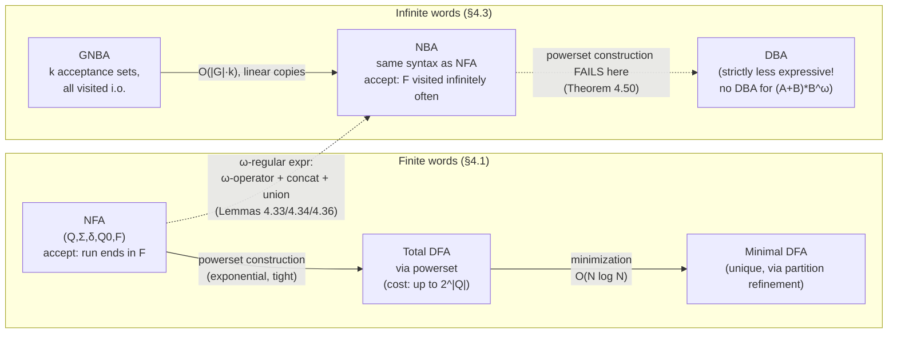

# Automata over Finite and Infinite Words

[[book-guidelines|↩ Back to guidelines]]

## Why a verification book needs an automata course

Model checking, as Baier and Katoen set it up in the first three chapters, reduces "does the system satisfy the property?" to "is a certain set of infinite words disjoint from a certain other set of infinite words?" A run of a transition system is an infinite sequence of states, and once you project onto the atomic propositions that hold at each state you get an infinite word over the alphabet $2^{AP}$. A linear-time property is *just* a set of such words — the "good" ones. So verification is fundamentally a *language membership/inclusion* question over $(2^{AP})^\omega$.

That reduction is only useful if you have machinery for representing infinite sets of infinite words *finitely*, and for computing with them — union, intersection, complement, emptiness. That machinery is automata. Chapter 4 builds it in two layers:

1. **Finite words first** (§4.1) — nondeterministic and deterministic finite automata (NFA/DFA), because the algorithms and constructions here (product, powerset, closure) are the technical ancestors of everything that follows, and because they suffice for *safety* properties, whose violations are always witnessed by a finite bad prefix.
2. **Infinite words** (§4.3) — Büchi automata, because safety alone doesn't cover liveness. "The process is scheduled infinitely often" or "every request eventually gets a response" can't be falsified by any finite prefix — you need an acceptance condition that talks about the *entire* infinite run.

What breaks without this layering: if you tried to jump straight to Büchi automata without first internalizing NFAs, the single most important and counterintuitive fact in the chapter — that **the powerset construction, the workhorse that makes NFA-to-DFA determinization free of extra state,  simply fails for Büchi acceptance** — would look like an arbitrary technical hiccup instead of the deep expressiveness gap it actually is. Sections 4.2 and 4.4 (the model-checking algorithms that *use* these automata against transition systems) are covered in the next article; this one is purely about the automata as mathematical objects.

---

## Part 1 — Automata on finite words (§4.1)

### Nondeterministic finite automata: the definition, read literally

[[Safety-Properties-and-Invariants#The book's definition|The book's Definition]] 4.1 gives an NFA as a 5-tuple

$$
A = (Q, \Sigma, \delta, Q_0, F)
$$

- $Q$: a finite set of states.
- $\Sigma$: an alphabet.
- $\delta : Q \times \Sigma \to 2^Q$: a transition *function* whose codomain is a **set of states**, not a single state — this is where the nondeterminism lives syntactically.
- $Q_0 \subseteq Q$: initial states (plural — an NFA can start in more than one place, or none at all).
- $F \subseteq Q$: accept (final) states.

The book immediately identifies $\delta$ with a transition *relation* $\to \, \subseteq Q \times \Sigma \times Q$, writing $q \xrightarrow{A} q'$ for $q' \in \delta(q, A)$. This relational view is the one that generalizes cleanly to Büchi automata later, so it's worth internalizing now rather than thinking purely in terms of the function.

A **run** for a finite word $w = A_1 \ldots A_n$ is a state sequence $q_0 q_1 \ldots q_n$ with $q_0 \in Q_0$ and $q_i \xrightarrow{A_{i+1}} q_{i+1}$ for each step (Definition 4.3). The run is *accepting* iff $q_n \in F$. The word $w$ is accepted iff *some* run accepts it — the "existential" or "oracle" semantics: nondeterminism is resolved as favorably as possible. The accepted language is

$$
L(A) = \{ w \in \Sigma^* \mid \text{there is an accepting run for } w \text{ in } A \}.
$$

**What breaks without nondeterminism in the model.** If you required a *unique* run per word (determinism), you'd lose the ability to represent, e.g., "the automaton doesn't commit to an interpretation of a prefix until it sees more input" — exactly the situation in Example 4.2's automaton for $(A+B)^*B(A+B)$ (the language "the symbol two positions before the end is $B$"): on seeing a $B$, the automaton can't yet tell if this $B$ is *the* pivotal one or just noise, so it forks into both hypotheses ($\delta(q_0, B) = \{q_0, q_1\}$).

**[[Concurrency-and-Communication-Modeling#Grounding|Grounding]] — Rust.** An NFA transition relation is naturally a `HashMap<(State, Symbol), HashSet<State>>`, and "run the NFA" is a *set* of live states you fan out and prune each step — this is precisely the powerset-construction state you'll build below, computed lazily instead of ahead of time:

```rust
use std::collections::{HashMap, HashSet};

#[derive(Clone, Copy, PartialEq, Eq, Hash)]
struct State(u32);

struct Nfa {
    delta: HashMap<(State, char), HashSet<State>>,
    initial: HashSet<State>,
    accept: HashSet<State>,
}

impl Nfa {
    /// The set of all states reachable after consuming `word`,
    /// starting from `current` (deltastar's incremental form).
    fn step(&self, current: &HashSet<State>, symbol: char) -> HashSet<State> {
        current
            .iter()
            .flat_map(|q| self.delta.get(&(*q, symbol)).into_iter().flatten().copied())
            .collect()
    }

    fn accepts(&self, word: &str) -> bool {
        let mut live = self.initial.clone();
        for c in word.chars() {
            live = self.step(&live, c);
            if live.is_empty() {
                return false; // stuck — no run can survive
            }
        }
        !live.is_disjoint(&self.accept)
    }
}
```

This is *literally* the extended transition function $\delta^*$ the book defines right after (Definition preceding Lemma 4.5): $\delta^*(q,\varepsilon)=\{q\}$, $\delta^*(q, A) = \delta(q,A)$, and $\delta^*(q, A_1 \ldots A_n) = \bigcup_{p \in \delta(q,A_1)} \delta^*(p, A_2 \ldots A_n)$. Lemma 4.5 restates acceptance purely in terms of $\delta^*$: $L(A) = \{w \mid \delta^*(q_0, w) \cap F \ne \emptyset \text{ for some } q_0 \in Q_0\}$ — exactly what `accepts` above computes.

### Emptiness is reachability

Theorem 4.7 is a two-line but load-bearing observation: $L(A) = \emptyset$ iff no accept state is reachable from any initial state. This turns a *language-theoretic* question (is this infinite set of words empty?) into a *graph* question decidable by DFS/BFS in $O(|A|)$ time. This pattern — reduce a language question about a system to a *reachability* question on a graph derived from it — is the master idea of the entire chapter, repeated at ever-higher levels of sophistication (invariant checking in §4.2, persistence/cycle-detection in §4.4).

### Closure properties, and why they matter for verification

The book states — and sketches proofs for — that regular languages are closed under union, concatenation, Kleene star, intersection, and complementation. **Intersection** is the one worth internalizing mechanically, because the *same* construction (the "synchronous product") reappears, essentially unchanged, as $TS \otimes A$ in the next chapter's model-checking algorithm:

$$
A_1 \otimes A_2 = (Q_1 \times Q_2,\ \Sigma,\ \delta,\ Q_{0,1}\times Q_{0,2},\ F_1\times F_2), \qquad
\frac{q_1 \xrightarrow{A}_1 q_1' \quad q_2 \xrightarrow{A}_2 q_2'}{(q_1,q_2) \xrightarrow{A} (q_1',q_2')}
$$

Both automata read the *same* symbol at each step and both have to be able to move; the product accepts iff both components simultaneously accept. This is Definition 2.26's synchronization operator specialized to full-alphabet synchronization — the book explicitly flags this connection (p.154, referring back to p.48). If your compiler ever needs to check that a value satisfies two independently-specified regular/DFA-shaped constraints at once (say, two refinement predicates each compiled to an automaton over a value's serialized representation), this product construction *is* the conjunction operator — no separate machinery needed.

**Complementation**, by contrast, needs determinism first: given a *total* DFA $A = (Q,\Sigma,\delta,q_0,F)$, complementing is trivial — just flip which states are final, $\bar A = (Q,\Sigma,\delta,q_0,Q\setminus F)$ — because a total DFA has *exactly one* run per word, so "not accepted" and "run ends outside $F$" coincide. The book flags (and leaves as an exercise) that this flip is *unsound* for an NFA: an NFA rejects a word when *no* run accepts, so its complement under state-flipping would need *all* runs to end in $F$, which the construction doesn't ensure.

### The powerset construction, and its cost

Definition/procedure around p.157: any NFA $A = (Q,\Sigma,\delta,Q_0,F)$ can be turned into an equivalent *total* DFA $A_{\det}$ whose states are **subsets of $Q$**:

$$
A_{\det} = (2^Q, \Sigma, \delta_{\det}, Q_0, F_{\det}), \qquad
F_{\det} = \{Q' \subseteq Q \mid Q' \cap F \ne \emptyset\}, \qquad
\delta_{\det}(Q', A) = \bigcup_{q \in Q'} \delta(q,A).
$$

This is exactly the `step` function above lifted to a state machine over *sets* rather than computed lazily per-word — determinization simply pre-tabulates every reachable subset. Correctness (Lemma 4.5's extension) is immediate: $\delta_{\det}^*(Q_0, w) = \bigcup_{q_0 \in Q_0} \delta^*(q_0, w)$, so $L(A_{\det}) = L(A)$.

**What breaks without care here — the blow-up is real and tight.** $|2^Q| = 2^{|Q|}$ states are *available*, and the book gives the family $E_k = (A+B)^*B(A+B)^k$ ("the $k$-th-from-last symbol is $B$") as a witness that this exponential is *unavoidable*, not an artifact of a sloppy construction: an NFA with $k+2$ states suffices (guess when the $k$-lookback window starts), but **no DFA with fewer than $2^k$ states exists** — intuitively, a deterministic automaton reading left-to-right has to *remember* the last $k$ symbols verbatim (there's no oracle to consult later), and there are $2^k$ distinct $k$-bit histories that must be kept as distinguishable states.

**Grounding — Python** (small sketch, not load-bearing): computing the reachable subset of $A_{\det}$ lazily is exactly a BFS over sets:

```python
def determinize_reachable(nfa_delta, q0_set, alphabet):
    from collections import deque
    start = frozenset(q0_set)
    seen = {start}
    queue = deque([start])
    det_delta = {}
    while queue:
        S = queue.popleft()
        for a in alphabet:
            T = frozenset(q for q in S for q2 in nfa_delta.get((q, a), ()) for q in (q2,))
            det_delta[(S, a)] = T
            if T not in seen:
                seen.add(T)
                queue.append(T)
    return seen, det_delta  # |seen| can be up to 2^|Q|, but is often far smaller
```

The `seen` set only grows to include *reachable* subsets, which in practice is far below $2^{|Q|}$ — this is the same "explore only what's reachable" discipline the book leans on throughout (Theorem 4.7's reachability-as-emptiness idea, again).

### DFA minimization

The book states (without proof, deferring to Chapter 7's bisimulation-partition-refinement machinery) that every regular language has a **unique minimal DFA up to isomorphism**, computable by a partition-refinement algorithm in $O(N \log N)$. The point to take now, ahead of Chapter 7, is the *shape* of [[Probabilistic-Computation-Tree-Logic#The algorithm|the algorithm]]: start with one coarse partition (final vs. non-final states), then repeatedly split blocks that a "splitter" symbol distinguishes, until no split makes progress. This is the same **fixed-point-by-refinement** pattern you'll meet again for bisimulation quotients — DFA minimization is "bisimulation minimization for DFAs" in every way that matters, and the book says as much explicitly.

**Lean angle:** uniqueness-up-to-isomorphism of the minimal DFA is a clean instance of "define an equivalence, quotient by it, show the quotient is initial/terminal in the right category" — the same shape of argument used to justify that Lean's own definitional-equality quotients (e.g. `Quot`) give a canonical representative. If you're building the automaton-based abstract domains sketched in the workbench's `sat-smt-csp` focus area, this canonicity is exactly what lets you use a minimized DFA as a *hashable, comparable* representation of an abstract value — two semantically-equal automata-shaped domain elements minimize to the same object, so equality-checking on the domain becomes pointer/structural equality on minimal DFAs.

---

## Part 2 — Automata on infinite words (§4.3)

### Why finite-word machinery isn't enough

Safety properties have a finite "smoking gun": a bad prefix. Liveness properties ("infinitely often $a$", "eventually forever $a$") don't — no finite prefix ever conclusively falsifies them, because the good behavior could always still start on the very next symbol. So the object you need to accept or reject is an *entire infinite word*, and the acceptance criterion has to be a genuinely infinitary condition.

### $\omega$-regular expressions and languages

The book extends the regular-expression vocabulary with a single new operation: infinite repetition, denoted by the ordinal $\omega$. For $L \subseteq \Sigma^+$ (crucially, **no empty word** — otherwise "repeat $\varepsilon$ infinitely" is nonsense), define

$$
L^\omega = \{ w_1 w_2 w_3 \cdots \mid w_i \in L,\ i \ge 1 \} \subseteq \Sigma^\omega.
$$

An **$\omega$-regular expression** (Definition 4.23) has the shape

$$
G = E_1.F_1^\omega + \cdots + E_n.F_n^\omega
$$

with $E_i, F_i$ ordinary regular expressions over finite words and $\varepsilon \notin L(F_i)$. Its language is $L^\omega(G) = \bigcup_i L(E_i).L(F_i)^\omega$ — a finite prefix, then infinite repetition of a nonempty-word pattern. A language is **$\omega$-regular** if it equals $L^\omega(G)$ for some such $G$.

Worked example from the book: "infinitely often $A$" over $\{A,B\}$ is $(B^*A)^\omega$; "only finitely many $A$'s" is $(A+B)^*B^\omega$. Every invariant is $\omega$-regular (it's $\Phi^\omega$ where $\Phi$ is identified with the union of satisfying letters), and — via the closure-under-complementation of $\omega$-regular languages — every *regular safety property* is $\omega$-regular too, since its complement (bad-prefix language times anything) is $\omega$-regular. This is the technical bridge that lets Büchi automata subsume the NFA-based safety-checking machinery of §4.2 as a special case, rather than being an unrelated tool.

### Nondeterministic Büchi automata (NBA)

Definition 4.27: **syntactically identical** to an NFA — same tuple $(Q,\Sigma,\delta,Q_0,F)$ — but the *semantics* changes completely. A run for an infinite word $\sigma = A_0A_1A_2\ldots$ is an infinite state sequence $q_0q_1q_2\ldots$, and it is **accepting iff some state in $F$ recurs infinitely often** — not "ends in $F$" (there is no end), but "$F$ is visited infinitely often":

$$
\mathcal{L}_\omega(A) = \{\sigma \in \Sigma^\omega \mid \text{some accepting run for } \sigma \text{ exists}\}.
$$

This single change of acceptance condition — same [[Timed-CTL-and-TCTL-Model-Checking#Syntax|syntax]], "visit $F$ i.o." instead of "end in $F$" — is what makes Büchi automata the infinite-word analogue of NFAs, and it's worth sitting with why this is the *natural* infinitary weakening of "end in an accept state": since every run over an infinite word is itself infinite and $Q$ is finite, *some* state necessarily recurs infinitely often (pigeonhole) — the acceptance condition just asks that one of the recurring states be a "good" one.

**Worked example (the book's Example 4.28, Figure 4.7):** an NBA over $\{A,B,C\}$ with states $q_1 \xrightarrow{A} q_2$, self-loop $q_1 \xrightarrow{C} q_1$, $q_2 \xrightarrow{B} q_3$, self-loop $q_3 \xrightarrow{B} q_3$, and $q_3 \xrightarrow{B} q_2$ (accept state $q_3$). The run $q_1q_2q_3^\omega$ is accepting; $q_1^\omega$ is not (never touches $q_3$); $(q_1q_2q_3)^n q_1^\omega$ is not (only finitely many visits to $q_3$). Its accepted language: $(C^*AB(B^+ + BC^*AB)^*)^\omega$ — roughly "$C$'s then $A$ then $B$'s, repeated forever."

**Rust grounding for the semantic shift.** Where the NFA `accepts` function above just checked `!live.is_disjoint(&accept)` at the *end* of a finite word, a Büchi acceptance check needs to detect infinite recurrence of an accept state along *one specific run* — which for a finite-state automaton means: does some accepting state lie on a **reachable cycle**? That's Lemma 4.41 below, and it's exactly why NBA emptiness checking is a graph-cycle-detection problem rather than a simple reachability problem:

```rust
// NBA nonemptiness (Lemma 4.41): L_omega(A) != empty
// iff some accept state lies on a cycle reachable from an initial state.
fn nba_nonempty(nfa_shaped: &Nfa) -> bool {
    let reachable = bfs_reachable(&nfa_shaped.initial, &nfa_shaped.delta);
    reachable.iter().any(|q| {
        nfa_shaped.accept.contains(q) && lies_on_cycle(*q, &nfa_shaped.delta)
    })
}
```

This is precisely why Chapter 4's algorithmic core upgrades from *reachability* (Theorem 4.7, for NFA emptiness) to *reachability-of-a-cycle* (Theorem 4.42, for NBA emptiness, still $O(|A|)$ via SCC decomposition) — the same complexity class, but a strictly more structural question, and it's the seed of the nested-DFS algorithm covered in the model-checking-application article.

### Closure constructions: building NBAs compositionally

The book proves Theorem 4.32 (NBAs $\equiv$ $\omega$-regular languages) by literally re-deriving each $\omega$-regular-expression building block as an NBA operation:

- **Union** (Lemma 4.33): disjoint union of state spaces, union of initial/accept sets. Trivial — $|A| = O(|A_1|+|A_2|)$.
- **$\omega$-operator on an NFA** (Lemma 4.34): given NFA $A$ with $\varepsilon \notin L(A)$, first normalize so initial states have no incoming edges and aren't accepting (add a fresh `qnew` if needed), then reroute every transition into an old accept state so it *also* fans out to all of $Q_0$ again. Accept states of the new NBA are exactly $Q_0$. Intuition: every time the run "would have accepted" a finite chunk, instead of stopping, restart the NFA — this literally implements "repeat forever," and the accept condition "$Q_0$ visited infinitely often" is equivalent to "infinitely many successful restarts."
- **Concatenation of a regular language and an $\omega$-regular one** (Lemma 4.36): run the NFA for $L(A)$; the first time it *could* accept, nondeterministically also branch into the NBA $A'$'s initial states (keeping both options alive via nondeterminism), and give the combined automaton $A'$'s accept sets.

Then: build $A_i$ for each $F_i^\omega$ via the $\omega$-operator, build $E_i.F_i^\omega$ via concatenation, and union the $n$ results — mechanically covering any $\omega$-regular expression $G = E_1.F_1^\omega + \cdots + E_n.F_n^\omega$.

The converse direction (Lemma 4.39, NBA $\Rightarrow$ $\omega$-regular) is a genuinely pretty argument worth internalizing: for each pair of states $q,p$, let $L_{qp}$ be the (ordinary, regular!) language of finite words driving $A$ from $q$ to $p$. Any accepting run visits some accept state $q\in F$ infinitely often, so it factors as $w_0 w_1 w_2 \cdots$ where $w_0 \in L_{q_0 q}$ (get from start to the recurring accept state) and each subsequent $w_k \in L_{qq} \setminus \{\varepsilon\}$ (loop back to $q$, nontrivially, forever). Hence

$$
\mathcal{L}_\omega(A) = \bigcup_{q_0 \in Q_0,\ q\in F} L_{q_0q} \cdot (L_{qq}\setminus\{\varepsilon\})^\omega,
$$

a finite union of $\omega$-regular expressions built from the (regular, finite-word) languages of an ordinary NFA. This is a beautiful example of using the *finite-word* toolbox as a subroutine to characterize infinite-word behavior — the "cut the infinite run at every recurrence of a distinguished loop point" idea recurs constantly in verification (it's essentially the lasso-shaped counterexample structure that model checkers report to users).

### Deterministic Büchi automata are strictly weaker — the central theorem

This is the chapter's sharpest and most consequential result, so it's worth walking the proof rather than just citing it.

**Claim (Theorem 4.50):** there is no DBA $A$ with $\mathcal{L}_\omega(A) = \mathcal{L}_\omega((A+B)^*B^\omega)$ — i.e. no deterministic Büchi automaton for "eventually forever $B$."

**Proof idea, by contradiction and a pumping-style argument.** Suppose such a deterministic total $A=(Q,\Sigma,\delta,q_0,F)$ exists.
- $\sigma_1 = B^\omega \in \mathcal L_\omega((A+B)^*B^\omega)$, so (being deterministic, there's exactly one run) there's a unique accept state $q_1$ hit after some $B^{n_1}$: $\delta^*(q_0, B^{n_1}) = q_1 \in F$.
- $\sigma_2 = B^{n_1}AB^\omega$ is *also* in the target language (it's eventually forever $B$ after one $A$), so following the *same deterministic run* from $q_1$, there's $n_2$ with $\delta^*(q_0, B^{n_1}AB^{n_2}) = q_2 \in F$.
- Repeat forever: you get an infinite sequence of "checkpoints" $q_1, q_2, q_3, \ldots \in F$, all reached from $q_0$ by words with a strictly increasing number of $A$'s interspersed with $B$-blocks.
- Since $Q$ is finite, two checkpoints coincide: $\delta^*(q_0, \ldots B^{n_i}) = \delta^*(q_0, \ldots B^{n_j})$ for some $i<j$. But determinism means the automaton's *entire future behavior* from that state is fixed regardless of how it got there — so it must accept the word obtained by looping the $i\to j$ segment forever, which contains **infinitely many $A$'s**. That word is *not* in "eventually forever $B$." Contradiction.

The crux is determinism: a deterministic automaton has no way to *retroactively* decide "this was the last $A$" — it has already committed to a state, and by finiteness of $Q$, forcing infinitely many distinct "yes, I've just confirmed foreverness" commitments collapses into a cycle that necessarily also accepts a word with infinitely many $A$'s. The NBA that *does* accept this language (Figure 4.18: $q_0 \xrightarrow{\text{true}} q_0$, $q_0 \xrightarrow{a} q_1$, $q_1 \xrightarrow{a} q_1$, with $q_1$ accepting) works precisely because it's allowed to **guess, nondeterministically and unfalsifiably from any finite observation, when the final "forever" segment begins** — a genuine oracle, not resolvable by any amount of bounded lookahead or state.

**Why the powerset construction can't rescue this.** You might hope to determinize any NBA the same way you determinize NFAs — track the *set* of live states. The book explains exactly why this fails: the powerset-DFA's natural acceptance condition ("visit a state-set that intersects $F$, infinitely often") is a *different, weaker* condition than "some single run visits $F$ infinitely often." A word can repeatedly offer the *opportunity* to pass through an accept state (at unboundedly many different offsets across different candidate runs) without any *one* run actually doing so infinitely often. Concretely, for the NBA in Figure 4.17 (accepting $(A+B)^*B^\omega$) fed the word $(AB)^\omega$: at every occurrence of $B$, *some* run could choose to enter the accept state $q_1$ then — so the reachable-subset automaton keeps re-entering an "accepting-looking" subset infinitely often — yet no single run ever survives past the following $A$ while remaining in $q_1$, since $q_1$ has no transition on $A$. The powerset construction conflates "infinitely many isolated opportunities across different runs" with "one run, infinitely persistent" — and only the latter is genuine Büchi acceptance.

**What this means for practice, concretely:** this is *the* reason model checkers that need determinism (e.g. anything requiring a product construction where determinism of one side matters, or probabilistic model checking against $\omega$-regular properties in Chapter 10, which needs deterministic **Rabin** automata instead) cannot simply reuse Büchi automata — they need a strictly more expressive deterministic acceptance condition (Rabin/Streett/parity conditions), which the book flags but defers.

### Generalized Büchi automata (GNBA)

A practical wrinkle: translating an LTL formula into an automaton (next chapter) naturally produces *several* acceptance conditions that must **all** hold simultaneously — "eventually always visit $F_1$" *and* "eventually always visit $F_2$", etc. A GNBA (Definition 4.52) generalizes the acceptance component from a single set $F \subseteq Q$ to a *family* $\mathcal F = \{F_1,\ldots,F_k\} \subseteq 2^Q$, and a run is accepting iff it visits **every** $F_i$ infinitely often:

$$
\text{accepting} \iff \forall F \in \mathcal F.\ \exists^\infty j.\ q_j \in F.
$$

Worked example (Figure 4.19): two independent "infinitely often" conditions — $F_1=\{q_1\}$ (via proposition $crit_1$) and $F_2=\{q_2\}$ (via $crit_2$) — jointly express "process 1 *and* process 2 are each in their critical section infinitely often." Note this is a genuinely different (and, notably, *not* simply intersectable via a naive product of two separate NBAs' accept conditions) requirement from "there exist infinitely many positions where *both* hold simultaneously" — the GNBA's conjunction lets the two recurrences happen at staggered, unrelated positions.

**GNBA $\to$ NBA translation (Theorem 4.56)** is the practically important direction, since GNBAs are a convenience, not extra power: take $k$ copies of the GNBA's state space; a run advances to copy $i{+}1$ only upon visiting (in copy $i$) a state of $F_i$, cycling back to copy 1 after $F_k$; declare "accept state of copy 1" as the sole Büchi accept condition. Forcing the run to cycle through all $k$ copies to return to an accepting state of copy 1 forces it to have visited every $F_i$ along the way — a clean encoding of "AND of infinitely-often" into ordinary Büchi's single "infinitely often." Blow-up: $O(|G|\cdot k)$, linear, not exponential — much cheaper than the finite-word powerset construction, which is worth contrasting explicitly: **conjunction of acceptance conditions is cheap (linear copies) in Büchi-land, whereas determinization is not** — a genuinely different cost profile from finite automata, where determinization is the expensive operation and intersection-via-product is the cheap one.



---

## Where this leads

Within the book, this chapter's automata are pure mathematical objects — no transition system has appeared yet in this chapter. The *next* article (Automata-Based Verification of Properties, Topic 10 / §4.2 & §4.4) is where these get put to work: NFAs recognizing bad-prefix languages get producted against a transition system to reduce regular-safety-checking to invariant-checking, and NBAs recognizing "bad trace" languages get producted against a transition system to reduce $\omega$-regular-property-checking to persistence-checking (nested DFS for cycle detection) — directly generalizing the emptiness-as-reachability and emptiness-as-cycle-detection results proved here (Theorems 4.7 and 4.42). GNBAs specifically resurface as the target of the LTL-to-automaton translation in Chapter 5 (§5.2), where a formula's *closure* and *elementary sets* become GNBA states.

**Focus-area connection (`sat-smt-csp`).** The workbench's learning goals tag this topic under SAT/SMT/CSP, specifically flagging "automata/DFA-based domains for abstract data structures" as a downstream payoff. The mechanism worth carrying forward into the CSP-kernel design: a minimized DFA is a canonical, hashable representation of a regular set — exactly the shape needed for an abstract domain over string-like or sequence-like program values (e.g. representing the set of reachable states of a string-processing routine, or a regex-shaped refinement predicate, as a lattice element). The powerset-construction blow-up (§4.1) is the direct warning label for that design: if your domain elements are themselves automata built by repeated product/union operations (the same operations regular-language closure gives you for free), you inherit the same worst-case exponential unless you keep the automata deterministic *and* minimized at every step, or work with symbolic (BDD-style) representations of the transition relation rather than explicit states — foreshadowing Chapter 6's OBDD-based symbolic model checking, which solves an analogous explosion problem for transition systems by never materializing states explicitly. The DBA-vs-NBA expressiveness gap (Theorem 4.50) is also a cautionary tale specifically relevant to a CSP/abstract-interpretation kernel: if a downstream algorithm secretly needs *determinism* (many product/complementation constructions do), reaching for Büchi acceptance is not free — you may need a Rabin- or parity-style condition instead, exactly as Chapter 10's probabilistic model checking does.
