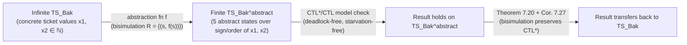
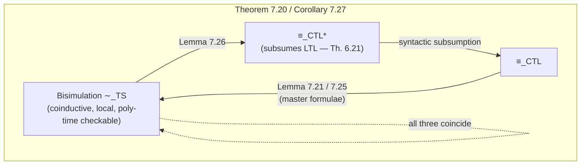

# Bisimulation Equivalence

[[book-guidelines|↩ Back to guidelines]]

## The problem this solves: two systems that "look the same" to any observer

Chapter 2 of the book already gave you the villain of this story: state-space explosion. A composite system of $n$ components has a state space whose size multiplies across components — $\prod_i |S_i|$ — and no amount of clever engineering makes that stop being exponential. If model checking is going to survive contact with real systems, you need a way to replace a huge transition system $TS$ with a smaller one $\overline{TS}$ *without losing the truth of the properties you care about*.

"Smaller but equivalent" needs a precise notion of equivalent. The one you'd reach for first — trace equivalence, i.e. two systems produce exactly the same sets of infinite label-sequences — is already in the book (Chapter 3) and it is enough to preserve linear-time (LTL) properties. But it has two problems:

1. **It's expensive to check.** Trace equivalence checking is PSPACE-complete (stated explicitly in §7.3 of the book) — you're comparing languages, and language equivalence for automata-like objects is inherently a global, non-local question.
2. **It doesn't preserve branching-time properties.** CTL and CTL$^*$ formulae talk about the *branching structure* of a computation tree — "there exists a path such that…", "for all paths, eventually…". Two systems can have identical trace sets while disagreeing about which choices are available at intermediate points, and that's exactly the kind of distinction $\exists\bigcirc$ and $\forall\Box$ can detect. So trace equivalence is simply too coarse to be sound for CTL/CTL$^*$ — it would let you "prove" a CTL formula on a smaller model that doesn't actually hold on the real one.

Bisimulation equivalence is the answer to both problems. It's a *local*, step-by-step notion — check that each individual transition can be mirrored, with no need to reason about entire infinite paths — and it turns out (this is the chapter's central theorem) to be exactly the right equivalence to preserve *all* of CTL$^*$, not just LTL. And because the definition is entirely "local" (about single transitions), it's algorithmically checkable in polynomial time via *partition refinement*, which is the subject of the book's very next section, §7.3 ([[Partition-Refinement-Algorithms]] territory, though this article stays inside §7.1–7.2).

**[[Concurrency-and-Communication-Modeling#What breaks without it|What breaks without it]]:** if you only had trace equivalence, you could only ever verify LTL properties on an abstracted/minimized model. [[CTL-Model-Checking|CTL model checking]] — which the book earlier showed you can do in linear time, cheaper than LTL's PSPACE-completeness — would have no correctness-preserving abstraction technique at all. Bisimulation is what makes "verify small, conclude big" work for the entire branching-time world.

## Bisimulation between two transition systems (Definition 7.1)

### Intuition first

Before any symbols: say $TS$ can *simulate* $TS'$ if every step $TS'$ can take, $TS$ can also take (into a "matching" state). Bisimulation is *mutual* simulation — both directions at once, and recursively: the states you land in after mimicking a step must themselves still be able to mimic each other, forever. This is why the book calls the definition **coinductive** — it isn't built up from a base case toward larger cases (like induction on natural numbers); it's the *largest* relation consistent with the mimicking requirement. You verify membership in it not by constructing it from small pieces but by exhibiting *any* relation with the mimicking property and noting your states are in it — the actual bisimulation equivalence $\sim$ is the union of all such relations (Remark 7.9), i.e. the coarsest one.

### The formal definition

Let $TS_i = (S_i, Act_i, \rightarrow_i, I_i, AP, L_i)$ for $i = 1, 2$ be two transition systems sharing the same set of atomic propositions $AP$. A **bisimulation** for $(TS_1, TS_2)$ is a relation $R \subseteq S_1 \times S_2$ such that:

$$
\begin{aligned}
\text{(A)}\quad & \forall s_1 \in I_1\, (\exists s_2 \in I_2.\ (s_1,s_2)\in R) \ \text{ and }\ \forall s_2 \in I_2\, (\exists s_1 \in I_1.\ (s_1,s_2)\in R) \\
\text{(B)}\quad & \text{for all } (s_1,s_2)\in R: \\
& \quad(1)\ L_1(s_1) = L_2(s_2) \\
& \quad(2)\ s_1 \to s_1' \implies \exists s_2' \in \mathrm{Post}(s_2).\ (s_1', s_2') \in R \\
& \quad(3)\ s_2 \to s_2' \implies \exists s_1' \in \mathrm{Post}(s_1).\ (s_1', s_2') \in R
\end{aligned}
$$

$TS_1$ and $TS_2$ are **bisimilar**, written $TS_1 \sim TS_2$, if *some* bisimulation exists for the pair. Note what's *not* required: nothing says $R$ is a function, nothing says the number of matching successors is equal — one transition on one side can be matched by an entirely different (even multiple, nondeterministically-chosen) transition on the other, as long as the target states are themselves related. Condition (A) anchors initial states; (B.1) is "locally indistinguishable"; (B.2)/(B.3) are the two directions of stepwise mimicry.

The book's own running example: two vending machines that both accept `pay` and dispense `beer`/`soda`, but one has *two different internal ways* of arriving at delivering beer. A relation $R = \{(s_0,t_0), (s_1,t_1), (s_2,t_2), (s_2,t_3), (s_3,t_4)\}$ (note $s_2$ maps to *two* states — that's fine, condition (B.3) just needs *some* match) witnesses $TS_1 \sim TS_2$: the extra internal branching is invisible to any external observer watching only the labels. Change the machine so that the *choice* of drink happens at the moment of paying (rather than after), and bisimulation correctly says the two machines are *not* equivalent — one state ($s_1$, "either drink is still possible") simply has no counterpart once the choice has already been committed to.

**What breaks without condition (B) applying at every reachable pair, not just the anchor states:** if you only required matching at the initial states, you'd be checking something closer to "same immediate options," which says nothing about deeper behavior. The coinductive character — the matching requirement has to keep holding *all the way down every path* — is what makes bisimulation strong enough to imply full trace equivalence (Theorem 7.6, via Lemma 7.5's "path lifting": any path in one system lifts to a statewise-related path of the same length in the other) while still being checkable locally, one transition at a time.

`Lemma 7.4` establishes $\sim$ is an equivalence relation (reflexive via the identity relation, symmetric via $R^{-1}$, transitive via relational composition $R_{1,2}\circ R_{2,3}$) — routine, but worth internalizing the transitivity proof's pattern once, because you'll see the same "compose two witnessing relations" trick reused constantly in coinductive proofs generally.

### Grounding: bisimulation as a coalgebraic/coinductive check

**Rust.** A transition system is naturally a labeled graph; checking "is $R$ a bisimulation" is a first-order predicate over it. Model the two systems as `enum`-indexed graphs and write the checker directly — this is exactly the shape of code you'd write to *validate* a claimed bisimulation certificate (e.g., emitted by a partition-refinement pass) rather than to search for one:

```rust
use std::collections::{HashMap, HashSet};

type State = usize;
type Label = HashSet<&'static str>;

struct TransitionSystem {
    labels: HashMap<State, Label>,
    post: HashMap<State, HashSet<State>>,
    init: HashSet<State>,
}

/// Checks that `rel` (as a set of pairs) witnesses ts1 ~ ts2.
/// This is a direct transcription of Definition 7.1, conditions (A) and (B).
fn is_bisimulation(
    ts1: &TransitionSystem,
    ts2: &TransitionSystem,
    rel: &HashSet<(State, State)>,
) -> bool {
    // (A) initial states are matched in both directions
    let a_forward = ts1.init.iter().all(|&s1| {
        ts2.init.iter().any(|&s2| rel.contains(&(s1, s2)))
    });
    let a_backward = ts2.init.iter().all(|&s2| {
        ts1.init.iter().any(|&s1| rel.contains(&(s1, s2)))
    });

    // (B) for every related pair: equal labels, and mutual step-mimicry
    let b_holds = rel.iter().all(|&(s1, s2)| {
        let same_label = ts1.labels[&s1] == ts2.labels[&s2];
        let forward = ts1.post.get(&s1).into_iter().flatten().all(|&s1p| {
            ts2.post.get(&s2).into_iter().flatten()
                .any(|&s2p| rel.contains(&(s1p, s2p)))
        });
        let backward = ts2.post.get(&s2).into_iter().flatten().all(|&s2p| {
            ts1.post.get(&s1).into_iter().flatten()
                .any(|&s1p| rel.contains(&(s1p, s2p)))
        });
        same_label && forward && backward
    });

    a_forward && a_backward && b_holds
}
```

This is deliberately a *checker*, not a *solver* — exactly the distinction the book draws between "it is often simple to manually indicate a bisimulation" versus "computing $\sim$ itself needs the algorithmic machinery of §7.3." A correctness-critical tool (a model checker's abstraction pass) wants both: a fast checker for validating a candidate relation, and the heavier partition-refinement algorithm to *compute* the coarsest one.

**Lean.** The coinductive character of Definition 7.1 is worth taking seriously rather than glossing over, because it is *literally* the same pattern as defining bisimilarity for corecursive/coinductive data types in a proof assistant. In Lean, you'd phrase "$R$ is a bisimulation" as a structure, and bisimilarity as an existential over all such structures (equivalently, the greatest fixed point of the "one-step mimicry" functor):

```lean
structure TransitionSystem (AP : Type) where
  State : Type
  Act   : Type
  step  : State → Act → State → Prop
  label : State → Set AP

def IsBisimulation {AP} (T : TransitionSystem AP) (R : T.State → T.State → Prop) : Prop :=
  ∀ s₁ s₂, R s₁ s₂ →
    T.label s₁ = T.label s₂ ∧
    (∀ a s₁', T.step s₁ a s₁' → ∃ s₂', T.step s₂ a s₂' ∧ R s₁' s₂') ∧
    (∀ a s₂', T.step s₂ a s₂' → ∃ s₁', T.step s₁ a s₁' ∧ R s₁' s₂')

/-- Bisimilarity is the union of all bisimulations — i.e. the *largest*
    relation with this closure property. This is the standard
    "exists a witnessing coinductive relation" encoding of a greatest
    fixed point, without needing Lean's dedicated coinduction support. -/
def Bisimilar {AP} (T : TransitionSystem AP) (s₁ s₂ : T.State) : Prop :=
  ∃ R, IsBisimulation T R ∧ R s₁ s₂
```

Two things transfer directly to elaborator/kernel work if you're building a Rust-based dependent-type checker: first, `IsBisimulation` is a *coinduction principle* — to prove `Bisimilar s₁ s₂` you don't unfold forever, you exhibit one `R` and discharge a single one-step obligation, exactly like proving a coalgebraic invariant. Second, the "largest relation satisfying a closure condition" pattern recurs whenever your type theory needs coinductive types (streams, infinite proof terms, potentially-diverging computation traces) — the same existential-over-witnessing-relations trick is how those get modeled without dedicated coinductive machinery in the kernel.

**Python**, for a fast sanity-check sketch when you don't need Rust's ceremony — verifying a *specific claimed* bisimulation on small examples like the vending machines:

```python
def is_bisimulation(post, label, init1, init2, rel):
    def matched(s1, s2):
        if label[s1] != label[s2]:
            return False
        fwd = all(any((s1p, s2p) in rel for s2p in post.get(s2, ())) for s1p in post.get(s1, ()))
        bwd = all(any((s1p, s2p) in rel for s1p in post.get(s1, ())) for s2p in post.get(s2, ()))
        return fwd and bwd

    a = all(any((s1, s2) in rel for s2 in init2) for s1 in init1)
    b = all(any((s1, s2) in rel for s1 in init1) for s2 in init2)
    return a and b and all(matched(s1, s2) for (s1, s2) in rel)
```

## Bisimulation on states of a single system, and the quotient (§7.1.1)

### From "two systems" to "two states of the same system"

Definition 7.1 compares two *systems*. Definition 7.7 specializes this to a relation *within one system* $TS = (S, Act, \to, I, AP, L)$: $R \subseteq S \times S$ is a bisimulation for $TS$ if for all $(s_1,s_2)\in R$, conditions (1)–(3) of Definition 7.7 hold — the same labeling-and-mutual-mimicry requirement as before, minus condition (A) (there's no "two sets of initial states" to reconcile). Two states $s_1 \sim_{TS} s_2$ are bisimilar if some such $R$ relates them.

The two notions aren't independent inventions — they're interchangeable by a simple trick. Given $TS_1, TS_2$, form the **disjoint union** $TS_1 \oplus TS_2$ (glue the state spaces, action sets, and transition relations together, keep both sets of initial states as the combined initial set). Then:

$$TS_1 \sim TS_2 \iff \forall C \in (S_1 \uplus S_2)/{\sim_{TS_1\oplus TS_2}}.\ I_1 \cap C \neq \emptyset \iff I_2 \cap C \neq \emptyset$$

In words: two systems are bisimilar exactly when, inside their disjoint union, every equivalence class either contains initial states from both or from neither. This is precisely the trick §7.3 exploits to reduce "are $TS_1$ and $TS_2$ bisimilar?" to a single-system partition-refinement computation on $TS_1 \oplus TS_2$ — you never need two separate machineries.

### The coarsest bisimulation and its quotient

`Lemma 7.8` is the load-bearing fact of this subsection: $\sim_{TS}$ (the union of *all* bisimulations on $TS$'s states) is itself:
1. an equivalence relation,
2. itself a bisimulation, and
3. the **coarsest** one — every other bisimulation $R$ on $TS$ refines it ($R \subseteq \sim_{TS}$).

"Coarsest" matters practically: it's the equivalence with the *fewest, largest* equivalence classes among all valid bisimulations, which means its quotient is the *smallest* correctness-preserving abstraction you can build this way. That's exactly what you want for fighting state-space explosion.

Given the coarsest bisimulation, the **bisimulation quotient** system is:

$$TS/{\sim} = (S/{\sim},\ \{\tau\},\ \to',\ I',\ AP,\ L')$$

where states become equivalence classes $[s]_\sim$, all actions collapse to a single anonymous label $\tau$ (action identity is irrelevant to state-based bisimulation — this is the state-based/action-based distinction the next section makes precise), $I' = \{[s]_\sim \mid s \in I\}$, $L'([s]_\sim) = L(s)$ (well-defined because bisimilar states are equally labeled), and $[s]_\sim \to' [s']_\sim$ iff some concrete representative transitions $s \to s'$. `Theorem 7.14` then closes the loop: $TS \sim TS/{\sim}$ — the quotient is bisimilar to the original, meaning (once you have §7.2's theorem in hand) it satisfies *exactly the same CTL$^*$ formulae*.

### Two worked examples that show the payoff

**The Printers example (finite but exponential collapse).** $n$ independent printers, each a 2-state cycle `ready ↔ print`, composed by pure interleaving: $TS_n = \text{Printer} \mathbin{|||} \cdots \mathbin{|||} \text{Printer}$. The full state space is $2^n$ states. But if you only care about *how many* printers are currently ready (label states with a count in $\{0,\ldots,n\}$, ignoring *which* printers), the quotient $TS_n/{\sim}$ has exactly $n+1$ states — a chain $n \to n{-}1 \to \cdots \to 0$. This is the textbook case of state-space explosion caused entirely by irrelevant identity information, and bisimulation quotienting is precisely the tool that discards it.

**The Bakery algorithm (infinite → finite).** Lamport's mutual-exclusion algorithm uses two unboundedly growing "ticket" counters $x_1, x_2$, so the concrete transition system is *infinite*. LTL/CTL model checking is literally impossible on it directly. But define an abstraction function $f$ that keeps only which of $x_1 = x_2 = 0$, $x_1 > x_2 > 0$, $x_2 > x_1 > 0$, $x_1 = 0 < x_2$, or $x_2 = 0 < x_1$ holds — throwing away the actual ticket values, which are irrelevant to who gets priority — and $R = \{(s, f(s))\}$ is a bisimulation between the infinite $TS_{Bak}$ and a *finite* abstract system $TS_{Bak}^{abstract}$. Because $TS_{Bak} \sim TS_{Bak}^{abstract}$, every CTL$^*$ property you check on the finite abstraction (deadlock-freedom, starvation-freedom stated as $\Diamond\Box$/$\Box\Diamond$ formulae) transfers back to the real, infinite-state algorithm. This is the single clearest illustration in the chapter of why bisimulation matters beyond "smaller state count" — it's sometimes the difference between *decidable* and *not even finite*.



**What breaks without the coarsest-bisimulation guarantee specifically:** any bisimulation $R$ (not necessarily $\sim$ itself) gives you a *sound* quotient $TS/R$, but a coarser, non-maximal choice of $R$ wastes potential compression — you'd keep states apart that could have been merged. The book notes the trade-off explicitly: manually exhibiting *some* bisimulation (as in the Bakery example above) is often easy; *computing* the maximal one $\sim$ requires the full partition-refinement algorithm of §7.3.

## Action-based bisimulation and congruence for parallel composition (§7.1.2)

### Why a second flavor of bisimulation

Everything above is **state-based**: it compares labels on states ($L(s)$) and quietly discards the identity of the action that caused a transition. This matches how the book has treated $AP$-labeled transition systems throughout. But an entire adjacent tradition — **process algebra** (CCS, CSP, the ambient calculus, and so on) — does the opposite: states carry no observable information, and everything hinges on the *labels of transitions* (the actions). The book's §7.1.2 briefly crosses over into this world because it matters for a property state-based bisimulation doesn't directly address: **compositionality**.

**Action-based bisimulation** (Definition 7.15) replaces conditions (B.2)/(B.3) with label-respecting versions:

$$
\begin{aligned}
(2')\quad & s_1 \xrightarrow{\alpha}_1 s_1' \implies \exists s_2'.\ s_2 \xrightarrow{\alpha}_2 s_2' \text{ and } (s_1',s_2')\in R \\
(3')\quad & s_2 \xrightarrow{\alpha}_2 s_2' \implies \exists s_1'.\ s_1 \xrightarrow{\alpha}_1 s_1' \text{ and } (s_1',s_2')\in R
\end{aligned}
$$

— note the *same* action label $\alpha$ must be matched, not just *some* transition to a related state. There is no independent state-labeling condition at all: everything observable lives on the edges.

### The congruence theorem — the actual payoff

**Lemma 7.16 (Congruence w.r.t. Handshaking)** is the reason this subsection exists in a model-checking book: if $TS_1 \sim^{Act} TS_1'$ and $TS_2 \sim^{Act} TS_2'$, then

$$TS_1 \parallel_H TS_2 \ \sim^{Act}\ TS_1' \parallel_H TS_2'$$

for parallel composition with handshaking synchronization over a shared action set $H$ (Definition 2.26). In plain language: **you can replace a component by anything action-bisimilar to it, inside any larger parallel composition, without changing the composite's action-bisimulation class.** The proof constructs the product relation $R = \{((s_1,s_2),(s_1',s_2')) \mid (s_1,s_1')\in R_1 \wedge (s_2,s_2')\in R_2\}$ from witnesses $R_1, R_2$ for the two components, and checks it independently for internal moves (a component acts alone, on an action outside $H$) and synchronized moves (both components move simultaneously on a shared $\alpha \in H$).

**What breaks without congruence:** without this property, "verify each component's abstraction separately, then compose the abstractions" would be *unsound* — nothing would guarantee the composite abstraction is equivalent to the composite concrete system. Congruence is exactly the algebraic property that licenses *compositional* verification: minimize each component in isolation, then compose the (small) minimized pieces, rather than building the full product first and minimizing that (which defeats the purpose, since building the product is the expensive step you were trying to avoid).

### Reconciling the two flavors

The book closes §7.1.2 by showing the two notions inter-translate for a single system $TS$, via small syntactic transformations:
- **State-based → action-based:** add a fresh sink state $t$, relabel every transition $s \to s'$ by the *target's* label $L(s')$ (so information that used to live on states now lives on edges), and route terminal states to $t$ via a $\tau$-edge. Then $s_1 \sim_{TS} s_2 \iff s_1 \sim^{Act}_{TS_{act}} s_2$.
- **Action-based → state-based:** split each state $s$ into copies $\langle s,\alpha\rangle$ tagged by "which action was used to enter it," treat the actions themselves as the new atomic propositions ($AP_{state} = Act$), and label $\langle s,\alpha\rangle$ with $\{\alpha\}$. Then $s_1 \sim^{Act}_{TS} s_2 \iff s_1 \sim_{TS_{state}} s_2$.

The point isn't that you'll implement these translations often — it's that *state-based and action-based bisimulation are the same underlying mathematical idea wearing different clothes*, and a result proved for one transfers to the other by this encoding, which is exactly why the book only bothers proving Lemma 7.16 once rather than duplicating every theorem.

## Bisimulation as the coarsest equivalence preserving CTL and CTL$^*$ (§7.2)

This is the chapter's centerpiece result, and it's what justifies calling the earlier machinery "the right" notion of equivalence rather than just "a convenient" one.

### Logical equivalence, defined

For transition systems without terminal states (needed because CTL/CTL$^*$ semantics assume only infinite paths — the same restriction seen throughout the LTL/CTL chapters):

- States $s_1, s_2$ are **CTL$^*$-equivalent** ($s_1 \equiv_{CTL^*} s_2$) if they satisfy *exactly the same* CTL$^*$ state formulae over $AP$.
- **CTL-equivalence** ($\equiv_{CTL}$) is the same idea restricted to CTL formulae.
- (LTL-equivalence, $\equiv_{LTL}$, is defined analogously and is exactly trace equivalence's logical shadow — Theorem 7.18 restates the already-known fact that trace equivalence is *finer* than LTL equivalence.)

### The theorem: three equivalences collapse into one

**Theorem 7.20.** For finite transition systems without terminal states:

$$\sim_{TS}\ =\ \equiv_{CTL}\ =\ \equiv_{CTL^*}$$

This is genuinely surprising on first read, because CTL$^*$ is *strictly more expressive* than CTL (it subsumes LTL, and LTL/CTL have incomparable expressiveness — Theorem 6.21 from the previous chapter). You would expect CTL$^*$-equivalence to be a *strictly finer* relation than CTL-equivalence, since a strictly richer logic should be able to distinguish more states. It doesn't: any two states a CTL$^*$ formula can tell apart, some *plain CTL* formula can already tell apart too. Practically: **to prove states are logically distinguishable, you never need to reach for CTL$^*$ — CTL alone always suffices.**

The proof is a three-link chain, and each link is independently worth understanding because each is a distinct proof technique:

**Link 1 — $\equiv_{CTL} \subseteq \sim_{TS}$ (Lemma 7.21, "CTL equivalence is finer than bisimulation").** Take $R = \{(s_1,s_2) \mid s_1 \equiv_{CTL} s_2\}$ and show it's a bisimulation. Labels match trivially (build the formula $\Phi = \bigwedge_{a \in L(s_1)} a \wedge \bigwedge_{a \notin L(s_1)} \neg a$ that pins down $s_1$'s exact label set; $s_1 \models \Phi$ forces $s_2 \models \Phi$, hence identical labels). The step-matching direction needs the chapter's second key idea:

**Master formulae (Remark 7.22).** For each CTL-equivalence class $C$, since the (finite!) system has only finitely many classes, build $\Phi_C = \bigwedge_{D \neq C} \Phi_{C,D}$ where each $\Phi_{C,D}$ separates $C$ from a specific other class $D$ ($\mathit{Sat}(\Phi_{C,D}) \supseteq C$, disjoint from $D$). The conjunction $\Phi_C$ then satisfies $\mathit{Sat}(\Phi_C) = C$ *exactly* — a single formula that pins down the whole equivalence class, no more and no less. Now the mimicry argument is almost mechanical: if $s_1' \in \mathrm{Post}(s_1)$ lies in class $C$, then $s_1 \models \exists\bigcirc \Phi_C$; since $s_1 \equiv_{CTL} s_2$, also $s_2 \models \exists\bigcirc \Phi_C$, so $s_2$ has *some* successor $s_2'$ with $s_2' \models \Phi_C$, hence $s_2' \in C$ too — meaning $(s_1', s_2') \in R$. Master formulae are the logical instrument that turns "these two states satisfy the same formulae" into "their successors can be paired up," which is precisely the local mimicry condition bisimulation demands.

The worked example on the Bakery quotient (Figure 7.9) makes this concrete: the class $C = \langle wait_1, wait_2, x_1{>}x_2{>}0\rangle$ is uniquely pinned down over $AP=\{crit_1,crit_2\}$ by $\Phi_C = \neg crit_1 \wedge \neg crit_2 \wedge \forall\bigcirc crit_2$ — "neither process is currently critical, and the *next* step is forced to be process 2 entering its critical section." That single small formula is enough to identify the class without any reference to the concrete ticket values that class abstracts over.

Remark 7.23 sharpens this further: the proof of Lemma 7.21 never uses $U$ (until) — only atomic propositions, $\wedge$, $\neg$, and $\exists\bigcirc$. So the logical characterization of bisimulation doesn't even need full CTL; a minimal modal fragment already suffices to distinguish any two non-bisimilar states.

Remark 7.24/Lemma 7.25 tighten the finiteness requirement: Lemma 7.21 genuinely needs a finite transition system (finitely many equivalence classes ⟹ a finite conjunction for $\Phi_C$) — there's an explicit counterexample with infinitely many atomic propositions where CTL-equivalence is *strictly coarser* than bisimulation. But the result survives for infinite systems if you only require them to be *finitely branching* (Lemma 7.25) — the proof switches from "conjoin all master formulae" to a contraposition argument over the (now-finite) successor set of a single state.

**Link 2 — $\sim_{TS} \subseteq \equiv_{CTL^*}$ (Lemma 7.26, "bisimulation is finer than CTL$^*$ equivalence").** Structural induction on formula shape, using the path-lifting lemma (Lemma 7.5) exactly where you'd expect: for the $\exists\varphi$ case, a witnessing path in one system lifts, statewise-bisimilarly, to a witnessing path in the other, and the induction hypothesis on the (simpler) path formula $\varphi$ closes the case.

**Link 3 — $\equiv_{CTL^*} \subseteq \equiv_{CTL}$** is immediate since CTL$^* \supseteq$ CTL syntactically.

Chaining $\equiv_{CTL} \subseteq \sim_{TS} \subseteq \equiv_{CTL^*} \subseteq \equiv_{CTL}$ collapses all three into equality — **Corollary 7.27**.

### Why this is *the* justification for abstraction-based verification

Put together with Theorem 7.14 ($TS \sim TS/{\sim}$), Corollary 7.27 gives you the full soundness argument for abstraction-based CTL/CTL$^*$ verification:

$$TS \sim TS/{\sim} \implies TS \equiv_{CTL^*} TS/{\sim} \implies \big(TS/{\sim} \models \Phi \iff TS \models \Phi\big) \text{ for every CTL}^*\text{ formula } \Phi$$

Both directions of the biconditional matter and both are useful: a *positive* result on the quotient ($TS/{\sim} \models \Phi$) certifies the original satisfies it too; a *negative* result ($TS/{\sim} \not\models \Phi$) certifies the original refutes it too — you never get a false positive or false negative from checking the smaller model instead of the real one. And the converse direction of [[Liveness-Properties-and-the-Safety-Liveness-Decomposition#The theorem|the theorem]] gives you a distinguishing tool for free: **if two finite systems are not bisimilar, some single CTL formula (with no `until` needed, per Remark 7.23) proves it** — Example 7.28 reuses the earlier "choice committed too early" vending machine and exhibits $\Phi = \exists\bigcirc(\exists\bigcirc beer \wedge \exists\bigcirc soda)$ as the separating formula.



### Grounding: implementing the soundness contract

**Rust.** The practical consequence for a verification tool's architecture is a *trust boundary*: your CTL model checker's `Sat` computation (from Chapter 6) only ever needs to run on the quotient, and the theorem is your justification that the answer is valid on the original. This is the same shape as a compiler's optimization-correctness argument — you don't re-verify the optimized program against the source on every run, you prove the *transformation itself* (bisimulation quotienting) preserves the semantics (CTL$^*$ truth) once, up front:

```rust
/// Soundness contract (as a type-level comment, not something Rust's
/// type system can check for you — this is exactly the kind of
/// obligation a proof-producing verifier would need to discharge
/// with an actual certificate, e.g. the witnessing bisimulation relation).
///
/// Given: quotient = bisimulation_quotient(ts)
/// Guarantee (Theorem 7.20 + Theorem 7.14): for all CTL* formula Phi,
///     ctl_star_check(&quotient, Phi) == ctl_star_check(&ts, Phi)
fn bisimulation_quotient(ts: &TransitionSystem) -> TransitionSystem {
    // computed via partition refinement — see §7.3
    todo!()
}
```

**Lean.** If your compiler's trusted kernel is going to *rely* on bisimulation-based model reduction anywhere (e.g., reducing a state-transition specification before discharging a verification condition), Theorem 7.20 is exactly the kind of soundness lemma you'd want stated and proved once in the kernel's meta-theory, in the same style as the `Bisimilar` definition above:

```lean
-- Sketch of the shape of the soundness statement you would prove
-- (not the full CTL*-syntax formalization, which is substantial).
theorem bisim_preserves_CTLStar
    {AP} (T : TransitionSystem AP) (s₁ s₂ : T.State)
    (h : Bisimilar T s₁ s₂) (φ : CTLStarFormula AP) :
    Satisfies T s₁ φ ↔ Satisfies T s₂ φ := by
  induction φ generalizing s₁ s₂ <;> sorry -- Lemma 7.26's structural induction
```

This is the point where "bisimulation" stops being a model-checking-specific curiosity and becomes a general *trusted-reduction* pattern: any time your system wants to replace a large object with a smaller, provably-indistinguishable one before running an expensive downstream check (a theorem prover's clause set, a type checker's normalized term, a static analyzer's abstract state), the *proof obligation* has the same three-part shape as Theorem 7.20 — define the relation, show it's a congruence/bisimulation for the operations you care about, show it induces logical/observational equivalence for the query language in question.

## Where this leads

**Backward dependencies:** this section leans on CTL/CTL$^*$ semantics (Chapter 6) for the entire §7.2 argument, and implicitly on trace equivalence and LTL (Chapter 3, 5) as the coarser baseline bisimulation improves on.

**Forward dependencies, inside the book:**
- §7.3, **Bisimulation-Quotienting Algorithms**, is the very next section — it answers "how do you actually *compute* $\sim$ and $TS/{\sim}$" via partition refinement (starting from the $AP$-partition, iteratively splitting blocks against "splitters" until stable), which is the algorithmic payoff this article's theory was building toward.
- §7.4–7.6, **Simulation Preorders**, weaken bisimulation to a one-directional relation and connect it to the *universal* fragment $\forall CTL^*$ rather than full CTL$^*$ — useful when you only need to preserve safety-style universally-quantified properties and can tolerate a coarser, cheaper-to-compute relation.
- §7.7–7.8, **[[Stutter-Equivalences|Stutter Equivalences]]**, weaken bisimulation further (matching a single transition against an entire path of "internally silent" states) — this is exactly the equivalence needed to justify Chapter 8's [[Partial-Order-Reduction|partial order reduction]], which cannot preserve full bisimulation without extra machinery.
- Chapter 10 reuses the entire pattern (relation → coarsest quotient → logical characterization) verbatim for **probabilistic bisimulation** on Markov chains, where the "step-matching" condition becomes "equal cumulative probability to every equivalence class," and the payoff theorem is the direct probabilistic analogue of Theorem 7.20 (probabilistic bisimulation coincides with PCTL/PCTL$^*$ equivalence).

**Connection to the standing project (Focus Area: Static Analysis & Abstract Interpretation).** This topic is a clean, self-contained instance of the soundness pattern your abstract-interpretation work will need constantly: an *abstraction* (the quotient map $s \mapsto [s]_\sim$) is sound for a *query language* (CTL$^*$) exactly when the abstraction relation is a bisimulation — a congruence for the one-step transition structure the query language quantifies over. The coarsest-bisimulation construction ($\sim_{TS}$ as the union/greatest fixed point of all bisimulations, Lemma 7.8) is structurally the same move as taking the best (most precise) sound abstraction in a Galois connection — both are extremal fixed points characterizing "as much compression as you can get away with while staying sound." And the master-formula technique (Remark 7.22) — synthesizing a formula that exactly characterizes an abstract state — is the same operation an invariant-generation pass needs when it has to produce a human/machine-checkable *certificate* for why two program states were merged into one abstract state, rather than merely asserting it. When you get to designing the CSP kernel's interaction with the abstract interpreter, this chapter is the textbook-clean special case (Boolean/CTL$^*$ observations, exact fixed points, no widening needed) against which the messier, lattice-based, widening-driven abstractions of general abstract interpretation should be compared.
