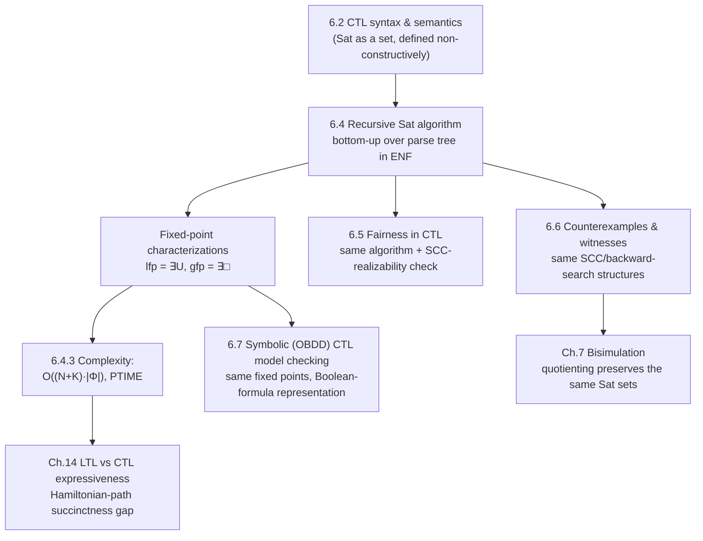

[[book-guidelines|↩ Back to guidelines]]

## Why a semantics isn't an algorithm

Section 6.2 of the book gives you a perfectly precise definition of $s \models \Phi$ for a CTL state formula $\Phi$: unwind the transition system into its computation tree from $s$, and check the quantified path condition against every path (or some path) in that tree. That definition is mathematically complete — and computationally useless as stated, because the computation tree is generally infinite, and even the *finite* transition system underneath it can have exponentially many distinct paths. You cannot decide $TS \models \forall\Diamond a$ by literally enumerating paths.

What Chapter 6.4–6.6 does is close that gap: it turns the *semantics* of CTL into a *decision procedure* — an algorithm that runs in time polynomial in the size of the transition system and the formula, produces a definite yes/no answer, and, on "no," hands back a concrete counterexample you can debug. This is the payoff that makes CTL model checking practically attractive relative to LTL (Chapter 5.2), whose corresponding decision procedure is PSPACE-complete. The mechanism that makes this possible — computing $\mathit{Sat}(\Phi)$ by structural recursion over the *finite* parse tree of $\Phi$, rather than by search over the *infinite* unwinding of $TS$ — is the single idea underlying everything in this chapter.

## The basic algorithm: bottom-up over the parse tree

The book restates the model-checking problem as: compute
$$\mathit{Sat}(\Phi) = \{ s \in S \mid s \models \Phi \}$$
for a finite transition system $TS = (S, Act, \rightarrow, I, AP, L)$ without terminal states, then check $I \subseteq \mathit{Sat}(\Phi)$. Solving for $\mathit{Sat}(\Phi)$ rather than merely deciding "$TS \models \Phi$?" is deliberately more general — it's called **global** model checking, since it labels *every* state, not just the initial ones — and this generality is exactly what lets [[Probabilistic-Computation-Tree-Logic#The algorithm|the algorithm]] be recursive: to compute $\mathit{Sat}$ of a compound formula you need $\mathit{Sat}$ of its immediate subformulae at *every* state, not just at $I$.

The recursion works over CTL's **existential normal form (ENF)** from Section 6.2.4 — every formula rewritten using only $\exists\bigcirc$, $\exists U$, and $\exists\Box$ (plus $\neg,\land$) as the primitive modalities, since $\forall$ and the other temporal operators are all definable from these. The parse tree of $\Phi$ in ENF has leaves labeled `true` or $a \in AP$, and internal nodes labeled $\neg$, $\land$, $\exists\bigcirc$, $\exists U$, or $\exists\Box$. The algorithm visits the tree bottom-up: at each node, once $\mathit{Sat}$ is known for the node's children, it's combined according to Theorem 6.23:

$$
\begin{aligned}
\mathit{Sat}(\mathbf{true}) &= S \\
\mathit{Sat}(a) &= \{ s \mid a \in L(s) \} \\
\mathit{Sat}(\Phi \land \Psi) &= \mathit{Sat}(\Phi) \cap \mathit{Sat}(\Psi) \\
\mathit{Sat}(\neg\Phi) &= S \setminus \mathit{Sat}(\Phi) \\
\mathit{Sat}(\exists\bigcirc\Phi) &= \{ s \mid \mathit{Post}(s) \cap \mathit{Sat}(\Phi) \neq \emptyset \}
\end{aligned}
$$

The book's own device for keeping this genuinely a bottom-up *tree* traversal (rather than repeatedly re-deriving already-solved subformulae) is worth naming explicitly: once $\mathit{Sat}(\Psi)$ is computed for some subformula $\Psi$, the book treats $\Psi$ as if it had been replaced everywhere by a *fresh atomic proposition* $a_\Psi$, extending the labeling function so $a_\Psi \in L(s) \iff s \in \mathit{Sat}(\Psi)$. This is exactly memoization dressed up as a labeling trick, and — as the book flags — it's precisely the technique later reused to handle [[Fairness|fairness]] (Section 6.5): a fairness-annotated formula also gets folded down to a propositional combination of freshly-labeled atoms once its temporal parts are resolved.

**What breaks without ENF.** The remaining two cases — $\exists U$ and $\exists\Box$ — cannot be given a one-line closed formula the way $\exists\bigcirc$ can, because "there exists a path" ranges over unboundedly long (for $U$) or infinite (for $\Box$) paths. This is exactly where the chapter needs a different tool: fixed points.

**[[Concurrency-and-Communication-Modeling#Grounding|Grounding]] — the parse tree as a Rust enum with a memoizing `sat` pass.**

```rust
use std::collections::{HashMap, HashSet};

type State = usize;

#[derive(Clone)]
enum Ctl {
    True,
    Atom(String),
    And(Box<Ctl>, Box<Ctl>),
    Not(Box<Ctl>),
    ExistsNext(Box<Ctl>),
    ExistsUntil(Box<Ctl>, Box<Ctl>),
    ExistsAlways(Box<Ctl>),
}

struct Ts {
    states: Vec<State>,
    post: HashMap<State, Vec<State>>,
    pre: HashMap<State, Vec<State>>,
    labels: HashMap<State, HashSet<String>>,
}

fn sat(ts: &Ts, phi: &Ctl) -> HashSet<State> {
    match phi {
        Ctl::True => ts.states.iter().copied().collect(),
        Ctl::Atom(a) => ts
            .states
            .iter()
            .copied()
            .filter(|s| ts.labels[s].contains(a))
            .collect(),
        Ctl::And(l, r) => sat(ts, l).intersection(&sat(ts, r)).copied().collect(),
        Ctl::Not(inner) => {
            let inner_sat = sat(ts, inner);
            ts.states.iter().copied().filter(|s| !inner_sat.contains(s)).collect()
        }
        Ctl::ExistsNext(inner) => {
            let inner_sat = sat(ts, inner);
            ts.states
                .iter()
                .copied()
                .filter(|s| ts.post[s].iter().any(|t| inner_sat.contains(t)))
                .collect()
        }
        Ctl::ExistsUntil(phi1, phi2) => sat_exists_until(ts, &sat(ts, phi1), &sat(ts, phi2)),
        Ctl::ExistsAlways(inner) => sat_exists_always(ts, &sat(ts, inner)),
    }
}
```

Every case except the last two is a direct transcription of Theorem 6.23(a)–(e); `sat_exists_until` and `sat_exists_always` are the fixed-point computations developed next.

## Two fixed points, one lattice

Theorem 6.23(f)–(g) characterizes the two temporal cases not by a closed formula but by an *extremal solution property*:

- $\mathit{Sat}(\exists(\Phi\, U\, \Psi))$ is the **smallest** set $T \subseteq S$ such that $\mathit{Sat}(\Psi) \subseteq T$ and ($s \in \mathit{Sat}(\Phi)$ and $\mathit{Post}(s) \cap T \neq \emptyset$) $\Rightarrow s \in T$.
- $\mathit{Sat}(\exists\Box\Phi)$ is the **largest** set $T \subseteq S$ such that $T \subseteq \mathit{Sat}(\Phi)$ and $s \in T \Rightarrow \mathit{Post}(s) \cap T \neq \emptyset$.

The book derives these from the CTL **expansion laws**
$$\exists(\Phi\,U\,\Psi) \equiv \Psi \lor (\Phi \land \exists\bigcirc\exists(\Phi\,U\,\Psi)), \qquad \exists\Box\Phi \equiv \Phi \land \exists\bigcirc\exists\Box\Phi,$$
and Remark 6.24 names the underlying phenomenon precisely: each expansion law is a *fixed-point equation* $F \equiv \Psi \lor (\Phi \land \exists\bigcirc F)$ or $F \equiv \Phi \land \exists\bigcirc F$, and the equation alone doesn't pin down a unique solution — $\exists(\Phi\,W\,\Psi)$ (weak until) satisfies the *same* equation as $\exists(\Phi\,U\,\Psi)$, differing only in which fixed point it picks. **Until is the least fixed point of its expansion law; weak-until is the greatest fixed point of the same law.** This is why $\Box\Phi \stackrel{\text{def}}{=} \Phi\,W\,\mathbf{false}$ makes sense: "always" is naturally a *greatest*-fixed-point property (nothing needs to happen, so the biggest self-consistent set of "hasn't failed yet" states is the answer), while "eventually reach $\Psi$" is naturally a *least*-fixed-point property (you want the smallest set closed under "can reach $\Psi$," not an arbitrarily large one that happens to satisfy the recursive equation vacuously).

This is worth stating in the vocabulary of order theory, because it's not a CTL-specific trick — it's the **Knaster–Tarski theorem**: on the complete lattice $(2^S, \subseteq)$, any monotone map $\tau: 2^S \to 2^S$ has a least fixed point $\mathrm{lfp}(\tau) = \bigcap\{T \mid \tau(T) \subseteq T\}$ and a greatest fixed point $\mathrm{gfp}(\tau) = \bigcup\{T \mid T \subseteq \tau(T)\}$, and both actually satisfy $\tau(T) = T$ exactly. Here
$$\tau_{U}(T) = \mathit{Sat}(\Psi) \cup \{s \in \mathit{Sat}(\Phi) \mid \mathit{Post}(s) \cap T \neq \emptyset\}, \qquad \tau_\Box(T) = \{s \in \mathit{Sat}(\Phi) \mid \mathit{Post}(s) \cap T \neq \emptyset\}$$
are both monotone in $T$ (bigger $T$ can only grow the "can reach $T$" set), so $\mathit{Sat}(\exists(\Phi\,U\,\Psi)) = \mathrm{lfp}(\tau_U)$ and $\mathit{Sat}(\exists\Box\Phi) = \mathrm{gfp}(\tau_\Box)$ are guaranteed to exist and be well-defined — this is *why* the extremal-solution characterization in Theorem 6.23 is not just a convenient description but a theorem with real content behind it.

**Grounding — the fixed point in Lean.** Mathlib's order theory gives you the Knaster–Tarski machinery essentially off the shelf, via `OrderHom` (a bundled monotone map) and `OrderHom.lfp` / `OrderHom.gfp` on a `CompleteLattice`:

```lean
-- τ : the "one step closer to Ψ via a Φ-path" operator, bundled as a monotone map
-- on the complete lattice (Set State, ⊆).
def existsUntilStep (phi psi : Set State) (post : State → Set State) :
    Set State →o Set State where
  toFun T := psi ∪ {s | s ∈ phi ∧ (post s ∩ T).Nonempty}
  monotone' := by
    intro T₁ T₂ hT s hs
    rcases hs with hs | ⟨hphi, t, ht, htT⟩
    · exact Or.inl hs
    · exact Or.inr ⟨hphi, t, ht, hT htT⟩

-- Sat(∃(Φ U Ψ)) is *definitionally* the least fixed point of this operator.
def satExistsUntil (phi psi : Set State) (post : State → Set State) : Set State :=
  (existsUntilStep phi psi post).lfp
```

The point of writing it this way isn't ceremony — it's that Lean forces you to discharge exactly the proof obligation the book states informally in Theorem 6.23's proof: that $\tau$ is monotone (`monotone'`), which is the one fact Knaster–Tarski needs to guarantee `lfp` exists and coincides with the smallest $\tau$-closed set. Once that's established, `OrderHom.lfp_le` and `OrderHom.le_lfp` in Mathlib give you (i) and (ii) of the book's proof of Theorem 6.23(f) essentially for free, as generic lattice facts rather than transition-system-specific reasoning.

## Computing the fixed points: Kleene iteration and backward search

A least fixed point on a finite lattice is not just guaranteed to exist — it's *computable* by finite iteration. The book makes this explicit via the **Kleene sequence**
$$T_0 = \mathit{Sat}(\Psi), \qquad T_{i+1} = T_i \cup \{s \in \mathit{Sat}(\Phi) \mid \mathit{Post}(s) \cap T_i \neq \emptyset\},$$
proving $T_0 \subseteq T_1 \subseteq T_2 \subseteq \cdots$ and, since $S$ is finite, that this chain must stabilize at some $T_j = T_{j+1}$ — and that stable point is exactly $\mathit{Sat}(\exists(\Phi\,U\,\Psi))$. Concretely, $T_i$ is "the states that can reach a $\Psi$-state in at most $i$ $\Phi$-labeled steps," which reframes the fixed point as ordinary **backward reachability**: start at the $\Psi$-states, and repeatedly pull in any $\Phi$-state with a successor already in the accumulated set, using a predecessor-list (inverse adjacency) representation and a worklist $E$ initialized to $\mathit{Sat}(\Psi)$. This is Algorithm 15 in the book, and it runs in $O(N+K)$ for a transition system with $N$ states and $K$ transitions, since each state and each edge is examined a bounded number of times.

$\exists\Box\Phi$'s *greatest* fixed point is dual but not symmetric in implementation — the book gives two ways to see it. The direct dual of backward search *shrinks* a candidate set starting from all of $\mathit{Sat}(\Phi)$, iteratively deleting any state whose successors have all left the set (Algorithm 14's `while` loop for $\exists\Box$). The second, more structural characterization (Theorem 6.29) recasts $\exists\Box\Phi$ graph-theoretically: build $TS[\Phi]$, the sub-transition-system induced by keeping only $\Phi$-states, and
$$s \models \exists\Box\Phi \iff s \models \Phi \text{ and some nontrivial SCC of } TS[\Phi] \text{ is reachable from } s.$$
The intuition: an infinite $\Phi$-path exists from $s$ exactly when $s$ can reach a *cycle* that never leaves $\Phi$-territory (a "nontrivial" SCC — one with an actual edge, not a single state with no self-loop), because a finite graph has an infinite path iff it has a reachable cycle. This is the same reachability-vs-cycle-detection dichotomy the book already established for automata-based verification in Chapter 4 (invariant checking via reachability, persistence checking via cycle detection) — CTL's $\exists\Box$ is quietly the same "detect a reachable accepting cycle" problem in disguise.

**What breaks without the SCC view.** The naive shrinking algorithm for $\exists\Box$ works, but doesn't generalize cleanly to the *fair* variant of $\exists\Box$ (Section 6.5) — there, you need to reason about which SCCs can *realize* a fairness constraint, which is a genuinely structural (SCC-level) question, not a per-state one. Having both views available — Kleene iteration and SCC structure — is what lets the same machinery extend to fairness later in the chapter.

**Grounding — Rust implementations of both fixed points.**

```rust
// Least fixed point: backward search from Sat(Ψ), Algorithm 15's worklist form.
fn sat_exists_until(ts: &Ts, sat_phi: &HashSet<State>, sat_psi: &HashSet<State>) -> HashSet<State> {
    let mut t: HashSet<State> = sat_psi.clone();
    let mut worklist: Vec<State> = sat_psi.iter().copied().collect();
    while let Some(s) = worklist.pop() {
        for &pred in &ts.pre[&s] {
            if sat_phi.contains(&pred) && !t.contains(&pred) {
                t.insert(pred);
                worklist.push(pred);
            }
        }
    }
    t
}

// Greatest fixed point via shrinking (mirrors Algorithm 14's ∃□ branch).
fn sat_exists_always(ts: &Ts, sat_phi: &HashSet<State>) -> HashSet<State> {
    let mut t: HashSet<State> = sat_phi.clone();
    loop {
        let dead: Vec<State> = t
            .iter()
            .copied()
            .filter(|s| !ts.post[s].iter().any(|succ| t.contains(succ)))
            .collect();
        if dead.is_empty() {
            return t;
        }
        for s in dead {
            t.remove(&s);
        }
    }
}
```

Both are, structurally, *chaotic (worklist) iteration over a finite lattice toward a fixed point* — the exact same computational pattern that drives dataflow analysis and abstract-interpretation-style invariant generation: a monotone transfer function ($\tau_U$/$\tau_\Box$ here, an abstract `join`/`widen` there) iterated over a finite powerset (or more generally, finite-height) lattice until it stabilizes. Section 6.7's symbolic reformulation later in the chapter runs literally this same iteration, just with $T_i$ represented as a Boolean formula (OBDD) instead of an explicit set.

**Grounding — a five-line Python sketch of the same idea**, useful precisely because it strips the bookkeeping and exposes the "grow a fixed point by repeated application" shape:

```python
def lfp_reach(post, sat_phi, sat_psi):
    t = set(sat_psi)
    changed = True
    while changed:
        changed = False
        for s in sat_phi:
            if s not in t and post[s] & t:
                t.add(s)
                changed = True
    return t
```

## Time and space complexity

Putting the pieces together (Theorem 6.30): for a transition system with $N$ states and $K$ transitions and a CTL formula $\Phi$, the whole algorithm — one $O(N+K)$ pass per subformula, over $|\Phi|$ subformulae — runs in
$$O\big((N+K)\cdot |\Phi|\big),$$
**linear** in both the model size and the formula size. This is a genuinely different complexity class from LTL model checking's $O(|TS| \cdot 2^{|\varphi|})$, and the contrast headlines Chapter 6.1's summary table: CTL is PTIME, LTL is PSPACE-complete.

The book is careful to block the tempting but wrong conclusion "so CTL model checking is more efficient than LTL." The two logics aren't checking the same class of formulas of the same size: by Theorem 6.18, whenever an LTL formula $\varphi$ has a CTL equivalent $\Phi$, $\varphi$ is obtained from $\Phi$ by literally deleting path quantifiers — so CTL formulas are always *at least as long as* their LTL equivalents when both exist, and (under $P \neq NP$) some LTL formulas have no *polynomially-sized* CTL equivalent at all. **Example 6.31** makes this concrete via the NP-complete Hamiltonian path problem: it's LTL-expressible with a formula polynomial in the graph size (via a reduction from Chapter 5), but any encoding in CTL provably requires *exponential* length — the natural encoding literally enumerates all $n!$ permutations of vertices as a disjunction, $\Phi_n = \bigvee_{\text{perms}} \Psi(v_{i_1},\ldots,v_{i_n})$ with $\Psi(v_{i_1}) = v_{i_1}$ and $\Psi(v_{i_1},\ldots,v_{i_n}) = v_{i_1} \land \exists\bigcirc\Psi(v_{i_2},\ldots,v_{i_n})$ for $n>1$ — and the book proves no polynomial-length CTL formula can do better, because if one existed you'd have a polynomial-time algorithm for an NP-complete problem. **The complexity moved, it didn't disappear**: LTL pushes the cost into the model-checking *algorithm* (exponential time on a short formula); CTL pushes the same cost into the *formula itself* (polynomial-time algorithm on an exponentially long formula, for properties whose natural statement is inherently existential-path-enumerating). This is a clean, concrete instance of the "no free lunch" phenomenon that recurs across the book whenever succinctness and tractability trade off.

**Extending to fairness (Section 6.5).** Because CTL disallows Boolean connectives at the path-formula level, a fairness assumption cannot be added as a premise the way `TS ⊨_fair φ ⟺ TS ⊨ (fair → φ)` works for LTL (Section 5.1.6) — you'd need $\forall(\mathit{fair} \to \varphi)$ and $\exists(\mathit{fair} \land \varphi)$, neither of which is legal CTL [[Timed-CTL-and-TCTL-Model-Checking#Syntax|syntax]]. Instead the book modifies the *semantics*: $\exists\varphi$ and $\forall\varphi$ now range only over `FairPaths(s)`. The recursive algorithm survives this change almost unchanged, because the fair semantics is engineered to reduce to plain CTL model checking plus one new primitive, $\mathit{Sat}_{\mathit{fair}}(\exists\bigcirc a)$ (Theorem 6.39). The key graph-theoretic fact (Lemma 6.40, for strong fairness $\mathit{sfair} = \bigwedge_i (\Box\Diamond a_i \to \Box\Diamond b_i)$): $s \models_{\mathit{sfair}} \exists\bigcirc a$ iff $s$ can reach a nontrivial SCC of $TS[a]$ in which the fairness constraint is *realizable* — i.e. some cyclic subset of the SCC either avoids every $a_i$ forever or hits every corresponding $b_i$. `CheckFair` (Algorithm 19) decides realizability recursively, peeling off one conjunct at a time by restricting to the sub-SCCs of $C[\lnot a_j]$, giving $O(N \cdot k)$ per fairness check and an overall $O((N+K)\cdot|\Phi|\cdot k)$ for the full fair model-checking problem (Theorems 6.42–6.43) — still linear, just with an extra factor for the number of fairness conjuncts.

## Counterexamples and witnesses

Model checking's diagnostic value comes from what it hands back on failure, not just the yes/no bit. For $\forall\varphi$, the book notes this is easy: a sufficiently long prefix of any path $\pi$ with $\pi \not\models \varphi$ is a **counterexample**, exactly as in LTL. The existential case is where CTL differs structurally: refuting $\exists\varphi$ tells you *nothing path-specific* (every path already fails), while confirming it needs you to actually exhibit one path that succeeds — a **witness**. The **Wolf-Goat-Cabbage problem** is the book's running illustration: "can the ferryman get everything across?" is naturally the CTL formula $\exists\varphi$ for a safety-constrained reachability path formula $\varphi$, and a *solution* to the puzzle is precisely a witness — a concrete finite path from the start state to the goal state that never passes through a "left the goat alone with the wolf/cabbage" state.

Section 6.6.1 works out concrete counterexample/witness recipes per path-formula shape, all built from graph structure rather than new algorithmic machinery:

- **Next** ($\bigcirc\Phi$): trivial — a witness/counterexample is just a pair $(s, s')$ with $s \in I$, $s' \in \mathit{Post}(s)$, and $s' \models \Phi$ (or $\not\models$).
- **Until** ($\Phi\,U\,\Psi$): a witness is a finite initial path $s_0\cdots s_n$ with $s_n \models \Psi$ and every earlier state satisfying $\Phi$ — found by the same backward search that computes $\mathit{Sat}$. A counterexample is subtler, since $\lnot(\Phi\,U\,\Psi)$ is itself a *disjunction* of two distinct failure shapes: either the path stays in $\Phi \land \lnot\Psi$ forever (witnessed by reaching a nontrivial SCC of the graph $G$ restricted to $\Phi\land\lnot\Psi$-edges — a finite path to the cycle, plus the cycle itself), or it reaches a dead end where neither $\Phi$ nor $\Psi$ holds (a trivial terminal SCC $\{s\}$ with $s \models \lnot\Phi \land \lnot\Psi$). The two SCC cases are literally: an infinite way to fail, and a finite way to fail.
- **Always** ($\Box\Phi$): dually, a counterexample is a finite path leaving $\mathit{Sat}(\Phi)$ (found by backward search from $\lnot\Phi$-states), and a witness is an infinite $\Phi$-cycle — the same graph-of-$\Phi$-states-with-a-cycle structure used to compute $\mathit{Sat}(\exists\Box\Phi)$ itself via Theorem 6.29.

None of this needs new machinery: **counterexample/witness generation reuses exactly the SCC decomposition and backward search that computed $\mathit{Sat}$ in the first place** — the trace of the decision procedure *is* the proof object. Theorem 6.46 confirms the complexity doesn't regress: $O(N+K)$, same order as the fixed-point computation itself. The fair-semantics extension (6.6.2) follows the same pattern: a witness for $\Box a$ under strong fairness needs the initial-path-plus-realizable-cycle shape from Lemma 6.40 rather than an arbitrary cycle, and generation costs $O((N+K)\cdot k)$ (Theorem 6.47) — one more instance of "the same graph algorithm, now filtered by fairness realizability."

**What breaks without SCC-based reasoning.** A naive path-enumeration approach to finding a counterexample for $\Box\Phi$ could, in principle, wander the state space without ever revisiting a state, in a system where the shortest counterexample cycle is long. Grounding counterexample search in "find a reachable nontrivial SCC" guarantees termination and a witness/counterexample of size $O(N)$ — you never need more states than exist in the system, because any infinite behavior in a finite graph *must* eventually repeat a state.

**Grounding — a minimal Rust counterexample search for $\Box\Phi$**, reusing Tarjan-style SCC detection:

```rust
/// A counterexample for □Φ is: a finite path from I into ¬Sat(Φ),
/// found by ordinary backward reachability from ¬Φ-states.
fn counterexample_always(ts: &Ts, sat_phi: &HashSet<State>, initial: State) -> Option<Vec<State>> {
    // BFS forward from `initial`, restricted to staying inside sat_phi,
    // until we either exhaust reachable Φ-states (no counterexample: TS ⊨ □Φ)
    // or step onto a ¬Φ-state (found one).
    let mut visited = HashSet::new();
    let mut queue = std::collections::VecDeque::new();
    let mut parent: HashMap<State, State> = HashMap::new();
    queue.push_back(initial);
    visited.insert(initial);
    if !sat_phi.contains(&initial) {
        return Some(vec![initial]);
    }
    while let Some(s) = queue.pop_front() {
        for &succ in &ts.post[&s] {
            if visited.contains(&succ) {
                continue;
            }
            visited.insert(succ);
            parent.insert(succ, s);
            if !sat_phi.contains(&succ) {
                // Reconstruct the path from `initial` to `succ`.
                let mut path = vec![succ];
                let mut cur = succ;
                while let Some(&p) = parent.get(&cur) {
                    path.push(p);
                    cur = p;
                }
                path.reverse();
                return Some(path);
            }
            queue.push_back(succ);
        }
    }
    None
}
```

## Where this leads

Sections 6.4–6.6 are the algorithmic core the rest of Chapter 6 (and much of the book) builds on:



Two threads are worth naming explicitly. First, the **fixed-point machinery is not incidental** — it's the same Knaster–Tarski apparatus that underlies Section 6.7's symbolic (OBDD) reformulation (same $\tau_U$/$\tau_\Box$ iteration, different data structure for $T_i$) and, more broadly, the general pattern behind **abstract interpretation**: a monotone transfer function iterated to a fixed point over a lattice of program facts, with soundness resting on the same Knaster–Tarski guarantee this chapter uses for $\mathit{Sat}$. If you're building an invariant-generation pass over an abstract domain (Focus Area: `static-analysis`), the $T_0 \subseteq T_1 \subseteq \cdots$ chain here *is* the Kleene-iteration/chaotic-iteration pattern you'll implement again, just with a richer lattice (intervals, octagons, a DFA-shaped domain) standing in for $2^S$ and a `join`/`widen` standing in for $\tau$. The backward-reachability and SCC-based algorithms in this chapter are, in effect, the smallest honest example of that machinery you'll ever need to fully understand by hand before scaling it up.

Second, **counterexample generation as a byproduct of the decision procedure**, not a separate proof-search phase, is the shape you want for a checker whose failures need to be debuggable rather than merely reported. The book's insistence that both [[Probabilistic-Computation-Tree-Logic#Witnesses and counterexamples|witnesses and counterexamples]] fall out of the *same* SCC/reachability structures used to compute $\mathit{Sat}$ is a concrete instance of a recurring idea: a well-designed decision procedure's execution trace already contains the certificate, and you don't need to bolt on a second, independently-verified proof-production pass — good algorithm design gets you a proof-producing architecture almost for free.
