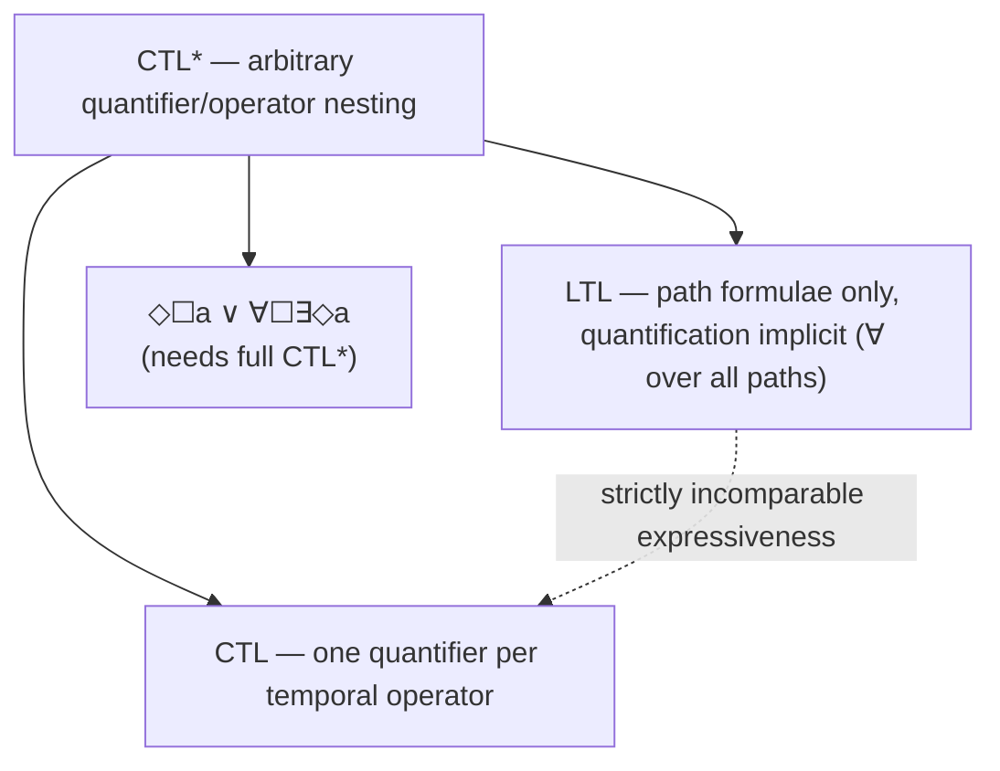

[[book-guidelines|↩ Back to guidelines]]

# CTL*

## Why two logics that both "work" still leave a gap

By the end of Section 6.3 the book has proved something uncomfortable: CTL and LTL are **incomparable**. Neither is a special case of the other. $\forall\Box\forall\Diamond a$ ("on every path, $a$ holds infinitely often") is expressible in CTL but has no LTL equivalent — its "reset" structure (start a new all-paths quantification at every point along the outer path) can't be phrased as a property of a single infinite trace, which is all LTL semantics ever talks about. Conversely $\Diamond\Box a$ ("eventually $a$ holds forever") is trivial in LTL but has no CTL equivalent — as soon as you try to write it with path quantifiers, $\forall\Diamond\forall\Box a$ says something different (every path eventually gets stuck seeing only $a$-states from then on) and $\forall\Diamond\exists\Box a$ says something different again (a *possible* continuation, not the actual one, eventually sees only $a$'s). There is a real semantic gap, not just a notational one: LTL formulae describe constraints on *individual infinite words*, while CTL formulae describe constraints on the *branching structure* of the computation tree, and the two purposes don't factor through each other.

This matters practically. If you're specifying "it is always possible to reset the system to a safe state" ($\forall\Box\exists\Diamond\,\mathit{reset}$), you need branching-time quantification — CTL can say it, LTL genuinely cannot, because LTL never lets you say "there exists a continuation." If you're specifying "the request signal, once true, stays true until granted" as a property of *the* execution, plain LTL until captures it directly, while forcing it through CTL's rigid "one path quantifier per temporal operator" [[Timed-CTL-and-TCTL-Model-Checking#Syntax|syntax]] is awkward or impossible for richer combinations (e.g. $\Diamond\Box a$).

**What breaks without a unifying logic:** you're stuck choosing your temporal logic based on which properties you expect to state, before you've necessarily figured that out, and you lose access to formulae that combine both flavors, like "some path eventually reaches a state from which every continuation possibly reaches $b$" — a genuinely useful shape that neither pure logic can express. CTL$^*$, due to Emerson and Halpern, is the book's answer: relax CTL's syntactic straitjacket so that path quantifiers ($\exists, \forall$) and linear temporal operators ($\bigcirc$, $U$) can nest **arbitrarily**, instead of insisting each temporal operator be immediately preceded by a quantifier. The result strictly subsumes both LTL and CTL.

## The syntactic move: decoupling quantifiers from operators

Recall CTL's grammar (Definition 6.1, from the "[[Computation-Tree-Logic|Computation Tree Logic]]" article): state formulae $\Phi ::= \mathrm{true} \mid a \mid \Phi_1\land\Phi_2\mid\neg\Phi\mid\exists\varphi\mid\forall\varphi$, and *path* formulae restricted to $\varphi ::= \bigcirc\Phi \mid \Phi_1\, U\, \Phi_2$ — note that the arguments of $\bigcirc$ and $U$ here are *state* formulae, so a temporal operator can never be nested directly inside another temporal operator without an intervening quantifier. That's precisely the restriction CTL$^*$ lifts.

**Definition 6.80 (Syntax of CTL$^*$).** State formulae:

$$\Phi ::= \mathrm{true} \mid a \mid \Phi_1 \land \Phi_2 \mid \neg\Phi \mid \exists\varphi$$

Path formulae:

$$\varphi ::= \Phi \mid \varphi_1 \land \varphi_2 \mid \neg\varphi \mid \bigcirc\varphi \mid \varphi_1\, U\, \varphi_2$$

Read this pair of grammars carefully — the elegance is in what each production is allowed to reference. A CTL$^*$ *path formula* is essentially an **LTL formula whose atomic propositions are allowed to be arbitrary CTL$^*$ state formulae**, not just members of $AP$. And a *state formula* still bottoms out at $\exists\varphi$ — existential path quantification over a path formula — but that $\varphi$ can now be any LTL-shaped nesting of $\bigcirc$/$U$/Boolean connectives, itself possibly containing further $\exists$/$\forall$ quantifiers buried inside as atoms. Universal path quantification is *derived*, not primitive:

$$\forall\varphi \;\stackrel{\text{def}}{=}\; \neg\exists\neg\varphi$$

— and the book flags explicitly that this dual-definition trick, routine in LTL and propositional logic, is *not available in CTL*, because CTL's syntax doesn't allow $\neg\varphi$ as a path formula in the first place (Boolean connectives on path formulae are exactly what's missing there). This single grammar change is what buys back all the expressiveness CTL was missing: $\forall\bigcirc a$ is legal CTL* (and CTL, coincidentally), but $\exists\Diamond a \land \forall\Diamond a$ or $\forall(\Diamond\Box a)$ are legal CTL$^*$ formulae with no CTL counterpart, because they nest a linear operator ($\Box$) directly under another linear operator ($\Diamond$) with only one quantifier out front.

**What breaks without decoupling:** if quantifiers stayed glued to operators, you could never express "for all paths, eventually forever $a$" ($\forall\Diamond\Box a$) as a single formula, because after $\forall\Diamond$ you'd be forced to quantify again before writing $\Box$ — but you don't want a fresh path choice there, you want to keep talking about the *same* path you already committed to with $\forall$. CTL$^*$'s path formulae let a whole LTL-style temporal chain live under one quantifier.

### A worked example from the book

$$\forall\big(\bigcirc\Diamond a \land \neg(b\, U\, c)\big) \qquad\text{and}\qquad \forall\big(\Box\neg a \land \exists\Diamond\bigcirc(a \lor \forall(b\, U\, a))\big)$$

Neither is a CTL formula. The first nests $\Diamond$ inside $\bigcirc$ under a single $\forall$ (no intervening quantifier, illegal in CTL); the second nests an $\exists$-quantified path formula as an *atom* inside a larger path formula under an outer $\forall$ — arbitrary nesting of quantified subformulae as Boolean/temporal ingredients, exactly the freedom CTL denies.

```rust
// A CTL* state formula, as an AST, makes the grammar concrete: state
// formulae and path formulae are mutually recursive, and a path formula's
// "atom" case is a full state formula (which may itself contain quantifiers).
enum StateFormula {
    True,
    Atom(String),                                   // a ∈ AP
    And(Box<StateFormula>, Box<StateFormula>),
    Not(Box<StateFormula>),
    Exists(Box<PathFormula>),                        // ∃φ
}

enum PathFormula {
    State(Box<StateFormula>),                        // Φ, lifted as an atom
    And(Box<PathFormula>, Box<PathFormula>),
    Not(Box<PathFormula>),
    Next(Box<PathFormula>),                          // ⃝φ
    Until(Box<PathFormula>, Box<PathFormula>),        // φ1 U φ2
}
```

Compare this to a CTL AST, where `PathFormula` could only ever be `Next(StateFormula)` or `Until(StateFormula, StateFormula)` — no `PathFormula` field ever contains another `PathFormula`. The CTL$^*$ AST removes exactly that restriction: `PathFormula` becomes closed under its own constructors, mirroring LTL's AST, with `StateFormula::Exists` as the sole doorway back down into path formulae. This is the same "grammar closure" move that separates, say, a context-free expression grammar from one that only allows a single level of parenthesization — expressive power comes from letting a nonterminal recurse into itself rather than only bottoming out immediately.

In Lean, the mutual recursion is even more natural to state directly, since Lean's inductive families support mutual definitions without the boxing ceremony Rust needs:

```lean
mutual
  inductive StateFormula (AP : Type) where
    | tt        : StateFormula AP
    | atom      : AP → StateFormula AP
    | and       : StateFormula AP → StateFormula AP → StateFormula AP
    | not       : StateFormula AP → StateFormula AP
    | exists_   : PathFormula AP → StateFormula AP

  inductive PathFormula (AP : Type) where
    | state     : StateFormula AP → PathFormula AP
    | and       : PathFormula AP → PathFormula AP → PathFormula AP
    | not       : PathFormula AP → PathFormula AP
    | next      : PathFormula AP → PathFormula AP
    | until     : PathFormula AP → PathFormula AP → PathFormula AP
end
```

## Semantics: one satisfaction relation, two sorts

**Definition 6.81.** For a transition system $TS = (S, Act, \rightarrow, I, AP, L)$ *without terminal states* (the same well-definedness requirement CTL needed, so that $\mathit{Paths}(s)$ is always nonempty), state formulae are interpreted at states and path formulae at paths:

$$
\begin{aligned}
s \models a &\iff a \in L(s) \\
s \models \neg\Phi &\iff \text{not } s\models\Phi \\
s \models \Phi\land\Psi &\iff s\models\Phi \text{ and } s\models\Psi \\
s \models \exists\varphi &\iff \pi\models\varphi \text{ for some } \pi\in\mathit{Paths}(s)
\end{aligned}
\qquad
\begin{aligned}
\pi \models \Phi &\iff s_0\models\Phi \\
\pi \models \varphi_1\land\varphi_2 &\iff \pi\models\varphi_1 \text{ and } \pi\models\varphi_2 \\
\pi \models \neg\varphi &\iff \text{not } \pi\models\varphi \\
\pi \models \bigcirc\varphi &\iff \pi[1..]\models\varphi \\
\pi \models \varphi_1\,U\,\varphi_2 &\iff \exists j\ge 0.\ \pi[j..]\models\varphi_2 \land \forall\, 0\le k<j.\ \pi[k..]\models\varphi_1
\end{aligned}
$$

where $\pi = s_0 s_1 s_2 \cdots$ and $\pi[i..]$ is the suffix starting at index $i$. The interesting clause is $\pi\models\Phi$ for a *state* formula $\Phi$ appearing as a path formula — it just means "the current state of this path (its head, $s_0$) satisfies $\Phi$." That single clause is the join point of the two mutually recursive relations: it's what lets a path formula "drop back down" into state-formula semantics whenever it hits a bare $\Phi$ atom, exactly mirroring how the AST's `PathFormula::State` constructor works above. Satisfaction over the whole transition system is unsurprising: $TS \models \Phi$ iff $\forall s_0\in I.\ s_0\models\Phi$ (Definition 6.82).

**In Rust terms**, this is a two-mutually-recursive-function evaluator — the same shape as a type-checker with separate `infer` and `check` judgments calling into each other:

```rust
fn sat_state(ts: &TransitionSystem, phi: &StateFormula, s: State) -> bool {
    match phi {
        StateFormula::True => true,
        StateFormula::Atom(a) => ts.label(s).contains(a),
        StateFormula::And(p, q) => sat_state(ts, p, s) && sat_state(ts, q, s),
        StateFormula::Not(p) => !sat_state(ts, p, s),
        StateFormula::Exists(path_phi) =>
            ts.paths_from(s).any(|pi| sat_path(ts, path_phi, &pi)),
    }
}

fn sat_path(ts: &TransitionSystem, phi: &PathFormula, pi: &Path) -> bool {
    match phi {
        PathFormula::State(state_phi) => sat_state(ts, state_phi, pi.head()),
        PathFormula::And(p, q) => sat_path(ts, p, pi) && sat_path(ts, q, pi),
        PathFormula::Not(p) => !sat_path(ts, p, pi),
        PathFormula::Next(p) => sat_path(ts, p, &pi.suffix(1)),
        PathFormula::Until(p, q) => (0..)
            .take_while(|_| true) // conceptually: search j with early exit on infinite paths
            .find(|&j| sat_path(ts, q, &pi.suffix(j))
                && (0..j).all(|k| sat_path(ts, p, &pi.suffix(k))))
            .is_some(),
    }
}
```

(In practice `paths_from` is not literally enumerable — infinitely many, possibly infinite-length paths — which is exactly why Section 6.8.2's model-checking algorithm never evaluates this definition directly on real inputs; more on that below.)

## Embedding LTL and CTL: two different inclusions, for two different reasons

This is the section's real payoff — the "unifying" in "unifying linear and branching time" is made completely precise, and it's worth separating *how* each sublogic sits inside CTL$^*$, because the two embeddings work for structurally different reasons.

### LTL embeds via the state-formula boundary

An LTL formula, recall, only ever uses atomic propositions as its base case — never arbitrary state conditions. CTL$^*$ path formulae are *literally* LTL formulae generalized to allow arbitrary state-formula atoms; restrict that generalization back down to bare propositions and you recover LTL's path formulae exactly. The embedding is: identify LTL formula $\varphi$ with the CTL$^*$ *state* formula $\forall\varphi$.

**Theorem 6.83 (Embedding of LTL in CTL$^*$).** For $TS$ without terminal states, LTL formula $\varphi$ over $AP$, and $s \in S$:

$$\underbrace{s \models \varphi}_{\text{LTL semantics}} \iff \underbrace{s \models \forall\varphi}_{\text{CTL}^* \text{ semantics}}$$

and correspondingly $TS\models\varphi$ (LTL) iff $TS \models \forall\varphi$ (CTL$^*$). This theorem is doing something more substantial than notation-matching — it's asserting that LTL's semantics (a formula holds at a state iff it holds along *every* path from that state — recall LTL's own state-level satisfaction from Chapter 5) is *definitionally the same relation* as CTL$^*$'s $\forall$-quantified path semantics, once you plug an LTL formula in as the path formula under $\forall$. There's no translation step, no encoding overhead — LTL's universal-path reading was already baked into its own semantics; CTL$^*$ just makes the quantifier visible as syntax instead of leaving it implicit in the definition of $\models$.

### CTL embeds via the "quantifier-glued" restriction

CTL's syntax — every temporal operator immediately preceded by a quantifier — is visibly a special case of CTL$^*$'s grammar: it's what you get if you only ever apply $\exists$ or $\forall$ to a path formula of the shape $\bigcirc\Phi$ or $\Phi_1\,U\,\Phi_2$ (state formulae as the *immediate* argument), never letting the temporal chain run deeper before quantifying. So the CTL embedding isn't a theorem needing proof the way LTL's is — it's a syntactic subset relationship, visible directly from the two grammars. What *is* worth stating as a genuine result is that CTL$^*$ strictly exceeds the union of the two:

**Theorem 6.84 (CTL$^*$ is strictly more expressive than LTL and CTL).** For $AP=\{a,b\}$, the CTL$^*$ formula

$$\Phi = (\forall\Diamond\Box a) \lor (\forall\Box\exists\Diamond b)$$

has no equivalent LTL or CTL formula. *Proof sketch*: $\forall\Box\exists\Diamond b$ is a bona fide CTL formula (existential path quantification nested one level inside a universal one) that Theorem 6.21 already showed has no LTL equivalent; $\Diamond\Box a$ is a bona fide LTL formula with no CTL equivalent (also Theorem 6.21). A disjunction combining one ingredient from each "unexpressible" family can't collapse into either logic alone — and since CTL$^*$ can express arbitrary Boolean combinations of both, it must strictly dominate both.



This is exactly Figure 6.27 in the book, redrawn: CTL$^*$ sits at the top, LTL and CTL are two genuinely different (incomparable) sublogics beneath it, and the formula $\Diamond\Box a \lor \forall\Box\exists\Diamond a$ lives strictly above both, witnessing that the union of LTL and CTL is not all of CTL$^*$ — you need the *nesting* CTL$^*$'s grammar allows, not just access to both vocabularies separately.

### A consequence: fairness becomes syntactic again

Because CTL$^*$ allows Boolean connectives at the path-formula level (which CTL specifically disallows — recall Section 6.5's workaround, redefining $\models$ itself to quantify only over *fair* paths, precisely because CTL syntax can't express an implication premise on a path formula), [[Fairness|fairness]] assumptions can now be written directly as formulae, exactly as in LTL:

$$\forall(\mathit{fair} \to \varphi) \qquad\text{or}\qquad \exists(\mathit{fair} \land \varphi)$$

**What breaks without this:** in CTL, you were forced to bake fairness into the *semantics* — a special $\models_{\mathcal{F}}$ relation, a whole extra parameter threaded through every definition and every algorithm (Section 6.5). In CTL$^*$ that machinery is unnecessary scaffolding; fairness is just another formula, checked by the same $\models$ you already have. This is a good illustration of a recurring theme: a syntactic restriction that looks harmless (temporal operators need a quantifier prefix) can force complexity into the *semantics* to compensate, and lifting the restriction can retire that compensating machinery entirely.

### Equivalence laws specific to CTL$^*$

Beyond CTL's own equivalence laws and everything inherited from LTL, CTL$^*$ has laws about how quantifiers and Boolean/temporal structure interact (Figure 6.28):

- **Duality:** $\neg\forall\varphi \equiv \exists\neg\varphi$, $\neg\exists\varphi \equiv \forall\neg\varphi$ — direct consequence of $\forall$'s definition as $\neg\exists\neg$.
- **Distributivity — but only one way each:** $\forall(\varphi_1\land\varphi_2) \equiv \forall\varphi_1 \land \forall\varphi_2$ and $\exists(\varphi_1\lor\varphi_2)\equiv\exists\varphi_1\lor\exists\varphi_2$ hold, but (as in CTL) $\forall$ does **not** distribute over $\lor$ and $\exists$ does **not** distribute over $\land$: $\forall(\varphi\lor\psi) \not\equiv \forall\varphi\lor\forall\psi$. The asymmetry is the same one you'd expect from "for all $x$, $P(x)$ or $Q(x)$" not implying "for all $x$, $P(x)$, or for all $x$, $Q(x)$" — different paths can satisfy the disjunction via different disjuncts.
- **Quantifier absorption:** $\forall\Diamond\varphi \equiv \forall\Diamond\forall\varphi$ and $\exists\Diamond\varphi \equiv \exists\Diamond\exists\varphi$ — once you've committed to "the" path via the outer quantifier, re-quantifying over the *same* path with the same flavor is a no-op.
- **Trivial state-formula quantification:** for a CTL$^*$ *state* formula $\Phi$ (one with no bare temporal operator at the top), $\exists\Phi \equiv \Phi$ and $\forall\Phi \equiv \Phi$. The book's example: $\exists\forall\Diamond a$ holds at $s$ iff *some* path $\pi$ from $s$ satisfies $\forall\Diamond a$ — but $\pi\models\forall\Diamond a$ reduces immediately (by the $\pi\models\Phi \iff s_0\models\Phi$ clause) to $s\models\forall\Diamond a$, which doesn't depend on *which* path $\pi$ you picked at all. So the outer $\exists$ was vacuous — quantifying over a choice that doesn't affect the outcome.

**What breaks without recognizing this law:** naively, you might think adding a redundant quantifier is harmless "noise" that a smart implementation should strip early — and this law tells you exactly which quantifiers are safe to erase (those directly wrapping a formula that's already state-level) versus which aren't (anything wrapping a genuine path formula, where the choice of path matters).

### CTL$^+$: a fragment that hints CTL* isn't "just Boolean closure"

Remark 6.85 introduces **CTL$^+$**: extend CTL by allowing Boolean connectives ($\land$, $\neg$) in path formulae, but *keep* the restriction that $U$'s and $\bigcirc$'s arguments are state formulae (no further temporal nesting). Surprisingly, CTL$^+$ is **exactly as expressive as CTL** — every CTL$^+$ formula has an equivalent CTL formula (via equivalence laws distributing the quantifier over the Boolean structure, e.g. $\exists(\Diamond a \land \Diamond b) \equiv \exists\Diamond(a\land\exists\Diamond b)\land\exists\Diamond(b\land\exists\Diamond a)$), though sometimes at exponential blowup in formula size. This is worth flagging precisely because it isolates *which* generalization actually buys expressive power: it's not "letting path formulae have Boolean structure" (CTL$^+$ has that, and gains nothing semantically) — it's "letting temporal operators nest inside each other without an intervening quantifier," the one feature CTL$^+$ still lacks and full CTL$^*$ has. That's a sharp, checkable answer to "what specifically makes CTL$^*$ more expressive," useful to remember if you're ever designing a fragment of a specification logic and need to know which syntactic freedoms are load-bearing.

## CTL$^*$ model checking: recursive descent meets automata

### The idea: reduce to what you already have

Section 6.8.2 doesn't invent a new model-checking algorithm from scratch — it observes that CTL$^*$'s bottom-up structure (a formula tree mixing state and path formulae) can be handled by **combining the two algorithms the book already built**: CTL's recursive descent over the parse tree (Section 6.4), and LTL's automata-based checker (Section 5.2), applied at the seams where they meet.

**Definition 6.86 (maximal proper state subformula).** A state subformula $\Psi$ of $\Phi$ is *maximal proper* if it's a strict subformula of $\Phi$ not contained inside any other proper state subformula of $\Phi$. Concretely: walk down $\Phi$'s parse tree from the root; the maximal proper state subformulae are the state-formula nodes you hit *first* on each branch (you don't recurse further inside them for this purpose, even though they may themselves contain deeper state formulae).

**[[Probabilistic-Computation-Tree-Logic#The algorithm|The algorithm]]'s core move:** replace every maximal proper state subformula $\Psi_i$ of $\Phi$ by a fresh atomic proposition $a_i$, chosen so that $a_i \in L(s) \iff s \in \mathit{Sat}(\Psi_i)$ — you compute $\mathit{Sat}(\Psi_i)$ *first* (recursively, by the same algorithm, since $\Psi_i$ is smaller), then bake the answer into the labeling as if it had always been an atomic fact about the state. After this substitution, what remains inside a top-level $\exists\varphi$ or $\forall\varphi$ is a genuine **LTL formula** — no more state-formula atoms, just $a_i$'s, Booleans, $\bigcirc$, and $U$. This is the crucial observation: CTL$^*$'s two-sorted grammar was engineered so that *stripping out the state-formula layer always leaves an LTL formula behind* — the mutual recursion bottoms out cleanly.

Now reuse Theorem 6.83's embedding in reverse: for $\Psi = \exists\varphi$ (with $\varphi$ now pure LTL after substitution),

$$s\models\exists\varphi \iff s\models\neg\forall\neg\varphi \iff s \not\models_{\mathrm{LTL}} \neg\varphi$$

so

$$\mathit{Sat}_{\mathrm{CTL}^*}(\exists\varphi) = S \setminus \mathit{Sat}_{\mathrm{LTL}}(\neg\varphi)$$

— computed by running the Chapter 5 LTL model checker on $\neg\varphi$ and complementing the result. Symmetrically, for the outermost-universal case, $\mathit{Sat}_{\mathrm{CTL}^*}(\forall\varphi) = \mathit{Sat}_{\mathrm{LTL}}(\varphi)$ directly (no complementation needed, since $\forall$ already matches LTL's own "holds on every path" reading).

**Algorithm 27 (CTL$^*$ model checking, basic idea):**

```
for all i ≤ |Φ| do
  for all Ψ ∈ Sub(Φ) with |Ψ| = i do
    switch(Ψ):
      true      : Sat(Ψ) := S
      a         : Sat(Ψ) := { s ∈ S | a ∈ L(s) }
      Ψ1 ∧ Ψ2   : Sat(Ψ) := Sat(Ψ1) ∩ Sat(Ψ2)
      ¬Ψ1       : Sat(Ψ) := S \ Sat(Ψ1)
      ∃φ        : determine Sat_LTL(¬φ) via an LTL model checker
                  Sat(Ψ) := S \ Sat_LTL(¬φ)
    introduce fresh atomic proposition a_Ψ
    replace Ψ by a_Ψ everywhere it occurs
    for all s ∈ Sat(Ψ): L(s) := L(s) ∪ {a_Ψ}
return I ⊆ Sat(Φ)
```

This is structurally identical to the CTL algorithm's parse-tree walk — the only new case is $\exists\varphi$, which delegates to an LTL model-checking subroutine instead of a direct fixed-point computation. Everything else (Boolean connectives, complementation, the fresh-atom bookkeeping) is exactly CTL's existing machinery.

### Worked example, traced through

The book's Example 6.87: check $\exists\varphi$ where

$$\varphi = \bigcirc(\forall\bigcirc\exists\Diamond a) \land \Diamond\bigcirc\exists(a \land \bigcirc b).$$

Find the maximal proper state subformulae: $\Phi_1 = \forall\bigcirc\exists\Diamond a$ and $\Phi_2 = \exists(a\land\bigcirc b)$ — these are exactly the state-formula nodes hanging directly off $\varphi$'s temporal skeleton. Compute $\mathit{Sat}(\Phi_1)$ and $\mathit{Sat}(\Phi_2)$ recursively (each is itself small enough to hand to the same algorithm, or, being simple enough, directly by CTL's Section 6.4 recursion since neither nests further). Substitute fresh atoms $a_1, a_2$ for $\Phi_1, \Phi_2$ respectively:

$$\varphi = \bigcirc a_1 \land \Diamond\bigcirc a_2$$

— now a pure LTL formula over $\{a_1, a_2\}$. Hand $\neg\varphi$ to the Chapter 5 LTL model checker, get $\mathit{Sat}_{\mathrm{LTL}}(\neg\varphi)$, complement it, and that's $\mathit{Sat}_{\mathrm{CTL}^*}(\exists\varphi)$.

```python
# Illustrative sketch, not load-bearing: the "peel off maximal state
# subformulae, replace with fresh atoms, recurse" shape of Algorithm 27.
def sat_ctl_star(ts, phi, cache):
    if phi in cache:
        return cache[phi]
    if is_boolean_or_atom(phi):
        result = sat_boolean_case(ts, phi, sat_ctl_star, cache)
    else:  # phi = Exists(path_formula) or Forall(path_formula)
        ltl_formula, fresh_labeling = replace_maximal_state_subformulas(
            ts, phi.path_formula, sat_ctl_star, cache)
        ts_relabeled = ts.with_extra_labels(fresh_labeling)
        if isinstance(phi, Exists):
            bad = ltl_model_check(ts_relabeled, Not(ltl_formula))
            result = ts.states - bad
        else:  # Forall
            result = ltl_model_check(ts_relabeled, ltl_formula)
    cache[phi] = result
    return result
```

### Complexity: CTL$^*$ inherits LTL's exponential, not CTL's polynomial

**Theorem 6.88.** For $TS$ with $N$ states and $K$ transitions, and CTL$^*$ formula $\Phi$: CTL$^*$ model checking runs in $O((N+K)\cdot 2^{|\Phi|})$. The additional bookkeeping beyond the LTL calls (Boolean combination, fresh-atom substitution) is polynomial; the dominant cost is entirely the LTL model-checking phases, each of which is exponential in the size of the (sub)formula being checked. **Theorem 6.89**: CTL$^*$ model checking is **PSPACE-complete** — membership follows from the reduction to LTL model checking (PSPACE-complete, Chapter 5), and hardness is inherited since LTL (and CTL, trivially) are themselves sublogics of CTL$^*$.

This produces the striking summary table (Figure 6.29 in the book):

| | CTL | LTL | CTL$^*$ |
|---|---|---|---|
| model checking | PTIME | PSPACE-complete | PSPACE-complete |
| without fairness | $\mathrm{size}(TS)\cdot|\Phi|$ | $\mathrm{size}(TS)\cdot\exp(|\Phi|)$ | $\mathrm{size}(TS)\cdot\exp(|\Phi|)$ |
| with fairness | $\times|\mathit{fair}|$ | $\times|\mathit{fair}|$ | $\times|\mathit{fair}|$ |
| satisfiability | EXPTIME | PSPACE-complete | 2EXPTIME |

Read the top row against the chapter's opening summary table (Section 6.1): CTL's polynomial-time algorithm was never really "beating" some inherent hardness of branching-time reasoning — it was exploiting the *syntactic restriction* that every temporal operator sits directly under a quantifier, which lets the parse-tree recursion stay purely local (bottom-up, one $\mathit{Sat}$ computation per subformula, no automaton needed). The instant you allow arbitrary nesting — CTL$^*$'s whole point — you reintroduce the automaton-construction cost that made LTL PSPACE-complete in the first place, because now a single path formula can encode an unboundedly deep temporal pattern that a purely local recursion can't track without exponential state. CTL's PTIME result is thus revealed as a genuine trade-off *for* expressiveness, not a free lunch that CTL$^*$ carelessly gave up.

**What breaks without recognizing this trade-off:** if you're choosing a specification logic for a large model, "CTL is polynomial, so let's just use CTL$^*$ everywhere and get the best of both worlds" is the wrong takeaway — CTL$^*$'s uniform PSPACE-completeness means every formula, including ones that could have been phrased in plain CTL, now potentially pays the LTL-style exponential-in-formula-size cost, unless your model checker is smart enough to detect and specialize on the "already-CTL" fragment (which Algorithm 27's structure, notably, does implicitly — a maximal proper state subformula whose path formula is already of the shape $\bigcirc\Phi$ or $\Phi_1\,U\,\Phi_2$ reduces to exactly the CTL algorithm's fixed-point cases, no LTL automaton required).

## Where this leads

CTL$^*$ closes out Chapter 6 as the logic that makes the LTL-vs-CTL story precise rather than merely comparative: instead of two incomparable islands, there is one strictly larger logic containing both, with a semantics ($\models$) that specializes exactly to each sublogic's own semantics on its own syntactic fragment (Theorem 6.83, and CTL's syntactic-subset relationship). This closure matters directly for what comes next in the book:

- **Chapter 7 ([[Bisimulation-Equivalence|Bisimulation Equivalence]])** proves its central theorem — that bisimulation equivalence coincides *exactly* with logical equivalence — at the level of **CTL$^*$**, not just CTL: $\sim_{TS} = {\equiv_{CTL}} = {\equiv_{CTL^*}}$ for finite transition systems without terminal states. CTL$^*$ is the logic strong enough to make this triple equality nontrivial — it's not obviously true that adding all of CTL$^*$'s extra expressiveness wouldn't let bisimilar-but-not-identical states be told apart, and the fact that it doesn't is precisely why bisimulation is *the* coarsest equivalence preserving branching-time properties as a whole, not just CTL's fragment of them.
- The **universal fragment $\forall CTL^*$** (Chapter 7, Section 7.5) — CTL$^*$ formulae restricted to universal path quantification in positive normal form — characterizes exactly what the (weaker, non-symmetric) **simulation preorder** preserves, generalizing the safety/trace-inclusion story from Chapter 3 to branching structure.
- **Chapter 8 ([[Partial-Order-Reduction|Partial Order Reduction]])** explicitly revisits the ample-set conditions in "branching-time" form precisely because the linear-time conditions (sound for $LTL_{\setminus\bigcirc}$) are shown to be insufficient for $CTL_{\setminus\bigcirc}$ *and* $CTL^*_{\setminus\bigcirc}$ — CTL$^*$ is the yardstick against which the strengthened reduction is proven sound.

### Connection to the standing project (`static-analysis`)

CTL$^*$'s embedding pattern — factor a two-sorted grammar so that eliminating one sort (state formulae, via substitution of fresh atoms for their computed satisfaction sets) always leaves a formula in a *smaller*, already-solved sublanguage (LTL) — is a general verification-engineering move, not specific to temporal logic. It's the same shape you'll want for a refinement-type or Hoare-logic verification condition generator that mixes quantifier-free arithmetic constraints with quantified invariants: solve the innermost, "already in a decidable fragment" pieces first, substitute the results back in as ground facts, and only then hand the outer shell to whichever solver (SMT, CHC engine, or here, an LTL model checker) actually understands that shell's structure. The PSPACE-completeness result is also a useful calibration point for the CSP/abstract-interpretation kernel described in the project's standing goals: it's a concrete instance of "richer specification language, uniformly higher worst-case cost," which is exactly the trade-off that motivates keeping a fast decidable fragment (CTL-shaped local reasoning) available as a fallback before escalating to the fully general (CTL$^*$/LTL-shaped, automaton-based) checker — directly analogous to preferring cheap domain propagation before falling back to full constraint search in the CSP kernel.
