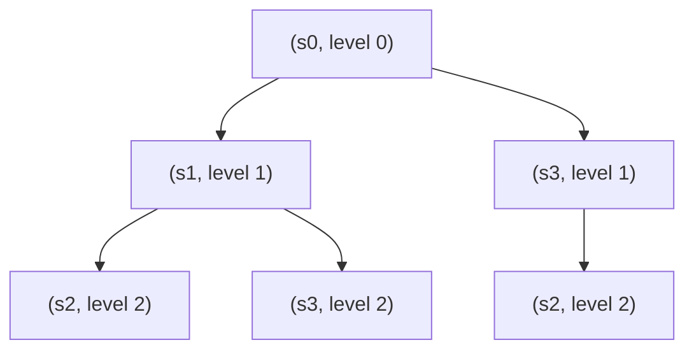

[[book-guidelines|↩ Back to guidelines]]

# Computation Tree Logic

## Why LTL isn't enough: the shape of "possibility"

Every temporal logic is a commitment to a notion of "the future." LTL (Chapter 5) commits to a very specific one: a formula $\varphi$ is checked against *paths*, and $\mathrm{TS} \models \varphi$ means *every* path starting at every initial state satisfies $\varphi$. That universal quantification over paths is baked into the semantics, not into the [[Timed-CTL-and-TCTL-Model-Checking#Syntax|syntax]] — you never write "for all paths" in an LTL formula, it's just how $\models$ is defined.

This is fine as long as everything you want to say is universal. But some properties are inherently *existential* — they talk about the mere possibility of something, not a guarantee. Baier and Katoen open Chapter 6 with the property "for every computation, it is always possible to return to the initial state." Try to write this in LTL. A first attempt,

$$\forall\, \Box \Diamond \, \mathit{start}$$

(reading $\forall$ as the ambient "for all paths" LTL already implies) says every path returns to $\mathit{start}$ infinitely often — that's a *guarantee* of return, much stronger than "it remains *possible* to return." No LTL formula captures the weaker property, because LTL has no syntactic device for saying "there exists a path such that..." *nested inside* a "for all states reachable this way" context. The universal quantifier over paths is fixed once, globally, at the top of the semantics; you cannot flip to existential quantification partway through a formula and then flip back.

**What breaks without branching time:** any specification of the shape "no matter what has happened so far, some good outcome remains reachable" — resettability, recoverability, "you can always still abort the transaction," "the vending machine can always be reset by the technician." These are common real specifications, and LTL is structurally incapable of expressing them. This is the concrete failure mode CTL is built to fix.

## The fix: quantify over paths *inside* the formula

Clarke and Emerson's idea (early 1980s, independently also Queille and Sifakis) is to stop fixing the path quantification globally and instead make it a first-class piece of syntax that can be nested. Concretely: take the tree obtained by unfolding a transition system's states into every possible infinite computation starting from a given state — the **computation tree** — and let a formula quantify, at any point, over the paths through *that* subtree.



*(schematic — an unfolding like Fig. 6.1 in the book: a transition system with branching becomes an infinite tree rooted at the state of interest; every root-to-infinity traversal of the tree is one path)*

Two path quantifiers do the job:

- $\exists\varphi$ — "there exists a path (starting here) satisfying $\varphi$" — *possibility*.
- $\forall\varphi$ — "every path (starting here) satisfies $\varphi$" — *necessity/guarantee*.

Now the earlier property is expressible directly: "for every computation it is always possible to return to start" becomes

$$\forall\, \Box\, \exists\, \Diamond\, \mathit{start}$$

Read outside-in: for all paths ($\forall$), at every position on the path ($\Box$), there exists a path from there ($\exists$) that eventually ($\Diamond$) reaches $\mathit{start}$. This alternation of $\forall$ and $\exists$ *inside* the same formula is precisely what LTL cannot do, and it is the entire reason branching-time logic exists as a separate object of study.

**Rust framing.** If you've ever modeled a state machine with an explicit "resettable" trait bound versus a "will eventually reset" liveness guarantee, you've felt this distinction already: `can_reach(state, Reset)` (existential, a search) is a fundamentally different claim from `always_eventually_resets(state)` (universal, a guarantee over every possible execution trace, including adversarial schedulers). CTL is what lets you write both, and nest one inside the other, in one formula.

## CTL state formulae and path formulae: a deliberately two-tiered syntax

Here is the first place where CTL's design choice bites, and it's worth understanding *why* the book insists on it rather than treating it as arbitrary red tape. CTL splits its formulae into two syntactic categories that cannot be freely mixed:

> **Definition 6.1 (Syntax of CTL).**
> State formulae:
> $$\Phi ::= \mathit{true} \mid a \mid \Phi_1 \land \Phi_2 \mid \neg\Phi \mid \exists\varphi \mid \forall\varphi$$
> Path formulae:
> $$\varphi ::= \bigcirc \Phi \mid \Phi_1\, U\, \Phi_2$$
> where $a \in \mathrm{AP}$, and $\Phi, \Phi_1, \Phi_2$ range over state formulae.

Notice the constraint hiding in the grammar: a path formula $\varphi$ is only ever built from $\bigcirc$ or $U$ applied to *state* formulae — you can never write $\bigcirc\bigcirc\Phi$ or $\varphi_1 \land \varphi_2$ at the path level, because Boolean connectives simply aren't in the path-formula grammar. And a temporal operator ($\bigcirc$ or $U$) is only ever legal immediately underneath a path quantifier ($\exists$ or $\forall$) — you cannot have a bare, unquantified $\bigcirc\Phi$ floating as a state formula.

This is the crucial contrast with LTL, where $\bigcirc$ and $U$ nest freely and Boolean connectives glue path formulae together arbitrarily (`○(a ∧ ○b) U c` is perfectly legal LTL). In CTL, every occurrence of a temporal operator is pinned to a path quantifier one level up — no nesting of bare modalities, no Boolean combination of path formulae.

The book's own worked example (Example 6.2) makes the boundary concrete. With $\mathrm{AP} = \{x{=}1,\ x{<}2,\ x{\ge}3\}$:

- **Legal:** $\exists\bigcirc(x{=}1)$, $\forall\bigcirc(x{=}1)$, $\exists((x{<}2)\, U\, (x{\ge}3))$, $\forall(\mathit{true}\, U\, (x{<}2))$.
- **Illegal:** $\exists\bigcirc(x{=}1 \land \forall\bigcirc(x{\ge}3))$ — the operand of the outer $\bigcirc$, namely $x{=}1 \land \forall\bigcirc(x{\ge}3)$, actually *is* a legal state formula, so this one is fine on reflection... but $\exists(\mathit{true}\, U\, (x{=}1))$ preceded by an extra $\bigcirc$, i.e. $\exists\bigcirc(\mathit{true}\, U\, (x{=}1))$, is illegal, because $\mathit{true}\, U\, (x{=}1)$ is a *path* formula and $\bigcirc$ expects a *state* formula as its argument. The fix is $\exists\bigcirc\forall(\mathit{true}\, U\, (x{=}1))$ — insert a path quantifier to convert the path formula back into a state formula first.

Every temporal operator, in other words, must be immediately wrapped by exactly one path quantifier, and the moment you build something bigger you re-enter state-formula land and can start over. This is what "two-stage grammar" means, and it's not decoration — it's what makes the CTL model-checking algorithm (Chapter's next section, and the next topic in this book) a clean bottom-up recursion over a parse tree with no cross-cutting path-level reasoning required.

**Rust analogy.** This two-level grammar is exactly the shape of a typestate-encoded API: you have a `StateFormula` type and a `PathFormula` type, and the constructors of `PathFormula` (`Next`, `Until`) only ever take `StateFormula` arguments, while `StateFormula`'s temporal constructors (`Exists`, `Forall`) only ever take `PathFormula` arguments:

```rust
enum StateFormula {
    True,
    Atom(String),
    And(Box<StateFormula>, Box<StateFormula>),
    Not(Box<StateFormula>),
    Exists(Box<PathFormula>),
    Forall(Box<PathFormula>),
}

enum PathFormula {
    Next(Box<StateFormula>),
    Until(Box<StateFormula>, Box<StateFormula>),
}
```

There is no `PathFormula::And` variant and no `StateFormula::Next` variant — the type system enforces CTL's syntactic restriction for free. This is worth dwelling on: the restriction that looks arbitrary in prose ("temporal operators must be immediately preceded by a path quantifier") becomes the *obvious* design once you separate the two grammars into two Rust types with no shared constructors.

## Existential and universal path quantification: the two lenses

Once $\exists$ and $\forall$ are available as syntax, the derived "everyday" modalities of temporal logic get *two* versions each, exactly mirroring the everyday-language ambiguity between "possibly" and "certainly":

$$
\begin{aligned}
\exists\Diamond\Phi &:= \exists(\mathit{true}\, U\, \Phi) &&\text{“}\Phi\text{ holds potentially”} \\
\forall\Diamond\Phi &:= \forall(\mathit{true}\, U\, \Phi) &&\text{“}\Phi\text{ is inevitable”} \\
\exists\Box\Phi &:= \neg\forall\Diamond\neg\Phi &&\text{“potentially always }\Phi\text{”} \\
\forall\Box\Phi &:= \neg\exists\Diamond\neg\Phi &&\text{“invariantly }\Phi\text{”}
\end{aligned}
$$

Here's a subtlety the book flags explicitly and that's easy to miss: you might expect $\exists\Box\Phi$ to be *defined* as $\exists\neg\Diamond\neg\Phi$, mirroring the LTL law $\Box\varphi \equiv \neg\Diamond\neg\varphi$ directly. But $\exists\neg\Diamond\neg\Phi$ is not even a syntactically legal CTL formula — $\neg\Diamond\neg\Phi$ is a *state* formula (built by negating a state formula $\Diamond\neg\Phi$... wait, more precisely: negation of a path formula isn't allowed at all, since Boolean connectives don't appear in the path-formula grammar). You cannot apply propositional connectives to path formulae in CTL, full stop. So "always" cannot be derived the LTL way; instead the book exploits the *duality between the quantifiers themselves*:

- "some path has property $E$" $\iff$ "not (all paths violate $E$)"
- "all paths have property $E$" $\iff$ "not (some path violates $E$)"

which gives $\exists\Box\Phi := \neg\forall\Diamond\neg\Phi$ — negation applied to the whole *state* formula $\forall\Diamond\neg\Phi$, which is legal, rather than to a path formula, which is not. This is a small but telling illustration of how much work the two-tiered grammar does: it forces every derivation to route through state-formula-level negation, never path-formula-level negation.

**What each combination means, concretely** (Table 6.1's summary, and Example 6.3's specification patterns):

| Formula | Reading | Typical use |
|---|---|---|
| $\forall\Box\Phi$ | invariantly $\Phi$ | safety: mutual exclusion $\forall\Box(\neg\mathit{crit}_1 \lor \neg\mathit{crit}_2)$ |
| $\exists\Box\Phi$ | potentially always $\Phi$ | "there's a way to keep $\Phi$ forever" |
| $\forall\Diamond\Phi$ | inevitably $\Phi$ | guaranteed progress: $\forall\Box(\mathit{request} \to \forall\Diamond\,\mathit{response})$ |
| $\exists\Diamond\Phi$ | possibly $\Phi$ | reachability: "$\Phi$ is possible" |
| $\forall\Box\forall\Diamond\Phi$ | $\Phi$ infinitely often on *every* path | liveness/[[Fairness|fairness]]: $\forall\Box\forall\Diamond\, \mathit{crit}_1$ |
| $\forall\exists\Diamond\, \mathit{start}$ | every reachable state can return to $\mathit{start}$ | resettability — the motivating example |

Note the last row: this is the property that started the whole chapter, now formalizable in one line. The nesting $\forall \exists \Diamond$ is the payoff of the two-quantifier design.

## CTL semantics: two satisfaction relations, one recursive definition

CTL needs *two* satisfaction relations because it has two syntactic categories: $s \models \Phi$ for a state $s$ and a state formula $\Phi$, and $\pi \models \varphi$ for a (maximal) path $\pi$ and a path formula $\varphi$. They are mutually defined:

> **Definition 6.4.** For $\mathrm{TS} = (S, \mathrm{Act}, \rightarrow, I, \mathrm{AP}, L)$ without terminal states:
> $$
> \begin{aligned}
> s \models a &\iff a \in L(s) \\
> s \models \neg\Phi &\iff s \not\models \Phi \\
> s \models \Phi \land \Psi &\iff s \models \Phi \text{ and } s \models \Psi \\
> s \models \exists\varphi &\iff \pi \models \varphi \text{ for some } \pi \in \mathrm{Paths}(s) \\
> s \models \forall\varphi &\iff \pi \models \varphi \text{ for all } \pi \in \mathrm{Paths}(s) \\[4pt]
> \pi \models \bigcirc\Phi &\iff \pi[1] \models \Phi \\
> \pi \models \Phi\, U\, \Psi &\iff \exists j \ge 0.\ \pi[j] \models \Psi \text{ and } \forall\, 0 \le k < j.\ \pi[k] \models \Phi
> \end{aligned}
> $$

The propositional connectives ($a$, $\neg$, $\land$) are interpreted *over states* — a fundamental difference from LTL, where they're interpreted over infinite words (paths). $\bigcirc$ and $U$ mean exactly what they mean in LTL, just applied to a single path rather than to "all paths" implicitly. The book notes the CTL path semantics is actually *simpler* to state than LTL's, because in CTL every temporal operator is immediately preceded by a quantifier — there's no need to define what $\bigcirc\Phi$ or $\Phi\,U\,\Psi$ mean as an independent infinite-word language, since they only ever appear glued to $\exists$/$\forall$.

The **satisfaction set** ties this back to whole-system verification:

$$\mathrm{Sat}(\Phi) = \{\, s \in S \mid s \models \Phi \,\}, \qquad \mathrm{TS} \models \Phi \iff I \subseteq \mathrm{Sat}(\Phi).$$

This is the object the model-checking algorithm (the next topic in the book) computes: rather than reasoning path-by-path, [[CTL-Model-Checking|CTL model checking]] computes $\mathrm{Sat}(\Phi)$ compositionally, bottom-up over $\Phi$'s parse tree, because — thanks to the grammar restriction above — every subformula's satisfaction set can be computed from the satisfaction sets of its immediate substructure plus one step of successor/predecessor reasoning on the transition system. That's the entire reason CTL model checking is polynomial time while LTL's is PSPACE-complete: **CTL trades expressive power (no nesting of bare modalities) for a satisfaction set that decomposes structurally over the state graph, rather than requiring a search over an automaton product.**

A genuinely subtle and important derived fact (Remark 6.8, worth internalizing since it recurs constantly in fairness reasoning, Chapter's §6.5, and beyond):

$$s \models \forall\Box\forall\Diamond a \iff \text{every infinite path from } s \text{ visits an } a\text{-state infinitely often.}$$

This is *not* obvious from staring at the formula — it requires an actual two-directional proof (given in the book, and it's a good exercise to redo yourself): $\forall\Box\forall\Diamond a$ says "at every point along every path, there's *some* path from there reaching $a$" — but because *every* suffix of a path is itself a path, "some path from here reaches $a$" quantified at every point of *every* path collapses into "*this* path reaches $a$ again and again." The universal-then-existential alternation, applied along a single path's own suffixes, becomes a plain universal "infinitely often" statement. This is a nice concrete illustration of how nested path quantifiers, though syntactically about *different* paths, can end up constraining a *single* path's recurring behavior.

**Python sketch** (illustrative only — not how you'd implement real CTL model checking, but useful to see the recursive shape of $\models$ on a finite transition system, treated as a labeled graph with a mutually recursive satisfaction check):

```python
def sat(ts, phi):
    # returns the set of states satisfying state-formula phi
    match phi:
        case ("true",):
            return set(ts.states)
        case ("atom", a):
            return {s for s in ts.states if a in ts.label(s)}
        case ("not", psi):
            return set(ts.states) - sat(ts, psi)
        case ("and", psi1, psi2):
            return sat(ts, psi1) & sat(ts, psi2)
        case ("exists_next", psi):
            target = sat(ts, psi)
            return {s for s in ts.states if ts.post(s) & target}
        case ("forall_next", psi):
            target = sat(ts, psi)
            return {s for s in ts.states if ts.post(s) and ts.post(s) <= target}
        # exists-until / forall-until: fixed-point computations (next topic)
```

Already visible here: $\exists\bigcirc$ and $\forall\bigcirc$ are one-step successor checks — this is the base case of the recursive algorithm the book develops immediately after this section, and it's the direct payoff of restricting temporal operators to sit right under a quantifier.

## Equivalence laws: duality, expansion, distributivity — and where LTL intuition fails

CTL has its own algebra of equivalent formulae (Fig. 6.5), organized into three families.

**Duality laws** let you eliminate $\forall$ in favor of $\exists$ and negation:

$$\forall\bigcirc\Phi \equiv \neg\exists\bigcirc\neg\Phi, \qquad \forall(\Phi\, U\, \Psi) \equiv \neg\exists\big((\Phi\land\neg\Psi)\, W\, (\neg\Phi\land\neg\Psi)\big).$$

**Expansion laws** unfold a fixed-point-shaped operator by one step — these are the direct CTL analogue of LTL's $\varphi\, U\,\psi \equiv \psi \lor (\varphi \land \bigcirc(\varphi\, U\,\psi))$:

$$\exists(\Phi\, U\, \Psi) \equiv \Psi \lor \big(\Phi \land \exists\bigcirc\exists(\Phi\, U\, \Psi)\big), \qquad \forall(\Phi\, U\, \Psi) \equiv \Psi \lor \big(\Phi \land \forall\bigcirc\forall(\Phi\, U\, \Psi)\big).$$

Read this as: "$\Phi$ holds until $\Psi$" is true right now either because $\Psi$ already holds, or because $\Phi$ holds now *and* the same until-property recurs one step later along (some/all) successor(s). This is a genuine recursive equation, and it is *exactly* the equation the model-checking algorithm solves via least/greatest fixed-point iteration in the next chapter section — the equivalence law isn't just an algebraic curiosity, it's the specification of [[Probabilistic-Computation-Tree-Logic#The algorithm|the algorithm]].

**Distributive laws**, and here's where CTL intuition trained on LTL will actively mislead you. In LTL, $\Diamond(\varphi \lor \psi) \equiv \Diamond\varphi \lor \Diamond\psi$ holds unconditionally, and lifts cleanly to $\exists\Diamond(\Phi\lor\Psi) \equiv \exists\Diamond\Phi \lor \exists\Diamond\Psi$ in CTL (existential case — proved directly in the book by picking whichever disjunct the witnessing state satisfies). But the *universal* analogue **fails**:

$$\forall\Diamond(\Phi\lor\Psi) \not\equiv \forall\Diamond\Phi \lor \forall\Diamond\Psi.$$

The book's counterexample is worth internalizing rather than just citing: a state $s$ with two successors $s'$ (labeled $a$) and $s''$ (labeled $b$), each looping to itself forever. Every path from $s$ eventually reaches an $a$-or-$b$-state, so $s \models \forall\Diamond(a \lor b)$. But the path $s(s')^\omega$ never visits a $b$-state, so $s \not\models \forall\Diamond b$; symmetrically $s \not\models \forall\Diamond a$. Hence $s \not\models \forall\Diamond a \lor \forall\Diamond b$ even though $s \models \forall\Diamond(a\lor b)$.

**Why this matters and is not a curiosity:** $\forall\Diamond(a \lor b)$ says "every path eventually reaches *some* target," letting *different* paths satisfy the disjunction via *different* disjuncts. $\forall\Diamond a \lor \forall\Diamond b$ demands that *one* disjunct alone accounts for *every* path. Whenever you see $\forall$ interacting with $\lor$ across different possible futures, ask which paths are allowed to "vote" for which disjunct — this is the same shape of error programmers make when they conflate "for every input, some code path succeeds" with "some code path succeeds for every input" (a classic $\forall\exists$ vs. $\exists\forall$ quantifier-order bug). CTL's quantifiers are genuinely quantifiers, and their algebra respects the usual laws of $\forall/\exists$ interaction with $\lor/\land$ — the LTL intuition that Boolean connectives "commute past" temporal operators freely simply doesn't transfer once you have explicit, possibly-differing paths in play.

**Lean framing.** This is a good moment to note the parallel with classical quantifier reasoning that Lean users will recognize immediately: $\forall x, (P\, x \lor Q\, x)$ does **not** imply $(\forall x, P\, x) \lor (\forall x, Q\, x)$ over an infinite or unspecified domain — this is a basic non-theorem you'd fail to prove by `tauto` or direct case split in Lean without extra hypotheses (it needs something like decidability of "which disjunct" uniformly across $x$, which generally isn't available). The CTL failure above is literally an instance of this pattern with the "domain" being $\mathrm{Paths}(s)$.

```lean
-- This is NOT provable in general (and shouldn't be):
example (P Q : α → Prop) (h : ∀ x, P x ∨ Q x) : (∀ x, P x) ∨ (∀ x, Q x) := by
  sorry  -- no valid proof exists without further assumptions (e.g. α inhabited by exactly one x, or excluded middle on a *global* choice)
```

The CTL distributive-law failure is this exact non-theorem, instantiated with $x$ ranging over paths.

## Existential normal form: three operators are enough

The duality laws hint at something stronger: since $\forall$ can always be rewritten in terms of $\exists$ and negation, do you need $\forall$ in the grammar at all? The book answers this precisely.

> **Definition 6.13 (Existential Normal Form).**
> $$\Phi ::= \mathit{true} \mid a \mid \Phi_1 \land \Phi_2 \mid \neg\Phi \mid \exists\bigcirc\Phi \mid \exists(\Phi_1\, U\, \Phi_2) \mid \exists\Box\Phi$$

> **Theorem 6.14.** Every CTL formula has an equivalent formula in ENF.

The proof is constructive and short — it's just the duality laws read as rewrite rules, applied bottom-up:

$$\forall\bigcirc\Phi \equiv \neg\exists\bigcirc\neg\Phi, \qquad \forall(\Phi\, U\, \Psi) \equiv \neg\exists\big(\neg\Psi\, U\, (\neg\Phi\land\neg\Psi)\big) \land \neg\exists\Box\neg\Psi.$$

Every occurrence of $\forall$ anywhere in the formula tree gets eliminated by one of these two rewrites (working from the outside in, or inside out — it terminates either way since each rewrite strictly reduces the count of $\forall$'s while only introducing $\exists$'s and $\neg$'s). The book flags a real cost: the $\forall U$ rewrite **triples** the occurrences of the right-hand subformula $\Psi$ (it appears in $\neg\Psi\,U\,(\neg\Phi\land\neg\Psi)$ *and* in $\neg\exists\Box\neg\Psi$, and recursively each of those may themselves contain further $\forall U$'s to eliminate) — so translation to ENF can blow up **exponentially** in formula size in the worst case.

**Why ENF matters practically, not just theoretically:** this is exactly the basis chosen for the CTL model-checking algorithm in the book's next section — a bottom-up procedure that only needs to know how to compute $\mathrm{Sat}$ for three cases: $\exists\bigcirc$, $\exists U$, $\exists\Box$ (plus the trivial Boolean cases). Every other CTL operator, including $\forall$ itself, is handled by first rewriting to ENF (or, in an efficient implementation, by using the *derived* rewrite rules for the common operators directly, e.g. $\forall\Diamond\Phi \equiv \neg\exists\Box\neg\Phi$ and $\forall\Box\Phi \equiv \neg\exists\Diamond\neg\Phi$, without literally expanding through $U$ and paying the blowup). ENF is thus the interface contract between "what the logic can express" and "what the algorithm actually has to implement" — a recurring pattern in verification tooling: minimize the primitive operator set an engine must support, then compile everything else down to it.

**Rust framing — this is a compiler pass.** If `StateFormula`/`PathFormula` from earlier is your CTL AST, ENF-normalization is literally a desugaring pass, structurally identical to lowering a rich surface language to a small IR:

```rust
fn to_enf(phi: &StateFormula) -> StateFormula {
    match phi {
        StateFormula::Forall(path) => match path.as_ref() {
            PathFormula::Next(psi) =>
                negate(exists_next(to_enf(&negate(psi.clone())))),
            PathFormula::Until(p, q) =>
                // ∀(Φ U Ψ) ≡ ¬∃(¬Ψ U (¬Φ∧¬Ψ)) ∧ ¬∃□¬Ψ
                and(
                    negate(exists_until(negate(q.clone()), and(negate(p.clone()), negate(q.clone())))),
                    negate(exists_always(negate(q.clone()))),
                ),
        },
        // structural recursion on the remaining cases...
        _ => phi.clone(),
    }
}
```

This is the same shape as lowering `for`-loops to `while`-loops, or `if let` to `match` — a small set of "core" constructs the backend actually understands, and a set of derived-form rewrites that expand everything else into them, with the ENF exponential blowup playing the role of a desugaring pass you'd actually want to avoid in a real implementation (hence real CTL model checkers implement $\forall\Diamond$, $\forall\Box$, etc. as first-class cases rather than literally expanding to ENF).

The book also introduces **positive normal form (PNF)** — negations pushed all the way to atomic propositions, using $\land/\lor$ duality, $\bigcirc$ self-duality, and the weak-until operator $W$ (or, to avoid PNF's own exponential blowup, the release operator $R$) as the dual of $U$ — mirroring the LTL PNF construction from Chapter 5 almost verbatim, for the same reason: negation-free formulae make later automata/BDD-based constructions compositional.

## Where this leads

This topic is the syntax-and-semantics foundation the rest of the book's branching-time material stands on:

- **CTL Model Checking** (the book's very next section, a separate topic in this workbench) is a direct payoff of ENF: the recursive $\mathrm{Sat}$ computation only needs base cases for $\exists\bigcirc$, $\exists U$ (least fixed point), and $\exists\Box$ (greatest fixed point) — precisely ENF's three temporal primitives.
- **[[LTL-versus-CTL-Expressiveness|LTL versus CTL Expressiveness]]** (Chapter 6.3, immediately following the pages covered here) uses the semantic machinery built here — particularly the $\forall\Diamond(\Phi\lor\Psi) \not\equiv \forall\Diamond\Phi \lor \forall\Diamond\Psi$ counterexample pattern — to establish that CTL and LTL are strictly incomparable in expressive power.
- **Fairness in CTL** (§6.5) runs into exactly the wall this article's equivalence-law section previews: because path formulae cannot host Boolean connectives, fairness constraints (which are naturally implications between $\Box\Diamond$-shaped conditions) cannot be written as CTL formulae at all — the semantics of $\exists/\forall$ itself has to be redefined to range over *fair* paths only. This is a direct consequence of the two-tiered grammar covered here, not an unrelated wrinkle.
- **Symbolic (OBDD-based) CTL model checking** (§6.7) and **CTL\*** (§6.8, unifying LTL and CTL by allowing path quantifiers to nest arbitrarily with linear temporal operators) both take this chapter's $\mathrm{Sat}$-set semantics as their starting definition to either re-encode symbolically or generalize.
- **[[Bisimulation-Equivalence|Bisimulation equivalence]]** (Chapter 7) is later shown to coincide *exactly* with CTL\*-equivalence (and even plain CTL-equivalence) — the equivalence-law apparatus developed here for individual formulae is the seed of a much bigger theorem about when two entire transition systems are indistinguishable by any branching-time logic.

**On the Focus Areas front** (per this workbench's standing learning goals): Computation Tree Logic is tagged `static-analysis` in this book's learning-goals file, and the connection is direct rather than incidental. $\mathrm{Sat}(\Phi)$, computed bottom-up over a formula's parse tree by iterating over the transition-relation's predecessor/successor structure, is structurally the *same kind of computation* as a dataflow/abstract-interpretation fixed-point pass: both compute a set-valued annotation per program point (here, per state) via a monotone recursive equation solved by iteration to a fixed point (the expansion laws for $\exists U$/$\forall U$ *are* those equations). If your eventual compiler's invariant-generation pass computes reachability or "always eventually" conditions over an abstract transition system, that computation is doing CTL model checking's core algorithm under a different name — this article's expansion laws are, concretely, the equations your fixed-point solver will need to iterate.
